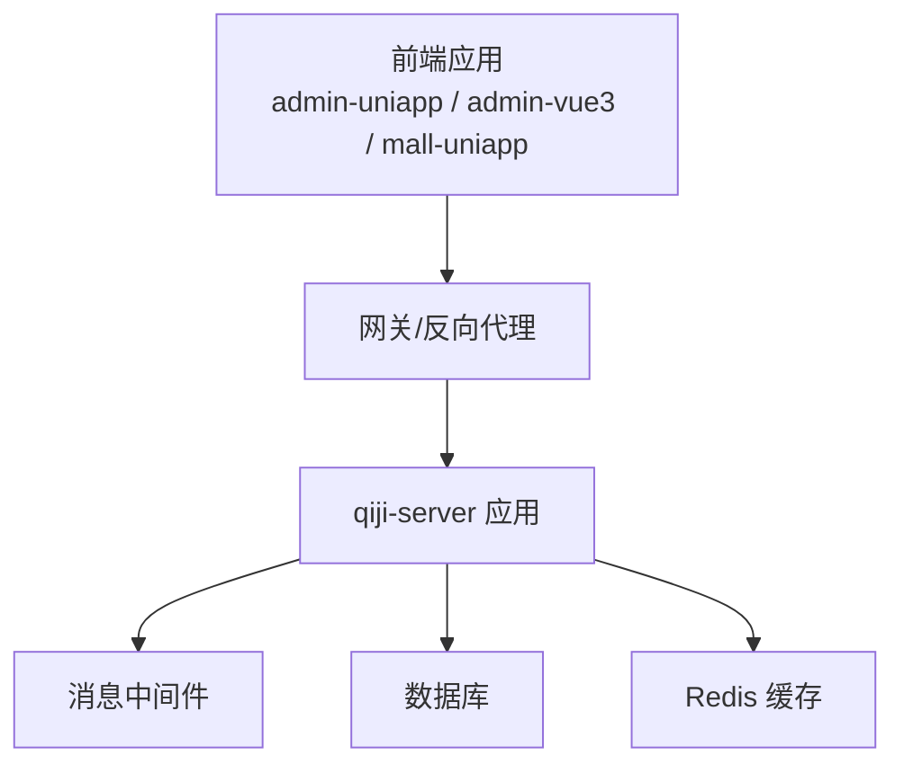
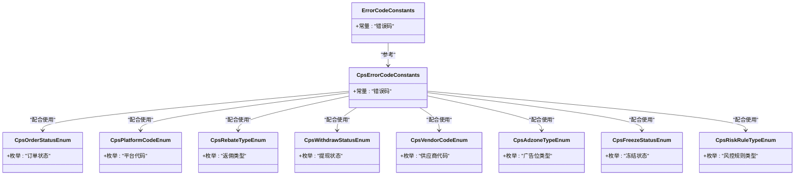
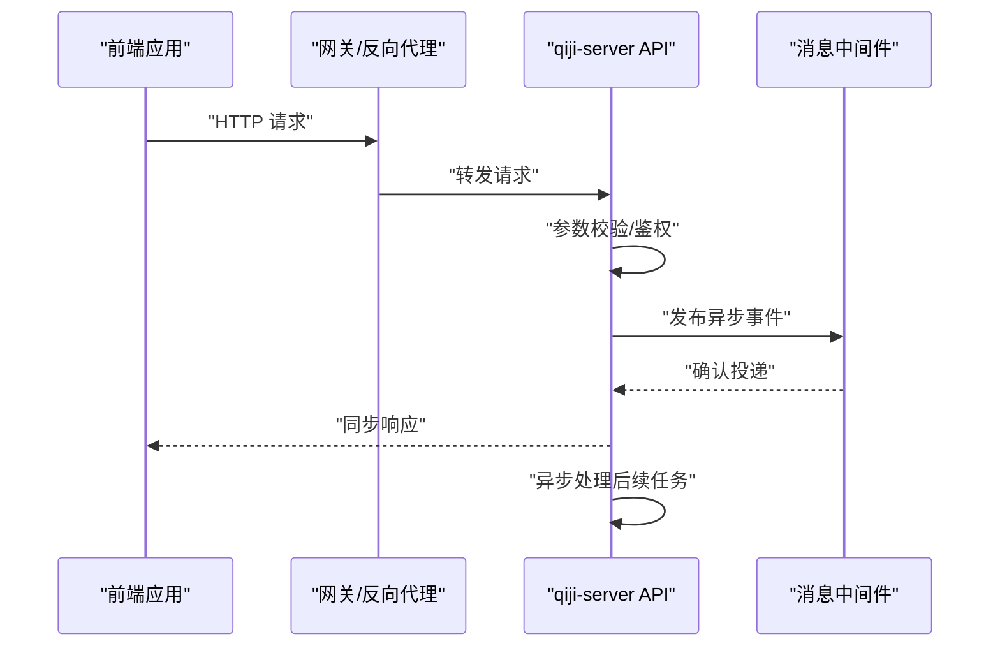
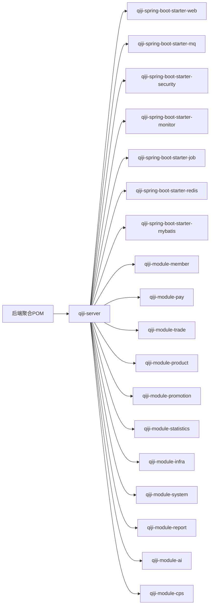

# 模块间通信

<cite>
**本文引用的文件**
- [README.md](file://README.md)
- [package-info.java](file://backend/qiji-framework/qiji-spring-boot-starter-web/src/main/java/com/qiji/cps/framework/web/package-info.java)
- [pom.xml](file://backend/pom.xml)
- [docker-compose.yml](file://backend/script/docker/docker-compose.yml)
- [docker.env](file://backend/script/docker/docker.env)
- [Dockerfile](file://backend/qiji-server/Dockerfile)
- [Jenkinsfile](file://backend/script/jenkins/Jenkinsfile)
- [deploy.sh](file://backend/script/shell/deploy.sh)
- [CpsErrorCodeConstants.java](file://backend/qiji-module-cps/qiji-module-cps-api/src/main/java/com/qiji/cps/module/cps/enums/CpsErrorCodeConstants.java)
- [CpsOrderStatusEnum.java](file://backend/qiji-module-cps/qiji-module-cps-api/src/main/java/com/qiji/cps/module/cps/enums/CpsOrderStatusEnum.java)
- [CpsPlatformCodeEnum.java](file://backend/qiji-module-cps/qiji-module-cps-api/src/main/java/com/qiji/cps/module/cps/enums/CpsPlatformCodeEnum.java)
- [CpsRebateTypeEnum.java](file://backend/qiji-module-cps/qiji-module-cps-api/src/main/java/com/qiji/cps/module/cps/enums/CpsRebateTypeEnum.java)
- [CpsWithdrawStatusEnum.java](file://backend/qiji-module-cps/qiji-module-cps-api/src/main/java/com/qiji/cps/module/cps/enums/CpsWithdrawStatusEnum.java)
- [CpsVendorCodeEnum.java](file://backend/qiji-module-cps/qiji-module-cps-api/src/main/java/com/qiji/cps/module/cps/enums/CpsVendorCodeEnum.java)
- [CpsAdzoneTypeEnum.java](file://backend/qiji-module-cps/qiji-module-cps-api/src/main/java/com/qiji/cps/module/cps/enums/CpsAdzoneTypeEnum.java)
- [CpsFreezeStatusEnum.java](file://backend/qiji-module-cps/qiji-module-cps-api/src/main/java/com/qiji/cps/module/cps/enums/CpsFreezeStatusEnum.java)
- [CpsRiskRuleTypeEnum.java](file://backend/qiji-module-cps/qiji-module-cps-api/src/main/java/com/qiji/cps/module/cps/enums/CpsRiskRuleTypeEnum.java)
- [ErrorCodeConstants.java](file://backend/qiji-module-mp/src/main/java/com/qiji/cps/module/mp/enums/ErrorCodeConstants.java)
- [CpsAdzoneTypeEnum.java](file://backend/qiji-module-cps/qiji-module-cps-api/src/main/java/com/qiji/cps/module/cps/enums/CpsAdzoneTypeEnum.java)
- [CpsOrderStatusEnum.java](file://backend/qiji-module-cps/qiji-module-cps-api/src/main/java/com/qiji/cps/module/cps/enums/CpsOrderStatusEnum.java)
- [CpsPlatformCodeEnum.java](file://backend/qiji-module-cps/qiji-module-cps-api/src/main/java/com/qiji/cps/module/cps/enums/CpsPlatformCodeEnum.java)
- [CpsRebateTypeEnum.java](file://backend/qiji-module-cps/qiji-module-cps-api/src/main/java/com/qiji/cps/module/cps/enums/CpsRebateTypeEnum.java)
- [CpsWithdrawStatusEnum.java](file://backend/qiji-module-cps/qiji-module-cps-api/src/main/java/com/qiji/cps/module/cps/enums/CpsWithdrawStatusEnum.java)
- [CpsVendorCodeEnum.java](file://backend/qiji-module-cps/qiji-module-cps-api/src/main/java/com/qiji/cps/module/cps/enums/CpsVendorCodeEnum.java)
- [CpsFreezeStatusEnum.java](file://backend/qiji-module-cps/qiji-module-cps-api/src/main/java/com/qiji/cps/module/cps/enums/CpsFreezeStatusEnum.java)
- [CpsRiskRuleTypeEnum.java](file://backend/qiji-module-cps/qiji-module-cps-api/src/main/java/com/qiji/cps/module/cps/enums/CpsRiskRuleTypeEnum.java)
- [ErrorCodeConstants.java](file://backend/qiji-module-mp/src/main/java/com/qiji/cps/module/mp/enums/ErrorCodeConstants.java)
- [CpsAdzoneTypeEnum.java](file://backend/qiji-module-cps/qiji-module-cps-api/src/main/java/com/qiji/cps/module/cps/enums/CpsAdzoneTypeEnum.java)
- [CpsOrderStatusEnum.java](file://backend/qiji-module-cps/qiji-module-cps-api/src/main/java/com/qiji/cps/module/cps/enums/CpsOrderStatusEnum.java)
- [CpsPlatformCodeEnum.java](file://backend/qiji-module-cps/qiji-module-cps-api/src/main/java/com/qiji/cps/module/cps/enums/CpsPlatformCodeEnum.java)
- [CpsRebateTypeEnum.java](file://backend/qiji-module-cps/qiji-module-cps-api/src/main/java/com/qiji/cps/module/cps/enums/CpsRebateTypeEnum.java)
- [CpsWithdrawStatusEnum.java](file://backend/qiji-module-cps/qiji-module-cps-api/src/main/java/com/qiji/cps/module/cps/enums/CpsWithdrawStatusEnum.java)
- [CpsVendorCodeEnum.java](file://backend/qiji-module-cps/qiji-module-cps-api/src/main/java/com/qiji/cps/module/cps/enums/CpsVendorCodeEnum.java)
- [CpsFreezeStatusEnum.java](file://backend/qiji-module-cps/qiji-module-cps-api/src/main/java/com/qiji/cps/module/cps/enums/CpsFreezeStatusEnum.java)
- [CpsRiskRuleTypeEnum.java](file://backend/qiji-module-cps/qiji-module-cps-api/src/main/java/com/qiji/cps/module/cps/enums/CpsRiskRuleTypeEnum.java)
- [ErrorCodeConstants.java](file://backend/qiji-module-mp/src/main/java/com/qiji/cps/module/mp/enums/ErrorCodeConstants.java)
</cite>

## 目录
1. [引言](#引言)
2. [项目结构](#项目结构)
3. [核心组件](#核心组件)
4. [架构总览](#架构总览)
5. [详细组件分析](#详细组件分析)
6. [依赖分析](#依赖分析)
7. [性能考虑](#性能考虑)
8. [故障排查指南](#故障排查指南)
9. [结论](#结论)
10. [附录](#附录)

## 引言
本文件聚焦于AgenticCPS项目的模块间通信机制，系统性梳理模块边界、接口设计、API规范与通信协议，并结合现有后端框架与部署脚本，给出RESTful API设计原则、参数传递机制、错误处理策略与版本管理建议。同时，围绕事件驱动与异步通信、服务发现与负载均衡、熔断与降级等微服务相关设计进行概念性说明与最佳实践建议。

## 项目结构
AgenticCPS采用多模块Maven工程组织，后端以Spring Boot为基础，通过统一的框架模块提供Web、消息队列、安全、监控、定时任务等能力；前端包含多个应用（admin-uniapp、admin-vue3、mall-uniapp），并通过HTTP与后端交互；部署层提供Docker容器化与编排配置。

```mermaid
graph TB
subgraph "后端"
QijiServer["qiji-server<br/>应用入口"]
WebStarter["qiji-spring-boot-starter-web<br/>Web封装"]
MQStarter["qiji-spring-boot-starter-mq<br/>消息队列"]
SecurityStarter["qiji-spring-boot-starter-security<br/>安全"]
MonitorStarter["qiji-spring-boot-starter-monitor<br/>监控"]
JobStarter["qiji-spring-boot-starter-job<br/>定时任务"]
RedisStarter["qiji-spring-boot-starter-redis<br/>缓存"]
MyBatisStarter["qiji-spring-boot-starter-mybatis<br/>持久层"]
ModuleMember["qiji-module-member<br/>会员模块"]
ModulePay["qiji-module-pay<br/>支付模块"]
ModuleTrade["qiji-module-trade<br/>交易模块"]
ModuleProduct["qiji-module-product<br/>商品模块"]
ModulePromotion["qiji-module-promotion<br/>促销模块"]
ModuleStatistics["qiji-module-statistics<br/>统计模块"]
ModuleInfra["qiji-module-infra<br/>基础设施"]
ModuleSystem["qiji-module-system<br/>系统模块"]
ModuleReport["qiji-module-report<br/>报表模块"]
ModuleAI["qiji-module-ai<br/>AI模块"]
ModuleCPS["qiji-module-cps<br/>CPS模块"]
end
subgraph "前端"
AdminUniapp["admin-uniapp"]
AdminVue3["admin-vue3"]
MallUniapp["mall-uniapp"]
end
AdminUniapp --> QijiServer
AdminVue3 --> QijiServer
MallUniapp --> QijiServer
QijiServer --> WebStarter
QijiServer --> MQStarter
QijiServer --> SecurityStarter
QijiServer --> MonitorStarter
QijiServer --> JobStarter
QijiServer --> RedisStarter
QijiServer --> MyBatisStarter
ModuleMember --> QijiServer
ModulePay --> QijiServer
ModuleTrade --> QijiServer
ModuleProduct --> QijiServer
ModulePromotion --> QijiServer
ModuleStatistics --> QijiServer
ModuleInfra --> QijiServer
ModuleSystem --> QijiServer
ModuleReport --> QijiServer
ModuleAI --> QijiServer
ModuleCPS --> QijiServer
```

图表来源
- [pom.xml](file://backend/pom.xml)
- [docker-compose.yml](file://backend/script/docker/docker-compose.yml)
- [Dockerfile](file://backend/qiji-server/Dockerfile)

章节来源
- [pom.xml](file://backend/pom.xml)
- [docker-compose.yml](file://backend/script/docker/docker-compose.yml)
- [Dockerfile](file://backend/qiji-server/Dockerfile)

## 核心组件
- Web封装与REST API：基于Spring MVC的统一Web封装，提供请求处理、参数校验与响应格式化能力。
- 消息队列与事件驱动：通过消息中间件实现跨模块异步解耦，支持事件发布/订阅与可靠投递。
- 安全与鉴权：统一的安全框架，提供认证、授权与签名保护。
- 监控与可观测性：链路追踪、指标采集与健康检查，支撑灰度与故障定位。
- 定时任务与异步执行：分布式任务调度与异步方法调用，提升吞吐与用户体验。
- 缓存与数据库：Redis缓存与MyBatis持久层，平衡一致性与性能。
- 模块化业务域：会员、支付、交易、商品、促销、统计、基础设施、系统、报表、AI、CPS等模块按职责划分。

章节来源
- [package-info.java](file://backend/qiji-framework/qiji-spring-boot-starter-web/src/main/java/com/qiji/cps/framework/web/package-info.java)
- [pom.xml](file://backend/pom.xml)

## 架构总览
后端以qiji-server为核心入口，聚合各功能模块；前端通过HTTP协议与后端交互；部署层使用Docker与Compose进行容器化与编排。模块间通过REST API同步调用与消息队列异步事件实现松耦合通信。

图表来源
- [docker-compose.yml](file://backend/script/docker/docker-compose.yml)
- [Dockerfile](file://backend/qiji-server/Dockerfile)

## 详细组件分析

### RESTful API 设计与接口规范
- 设计原则
  - 资源导向：以名词定义资源路径，动词用于操作语义（如GET/POST/PUT/DELETE）。
  - 版本化：在URL或Header中引入版本控制，保证向后兼容与平滑升级。
  - 统一响应：约定统一的响应结构（状态码、消息、数据体），便于前端解析与错误处理。
  - 参数校验：对入参进行严格校验，返回明确的错误信息与字段提示。
  - 文档化：结合Swagger等工具生成接口文档，确保契约清晰。
- 参数传递机制
  - 查询参数：用于筛选与分页（如page、size、keyword）。
  - 路径参数：用于定位具体资源（如{id}）。
  - 请求体：用于创建/更新资源，遵循JSON结构与字段命名规范。
  - 头部参数：用于鉴权（Authorization）、版本（Version）、语言（Accept-Language）等。
- 错误处理策略
  - 使用统一异常处理器捕获业务异常与系统异常，返回标准化错误码与消息。
  - 区分客户端错误（4xx）与服务端错误（5xx），并记录日志便于追踪。
  - 对敏感信息脱敏，避免泄露内部细节。
- 版本管理
  - 采用URL前缀版本化（如/api/v1/...）或Header版本化（如X-API-Version），在模块间保持一致。
  - 旧版本在生命周期内保留过渡期，逐步下线。

章节来源
- [package-info.java](file://backend/qiji-framework/qiji-spring-boot-starter-web/src/main/java/com/qiji/cps/framework/web/package-info.java)

### 模块间数据共享与事件驱动
- 数据共享
  - 读写分离：通过MyBatis多数据源实现读写分离，降低主库压力。
  - 缓存穿透与热点：利用Redis缓存热点数据，设置合理TTL与缓存失效策略。
  - 幂等设计：对外暴露的幂等接口需具备唯一键与去重逻辑，防止重复处理。
- 事件驱动
  - 模块内事件：使用Spring事件机制实现模块内部解耦。
  - 跨模块事件：通过消息队列发布/订阅跨模块事件，保障最终一致性。
  - 事务消息：在强一致场景下采用事务消息或本地事务表，避免消息丢失或重复消费。
- 异步通信模式
  - 异步方法：对非关键路径操作使用异步执行，减少请求延迟。
  - 批量处理：对高频小请求进行批量合并，提升吞吐与降低成本。

章节来源
- [pom.xml](file://backend/pom.xml)

### 微服务相关设计考虑
- 服务发现与负载均衡
  - 在容器化环境中，通过服务名进行内部通信；结合反向代理或网关实现请求转发与健康检查。
  - 负载均衡可由反向代理或Kubernetes Service完成，默认轮询或基于权重策略。
- 熔断与降级
  - 对外依赖（第三方支付、短信、邮件）实施熔断与超时控制，避免级联故障。
  - 降级策略包括快速失败、兜底数据与延迟补偿，保证核心流程可用。
- 配置中心与环境隔离
  - 将配置集中管理，区分开发、测试、生产环境，避免硬编码。
- 安全与限流
  - 结合安全框架进行鉴权与签名验证；对高频接口实施限流与黑白名单策略。

章节来源
- [docker-compose.yml](file://backend/script/docker/docker-compose.yml)
- [docker.env](file://backend/script/docker/docker.env)

### 模块枚举与错误码规范
CPS模块与小程序模块均提供枚举类，用于统一状态、平台、类型与错误码，便于模块间对齐与协作。

图表来源
- [CpsErrorCodeConstants.java](file://backend/qiji-module-cps/qiji-module-cps-api/src/main/java/com/qiji/cps/module/cps/enums/CpsErrorCodeConstants.java)
- [CpsOrderStatusEnum.java](file://backend/qiji-module-cps/qiji-module-cps-api/src/main/java/com/qiji/cps/module/cps/enums/CpsOrderStatusEnum.java)
- [CpsPlatformCodeEnum.java](file://backend/qiji-module-cps/qiji-module-cps-api/src/main/java/com/qiji/cps/module/cps/enums/CpsPlatformCodeEnum.java)
- [CpsRebateTypeEnum.java](file://backend/qiji-module-cps/qiji-module-cps-api/src/main/java/com/qiji/cps/module/cps/enums/CpsRebateTypeEnum.java)
- [CpsWithdrawStatusEnum.java](file://backend/qiji-module-cps/qiji-module-cps-api/src/main/java/com/qiji/cps/module/cps/enums/CpsWithdrawStatusEnum.java)
- [CpsVendorCodeEnum.java](file://backend/qiji-module-cps/qiji-module-cps-api/src/main/java/com/qiji/cps/module/cps/enums/CpsVendorCodeEnum.java)
- [CpsAdzoneTypeEnum.java](file://backend/qiji-module-cps/qiji-module-cps-api/src/main/java/com/qiji/cps/module/cps/enums/CpsAdzoneTypeEnum.java)
- [CpsFreezeStatusEnum.java](file://backend/qiji-module-cps/qiji-module-cps-api/src/main/java/com/qiji/cps/module/cps/enums/CpsFreezeStatusEnum.java)
- [CpsRiskRuleTypeEnum.java](file://backend/qiji-module-cps/qiji-module-cps-api/src/main/java/com/qiji/cps/module/cps/enums/CpsRiskRuleTypeEnum.java)
- [ErrorCodeConstants.java](file://backend/qiji-module-mp/src/main/java/com/qiji/cps/module/mp/enums/ErrorCodeConstants.java)

章节来源
- [CpsErrorCodeConstants.java](file://backend/qiji-module-cps/qiji-module-cps-api/src/main/java/com/qiji/cps/module/cps/enums/CpsErrorCodeConstants.java)
- [CpsOrderStatusEnum.java](file://backend/qiji-module-cps/qiji-module-cps-api/src/main/java/com/qiji/cps/module/cps/enums/CpsOrderStatusEnum.java)
- [CpsPlatformCodeEnum.java](file://backend/qiji-module-cps/qiji-module-cps-api/src/main/java/com/qiji/cps/module/cps/enums/CpsPlatformCodeEnum.java)
- [CpsRebateTypeEnum.java](file://backend/qiji-module-cps/qiji-module-cps-api/src/main/java/com/qiji/cps/module/cps/enums/CpsRebateTypeEnum.java)
- [CpsWithdrawStatusEnum.java](file://backend/qiji-module-cps/qiji-module-cps-api/src/main/java/com/qiji/cps/module/cps/enums/CpsWithdrawStatusEnum.java)
- [CpsVendorCodeEnum.java](file://backend/qiji-module-cps/qiji-module-cps-api/src/main/java/com/qiji/cps/module/cps/enums/CpsVendorCodeEnum.java)
- [CpsAdzoneTypeEnum.java](file://backend/qiji-module-cps/qiji-module-cps-api/src/main/java/com/qiji/cps/module/cps/enums/CpsAdzoneTypeEnum.java)
- [CpsFreezeStatusEnum.java](file://backend/qiji-module-cps/qiji-module-cps-api/src/main/java/com/qiji/cps/module/cps/enums/CpsFreezeStatusEnum.java)
- [CpsRiskRuleTypeEnum.java](file://backend/qiji-module-cps/qiji-module-cps-api/src/main/java/com/qiji/cps/module/cps/enums/CpsRiskRuleTypeEnum.java)
- [ErrorCodeConstants.java](file://backend/qiji-module-mp/src/main/java/com/qiji/cps/module/mp/enums/ErrorCodeConstants.java)

### API 调用序列示例（概念性）
以下序列图展示前端到后端再到消息队列的典型调用链，体现同步与异步混合通信模式。

图表来源
- [docker-compose.yml](file://backend/script/docker/docker-compose.yml)
- [Dockerfile](file://backend/qiji-server/Dockerfile)

## 依赖分析
后端通过Maven聚合管理各模块依赖，qiji-server作为应用入口聚合框架与业务模块；各模块间通过API枚举与统一错误码实现契约对齐。

图表来源
- [pom.xml](file://backend/pom.xml)

章节来源
- [pom.xml](file://backend/pom.xml)

## 性能考虑
- 同步接口优化
  - 合理分页与索引，避免全表扫描；对高频查询使用缓存。
  - 控制响应体大小，必要时采用分页与懒加载。
- 异步处理
  - 将耗时操作放入消息队列异步执行，缩短请求时延。
  - 对批量操作进行批量化与去抖动处理。
- 缓存策略
  - L1/L2缓存分层，热点数据短TTL，冷数据长TTL。
  - 写穿/写回策略结合业务一致性要求选择。
- 监控与压测
  - 建立关键指标（QPS、P95/P99、错误率、熔断触发次数）监控告警。
  - 定期进行压测，识别瓶颈并优化。

## 故障排查指南
- 接口错误
  - 检查统一异常处理是否正确返回错误码与消息。
  - 校验请求参数与鉴权头是否完整。
- 消息队列
  - 关注投递确认与消费确认，排查死信队列与重复消费。
  - 核对主题/队列名称与消费者组配置。
- 数据一致性
  - 对账与对称操作，必要时引入补偿任务。
  - 记录关键操作日志，便于回溯。
- 部署与环境
  - 检查容器健康检查与重启策略。
  - 对比docker-compose与环境变量配置，确保服务连通。

章节来源
- [Jenkinsfile](file://backend/script/jenkins/Jenkinsfile)
- [deploy.sh](file://backend/script/shell/deploy.sh)

## 结论
AgenticCPS通过模块化架构与统一的框架能力，实现了前后端分离与模块间松耦合通信。RESTful API与消息队列共同构成同步与异步双通道；通过枚举与错误码规范统一了模块契约；结合容器化与编排提升了交付效率。建议在现有基础上进一步完善服务治理（服务发现、负载均衡、熔断降级）与版本化策略，持续优化性能与稳定性。

## 附录
- 部署与运维
  - 使用Docker与Compose进行本地与CI/CD部署。
  - 通过Jenkinsfile与Shell脚本自动化构建与发布。
- 参考文档
  - 项目根目录README提供整体背景与目标。
  - 各模块API枚举与错误码为模块间通信提供契约基础。

章节来源
- [README.md](file://README.md)
- [docker-compose.yml](file://backend/script/docker/docker-compose.yml)
- [Jenkinsfile](file://backend/script/jenkins/Jenkinsfile)
- [deploy.sh](file://backend/script/shell/deploy.sh)