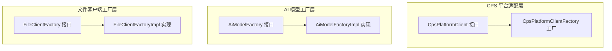
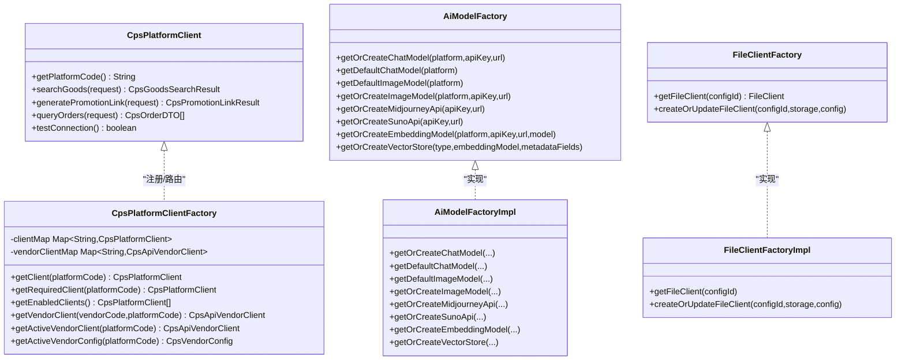
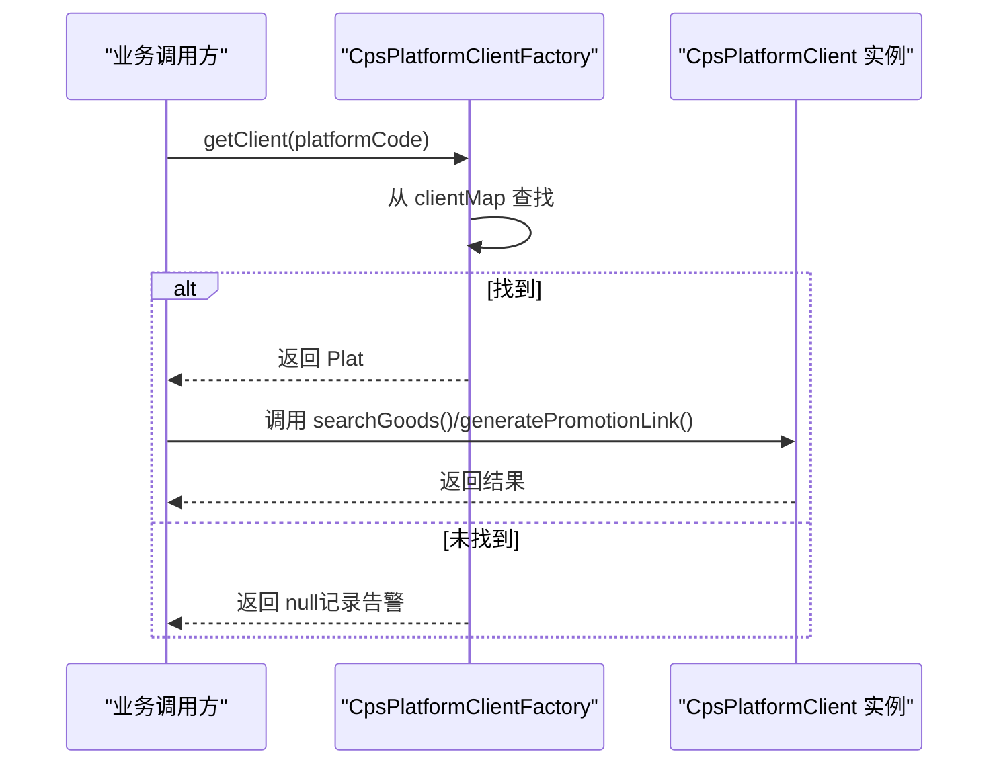
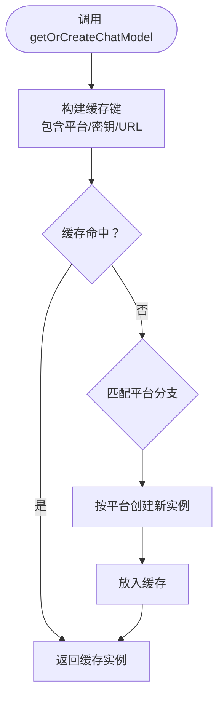
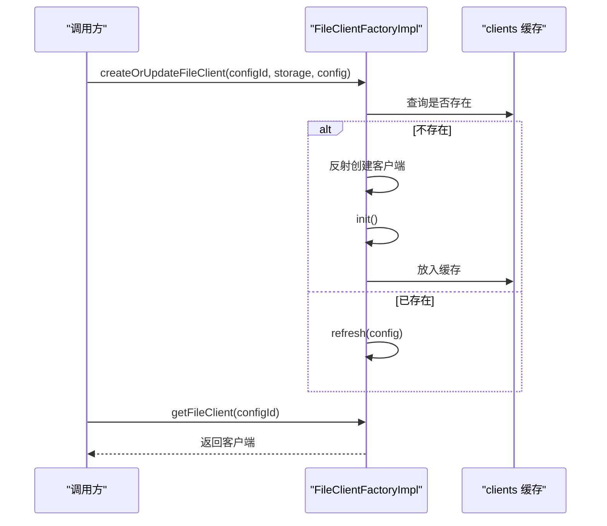
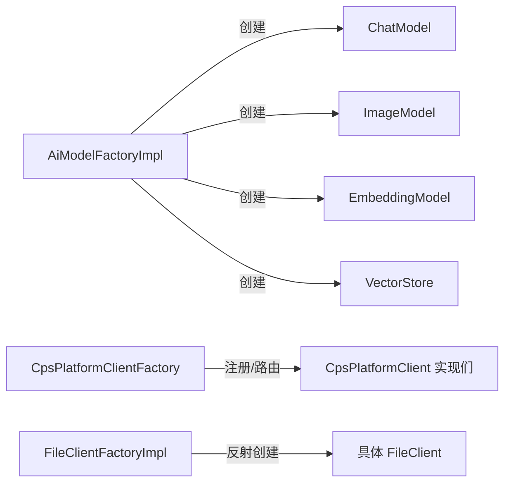

# 设计模式

<cite>
**本文引用的文件**   
- [CpsPlatformClient.java](file://backend/qiji-module-cps/qiji-module-cps-biz/src/main/java/com/qiji/cps/module/cps/client/CpsPlatformClient.java)
- [CpsPlatformClientFactory.java](file://backend/qiji-module-cps/qiji-module-cps-biz/src/main/java/com/qiji/cps/module/cps/client/CpsPlatformClientFactory.java)
- [AiModelFactory.java](file://backend/qiji-module-ai/src/main/java/com/qiji/cps/module/ai/framework/ai/core/model/AiModelFactory.java)
- [AiModelFactoryImpl.java](file://backend/qiji-module-ai/src/main/java/com/qiji/cps/module/ai/framework/ai/core/model/AiModelFactoryImpl.java)
- [FileClientFactory.java](file://backend/qiji-module-infra/src/main/java/com/qiji/cps/module/infra/framework/file/core/client/FileClientFactory.java)
- [FileClientFactoryImpl.java](file://backend/qiji-module-infra/src/main/java/com/qiji/cps/module/infra/framework/file/core/client/FileClientFactoryImpl.java)
</cite>

## 目录
1. [简介](#简介)
2. [项目结构](#项目结构)
3. [核心组件](#核心组件)
4. [架构总览](#架构总览)
5. [详细组件分析](#详细组件分析)
6. [依赖关系分析](#依赖关系分析)
7. [性能考量](#性能考量)
8. [故障排查指南](#故障排查指南)
9. [结论](#结论)
10. [附录](#附录)

## 简介
本文件聚焦 AgenticCPS 项目中设计模式的应用与落地，重点覆盖以下模式：
- 策略模式：平台适配器与平台客户端的策略接口与工厂注册中心
- 工厂模式：AI 模型工厂、文件客户端工厂、支付/短信/快递等客户端工厂
- 单例模式：通过缓存键与静态工厂方法实现的“按参数缓存”的单例式对象管理
- 观察者模式：Spring 事件发布/监听（在系统中以事件驱动方式体现）

文档将结合具体代码路径，给出实现要点、优缺点、适用场景、技术考量与最佳实践。

## 项目结构
围绕设计模式的关键模块与文件如下：
- CPS 平台适配器与工厂：CpsPlatformClient 接口与 CpsPlatformClientFactory 工厂
- AI 模型工厂：AiModelFactory 接口与 AiModelFactoryImpl 实现
- 文件客户端工厂：FileClientFactory 接口与 FileClientFactoryImpl 实现
- 其他工厂：支付、短信、快递等客户端工厂（同构模式，可复用本文分析方法）

**图示来源**
- [CpsPlatformClient.java:14-55](file://backend/qiji-module-cps/qiji-module-cps-biz/src/main/java/com/qiji/cps/module/cps/client/CpsPlatformClient.java#L14-L55)
- [CpsPlatformClientFactory.java:30-197](file://backend/qiji-module-cps/qiji-module-cps-biz/src/main/java/com/qiji/cps/module/cps/client/CpsPlatformClientFactory.java#L30-L197)
- [AiModelFactory.java:18-113](file://backend/qiji-module-ai/src/main/java/com/qiji/cps/module/ai/framework/ai/core/model/AiModelFactory.java#L18-L113)
- [AiModelFactoryImpl.java:141-846](file://backend/qiji-module-ai/src/main/java/com/qiji/cps/module/ai/framework/ai/core/model/AiModelFactoryImpl.java#L141-L846)
- [FileClientFactory.java:5-24](file://backend/qiji-module-infra/src/main/java/com/qiji/cps/module/infra/framework/file/core/client/FileClientFactory.java#L5-L24)
- [FileClientFactoryImpl.java:17-56](file://backend/qiji-module-infra/src/main/java/com/qiji/cps/module/infra/framework/file/core/client/FileClientFactoryImpl.java#L17-L56)

**章节来源**
- [CpsPlatformClient.java:1-55](file://backend/qiji-module-cps/qiji-module-cps-biz/src/main/java/com/qiji/cps/module/cps/client/CpsPlatformClient.java#L1-L55)
- [CpsPlatformClientFactory.java:1-198](file://backend/qiji-module-cps/qiji-module-cps-biz/src/main/java/com/qiji/cps/module/cps/client/CpsPlatformClientFactory.java#L1-L198)
- [AiModelFactory.java:1-114](file://backend/qiji-module-ai/src/main/java/com/qiji/cps/module/ai/framework/ai/core/model/AiModelFactory.java#L1-L114)
- [AiModelFactoryImpl.java:1-846](file://backend/qiji-module-ai/src/main/java/com/qiji/cps/module/ai/framework/ai/core/model/AiModelFactoryImpl.java#L1-L846)
- [FileClientFactory.java:1-25](file://backend/qiji-module-infra/src/main/java/com/qiji/cps/module/infra/framework/file/core/client/FileClientFactory.java#L1-L25)
- [FileClientFactoryImpl.java:1-57](file://backend/qiji-module-infra/src/main/java/com/qiji/cps/module/infra/framework/file/core/client/FileClientFactoryImpl.java#L1-L57)

## 核心组件
- 策略接口与工厂注册中心：CpsPlatformClient 作为策略接口，CpsPlatformClientFactory 作为注册中心与路由入口，支持平台维度与供应商维度双路由。
- 工厂接口与实现：AiModelFactory/AiModelFactoryImpl 提供多种 AI 模型与向量库的统一创建入口；FileClientFactory/FileClientFactoryImpl 提供文件客户端的统一创建与缓存。
- 单例式缓存：AiModelFactoryImpl 使用缓存键+惰性初始化的方式，实现“按参数缓存”的单例式对象管理。
- 事件驱动：系统广泛采用 Spring 事件发布/监听，体现观察者模式思想，用于解耦模块间通信。

**章节来源**
- [CpsPlatformClient.java:14-55](file://backend/qiji-module-cps/qiji-module-cps-biz/src/main/java/com/qiji/cps/module/cps/client/CpsPlatformClient.java#L14-L55)
- [CpsPlatformClientFactory.java:30-197](file://backend/qiji-module-cps/qiji-module-cps-biz/src/main/java/com/qiji/cps/module/cps/client/CpsPlatformClientFactory.java#L30-L197)
- [AiModelFactory.java:18-113](file://backend/qiji-module-ai/src/main/java/com/qiji/cps/module/ai/framework/ai/core/model/AiModelFactory.java#L18-L113)
- [AiModelFactoryImpl.java:141-846](file://backend/qiji-module-ai/src/main/java/com/qiji/cps/module/ai/framework/ai/core/model/AiModelFactoryImpl.java#L141-L846)
- [FileClientFactory.java:5-24](file://backend/qiji-module-infra/src/main/java/com/qiji/cps/module/infra/framework/file/core/client/FileClientFactory.java#L5-L24)
- [FileClientFactoryImpl.java:17-56](file://backend/qiji-module-infra/src/main/java/com/qiji/cps/module/infra/framework/file/core/client/FileClientFactoryImpl.java#L17-L56)

## 架构总览
CPS 平台适配器采用“策略接口 + 工厂注册中心”的架构，业务侧通过平台编码或供应商+平台组合获取适配器实例，实现对新平台的零侵入接入。AI 模型工厂与文件客户端工厂遵循相同模式，分别负责模型与客户端的统一创建与缓存。

**图示来源**
- [CpsPlatformClient.java:14-55](file://backend/qiji-module-cps/qiji-module-cps-biz/src/main/java/com/qiji/cps/module/cps/client/CpsPlatformClient.java#L14-L55)
- [CpsPlatformClientFactory.java:30-197](file://backend/qiji-module-cps/qiji-module-cps-biz/src/main/java/com/qiji/cps/module/cps/client/CpsPlatformClientFactory.java#L30-L197)
- [AiModelFactory.java:18-113](file://backend/qiji-module-ai/src/main/java/com/qiji/cps/module/ai/framework/ai/core/model/AiModelFactory.java#L18-L113)
- [AiModelFactoryImpl.java:141-846](file://backend/qiji-module-ai/src/main/java/com/qiji/cps/module/ai/framework/ai/core/model/AiModelFactoryImpl.java#L141-L846)
- [FileClientFactory.java:5-24](file://backend/qiji-module-infra/src/main/java/com/qiji/cps/module/infra/framework/file/core/client/FileClientFactory.java#L5-L24)
- [FileClientFactoryImpl.java:17-56](file://backend/qiji-module-infra/src/main/java/com/qiji/cps/module/infra/framework/file/core/client/FileClientFactoryImpl.java#L17-L56)

## 详细组件分析

### 策略模式：CPS 平台适配器与工厂注册中心
- 设计要点
  - 策略接口：CpsPlatformClient 定义平台能力边界（搜索商品、生成推广链接、订单查询、连通性测试），便于扩展新平台。
  - 工厂注册中心：CpsPlatformClientFactory 在启动阶段收集所有实现并注册，提供平台维度与供应商维度的双路由能力。
  - 运行期路由：业务侧通过平台编码或 vendorCode+platformCode 组合获取适配器，实现“开放-封闭”原则。
- 优点
  - 易扩展：新增平台只需实现策略接口并注册为 Spring Bean。
  - 解耦：业务层不感知具体平台差异。
  - 可观测：日志记录注册与缺失情况，便于运维。
- 缺点
  - 需要保证策略接口稳定，避免频繁变更。
  - 若平台差异过大，策略实现可能复杂化。
- 适用场景
  - 多平台/多供应商适配（电商、支付、短信、快递等）。
- 技术考量与最佳实践
  - 将平台编码标准化并与枚举绑定，确保一致性。
  - 在工厂中增加“必须存在”的获取方法，避免空指针传播。
  - 供应商维度路由需与平台配置联动，确保运行时配置正确。

**图示来源**
- [CpsPlatformClientFactory.java:90-110](file://backend/qiji-module-cps/qiji-module-cps-biz/src/main/java/com/qiji/cps/module/cps/client/CpsPlatformClientFactory.java#L90-L110)
- [CpsPlatformClient.java:29-52](file://backend/qiji-module-cps/qiji-module-cps-biz/src/main/java/com/qiji/cps/module/cps/client/CpsPlatformClient.java#L29-L52)

**章节来源**
- [CpsPlatformClient.java:14-55](file://backend/qiji-module-cps/qiji-module-cps-biz/src/main/java/com/qiji/cps/module/cps/client/CpsPlatformClient.java#L14-L55)
- [CpsPlatformClientFactory.java:30-197](file://backend/qiji-module-cps/qiji-module-cps-biz/src/main/java/com/qiji/cps/module/cps/client/CpsPlatformClientFactory.java#L30-L197)

### 工厂模式：AI 模型工厂
- 设计要点
  - 接口定义：AiModelFactory 统一暴露 ChatModel、ImageModel、EmbeddingModel、VectorStore、Midjourney/Suno API 的创建入口。
  - 实现策略：AiModelFactoryImpl 基于平台枚举与参数构建不同厂商的客户端，并通过缓存键实现“按参数缓存”的单例式管理。
- 优点
  - 统一入口：屏蔽不同 AI 平台差异。
  - 按需创建：支持默认配置与指定配置两种创建方式。
  - 资源复用：缓存避免重复创建昂贵对象。
- 缺点
  - 平台分支较多，维护成本高。
  - 配置项与 URL/密钥耦合，需谨慎管理。
- 适用场景
  - 多模型、多向量库、多平台混合的 AI 应用。
- 技术考量与最佳实践
  - 缓存键应包含所有影响对象状态的参数，避免误复用。
  - 对外部 SDK 的初始化失败进行兜底处理，避免全局异常。
  - 向量库选择上生产环境优先 Qdrant/Milvus 等，本地测试可用 SimpleVectorStore。

**图示来源**
- [AiModelFactory.java:18-113](file://backend/qiji-module-ai/src/main/java/com/qiji/cps/module/ai/framework/ai/core/model/AiModelFactory.java#L18-L113)
- [AiModelFactoryImpl.java:141-187](file://backend/qiji-module-ai/src/main/java/com/qiji/cps/module/ai/framework/ai/core/model/AiModelFactoryImpl.java#L141-L187)

**章节来源**
- [AiModelFactory.java:18-113](file://backend/qiji-module-ai/src/main/java/com/qiji/cps/module/ai/framework/ai/core/model/AiModelFactory.java#L18-L113)
- [AiModelFactoryImpl.java:141-846](file://backend/qiji-module-ai/src/main/java/com/qiji/cps/module/ai/framework/ai/core/model/AiModelFactoryImpl.java#L141-L846)

### 工厂模式：文件客户端工厂
- 设计要点
  - 接口定义：FileClientFactory 提供根据配置编号获取客户端与创建/更新客户端的能力。
  - 实现策略：FileClientFactoryImpl 使用并发 Map 缓存客户端，首次创建后初始化并缓存；后续更新通过刷新配置实现。
  - 反射创建：根据存储类型枚举反射构造具体客户端类，降低耦合。
- 优点
  - 按配置隔离：不同配置编号对应独立客户端实例。
  - 动态更新：支持运行时刷新配置。
  - 低耦合：通过枚举与反射解耦具体实现。
- 缺点
  - 反射创建需保证构造签名一致。
  - 缓存清理与销毁策略需明确。
- 适用场景
  - 多存储后端（本地/MinIO/OSS 等）的统一管理。
- 技术考量与最佳实践
  - 存储类型枚举与客户端类映射需严格维护。
  - 刷新逻辑需幂等，避免重复初始化。
  - 日志记录缺失与错误信息，便于定位问题。

**图示来源**
- [FileClientFactory.java:5-24](file://backend/qiji-module-infra/src/main/java/com/qiji/cps/module/infra/framework/file/core/client/FileClientFactory.java#L5-L24)
- [FileClientFactoryImpl.java:17-56](file://backend/qiji-module-infra/src/main/java/com/qiji/cps/module/infra/framework/file/core/client/FileClientFactoryImpl.java#L17-L56)

**章节来源**
- [FileClientFactory.java:5-24](file://backend/qiji-module-infra/src/main/java/com/qiji/cps/module/infra/framework/file/core/client/FileClientFactory.java#L5-L24)
- [FileClientFactoryImpl.java:17-56](file://backend/qiji-module-infra/src/main/java/com/qiji/cps/module/infra/framework/file/core/client/FileClientFactoryImpl.java#L17-L56)

### 单例模式：按参数缓存的“单例式”对象管理
- 设计要点
  - 通过缓存键（含平台、密钥、URL、模型名等）区分实例，避免误复用。
  - 使用惰性初始化与缓存容器，实现“按需创建、按键复用”的单例效果。
- 优点
  - 资源复用：减少重复创建开销。
  - 线程安全：缓存容器与键设计保证并发安全。
- 缺点
  - 缓存键设计需全面，遗漏参数可能导致实例错用。
  - 内存占用随参数组合增长。
- 适用场景
  - 外部 SDK 客户端、向量库、长连接服务等。
- 技术考量与最佳实践
  - 缓存键拼接规则统一，避免歧义。
  - 对外部依赖的异常进行隔离与降级。
  - 定期评估缓存命中率与内存占用。

**章节来源**
- [AiModelFactoryImpl.java:141-187](file://backend/qiji-module-ai/src/main/java/com/qiji/cps/module/ai/framework/ai/core/model/AiModelFactoryImpl.java#L141-L187)
- [AiModelFactoryImpl.java:337-342](file://backend/qiji-module-ai/src/main/java/com/qiji/cps/module/ai/framework/ai/core/model/AiModelFactoryImpl.java#L337-L342)

### 观察者模式：事件发布/监听（Spring 事件）
- 设计要点
  - 通过 Spring 事件机制实现模块间松耦合通信，典型场景包括异步通知、审计日志、指标上报等。
- 优点
  - 解耦：发布者无需关心订阅者实现。
  - 可扩展：新增监听器无需修改发布者。
- 缺点
  - 调试困难：事件传播链路较长。
  - 性能：事件过多可能带来额外开销。
- 适用场景
  - 日志与监控、异步任务、跨模块通知。
- 技术考量与最佳实践
  - 事件命名规范，语义清晰。
  - 监听器幂等，异常隔离。
  - 控制事件粒度，避免过度事件化。

[本节为概念性说明，不直接分析具体文件，故无“章节来源”]

## 依赖关系分析
- 组件内聚与耦合
  - 工厂与策略：策略接口与工厂实现内聚，策略实现与工厂之间弱耦合（通过 Spring 自动装配）。
  - 工厂与外部 SDK：工厂实现依赖具体 SDK 的自动配置与属性，但通过统一接口对外屏蔽差异。
- 外部依赖与集成点
  - AI 模型工厂依赖 Spring AI 生态与各平台自动配置。
  - 文件工厂依赖存储类型枚举与反射构造。
- 循环依赖风险
  - 工厂与策略之间无循环依赖；策略实现由工厂统一注册，避免相互引用。

**图示来源**
- [AiModelFactoryImpl.java:141-846](file://backend/qiji-module-ai/src/main/java/com/qiji/cps/module/ai/framework/ai/core/model/AiModelFactoryImpl.java#L141-L846)
- [CpsPlatformClientFactory.java:30-197](file://backend/qiji-module-cps/qiji-module-cps-biz/src/main/java/com/qiji/cps/module/cps/client/CpsPlatformClientFactory.java#L30-L197)
- [FileClientFactoryImpl.java:17-56](file://backend/qiji-module-infra/src/main/java/com/qiji/cps/module/infra/framework/file/core/client/FileClientFactoryImpl.java#L17-L56)

**章节来源**
- [AiModelFactoryImpl.java:141-846](file://backend/qiji-module-ai/src/main/java/com/qiji/cps/module/ai/framework/ai/core/model/AiModelFactoryImpl.java#L141-L846)
- [CpsPlatformClientFactory.java:30-197](file://backend/qiji-module-cps/qiji-module-cps-biz/src/main/java/com/qiji/cps/module/cps/client/CpsPlatformClientFactory.java#L30-L197)
- [FileClientFactoryImpl.java:17-56](file://backend/qiji-module-infra/src/main/java/com/qiji/cps/module/infra/framework/file/core/client/FileClientFactoryImpl.java#L17-L56)

## 性能考量
- 缓存命中与键设计
  - AI 模型工厂通过缓存键避免重复创建，提升启动与运行时性能；需确保键覆盖所有差异化参数。
- 并发与线程安全
  - 工厂内部使用并发容器与惰性初始化，保障多线程安全；注意缓存清理与销毁时机。
- 外部依赖抖动
  - 对第三方 SDK 的超时与重试策略进行合理配置，避免阻塞主线程。
- 向量库选择
  - 生产环境优先高性能向量库（如 Qdrant/Milvus），本地开发可使用轻量方案。

[本节提供通用指导，不直接分析具体文件，故无“章节来源”]

## 故障排查指南
- 平台适配器缺失
  - 现象：获取平台客户端为空并记录告警。
  - 排查：确认平台编码是否正确、策略实现是否被 Spring 扫描并注册。
  - 参考路径：[CpsPlatformClientFactory.java:90-110](file://backend/qiji-module-cps/qiji-module-cps-biz/src/main/java/com/qiji/cps/module/cps/client/CpsPlatformClientFactory.java#L90-L110)
- 供应商客户端缺失
  - 现象：供应商维度路由返回空。
  - 排查：核对 vendorCode:platformCode 键是否正确、供应商配置是否生效。
  - 参考路径：[CpsPlatformClientFactory.java:143-171](file://backend/qiji-module-cps/qiji-module-cps-biz/src/main/java/com/qiji/cps/module/cps/client/CpsPlatformClientFactory.java#L143-L171)
- AI 模型创建失败
  - 现象：按平台创建模型时报错。
  - 排查：检查密钥格式、URL 正确性、平台枚举值；查看缓存键是否包含必要参数。
  - 参考路径：[AiModelFactoryImpl.java:141-187](file://backend/qiji-module-ai/src/main/java/com/qiji/cps/module/ai/framework/ai/core/model/AiModelFactoryImpl.java#L141-L187)
- 文件客户端未找到
  - 现象：根据配置编号获取客户端为空。
  - 排查：确认配置编号存在、存储类型枚举映射正确、客户端已初始化。
  - 参考路径：[FileClientFactoryImpl.java:25-44](file://backend/qiji-module-infra/src/main/java/com/qiji/cps/module/infra/framework/file/core/client/FileClientFactoryImpl.java#L25-L44)

**章节来源**
- [CpsPlatformClientFactory.java:90-171](file://backend/qiji-module-cps/qiji-module-cps-biz/src/main/java/com/qiji/cps/module/cps/client/CpsPlatformClientFactory.java#L90-L171)
- [AiModelFactoryImpl.java:141-187](file://backend/qiji-module-ai/src/main/java/com/qiji/cps/module/ai/framework/ai/core/model/AiModelFactoryImpl.java#L141-L187)
- [FileClientFactoryImpl.java:25-44](file://backend/qiji-module-infra/src/main/java/com/qiji/cps/module/infra/framework/file/core/client/FileClientFactoryImpl.java#L25-L44)

## 结论
AgenticCPS 在多平台适配、AI 模型管理与文件客户端管理中系统性地应用了策略、工厂与单例模式，并通过 Spring 事件实现观察者模式的解耦。这些设计使系统具备良好的扩展性与可维护性，建议在新增平台或客户端时遵循现有模式，统一接口、工厂与缓存键设计，确保一致性与稳定性。

[本节为总结性内容，不直接分析具体文件，故无“章节来源”]

## 附录
- 设计模式选择的技术考量
  - 开放-封闭原则：策略接口与工厂注册中心满足对扩展开放、对修改封闭。
  - 单一职责：工厂只负责创建与缓存，策略只负责行为定义。
  - 可测试性：接口与工厂便于单元测试与集成测试。
- 最佳实践清单
  - 统一接口与枚举，避免魔法字符串。
  - 缓存键覆盖所有差异化参数，避免误复用。
  - 对外部依赖进行超时与重试配置，增强鲁棒性。
  - 事件命名与监听器幂等，避免副作用。

[本节为通用建议，不直接分析具体文件，故无“章节来源”]