# CPS 联盟返利系统

<cite>
**本文引用的文件**
- [README.md](file://README.md)
- [backend/README.md](file://backend/README.md)
- [CPS系统PRD文档.md](file://docs/CPS系统PRD文档.md)
- [DtkJavaOpenPlatformSdkApplication.java](file://agent_improvement/sdk_demo/dataoke-sdk-java/src/main/java/com/dtk/api/DtkJavaOpenPlatformSdkApplication.java)
- [AbstractDtkApiClient.java](file://agent_improvement/sdk_demo/dataoke-sdk-java/src/main/java/com/dtk/api/client/AbstractDtkApiClient.java)
- [DtkApiClient.java](file://agent_improvement/sdk_demo/dataoke-sdk-java/src/main/java/com/dtk/api/client/DtkApiClient.java)
- [DtkApiRequest.java](file://agent_improvement/sdk_demo/dataoke-sdk-java/src/main/java/com/dtk/api/client/DtkApiRequest.java)
- [DtkClient.java](file://agent_improvement/sdk_demo/dataoke-sdk-java/src/main/java/com/dtk/api/client/DtkClient.java)
- [CpsAdzoneTypeEnum.java](file://backend/yudao-module-cps/yudao-module-cps-api/src/main/java/cn/iocoder/yudao/module/cps/enums/CpsAdzoneTypeEnum.java)
- [CpsErrorCodeConstants.java](file://backend/yudao-module-cps/yudao-module-cps-api/src/main/java/cn/iocoder/yudao/module/cps/enums/CpsErrorCodeConstants.java)
- [CpsOrderStatusEnum.java](file://backend/yudao-module-cps/yudao-module-cps-api/src/main/java/cn/iocoder/yudao/module/cps/enums/CpsOrderStatusEnum.java)
- [CpsPlatformCodeEnum.java](file://backend/yudao-module-cps/yudao-module-cps-api/src/main/java/cn/iocoder/yudao/module/cps/enums/CpsPlatformCodeEnum.java)
- [CpsRebateStatusEnum.java](file://backend/yudao-module-cps/yudao-module-cps-api/src/main/java/cn/iocoder/yudao/module/cps/enums/CpsRebateStatusEnum.java)
</cite>

## 更新摘要
**所做更改**
- 新增了CPS模块的完整架构组件分析，包括枚举类、DTO层、HTTP客户端基础设施
- 更新了多平台客户端适配器系统的详细实现
- 增强了业务流程图和数据模型设计
- 补充了错误处理机制和接口规范

## 目录
1. [简介](#简介)
2. [项目结构](#项目结构)
3. [核心组件](#核心组件)
4. [架构总览](#架构总览)
5. [详细组件分析](#详细组件分析)
6. [依赖关系分析](#依赖关系分析)
7. [性能考量](#性能考量)
8. [故障排查指南](#故障排查指南)
9. [结论](#结论)
10. [附录](#附录)

## 简介
本文件面向"CPS 联盟返利系统"的技术与业务实现，围绕 CPS（Cost Per Sale）模式，系统性阐述多平台对接（淘宝、京东、拼多多、抖音）、商品搜索与比价、推广链接生成、订单同步与结算、返利计算与入账、返利规则配置与结算周期管理等关键能力。文档结合产品需求与系统架构，提供业务流程图、数据模型设计、接口规范与错误处理机制说明，帮助读者快速理解并高效落地。

**更新** 基于应用变更新增了CPS模块的完整实现，包括多平台客户端适配器系统、枚举类、DTO层、HTTP客户端基础设施等核心架构组件。

## 项目结构
- 后端采用模块化分层架构，核心模块包含系统管理、会员中心、基础设施、支付系统、商城系统、AI 大模型、微信公众号、报表与大屏等；其中 CPS 联盟返利系统位于独立模块中，采用 API 定义层 + 业务实现层的分层设计。
- 前端包含管理后台（admin-vue3）、移动端（admin-uniapp、mall-uniapp）等多端应用，支撑会员端与管理端的完整业务闭环。
- 项目提供 MCP（Model Context Protocol）接口，允许 AI Agent 直接调用搜索、比价、转链、订单查询、返利汇总等工具，实现"零代码接入"。

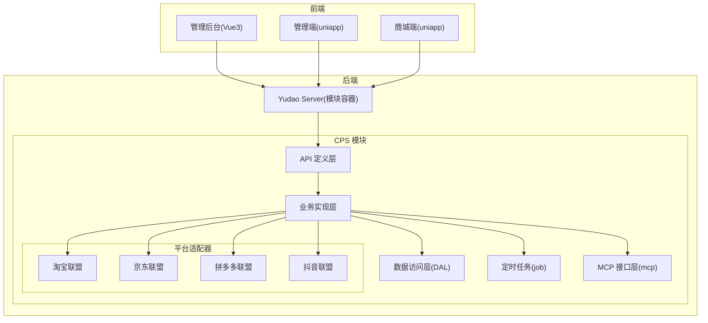

**图表来源**
- [README.md: 229-249:229-249](file://README.md#L229-L249)
- [backend/README.md: 225-230:225-230](file://backend/README.md#L225-L230)

**章节来源**
- [README.md: 229-249:229-249](file://README.md#L229-L249)
- [backend/README.md: 225-230:225-230](file://backend/README.md#L225-L230)
- [README.md: 267-302:267-302](file://README.md#L267-L302)

## 核心组件
- 平台适配器（策略模式）：以可插拔方式对接淘宝、京东、拼多多、抖音联盟，统一抽象转链、订单查询、商品搜索等能力。
- 业务服务：包含订单同步、返利计算、钱包入账、提现审核、风控管理等服务模块。
- 数据访问层：围绕订单、返利、会员、平台配置等核心实体进行持久化。
- MCP 接口层：提供 cps_search、cps_compare_prices、cps_generate_link、cps_query_orders、cps_get_rebate_summary 等 AI Tools，支持自然语言交互。
- 定时任务：按固定周期拉取平台订单，增量比对并触发结算/扣回流程。
- **新增** 枚举类系统：统一管理平台编码、订单状态、返利状态、推广位类型等核心业务枚举。
- **新增** DTO层：定义跨模块传输的数据传输对象，确保数据一致性。
- **新增** HTTP客户端基础设施：提供统一的HTTP请求封装和错误处理机制。

**章节来源**
- [README.md: 232-249:232-249](file://README.md#L232-L249)
- [CPS系统PRD文档.md: 80-261:80-261](file://docs/CPS系统PRD文档.md#L80-L261)
- [CpsAdzoneTypeEnum.java:1-40](file://backend/yudao-module-cps/yudao-module-cps-api/src/main/java/cn/iocoder/yudao/module/cps/enums/CpsAdzoneTypeEnum.java#L1-L40)
- [CpsErrorCodeConstants.java:1-60](file://backend/yudao-module-cps/yudao-module-cps-api/src/main/java/cn/iocoder/yudao/module/cps/enums/CpsErrorCodeConstants.java#L1-L60)

## 架构总览
系统采用"前端 + 后端 + 多平台联盟"三层架构：
- 前端负责用户交互与数据展示；
- 后端提供统一 API、业务编排与平台适配；
- 平台适配器封装各联盟差异，屏蔽平台差异，统一返回标准化数据。

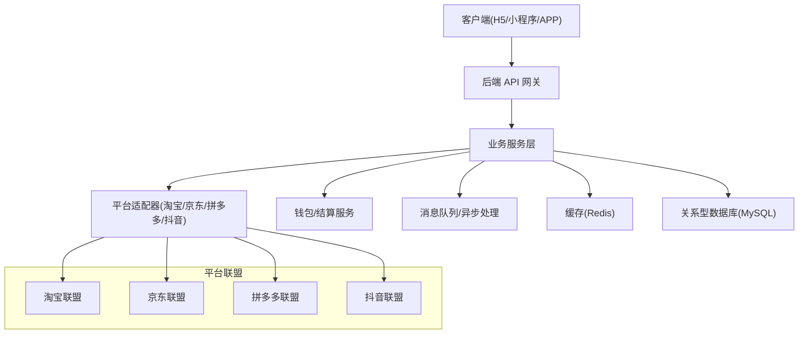

**图表来源**
- [README.md: 229-249:229-249](file://README.md#L229-L249)

## 详细组件分析

### 商品搜索与比价
- 输入识别：支持关键词、商品链接、口令（淘口令等）识别，自动判定平台与商品 ID。
- 并发查询：启用的平台并发查询，聚合结果后按会员等级计算预估返利，支持按价格、返利、销量排序。
- 比价展示：以表格形式对比不同平台的券后价、返利、实付金额，提供"最省钱"等推荐。

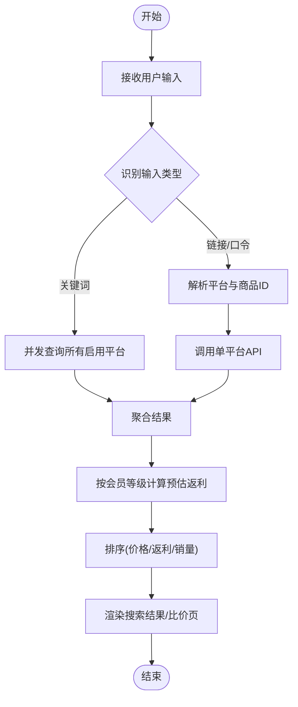

**图表来源**
- [CPS系统PRD文档.md: 121-150:121-150](file://docs/CPS系统PRD文档.md#L121-L150)

**章节来源**
- [CPS系统PRD文档.md: 378-448:378-448](file://docs/CPS系统PRD文档.md#L378-L448)

### 推广链接生成机制
- PID 获取：优先使用会员专属推广位，否则回退到平台默认推广位。
- 归因参数注入：按平台规范注入 adzone_id、external_info（淘宝）、subUnionId（京东）、custom_parameters（拼多多）等。
- 转链调用：调用平台转链 API，返回推广链接与口令（淘宝），记录转链日志。

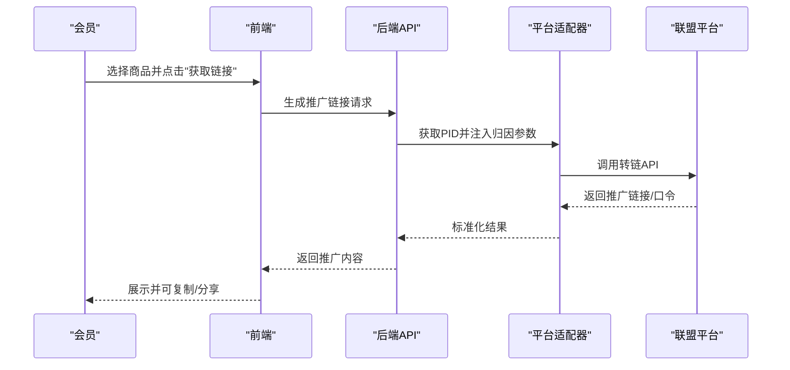

**图表来源**
- [CPS系统PRD文档.md: 152-181:152-181](file://docs/CPS系统PRD文档.md#L152-L181)

**章节来源**
- [CPS系统PRD文档.md: 449-480:449-480](file://docs/CPS系统PRD文档.md#L449-L480)

### 订单同步与结算流程
- 定时任务：每 5 分钟触发一次，遍历启用平台，增量查询订单。
- 新增订单：解析归因参数，匹配会员，入库并标记待结算。
- 状态变更：当订单变为"已结算"，计算可分配佣金与返利比例，入账到会员钱包并通知；若变为"已退款"，根据是否已入账执行扣回或取消待结算。
- 可分配佣金 = 商品佣金 - 平台服务费；返利金额 = 可分配佣金 × 返利比例。

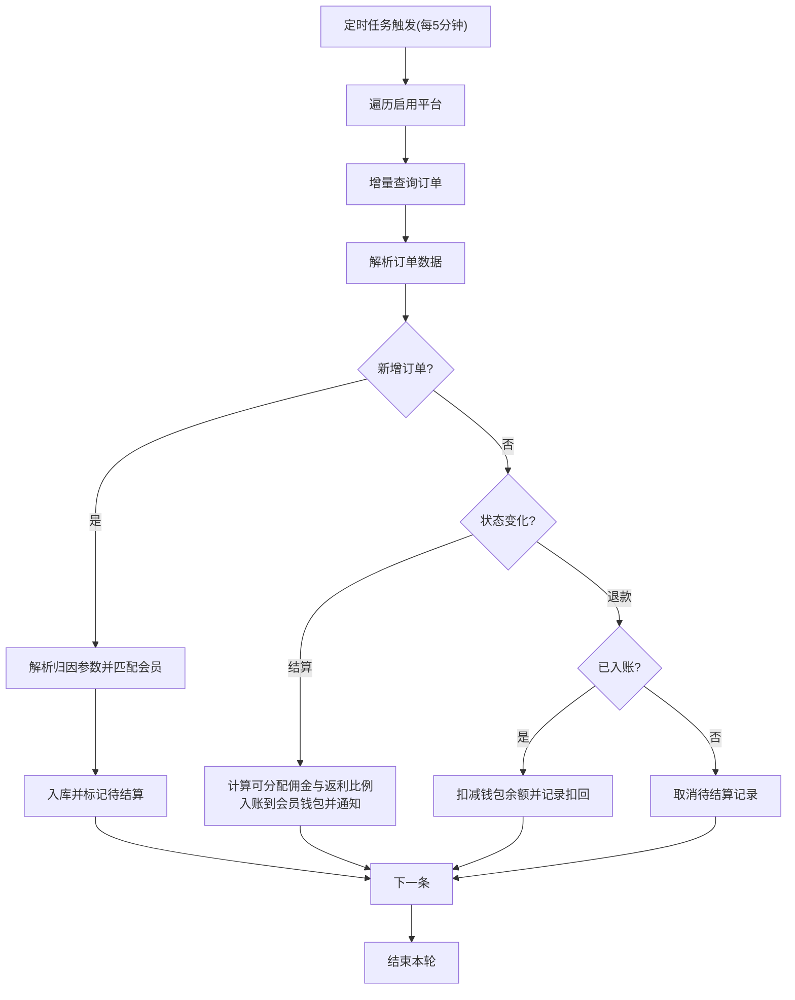

**图表来源**
- [CPS系统PRD文档.md: 183-223:183-223](file://docs/CPS系统PRD文档.md#L183-L223)

**章节来源**
- [CPS系统PRD文档.md: 760-800:760-800](file://docs/CPS系统PRD文档.md#L760-L800)

### 返利计算与入账规则
- 佣金计算：商品实付金额 × 佣金比例；平台服务费 = 商品佣金 × 平台费率；可分配佣金 = 商品佣金 - 平台服务费。
- 返利比例优先级：会员个人专属配置（平台/全平台）→ 会员等级 + 指定平台 → 会员等级全平台 → 指定平台默认 → 全局默认。
- 入账与提现：返利入账后即时可提现；提现支持支付宝/微信，具备最低金额、每日次数、单次上限与黑名单校验。

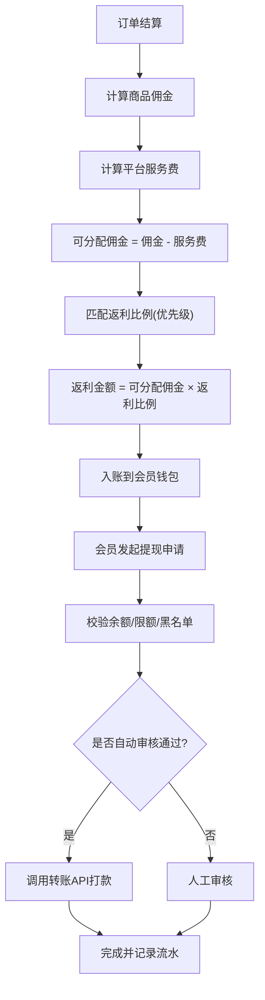

**图表来源**
- [CPS系统PRD文档.md: 760-800:760-800](file://docs/CPS系统PRD文档.md#L760-L800)

**章节来源**
- [CPS系统PRD文档.md: 586-619:586-619](file://docs/CPS系统PRD文档.md#L586-L619)

### 多平台对接（淘宝、京东、拼多多、抖音）
- 抽象适配器：统一平台能力接口，屏蔽各平台差异。
- 淘宝联盟：支持淘口令、短链、广告位参数注入。
- 京东联盟：支持 subUnionId 归因与短链。
- 拼多多联盟：支持 custom_parameters 归因与小程序路径。
- 抖音联盟：通过策略扩展接入，统一转链与订单查询接口。

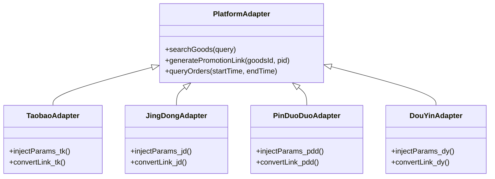

**图表来源**
- [README.md: 241-248:241-248](file://README.md#L241-L248)

**章节来源**
- [README.md: 241-248:241-248](file://README.md#L241-L248)

### 枚举类系统
**新增** 系统化的枚举类管理，确保业务状态的一致性和可维护性：

- 平台编码枚举（CpsPlatformCodeEnum）：统一管理淘宝、京东、拼多多、抖音等平台标识
- 订单状态枚举（CpsOrderStatusEnum）：标准化订单生命周期状态
- 返利状态枚举（CpsRebateStatusEnum）：统一返利处理状态
- 推广位类型枚举（CpsAdzoneTypeEnum）：区分通用、渠道专属、用户专属推广位
- 错误码常量（CpsErrorCodeConstants）：集中管理CPS系统各类错误码

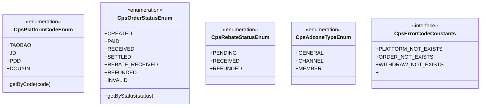

**图表来源**
- [CpsPlatformCodeEnum.java:1-45](file://backend/yudao-module-cps/yudao-module-cps-api/src/main/java/cn/iocoder/yudao/module/cps/enums/CpsPlatformCodeEnum.java#L1-L45)
- [CpsOrderStatusEnum.java:1-48](file://backend/yudao-module-cps/yudao-module-cps-api/src/main/java/cn/iocoder/yudao/module/cps/enums/CpsOrderStatusEnum.java#L1-L48)
- [CpsRebateStatusEnum.java:1-40](file://backend/yudao-module-cps/yudao-module-cps-api/src/main/java/cn/iocoder/yudao/module/cps/enums/CpsRebateStatusEnum.java#L1-L40)
- [CpsAdzoneTypeEnum.java:1-40](file://backend/yudao-module-cps/yudao-module-cps-api/src/main/java/cn/iocoder/yudao/module/cps/enums/CpsAdzoneTypeEnum.java#L1-L40)
- [CpsErrorCodeConstants.java:1-60](file://backend/yudao-module-cps/yudao-module-cps-api/src/main/java/cn/iocoder/yudao/module/cps/enums/CpsErrorCodeConstants.java#L1-L60)

**章节来源**
- [CpsPlatformCodeEnum.java:1-45](file://backend/yudao-module-cps/yudao-module-cps-api/src/main/java/cn/iocoder/yudao/module/cps/enums/CpsPlatformCodeEnum.java#L1-L45)
- [CpsOrderStatusEnum.java:1-48](file://backend/yudao-module-cps/yudao-module-cps-api/src/main/java/cn/iocoder/yudao/module/cps/enums/CpsOrderStatusEnum.java#L1-L48)
- [CpsRebateStatusEnum.java:1-40](file://backend/yudao-module-cps/yudao-module-cps-api/src/main/java/cn/iocoder/yudao/module/cps/enums/CpsRebateStatusEnum.java#L1-L40)
- [CpsAdzoneTypeEnum.java:1-40](file://backend/yudao-module-cps/yudao-module-cps-api/src/main/java/cn/iocoder/yudao/module/cps/enums/CpsAdzoneTypeEnum.java#L1-L40)
- [CpsErrorCodeConstants.java:1-60](file://backend/yudao-module-cps/yudao-module-cps-api/src/main/java/cn/iocoder/yudao/module/cps/enums/CpsErrorCodeConstants.java#L1-L60)

### MCP AI 接口与工具
- 工具清单：cps_search（商品搜索）、cps_compare_prices（多平台比价）、cps_generate_link（推广链接生成）、cps_query_orders（订单查询）、cps_get_rebate_summary（返利汇总）。
- 权限分级：public（仅查询）、member（会员级操作）、admin（管理权限）。
- 访问管理：API Key 管理、限流配置、访问日志与统计分析。

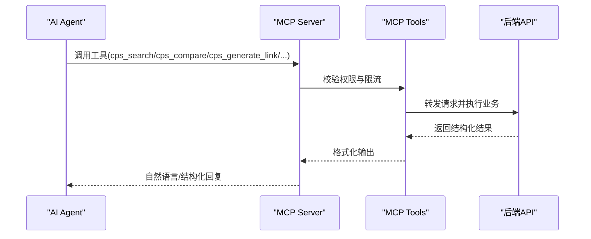

**图表来源**
- [README.md: 185-209:185-209](file://README.md#L185-L209)

**章节来源**
- [README.md: 185-209:185-209](file://README.md#L185-L209)

## 依赖关系分析
- 组件耦合：业务服务依赖平台适配器与数据访问层；MCP 层通过工具与资源暴露业务能力；定时任务驱动订单同步。
- 外部依赖：各平台联盟 API、支付钱包服务、缓存与消息队列。
- 可扩展性：平台适配器采用策略模式，新增平台只需实现统一接口并注册。

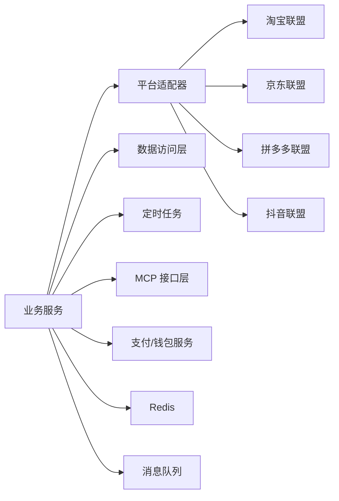

**图表来源**
- [README.md: 232-249:232-249](file://README.md#L232-L249)

**章节来源**
- [README.md: 232-249:232-249](file://README.md#L232-L249)

## 性能考量
- 搜索与比价：单平台搜索 P99 < 2 秒，多平台比价 P99 < 5 秒；转链生成 < 1 秒。
- 订单同步：同步延迟 < 30 分钟；返利入账在平台结算后 24 小时内。
- MCP 工具调用：搜索类 < 3 秒，查询类 < 1 秒。
- 优化建议：缓存热门商品、预估返利计算前置、并发查询平台时引入超时与熔断、订单增量查询减少无效 IO。

## 故障排查指南
- 平台连通性：通过"平台连通测试"验证 AppKey/Secret 与 API 地址配置是否正确。
- 订单未归因：在"异常订单处理"中手动绑定会员，或检查归因参数注入是否符合平台规范。
- 提现异常：检查余额、限额、黑名单与转账接口返回状态，必要时重试或人工审核。
- MCP 工具调用失败：查看"MCP 访问日志"，定位 API Key 权限、限流与参数问题。
- **新增** 枚举类问题：检查平台编码、订单状态、返利状态等枚举值是否正确配置。

**章节来源**
- [CPS系统PRD文档.md: 317-352:317-352](file://docs/CPS系统PRD文档.md#L317-L352)

## 结论
AgenticCPS 通过"AI 自主编程 + 低代码 + MCP 协议"实现了 CPS 联盟返利系统的高扩展与高效率：多平台统一接入、自动化订单同步与结算、灵活的返利规则与提现流程，配合 MCP 工具链，使系统既能满足个人创业团队的轻量化需求，也能支撑规模化运营与持续创新。

**更新** 新增的CPS模块架构组件进一步增强了系统的稳定性和可维护性，包括完善的枚举类系统、DTO层设计和HTTP客户端基础设施，为系统的长期发展奠定了坚实基础。

## 附录

### 数据模型设计（概要）
- 订单表：记录平台订单号、商品信息、实付金额、佣金、平台服务费、结算状态、归因参数等。
- 返利记录表：记录返利金额、返利比例、结算周期、入账时间、状态等。
- 会员钱包表：记录余额、累计收入、待结算金额等。
- 平台配置表：记录 AppKey/Secret、默认推广位、平台服务费率、启用状态等。
- MCP 配置表：记录 API Key、权限级别、限流规则、使用统计等。
- **新增** 枚举配置表：存储平台编码、订单状态、返利状态等枚举配置。

**章节来源**
- [CPS系统PRD文档.md: 553-757:553-757](file://docs/CPS系统PRD文档.md#L553-L757)

### 接口规范（概要）
- 商品搜索：支持关键词、链接、口令；返回统一格式的商品列表，包含预估返利。
- 多平台比价：返回各平台的券后价、返利、实付对比。
- 推广链接生成：返回推广链接与口令（淘宝），注入平台归因参数。
- 订单查询：支持按会员、时间范围查询订单状态与返利进度。
- 返利汇总：返回可提现余额、待结算金额、累计收入。
- **新增** 枚举查询接口：提供平台编码、订单状态、返利状态等枚举值查询。

**章节来源**
- [README.md: 185-209:185-209](file://README.md#L185-L209)
- [CPS系统PRD文档.md: 265-374:265-374](file://docs/CPS系统PRD文档.md#L265-L374)

### 错误处理机制（概要）
- 平台 API 超时：展示已返回平台结果，超时平台提示"暂时无法查询"。
- 全部平台无结果：提示"未找到相关商品，请换个关键词试试"。
- 未登录查询：正常展示商品，返利金额显示"登录查看返利"。
- 提现失败：返还余额并标记异常，通知会员。
- **新增** 枚举类错误：统一的错误码管理，提供详细的错误信息和解决方案。

**章节来源**
- [CPS系统PRD文档.md: 412-416:412-416](file://docs/CPS系统PRD文档.md#L412-L416)
- [CPS系统PRD文档.md: 547-552:547-552](file://docs/CPS系统PRD文档.md#L547-L552)
- [CpsErrorCodeConstants.java:1-60](file://backend/yudao-module-cps/yudao-module-cps-api/src/main/java/cn/iocoder/yudao/module/cps/enums/CpsErrorCodeConstants.java#L1-L60)

### Java SDK 示例（数据淘开放平台）
- SDK 应用入口：DtkJavaOpenPlatformSdkApplication
- 客户端抽象：AbstractDtkApiClient、DtkApiClient、DtkClient
- 请求对象：DtkApiRequest、DtkActivityLinkRequest、DtkCommodityMaterialsRequest、DtkCouponQueryRequest
- 常量与异常：DtkApiConstant、DtkApiException、Result

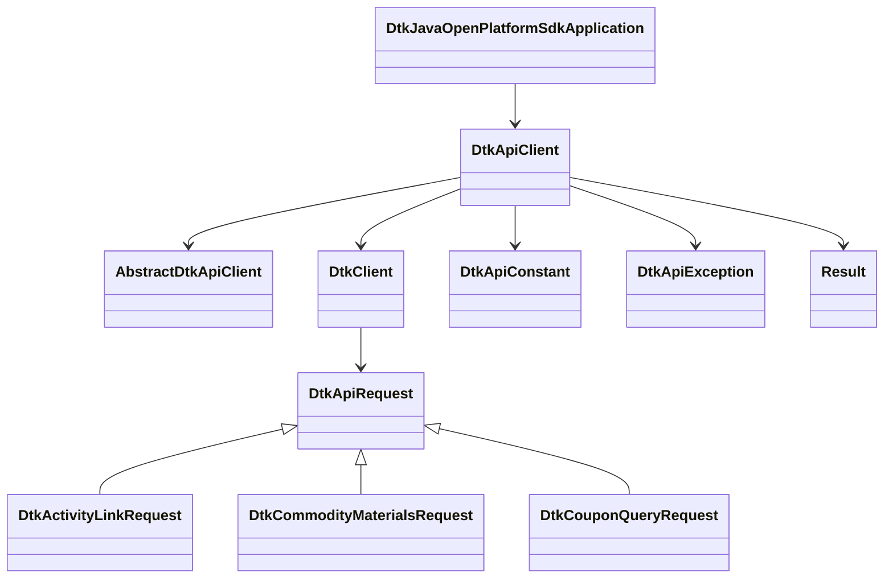

**图表来源**
- [DtkJavaOpenPlatformSdkApplication.java](file://agent_improvement/sdk_demo/dataoke-sdk-java/src/main/java/com/dtk/api/DtkJavaOpenPlatformSdkApplication.java)
- [AbstractDtkApiClient.java](file://agent_improvement/sdk_demo/dataoke-sdk-java/src/main/java/com/dtk/api/client/AbstractDtkApiClient.java)
- [DtkApiClient.java](file://agent_improvement/sdk_demo/dataoke-sdk-java/src/main/java/com/dtk/api/client/DtkApiClient.java)
- [DtkClient.java](file://agent_improvement/sdk_demo/dataoke-sdk-java/src/main/java/com/dtk/api/client/DtkClient.java)
- [DtkApiRequest.java](file://agent_improvement/sdk_demo/dataoke-sdk-java/src/main/java/com/dtk/api/client/DtkApiRequest.java)
- [DtkActivityLinkRequest.java](file://agent_improvement/sdk_demo/dataoke-sdk-java/src/main/java/com/dtk/api/request/mastertool/DtkActivityLinkRequest.java)
- [DtkCommodityMaterialsRequest.java](file://agent_improvement/sdk_demo/dataoke-sdk-java/src/main/java/com/dtk/api/request/mastertool/DtkCommodityMaterialsRequest.java)
- [DtkCouponQueryRequest.java](file://agent_improvement/sdk_demo/dataoke-sdk-java/src/main/java/com/dtk/api/request/mastertool/DtkCouponQueryRequest.java)
- [DtkApiConstant.java](file://agent_improvement/sdk_demo/dataoke-sdk-java/src/main/java/com/dtk/api/constant/DtkApiConstant.java)