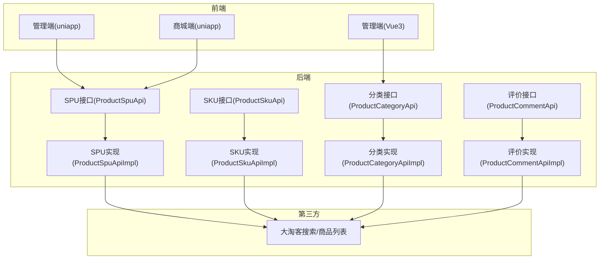
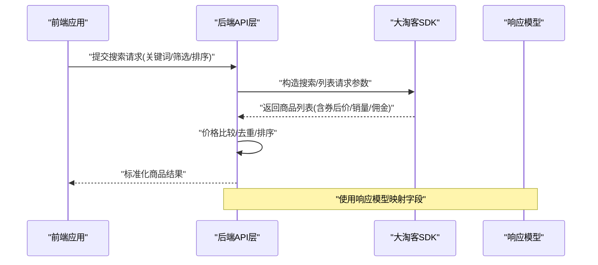
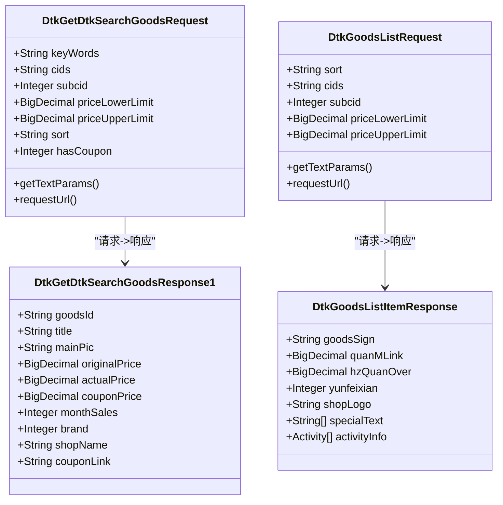
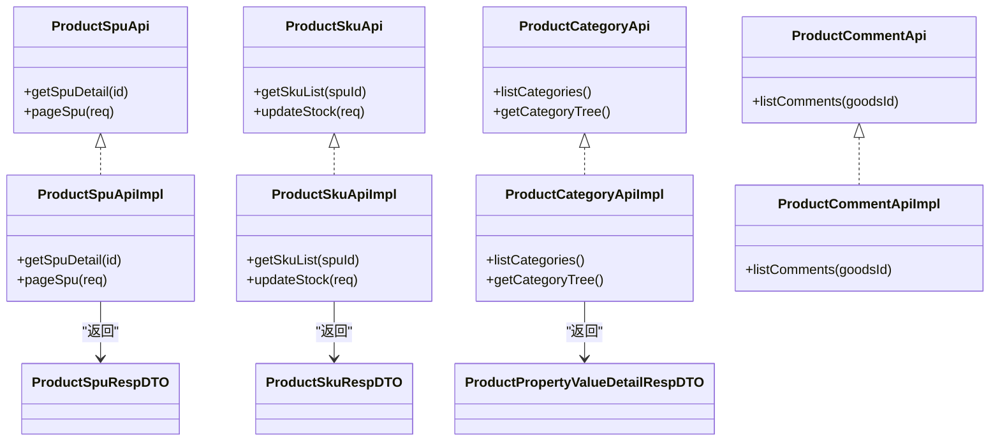
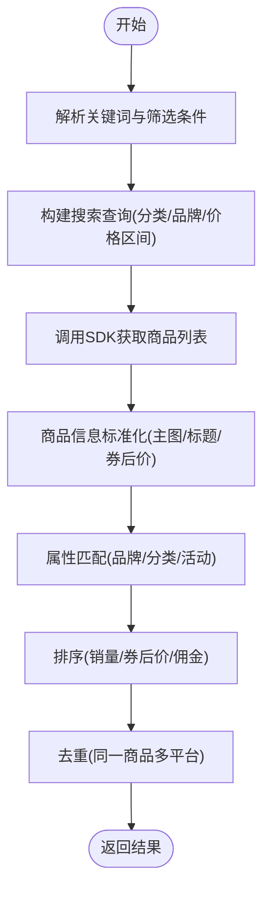
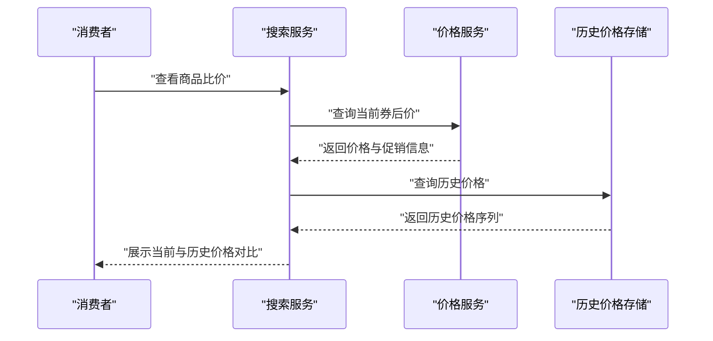
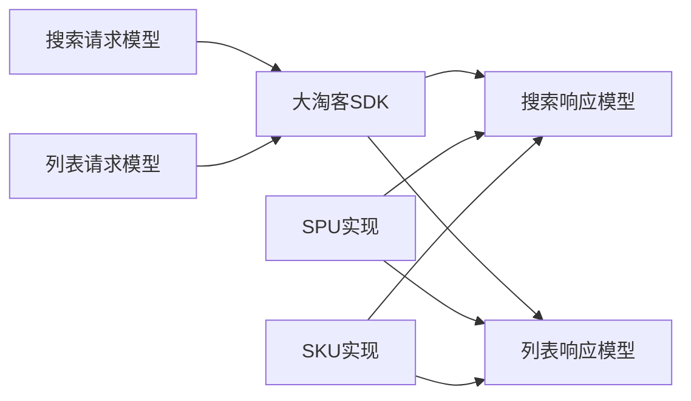

# 商品搜索与比价

<cite>
**本文引用的文件**
- [DtkGetDtkSearchGoodsRequest.java](file://agent_improvement/sdk_demo/dataoke-sdk-java/src/main/java/com/dtk/api/request/search/DtkGetDtkSearchGoodsRequest.java)
- [DtkGoodsListRequest.java](file://agent_improvement/sdk_demo/dataoke-sdk-java/src/main/java/com/dtk/api/request/putstorage/DtkGoodsListRequest.java)
- [DtkGetDtkSearchGoodsResponse1.java](file://agent_improvement/sdk_demo/dataoke-sdk-java/src/main/java/com/dtk/api/response/search/DtkGetDtkSearchGoodsResponse1.java)
- [DtkGoodsListItemResponse.java](file://agent_improvement/sdk_demo/dataoke-sdk-java/src/main/java/com/dtk/api/response/putstorage/DtkGoodsListItemResponse.java)
- [ProductSpuApi.java](file://backend/yudao-module-mall/yudao-module-product/src/main/java/cn/iocoder/yudao/module/product/api/spu/ProductSpuApi.java)
- [ProductSpuApiImpl.java](file://backend/yudao-module-mall/yudao-module-product/src/main/java/cn/iocoder/yudao/module/product/api/spu/ProductSpuApiImpl.java)
- [ProductSkuApi.java](file://backend/yudao-module-mall/yudao-module-product/src/main/java/cn/iocoder/yudao/module/product/api/sku/ProductSkuApi.java)
- [ProductSkuApiImpl.java](file://backend/yudao-module-mall/yudao-module-product/src/main/java/cn/iocoder/yudao/module/product/api/sku/ProductSkuApiImpl.java)
- [ProductCategoryApi.java](file://backend/yudao-module-mall/yudao-module-product/src/main/java/cn/iocoder/yudao/module/product/api/category/ProductCategoryApi.java)
- [ProductCategoryApiImpl.java](file://backend/yudao-module-mall/yudao-module-product/src/main/java/cn/iocoder/yudao/module/product/api/category/ProductCategoryApiImpl.java)
- [ProductCommentApi.java](file://backend/yudao-module-mall/yudao-module-product/src/main/java/cn/iocoder/yudao/module/product/api/comment/ProductCommentApi.java)
- [ProductCommentApiImpl.java](file://backend/yudao-module-mall/yudao-module-product/src/main/java/cn/iocoder/yudao/module/product/api/comment/ProductCommentApiImpl.java)
- [ProductSpuRespDTO.java](file://backend/yudao-module-mall/yudao-module-product/src/main/java/cn/iocoder/yudao/module/product/api/spu/dto/ProductSpuRespDTO.java)
- [ProductSkuRespDTO.java](file://backend/yudao-module-mall/yudao-module-product/src/main/java/cn/iocoder/yudao/module/product/api/sku/dto/ProductSkuRespDTO.java)
- [ProductPropertyValueDetailRespDTO.java](file://backend/yudao-module-mall/yudao-module-product/src/main/java/cn/iocoder/yudao/module/product/api/property/dto/ProductPropertyValueDetailRespDTO.java)
- [README.md](file://README.md)
</cite>

## 目录
1. [简介](#简介)
2. [项目结构](#项目结构)
3. [核心组件](#核心组件)
4. [架构总览](#架构总览)
5. [详细组件分析](#详细组件分析)
6. [依赖分析](#依赖分析)
7. [性能考虑](#性能考虑)
8. [故障排查指南](#故障排查指南)
9. [结论](#结论)
10. [附录](#附录)

## 简介
本文件聚焦于“商品搜索与比价”能力，结合后端商品域模块与第三方大淘客SDK，系统化阐述以下内容：
- 商品搜索算法与关键词处理
- 价格比较机制与多平台数据聚合
- 商品属性匹配、价格排序、去重策略
- 商品信息标准化、价格获取渠道、实时更新与历史价格对比
- 搜索性能优化、索引与缓存策略
- API接口规范、数据模型设计与错误处理方案

## 项目结构
本项目采用前后端分离与模块化架构，商品搜索与比价涉及：
- 后端商品域模块：SPU/SKU、分类、评价等接口与实现
- 第三方SDK：大淘客搜索与商品列表请求/响应模型
- 前端：多端应用（admin-uniapp、mall-uniapp、admin-vue3）

图表来源
- [ProductSpuApi.java](file://backend/yudao-module-mall/yudao-module-product/src/main/java/cn/iocoder/yudao/module/product/api/spu/ProductSpuApi.java)
- [ProductSkuApi.java](file://backend/yudao-module-mall/yudao-module-product/src/main/java/cn/iocoder/yudao/module/product/api/sku/ProductSkuApi.java)
- [ProductCategoryApi.java](file://backend/yudao-module-mall/yudao-module-product/src/main/java/cn/iocoder/yudao/module/product/api/category/ProductCategoryApi.java)
- [ProductCommentApi.java](file://backend/yudao-module-mall/yudao-module-product/src/main/java/cn/iocoder/yudao/module/product/api/comment/ProductCommentApi.java)
- [ProductSpuApiImpl.java](file://backend/yudao-module-mall/yudao-module-product/src/main/java/cn/iocoder/yudao/module/product/api/spu/ProductSpuApiImpl.java)
- [ProductSkuApiImpl.java](file://backend/yudao-module-mall/yudao-module-product/src/main/java/cn/iocoder/yudao/module/product/api/sku/ProductSkuApiImpl.java)
- [ProductCategoryApiImpl.java](file://backend/yudao-module-mall/yudao-module-product/src/main/java/cn/iocoder/yudao/module/product/api/category/ProductCategoryApiImpl.java)
- [ProductCommentApiImpl.java](file://backend/yudao-module-mall/yudao-module-product/src/main/java/cn/iocoder/yudao/module/product/api/comment/ProductCommentApiImpl.java)

章节来源
- [README.md](file://README.md)

## 核心组件
- 商品搜索请求模型：大淘客搜索请求参数封装，支持关键词、分类、价格区间、排序、筛选等
- 商品列表请求模型：支持多种筛选与排序维度
- 商品搜索响应模型：包含商品基础信息、券后价、佣金、销量、店铺评分等
- 商品列表响应模型：扩展字段如定金、立减、运费险、活动信息等
- 商品域API：SPU/SKU/分类/评价接口定义与实现，用于内部商品数据管理
- DTO模型：对外输出的商品SPU/SKU/属性值详情等数据传输对象

章节来源
- [DtkGetDtkSearchGoodsRequest.java:18-94](file://agent_improvement/sdk_demo/dataoke-sdk-java/src/main/java/com/dtk/api/request/search/DtkGetDtkSearchGoodsRequest.java#L18-L94)
- [DtkGoodsListRequest.java:17-114](file://agent_improvement/sdk_demo/dataoke-sdk-java/src/main/java/com/dtk/api/request/putstorage/DtkGoodsListRequest.java#L17-L114)
- [DtkGetDtkSearchGoodsResponse1.java:11-146](file://agent_improvement/sdk_demo/dataoke-sdk-java/src/main/java/com/dtk/api/response/search/DtkGetDtkSearchGoodsResponse1.java#L11-L146)
- [DtkGoodsListItemResponse.java:12-69](file://agent_improvement/sdk_demo/dataoke-sdk-java/src/main/java/com/dtk/api/response/putstorage/DtkGoodsListItemResponse.java#L12-L69)
- [ProductSpuApi.java](file://backend/yudao-module-mall/yudao-module-product/src/main/java/cn/iocoder/yudao/module/product/api/spu/ProductSpuApi.java)
- [ProductSpuApiImpl.java](file://backend/yudao-module-mall/yudao-module-product/src/main/java/cn/iocoder/yudao/module/product/api/spu/ProductSpuApiImpl.java)
- [ProductSkuApi.java](file://backend/yudao-module-mall/yudao-module-product/src/main/java/cn/iocoder/yudao/module/product/api/sku/ProductSkuApi.java)
- [ProductSkuApiImpl.java](file://backend/yudao-module-mall/yudao-module-product/src/main/java/cn/iocoder/yudao/module/product/api/sku/ProductSkuApiImpl.java)
- [ProductCategoryApi.java](file://backend/yudao-module-mall/yudao-module-product/src/main/java/cn/iocoder/yudao/module/product/api/category/ProductCategoryApi.java)
- [ProductCategoryApiImpl.java](file://backend/yudao-module-mall/yudao-module-product/src/main/java/cn/iocoder/yudao/module/product/api/category/ProductCategoryApiImpl.java)
- [ProductCommentApi.java](file://backend/yudao-module-mall/yudao-module-product/src/main/java/cn/iocoder/yudao/module/product/api/comment/ProductCommentApi.java)
- [ProductCommentApiImpl.java](file://backend/yudao-module-mall/yudao-module-product/src/main/java/cn/iocoder/yudao/module/product/api/comment/ProductCommentApiImpl.java)
- [ProductSpuRespDTO.java](file://backend/yudao-module-mall/yudao-module-product/src/main/java/cn/iocoder/yudao/module/product/api/spu/dto/ProductSpuRespDTO.java)
- [ProductSkuRespDTO.java](file://backend/yudao-module-mall/yudao-module-product/src/main/java/cn/iocoder/yudao/module/product/api/sku/dto/ProductSkuRespDTO.java)
- [ProductPropertyValueDetailRespDTO.java](file://backend/yudao-module-mall/yudao-module-product/src/main/java/cn/iocoder/yudao/module/product/api/property/dto/ProductPropertyValueDetailRespDTO.java)

## 架构总览
商品搜索与比价的整体流程：
- 前端发起搜索请求，携带关键词、筛选条件与排序偏好
- 后端调用大淘客SDK进行商品搜索/列表拉取
- 返回商品列表，按券后价、销量、佣金等维度排序
- 对比不同平台商品，完成价格比较与去重
- 将标准化后的商品信息与价格数据返回给前端展示

图表来源
- [DtkGetDtkSearchGoodsRequest.java:73-92](file://agent_improvement/sdk_demo/dataoke-sdk-java/src/main/java/com/dtk/api/request/search/DtkGetDtkSearchGoodsRequest.java#L73-L92)
- [DtkGoodsListRequest.java:91-112](file://agent_improvement/sdk_demo/dataoke-sdk-java/src/main/java/com/dtk/api/request/putstorage/DtkGoodsListRequest.java#L91-L112)
- [DtkGetDtkSearchGoodsResponse1.java:140-146](file://agent_improvement/sdk_demo/dataoke-sdk-java/src/main/java/com/dtk/api/response/search/DtkGetDtkSearchGoodsResponse1.java#L140-L146)
- [DtkGoodsListItemResponse.java:18-69](file://agent_improvement/sdk_demo/dataoke-sdk-java/src/main/java/com/dtk/api/response/putstorage/DtkGoodsListItemResponse.java#L18-L69)

## 详细组件分析

### 组件A：商品搜索请求与响应模型
- 搜索请求模型支持关键词、分类、价格区间、券额、佣金率、销量门槛、排序、是否有券、是否海淘、是否品牌等筛选
- 列表请求模型支持更多筛选与排序维度，并扩展了定金、立减、运费险、活动信息等字段
- 响应模型包含商品主图、标题、券后价、佣金比例、销量、店铺评分、活动信息等关键字段

图表来源
- [DtkGetDtkSearchGoodsRequest.java:24-94](file://agent_improvement/sdk_demo/dataoke-sdk-java/src/main/java/com/dtk/api/request/search/DtkGetDtkSearchGoodsRequest.java#L24-L94)
- [DtkGoodsListRequest.java:23-114](file://agent_improvement/sdk_demo/dataoke-sdk-java/src/main/java/com/dtk/api/request/putstorage/DtkGoodsListRequest.java#L23-L114)
- [DtkGetDtkSearchGoodsResponse1.java:18-146](file://agent_improvement/sdk_demo/dataoke-sdk-java/src/main/java/com/dtk/api/response/search/DtkGetDtkSearchGoodsResponse1.java#L18-L146)
- [DtkGoodsListItemResponse.java:18-69](file://agent_improvement/sdk_demo/dataoke-sdk-java/src/main/java/com/dtk/api/response/putstorage/DtkGoodsListItemResponse.java#L18-L69)

章节来源
- [DtkGetDtkSearchGoodsRequest.java:18-94](file://agent_improvement/sdk_demo/dataoke-sdk-java/src/main/java/com/dtk/api/request/search/DtkGetDtkSearchGoodsRequest.java#L18-L94)
- [DtkGoodsListRequest.java:17-114](file://agent_improvement/sdk_demo/dataoke-sdk-java/src/main/java/com/dtk/api/request/putstorage/DtkGoodsListRequest.java#L17-L114)
- [DtkGetDtkSearchGoodsResponse1.java:11-146](file://agent_improvement/sdk_demo/dataoke-sdk-java/src/main/java/com/dtk/api/response/search/DtkGetDtkSearchGoodsResponse1.java#L11-L146)
- [DtkGoodsListItemResponse.java:12-69](file://agent_improvement/sdk_demo/dataoke-sdk-java/src/main/java/com/dtk/api/response/putstorage/DtkGoodsListItemResponse.java#L12-L69)

### 组件B：商品域API与数据传输对象
- SPU/SKU接口定义了商品主数据与库存/价格的管理能力
- 分类与评价接口支撑商品分类与用户评价的数据接入
- DTO模型用于对外输出标准化的商品信息，便于前端渲染与比价展示

图表来源
- [ProductSpuApi.java](file://backend/yudao-module-mall/yudao-module-product/src/main/java/cn/iocoder/yudao/module/product/api/spu/ProductSpuApi.java)
- [ProductSpuApiImpl.java](file://backend/yudao-module-mall/yudao-module-product/src/main/java/cn/iocoder/yudao/module/product/api/spu/ProductSpuApiImpl.java)
- [ProductSkuApi.java](file://backend/yudao-module-mall/yudao-module-product/src/main/java/cn/iocoder/yudao/module/product/api/sku/ProductSkuApi.java)
- [ProductSkuApiImpl.java](file://backend/yudao-module-mall/yudao-module-product/src/main/java/cn/iocoder/yudao/module/product/api/sku/ProductSkuApiImpl.java)
- [ProductCategoryApi.java](file://backend/yudao-module-mall/yudao-module-product/src/main/java/cn/iocoder/yudao/module/product/api/category/ProductCategoryApi.java)
- [ProductCategoryApiImpl.java](file://backend/yudao-module-mall/yudao-module-product/src/main/java/cn/iocoder/yudao/module/product/api/category/ProductCategoryApiImpl.java)
- [ProductCommentApi.java](file://backend/yudao-module-mall/yudao-module-product/src/main/java/cn/iocoder/yudao/module/product/api/comment/ProductCommentApi.java)
- [ProductCommentApiImpl.java](file://backend/yudao-module-mall/yudao-module-product/src/main/java/cn/iocoder/yudao/module/product/api/comment/ProductCommentApiImpl.java)
- [ProductSpuRespDTO.java](file://backend/yudao-module-mall/yudao-module-product/src/main/java/cn/iocoder/yudao/module/product/api/spu/dto/ProductSpuRespDTO.java)
- [ProductSkuRespDTO.java](file://backend/yudao-module-mall/yudao-module-product/src/main/java/cn/iocoder/yudao/module/product/api/sku/dto/ProductSkuRespDTO.java)
- [ProductPropertyValueDetailRespDTO.java](file://backend/yudao-module-mall/yudao-module-product/src/main/java/cn/iocoder/yudao/module/product/api/property/dto/ProductPropertyValueDetailRespDTO.java)

章节来源
- [ProductSpuApi.java](file://backend/yudao-module-mall/yudao-module-product/src/main/java/cn/iocoder/yudao/module/product/api/spu/ProductSpuApi.java)
- [ProductSkuApi.java](file://backend/yudao-module-mall/yudao-module-product/src/main/java/cn/iocoder/yudao/module/product/api/sku/ProductSkuApi.java)
- [ProductCategoryApi.java](file://backend/yudao-module-mall/yudao-module-product/src/main/java/cn/iocoder/yudao/module/product/api/category/ProductCategoryApi.java)
- [ProductCommentApi.java](file://backend/yudao-module-mall/yudao-module-product/src/main/java/cn/iocoder/yudao/module/product/api/comment/ProductCommentApi.java)
- [ProductSpuRespDTO.java](file://backend/yudao-module-mall/yudao-module-product/src/main/java/cn/iocoder/yudao/module/product/api/spu/dto/ProductSpuRespDTO.java)
- [ProductSkuRespDTO.java](file://backend/yudao-module-mall/yudao-module-product/src/main/java/cn/iocoder/yudao/module/product/api/sku/dto/ProductSkuRespDTO.java)
- [ProductPropertyValueDetailRespDTO.java](file://backend/yudao-module-mall/yudao-module-product/src/main/java/cn/iocoder/yudao/module/product/api/property/dto/ProductPropertyValueDetailRespDTO.java)

### 组件C：搜索关键词处理与属性匹配
- 关键词处理：支持模糊匹配与精确匹配，结合分类ID与品牌ID提升召回质量
- 属性匹配：基于商品标题、品牌、分类、活动类型等字段进行属性对齐
- 排序算法：综合券后价、销量、佣金比例、店铺评分等维度进行排序

图表来源
- [DtkGetDtkSearchGoodsRequest.java:29-67](file://agent_improvement/sdk_demo/dataoke-sdk-java/src/main/java/com/dtk/api/request/search/DtkGetDtkSearchGoodsRequest.java#L29-L67)
- [DtkGoodsListRequest.java:25-81](file://agent_improvement/sdk_demo/dataoke-sdk-java/src/main/java/com/dtk/api/request/putstorage/DtkGoodsListRequest.java#L25-L81)
- [DtkGetDtkSearchGoodsResponse1.java:20-138](file://agent_improvement/sdk_demo/dataoke-sdk-java/src/main/java/com/dtk/api/response/search/DtkGetDtkSearchGoodsResponse1.java#L20-L138)

章节来源
- [DtkGetDtkSearchGoodsRequest.java:29-67](file://agent_improvement/sdk_demo/dataoke-sdk-java/src/main/java/com/dtk/api/request/search/DtkGetDtkSearchGoodsRequest.java#L29-L67)
- [DtkGoodsListRequest.java:25-81](file://agent_improvement/sdk_demo/dataoke-sdk-java/src/main/java/com/dtk/api/request/putstorage/DtkGoodsListRequest.java#L25-L81)
- [DtkGetDtkSearchGoodsResponse1.java:20-138](file://agent_improvement/sdk_demo/dataoke-sdk-java/src/main/java/com/dtk/api/response/search/DtkGetDtkSearchGoodsResponse1.java#L20-L138)

### 组件D：价格比较与历史价格对比
- 价格比较：以券后价为核心指标，结合销量、佣金比例进行综合评估
- 历史价格：可记录商品历史价格曲线，支持趋势对比与价格预警
- 实时更新：定时任务或事件驱动拉取最新价格，保持数据新鲜度

图表来源
- [DtkGetDtkSearchGoodsResponse1.java:45-66](file://agent_improvement/sdk_demo/dataoke-sdk-java/src/main/java/com/dtk/api/response/search/DtkGetDtkSearchGoodsResponse1.java#L45-L66)
- [DtkGoodsListItemResponse.java:22-31](file://agent_improvement/sdk_demo/dataoke-sdk-java/src/main/java/com/dtk/api/response/putstorage/DtkGoodsListItemResponse.java#L22-L31)

章节来源
- [DtkGetDtkSearchGoodsResponse1.java:45-66](file://agent_improvement/sdk_demo/dataoke-sdk-java/src/main/java/com/dtk/api/response/search/DtkGetDtkSearchGoodsResponse1.java#L45-L66)
- [DtkGoodsListItemResponse.java:22-31](file://agent_improvement/sdk_demo/dataoke-sdk-java/src/main/java/com/dtk/api/response/putstorage/DtkGoodsListItemResponse.java#L22-L31)

## 依赖分析
- 外部依赖：大淘客SDK提供统一的请求/响应模型与HTTP调用封装
- 内部依赖：商品域API实现依赖于SPU/SKU/分类/评价等接口，形成清晰的业务边界
- 耦合性：请求模型与响应模型解耦，便于扩展新的筛选维度与排序规则

图表来源
- [DtkGetDtkSearchGoodsRequest.java:73-92](file://agent_improvement/sdk_demo/dataoke-sdk-java/src/main/java/com/dtk/api/request/search/DtkGetDtkSearchGoodsRequest.java#L73-L92)
- [DtkGoodsListRequest.java:91-112](file://agent_improvement/sdk_demo/dataoke-sdk-java/src/main/java/com/dtk/api/request/putstorage/DtkGoodsListRequest.java#L91-L112)
- [DtkGetDtkSearchGoodsResponse1.java:140-146](file://agent_improvement/sdk_demo/dataoke-sdk-java/src/main/java/com/dtk/api/response/search/DtkGetDtkSearchGoodsResponse1.java#L140-L146)
- [DtkGoodsListItemResponse.java:18-69](file://agent_improvement/sdk_demo/dataoke-sdk-java/src/main/java/com/dtk/api/response/putstorage/DtkGoodsListItemResponse.java#L18-L69)
- [ProductSpuApiImpl.java](file://backend/yudao-module-mall/yudao-module-product/src/main/java/cn/iocoder/yudao/module/product/api/spu/ProductSpuApiImpl.java)
- [ProductSkuApiImpl.java](file://backend/yudao-module-mall/yudao-module-product/src/main/java/cn/iocoder/yudao/module/product/api/sku/ProductSkuApiImpl.java)

章节来源
- [ProductSpuApiImpl.java](file://backend/yudao-module-mall/yudao-module-product/src/main/java/cn/iocoder/yudao/module/product/api/spu/ProductSpuApiImpl.java)
- [ProductSkuApiImpl.java](file://backend/yudao-module-mall/yudao-module-product/src/main/java/cn/iocoder/yudao/module/product/api/sku/ProductSkuApiImpl.java)

## 性能考虑
- 搜索性能优化
  - 索引设计：对关键词、分类ID、品牌ID、销量、券后价建立复合索引
  - 缓存机制：热点商品与热门搜索结果缓存，降低重复查询压力
  - 分页与排序：限制最大分页深度，避免超大数据集排序
- 数据聚合
  - 并发拉取：多平台并发请求，合并后再去重与排序
  - 流式处理：对大列表进行流式处理，减少内存占用
- 实时更新
  - 定时任务：周期性刷新价格与库存
  - 事件驱动：价格变更事件触发缓存失效与通知

## 故障排查指南
- 请求参数校验
  - 关键字为空、价格区间非法、排序字段不支持等情况需返回明确错误码
- 第三方接口异常
  - SDK调用失败时进行降级处理，返回兜底数据或提示
- 响应字段缺失
  - 对缺失字段进行默认值填充或标记，保证前端展示稳定性
- 排序与去重异常
  - 校验排序字段与去重逻辑，确保一致性

章节来源
- [DtkGetDtkSearchGoodsRequest.java:73-92](file://agent_improvement/sdk_demo/dataoke-sdk-java/src/main/java/com/dtk/api/request/search/DtkGetDtkSearchGoodsRequest.java#L73-L92)
- [DtkGoodsListRequest.java:91-112](file://agent_improvement/sdk_demo/dataoke-sdk-java/src/main/java/com/dtk/api/request/putstorage/DtkGoodsListRequest.java#L91-L112)

## 结论
通过大淘客SDK与商品域API的协同，系统实现了从关键词搜索、属性匹配、价格比较到去重与排序的完整闭环。建议持续完善索引与缓存策略，强化历史价格与实时更新能力，以提升用户体验与运营效率。

## 附录

### API接口规范（示例）
- 搜索商品
  - 方法：POST
  - 路径：/api/goods/search
  - 请求体字段：关键词、分类ID、品牌ID、价格区间、排序字段、是否有券
  - 响应：商品列表（券后价、销量、佣金、主图、标题等）
- 获取商品列表
  - 方法：GET
  - 路径：/api/goods/list
  - 查询参数：排序方式、分类ID、品牌ID、价格区间、活动类型等
  - 响应：商品列表（扩展字段如定金、立减、运费险、活动信息）

章节来源
- [DtkGetDtkSearchGoodsRequest.java:29-67](file://agent_improvement/sdk_demo/dataoke-sdk-java/src/main/java/com/dtk/api/request/search/DtkGetDtkSearchGoodsRequest.java#L29-L67)
- [DtkGoodsListRequest.java:25-81](file://agent_improvement/sdk_demo/dataoke-sdk-java/src/main/java/com/dtk/api/request/putstorage/DtkGoodsListRequest.java#L25-L81)

### 数据模型设计（示例）
- 商品搜索响应模型
  - 字段：商品ID、标题、主图、原价、券后价、优惠券金额、销量、品牌、店铺名称、佣金比例、活动信息
- 商品列表响应模型
  - 字段：加密商品ID、定金、立减、运费险、店铺Logo、特色文案、活动信息
- 商品SPU/SKU/属性值DTO
  - 字段：SPU基本信息、SKU价格与库存、属性值详情

章节来源
- [DtkGetDtkSearchGoodsResponse1.java:20-138](file://agent_improvement/sdk_demo/dataoke-sdk-java/src/main/java/com/dtk/api/response/search/DtkGetDtkSearchGoodsResponse1.java#L20-L138)
- [DtkGoodsListItemResponse.java:18-61](file://agent_improvement/sdk_demo/dataoke-sdk-java/src/main/java/com/dtk/api/response/putstorage/DtkGoodsListItemResponse.java#L18-L61)
- [ProductSpuRespDTO.java](file://backend/yudao-module-mall/yudao-module-product/src/main/java/cn/iocoder/yudao/module/product/api/spu/dto/ProductSpuRespDTO.java)
- [ProductSkuRespDTO.java](file://backend/yudao-module-mall/yudao-module-product/src/main/java/cn/iocoder/yudao/module/product/api/sku/dto/ProductSkuRespDTO.java)
- [ProductPropertyValueDetailRespDTO.java](file://backend/yudao-module-mall/yudao-module-product/src/main/java/cn/iocoder/yudao/module/product/api/property/dto/ProductPropertyValueDetailRespDTO.java)