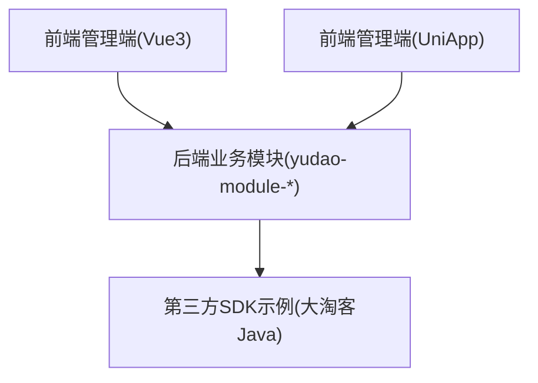
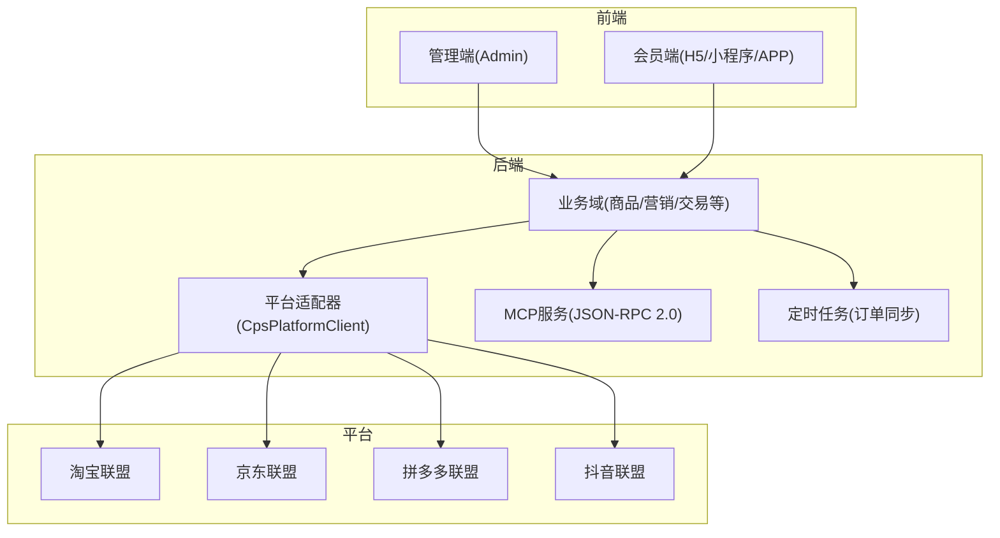
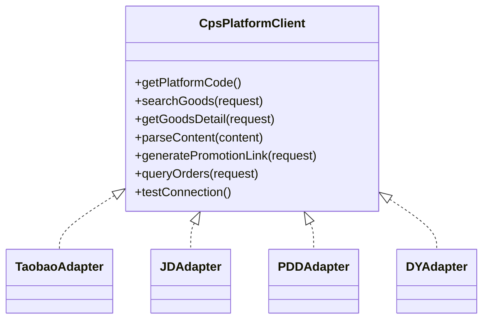
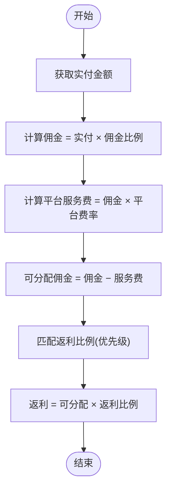
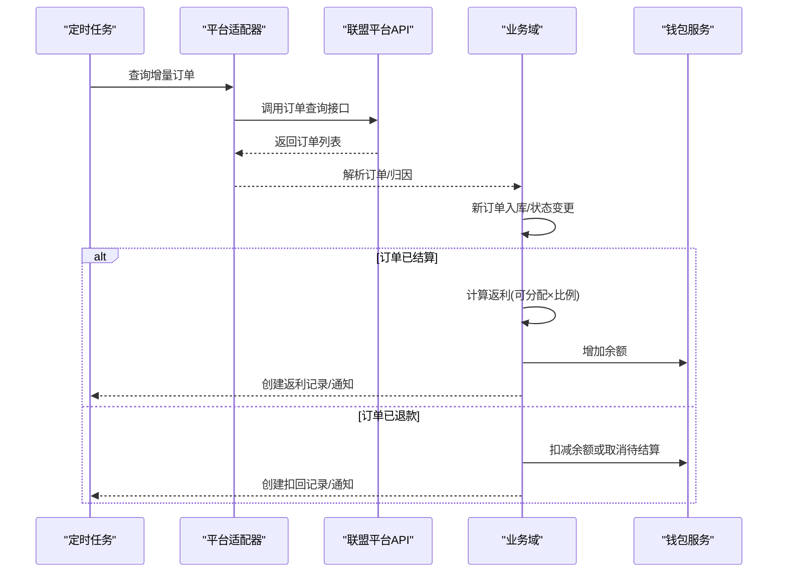
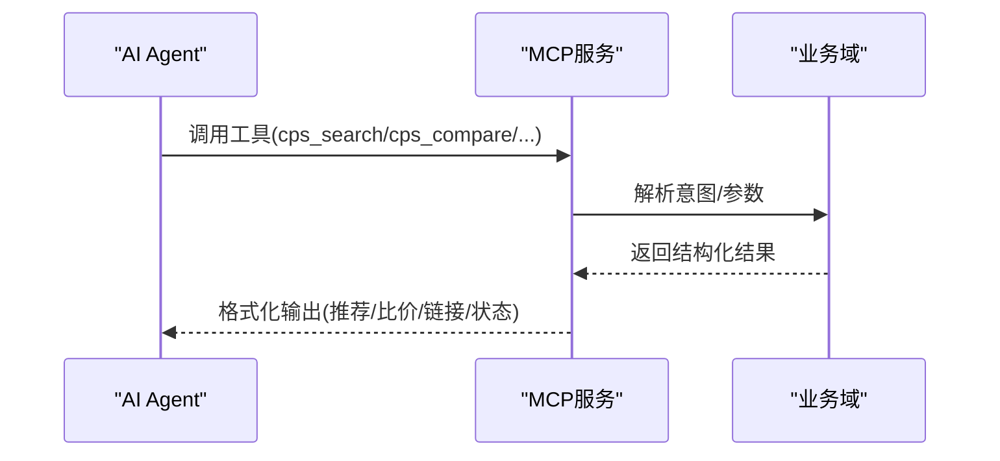
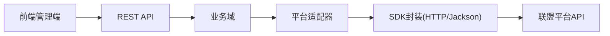

# 多平台对接

<cite>
**本文引用的文件**
- [CPS系统PRD文档.md](file://docs/CPS系统PRD文档.md)
- [AGENTS.md](file://AGENTS.md)
- [DtkJavaOpenPlatformSdkApplication.java](file://agent_improvement/sdk_demo/dataoke-sdk-java/src/main/java/com/dtk/api/DtkJavaOpenPlatformSdkApplication.java)
- [pom.xml](file://agent_improvement/sdk_demo/dataoke-sdk-java/pom.xml)
- [README.md](file://agent_improvement/sdk_demo/dataoke-sdk-java/README.md)
- [index.ts](file://frontend/admin-vue3/src/api/system/oauth2/client.ts)
- [index.ts](file://frontend/admin-vue3/src/api/system/social/client/index.ts)
- [index.ts](file://frontend/admin-uniapp/src/api/system/oauth2/client/index.ts)
- [index.ts](file://frontend/admin-uniapp/src/api/system/social/client/index.ts)
- [index.ts](file://frontend/admin-vue3/src/api/ai/model/model/index.ts)
- [index.ts](file://frontend/admin-vue3/src/api/ai/model/apiKey/index.ts)
- [index.ts](file://frontend/admin-vue3/src/views/ai/model/model/ModelForm.vue)
- [index.ts](file://frontend/admin-vue3/src/api/mall/statistics/common.ts)
- [package-info.java](file://backend/yudao-module-mall/yudao-module-product/src/main/java/cn/iocoder/yudao/module/product/package-info.java)
- [package-info.java](file://backend/yudao-module-mall/yudao-module-promotion/src/main/java/cn/iocoder/yudao/module/promotion/package-info.java)
</cite>

## 目录
1. [引言](#引言)
2. [项目结构](#项目结构)
3. [核心组件](#核心组件)
4. [架构总览](#架构总览)
5. [详细组件分析](#详细组件分析)
6. [依赖关系分析](#依赖关系分析)
7. [性能考虑](#性能考虑)
8. [故障排查指南](#故障排查指南)
9. [结论](#结论)
10. [附录](#附录)

## 引言
本文件面向“多平台对接”能力，系统性阐述如何在统一架构下对接淘宝、京东、拼多多、抖音等电商平台的CPS/联盟API，包括平台适配器设计、统一数据模型、接口封装机制、错误处理策略、限额与风控、SDK使用、集成示例、性能优化与监控告警等。文档以PRD与现有代码片段为依据，结合前端API定义与后端模块命名规范，给出可落地的实施蓝图。

## 项目结构
从整体工程视角，系统由“前端管理端/会员端 + 后端业务模块 + 第三方SDK示例”构成：
- 前端侧提供 OAuth2/Social 客户端配置、AI模型与API Key管理、统计数据接口等；
- 后端模块按领域拆分（如 product/promotion），采用统一包前缀与控制器路由约定；
- 第三方SDK示例（大淘客Java SDK）用于演示平台API封装思路与依赖管理。

**章节来源**
- [package-info.java:1-9](file://backend/yudao-module-mall/yudao-module-product/src/main/java/cn/iocoder/yudao/module/product/package-info.java#L1-L9)
- [package-info.java:1-9](file://backend/yudao-module-mall/yudao-module-promotion/src/main/java/cn/iocoder/yudao/module/promotion/package-info.java#L1-L9)

## 核心组件
围绕多平台对接的核心能力，系统包含以下关键构件：
- 平台适配器（策略模式）：抽象统一的平台客户端接口，屏蔽平台差异；
- 统一数据模型：商品、订单、推广链接、返利等实体的标准化；
- 接口封装层：对各平台API进行HTTP封装、签名/鉴权、重试与限流；
- 订单同步与结算：定时任务拉取增量订单，归因匹配与返利计算；
- MCP AI接口层：通过JSON-RPC 2.0暴露工具与资源，供AI Agent调用；
- 前端配置与监控：OAuth2/Social客户端、AI模型与API Key、错误日志与统计。

**章节来源**
- [AGENTS.md:141-185](file://AGENTS.md#L141-L185)
- [CPS系统PRD文档.md:80-261](file://docs/CPS系统PRD文档.md#L80-L261)

## 架构总览
系统采用“前端-后端-平台”的三层架构：
- 前端负责用户交互与配置管理；
- 后端提供统一业务域与平台适配器；
- 平台通过各自联盟API提供商品、订单、推广等能力。

**图表来源**
- [AGENTS.md:161-168](file://AGENTS.md#L161-L168)
- [CPS系统PRD文档.md:183-223](file://docs/CPS系统PRD文档.md#L183-L223)

## 详细组件分析

### 平台适配器设计（策略模式）
- 设计要点
  - 抽象接口定义：统一平台编码、商品搜索、详情、内容解析、推广链接生成、订单查询、连通性测试；
  - 扩展性：新增平台只需实现接口并注册为Spring Bean，无需改动核心逻辑；
  - 归因参数注入：针对不同平台注入adzone_id、subUnionId、custom_parameters等；
  - 推广位优先级：优先使用会员专属PID，否则回退平台默认PID。

**图表来源**
- [AGENTS.md:141-159](file://AGENTS.md#L141-L159)

**章节来源**
- [AGENTS.md:141-159](file://AGENTS.md#L141-L159)

### 统一数据模型
- 商品与订单
  - 商品：标题、主图、券后价、佣金比例、预估返利、平台标识等；
  - 订单：平台订单号、买家信息、实付金额、佣金、平台服务费、结算状态、归属会员等；
- 推广链接
  - 输出形态：淘口令（淘宝优先）、短链/长链（京东）、推广链接+小程序路径（拼多多）；
  - 归因参数：淘宝adzone_id+external_info、京东subUnionId、拼多多custom_parameters(uid)。
- 返利计算
  - 佣金 = 实付金额 × 佣金比例；
  - 平台服务费 = 佣金 × 平台费率；
  - 可分配佣金 = 佣金 − 平台服务费；
  - 返利 = 可分配佣金 × 返利比例（按优先级匹配）。

**图表来源**
- [CPS系统PRD文档.md:760-780](file://docs/CPS系统PRD文档.md#L760-L780)

**章节来源**
- [CPS系统PRD文档.md:449-480](file://docs/CPS系统PRD文档.md#L449-L480)
- [CPS系统PRD文档.md:760-780](file://docs/CPS系统PRD文档.md#L760-L780)

### 接口封装机制
- HTTP客户端与依赖
  - 示例SDK采用Apache HttpClient、Jackson、Lombok等依赖，便于构建稳定、可维护的HTTP封装；
  - Maven坐标与版本在pom中集中管理，便于升级与审计。
- 请求签名与鉴权
  - 建议在封装层统一处理AppKey/AppSecret、时间戳、随机串、签名算法、加密参数等；
  - 对敏感字段进行脱敏与最小化传输。
- 重试与限流
  - 对平台API调用增加指数退避重试与最大重试次数；
  - 在网关或SDK层实现QPS/并发限制，避免触发平台限流。
- 错误处理
  - 区分网络异常、平台返回错误码、参数错误、签名失败等；
  - 记录traceId、请求参数、响应体、异常栈，便于定位问题。

**章节来源**
- [pom.xml:26-83](file://agent_improvement/sdk_demo/dataoke-sdk-java/pom.xml#L26-L83)
- [README.md:1-18](file://agent_improvement/sdk_demo/dataoke-sdk-java/README.md#L1-L18)

### 订单同步与结算流程
- 定时任务（每5分钟）
  - 遍历启用平台，调用平台订单查询API（增量）；
  - 新订单：解析归因参数 → 匹配会员 → 入库；
  - 已有订单：检查状态变化 → “已结算”触发返利结算 → “已退款”触发返利扣回。
- 返利结算
  - 计算可分配佣金、查询返利比例（优先级：个人平台 > 个人全平台 > 等级+平台 > 等级 > 平台 > 全局）；
  - 增加会员钱包余额、创建返利记录、通知会员。

**图表来源**
- [CPS系统PRD文档.md:183-223](file://docs/CPS系统PRD文档.md#L183-L223)

**章节来源**
- [CPS系统PRD文档.md:183-223](file://docs/CPS系统PRD文档.md#L183-L223)

### MCP AI接口层
- 工具与资源
  - 工具：cps_search、cps_compare、cps_generate_link、cps_get_order_status；
  - 资源：只读数据源（平台配置、返利规则、统计数据）；
  - 提示词：预定义交互模板。
- 通信协议
  - JSON-RPC 2.0 over Streamable HTTP，端点“/mcp/cps”。

**图表来源**
- [AGENTS.md:161-168](file://AGENTS.md#L161-L168)

**章节来源**
- [AGENTS.md:161-168](file://AGENTS.md#L161-L168)

### 前端配置与监控
- OAuth2/Social客户端
  - 管理平台的AppKey/Secret、回调地址、授权类型、作用域等；
  - 支持分页查询、详情、创建、更新、删除。
- AI模型与API Key
  - 模型：名称、平台、类型、温度、上下文长度等；
  - API Key：名称、密钥、权限级别、限流配置、状态。
- 错误日志与统计
  - API错误日志：包含traceId、异常堆栈、处理状态；
  - 统计接口：通用对比响应结构，便于前端展示。

**章节来源**
- [index.ts:1-52](file://frontend/admin-vue3/src/api/system/oauth2/client.ts#L1-L52)
- [index.ts:1-41](file://frontend/admin-vue3/src/api/system/social/client/index.ts#L1-L41)
- [index.ts:1-48](file://frontend/admin-uniapp/src/api/system/oauth2/client/index.ts#L1-L48)
- [index.ts:1-41](file://frontend/admin-uniapp/src/api/system/social/client/index.ts#L1-L41)
- [index.ts:1-54](file://frontend/admin-vue3/src/api/ai/model/model/index.ts#L1-L54)
- [index.ts:1-44](file://frontend/admin-vue3/src/api/ai/model/apiKey/index.ts#L1-L44)
- [index.ts:115-147](file://frontend/admin-vue3/src/views/ai/model/model/ModelForm.vue#L115-L147)
- [index.ts:1-5](file://frontend/admin-vue3/src/api/mall/statistics/common.ts#L1-L5)

## 依赖关系分析
- 模块耦合
  - 前端通过REST API与后端交互，后端通过适配器与平台解耦；
  - MCP作为统一入口，降低AI Agent与平台细节耦合。
- 外部依赖
  - Apache HttpClient、Jackson、Lombok等用于SDK封装；
  - Spring Boot Starter用于Web与测试。

**图表来源**
- [pom.xml:26-83](file://agent_improvement/sdk_demo/dataoke-sdk-java/pom.xml#L26-L83)

**章节来源**
- [pom.xml:26-83](file://agent_improvement/sdk_demo/dataoke-sdk-java/pom.xml#L26-L83)

## 性能考虑
- 并发与超时
  - 搜索阶段对多平台并发查询，单平台超时快速失败，避免阻塞；
  - 设置合理超时与重试，确保P99响应时间达标。
- 缓存与热点
  - 商品详情/热门搜索结果加入缓存，提升重复查询性能；
  - 订单同步采用增量查询，减少无效请求。
- 负载均衡
  - 平台侧限流时，采用轮询/权重策略切换备用AppKey或节点；
  - 对热点商品/关键词建立本地缓存与CDN加速。
- 监控与告警
  - 关键指标：响应时间、错误率、QPS、缓存命中率、重试次数；
  - 告警阈值：单平台错误率突增、P99超时、缓存命中率骤降。

[本节为通用指导，无需列出具体文件来源]

## 故障排查指南
- 平台连通性
  - 使用“平台连通测试”功能验证AppKey/Secret与API地址；
  - 检查签名参数、时间戳偏差、域名白名单等。
- 订单未归因
  - 核对推广链接中的归因参数是否完整注入；
  - 手动绑定会员或修正会员标识映射。
- 返利异常
  - 核对返利比例优先级配置；
  - 检查平台服务费与结算周期是否影响入账。
- 前端配置问题
  - OAuth2/Social客户端参数是否正确；
  - AI模型与API Key权限级别与限流配置是否匹配。

**章节来源**
- [CPS系统PRD文档.md:553-585](file://docs/CPS系统PRD文档.md#L553-L585)
- [CPS系统PRD文档.md:694-757](file://docs/CPS系统PRD文档.md#L694-L757)

## 结论
通过策略模式的平台适配器、统一数据模型与接口封装，系统实现了对多平台CPS/联盟API的高效对接。结合定时任务的订单同步、MCP的AI接口层以及完善的前端配置与监控体系，能够满足多平台比价、推广链接生成、返利结算与提现等核心业务需求，并具备良好的扩展性与稳定性。

[本节为总结性内容，无需列出具体文件来源]

## 附录

### 平台特殊要求与参数差异
- 淘宝
  - 归因参数：adzone_id + external_info；
  - 输出：优先淘口令，其次推广链接。
- 京东
  - 归因参数：subUnionId（映射会员标识）；
  - 输出：短链/长链。
- 拼多多
  - 归因参数：custom_parameters(uid)；
  - 输出：推广链接 + 小程序路径。
- 抖音（参考现有平台）
  - 归因参数与输出形态需按平台文档补充。

**章节来源**
- [CPS系统PRD文档.md:152-181](file://docs/CPS系统PRD文档.md#L152-L181)

### SDK使用指南（以大淘客Java SDK为例）
- 依赖引入
  - 在pom中声明HttpClient、Jackson、Lombok等依赖；
  - 配置编译插件与资源过滤。
- 启动与示例
  - 通过Spring Boot应用入口启动SDK示例；
  - README中列举了接口覆盖范围与更新内容。

**章节来源**
- [pom.xml:17-83](file://agent_improvement/sdk_demo/dataoke-sdk-java/pom.xml#L17-L83)
- [DtkJavaOpenPlatformSdkApplication.java:1-13](file://agent_improvement/sdk_demo/dataoke-sdk-java/src/main/java/com/dtk/api/DtkJavaOpenPlatformSdkApplication.java#L1-L13)
- [README.md:1-18](file://agent_improvement/sdk_demo/dataoke-sdk-java/README.md#L1-L18)