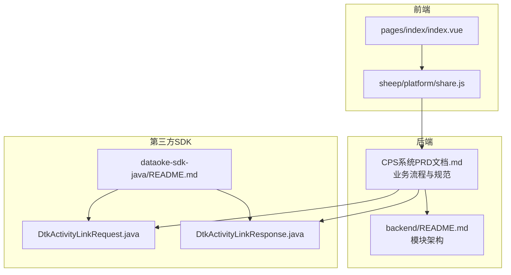
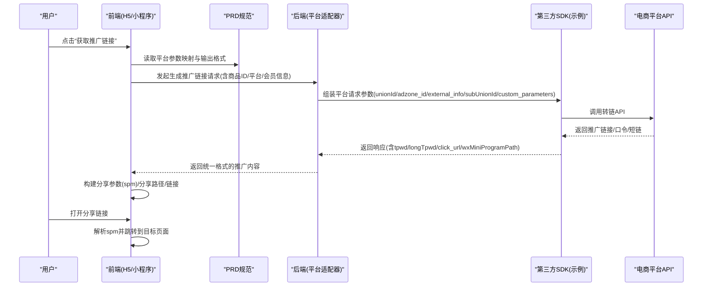
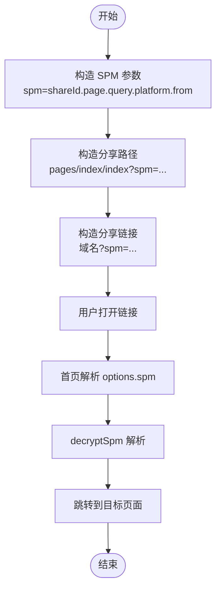
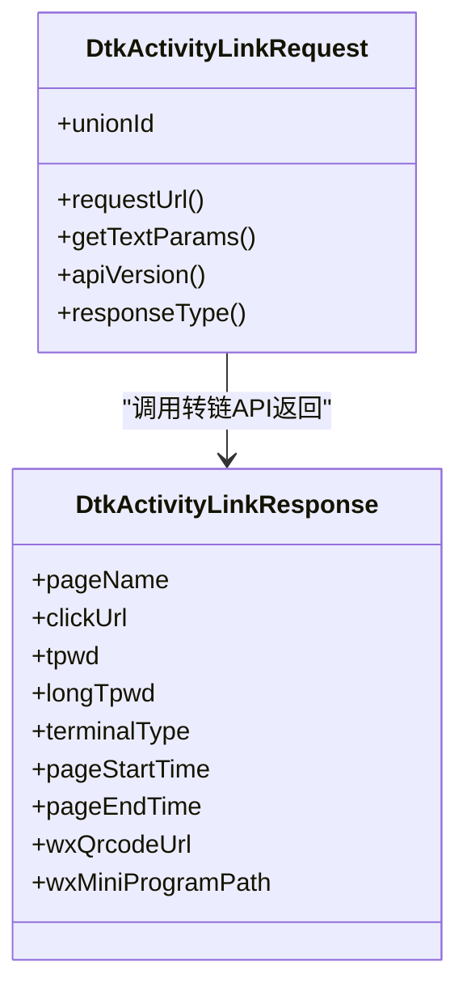
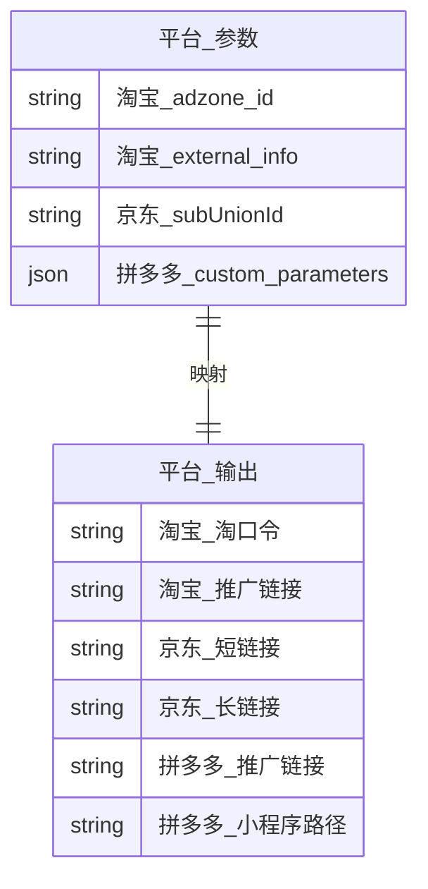
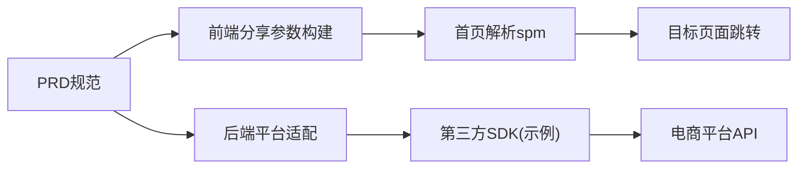

# 推广链接生成

<cite>
**本文引用的文件**
- [CPS系统PRD文档.md](file://docs/CPS系统PRD文档.md)
- [README.md](file://README.md)
- [backend/README.md](file://backend/README.md)
- [frontend/mall-uniapp/pages/index/index.vue](file://frontend/mall-uniapp/pages/index/index.vue)
- [frontend/mall-uniapp/sheep/platform/share.js](file://frontend/mall-uniapp/sheep/platform/share.js)
- [agent_improvement/sdk_demo/dataoke-sdk-java/README.md](file://agent_improvement/sdk_demo/dataoke-sdk-java/README.md)
- [agent_improvement/sdk_demo/dataoke-sdk-java/src/main/java/com/dtk/api/request/mastertool/DtkActivityLinkRequest.java](file://agent_improvement/sdk_demo/dataoke-sdk-java/src/main/java/com/dtk/api/request/mastertool/DtkActivityLinkRequest.java)
- [agent_improvement/sdk_demo/dataoke-sdk-java/src/main/java/com/dtk/api/response/mastertool/DtkActivityLinkResponse.java](file://agent_improvement/sdk_demo/dataoke-sdk-java/src/main/java/com/dtk/api/response/mastertool/DtkActivityLinkResponse.java)
</cite>

## 目录
1. [引言](#引言)
2. [项目结构](#项目结构)
3. [核心组件](#核心组件)
4. [架构总览](#架构总览)
5. [详细组件分析](#详细组件分析)
6. [依赖关系分析](#依赖关系分析)
7. [性能考量](#性能考量)
8. [故障排查指南](#故障排查指南)
9. [结论](#结论)
10. [附录](#附录)

## 引言
本文件围绕“推广链接生成”功能，系统阐述其原理、参数编码机制、跳转逻辑、模板配置、动态参数注入、平台适配策略、有效性验证、安全与防作弊、点击追踪、接口规范与配置示例，并覆盖淘宝、京东、拼多多、抖音四大平台的链接格式差异与参数映射规则。

## 项目结构
- 后端采用模块化分层：API 定义层、业务实现层、客户端适配器（策略模式）、定时任务、MCP 接口层。
- 前端包含 H5/小程序/APP 端，负责分享参数构建、解密与落地页跳转。
- 第三方 SDK 示例（大淘客 Java SDK）展示了淘宝联盟转链请求与响应结构，便于理解参数映射与返回字段。

**图示来源**
- [backend/README.md:223-243](file://backend/README.md#L223-L243)
- [README.md:229-249](file://README.md#L229-L249)
- [CPS系统PRD文档.md:152-181](file://docs/CPS系统PRD文档.md#L152-L181)
- [frontend/mall-uniapp/pages/index/index.vue:56-80](file://frontend/mall-uniapp/pages/index/index.vue#L56-L80)
- [frontend/mall-uniapp/sheep/platform/share.js:80-121](file://frontend/mall-uniapp/sheep/platform/share.js#L80-L121)
- [agent_improvement/sdk_demo/dataoke-sdk-java/README.md:1-18](file://agent_improvement/sdk_demo/dataoke-sdk-java/README.md#L1-L18)
- [agent_improvement/sdk_demo/dataoke-sdk-java/src/main/java/com/dtk/api/request/mastertool/DtkActivityLinkRequest.java:33-58](file://agent_improvement/sdk_demo/dataoke-sdk-java/src/main/java/com/dtk/api/request/mastertool/DtkActivityLinkRequest.java#L33-L58)
- [agent_improvement/sdk_demo/dataoke-sdk-java/src/main/java/com/dtk/api/response/mastertool/DtkActivityLinkResponse.java:1-36](file://agent_improvement/sdk_demo/dataoke-sdk-java/src/main/java/com/dtk/api/response/mastertool/DtkActivityLinkResponse.java#L1-L36)

**章节来源**
- [backend/README.md:223-243](file://backend/README.md#L223-L243)
- [README.md:229-249](file://README.md#L229-L249)
- [CPS系统PRD文档.md:152-181](file://docs/CPS系统PRD文档.md#L152-L181)

## 核心组件
- 推广链接生成流程（PRD）
  - 选择商品 → 确定平台与商品ID → 获取会员推广位（PID）→ 注入归因参数 → 调用平台转链API → 返回推广链接/口令/短链 → 记录转链日志。
- 归因参数注入（PRD）
  - 淘宝：adzone_id + external_info
  - 京东：subUnionId = 会员标识映射
  - 拼多多：custom_parameters = {"uid":"会员ID"}
- 输出格式（PRD）
  - 淘宝：淘口令（优先） + 推广链接
  - 京东：短链接 + 长链接
  - 拼多多：推广链接 + 小程序路径
- 分享参数体系（前端）
  - 构建 SPM 参数（spm=shareId.page.query.platform.from）
  - 构建分享路径与链接，首页解析 SPM 并跳转至目标页面
- 第三方 SDK（淘宝联盟）
  - 请求类包含转链接口路径与参数（unionId 等）
  - 响应类包含 click_url、tpwd、longTpwd、wxMiniProgramPath 等字段

**章节来源**
- [CPS系统PRD文档.md:152-181](file://docs/CPS系统PRD文档.md#L152-L181)
- [CPS系统PRD文档.md:459-483](file://docs/CPS系统PRD文档.md#L459-L483)
- [frontend/mall-uniapp/sheep/platform/share.js:80-121](file://frontend/mall-uniapp/sheep/platform/share.js#L80-L121)
- [frontend/mall-uniapp/pages/index/index.vue:56-80](file://frontend/mall-uniapp/pages/index/index.vue#L56-L80)
- [agent_improvement/sdk_demo/dataoke-sdk-java/src/main/java/com/dtk/api/request/mastertool/DtkActivityLinkRequest.java:33-58](file://agent_improvement/sdk_demo/dataoke-sdk-java/src/main/java/com/dtk/api/request/mastertool/DtkActivityLinkRequest.java#L33-L58)
- [agent_improvement/sdk_demo/dataoke-sdk-java/src/main/java/com/dtk/api/response/mastertool/DtkActivityLinkResponse.java:1-36](file://agent_improvement/sdk_demo/dataoke-sdk-java/src/main/java/com/dtk/api/response/mastertool/DtkActivityLinkResponse.java#L1-L36)

## 架构总览
推广链接生成贯穿“前端分享参数构建 → 后端平台适配与转链 → 平台返回链接/口令 → 前端落地页解析与跳转”的闭环。

**图示来源**
- [CPS系统PRD文档.md:152-181](file://docs/CPS系统PRD文档.md#L152-L181)
- [CPS系统PRD文档.md:459-483](file://docs/CPS系统PRD文档.md#L459-L483)
- [frontend/mall-uniapp/sheep/platform/share.js:80-121](file://frontend/mall-uniapp/sheep/platform/share.js#L80-L121)
- [frontend/mall-uniapp/pages/index/index.vue:56-80](file://frontend/mall-uniapp/pages/index/index.vue#L56-L80)
- [agent_improvement/sdk_demo/dataoke-sdk-java/src/main/java/com/dtk/api/request/mastertool/DtkActivityLinkRequest.java:33-58](file://agent_improvement/sdk_demo/dataoke-sdk-java/src/main/java/com/dtk/api/request/mastertool/DtkActivityLinkRequest.java#L33-L58)
- [agent_improvement/sdk_demo/dataoke-sdk-java/src/main/java/com/dtk/api/response/mastertool/DtkActivityLinkResponse.java:1-36](file://agent_improvement/sdk_demo/dataoke-sdk-java/src/main/java/com/dtk/api/response/mastertool/DtkActivityLinkResponse.java#L1-L36)

## 详细组件分析

### 组件A：前端分享参数与落地页跳转
- 分享参数构建
  - 构造 SPM 参数：spm=shareId.page.query.platform.from
  - 构建分享路径：pages/index/index?spm=...
  - 构建分享链接：域名?spm=...
- 落地页解析
  - 首页 onLoad/onShow 解析 options.spm，调用 decryptSpm 解析并跳转目标页面
- 适用场景
  - 通用分享（含平台来源标记），便于后续归因与统计

**图示来源**
- [frontend/mall-uniapp/sheep/platform/share.js:80-121](file://frontend/mall-uniapp/sheep/platform/share.js#L80-L121)
- [frontend/mall-uniapp/pages/index/index.vue:56-80](file://frontend/mall-uniapp/pages/index/index.vue#L56-L80)

**章节来源**
- [frontend/mall-uniapp/sheep/platform/share.js:80-121](file://frontend/mall-uniapp/sheep/platform/share.js#L80-L121)
- [frontend/mall-uniapp/pages/index/index.vue:56-80](file://frontend/mall-uniapp/pages/index/index.vue#L56-L80)

### 组件B：后端平台适配与参数注入
- 参数注入策略（PRD）
  - 淘宝：adzone_id + external_info
  - 京东：subUnionId = 会员标识映射
  - 拼多多：custom_parameters = {"uid":"会员ID"}
- 输出格式策略（PRD）
  - 淘宝：优先返回淘口令，再返回推广链接
  - 京东：返回短链接 + 长链接
  - 拼多多：返回推广链接 + 小程序路径
- 第三方 SDK 对照
  - 请求类包含转链接口路径与参数（unionId 等）
  - 响应类包含 click_url、tpwd、longTpwd、wxMiniProgramPath 等字段

**图示来源**
- [agent_improvement/sdk_demo/dataoke-sdk-java/src/main/java/com/dtk/api/request/mastertool/DtkActivityLinkRequest.java:33-58](file://agent_improvement/sdk_demo/dataoke-sdk-java/src/main/java/com/dtk/api/request/mastertool/DtkActivityLinkRequest.java#L33-L58)
- [agent_improvement/sdk_demo/dataoke-sdk-java/src/main/java/com/dtk/api/response/mastertool/DtkActivityLinkResponse.java:1-36](file://agent_improvement/sdk_demo/dataoke-sdk-java/src/main/java/com/dtk/api/response/mastertool/DtkActivityLinkResponse.java#L1-L36)

**章节来源**
- [CPS系统PRD文档.md:152-181](file://docs/CPS系统PRD文档.md#L152-L181)
- [CPS系统PRD文档.md:459-483](file://docs/CPS系统PRD文档.md#L459-L483)
- [agent_improvement/sdk_demo/dataoke-sdk-java/README.md:1-18](file://agent_improvement/sdk_demo/dataoke-sdk-java/README.md#L1-L18)
- [agent_improvement/sdk_demo/dataoke-sdk-java/src/main/java/com/dtk/api/request/mastertool/DtkActivityLinkRequest.java:33-58](file://agent_improvement/sdk_demo/dataoke-sdk-java/src/main/java/com/dtk/api/request/mastertool/DtkActivityLinkRequest.java#L33-L58)
- [agent_improvement/sdk_demo/dataoke-sdk-java/src/main/java/com/dtk/api/response/mastertool/DtkActivityLinkResponse.java:1-36](file://agent_improvement/sdk_demo/dataoke-sdk-java/src/main/java/com/dtk/api/response/mastertool/DtkActivityLinkResponse.java#L1-L36)

### 组件C：平台适配策略与参数映射
- 淘宝
  - 参数：adzone_id、external_info、unionId
  - 输出：淘口令（优先）+ 推广链接
  - SDK 字段：tpwd、longTpwd、click_url
- 京东
  - 参数：subUnionId（会员标识映射）
  - 输出：短链接 + 长链接
- 拼多多
  - 参数：custom_parameters = {"uid":"会员ID"}
  - 输出：推广链接 + 小程序路径（wxMiniProgramPath）
- 抖音
  - 模块存在（后端 README），具体参数与输出格式需参考平台对接文档与实现

**图示来源**
- [CPS系统PRD文档.md:152-181](file://docs/CPS系统PRD文档.md#L152-L181)
- [CPS系统PRD文档.md:459-483](file://docs/CPS系统PRD文档.md#L459-L483)
- [agent_improvement/sdk_demo/dataoke-sdk-java/src/main/java/com/dtk/api/response/mastertool/DtkActivityLinkResponse.java:1-36](file://agent_improvement/sdk_demo/dataoke-sdk-java/src/main/java/com/dtk/api/response/mastertool/DtkActivityLinkResponse.java#L1-L36)

**章节来源**
- [CPS系统PRD文档.md:152-181](file://docs/CPS系统PRD文档.md#L152-L181)
- [CPS系统PRD文档.md:459-483](file://docs/CPS系统PRD文档.md#L459-L483)
- [agent_improvement/sdk_demo/dataoke-sdk-java/src/main/java/com/dtk/api/response/mastertool/DtkActivityLinkResponse.java:1-36](file://agent_improvement/sdk_demo/dataoke-sdk-java/src/main/java/com/dtk/api/response/mastertool/DtkActivityLinkResponse.java#L1-L36)

### 组件D：链接有效性验证与安全机制
- 链接有效性验证
  - 平台返回字段校验：click_url、tpwd、longTpwd、wxMiniProgramPath 等
  - 参数完整性校验：unionId、adzone_id、external_info、subUnionId、custom_parameters
- 安全与防作弊
  - 归因参数加密/签名（建议：对关键参数进行签名，防止篡改）
  - 链接有效期控制（建议：生成带过期时间的临时链接）
  - 黑名单与风控（建议：对异常来源、频繁请求、异常设备进行拦截）
  - 点击追踪埋点（建议：埋点参数包含 spm、平台、来源、时间戳）

**章节来源**
- [agent_improvement/sdk_demo/dataoke-sdk-java/src/main/java/com/dtk/api/response/mastertool/DtkActivityLinkResponse.java:1-36](file://agent_improvement/sdk_demo/dataoke-sdk-java/src/main/java/com/dtk/api/response/mastertool/DtkActivityLinkResponse.java#L1-L36)
- [CPS系统PRD文档.md:152-181](file://docs/CPS系统PRD文档.md#L152-L181)

## 依赖关系分析
- 前端依赖 PRD 规范与后端接口，后端依赖平台适配器与第三方 SDK。
- 分享参数（spm）在前端构建并在落地页解析，确保归因链路完整。

**图示来源**
- [CPS系统PRD文档.md:152-181](file://docs/CPS系统PRD文档.md#L152-L181)
- [frontend/mall-uniapp/sheep/platform/share.js:80-121](file://frontend/mall-uniapp/sheep/platform/share.js#L80-L121)
- [frontend/mall-uniapp/pages/index/index.vue:56-80](file://frontend/mall-uniapp/pages/index/index.vue#L56-L80)
- [agent_improvement/sdk_demo/dataoke-sdk-java/src/main/java/com/dtk/api/request/mastertool/DtkActivityLinkRequest.java:33-58](file://agent_improvement/sdk_demo/dataoke-sdk-java/src/main/java/com/dtk/api/request/mastertool/DtkActivityLinkRequest.java#L33-L58)

**章节来源**
- [CPS系统PRD文档.md:152-181](file://docs/CPS系统PRD文档.md#L152-L181)
- [frontend/mall-uniapp/sheep/platform/share.js:80-121](file://frontend/mall-uniapp/sheep/platform/share.js#L80-L121)
- [frontend/mall-uniapp/pages/index/index.vue:56-80](file://frontend/mall-uniapp/pages/index/index.vue#L56-L80)

## 性能考量
- 并发与缓存
  - 并发查询多平台结果，减少首屏等待时间
  - 对热点商品与链接进行缓存，降低重复生成成本
- 转链接口优化
  - 合理设置超时与重试策略，避免阻塞前端渲染
  - 对第三方接口进行限流与熔断，提升稳定性
- 前端渲染
  - 骨架屏与懒加载，提升用户体验

## 故障排查指南
- 常见问题
  - 生成链接为空：检查平台返回字段（click_url/tpwd/longTpwd/wxMiniProgramPath）是否存在
  - 归因失败：检查 spm 构建与解析逻辑，确认 shareId、page、query、platform、from 是否正确
  - 跳转异常：确认 buildSpmPath 与 buildSpmLink 的参数拼接是否符合预期
- 排查步骤
  - 前端：打印 options.spm 与解析结果，确认 decryptSpm 输出
  - 后端：检查参数注入（unionId/adzone_id/external_info/subUnionId/custom_parameters）是否完整
  - 第三方：核对 SDK 请求路径与响应字段是否匹配

**章节来源**
- [frontend/mall-uniapp/sheep/platform/share.js:80-121](file://frontend/mall-uniapp/sheep/platform/share.js#L80-L121)
- [frontend/mall-uniapp/pages/index/index.vue:56-80](file://frontend/mall-uniapp/pages/index/index.vue#L56-L80)
- [agent_improvement/sdk_demo/dataoke-sdk-java/src/main/java/com/dtk/api/response/mastertool/DtkActivityLinkResponse.java:1-36](file://agent_improvement/sdk_demo/dataoke-sdk-java/src/main/java/com/dtk/api/response/mastertool/DtkActivityLinkResponse.java#L1-L36)

## 结论
推广链接生成功能以 PRD 为纲，结合前端分享参数体系与后端平台适配器，形成“参数注入—转链—落地页解析—跳转”的闭环。通过标准化的参数映射与输出格式，以及完善的链接有效性验证与安全机制，可有效支撑多平台推广与归因统计。

## 附录

### 接口规范与配置示例（示意）
- 生成推广链接请求
  - 方法：POST
  - 路径：/promotion/generate-link
  - 请求体字段（示意）：
    - productId: 商品ID
    - platform: 平台编码（taobao/jd/pdd/douyin）
    - memberId: 会员ID
    - unionId: 渠道标识（可选）
    - adzoneId: 推广位ID（可选，淘宝）
    - externalInfo: 外部信息（可选，淘宝）
    - subUnionId: 子联盟ID（可选，京东）
    - customParameters: 自定义参数（可选，拼多多）
- 生成推广链接响应
  - 字段（示意）：
    - tpwd: 淘口令（淘宝）
    - longTpwd: 长淘口令（淘宝）
    - clickUrl: 推广链接
    - shortUrl: 短链接（京东）
    - wxMiniProgramPath: 小程序路径（拼多多）
    - status: 状态码
    - message: 描述

### 平台参数映射与回调地址
- 淘宝
  - 参数：adzone_id、external_info、unionId
  - 回调：click_url（推广链接）
- 京东
  - 参数：subUnionId
  - 回调：shortUrl、clickUrl
- 拼多多
  - 参数：custom_parameters = {"uid":"会员ID"}
  - 回调：推广链接 + 小程序路径
- 抖音
  - 模块存在（后端 README），参数与回调需按平台对接文档补充

**章节来源**
- [CPS系统PRD文档.md:152-181](file://docs/CPS系统PRD文档.md#L152-L181)
- [CPS系统PRD文档.md:459-483](file://docs/CPS系统PRD文档.md#L459-L483)
- [backend/README.md:223-243](file://backend/README.md#L223-L243)
- [README.md:229-249](file://README.md#L229-L249)