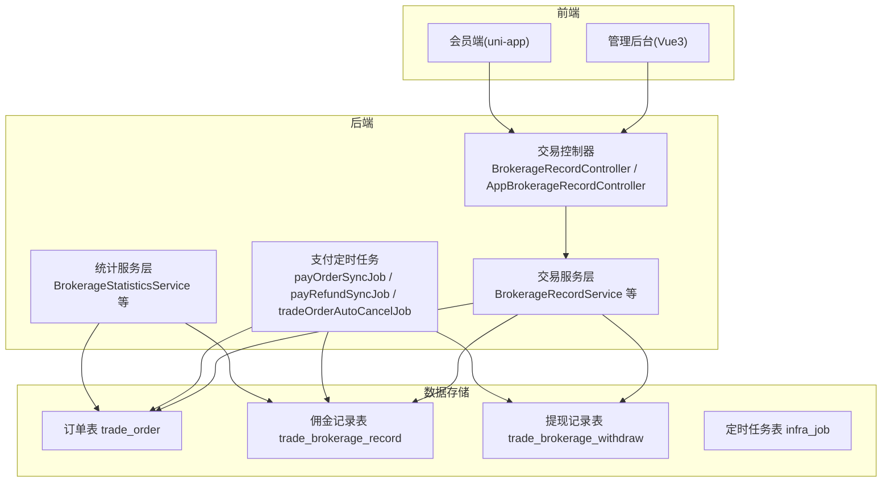
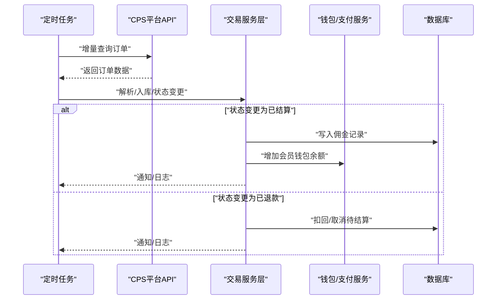
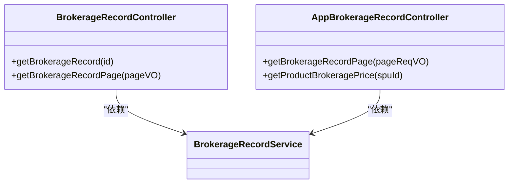
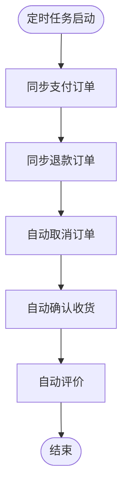
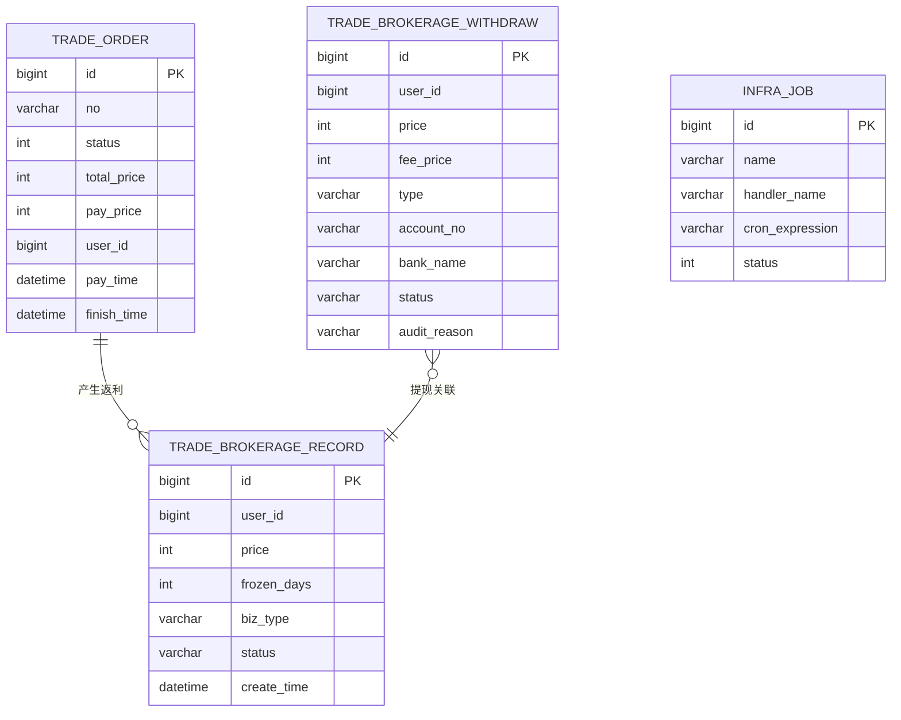
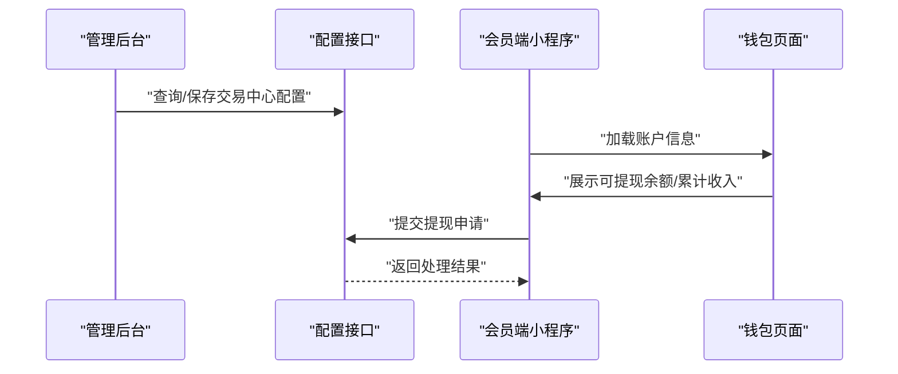
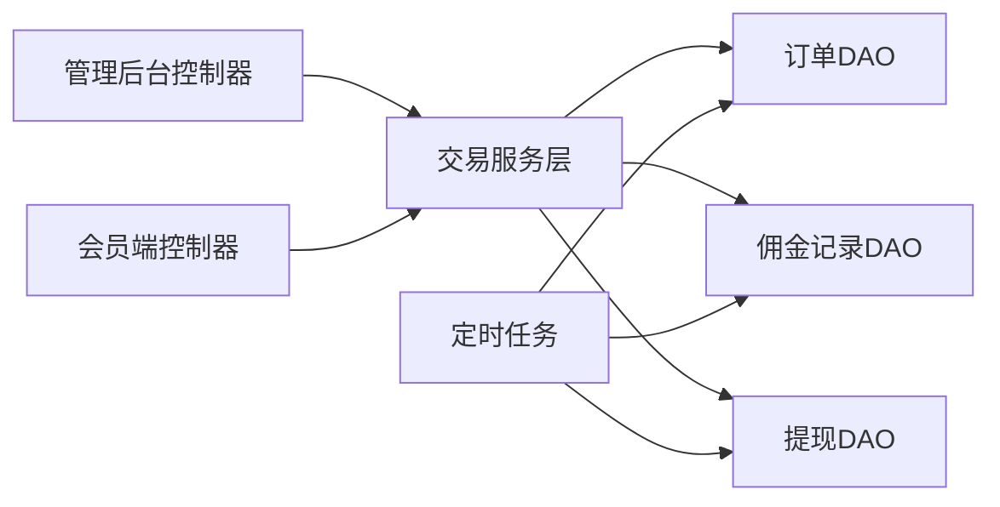
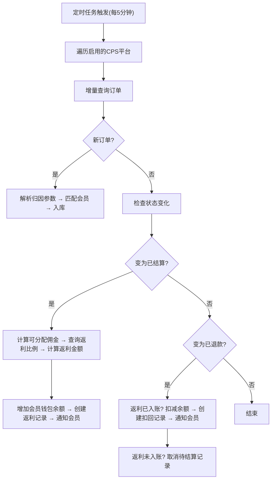

# 订单同步与结算

<cite>
**本文引用的文件**
- [CPS系统PRD文档.md](file://docs/CPS系统PRD文档.md)
- [BrokerageRecordController.java](file://backend/yudao-module-mall/yudao-module-trade/src/main/java/cn/iocoder/yudao/module/trade/controller/admin/brokerage/BrokerageRecordController.java)
- [AppBrokerageRecordController.java](file://backend/yudao-module-mall/yudao-module-trade/src/main/java/cn/iocoder/yudao/module/trade/controller/app/brokerage/AppBrokerageRecordController.java)
- [create_tables.sql](file://backend/yudao-module-mall/yudao-module-trade/src/test/resources/sql/create_tables.sql)
- [ruoyi-vue-pro.sql (MySQL)](file://backend/sql/mysql/ruoyi-vue-pro.sql)
- [ruoyi-vue-pro.sql (PostgreSQL)](file://backend/sql/postgresql/ruoyi-vue-pro.sql)
- [ruoyi-vue-pro.sql (SQLServer)](file://backend/sql/sqlserver/ruoyi-vue-pro.sql)
- [ruoyi-vue-pro.sql (Kingbase)](file://backend/sql/kingbase/ruoyi-vue-pro.sql)
- [ruoyi-vue-pro-dm8.sql (DM8)](file://backend/sql/dm/ruoyi-vue-pro-dm8.sql)
- [ruoyi-vue-pro.sql (OpenGauss)](file://backend/sql/opengauss/ruoyi-vue-pro.sql)
- [index.ts (前端配置接口)](file://frontend/admin-vue3/src/api/mall/trade/config/index.ts)
- [wallet.vue](file://frontend/mall-uniapp/pages/commission/wallet.vue)
- [account-info.vue](file://frontend/mall-uniapp/pages/commission/components/account-info.vue)
- [commission-auth.vue](file://frontend/mall-uniapp/pages/commission/components/commission-auth.vue)
</cite>

## 目录
1. [引言](#引言)
2. [项目结构](#项目结构)
3. [核心组件](#核心组件)
4. [架构总览](#架构总览)
5. [详细组件分析](#详细组件分析)
6. [依赖关系分析](#依赖关系分析)
7. [性能考量](#性能考量)
8. [故障排查指南](#故障排查指南)
9. [结论](#结论)
10. [附录](#附录)

## 引言
本文件聚焦“订单同步与结算”能力，围绕订单数据同步机制、状态变更处理、结算流程自动化、异常订单处理、结算周期与到账时间控制、佣金计算与对账、提现流程与风控策略等进行系统化梳理，并结合前后端实现与数据库结构给出可落地的技术说明与可视化图示，帮助开发者与运营人员快速理解与维护该核心业务闭环。

## 项目结构
- 后端模块
  - 订单与交易模块：负责订单生命周期管理、佣金结算、提现等核心业务
  - 支付模块：负责支付订单同步、退款同步、过期处理等
  - 统计模块：负责交易与佣金统计、看板数据
- 前端模块
  - 商城小程序/APP：会员端查看订单、返利明细、提现申请与状态
  - 管理后台：平台配置、返利规则、订单与结算对账、提现审核、数据看板

**图表来源**
- [BrokerageRecordController.java:1-67](file://backend/yudao-module-mall/yudao-module-trade/src/main/java/cn/iocoder/yudao/module/trade/controller/admin/brokerage/BrokerageRecordController.java#L1-L67)
- [AppBrokerageRecordController.java:1-53](file://backend/yudao-module-mall/yudao-module-trade/src/main/java/cn/iocoder/yudao/module/trade/controller/app/brokerage/AppBrokerageRecordController.java#L1-L53)
- [create_tables.sql:1-209](file://backend/yudao-module-mall/yudao-module-trade/src/test/resources/sql/create_tables.sql#L1-L209)
- [ruoyi-vue-pro.sql (MySQL):338-348](file://backend/sql/mysql/ruoyi-vue-pro.sql#L338-L348)

**章节来源**
- [BrokerageRecordController.java:1-67](file://backend/yudao-module-mall/yudao-module-trade/src/main/java/cn/iocoder/yudao/module/trade/controller/admin/brokerage/BrokerageRecordController.java#L1-L67)
- [AppBrokerageRecordController.java:1-53](file://backend/yudao-module-mall/yudao-module-trade/src/main/java/cn/iocoder/yudao/module/trade/controller/app/brokerage/AppBrokerageRecordController.java#L1-L53)
- [create_tables.sql:1-209](file://backend/yudao-module-mall/yudao-module-trade/src/test/resources/sql/create_tables.sql#L1-L209)

## 核心组件
- 订单同步与结算流程
  - 定时任务每5分钟触发，遍历启用的CPS平台，增量查询订单
  - 新订单：解析归因参数 → 匹配会员 → 入库
  - 已有订单：检查状态变化 → 若变为“已结算”触发返利结算；若变为“已退款”触发返利扣回
- 佣金计算与入账
  - 可分配佣金 = 商品佣金 - 平台服务费
  - 返利金额 = 可分配佣金 × 返利比例（优先级：个人 > 等级+平台 > 等级 > 平台 > 全局）
  - 入账到会员钱包，创建返利记录并通知
- 提现流程
  - 余额校验、限额与风控校验
  - 审核阈值内自动通过，超出进入人工审核
  - 打款成功/失败分别扣减余额或返还并标记异常
- 对账与异常处理
  - 异常订单（未归因）可在后台手动绑定会员
  - 结算周期与到账时间受平台结算节奏与系统延迟影响

**章节来源**
- [CPS系统PRD文档.md:183-223](file://docs/CPS系统PRD文档.md#L183-L223)
- [CPS系统PRD文档.md:760-800](file://docs/CPS系统PRD文档.md#L760-L800)

## 架构总览
订单同步与结算贯穿“前端-后端-定时任务-数据库”的完整链路，核心要点：
- 前端通过API查询订单与返利明细，会员端可申请提现
- 后端提供管理后台与会员端接口，封装佣金记录、用户与提现服务
- 定时任务负责支付订单同步、退款同步、订单自动取消/收货/评论等
- 数据库存储订单、佣金记录、提现记录与定时任务配置

**图表来源**
- [CPS系统PRD文档.md:183-223](file://docs/CPS系统PRD文档.md#L183-L223)
- [ruoyi-vue-pro.sql (MySQL):338-348](file://backend/sql/mysql/ruoyi-vue-pro.sql#L338-L348)

## 详细组件分析

### 组件A：订单同步与结算（后端控制器）
- 管理后台接口
  - 查询佣金记录分页，按用户ID批量拉取用户信息拼接展示
- 会员端接口
  - 分页查询佣金记录，按字典标签渲染状态
  - 计算商品返利金额（用于前端展示预估返利）

**图表来源**
- [BrokerageRecordController.java:1-67](file://backend/yudao-module-mall/yudao-module-trade/src/main/java/cn/iocoder/yudao/module/trade/controller/admin/brokerage/BrokerageRecordController.java#L1-L67)
- [AppBrokerageRecordController.java:1-53](file://backend/yudao-module-mall/yudao-module-trade/src/main/java/cn/iocoder/yudao/module/trade/controller/app/brokerage/AppBrokerageRecordController.java#L1-L53)

**章节来源**
- [BrokerageRecordController.java:1-67](file://backend/yudao-module-mall/yudao-module-trade/src/main/java/cn/iocoder/yudao/module/trade/controller/admin/brokerage/BrokerageRecordController.java#L1-L67)
- [AppBrokerageRecordController.java:1-53](file://backend/yudao-module-mall/yudao-module-trade/src/main/java/cn/iocoder/yudao/module/trade/controller/app/brokerage/AppBrokerageRecordController.java#L1-L53)

### 组件B：定时任务与支付/交易作业
- 支付订单同步、退款同步、交易订单自动取消/收货/评论
- 通过定时任务表配置执行周期与状态

**图表来源**
- [ruoyi-vue-pro.sql (MySQL):338-348](file://backend/sql/mysql/ruoyi-vue-pro.sql#L338-L348)
- [ruoyi-vue-pro.sql (PostgreSQL):558-561](file://backend/sql/postgresql/ruoyi-vue-pro.sql#L558-L561)
- [ruoyi-vue-pro.sql (SQLServer):1627-1635](file://backend/sql/sqlserver/ruoyi-vue-pro.sql#L1627-L1635)
- [ruoyi-vue-pro.sql (Kingbase):575-578](file://backend/sql/kingbase/ruoyi-vue-pro.sql#L575-L578)
- [ruoyi-vue-pro-dm8.sql (DM8):483-486](file://backend/sql/dm/ruoyi-vue-pro-dm8.sql#L483-L486)
- [ruoyi-vue-pro.sql (OpenGauss):575-578](file://backend/sql/opengauss/ruoyi-vue-pro.sql#L575-L578)

**章节来源**
- [ruoyi-vue-pro.sql (MySQL):338-348](file://backend/sql/mysql/ruoyi-vue-pro.sql#L338-L348)
- [ruoyi-vue-pro.sql (PostgreSQL):558-561](file://backend/sql/postgresql/ruoyi-vue-pro.sql#L558-L561)
- [ruoyi-vue-pro.sql (SQLServer):1627-1635](file://backend/sql/sqlserver/ruoyi-vue-pro.sql#L1627-L1635)
- [ruoyi-vue-pro.sql (Kingbase):575-578](file://backend/sql/kingbase/ruoyi-vue-pro.sql#L575-L578)
- [ruoyi-vue-pro-dm8.sql (DM8):483-486](file://backend/sql/dm/ruoyi-vue-pro-dm8.sql#L483-L486)
- [ruoyi-vue-pro.sql (OpenGauss):575-578](file://backend/sql/opengauss/ruoyi-vue-pro.sql#L575-L578)

### 组件C：数据库模型与字段约定
- 订单表：包含订单编号、状态、支付信息、佣金归属等字段
- 佣金记录表：记录返利金额、业务类型、状态、冻结期等
- 提现记录表：提现金额、手续费、账户信息、状态、审核原因等
- 定时任务表：任务名称、处理器、Cron表达式、状态等

**图表来源**
- [create_tables.sql:1-209](file://backend/yudao-module-mall/yudao-module-trade/src/test/resources/sql/create_tables.sql#L1-L209)

**章节来源**
- [create_tables.sql:1-209](file://backend/yudao-module-mall/yudao-module-trade/src/test/resources/sql/create_tables.sql#L1-L209)

### 组件D：前端接口与业务流程
- 管理后台配置接口：查询与保存交易中心配置（含提现最小金额、冻结天数、提现类型等）
- 会员端钱包页面：查看账户信息、发起提现、查看提现记录与状态
- 佣金授权弹窗：引导用户开启佣金资格

**图表来源**
- [index.ts (前端配置接口):1-23](file://frontend/admin-vue3/src/api/mall/trade/config/index.ts#L1-L23)
- [wallet.vue:264-314](file://frontend/mall-uniapp/pages/commission/wallet.vue#L264-L314)
- [account-info.vue:34-81](file://frontend/mall-uniapp/pages/commission/components/account-info.vue#L34-L81)
- [commission-auth.vue:44-101](file://frontend/mall-uniapp/pages/commission/components/commission-auth.vue#L44-L101)

**章节来源**
- [index.ts (前端配置接口):1-23](file://frontend/admin-vue3/src/api/mall/trade/config/index.ts#L1-L23)
- [wallet.vue:264-314](file://frontend/mall-uniapp/pages/commission/wallet.vue#L264-L314)
- [account-info.vue:34-81](file://frontend/mall-uniapp/pages/commission/components/account-info.vue#L34-L81)
- [commission-auth.vue:44-101](file://frontend/mall-uniapp/pages/commission/components/commission-auth.vue#L44-L101)

## 依赖关系分析
- 控制器依赖服务层，服务层依赖DAO/Repository与外部支付/平台API
- 佣金记录与提现记录与订单存在一对多关系，提现状态与佣金状态相互影响
- 定时任务与支付/交易作业解耦于业务控制器，通过数据库状态驱动结算与对账

**图表来源**
- [BrokerageRecordController.java:1-67](file://backend/yudao-module-mall/yudao-module-trade/src/main/java/cn/iocoder/yudao/module/trade/controller/admin/brokerage/BrokerageRecordController.java#L1-L67)
- [AppBrokerageRecordController.java:1-53](file://backend/yudao-module-mall/yudao-module-trade/src/main/java/cn/iocoder/yudao/module/trade/controller/app/brokerage/AppBrokerageRecordController.java#L1-L53)
- [create_tables.sql:1-209](file://backend/yudao-module-mall/yudao-module-trade/src/test/resources/sql/create_tables.sql#L1-L209)

**章节来源**
- [BrokerageRecordController.java:1-67](file://backend/yudao-module-mall/yudao-module-trade/src/main/java/cn/iocoder/yudao/module/trade/controller/admin/brokerage/BrokerageRecordController.java#L1-L67)
- [AppBrokerageRecordController.java:1-53](file://backend/yudao-module-mall/yudao-module-trade/src/main/java/cn/iocoder/yudao/module/trade/controller/app/brokerage/AppBrokerageRecordController.java#L1-L53)
- [create_tables.sql:1-209](file://backend/yudao-module-mall/yudao-module-trade/src/test/resources/sql/create_tables.sql#L1-L209)

## 性能考量
- 订单同步采用“每5分钟增量查询”，避免全量扫描带来的压力
- 佣金计算与入账在状态变更时触发，减少不必要的重复计算
- 定时任务统一调度，避免并发冲突；必要时引入分布式锁或幂等设计
- 前端分页查询与字典标签渲染，降低一次性数据传输压力

[本节为通用性能建议，不直接分析具体文件]

## 故障排查指南
- 订单未归因
  - 在管理后台“异常订单处理”中手动绑定会员
- 结算未入账
  - 检查平台结算状态与系统延迟配置
  - 核对佣金记录状态与冻结期
- 提现异常
  - 校验余额、限额与风控规则
  - 审核阈值外需人工复核；打款失败需返还余额并记录异常
- 定时任务未执行
  - 检查定时任务表状态与Cron表达式
  - 关注任务重试次数与超时配置

**章节来源**
- [CPS系统PRD文档.md:183-223](file://docs/CPS系统PRD文档.md#L183-L223)
- [ruoyi-vue-pro.sql (MySQL):338-348](file://backend/sql/mysql/ruoyi-vue-pro.sql#L338-L348)

## 结论
订单同步与结算体系以“定时任务+状态驱动+对账机制”为核心，结合清晰的佣金计算与提现流程，形成从订单追踪到返利入账再到提现到账的完整闭环。通过前后端接口与数据库模型的协同，系统实现了可配置、可监控、可扩展的CPS返利结算能力。

## 附录

### API 接口规范（摘要）
- 管理后台
  - GET /trade/brokerage-record/get?id={id}
  - GET /trade/brokerage-record/page
- 会员端
  - GET /trade/brokerage-record/page
  - GET /trade/brokerage-record/get-product-brokerage-price?spuId={spuId}
- 配置
  - GET /trade/config/get
  - PUT /trade/config/save

**章节来源**
- [BrokerageRecordController.java:1-67](file://backend/yudao-module-mall/yudao-module-trade/src/main/java/cn/iocoder/yudao/module/trade/controller/admin/brokerage/BrokerageRecordController.java#L1-L67)
- [AppBrokerageRecordController.java:1-53](file://backend/yudao-module-mall/yudao-module-trade/src/main/java/cn/iocoder/yudao/module/trade/controller/app/brokerage/AppBrokerageRecordController.java#L1-L53)
- [index.ts (前端配置接口):1-23](file://frontend/admin-vue3/src/api/mall/trade/config/index.ts#L1-L23)

### 业务流程图（订单同步与结算）

**图表来源**
- [CPS系统PRD文档.md:183-223](file://docs/CPS系统PRD文档.md#L183-L223)