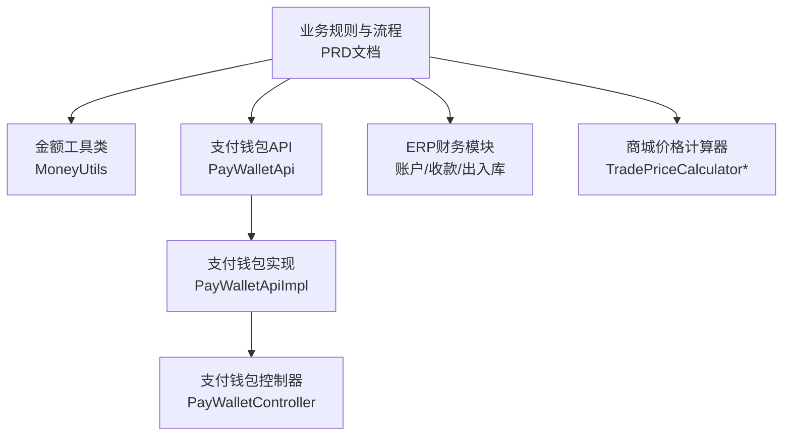
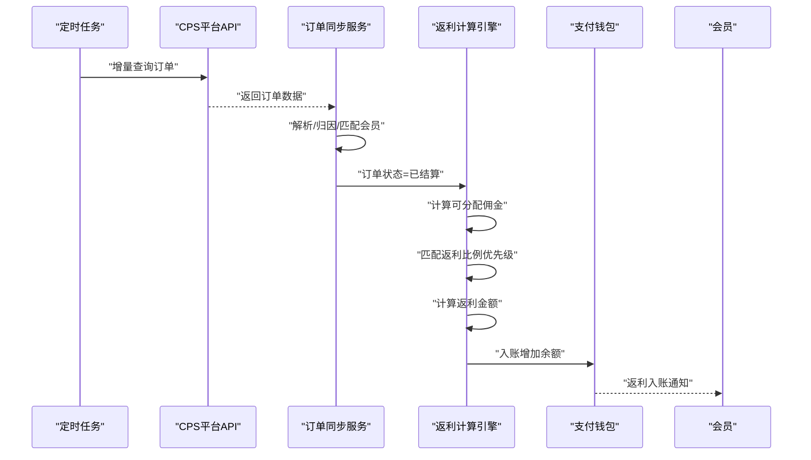
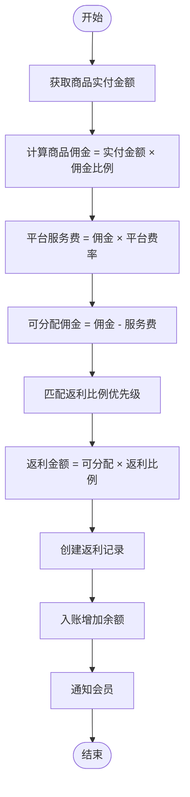
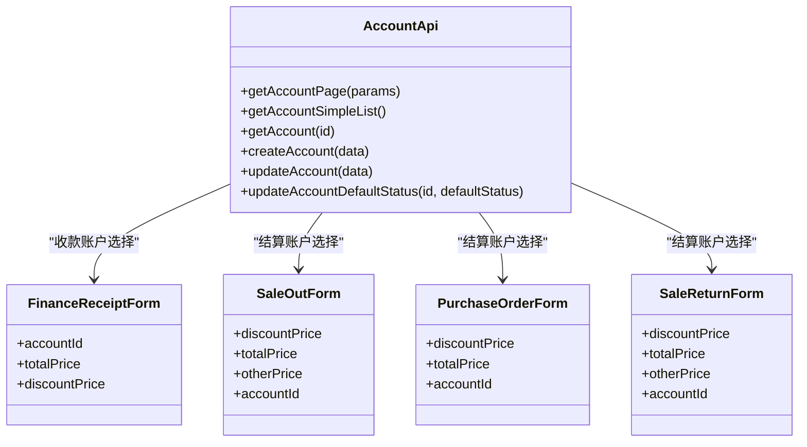
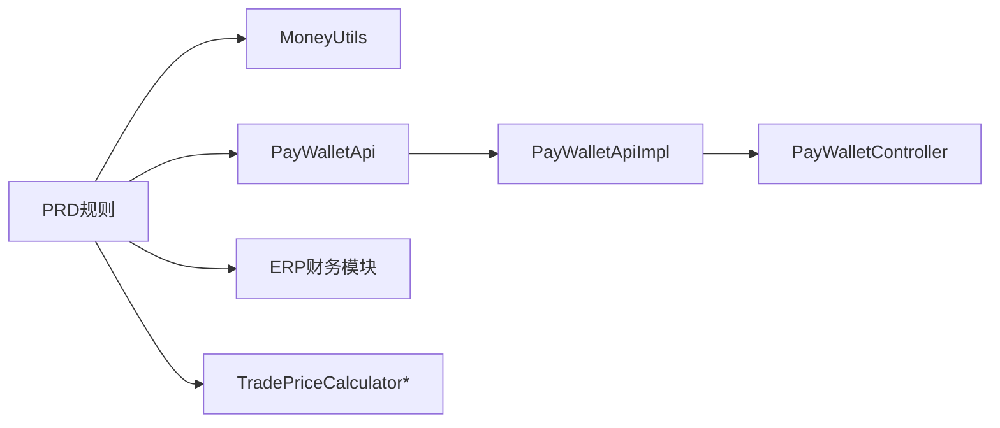

# 返利计算与入账

<cite>
**本文引用的文件**
- [CPS系统PRD文档.md](file://docs/CPS系统PRD文档.md)
- [MoneyUtils.java](file://backend/yudao-framework/yudao-common/src/main/java/cn/iocoder/yudao/framework/common/util/number/MoneyUtils.java)
- [PayWalletApi.java](file://backend/yudao-module-pay/src/main/java/cn/iocoder/yudao/module/pay/api/wallet/PayWalletApi.java)
- [PayWalletApiImpl.java](file://backend/yudao-module-pay/src/main/java/cn/iocoder/yudao/module/pay/api/wallet/PayWalletApiImpl.java)
- [PayWalletController.java](file://backend/yudao-module-pay/src/main/java/cn/iocoder/yudao/module/pay/controller/admin/wallet/PayWalletController.java)
- [AccountApi.ts](file://frontend/admin-vue3/src/api/erp/finance/account/index.ts)
- [ErpAccount.vue](file://frontend/admin-vue3/src/views/erp/finance/account/index.vue)
- [FinanceReceiptForm.vue](file://frontend/admin-vue3/src/views/erp/finance/receipt/FinanceReceiptForm.vue)
- [SaleOutForm.vue](file://frontend/admin-vue3/src/views/erp/sale/out/SaleOutForm.vue)
- [PurchaseOrderForm.vue](file://frontend/admin-vue3/src/views/erp/purchase/order/PurchaseOrderForm.vue)
- [SaleReturnForm.vue](file://frontend/admin-vue3/src/views/erp/sale/return/SaleReturnForm.vue)
- [TradePriceCalculator.java](file://backend/yudao-module-mall/yudao-module-trade/src/main/java/cn/iocoder/yudao/module/trade/service/price/calculator/TradePriceCalculator.java)
- [TradePriceCalculatorHelper.java](file://backend/yudao-module-mall/yudao-module-trade/src/main/java/cn/iocoder/yudao/module/trade/service/price/calculator/TradePriceCalculatorHelper.java)
- [TradeCouponPriceCalculator.java](file://backend/yudao-module-mall/yudao-module-trade/src/main/java/cn/iocoder/yudao/module/trade/service/price/calculator/TradeCouponPriceCalculator.java)
- [TradeDeliveryPriceCalculator.java](file://backend/yudao-module-mall/yudao-module-trade/src/main/java/cn/iocoder/yudao/module/trade/service/price/calculator/TradeDeliveryPriceCalculator.java)
- [TradeDiscountActivityPriceCalculator.java](file://backend/yudao-module-mall/yudao-module-trade/src/main/java/cn/iocoder/yudao/module/trade/service/price/calculator/TradeDiscountActivityPriceCalculator.java)
- [TradePointActivityPriceCalculator.java](file://backend/yudao-module-mall/yudao-module-trade/src/main/java/cn/iocoder/yudao/module/trade/service/price/calculator/TradePointActivityPriceCalculator.java)
- [TradePointGiveCalculator.java](file://backend/yudao-module-mall/yudao-module-trade/src/main/java/cn/iocoder/yudao/module/trade/service/price/calculator/TradePointGiveCalculator.java)
- [TradePointUsePriceCalculator.java](file://backend/yudao-module-mall/yudao-module-trade/src/main/java/cn/iocoder/yudao/module/trade/service/price/calculator/TradePointUsePriceCalculator.java)
</cite>

## 目录
1. [简介](#简介)
2. [项目结构](#项目结构)
3. [核心组件](#核心组件)
4. [架构总览](#架构总览)
5. [详细组件分析](#详细组件分析)
6. [依赖关系分析](#依赖关系分析)
7. [性能考虑](#性能考虑)
8. [故障排查指南](#故障排查指南)
9. [结论](#结论)
10. [附录](#附录)

## 简介
本文件围绕返利计算与入账功能，系统性阐述返利算法、佣金比例配置、入账规则、计算精度与舍入策略、阶梯返利与特殊商品处理、会员等级影响、推广者分成、团队返利、结算周期等核心业务逻辑；并覆盖财务对账机制、银行流水对接、税务处理、报表生成等财务管理能力，以及业务规则配置、计算流程图与审计日志设计。

## 项目结构
- 业务规则与流程：由PRD文档定义，涵盖订单同步、返利结算、入账、提现等关键环节。
- 计算精度与工具：通用金额工具类提供统一的金额与百分比计算、舍入策略。
- 支付钱包：负责返利入账、余额变动、交易流水等。
- 财务ERP：提供结算账户、收款单据、出入库单据等财务对接能力。
- 商城价格计算：提供价格计算器族，作为返利计算的参考实现与扩展点。

**图表来源**
- [CPS系统PRD文档.md:183-223](file://docs/CPS系统PRD文档.md#L183-L223)
- [MoneyUtils.java:1-131](file://backend/yudao-framework/yudao-common/src/main/java/cn/iocoder/yudao/framework/common/util/number/MoneyUtils.java#L1-L131)
- [PayWalletApi.java](file://backend/yudao-module-pay/src/main/java/cn/iocoder/yudao/module/pay/api/wallet/PayWalletApi.java)
- [PayWalletApiImpl.java](file://backend/yudao-module-pay/src/main/java/cn/iocoder/yudao/module/pay/api/wallet/PayWalletApiImpl.java)
- [PayWalletController.java](file://backend/yudao-module-pay/src/main/java/cn/iocoder/yudao/module/pay/controller/admin/wallet/PayWalletController.java)
- [AccountApi.ts:1-48](file://frontend/admin-vue3/src/api/erp/finance/account/index.ts#L1-L48)
- [ErpAccount.vue:121-170](file://frontend/admin-vue3/src/views/erp/finance/account/index.vue#L121-L170)
- [FinanceReceiptForm.vue:79-118](file://frontend/admin-vue3/src/views/erp/finance/receipt/FinanceReceiptForm.vue#L79-L118)
- [SaleOutForm.vue:113-153](file://frontend/admin-vue3/src/views/erp/sale/out/SaleOutForm.vue#L113-L153)
- [PurchaseOrderForm.vue:75-115](file://frontend/admin-vue3/src/views/erp/purchase/order/PurchaseOrderForm.vue#L75-L115)
- [SaleReturnForm.vue:113-153](file://frontend/admin-vue3/src/views/erp/sale/return/SaleReturnForm.vue#L113-L153)
- [TradePriceCalculator.java](file://backend/yudao-module-mall/yudao-module-trade/src/main/java/cn/iocoder/yudao/module/trade/service/price/calculator/TradePriceCalculator.java)
- [TradePriceCalculatorHelper.java](file://backend/yudao-module-mall/yudao-module-trade/src/main/java/cn/iocoder/yudao/module/trade/service/price/calculator/TradePriceCalculatorHelper.java)

**章节来源**
- [CPS系统PRD文档.md:183-223](file://docs/CPS系统PRD文档.md#L183-L223)
- [MoneyUtils.java:1-131](file://backend/yudao-framework/yudao-common/src/main/java/cn/iocoder/yudao/framework/common/util/number/MoneyUtils.java#L1-L131)

## 核心组件
- 返利计算引擎：依据PRD定义的佣金计算规则与返利比例优先级，结合平台服务费率、会员等级与个人专属配置，计算可分配佣金与返利金额。
- 金额工具类：提供统一的百分比计算、舍入策略（四舍五入、向下取整）与分/元转换，确保计算精度与一致性。
- 支付钱包：负责返利入账、余额变动、交易流水记录与查询，支撑提现与对账。
- ERP财务模块：提供结算账户、收款/付款单据、出入库单据等，支撑财务对账与银行流水对接。
- 商城价格计算器：提供价格计算器族，作为返利计算的参考实现与扩展点，便于在促销、优惠券等场景下复用。

**章节来源**
- [CPS系统PRD文档.md:760-780](file://docs/CPS系统PRD文档.md#L760-L780)
- [MoneyUtils.java:1-131](file://backend/yudao-framework/yudao-common/src/main/java/cn/iocoder/yudao/framework/common/util/number/MoneyUtils.java#L1-L131)
- [PayWalletApi.java](file://backend/yudao-module-pay/src/main/java/cn/iocoder/yudao/module/pay/api/wallet/PayWalletApi.java)
- [PayWalletApiImpl.java](file://backend/yudao-module-pay/src/main/java/cn/iocoder/yudao/module/pay/api/wallet/PayWalletApiImpl.java)
- [PayWalletController.java](file://backend/yudao-module-pay/src/main/java/cn/iocoder/yudao/module/pay/controller/admin/wallet/PayWalletController.java)
- [AccountApi.ts:1-48](file://frontend/admin-vue3/src/api/erp/finance/account/index.ts#L1-L48)
- [ErpAccount.vue:121-170](file://frontend/admin-vue3/src/views/erp/finance/account/index.vue#L121-L170)
- [FinanceReceiptForm.vue:79-118](file://frontend/admin-vue3/src/views/erp/finance/receipt/FinanceReceiptForm.vue#L79-L118)
- [SaleOutForm.vue:113-153](file://frontend/admin-vue3/src/views/erp/sale/out/SaleOutForm.vue#L113-L153)
- [PurchaseOrderForm.vue:75-115](file://frontend/admin-vue3/src/views/erp/purchase/order/PurchaseOrderForm.vue#L75-L115)
- [SaleReturnForm.vue:113-153](file://frontend/admin-vue3/src/views/erp/sale/return/SaleReturnForm.vue#L113-L153)
- [TradePriceCalculator.java](file://backend/yudao-module-mall/yudao-module-trade/src/main/java/cn/iocoder/yudao/module/trade/service/price/calculator/TradePriceCalculator.java)
- [TradePriceCalculatorHelper.java](file://backend/yudao-module-mall/yudao-module-trade/src/main/java/cn/iocoder/yudao/module/trade/service/price/calculator/TradePriceCalculatorHelper.java)

## 架构总览
返利计算与入账的整体流程从订单同步开始，经过归因匹配、平台结算、可分配佣金计算、返利比例匹配与返利金额计算，最终完成入账与通知。财务侧通过ERP模块完成对账与银行流水对接。

**图表来源**
- [CPS系统PRD文档.md:183-223](file://docs/CPS系统PRD文档.md#L183-L223)
- [PayWalletApi.java](file://backend/yudao-module-pay/src/main/java/cn/iocoder/yudao/module/pay/api/wallet/PayWalletApi.java)
- [PayWalletApiImpl.java](file://backend/yudao-module-pay/src/main/java/cn/iocoder/yudao/module/pay/api/wallet/PayWalletApiImpl.java)

## 详细组件分析

### 返利计算算法与优先级
- 佣金计算规则：商品实付金额 × 佣金比例，再扣除平台服务费，得到可分配佣金；可分配佣金 × 返利比例 = 会员返利，剩余为平台利润。
- 返利比例优先级（命中即停）：
  1) 会员个人专属配置（精确到平台）
  2) 会员个人专属配置（全平台）
  3) 会员等级 + 指定平台的组合配置
  4) 会员等级的全平台配置
  5) 指定平台的默认配置
  6) 系统全局默认配置
- 结算周期：下单到追踪（5~30分钟），追踪到结算（平台决定，如淘宝日结、京东月结、拼多多约15工作日），结算到入账（0~24小时，系统配置的入账延迟），入账到可提现（立即）。

**图表来源**
- [CPS系统PRD文档.md:760-780](file://docs/CPS系统PRD文档.md#L760-L780)
- [CPS系统PRD文档.md:183-223](file://docs/CPS系统PRD文档.md#L183-L223)

**章节来源**
- [CPS系统PRD文档.md:760-780](file://docs/CPS系统PRD文档.md#L760-L780)
- [CPS系统PRD文档.md:611-618](file://docs/CPS系统PRD文档.md#L611-L618)
- [CPS系统PRD文档.md:792-800](file://docs/CPS系统PRD文档.md#L792-L800)

### 佣金比例配置与返利展示规则
- 等级返利配置：按会员等级与平台维度配置返利比例，支持全平台与平台差异化。
- 会员专属配置：针对特定会员设置个人专属返利比例与单笔上限、生效时间。
- 返利展示规则：登录状态下展示预估返利，未登录展示“登录查看返利”，金额小于0.01展示“暂无返利”，比价页展示各平台预估返利。

**章节来源**
- [CPS系统PRD文档.md:586-618](file://docs/CPS系统PRD文档.md#L586-L618)
- [CPS系统PRD文档.md:782-790](file://docs/CPS系统PRD文档.md#L782-L790)

### 计算精度处理与舍入策略
- 金额工具类提供统一的百分比计算与舍入策略，包括：
  - 四舍五入（HALF_UP）
  - 向下取整（FLOOR）
  - 分/元转换
  - 金额相乘与百分比相乘的默认精度与舍入
- 在返利计算中，建议采用“先乘后除、统一舍入”的策略，确保多步计算的一致性与可预测性。

**章节来源**
- [MoneyUtils.java:1-131](file://backend/yudao-framework/yudao-common/src/main/java/cn/iocoder/yudao/framework/common/util/number/MoneyUtils.java#L1-L131)

### 阶梯返利与特殊商品处理
- 阶梯返利：可在返利比例配置中设置不同区间或条件下的返利比例，配合优先级匹配实现更精细的返利策略。
- 特殊商品处理：对于不参与返利的商品或平台，可在平台配置或商品维度进行排除；对于部分退款场景，需按比例扣回已入账返利。

**章节来源**
- [CPS系统PRD文档.md:183-223](file://docs/CPS系统PRD文档.md#L183-L223)

### 会员等级影响与推广者分成
- 会员等级直接影响返利比例，升级/降级不影响已下单的未结算订单，按下单时的等级比例计算。
- 推广者分成：返利比例可配置为推广者与平台的分成比例，具体分配策略在返利比例与平台服务费率基础上计算。

**章节来源**
- [CPS系统PRD文档.md:803-822](file://docs/CPS系统PRD文档.md#L803-L822)

### 团队返利与结算周期
- 团队返利：可在返利比例配置中设置团队层级的返利比例，形成多级分销的返利链条。
- 结算周期：系统配置入账延迟，入账后立即可提现，确保资金流转效率。

**章节来源**
- [CPS系统PRD文档.md:792-800](file://docs/CPS系统PRD文档.md#L792-L800)

### 财务对账机制与银行流水对接
- ERP结算账户：提供账户管理、默认状态维护与分页查询，支撑财务对账。
- 收款/付款单据：支持采购入库、销售出库、采购订单、销售退货等单据的账户与金额管理。
- 银行流水对接：通过ERP单据与结算账户，实现与银行流水的对账与核销。

**图表来源**
- [AccountApi.ts:1-48](file://frontend/admin-vue3/src/api/erp/finance/account/index.ts#L1-L48)
- [ErpAccount.vue:121-170](file://frontend/admin-vue3/src/views/erp/finance/account/index.vue#L121-L170)
- [FinanceReceiptForm.vue:79-118](file://frontend/admin-vue3/src/views/erp/finance/receipt/FinanceReceiptForm.vue#L79-L118)
- [SaleOutForm.vue:113-153](file://frontend/admin-vue3/src/views/erp/sale/out/SaleOutForm.vue#L113-L153)
- [PurchaseOrderForm.vue:75-115](file://frontend/admin-vue3/src/views/erp/purchase/order/PurchaseOrderForm.vue#L75-L115)
- [SaleReturnForm.vue:113-153](file://frontend/admin-vue3/src/views/erp/sale/return/SaleReturnForm.vue#L113-L153)

**章节来源**
- [AccountApi.ts:1-48](file://frontend/admin-vue3/src/api/erp/finance/account/index.ts#L1-L48)
- [ErpAccount.vue:121-170](file://frontend/admin-vue3/src/views/erp/finance/account/index.vue#L121-L170)
- [FinanceReceiptForm.vue:79-118](file://frontend/admin-vue3/src/views/erp/finance/receipt/FinanceReceiptForm.vue#L79-L118)
- [SaleOutForm.vue:113-153](file://frontend/admin-vue3/src/views/erp/sale/out/SaleOutForm.vue#L113-L153)
- [PurchaseOrderForm.vue:75-115](file://frontend/admin-vue3/src/views/erp/purchase/order/PurchaseOrderForm.vue#L75-L115)
- [SaleReturnForm.vue:113-153](file://frontend/admin-vue3/src/views/erp/sale/return/SaleReturnForm.vue#L113-L153)

### 税务处理与报表生成
- 税务处理：返利入账与提现流程需遵循税务合规要求，建议在财务模块中增加税务分类与代扣代缴记录。
- 报表生成：基于运营看板与收益报表，生成订单量、佣金、返利、利润等趋势与占比图表，支持导出。

**章节来源**
- [CPS系统PRD文档.md:620-642](file://docs/CPS系统PRD文档.md#L620-L642)

### 审计日志设计
- 日志字段：请求时间、API Key、Tool/Resource、输入参数（脱敏）、响应状态、响应耗时、用户ID、IP地址。
- 筛选功能：按时间范围、API Key、Tool/Resource、用户ID、响应状态筛选。
- 用于追踪AI Agent调用、MCP访问与业务操作的审计与合规。

**章节来源**
- [CPS系统PRD文档.md:735-757](file://docs/CPS系统PRD文档.md#L735-L757)

## 依赖关系分析
- 返利计算依赖PRD规则与金额工具类，确保计算一致性与精度。
- 支付钱包作为入账与余额管理的核心，依赖金额工具类进行精确计算。
- ERP财务模块提供账户与单据支撑，与支付钱包形成财务闭环。
- 商城价格计算器可作为参考实现，便于在促销、优惠券等场景下复用。

**图表来源**
- [CPS系统PRD文档.md:183-223](file://docs/CPS系统PRD文档.md#L183-L223)
- [MoneyUtils.java:1-131](file://backend/yudao-framework/yudao-common/src/main/java/cn/iocoder/yudao/framework/common/util/number/MoneyUtils.java#L1-L131)
- [PayWalletApi.java](file://backend/yudao-module-pay/src/main/java/cn/iocoder/yudao/module/pay/api/wallet/PayWalletApi.java)
- [PayWalletApiImpl.java](file://backend/yudao-module-pay/src/main/java/cn/iocoder/yudao/module/pay/api/wallet/PayWalletApiImpl.java)
- [PayWalletController.java](file://backend/yudao-module-pay/src/main/java/cn/iocoder/yudao/module/pay/controller/admin/wallet/PayWalletController.java)
- [TradePriceCalculator.java](file://backend/yudao-module-mall/yudao-module-trade/src/main/java/cn/iocoder/yudao/module/trade/service/price/calculator/TradePriceCalculator.java)
- [TradePriceCalculatorHelper.java](file://backend/yudao-module-mall/yudao-module-trade/src/main/java/cn/iocoder/yudao/module/trade/service/price/calculator/TradePriceCalculatorHelper.java)

**章节来源**
- [CPS系统PRD文档.md:183-223](file://docs/CPS系统PRD文档.md#L183-L223)
- [MoneyUtils.java:1-131](file://backend/yudao-framework/yudao-common/src/main/java/cn/iocoder/yudao/framework/common/util/number/MoneyUtils.java#L1-L131)
- [PayWalletApi.java](file://backend/yudao-module-pay/src/main/java/cn/iocoder/yudao/module/pay/api/wallet/PayWalletApi.java)
- [PayWalletApiImpl.java](file://backend/yudao-module-pay/src/main/java/cn/iocoder/yudao/module/pay/api/wallet/PayWalletApiImpl.java)
- [PayWalletController.java](file://backend/yudao-module-pay/src/main/java/cn/iocoder/yudao/module/pay/controller/admin/wallet/PayWalletController.java)
- [TradePriceCalculator.java](file://backend/yudao-module-mall/yudao-module-trade/src/main/java/cn/iocoder/yudao/module/trade/service/price/calculator/TradePriceCalculator.java)
- [TradePriceCalculatorHelper.java](file://backend/yudao-module-mall/yudao-module-trade/src/main/java/cn/iocoder/yudao/module/trade/service/price/calculator/TradePriceCalculatorHelper.java)

## 性能考虑
- 订单同步：采用定时任务（每5分钟）增量查询，避免全量扫描带来的压力。
- 计算精度：统一使用金额工具类进行百分比与舍入计算，减少浮点误差累积。
- 批量入账：在订单状态变更时批量处理返利入账，降低数据库写入压力。
- 缓存策略：对平台费率、返利比例等配置进行缓存，减少重复查询。

## 故障排查指南
- 订单未入账：检查订单状态是否变为“已结算”，确认可分配佣金与返利比例匹配是否正确。
- 金额不一致：核对金额工具类的舍入策略与分/元转换，确保计算步骤一致。
- 财务对账不平：核对ERP单据与支付钱包交易流水，确认入账时间与金额。
- 提现异常：检查提现规则与账户状态，确认转账API调用结果与异常处理。

**章节来源**
- [CPS系统PRD文档.md:225-261](file://docs/CPS系统PRD文档.md#L225-L261)
- [MoneyUtils.java:1-131](file://backend/yudao-framework/yudao-common/src/main/java/cn/iocoder/yudao/framework/common/util/number/MoneyUtils.java#L1-L131)

## 结论
返利计算与入账功能通过严谨的业务规则、统一的计算精度与完善的财务对账机制，实现了从订单同步到返利入账、提现的完整闭环。依托PRD文档定义的优先级匹配与结算周期，结合支付钱包与ERP财务模块，能够满足多平台、多等级、多层级的返利管理需求，并为税务与报表提供坚实支撑。

## 附录
- 业务规则配置清单：平台配置、推广位管理、返利规则配置、会员专属返利、提现规则、风控规则、全局配置。
- 计算流程图：见“返利计算算法与优先级”章节。
- 审计日志字段：见“审计日志设计”章节。