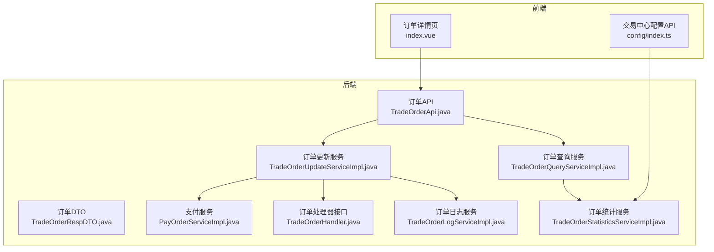
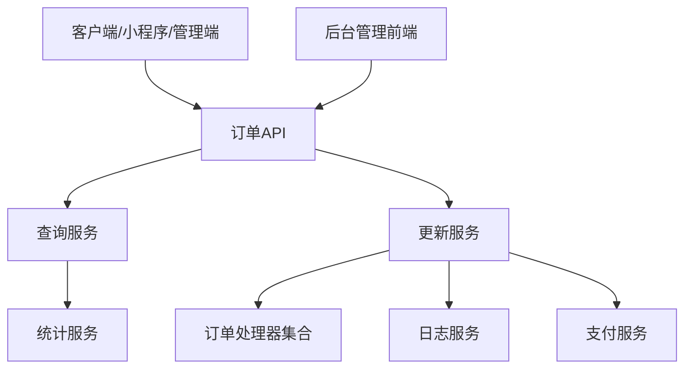
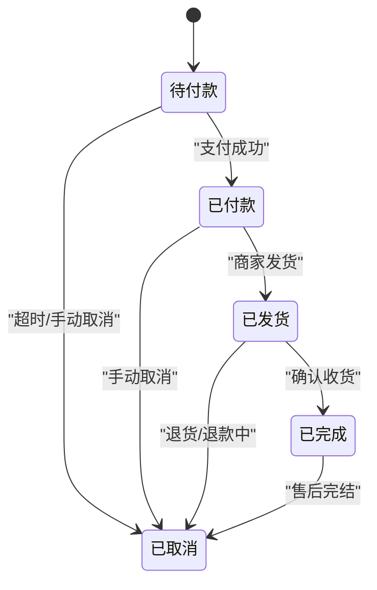
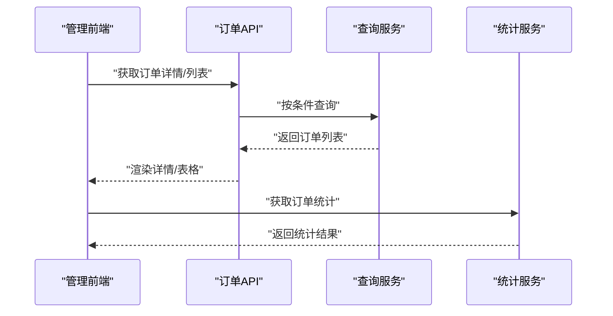
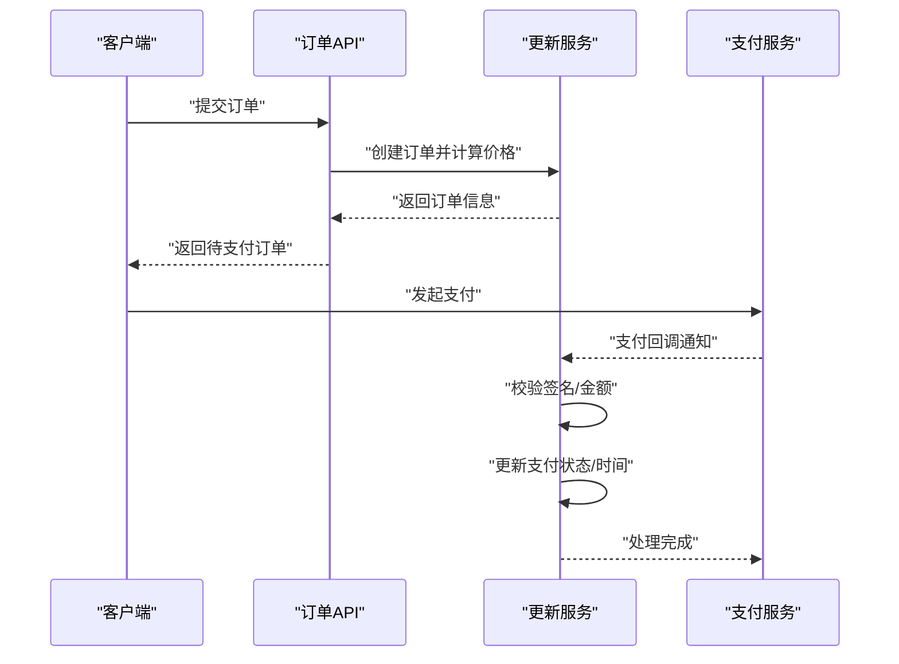
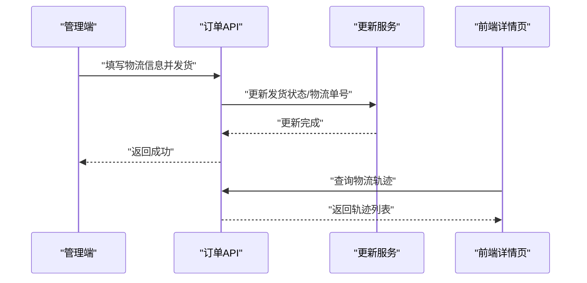
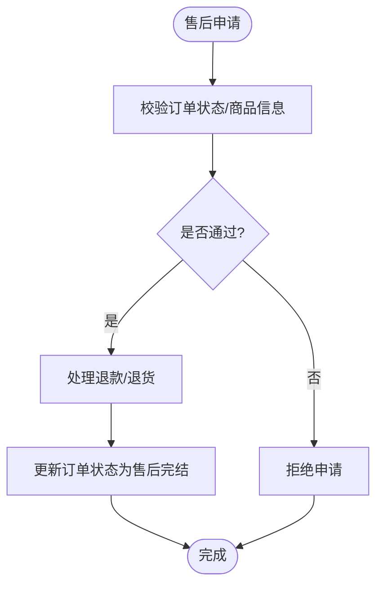
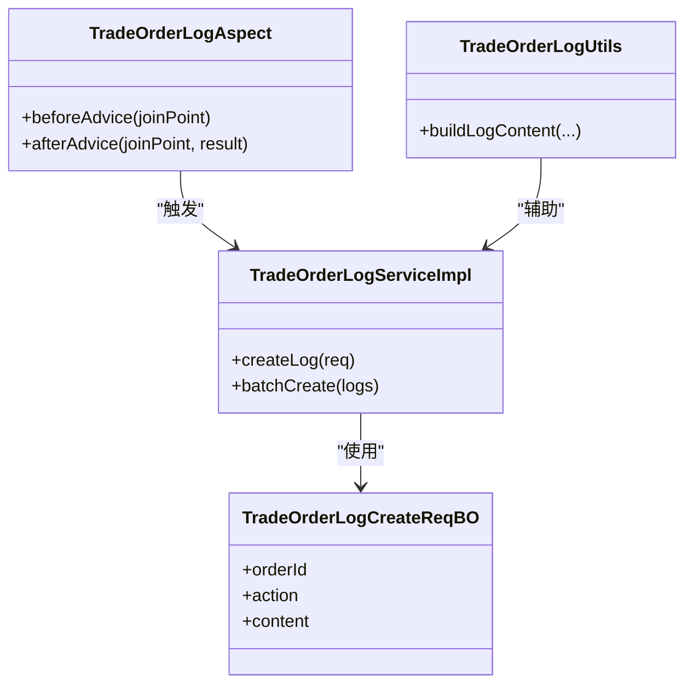
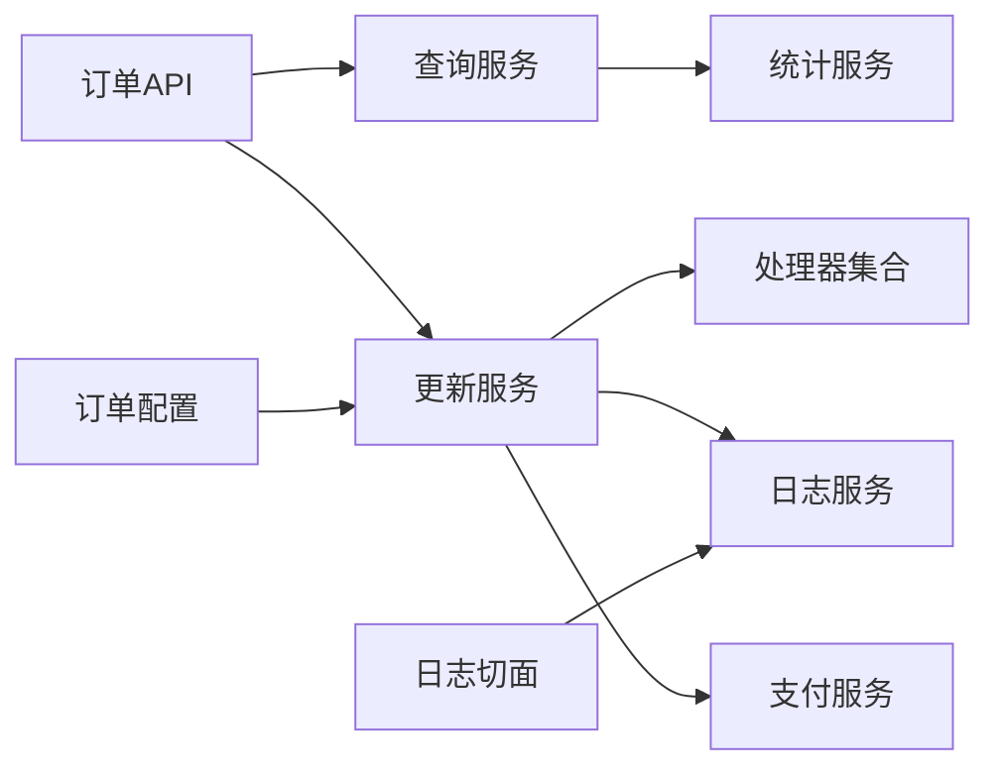

# 交易订单系统

<cite>
**本文引用的文件**
- [TradeOrderApi.java](file://backend/yudao-module-mall/yudao-module-trade-api/src/main/java/cn/iocoder/yudao/module/trade/api/order/TradeOrderApi.java)
- [TradeOrderRespDTO.java](file://backend/yudao-module-mall/yudao-module-trade-api/src/main/java/cn/iocoder/yudao/module/trade/api/order/dto/TradeOrderRespDTO.java)
- [TradeOrderQueryServiceImpl.java](file://backend/yudao-module-mall/yudao-module-trade/src/main/java/cn/iocoder/yudao/module/trade/service/order/TradeOrderQueryServiceImpl.java)
- [TradeOrderUpdateServiceImpl.java](file://backend/yudao-module-mall/yudao-module-trade/src/main/java/cn/iocoder/yudao/module/trade/service/order/TradeOrderUpdateServiceImpl.java)
- [TradeOrderLogServiceImpl.java](file://backend/yudao-module-mall/yudao-module-trade/src/main/java/cn/iocoder/yudao/module/trade/service/order/TradeOrderLogServiceImpl.java)
- [TradeOrderHandler.java](file://backend/yudao-module-mall/yudao-module-trade/src/main/java/cn/iocoder/yudao/module/trade/service/order/handler/TradeOrderHandler.java)
- [TradeOrderLogCreateReqBO.java](file://backend/yudao-module-mall/yudao-module-trade/src/main/java/cn/iocoder/yudao/module/trade/service/order/bo/TradeOrderLogCreateReqBO.java)
- [TradeOrderConfig.java](file://backend/yudao-module-mall/yudao-module-trade/src/main/java/cn/iocoder/yudao/module/trade/framework/order/config/TradeOrderConfig.java)
- [TradeOrderProperties.java](file://backend/yudao-module-mall/yudao-module-trade/src/main/java/cn/iocoder/yudao/module/trade/framework/order/config/TradeOrderProperties.java)
- [TradeOrderLogAspect.java](file://backend/yudao-module-mall/yudao-module-trade/src/main/java/cn/iocoder/yudao/module/trade/framework/order/core/aop/TradeOrderLogAspect.java)
- [TradeOrderLogUtils.java](file://backend/yudao-module-mall/yudao-module-trade/src/main/java/cn/iocoder/yudao/module/trade/framework/order/core/utils/TradeOrderLogUtils.java)
- [TradeOrderStatisticsServiceImpl.java](file://backend/yudao-module-mall/yudao-module-statistics/src/main/java/cn/iocoder/yudao/module/statistics/service/trade/TradeOrderStatisticsServiceImpl.java)
- [TradeStatisticsController.java](file://backend/yudao-module-mall/yudao-module-statistics/src/main/java/cn/iocoder/yudao/module/statistics/controller/admin/trade/TradeStatisticsController.java)
- [PayOrderServiceImpl.java](file://backend/yudao-module-pay/src/main/java/cn/iocoder/yudao/module/pay/service/order/PayOrderServiceImpl.java)
- [create_tables.sql](file://backend/yudao-module-mall/yudao-module-trade/src/test/resources/sql/create_tables.sql)
- [index.vue](file://frontend/admin-vue3/src/views/mall/trade/order/detail/index.vue)
- [config/index.ts](file://frontend/admin-vue3/src/api/mall/trade/config/index.ts)
</cite>

## 目录
1. [简介](#简介)
2. [项目结构](#项目结构)
3. [核心组件](#核心组件)
4. [架构总览](#架构总览)
5. [详细组件分析](#详细组件分析)
6. [依赖关系分析](#依赖关系分析)
7. [性能考虑](#性能考虑)
8. [故障排查指南](#故障排查指南)
9. [结论](#结论)
10. [附录](#附录)

## 简介
本文件面向交易订单系统，围绕订单创建、支付处理、发货管理、售后处理等完整交易流程进行深入说明。内容覆盖订单状态管理、生命周期、拆分合并、查询统计等核心功能，并阐述订单与商品、会员、支付、物流等模块的关联关系。同时提供订单 API 接口规范与关键业务流程图，帮助开发者与产品人员快速理解并扩展系统能力。

## 项目结构
系统采用多模块分层架构，订单相关能力主要分布在以下模块：
- 后端模块
  - yudao-module-trade-api：订单对外 API 定义与 DTO
  - yudao-module-trade：订单核心服务（查询、更新、日志、处理器）
  - yudao-module-pay：支付服务（与订单支付状态联动）
  - yudao-module-statistics：订单统计服务与控制器
- 前端模块
  - admin-vue3：后台管理前端，包含订单详情页与配置接口

**图表来源**
- [TradeOrderApi.java:1-41](file://backend/yudao-module-mall/yudao-module-trade-api/src/main/java/cn/iocoder/yudao/module/trade/api/order/TradeOrderApi.java#L1-L41)
- [TradeOrderRespDTO.java:1-98](file://backend/yudao-module-mall/yudao-module-trade-api/src/main/java/cn/iocoder/yudao/module/trade/api/order/dto/TradeOrderRespDTO.java#L1-L98)
- [TradeOrderQueryServiceImpl.java:43-200](file://backend/yudao-module-mall/yudao-module-trade/src/main/java/cn/iocoder/yudao/module/trade/service/order/TradeOrderQueryServiceImpl.java#L43-L200)
- [TradeOrderUpdateServiceImpl.java:93-250](file://backend/yudao-module-mall/yudao-module-trade/src/main/java/cn/iocoder/yudao/module/trade/service/order/TradeOrderUpdateServiceImpl.java#L93-L250)
- [TradeOrderLogServiceImpl.java:1-100](file://backend/yudao-module-mall/yudao-module-trade/src/main/java/cn/iocoder/yudao/module/trade/service/order/TradeOrderLogServiceImpl.java#L1-L100)
- [TradeOrderHandler.java:1-200](file://backend/yudao-module-mall/yudao-module-trade/src/main/java/cn/iocoder/yudao/module/trade/service/order/handler/TradeOrderHandler.java#L1-L200)
- [TradeOrderStatisticsServiceImpl.java:29-120](file://backend/yudao-module-mall/yudao-module-statistics/src/main/java/cn/iocoder/yudao/module/statistics/service/trade/TradeOrderStatisticsServiceImpl.java#L29-L120)
- [PayOrderServiceImpl.java:57-120](file://backend/yudao-module-pay/src/main/java/cn/iocoder/yudao/module/pay/service/order/PayOrderServiceImpl.java#L57-L120)
- [index.vue:301-341](file://frontend/admin-vue3/src/views/mall/trade/order/detail/index.vue#L301-L341)
- [config/index.ts:1-23](file://frontend/admin-vue3/src/api/mall/trade/config/index.ts#L1-L23)

**章节来源**
- [TradeOrderApi.java:1-41](file://backend/yudao-module-mall/yudao-module-trade-api/src/main/java/cn/iocoder/yudao/module/trade/api/order/TradeOrderApi.java#L1-L41)
- [TradeOrderRespDTO.java:1-98](file://backend/yudao-module-mall/yudao-module-trade-api/src/main/java/cn/iocoder/yudao/module/trade/api/order/dto/TradeOrderRespDTO.java#L1-L98)

## 核心组件
- 订单 API 层
  - 提供订单列表、单个订单查询、取消支付订单等接口，作为跨模块调用入口。
- 订单服务层
  - 查询服务：按条件检索订单，支持分页与聚合统计。
  - 更新服务：负责订单状态流转、金额计算、库存占用释放等。
  - 日志服务：记录订单关键动作与状态变更轨迹。
  - 处理器：封装促销、优惠券、积分、拼团、秒杀等订单项处理逻辑。
- 支付服务层
  - 与订单支付状态联动，处理支付回调、退款、冻结佣金等。
- 统计服务层
  - 提供订单数量、金额等维度的统计能力，支撑运营看板。

**章节来源**
- [TradeOrderQueryServiceImpl.java:43-200](file://backend/yudao-module-mall/yudao-module-trade/src/main/java/cn/iocoder/yudao/module/trade/service/order/TradeOrderQueryServiceImpl.java#L43-L200)
- [TradeOrderUpdateServiceImpl.java:93-250](file://backend/yudao-module-mall/yudao-module-trade/src/main/java/cn/iocoder/yudao/module/trade/service/order/TradeOrderUpdateServiceImpl.java#L93-L250)
- [TradeOrderLogServiceImpl.java:1-100](file://backend/yudao-module-mall/yudao-module-trade/src/main/java/cn/iocoder/yudao/module/trade/service/order/TradeOrderLogServiceImpl.java#L1-L100)
- [TradeOrderHandler.java:1-200](file://backend/yudao-module-mall/yudao-module-trade/src/main/java/cn/iocoder/yudao/module/trade/service/order/handler/TradeOrderHandler.java#L1-L200)
- [PayOrderServiceImpl.java:57-120](file://backend/yudao-module-pay/src/main/java/cn/iocoder/yudao/module/pay/service/order/PayOrderServiceImpl.java#L57-L120)
- [TradeOrderStatisticsServiceImpl.java:29-120](file://backend/yudao-module-mall/yudao-module-statistics/src/main/java/cn/iocoder/yudao/module/statistics/service/trade/TradeOrderStatisticsServiceImpl.java#L29-L120)

## 架构总览
系统通过 API 层向外部暴露能力，内部以服务层为核心，围绕订单生命周期进行状态机驱动的状态变更；支付与物流作为外部集成点参与关键节点；统计服务提供运营分析能力。

**图表来源**
- [TradeOrderApi.java:1-41](file://backend/yudao-module-mall/yudao-module-trade-api/src/main/java/cn/iocoder/yudao/module/trade/api/order/TradeOrderApi.java#L1-L41)
- [TradeOrderQueryServiceImpl.java:43-200](file://backend/yudao-module-mall/yudao-module-trade/src/main/java/cn/iocoder/yudao/module/trade/service/order/TradeOrderQueryServiceImpl.java#L43-L200)
- [TradeOrderUpdateServiceImpl.java:93-250](file://backend/yudao-module-mall/yudao-module-trade/src/main/java/cn/iocoder/yudao/module/trade/service/order/TradeOrderUpdateServiceImpl.java#L93-L250)
- [TradeOrderLogServiceImpl.java:1-100](file://backend/yudao-module-mall/yudao-module-trade/src/main/java/cn/iocoder/yudao/module/trade/service/order/TradeOrderLogServiceImpl.java#L1-L100)
- [TradeOrderHandler.java:1-200](file://backend/yudao-module-mall/yudao-module-trade/src/main/java/cn/iocoder/yudao/module/trade/service/order/handler/TradeOrderHandler.java#L1-L200)
- [PayOrderServiceImpl.java:57-120](file://backend/yudao-module-pay/src/main/java/cn/iocoder/yudao/module/pay/service/order/PayOrderServiceImpl.java#L57-L120)
- [TradeOrderStatisticsServiceImpl.java:29-120](file://backend/yudao-module-mall/yudao-module-statistics/src/main/java/cn/iocoder/yudao/module/statistics/service/trade/TradeOrderStatisticsServiceImpl.java#L29-L120)

## 详细组件分析

### 订单数据模型与状态机
- 数据模型要点
  - 订单主表包含订单编号、流水号、类型、来源、用户信息、状态、数量、价格、支付信息、发货信息、完成/取消时间、备注等字段。
  - 字段覆盖订单生命周期的关键节点，便于状态机推进与统计。
- 状态机设计
  - 建议将状态划分为：待付款、已付款、已发货、已完成、已取消等阶段，各阶段可进一步细分（如“超时未支付”、“主动取消”等）。
  - 状态转换需严格受控，避免并发场景下的竞态条件。

**图表来源**
- [create_tables.sql:1-60](file://backend/yudao-module-mall/yudao-module-trade/src/test/resources/sql/create_tables.sql#L1-L60)

**章节来源**
- [create_tables.sql:1-60](file://backend/yudao-module-mall/yudao-module-trade/src/test/resources/sql/create_tables.sql#L1-L60)

### 订单查询与统计
- 查询服务
  - 支持按订单 ID 列表批量查询，返回精简订单信息。
  - 支持按状态、时间范围、用户等条件筛选。
- 统计服务
  - 提供订单数量、金额等指标统计，用于后台看板展示。
  - 控制器示例展示了按状态与配送方式的统计调用。

**图表来源**
- [TradeOrderApi.java:1-41](file://backend/yudao-module-mall/yudao-module-trade-api/src/main/java/cn/iocoder/yudao/module/trade/api/order/TradeOrderApi.java#L1-L41)
- [TradeOrderQueryServiceImpl.java:43-200](file://backend/yudao-module-mall/yudao-module-trade/src/main/java/cn/iocoder/yudao/module/trade/service/order/TradeOrderQueryServiceImpl.java#L43-L200)
- [TradeOrderStatisticsServiceImpl.java:29-120](file://backend/yudao-module-mall/yudao-module-statistics/src/main/java/cn/iocoder/yudao/module/statistics/service/trade/TradeOrderStatisticsServiceImpl.java#L29-L120)
- [TradeStatisticsController.java:100-106](file://backend/yudao-module-mall/yudao-module-statistics/src/main/java/cn/iocoder/yudao/module/statistics/controller/admin/trade/TradeStatisticsController.java#L100-L106)

**章节来源**
- [TradeOrderApi.java:1-41](file://backend/yudao-module-mall/yudao-module-trade-api/src/main/java/cn/iocoder/yudao/module/trade/api/order/TradeOrderApi.java#L1-L41)
- [TradeOrderQueryServiceImpl.java:43-200](file://backend/yudao-module-mall/yudao-module-trade/src/main/java/cn/iocoder/yudao/module/trade/service/order/TradeOrderQueryServiceImpl.java#L43-L200)
- [TradeOrderStatisticsServiceImpl.java:29-120](file://backend/yudao-module-mall/yudao-module-statistics/src/main/java/cn/iocoder/yudao/module/statistics/service/trade/TradeOrderStatisticsServiceImpl.java#L29-L120)
- [TradeStatisticsController.java:100-106](file://backend/yudao-module-mall/yudao-module-statistics/src/main/java/cn/iocoder/yudao/module/statistics/controller/admin/trade/TradeStatisticsController.java#L100-L106)

### 订单创建与支付处理
- 订单创建
  - 由下单流程生成订单，填充基础信息与价格明细。
- 支付处理
  - 更新服务根据支付结果推进订单状态，设置支付状态、支付时间、支付渠道等。
  - 支付服务负责回调处理与对账。

**图表来源**
- [TradeOrderUpdateServiceImpl.java:93-250](file://backend/yudao-module-mall/yudao-module-trade/src/main/java/cn/iocoder/yudao/module/trade/service/order/TradeOrderUpdateServiceImpl.java#L93-L250)
- [PayOrderServiceImpl.java:57-120](file://backend/yudao-module-pay/src/main/java/cn/iocoder/yudao/module/pay/service/order/PayOrderServiceImpl.java#L57-L120)

**章节来源**
- [TradeOrderUpdateServiceImpl.java:93-250](file://backend/yudao-module-mall/yudao-module-trade/src/main/java/cn/iocoder/yudao/module/trade/service/order/TradeOrderUpdateServiceImpl.java#L93-L250)
- [PayOrderServiceImpl.java:57-120](file://backend/yudao-module-pay/src/main/java/cn/iocoder/yudao/module/pay/service/order/PayOrderServiceImpl.java#L57-L120)

### 发货管理与物流跟踪
- 发货流程
  - 订单状态推进至“已发货”，记录物流信息（物流公司、运单号、发货时间）。
  - 前端在订单详情页根据配送方式加载物流公司与物流轨迹。
- 物流跟踪
  - 前端通过接口获取物流轨迹，展示实时状态。

**图表来源**
- [index.vue:330-341](file://frontend/admin-vue3/src/views/mall/trade/order/detail/index.vue#L330-L341)

**章节来源**
- [index.vue:330-341](file://frontend/admin-vue3/src/views/mall/trade/order/detail/index.vue#L330-L341)

### 售后处理与订单状态同步
- 售后流程
  - 支持申请售后、审核、退款/退货等环节，最终同步订单状态。
- 状态同步
  - 订单处理器可监听并同步外部状态（如小程序订单状态），保证一致性。

**图表来源**
- [TradeOrderHandler.java:1-200](file://backend/yudao-module-mall/yudao-module-trade/src/main/java/cn/iocoder/yudao/module/trade/service/order/handler/TradeOrderHandler.java#L1-L200)

**章节来源**
- [TradeOrderHandler.java:1-200](file://backend/yudao-module-mall/yudao-module-trade/src/main/java/cn/iocoder/yudao/module/trade/service/order/handler/TradeOrderHandler.java#L1-L200)

### 订单日志与审计
- 日志服务
  - 记录订单关键动作（创建、支付、发货、取消、售后等）与参数变更。
- 切面与工具
  - 通过切面与工具类统一采集日志上下文，确保一致性与可追溯性。

**图表来源**
- [TradeOrderLogServiceImpl.java:1-100](file://backend/yudao-module-mall/yudao-module-trade/src/main/java/cn/iocoder/yudao/module/trade/service/order/TradeOrderLogServiceImpl.java#L1-L100)
- [TradeOrderLogCreateReqBO.java:1-120](file://backend/yudao-module-mall/yudao-module-trade/src/main/java/cn/iocoder/yudao/module/trade/service/order/bo/TradeOrderLogCreateReqBO.java#L1-L120)
- [TradeOrderLogAspect.java:1-200](file://backend/yudao-module-mall/yudao-module-trade/src/main/java/cn/iocoder/yudao/module/trade/framework/order/core/aop/TradeOrderLogAspect.java#L1-L200)
- [TradeOrderLogUtils.java:1-200](file://backend/yudao-module-mall/yudao-module-trade/src/main/java/cn/iocoder/yudao/module/trade/framework/order/core/utils/TradeOrderLogUtils.java#L1-L200)

**章节来源**
- [TradeOrderLogServiceImpl.java:1-100](file://backend/yudao-module-mall/yudao-module-trade/src/main/java/cn/iocoder/yudao/module/trade/service/order/TradeOrderLogServiceImpl.java#L1-L100)
- [TradeOrderLogCreateReqBO.java:1-120](file://backend/yudao-module-mall/yudao-module-trade/src/main/java/cn/iocoder/yudao/module/trade/service/order/bo/TradeOrderLogCreateReqBO.java#L1-L120)
- [TradeOrderLogAspect.java:1-200](file://backend/yudao-module-mall/yudao-module-trade/src/main/java/cn/iocoder/yudao/module/trade/framework/order/core/aop/TradeOrderLogAspect.java#L1-L200)
- [TradeOrderLogUtils.java:1-200](file://backend/yudao-module-mall/yudao-module-trade/src/main/java/cn/iocoder/yudao/module/trade/framework/order/core/utils/TradeOrderLogUtils.java#L1-L200)

### 并发控制与事务管理
- 并发控制
  - 使用数据库唯一索引（如订单号）、版本号或乐观锁防止重复支付与状态竞态。
- 事务管理
  - 订单状态变更与库存、支付、日志等操作应处于同一事务，失败回滚。
- 防重与幂等
  - 支付回调与外部事件需做幂等校验，避免重复处理。

[本节为通用指导，无需具体文件引用]

### 订单拆分与合并
- 拆分
  - 多店铺或多仓库场景下，可按规则拆分为多个子订单，分别发货与结算。
- 合并
  - 同一收件人、同仓发货场景下，可合并为一个主订单，减少物流成本。
- 处理器扩展
  - 通过处理器链路在创建/更新时执行拆分/合并策略。

[本节为通用指导，无需具体文件引用]

## 依赖关系分析
- 模块耦合
  - 订单 API 依赖查询与更新服务；更新服务依赖处理器、日志与支付服务；统计服务依赖查询服务。
- 外部依赖
  - 支付服务提供支付回调与对账；物流轨迹接口用于前端展示。
- 配置与横切
  - 订单配置通过属性类注入；日志通过切面统一采集。

**图表来源**
- [TradeOrderConfig.java:1-200](file://backend/yudao-module-mall/yudao-module-trade/src/main/java/cn/iocoder/yudao/module/trade/framework/order/config/TradeOrderConfig.java#L1-L200)
- [TradeOrderProperties.java:1-200](file://backend/yudao-module-mall/yudao-module-trade/src/main/java/cn/iocoder/yudao/module/trade/framework/order/config/TradeOrderProperties.java#L1-L200)
- [TradeOrderLogAspect.java:1-200](file://backend/yudao-module-mall/yudao-module-trade/src/main/java/cn/iocoder/yudao/module/trade/framework/order/core/aop/TradeOrderLogAspect.java#L1-L200)

**章节来源**
- [TradeOrderConfig.java:1-200](file://backend/yudao-module-mall/yudao-module-trade/src/main/java/cn/iocoder/yudao/module/trade/framework/order/config/TradeOrderConfig.java#L1-L200)
- [TradeOrderProperties.java:1-200](file://backend/yudao-module-mall/yudao-module-trade/src/main/java/cn/iocoder/yudao/module/trade/framework/order/config/TradeOrderProperties.java#L1-L200)
- [TradeOrderLogAspect.java:1-200](file://backend/yudao-module-mall/yudao-module-trade/src/main/java/cn/iocoder/yudao/module/trade/framework/order/core/aop/TradeOrderLogAspect.java#L1-L200)

## 性能考虑
- 查询优化
  - 对常用查询条件建立索引（用户、状态、时间），分页查询避免全量扫描。
- 写入优化
  - 批量插入日志与订单明细，减少事务次数；使用异步消息处理非关键路径。
- 缓存策略
  - 订单详情与统计数据可缓存，结合失效策略与双写一致性。
- 并发优化
  - 使用分布式锁或数据库层面的排他锁，避免超卖与重复支付。

[本节为通用指导，无需具体文件引用]

## 故障排查指南
- 常见问题
  - 支付回调未生效：检查回调签名、金额校验与幂等逻辑。
  - 订单状态异常：核对日志与事务边界，定位未提交的中间状态。
  - 物流信息缺失：确认发货接口调用与前端轨迹查询接口可用性。
- 排查步骤
  - 通过订单日志定位关键节点时间线。
  - 结合统计服务核对订单数量与金额一致性。
  - 前端核对订单详情页请求与响应。

**章节来源**
- [TradeOrderLogServiceImpl.java:1-100](file://backend/yudao-module-mall/yudao-module-trade/src/main/java/cn/iocoder/yudao/module/trade/service/order/TradeOrderLogServiceImpl.java#L1-L100)
- [TradeOrderStatisticsServiceImpl.java:29-120](file://backend/yudao-module-mall/yudao-module-statistics/src/main/java/cn/iocoder/yudao/module/statistics/service/trade/TradeOrderStatisticsServiceImpl.java#L29-L120)
- [index.vue:330-341](file://frontend/admin-vue3/src/views/mall/trade/order/detail/index.vue#L330-L341)

## 结论
本系统围绕订单生命周期构建了完善的查询、更新、日志与统计能力，并通过处理器扩展支持多种营销与促销场景。支付与物流作为关键外部集成点，通过清晰的接口与状态机驱动实现稳定流转。建议在生产环境中强化并发控制、事务边界与日志审计，确保高并发下的数据一致性与可追溯性。

## 附录

### 订单 API 接口规范
- 获取订单列表
  - 方法：GET
  - 路径：/trade/order/list
  - 请求参数：ids（订单编号数组）
  - 返回：订单列表（TradeOrderRespDTO）
- 获取单个订单
  - 方法：GET
  - 路径：/trade/order/{id}
  - 返回：订单详情（TradeOrderRespDTO）
- 取消支付订单
  - 方法：POST
  - 路径：/trade/order/cancel-paid
  - 请求体：userId、orderId、cancelType
  - 返回：void

**章节来源**
- [TradeOrderApi.java:1-41](file://backend/yudao-module-mall/yudao-module-trade-api/src/main/java/cn/iocoder/yudao/module/trade/api/order/TradeOrderApi.java#L1-L41)
- [TradeOrderRespDTO.java:1-98](file://backend/yudao-module-mall/yudao-module-trade-api/src/main/java/cn/iocoder/yudao/module/trade/api/order/dto/TradeOrderRespDTO.java#L1-L98)