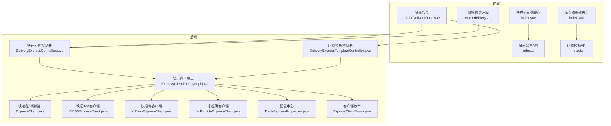
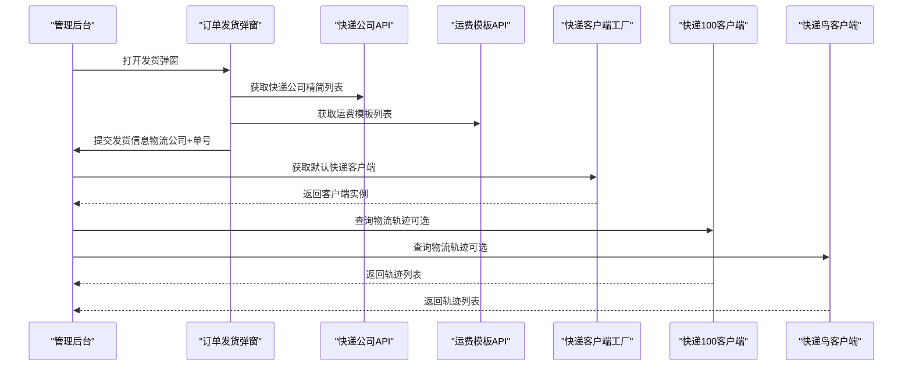
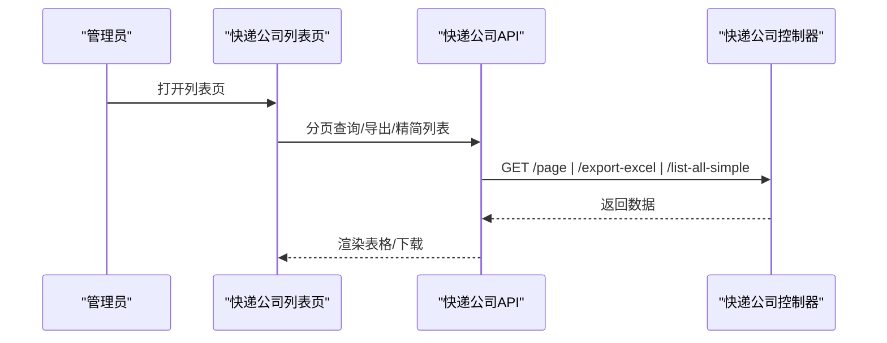
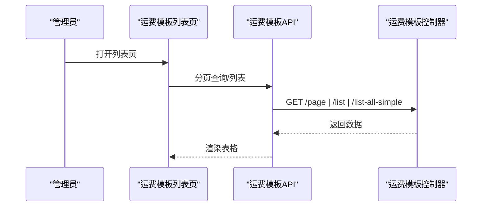
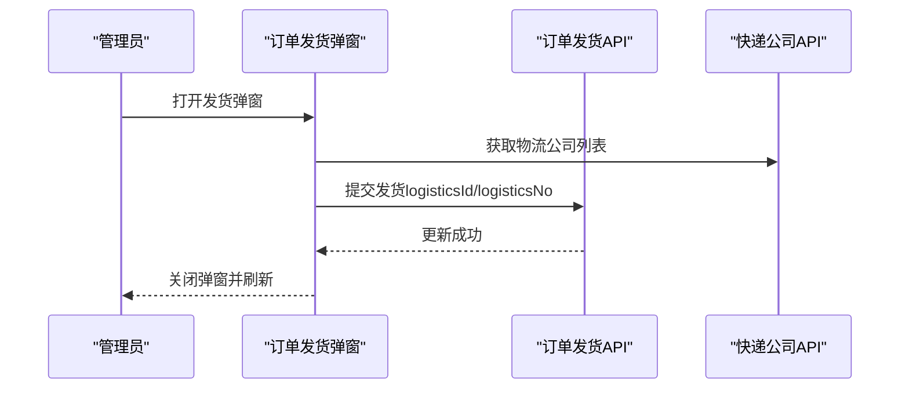
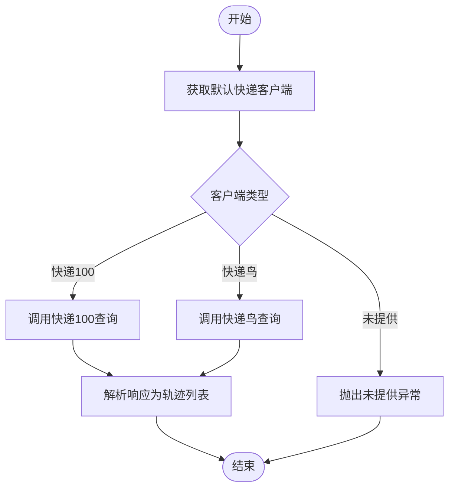
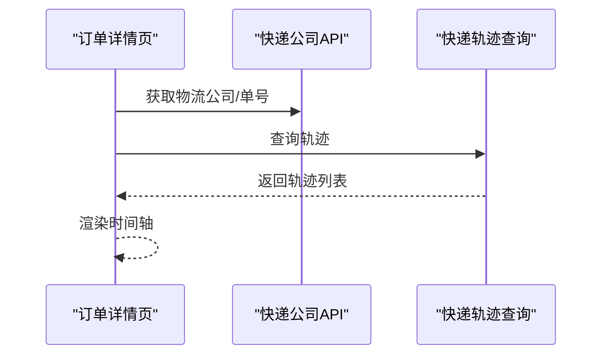
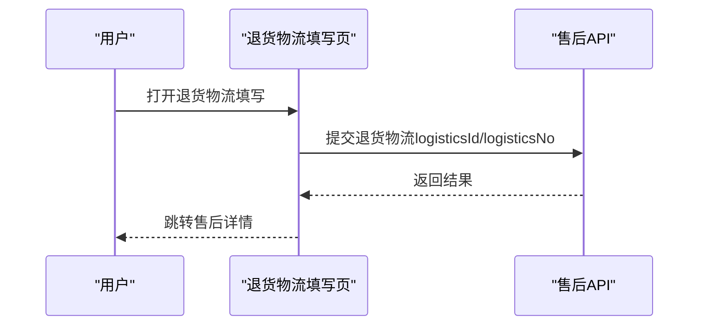
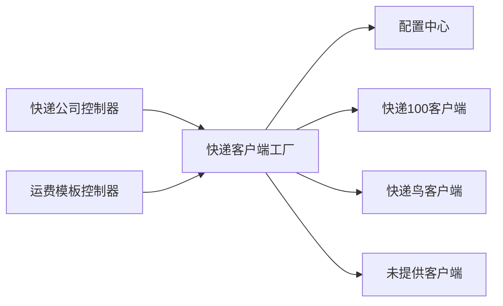

# 发货管理

<cite>
**本文引用的文件**
- [DeliveryExpressController.java](file://backend/yudao-module-mall/yudao-module-trade/src/main/java/cn/iocoder/yudao/module/trade/controller/admin/delivery/DeliveryExpressController.java)
- [DeliveryExpressTemplateController.java](file://backend/yudao-module-mall/yudao-module-trade/src/main/java/cn/iocoder/yudao/module/trade/controller/admin/delivery/DeliveryExpressTemplateController.java)
- [ExpressClient.java](file://backend/yudao-module-mall/yudao-module-trade/src/main/java/cn/iocoder/yudao/module/trade/framework/delivery/core/client/ExpressClient.java)
- [ExpressClientFactory.java](file://backend/yudao-module-mall/yudao-module-trade/src/main/java/cn/iocoder/yudao/module/trade/framework/delivery/core/client/ExpressClientFactory.java)
- [ExpressClientFactoryImpl.java](file://backend/yudao-module-mall/yudao-module-trade/src/main/java/cn/iocoder/yudao/module/trade/framework/delivery/core/client/impl/ExpressClientFactoryImpl.java)
- [KdNiaoExpressClient.java](file://backend/yudao-module-mall/yudao-module-trade/src/main/java/cn/iocoder/yudao/module/trade/framework/delivery/core/client/impl/kdniao/KdNiaoExpressClient.java)
- [Kd100ExpressClient.java](file://backend/yudao-module-mall/yudao-module-trade/src/main/java/cn/iocoder/yudao/module/trade/framework/delivery/core/client/impl/kd100/Kd100ExpressClient.java)
- [NoProvideExpressClient.java](file://backend/yudao-module-mall/yudao-module-trade/src/main/java/cn/iocoder/yudao/module/trade/framework/delivery/core/client/impl/NoProvideExpressClient.java)
- [TradeExpressProperties.java](file://backend/yudao-module-mall/yudao-module-trade/src/main/java/cn/iocoder/yudao/module/trade/framework/delivery/config/TradeExpressProperties.java)
- [ExpressClientEnum.java](file://backend/yudao-module-mall/yudao-module-trade/src/main/java/cn/iocoder/yudao/module/trade/framework/delivery/core/enums/ExpressClientEnum.java)
- [OrderDeliveryForm.vue](file://frontend/admin-vue3/src/views/mall/trade/order/form/OrderDeliveryForm.vue)
- [index.vue（快递公司列表页）](file://frontend/admin-vue3/src/views/mall/trade/delivery/express/index.vue)
- [index.vue（快递运费模板列表页）](file://frontend/admin-vue3/src/views/mall/trade/delivery/expressTemplate/index.vue)
- [index.ts（快递公司API）](file://frontend/admin-vue3/src/api/mall/trade/delivery/express/index.ts)
- [index.ts（快递运费模板API）](file://frontend/admin-vue3/src/api/mall/trade/delivery/expressTemplate/index.ts)
- [return-delivery.vue（退货物流填写）](file://frontend/mall-uniapp/pages/order/aftersale/return-delivery.vue)
- [afterSale API 类型定义](file://frontend/admin-vue3/src/api/mall/trade/afterSale/index.ts)
</cite>

## 目录
1. [简介](#简介)
2. [项目结构](#项目结构)
3. [核心组件](#核心组件)
4. [架构总览](#架构总览)
5. [详细组件分析](#详细组件分析)
6. [依赖分析](#依赖分析)
7. [性能考量](#性能考量)
8. [故障排查指南](#故障排查指南)
9. [结论](#结论)
10. [附录](#附录)

## 简介
本文件面向“发货管理”模块，系统性阐述发货流程设计、物流公司管理、快递单号处理、发货状态跟踪、发货单模型、物流信息集成、发货通知机制、退货地址管理等技术实现，并覆盖主流快递公司（快递鸟、快递100）的API集成方案、物流查询、发货回传、异常处理等关键流程。同时提供完整的发货相关API接口规范、并发控制、库存扣减与成本核算的技术要点说明。

## 项目结构
发货管理在后端采用“控制器-服务-持久层”的分层架构，在前端提供管理后台与移动端页面，配合快递查询客户端工厂模式对接多家快递服务商。

图表来源
- [DeliveryExpressController.java:1-97](file://backend/yudao-module-mall/yudao-module-trade/src/main/java/cn/iocoder/yudao/module/trade/controller/admin/delivery/DeliveryExpressController.java#L1-97)
- [DeliveryExpressTemplateController.java:1-91](file://backend/yudao-module-mall/yudao-module-trade/src/main/java/cn/iocoder/yudao/module/trade/controller/admin/delivery/DeliveryExpressTemplateController.java#L1-91)
- [ExpressClientFactoryImpl.java:1-55](file://backend/yudao-module-mall/yudao-module-trade/src/main/java/cn/iocoder/yudao/module/trade/framework/delivery/core/client/impl/ExpressClientFactoryImpl.java#L1-55)
- [ExpressClient.java:1-24](file://backend/yudao-module-mall/yudao-module-trade/src/main/java/cn/iocoder/yudao/module/trade/framework/delivery/core/client/ExpressClient.java#L1-24)
- [Kd100ExpressClient.java:1-108](file://backend/yudao-module-mall/yudao-module-trade/src/main/java/cn/iocoder/yudao/module/trade/framework/delivery/core/client/impl/kd100/Kd100ExpressClient.java#L1-108)
- [KdNiaoExpressClient.java:1-128](file://backend/yudao-module-mall/yudao-module-trade/src/main/java/cn/iocoder/yudao/module/trade/framework/delivery/core/client/impl/kdniao/KdNiaoExpressClient.java#L1-128)
- [NoProvideExpressClient.java:1-25](file://backend/yudao-module-mall/yudao-module-trade/src/main/java/cn/iocoder/yudao/module/trade/framework/delivery/core/client/impl/NoProvideExpressClient.java#L1-25)
- [TradeExpressProperties.java:1-90](file://backend/yudao-module-mall/yudao-module-trade/src/main/java/cn/iocoder/yudao/module/trade/framework/delivery/config/TradeExpressProperties.java#L1-90)
- [ExpressClientEnum.java:1-29](file://backend/yudao-module-mall/yudao-module-trade/src/main/java/cn/iocoder/yudao/module/trade/framework/delivery/core/enums/ExpressClientEnum.java#L1-29)
- [OrderDeliveryForm.vue:1-99](file://frontend/admin-vue3/src/views/mall/trade/order/form/OrderDeliveryForm.vue#L1-99)
- [index.vue（快递公司列表页）:1-43](file://frontend/admin-vue3/src/views/mall/trade/delivery/express/index.vue#L1-43)
- [index.vue（快递运费模板列表页）:1-43](file://frontend/admin-vue3/src/views/mall/trade/delivery/expressTemplate/index.vue#L1-43)
- [index.ts（快递公司API）:1-45](file://frontend/admin-vue3/src/api/mall/trade/delivery/express/index.ts#L1-45)
- [index.ts（快递运费模板API）:43-54](file://frontend/admin-vue3/src/api/mall/trade/delivery/expressTemplate/index.ts#L43-54)
- [return-delivery.vue（退货物流填写）:27-81](file://frontend/mall-uniapp/pages/order/aftersale/return-delivery.vue#L27-81)

章节来源
- [DeliveryExpressController.java:1-97](file://backend/yudao-module-mall/yudao-module-trade/src/main/java/cn/iocoder/yudao/module/trade/controller/admin/delivery/DeliveryExpressController.java#L1-97)
- [DeliveryExpressTemplateController.java:1-91](file://backend/yudao-module-mall/yudao-module-trade/src/main/java/cn/iocoder/yudao/module/trade/controller/admin/delivery/DeliveryExpressTemplateController.java#L1-91)
- [ExpressClientFactoryImpl.java:1-55](file://backend/yudao-module-mall/yudao-module-trade/src/main/java/cn/iocoder/yudao/module/trade/framework/delivery/core/client/impl/ExpressClientFactoryImpl.java#L1-55)
- [OrderDeliveryForm.vue:1-99](file://frontend/admin-vue3/src/views/mall/trade/order/form/OrderDeliveryForm.vue#L1-99)
- [index.vue（快递公司列表页）:1-43](file://frontend/admin-vue3/src/views/mall/trade/delivery/express/index.vue#L1-43)
- [index.vue（快递运费模板列表页）:1-43](file://frontend/admin-vue3/src/views/mall/trade/delivery/expressTemplate/index.vue#L1-43)
- [index.ts（快递公司API）:1-45](file://frontend/admin-vue3/src/api/mall/trade/delivery/express/index.ts#L1-45)
- [index.ts（快递运费模板API）:43-54](file://frontend/admin-vue3/src/api/mall/trade/delivery/expressTemplate/index.ts#L43-54)
- [return-delivery.vue（退货物流填写）:27-81](file://frontend/mall-uniapp/pages/order/aftersale/return-delivery.vue#L27-81)

## 核心组件
- 控制器层
  - 快递公司控制器：提供快递公司新增、修改、删除、分页、导出、精简列表等接口。
  - 运费模板控制器：提供运费模板新增、修改、删除、分页、列表查询等接口。
- 快递客户端与工厂
  - 快递客户端接口：统一快递轨迹查询能力。
  - 工厂实现：按配置选择快递100或快递鸟客户端，或未提供客户端。
  - 具体实现：快递100与快递鸟客户端封装HTTP请求、签名与响应解析。
- 配置中心
  - 统一管理默认快递客户端与各服务商密钥、授权参数。
- 前端交互
  - 管理后台订单发货弹窗、快递公司与运费模板列表页、退货物流填写页。

章节来源
- [DeliveryExpressController.java:37-95](file://backend/yudao-module-mall/yudao-module-trade/src/main/java/cn/iocoder/yudao/module/trade/controller/admin/delivery/DeliveryExpressController.java#L37-L95)
- [DeliveryExpressTemplateController.java:32-88](file://backend/yudao-module-mall/yudao-module-trade/src/main/java/cn/iocoder/yudao/module/trade/controller/admin/delivery/DeliveryExpressTemplateController.java#L32-L88)
- [ExpressClient.java:13-23](file://backend/yudao-module-mall/yudao-module-trade/src/main/java/cn/iocoder/yudao/module/trade/framework/delivery/core/client/ExpressClient.java#L13-L23)
- [ExpressClientFactoryImpl.java:29-53](file://backend/yudao-module-mall/yudao-module-trade/src/main/java/cn/iocoder/yudao/module/trade/framework/delivery/core/client/impl/ExpressClientFactoryImpl.java#L29-L53)
- [KdNiaoExpressClient.java:55-76](file://backend/yudao-module-mall/yudao-module-trade/src/main/java/cn/iocoder/yudao/module/trade/framework/delivery/core/client/impl/kdniao/KdNiaoExpressClient.java#L55-L76)
- [Kd100ExpressClient.java:52-67](file://backend/yudao-module-mall/yudao-module-trade/src/main/java/cn/iocoder/yudao/module/trade/framework/delivery/core/client/impl/kd100/Kd100ExpressClient.java#L52-L67)
- [TradeExpressProperties.java:22-87](file://backend/yudao-module-mall/yudao-module-trade/src/main/java/cn/iocoder/yudao/module/trade/framework/delivery/config/TradeExpressProperties.java#L22-L87)

## 架构总览
发货管理以“控制器-客户端工厂-具体快递服务商”三层解耦，前端通过API调用完成发货单创建、物流查询与状态跟踪。

图表来源
- [OrderDeliveryForm.vue:95-98](file://frontend/admin-vue3/src/views/mall/trade/order/form/OrderDeliveryForm.vue#L95-L98)
- [index.ts（快递公司API）:23-25](file://frontend/admin-vue3/src/api/mall/trade/delivery/express/index.ts#L23-L25)
- [index.ts（快递运费模板API）:64-80](file://frontend/admin-vue3/src/api/mall/trade/delivery/expressTemplate/index.ts#L64-L80)
- [ExpressClientFactoryImpl.java:29-40](file://backend/yudao-module-mall/yudao-module-trade/src/main/java/cn/iocoder/yudao/module/trade/framework/delivery/core/client/impl/ExpressClientFactoryImpl.java#L29-L40)
- [Kd100ExpressClient.java:52-67](file://backend/yudao-module-mall/yudao-module-trade/src/main/java/cn/iocoder/yudao/module/trade/framework/delivery/core/client/impl/kd100/Kd100ExpressClient.java#L52-L67)
- [KdNiaoExpressClient.java:55-76](file://backend/yudao-module-mall/yudao-module-trade/src/main/java/cn/iocoder/yudao/module/trade/framework/delivery/core/client/impl/kdniao/KdNiaoExpressClient.java#L55-L76)

## 详细组件分析

### 快递公司管理
- 功能职责
  - 后台维护快递公司基础信息（编号、名称、Logo、排序、状态），支持分页、导出、精简列表。
- 关键接口
  - 创建、更新、删除、详情、分页、导出、精简列表。
- 前端交互
  - 列表页支持搜索与权限控制；弹窗选择物流公司进行发货。

图表来源
- [index.vue（快递公司列表页）:1-43](file://frontend/admin-vue3/src/views/mall/trade/delivery/express/index.vue#L1-43)
- [index.ts（快递公司API）:13-45](file://frontend/admin-vue3/src/api/mall/trade/delivery/express/index.ts#L13-L45)
- [DeliveryExpressController.java:70-95](file://backend/yudao-module-mall/yudao-module-trade/src/main/java/cn/iocoder/yudao/module/trade/controller/admin/delivery/DeliveryExpressController.java#L70-L95)

章节来源
- [DeliveryExpressController.java:37-95](file://backend/yudao-module-mall/yudao-module-trade/src/main/java/cn/iocoder/yudao/module/trade/controller/admin/delivery/DeliveryExpressController.java#L37-L95)
- [index.vue（快递公司列表页）:1-43](file://frontend/admin-vue3/src/views/mall/trade/delivery/express/index.vue#L1-43)
- [index.ts（快递公司API）:13-45](file://frontend/admin-vue3/src/api/mall/trade/delivery/express/index.ts#L13-L45)

### 快递运费模板管理
- 功能职责
  - 维护按地区/首重/续重计算的运费模板，支持分页与列表查询。
- 关键接口
  - 创建、更新、删除、详情、列表、分页、精简列表。

图表来源
- [index.vue（快递运费模板列表页）:1-43](file://frontend/admin-vue3/src/views/mall/trade/delivery/expressTemplate/index.vue#L1-43)
- [index.ts（快递运费模板API）:43-80](file://frontend/admin-vue3/src/api/mall/trade/delivery/expressTemplate/index.ts#L43-L80)
- [DeliveryExpressTemplateController.java:64-88](file://backend/yudao-module-mall/yudao-module-trade/src/main/java/cn/iocoder/yudao/module/trade/controller/admin/delivery/DeliveryExpressTemplateController.java#L64-L88)

章节来源
- [DeliveryExpressTemplateController.java:32-88](file://backend/yudao-module-mall/yudao-module-trade/src/main/java/cn/iocoder/yudao/module/trade/controller/admin/delivery/DeliveryExpressTemplateController.java#L32-L88)
- [index.vue（快递运费模板列表页）:1-43](file://frontend/admin-vue3/src/views/mall/trade/delivery/expressTemplate/index.vue#L1-43)
- [index.ts（快递运费模板API）:43-80](file://frontend/admin-vue3/src/api/mall/trade/delivery/expressTemplate/index.ts#L43-L80)

### 发货单模型与订单发货流程
- 发货单模型
  - 包含订单编号、物流公司编号、物流单号、发货时间等字段。
- 发货流程
  - 管理后台订单详情页打开发货弹窗，选择物流公司并填写物流单号，提交后更新订单发货状态与物流信息。
- 退货物流
  - 移动端售后退货页面支持选择物流公司并填写物流单号，提交后记录退货物流信息。

图表来源
- [OrderDeliveryForm.vue:66-84](file://frontend/admin-vue3/src/views/mall/trade/order/form/OrderDeliveryForm.vue#L66-L84)
- [index.ts（快递公司API）:23-25](file://frontend/admin-vue3/src/api/mall/trade/delivery/express/index.ts#L23-L25)
- [return-delivery.vue（退货物流填写）:51-65](file://frontend/mall-uniapp/pages/order/aftersale/return-delivery.vue#L51-L65)

章节来源
- [OrderDeliveryForm.vue:1-99](file://frontend/admin-vue3/src/views/mall/trade/order/form/OrderDeliveryForm.vue#L1-L99)
- [return-delivery.vue（退货物流填写）:27-81](file://frontend/mall-uniapp/pages/order/aftersale/return-delivery.vue#L27-81)

### 物流信息集成与查询
- 客户端抽象与工厂
  - 通过工厂按配置选择快递100或快递鸟客户端，若未配置则抛出“未提供”异常。
- 快递100集成
  - 使用RestTemplate发起POST请求，构造签名参数，解析响应为轨迹列表。
- 快递鸟集成
  - 使用RestTemplate发起POST请求，构造DataSign签名，解析响应为轨迹列表。
- 查询流程

图表来源
- [ExpressClientFactoryImpl.java:29-53](file://backend/yudao-module-mall/yudao-module-trade/src/main/java/cn/iocoder/yudao/module/trade/framework/delivery/core/client/impl/ExpressClientFactoryImpl.java#L29-L53)
- [Kd100ExpressClient.java:52-67](file://backend/yudao-module-mall/yudao-module-trade/src/main/java/cn/iocoder/yudao/module/trade/framework/delivery/core/client/impl/kd100/Kd100ExpressClient.java#L52-L67)
- [KdNiaoExpressClient.java:55-76](file://backend/yudao-module-mall/yudao-module-trade/src/main/java/cn/iocoder/yudao/module/trade/framework/delivery/core/client/impl/kdniao/KdNiaoExpressClient.java#L55-L76)
- [NoProvideExpressClient.java:19-22](file://backend/yudao-module-mall/yudao-module-trade/src/main/java/cn/iocoder/yudao/module/trade/framework/delivery/core/client/impl/NoProvideExpressClient.java#L19-L22)

章节来源
- [ExpressClient.java:13-23](file://backend/yudao-module-mall/yudao-module-trade/src/main/java/cn/iocoder/yudao/module/trade/framework/delivery/core/client/ExpressClient.java#L13-L23)
- [ExpressClientFactory.java:10-24](file://backend/yudao-module-mall/yudao-module-trade/src/main/java/cn/iocoder/yudao/module/trade/framework/delivery/core/client/ExpressClientFactory.java#L10-L24)
- [ExpressClientFactoryImpl.java:29-53](file://backend/yudao-module-mall/yudao-module-trade/src/main/java/cn/iocoder/yudao/module/trade/framework/delivery/core/client/impl/ExpressClientFactoryImpl.java#L29-L53)
- [Kd100ExpressClient.java:52-67](file://backend/yudao-module-mall/yudao-module-trade/src/main/java/cn/iocoder/yudao/module/trade/framework/delivery/core/client/impl/kd100/Kd100ExpressClient.java#L52-L67)
- [KdNiaoExpressClient.java:55-76](file://backend/yudao-module-mall/yudao-module-trade/src/main/java/cn/iocoder/yudao/module/trade/framework/delivery/core/client/impl/kdniao/KdNiaoExpressClient.java#L55-L76)
- [TradeExpressProperties.java:22-87](file://backend/yudao-module-mall/yudao-module-trade/src/main/java/cn/iocoder/yudao/module/trade/framework/delivery/config/TradeExpressProperties.java#L22-L87)
- [ExpressClientEnum.java:13-27](file://backend/yudao-module-mall/yudao-module-trade/src/main/java/cn/iocoder/yudao/module/trade/framework/delivery/core/enums/ExpressClientEnum.java#L13-L27)

### 发货通知机制与状态跟踪
- 发货通知
  - 订单发货完成后，可在前端订单详情页查看物流公司、物流单号、发货时间与物流轨迹。
- 状态跟踪
  - 通过快递客户端查询实时轨迹，展示时间轴形式的物流详情。

图表来源
- [OrderDeliveryForm.vue:95-98](file://frontend/admin-vue3/src/views/mall/trade/order/form/OrderDeliveryForm.vue#L95-L98)
- [index.vue（快递公司列表页）:163-195](file://frontend/admin-vue3/src/views/mall/trade/delivery/express/index.vue#L163-L195)
- [Kd100ExpressClient.java:52-67](file://backend/yudao-module-mall/yudao-module-trade/src/main/java/cn/iocoder/yudao/module/trade/framework/delivery/core/client/impl/kd100/Kd100ExpressClient.java#L52-L67)
- [KdNiaoExpressClient.java:55-76](file://backend/yudao-module-mall/yudao-module-trade/src/main/java/cn/iocoder/yudao/module/trade/framework/delivery/core/client/impl/kdniao/KdNiaoExpressClient.java#L55-L76)

章节来源
- [OrderDeliveryForm.vue:1-99](file://frontend/admin-vue3/src/views/mall/trade/order/form/OrderDeliveryForm.vue#L1-L99)
- [index.vue（快递公司列表页）:163-195](file://frontend/admin-vue3/src/views/mall/trade/delivery/express/index.vue#L163-L195)

### 退货地址管理与售后发货
- 退货物流填写
  - 移动端售后页面支持选择物流公司并填写物流单号，提交后记录退货物流信息。
- 售后单模型
  - 包含退货物流公司编号、物流单号、退货时间等字段。

图表来源
- [return-delivery.vue（退货物流填写）:51-65](file://frontend/mall-uniapp/pages/order/aftersale/return-delivery.vue#L51-L65)
- [afterSale API 类型定义:28-33](file://frontend/admin-vue3/src/api/mall/trade/afterSale/index.ts#L28-L33)

章节来源
- [return-delivery.vue（退货物流填写）:27-81](file://frontend/mall-uniapp/pages/order/aftersale/return-delivery.vue#L27-81)
- [afterSale API 类型定义:1-35](file://frontend/admin-vue3/src/api/mall/trade/afterSale/index.ts#L1-L35)

## 依赖分析
- 组件耦合
  - 控制器依赖服务层，服务层依赖DAO与配置中心；客户端工厂依赖配置中心与具体客户端实现。
- 外部依赖
  - 快递100与快递鸟均通过RestTemplate发起HTTP请求，需正确配置密钥与签名规则。
- 潜在风险
  - 未配置默认快递客户端将触发“未提供”异常，需在生产环境配置至少一种服务商。

图表来源
- [DeliveryExpressController.java:34-35](file://backend/yudao-module-mall/yudao-module-trade/src/main/java/cn/iocoder/yudao/module/trade/controller/admin/delivery/DeliveryExpressController.java#L34-L35)
- [DeliveryExpressTemplateController.java:30-31](file://backend/yudao-module-mall/yudao-module-trade/src/main/java/cn/iocoder/yudao/module/trade/controller/admin/delivery/DeliveryExpressTemplateController.java#L30-L31)
- [ExpressClientFactoryImpl.java:29-53](file://backend/yudao-module-mall/yudao-module-trade/src/main/java/cn/iocoder/yudao/module/trade/framework/delivery/core/client/impl/ExpressClientFactoryImpl.java#L29-L53)
- [TradeExpressProperties.java:22-87](file://backend/yudao-module-mall/yudao-module-trade/src/main/java/cn/iocoder/yudao/module/trade/framework/delivery/config/TradeExpressProperties.java#L22-L87)

章节来源
- [ExpressClientFactoryImpl.java:1-55](file://backend/yudao-module-mall/yudao-module-trade/src/main/java/cn/iocoder/yudao/module/trade/framework/delivery/core/client/impl/ExpressClientFactoryImpl.java#L1-55)
- [TradeExpressProperties.java:1-90](file://backend/yudao-module-mall/yudao-module-trade/src/main/java/cn/iocoder/yudao/module/trade/framework/delivery/config/TradeExpressProperties.java#L1-90)

## 性能考量
- 并发控制
  - 发货与物流查询建议在业务层加锁或使用分布式锁，避免同一订单重复发货或并发查询导致的重复记录。
- 缓存策略
  - 快递公司与运费模板列表可缓存于Redis，降低频繁查询数据库的压力。
- 异步处理
  - 物流轨迹查询可异步执行，查询结果落库并推送消息至消息队列，前端轮询或订阅消息更新。
- 成本核算
  - 运费模板按首重/续重计算，结合订单商品重量与模板规则，生成成本与售价差异报表。

## 故障排查指南
- 快递查询失败
  - 检查配置中心的快递服务商密钥与签名参数是否正确。
  - 查看HTTP响应状态码与错误码，定位是签名错误还是接口不可达。
- 未提供快递客户端
  - 在配置中心设置默认快递客户端为快递100或快递鸟。
- 响应为空轨迹
  - 物流单号或快递公司编码不匹配，或该单号尚未有轨迹更新。

章节来源
- [Kd100ExpressClient.java:96-98](file://backend/yudao-module-mall/yudao-module-trade/src/main/java/cn/iocoder/yudao/module/trade/framework/delivery/core/client/impl/kd100/Kd100ExpressClient.java#L96-L98)
- [KdNiaoExpressClient.java:108-110](file://backend/yudao-module-mall/yudao-module-trade/src/main/java/cn/iocoder/yudao/module/trade/framework/delivery/core/client/impl/kdniao/KdNiaoExpressClient.java#L108-L110)
- [NoProvideExpressClient.java:19-22](file://backend/yudao-module-mall/yudao-module-trade/src/main/java/cn/iocoder/yudao/module/trade/framework/delivery/core/client/impl/NoProvideExpressClient.java#L19-L22)
- [TradeExpressProperties.java:22-87](file://backend/yudao-module-mall/yudao-module-trade/src/main/java/cn/iocoder/yudao/module/trade/framework/delivery/config/TradeExpressProperties.java#L22-L87)

## 结论
发货管理模块通过清晰的分层架构与可插拔的快递客户端工厂，实现了对多家快递服务商的统一接入与查询。前端提供完善的发货与退货物流填写体验，后端通过控制器与配置中心保障了扩展性与稳定性。建议在生产环境中完善并发控制、缓存与异步处理策略，并持续优化成本核算与通知机制。

## 附录

### 发货相关API接口规范（后端）
- 快递公司
  - POST /trade/delivery/express/create：创建快递公司
  - PUT /trade/delivery/express/update：更新快递公司
  - DELETE /trade/delivery/express/delete?id=...：删除快递公司
  - GET /trade/delivery/express/get?id=...：获取快递公司详情
  - GET /trade/delivery/express/list-all-simple：获取快递公司精简列表
  - GET /trade/delivery/express/page：分页查询快递公司
  - GET /trade/delivery/express/export-excel：导出快递公司Excel
- 快递运费模板
  - POST /trade/delivery/express-template/create：创建运费模板
  - PUT /trade/delivery/express-template/update：更新运费模板
  - DELETE /trade/delivery/express-template/delete?id=...：删除运费模板
  - GET /trade/delivery/express-template/get?id=...：获取运费模板详情
  - GET /trade/delivery/express-template/list?ids=...：批量获取运费模板
  - GET /trade/delivery/express-template/list-all-simple：获取运费模板精简列表
  - GET /trade/delivery/express-template/page：分页查询运费模板

章节来源
- [DeliveryExpressController.java:37-95](file://backend/yudao-module-mall/yudao-module-trade/src/main/java/cn/iocoder/yudao/module/trade/controller/admin/delivery/DeliveryExpressController.java#L37-L95)
- [DeliveryExpressTemplateController.java:32-88](file://backend/yudao-module-mall/yudao-module-trade/src/main/java/cn/iocoder/yudao/module/trade/controller/admin/delivery/DeliveryExpressTemplateController.java#L32-L88)

### 发货相关API接口规范（前端）
- 快递公司
  - POST /trade/delivery/express/create
  - PUT /trade/delivery/express/update
  - DELETE /trade/delivery/express/delete?id=
  - GET /trade/delivery/express/get?id=
  - GET /trade/delivery/express/list-all-simple
  - GET /trade/delivery/express/page
  - POST /trade/delivery/express/export-excel
- 快递运费模板
  - POST /trade/delivery/express-template/create
  - PUT /trade/delivery/express-template/update
  - DELETE /trade/delivery/express-template/delete?id=
  - GET /trade/delivery/express-template/get?id=
  - GET /trade/delivery/express-template/list?ids=
  - GET /trade/delivery/express-template/list-all-simple
  - GET /trade/delivery/express-template/page

章节来源
- [index.ts（快递公司API）:13-45](file://frontend/admin-vue3/src/api/mall/trade/delivery/express/index.ts#L13-L45)
- [index.ts（快递运费模板API）:43-80](file://frontend/admin-vue3/src/api/mall/trade/delivery/expressTemplate/index.ts#L43-L80)