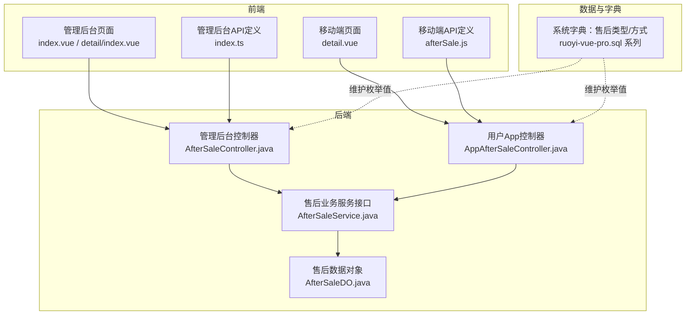
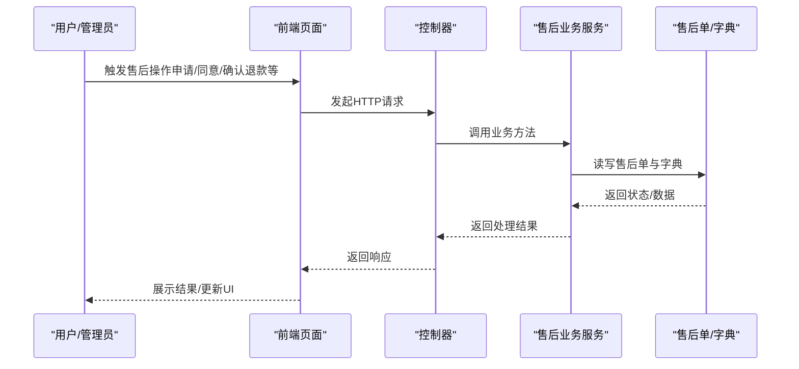
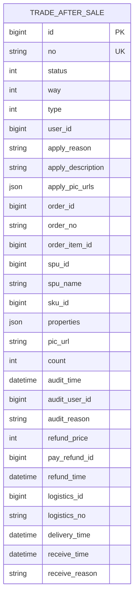
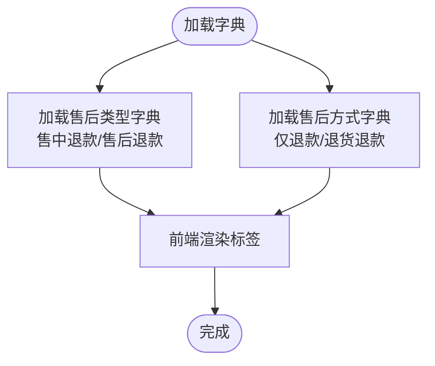
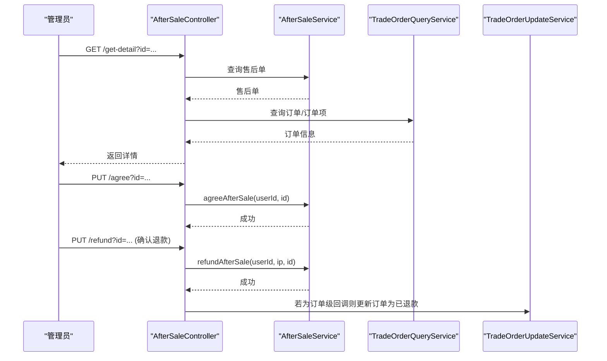
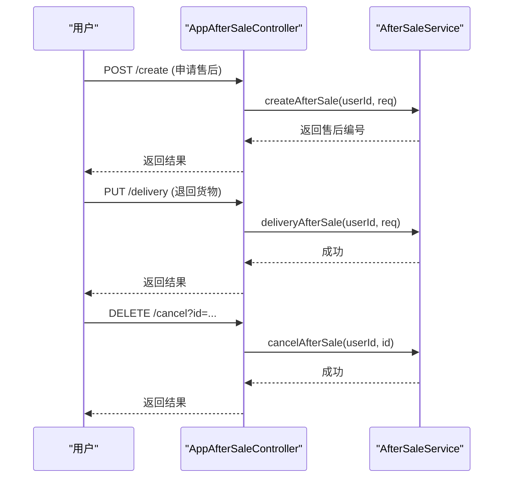
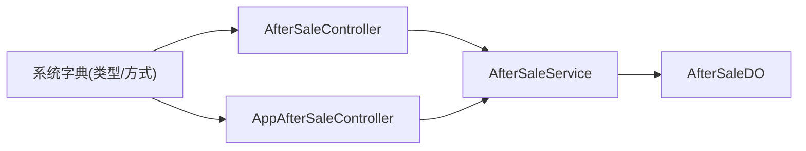

# 售后服务

<cite>
**本文引用的文件**   
- [AfterSaleDO.java](file://backend/yudao-module-mall/yudao-module-trade/src/main/java/cn/iocoder/yudao/module/trade/dal/dataobject/aftersale/AfterSaleDO.java)
- [AfterSaleController.java](file://backend/yudao-module-mall/yudao-module-trade/src/main/java/cn/iocoder/yudao/module/trade/controller/admin/aftersale/AfterSaleController.java)
- [AppAfterSaleController.java](file://backend/yudao-module-mall/yudao-module-trade/src/main/java/cn/iocoder/yudao/module/trade/controller/app/aftersale/AppAfterSaleController.java)
- [AfterSaleService.java](file://backend/yudao-module-mall/yudao-module-trade/src/main/java/cn/iocoder/yudao/module/trade/service/aftersale/AfterSaleService.java)
- [index.ts](file://frontend/admin-vue3/src/api/mall/trade/afterSale/index.ts)
- [index.vue](file://frontend/admin-vue3/src/views/mall/trade/afterSale/index.vue)
- [detail/index.vue](file://frontend/admin-vue3/src/views/mall/trade/afterSale/detail/index.vue)
- [afterSale.js](file://frontend/mall-uniapp/sheep/api/trade/afterSale.js)
- [detail.vue](file://frontend/mall-uniapp/pages/order/aftersale/detail.vue)
- [ruoyi-vue-pro.sql](file://backend/sql/mysql/ruoyi-vue-pro.sql)
- [ruoyi-vue-pro.sql](file://backend/sql/postgresql/ruoyi-vue-pro.sql)
- [ruoyi-vue-pro.sql](file://backend/sql/sqlserver/ruoyi-vue-pro.sql)
- [ruoyi-vue-pro.sql](file://backend/sql/oracle/ruoyi-vue-pro.sql)
- [ruoyi-vue-pro.sql](file://backend/sql/kingbase/ruoyi-vue-pro.sql)
- [ruoyi-vue-pro.sql](file://backend/sql/opengauss/ruoyi-vue-pro.sql)
- [ruoyi-vue-pro-dm8.sql](file://backend/sql/dm/ruoyi-vue-pro-dm8.sql)
</cite>

## 目录
1. [引言](#引言)
2. [项目结构](#项目结构)
3. [核心组件](#核心组件)
4. [架构总览](#架构总览)
5. [详细组件分析](#详细组件分析)
6. [依赖分析](#依赖分析)
7. [性能考虑](#性能考虑)
8. [故障排查指南](#故障排查指南)
9. [结论](#结论)
10. [附录](#附录)

## 引言
本文件面向“售后服务”模块，系统化阐述售后申请流程、状态管理、退款处理、换货维修等核心能力；并从代码层面解析售后单模型、售后类型与方式分类、规则配置入口、审核机制、并发控制与重复申请防护、资金处理与回调对接等关键技术点。同时提供完整的售后API接口说明，覆盖前端APP与管理后台的典型使用场景。

## 项目结构
售后服务模块在后端采用“控制器-服务-数据对象”的分层设计，前端分别提供管理后台与移动端两套交互界面，数据库侧通过字典表维护售后类型与方式的枚举值。

图表来源
- [AfterSaleController.java:1-156](file://backend/yudao-module-mall/yudao-module-trade/src/main/java/cn/iocoder/yudao/module/trade/controller/admin/aftersale/AfterSaleController.java#L1-L156)
- [AppAfterSaleController.java:1-70](file://backend/yudao-module-mall/yudao-module-trade/src/main/java/cn/iocoder/yudao/module/trade/controller/app/aftersale/AppAfterSaleController.java#L1-L70)
- [AfterSaleService.java:1-137](file://backend/yudao-module-mall/yudao-module-trade/src/main/java/cn/iocoder/yudao/module/trade/service/aftersale/AfterSaleService.java#L1-L137)
- [AfterSaleDO.java:1-200](file://backend/yudao-module-mall/yudao-module-trade/src/main/java/cn/iocoder/yudao/module/trade/dal/dataobject/aftersale/AfterSaleDO.java#L1-L200)
- [ruoyi-vue-pro.sql](file://backend/sql/mysql/ruoyi-vue-pro.sql)

章节来源
- [AfterSaleController.java:1-156](file://backend/yudao-module-mall/yudao-module-trade/src/main/java/cn/iocoder/yudao/module/trade/controller/admin/aftersale/AfterSaleController.java#L1-L156)
- [AppAfterSaleController.java:1-70](file://backend/yudao-module-mall/yudao-module-trade/src/main/java/cn/iocoder/yudao/module/trade/controller/app/aftersale/AppAfterSaleController.java#L1-L70)
- [AfterSaleService.java:1-137](file://backend/yudao-module-mall/yudao-module-trade/src/main/java/cn/iocoder/yudao/module/trade/service/aftersale/AfterSaleService.java#L1-L137)
- [AfterSaleDO.java:1-200](file://backend/yudao-module-mall/yudao-module-trade/src/main/java/cn/iocoder/yudao/module/trade/dal/dataobject/aftersale/AfterSaleDO.java#L1-L200)
- [ruoyi-vue-pro.sql](file://backend/sql/mysql/ruoyi-vue-pro.sql)

## 核心组件
- 售后单数据对象：封装售后单的全部字段，包含基础信息、订单关联、审批、退款、退货物流等字段，并通过类型处理器持久化复杂属性。
- 管理后台控制器：提供售后分页、详情、同意/拒绝、确认收货/拒收入库、确认退款、支付回调更新等接口。
- 用户App控制器：提供售后分页、详情、申请售后、取消售后、退回货物等接口。
- 售后服务接口：抽象出售后生命周期内的所有业务动作，供控制器调用。
- 前端API与页面：管理后台与移动端分别提供列表、详情、按钮操作与图片凭证展示。

章节来源
- [AfterSaleDO.java:1-200](file://backend/yudao-module-mall/yudao-module-trade/src/main/java/cn/iocoder/yudao/module/trade/dal/dataobject/aftersale/AfterSaleDO.java#L1-L200)
- [AfterSaleController.java:1-156](file://backend/yudao-module-mall/yudao-module-trade/src/main/java/cn/iocoder/yudao/module/trade/controller/admin/aftersale/AfterSaleController.java#L1-L156)
- [AppAfterSaleController.java:1-70](file://backend/yudao-module-mall/yudao-module-trade/src/main/java/cn/iocoder/yudao/module/trade/controller/app/aftersale/AppAfterSaleController.java#L1-L70)
- [AfterSaleService.java:1-137](file://backend/yudao-module-mall/yudao-module-trade/src/main/java/cn/iocoder/yudao/module/trade/service/aftersale/AfterSaleService.java#L1-L137)
- [index.ts](file://frontend/admin-vue3/src/api/mall/trade/afterSale/index.ts)
- [index.vue](file://frontend/admin-vue3/src/views/mall/trade/afterSale/index.vue)
- [detail/index.vue](file://frontend/admin-vue3/src/views/mall/trade/afterSale/detail/index.vue)
- [afterSale.js](file://frontend/mall-uniapp/sheep/api/trade/afterSale.js)
- [detail.vue](file://frontend/mall-uniapp/pages/order/aftersale/detail.vue)

## 架构总览
售后模块遵循“前后端分离 + 控制器编排 + 服务层业务 + 数据对象持久化”的架构模式。前端通过HTTP接口与后端交互，后端通过服务层协调订单、支付、日志等子域完成售后闭环。

图表来源
- [AfterSaleController.java:1-156](file://backend/yudao-module-mall/yudao-module-trade/src/main/java/cn/iocoder/yudao/module/trade/controller/admin/aftersale/AfterSaleController.java#L1-L156)
- [AppAfterSaleController.java:1-70](file://backend/yudao-module-mall/yudao-module-trade/src/main/java/cn/iocoder/yudao/module/trade/controller/app/aftersale/AppAfterSaleController.java#L1-L70)
- [AfterSaleService.java:1-137](file://backend/yudao-module-mall/yudao-module-trade/src/main/java/cn/iocoder/yudao/module/trade/service/aftersale/AfterSaleService.java#L1-L137)
- [AfterSaleDO.java:1-200](file://backend/yudao-module-mall/yudao-module-trade/src/main/java/cn/iocoder/yudao/module/trade/dal/dataobject/aftersale/AfterSaleDO.java#L1-L200)

## 详细组件分析

### 售后单模型（AfterSaleDO）
- 字段维度
  - 基础信息：售后编号、单号、状态、方式、类型、用户、申请原因/描述/凭证图集。
  - 订单关联：订单编号/单号、订单项、SPU/SKU、属性、图片、退货数量。
  - 审批：审批时间、审批人、审批备注。
  - 退款：退款金额、支付退款编号、退款时间。
  - 退货：物流公司/单号、退货/收货时间、收货备注。
- 设计要点
  - 使用类型处理器持久化复杂字段（如图片URL数组、订单属性）。
  - 多处冗余字段（如订单号、SPU名称等）提升查询效率。
  - 主键序列适配多数据库。

图表来源
- [AfterSaleDO.java:1-200](file://backend/yudao-module-mall/yudao-module-trade/src/main/java/cn/iocoder/yudao/module/trade/dal/dataobject/aftersale/AfterSaleDO.java#L1-L200)

章节来源
- [AfterSaleDO.java:1-200](file://backend/yudao-module-mall/yudao-module-trade/src/main/java/cn/iocoder/yudao/module/trade/dal/dataobject/aftersale/AfterSaleDO.java#L1-L200)

### 售后类型与方式（字典驱动）
- 类型：售中退款、售后退款（对应枚举值在各数据库SQL中插入）。
- 方式：仅退款、退货退款（对应枚举值在各数据库SQL中插入）。
- 使用方式：前端通过字典类型渲染状态/方式标签，后端通过枚举常量或字典值进行判断与存储。

图表来源
- [ruoyi-vue-pro.sql](file://backend/sql/mysql/ruoyi-vue-pro.sql)
- [ruoyi-vue-pro.sql](file://backend/sql/postgresql/ruoyi-vue-pro.sql)
- [ruoyi-vue-pro.sql](file://backend/sql/sqlserver/ruoyi-vue-pro.sql)
- [ruoyi-vue-pro.sql](file://backend/sql/oracle/ruoyi-vue-pro.sql)
- [ruoyi-vue-pro.sql](file://backend/sql/kingbase/ruoyi-vue-pro.sql)
- [ruoyi-vue-pro.sql](file://backend/sql/opengauss/ruoyi-vue-pro.sql)
- [ruoyi-vue-pro-dm8.sql](file://backend/sql/dm/ruoyi-vue-pro-dm8.sql)

章节来源
- [ruoyi-vue-pro.sql](file://backend/sql/mysql/ruoyi-vue-pro.sql)
- [ruoyi-vue-pro.sql](file://backend/sql/postgresql/ruoyi-vue-pro.sql)
- [ruoyi-vue-pro.sql](file://backend/sql/sqlserver/ruoyi-vue-pro.sql)
- [ruoyi-vue-pro.sql](file://backend/sql/oracle/ruoyi-vue-pro.sql)
- [ruoyi-vue-pro.sql](file://backend/sql/kingbase/ruoyi-vue-pro.sql)
- [ruoyi-vue-pro.sql](file://backend/sql/opengauss/ruoyi-vue-pro.sql)
- [ruoyi-vue-pro-dm8.sql](file://backend/sql/dm/ruoyi-vue-pro-dm8.sql)

### 管理后台API（AfterSaleController）
- 列表与详情：分页查询、按ID获取详情，拼装会员信息与日志。
- 审核与处理：
  - 同意售后
  - 拒绝售后（需填写审批备注）
  - 确认收货
  - 拒绝收货（需填写拒绝备注）
  - 确认退款（记录管理员与IP）
  - 支付回调更新（根据商户单号区分订单或售后）

图表来源
- [AfterSaleController.java:73-153](file://backend/yudao-module-mall/yudao-module-trade/src/main/java/cn/iocoder/yudao/module/trade/controller/admin/aftersale/AfterSaleController.java#L73-L153)

章节来源
- [AfterSaleController.java:57-153](file://backend/yudao-module-mall/yudao-module-trade/src/main/java/cn/iocoder/yudao/module/trade/controller/admin/aftersale/AfterSaleController.java#L57-L153)

### 用户App API（AppAfterSaleController）
- 分页与详情：支持按用户维度查询售后单。
- 申请售后：提交售后申请（原因、描述、凭证、退货数量等）。
- 退回货物：填写物流信息（公司/单号）。
- 取消售后：在允许状态下撤销申请。

图表来源
- [AppAfterSaleController.java:33-67](file://backend/yudao-module-mall/yudao-module-trade/src/main/java/cn/iocoder/yudao/module/trade/controller/app/aftersale/AppAfterSaleController.java#L33-L67)

章节来源
- [AppAfterSaleController.java:33-67](file://backend/yudao-module-mall/yudao-module-trade/src/main/java/cn/iocoder/yudao/module/trade/controller/app/aftersale/AppAfterSaleController.java#L33-L67)

### 前端页面与API
- 管理后台
  - 列表页：展示售后状态、方式、申请时间等，支持处理退款。
  - 详情页：展示申请原因/描述/凭证，根据状态显示同意/拒绝、确认收货/拒收、确认退款等按钮。
- 移动端
  - 详情页：展示售后信息与操作按钮（取消申请、填写退货、联系客服）。
- API定义
  - 管理后台：分页、创建、详情、取消、日志、退回货物、同意/拒绝/确认收货/确认退款、支付回调。
  - 移动端：分页、详情、创建、取消、退回货物。

章节来源
- [index.vue](file://frontend/admin-vue3/src/views/mall/trade/afterSale/index.vue)
- [detail/index.vue](file://frontend/admin-vue3/src/views/mall/trade/afterSale/detail/index.vue)
- [index.ts](file://frontend/admin-vue3/src/api/mall/trade/afterSale/index.ts)
- [afterSale.js](file://frontend/mall-uniapp/sheep/api/trade/afterSale.js)
- [detail.vue](file://frontend/mall-uniapp/pages/order/aftersale/detail.vue)

## 依赖分析
- 控制器依赖服务接口，服务接口负责编排订单查询/更新、支付回调处理与日志记录。
- 数据对象承载字段与类型处理器，支撑复杂属性持久化。
- 字典表为类型/方式提供统一枚举值，前端通过字典类型渲染。

图表来源
- [AfterSaleController.java:1-156](file://backend/yudao-module-mall/yudao-module-trade/src/main/java/cn/iocoder/yudao/module/trade/controller/admin/aftersale/AfterSaleController.java#L1-L156)
- [AppAfterSaleController.java:1-70](file://backend/yudao-module-mall/yudao-module-trade/src/main/java/cn/iocoder/yudao/module/trade/controller/app/aftersale/AppAfterSaleController.java#L1-L70)
- [AfterSaleService.java:1-137](file://backend/yudao-module-mall/yudao-module-trade/src/main/java/cn/iocoder/yudao/module/trade/service/aftersale/AfterSaleService.java#L1-L137)
- [AfterSaleDO.java:1-200](file://backend/yudao-module-mall/yudao-module-trade/src/main/java/cn/iocoder/yudao/module/trade/dal/dataobject/aftersale/AfterSaleDO.java#L1-L200)

## 性能考虑
- 字段冗余：订单号、SPU/SKU、属性等冗余字段减少联表查询，提升列表与详情渲染性能。
- 类型处理器：对数组/JSON字段使用类型处理器，避免额外转换开销。
- 分页查询：列表接口采用分页，结合字典渲染，降低一次性传输量。
- 日志与订单查询：详情接口按需查询订单与日志，避免不必要的IO。

## 故障排查指南
- 支付回调未生效
  - 检查回调接口是否被正确调用，确认商户单号前缀区分（订单或售后）。
  - 核对回调参数与退款编号映射是否正确。
- 审批/收货/退款按钮不可用
  - 检查当前售后状态是否匹配操作条件（如仅在待处理/待收货/待退款状态显示对应按钮）。
- 凭证图片无法预览
  - 检查图片URL是否有效，以及前端图片组件的渲染逻辑。
- 重复申请防护
  - 在服务层对同一订单/订单项的“进行中”售后进行限制，避免重复提交。

章节来源
- [AfterSaleController.java:138-153](file://backend/yudao-module-mall/yudao-module-trade/src/main/java/cn/iocoder/yudao/module/trade/controller/admin/aftersale/AfterSaleController.java#L138-L153)
- [detail/index.vue:64-80](file://frontend/admin-vue3/src/views/mall/trade/afterSale/detail/index.vue#L64-L80)

## 结论
售后服务模块通过清晰的分层设计与字典驱动的类型/方式管理，实现了从申请到退款/收货/审核的完整闭环。前端提供管理后台与移动端双入口，后端以服务层为核心编排业务，具备良好的扩展性与可维护性。后续可在规则配置、时效控制、责任判定与并发控制方面进一步增强。

## 附录

### 售后API接口清单
- 管理后台
  - GET /trade/after-sale/page：分页查询售后单
  - GET /trade/after-sale/get-detail：获取售后详情
  - PUT /trade/after-sale/agree：同意售后
  - PUT /trade/after-sale/disagree：拒绝售后
  - PUT /trade/after-sale/receive：确认收货
  - PUT /trade/after-sale/refuse：拒绝收货
  - PUT /trade/after-sale/refund：确认退款
  - POST /trade/after-sale/update-refunded：支付回调更新售后为已退款
- 用户App
  - GET /trade/after-sale/page：分页查询售后单
  - GET /trade/after-sale/get：获取售后单
  - POST /trade/after-sale/create：申请售后
  - PUT /trade/after-sale/delivery：退回货物
  - DELETE /trade/after-sale/cancel：取消售后

章节来源
- [AfterSaleController.java:57-153](file://backend/yudao-module-mall/yudao-module-trade/src/main/java/cn/iocoder/yudao/module/trade/controller/admin/aftersale/AfterSaleController.java#L57-L153)
- [AppAfterSaleController.java:33-67](file://backend/yudao-module-mall/yudao-module-trade/src/main/java/cn/iocoder/yudao/module/trade/controller/app/aftersale/AppAfterSaleController.java#L33-L67)
- [index.ts](file://frontend/admin-vue3/src/api/mall/trade/afterSale/index.ts)
- [afterSale.js](file://frontend/mall-uniapp/sheep/api/trade/afterSale.js)