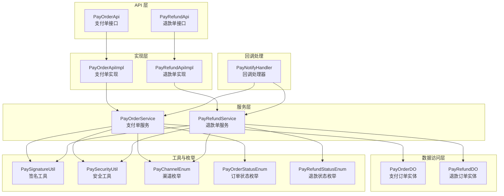
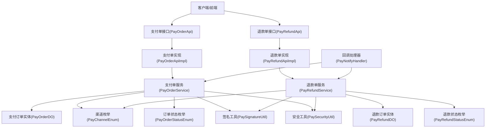
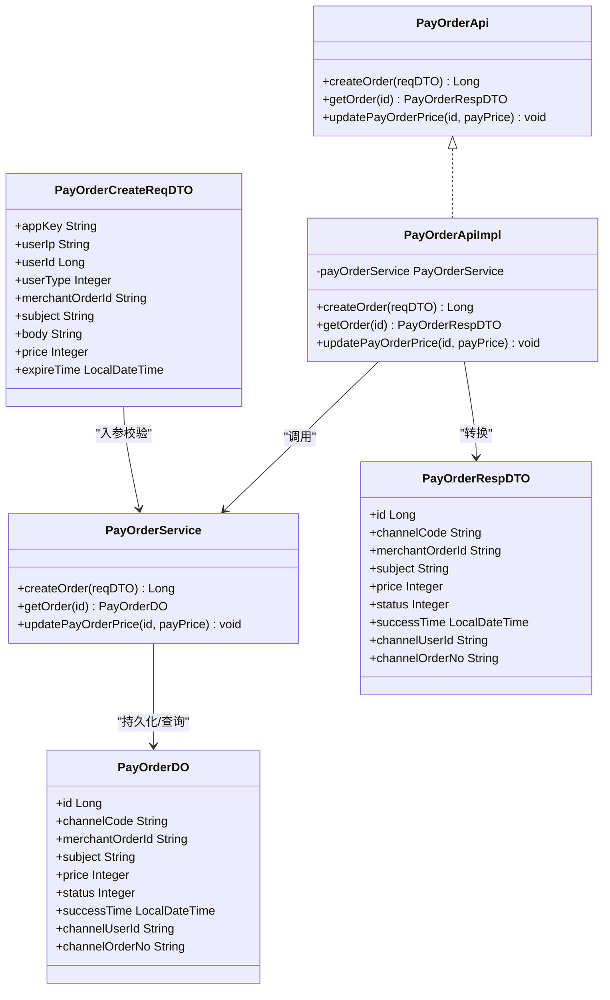
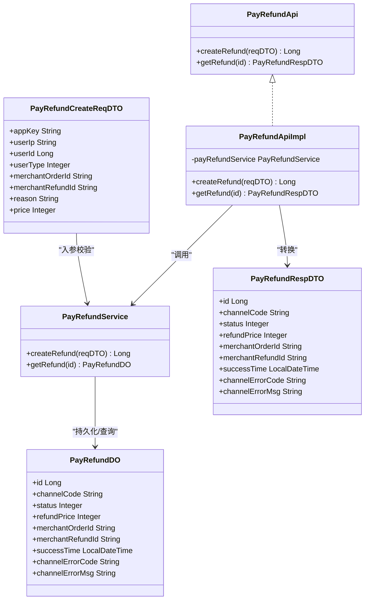
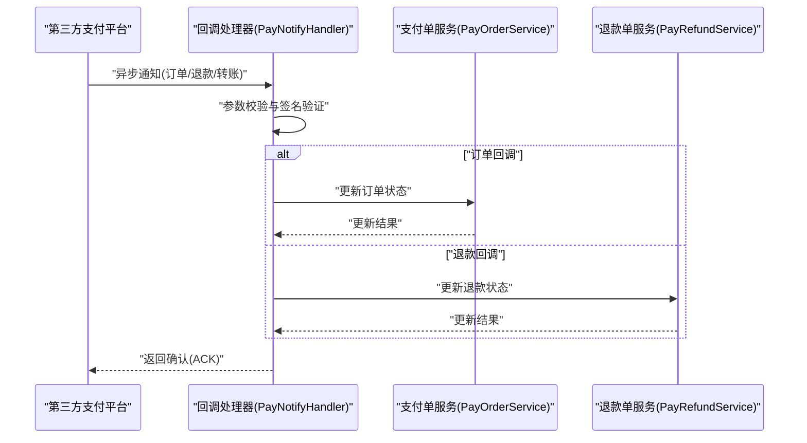
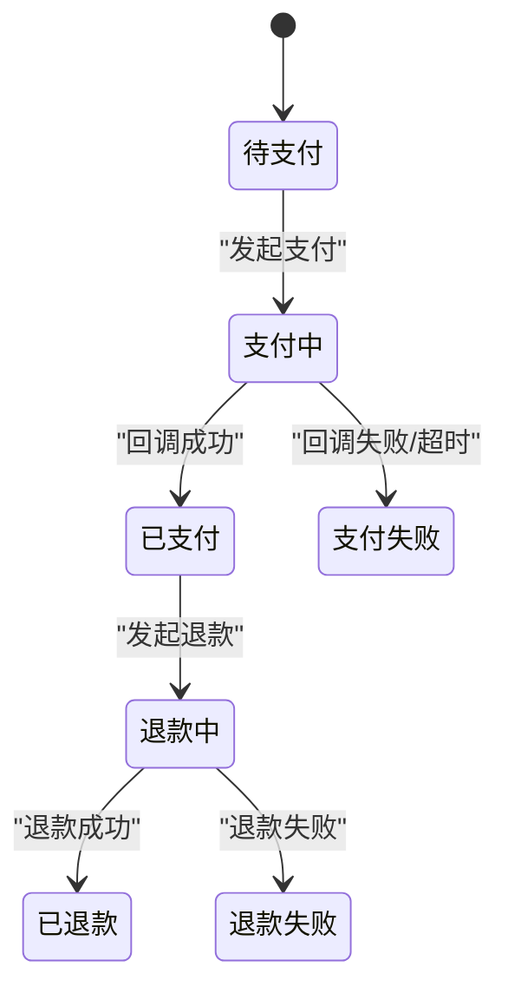
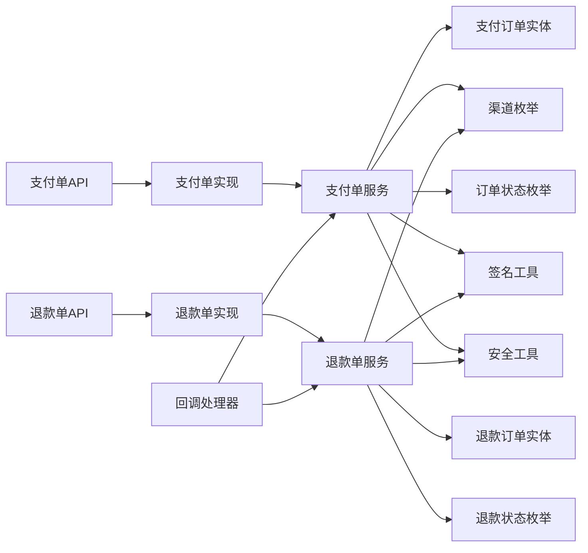

# 支付处理

<cite>
**本文引用的文件**
- [PayOrderApi.java](file://backend/yudao-module-pay/src/main/java/cn/iocoder/yudao/module/pay/api/order/PayOrderApi.java)
- [PayOrderApiImpl.java](file://backend/yudao-module-pay/src/main/java/cn/iocoder/yudao/module/pay/api/order/PayOrderApiImpl.java)
- [PayOrderCreateReqDTO.java](file://backend/yudao-module-pay/src/main/java/cn/iocoder/yudao/module/pay/api/order/dto/PayOrderCreateReqDTO.java)
- [PayOrderRespDTO.java](file://backend/yudao-module-pay/src/main/java/cn/iocoder/yudao/module/pay/api/order/dto/PayOrderRespDTO.java)
- [PayRefundApi.java](file://backend/yudao-module-pay/src/main/java/cn/iocoder/yudao/module/pay/api/refund/PayRefundApi.java)
- [PayRefundApiImpl.java](file://backend/yudao-module-pay/src/main/java/cn/iocoder/yudao/module/pay/api/refund/PayRefundApiImpl.java)
- [PayRefundCreateReqDTO.java](file://backend/yudao-module-pay/src/main/java/cn/iocoder/yudao/module/pay/api/refund/dto/PayRefundCreateReqDTO.java)
- [PayRefundRespDTO.java](file://backend/yudao-module-pay/src/main/java/cn/iocoder/yudao/module/pay/api/refund/dto/PayRefundRespDTO.java)
- [PayOrderNotifyReqDTO.java](file://backend/yudao-module-pay/src/main/java/cn/iocoder/yudao/module/pay/api/notify/dto/PayOrderNotifyReqDTO.java)
- [PayRefundNotifyReqDTO.java](file://backend/yudao-module-pay/src/main/java/cn/iocoder/yudao/module/pay/api/notify/dto/PayRefundNotifyReqDTO.java)
- [PayTransferNotifyReqDTO.java](file://backend/yudao-module-pay/src/main/java/cn/iocoder/yudao/module/pay/api/notify/dto/PayTransferNotifyReqDTO.java)
- [PayOrderService.java](file://backend/yudao-module-pay/src/main/java/cn/iocoder/yudao/module/pay/service/order/PayOrderService.java)
- [PayRefundService.java](file://backend/yudao-module-pay/src/main/java/cn/iocoder/yudao/module/pay/service/refund/PayRefundService.java)
- [PayOrderDO.java](file://backend/yudao-module-pay/src/main/java/cn/iocoder/yudao/module/pay/dal/dataobject/order/PayOrderDO.java)
- [PayRefundDO.java](file://backend/yudao-module-pay/src/main/java/cn/iocoder/yudao/module/pay/dal/dataobject/refund/PayRefundDO.java)
- [PayChannelEnum.java](file://backend/yudao-module-pay/src/main/java/cn/iocoder/yudao/module/pay/enums/channel/PayChannelEnum.java)
- [PayOrderStatusEnum.java](file://backend/yudao-module-pay/src/main/java/cn/iocoder/yudao/module/pay/enums/order/PayOrderStatusEnum.java)
- [PayRefundStatusEnum.java](file://backend/yudao-module-pay/src/main/java/cn/iocoder/yudao/module/pay/enums/refund/PayRefundStatusEnum.java)
- [PaySignatureUtil.java](file://backend/yudao-module-pay/src/main/java/cn/iocoder/yudao/module/pay/util/PaySignatureUtil.java)
- [PaySecurityUtil.java](file://backend/yudao-module-pay/src/main/java/cn/iocoder/yudao/module/pay/util/PaySecurityUtil.java)
- [PayNotifyHandler.java](file://backend/yudao-module-pay/src/main/java/cn/iocoder/yudao/module/pay/handler/PayNotifyHandler.java)
- [PayOrderController.java](file://backend/yudao-module-mall/yudao-module-statistics/src/main/java/cn/iocoder/yudao/module/statistics/controller/admin/pay/PayStatisticsController.java)
- [PaySummaryRespVO.java](file://backend/yudao-module-mall/yudao-module-statistics/src/main/java/cn/iocoder/yudao/module/statistics/controller/admin/pay/vo/PaySummaryRespVO.java)
</cite>

## 目录
1. [简介](#简介)
2. [项目结构](#项目结构)
3. [核心组件](#核心组件)
4. [架构总览](#架构总览)
5. [详细组件分析](#详细组件分析)
6. [依赖分析](#依赖分析)
7. [性能考虑](#性能考虑)
8. [故障排查指南](#故障排查指南)
9. [结论](#结论)
10. [附录](#附录)

## 简介
本文件面向支付处理模块，系统化阐述支付流程设计、支付方式管理、支付状态同步、退款处理等核心能力；同时覆盖支付订单模型、支付渠道集成、支付安全机制、支付回调处理等技术实现。文档还包含微信支付、支付宝、银联等第三方支付平台的集成思路与参数签名、回调验证、异步通知处理的关键环节说明，并提供完整的支付API接口规范与并发控制、幂等性保证、资金安全等技术要点。

## 项目结构
支付模块采用清晰的分层与职责划分：
- API 层：对外暴露支付与退款的接口定义与实现，负责参数校验与DTO转换。
- Service 层：业务编排与状态流转，协调DAO与外部渠道交互。
- DAL 层：数据对象与持久化，承载支付订单与退款记录的数据模型。
- Enums 层：支付渠道、订单状态、退款状态等枚举定义。
- Util 层：支付安全与签名工具，保障参数完整性与防篡改。
- Handler 层：异步回调处理器，统一接收并处理第三方支付平台的通知。

图表来源
- [PayOrderApi.java:1-41](file://backend/yudao-module-pay/src/main/java/cn/iocoder/yudao/module/pay/api/order/PayOrderApi.java#L1-L41)
- [PayRefundApi.java:1-32](file://backend/yudao-module-pay/src/main/java/cn/iocoder/yudao/module/pay/api/refund/PayRefundApi.java#L1-L32)
- [PayOrderApiImpl.java:1-40](file://backend/yudao-module-pay/src/main/java/cn/iocoder/yudao/module/pay/api/order/PayOrderApiImpl.java#L1-L40)
- [PayRefundApiImpl.java:1-36](file://backend/yudao-module-pay/src/main/java/cn/iocoder/yudao/module/pay/api/refund/PayRefundApiImpl.java#L1-L36)
- [PayOrderService.java](file://backend/yudao-module-pay/src/main/java/cn/iocoder/yudao/module/pay/service/order/PayOrderService.java)
- [PayRefundService.java](file://backend/yudao-module-pay/src/main/java/cn/iocoder/yudao/module/pay/service/refund/PayRefundService.java)
- [PayOrderDO.java](file://backend/yudao-module-pay/src/main/java/cn/iocoder/yudao/module/pay/dal/dataobject/order/PayOrderDO.java)
- [PayRefundDO.java](file://backend/yudao-module-pay/src/main/java/cn/iocoder/yudao/module/pay/dal/dataobject/refund/PayRefundDO.java)
- [PaySignatureUtil.java](file://backend/yudao-module-pay/src/main/java/cn/iocoder/yudao/module/pay/util/PaySignatureUtil.java)
- [PaySecurityUtil.java](file://backend/yudao-module-pay/src/main/java/cn/iocoder/yudao/module/pay/util/PaySecurityUtil.java)
- [PayChannelEnum.java](file://backend/yudao-module-pay/src/main/java/cn/iocoder/yudao/module/pay/enums/channel/PayChannelEnum.java)
- [PayOrderStatusEnum.java](file://backend/yudao-module-pay/src/main/java/cn/iocoder/yudao/module/pay/enums/order/PayOrderStatusEnum.java)
- [PayRefundStatusEnum.java](file://backend/yudao-module-pay/src/main/java/cn/iocoder/yudao/module/pay/enums/refund/PayRefundStatusEnum.java)
- [PayNotifyHandler.java](file://backend/yudao-module-pay/src/main/java/cn/iocoder/yudao/module/pay/handler/PayNotifyHandler.java)

章节来源
- [PayOrderApi.java:1-41](file://backend/yudao-module-pay/src/main/java/cn/iocoder/yudao/module/pay/api/order/PayOrderApi.java#L1-L41)
- [PayRefundApi.java:1-32](file://backend/yudao-module-pay/src/main/java/cn/iocoder/yudao/module/pay/api/refund/PayRefundApi.java#L1-L32)
- [PayOrderApiImpl.java:1-40](file://backend/yudao-module-pay/src/main/java/cn/iocoder/yudao/module/pay/api/order/PayOrderApiImpl.java#L1-L40)
- [PayRefundApiImpl.java:1-36](file://backend/yudao-module-pay/src/main/java/cn/iocoder/yudao/module/pay/api/refund/PayRefundApiImpl.java#L1-L36)

## 核心组件
- 支付单接口与实现：提供创建支付单、查询支付单、更新支付价格的能力，通过服务层完成业务逻辑与数据持久化。
- 退款单接口与实现：提供创建退款单、查询退款单的能力，支持退款状态跟踪与渠道错误信息回传。
- DTO 与数据模型：定义支付与退款请求与响应的数据结构，确保跨层数据一致性。
- 枚举体系：统一管理支付渠道、订单状态、退款状态，便于扩展与维护。
- 安全与签名：提供参数签名与安全校验工具，保障支付参数的完整性与防篡改。
- 回调处理：统一接收第三方支付平台的异步通知，进行验签与状态更新。

章节来源
- [PayOrderApi.java:14-40](file://backend/yudao-module-pay/src/main/java/cn/iocoder/yudao/module/pay/api/order/PayOrderApi.java#L14-L40)
- [PayOrderApiImpl.java:17-39](file://backend/yudao-module-pay/src/main/java/cn/iocoder/yudao/module/pay/api/order/PayOrderApiImpl.java#L17-L39)
- [PayRefundApi.java:13-31](file://backend/yudao-module-pay/src/main/java/cn/iocoder/yudao/module/pay/api/refund/PayRefundApi.java#L13-L31)
- [PayRefundApiImpl.java:17-35](file://backend/yudao-module-pay/src/main/java/cn/iocoder/yudao/module/pay/api/refund/PayRefundApiImpl.java#L17-L35)

## 架构总览
支付模块遵循“接口-实现-服务-数据”的分层架构，结合枚举与工具类形成统一的支付能力抽象。回调处理独立于主业务流程，通过异步通知驱动状态同步。

图表来源
- [PayOrderApi.java:1-41](file://backend/yudao-module-pay/src/main/java/cn/iocoder/yudao/module/pay/api/order/PayOrderApi.java#L1-L41)
- [PayRefundApi.java:1-32](file://backend/yudao-module-pay/src/main/java/cn/iocoder/yudao/module/pay/api/refund/PayRefundApi.java#L1-L32)
- [PayOrderApiImpl.java:1-40](file://backend/yudao-module-pay/src/main/java/cn/iocoder/yudao/module/pay/api/order/PayOrderApiImpl.java#L1-L40)
- [PayRefundApiImpl.java:1-36](file://backend/yudao-module-pay/src/main/java/cn/iocoder/yudao/module/pay/api/refund/PayRefundApiImpl.java#L1-L36)
- [PayOrderService.java](file://backend/yudao-module-pay/src/main/java/cn/iocoder/yudao/module/pay/service/order/PayOrderService.java)
- [PayRefundService.java](file://backend/yudao-module-pay/src/main/java/cn/iocoder/yudao/module/pay/service/refund/PayRefundService.java)
- [PayOrderDO.java](file://backend/yudao-module-pay/src/main/java/cn/iocoder/yudao/module/pay/dal/dataobject/order/PayOrderDO.java)
- [PayRefundDO.java](file://backend/yudao-module-pay/src/main/java/cn/iocoder/yudao/module/pay/dal/dataobject/refund/PayRefundDO.java)
- [PayChannelEnum.java](file://backend/yudao-module-pay/src/main/java/cn/iocoder/yudao/module/pay/enums/channel/PayChannelEnum.java)
- [PayOrderStatusEnum.java](file://backend/yudao-module-pay/src/main/java/cn/iocoder/yudao/module/pay/enums/order/PayOrderStatusEnum.java)
- [PayRefundStatusEnum.java](file://backend/yudao-module-pay/src/main/java/cn/iocoder/yudao/module/pay/enums/refund/PayRefundStatusEnum.java)
- [PaySignatureUtil.java](file://backend/yudao-module-pay/src/main/java/cn/iocoder/yudao/module/pay/util/PaySignatureUtil.java)
- [PaySecurityUtil.java](file://backend/yudao-module-pay/src/main/java/cn/iocoder/yudao/module/pay/util/PaySecurityUtil.java)
- [PayNotifyHandler.java](file://backend/yudao-module-pay/src/main/java/cn/iocoder/yudao/module/pay/handler/PayNotifyHandler.java)

## 详细组件分析

### 支付单组件分析
- 接口职责：创建支付单、查询支付单、更新支付价格。
- 实现逻辑：委托服务层执行业务操作，使用转换器将DO转为DTO返回。
- 关键数据模型：支付订单实体包含渠道编码、商户订单号、商品标题、金额、状态、成功时间、渠道用户与订单号等字段。
- 参数校验：请求DTO对应用标识、用户IP、商户订单号、标题、金额、过期时间等字段进行严格校验。

图表来源
- [PayOrderApi.java:1-41](file://backend/yudao-module-pay/src/main/java/cn/iocoder/yudao/module/pay/api/order/PayOrderApi.java#L1-L41)
- [PayOrderApiImpl.java:1-40](file://backend/yudao-module-pay/src/main/java/cn/iocoder/yudao/module/pay/api/order/PayOrderApiImpl.java#L1-L40)
- [PayOrderService.java](file://backend/yudao-module-pay/src/main/java/cn/iocoder/yudao/module/pay/service/order/PayOrderService.java)
- [PayOrderDO.java](file://backend/yudao-module-pay/src/main/java/cn/iocoder/yudao/module/pay/dal/dataobject/order/PayOrderDO.java)
- [PayOrderCreateReqDTO.java:1-79](file://backend/yudao-module-pay/src/main/java/cn/iocoder/yudao/module/pay/api/order/dto/PayOrderCreateReqDTO.java#L1-L79)
- [PayOrderRespDTO.java:1-69](file://backend/yudao-module-pay/src/main/java/cn/iocoder/yudao/module/pay/api/order/dto/PayOrderRespDTO.java#L1-L69)

章节来源
- [PayOrderApi.java:14-40](file://backend/yudao-module-pay/src/main/java/cn/iocoder/yudao/module/pay/api/order/PayOrderApi.java#L14-L40)
- [PayOrderApiImpl.java:17-39](file://backend/yudao-module-pay/src/main/java/cn/iocoder/yudao/module/pay/api/order/PayOrderApiImpl.java#L17-L39)
- [PayOrderCreateReqDTO.java:17-79](file://backend/yudao-module-pay/src/main/java/cn/iocoder/yudao/module/pay/api/order/dto/PayOrderCreateReqDTO.java#L17-L79)
- [PayOrderRespDTO.java:13-69](file://backend/yudao-module-pay/src/main/java/cn/iocoder/yudao/module/pay/api/order/dto/PayOrderRespDTO.java#L13-L69)

### 退款单组件分析
- 接口职责：创建退款单、查询退款单。
- 实现逻辑：委托服务层执行退款创建与查询，使用工具类将DO转为DTO返回。
- 关键数据模型：退款订单实体包含退款状态、退款金额、商户订单号、商户退款号、成功时间、渠道错误码与错误信息等字段。
- 参数校验：请求DTO对应用标识、用户IP、商户订单号、商户退款号、退款原因、退款金额等字段进行严格校验。

图表来源
- [PayRefundApi.java:1-32](file://backend/yudao-module-pay/src/main/java/cn/iocoder/yudao/module/pay/api/refund/PayRefundApi.java#L1-L32)
- [PayRefundApiImpl.java:1-36](file://backend/yudao-module-pay/src/main/java/cn/iocoder/yudao/module/pay/api/refund/PayRefundApiImpl.java#L1-L36)
- [PayRefundService.java](file://backend/yudao-module-pay/src/main/java/cn/iocoder/yudao/module/pay/service/refund/PayRefundService.java)
- [PayRefundDO.java](file://backend/yudao-module-pay/src/main/java/cn/iocoder/yudao/module/pay/dal/dataobject/refund/PayRefundDO.java)
- [PayRefundCreateReqDTO.java:1-71](file://backend/yudao-module-pay/src/main/java/cn/iocoder/yudao/module/pay/api/refund/dto/PayRefundCreateReqDTO.java#L1-L71)
- [PayRefundRespDTO.java:1-66](file://backend/yudao-module-pay/src/main/java/cn/iocoder/yudao/module/pay/api/refund/dto/PayRefundRespDTO.java#L1-L66)

章节来源
- [PayRefundApi.java:13-31](file://backend/yudao-module-pay/src/main/java/cn/iocoder/yudao/module/pay/api/refund/PayRefundApi.java#L13-L31)
- [PayRefundApiImpl.java:17-35](file://backend/yudao-module-pay/src/main/java/cn/iocoder/yudao/module/pay/api/refund/PayRefundApiImpl.java#L17-L35)
- [PayRefundCreateReqDTO.java:16-71](file://backend/yudao-module-pay/src/main/java/cn/iocoder/yudao/module/pay/api/refund/dto/PayRefundCreateReqDTO.java#L16-L71)
- [PayRefundRespDTO.java:13-66](file://backend/yudao-module-pay/src/main/java/cn/iocoder/yudao/module/pay/api/refund/dto/PayRefundRespDTO.java#L13-L66)

### 支付回调处理分析
- 统一回调入口：回调处理器接收来自不同支付渠道的异步通知。
- 参数校验与验签：对接收的回调参数进行签名验证，确保数据来源可信。
- 状态同步：根据回调结果更新支付单或退款单的状态，并记录渠道返回的错误信息。

图表来源
- [PayNotifyHandler.java](file://backend/yudao-module-pay/src/main/java/cn/iocoder/yudao/module/pay/handler/PayNotifyHandler.java)
- [PayOrderService.java](file://backend/yudao-module-pay/src/main/java/cn/iocoder/yudao/module/pay/service/order/PayOrderService.java)
- [PayRefundService.java](file://backend/yudao-module-pay/src/main/java/cn/iocoder/yudao/module/pay/service/refund/PayRefundService.java)

章节来源
- [PayOrderNotifyReqDTO.java](file://backend/yudao-module-pay/src/main/java/cn/iocoder/yudao/module/pay/api/notify/dto/PayOrderNotifyReqDTO.java)
- [PayRefundNotifyReqDTO.java](file://backend/yudao-module-pay/src/main/java/cn/iocoder/yudao/module/pay/api/notify/dto/PayRefundNotifyReqDTO.java)
- [PayTransferNotifyReqDTO.java](file://backend/yudao-module-pay/src/main/java/cn/iocoder/yudao/module/pay/api/notify/dto/PayTransferNotifyReqDTO.java)
- [PayNotifyHandler.java](file://backend/yudao-module-pay/src/main/java/cn/iocoder/yudao/module/pay/handler/PayNotifyHandler.java)

### 支付流程与状态机
- 支付流程：创建支付单 → 发起支付 → 接收回调 → 更新状态 → 完成。
- 状态机：订单状态与退款状态由对应枚举统一管理，确保状态迁移的可追溯与可审计。
- 并发控制：通过数据库唯一约束与分布式锁避免重复回调与并发写入问题。
- 幂等性：回调处理与接口调用均需具备幂等性，防止重复处理导致的资金风险。

图表来源
- [PayOrderStatusEnum.java](file://backend/yudao-module-pay/src/main/java/cn/iocoder/yudao/module/pay/enums/order/PayOrderStatusEnum.java)
- [PayRefundStatusEnum.java](file://backend/yudao-module-pay/src/main/java/cn/iocoder/yudao/module/pay/enums/refund/PayRefundStatusEnum.java)

章节来源
- [PayOrderStatusEnum.java](file://backend/yudao-module-pay/src/main/java/cn/iocoder/yudao/module/pay/enums/order/PayOrderStatusEnum.java)
- [PayRefundStatusEnum.java](file://backend/yudao-module-pay/src/main/java/cn/iocoder/yudao/module/pay/enums/refund/PayRefundStatusEnum.java)

## 依赖分析
- 组件耦合：API 层仅依赖服务层接口，服务层依赖数据对象与工具类，保持高内聚低耦合。
- 外部依赖：回调处理器依赖支付渠道提供的通知参数格式与签名规则。
- 枚举契约：渠道枚举与状态枚举作为跨模块契约，确保扩展时的一致性。

图表来源
- [PayOrderApi.java:1-41](file://backend/yudao-module-pay/src/main/java/cn/iocoder/yudao/module/pay/api/order/PayOrderApi.java#L1-L41)
- [PayRefundApi.java:1-32](file://backend/yudao-module-pay/src/main/java/cn/iocoder/yudao/module/pay/api/refund/PayRefundApi.java#L1-L32)
- [PayOrderApiImpl.java:1-40](file://backend/yudao-module-pay/src/main/java/cn/iocoder/yudao/module/pay/api/order/PayOrderApiImpl.java#L1-L40)
- [PayRefundApiImpl.java:1-36](file://backend/yudao-module-pay/src/main/java/cn/iocoder/yudao/module/pay/api/refund/PayRefundApiImpl.java#L1-L36)
- [PayOrderService.java](file://backend/yudao-module-pay/src/main/java/cn/iocoder/yudao/module/pay/service/order/PayOrderService.java)
- [PayRefundService.java](file://backend/yudao-module-pay/src/main/java/cn/iocoder/yudao/module/pay/service/refund/PayRefundService.java)
- [PayOrderDO.java](file://backend/yudao-module-pay/src/main/java/cn/iocoder/yudao/module/pay/dal/dataobject/order/PayOrderDO.java)
- [PayRefundDO.java](file://backend/yudao-module-pay/src/main/java/cn/iocoder/yudao/module/pay/dal/dataobject/refund/PayRefundDO.java)
- [PayChannelEnum.java](file://backend/yudao-module-pay/src/main/java/cn/iocoder/yudao/module/pay/enums/channel/PayChannelEnum.java)
- [PayOrderStatusEnum.java](file://backend/yudao-module-pay/src/main/java/cn/iocoder/yudao/module/pay/enums/order/PayOrderStatusEnum.java)
- [PayRefundStatusEnum.java](file://backend/yudao-module-pay/src/main/java/cn/iocoder/yudao/module/pay/enums/refund/PayRefundStatusEnum.java)
- [PaySignatureUtil.java](file://backend/yudao-module-pay/src/main/java/cn/iocoder/yudao/module/pay/util/PaySignatureUtil.java)
- [PaySecurityUtil.java](file://backend/yudao-module-pay/src/main/java/cn/iocoder/yudao/module/pay/util/PaySecurityUtil.java)
- [PayNotifyHandler.java](file://backend/yudao-module-pay/src/main/java/cn/iocoder/yudao/module/pay/handler/PayNotifyHandler.java)

章节来源
- [PayOrderApiImpl.java:17-39](file://backend/yudao-module-pay/src/main/java/cn/iocoder/yudao/module/pay/api/order/PayOrderApiImpl.java#L17-L39)
- [PayRefundApiImpl.java:17-35](file://backend/yudao-module-pay/src/main/java/cn/iocoder/yudao/module/pay/api/refund/PayRefundApiImpl.java#L17-L35)

## 性能考虑
- 异步回调：回调处理应尽快返回确认，耗时逻辑放入消息队列异步处理，降低延迟。
- 幂等设计：所有对外接口与回调处理均需保证幂等，避免重复执行造成资源浪费。
- 缓存策略：对高频查询的支付单状态可引入缓存，但需注意状态变更时的缓存失效。
- 并发控制：使用数据库唯一索引与分布式锁保护关键路径，防止并发写入引发的数据不一致。
- 日志与监控：对回调验签、状态更新、异常重试等关键节点埋点，便于问题定位与性能优化。

## 故障排查指南
- 回调验签失败：检查签名算法、参数排序、密钥配置是否与渠道侧一致。
- 重复回调：确认幂等键设置与数据库去重策略，避免重复更新状态。
- 状态不一致：核对回调参数与数据库状态映射，必要时提供人工对账与重试机制。
- 参数校验异常：对照DTO字段注解与业务规则，确保请求参数完整且符合范围要求。

章节来源
- [PaySignatureUtil.java](file://backend/yudao-module-pay/src/main/java/cn/iocoder/yudao/module/pay/util/PaySignatureUtil.java)
- [PaySecurityUtil.java](file://backend/yudao-module-pay/src/main/java/cn/iocoder/yudao/module/pay/util/PaySecurityUtil.java)
- [PayOrderCreateReqDTO.java:17-79](file://backend/yudao-module-pay/src/main/java/cn/iocoder/yudao/module/pay/api/order/dto/PayOrderCreateReqDTO.java#L17-L79)
- [PayRefundCreateReqDTO.java:16-71](file://backend/yudao-module-pay/src/main/java/cn/iocoder/yudao/module/pay/api/refund/dto/PayRefundCreateReqDTO.java#L16-L71)

## 结论
支付模块以清晰的分层与统一的枚举契约为基础，结合安全工具与回调处理，实现了从创建支付到状态同步、从退款到资金安全的闭环能力。通过幂等性与并发控制的设计，有效降低了重复处理与数据不一致的风险。建议在接入具体第三方支付平台时，严格遵循其参数签名与回调验签规范，并完善监控与对账机制，确保系统的稳定性与安全性。

## 附录

### 支付API接口规范

- 创建支付单
  - 方法：POST
  - 路径：/pay/order/create
  - 请求体：应用标识、用户IP、用户类型、商户订单号、商品标题、商品描述、支付金额、支付过期时间
  - 返回：支付单编号
  - 校验：必填字段校验、金额范围校验、标题长度限制、过期时间校验

- 查询支付单
  - 方法：GET
  - 路径：/pay/order/get/{id}
  - 路径参数：支付单编号
  - 返回：支付单详情（含渠道编码、商户订单号、商品标题、金额、状态、成功时间、渠道用户与订单号）

- 更新支付价格
  - 方法：PUT
  - 路径：/pay/order/update-price
  - 请求体：支付单编号、新支付金额
  - 返回：无
  - 校验：金额必须大于零

- 创建退款单
  - 方法：POST
  - 路径：/pay/refund/create
  - 请求体：应用标识、用户IP、用户类型、商户订单号、商户退款号、退款原因、退款金额
  - 返回：退款单编号
  - 校验：必填字段校验、金额最小值校验、退款原因长度限制

- 查询退款单
  - 方法：GET
  - 路径：/pay/refund/get/{id}
  - 路径参数：退款单编号
  - 返回：退款单详情（含渠道编码、退款状态、退款金额、商户订单号、商户退款号、成功时间、渠道错误码与错误信息）

章节来源
- [PayOrderApi.java:14-40](file://backend/yudao-module-pay/src/main/java/cn/iocoder/yudao/module/pay/api/order/PayOrderApi.java#L14-L40)
- [PayOrderApiImpl.java:23-37](file://backend/yudao-module-pay/src/main/java/cn/iocoder/yudao/module/pay/api/order/PayOrderApiImpl.java#L23-L37)
- [PayRefundApi.java:13-31](file://backend/yudao-module-pay/src/main/java/cn/iocoder/yudao/module/pay/api/refund/PayRefundApi.java#L13-L31)
- [PayRefundApiImpl.java:24-33](file://backend/yudao-module-pay/src/main/java/cn/iocoder/yudao/module/pay/api/refund/PayRefundApiImpl.java#L24-L33)
- [PayOrderCreateReqDTO.java:17-79](file://backend/yudao-module-pay/src/main/java/cn/iocoder/yudao/module/pay/api/order/dto/PayOrderCreateReqDTO.java#L17-L79)
- [PayOrderRespDTO.java:13-69](file://backend/yudao-module-pay/src/main/java/cn/iocoder/yudao/module/pay/api/order/dto/PayOrderRespDTO.java#L13-L69)
- [PayRefundCreateReqDTO.java:16-71](file://backend/yudao-module-pay/src/main/java/cn/iocoder/yudao/module/pay/api/refund/dto/PayRefundCreateReqDTO.java#L16-L71)
- [PayRefundRespDTO.java:13-66](file://backend/yudao-module-pay/src/main/java/cn/iocoder/yudao/module/pay/api/refund/dto/PayRefundRespDTO.java#L13-L66)

### 支付渠道集成与安全机制

- 渠道集成
  - 微信支付：遵循统一下单、支付通知、退款申请、退款通知等流程，参数签名采用MD5或HMAC-SHA256，回调验签使用商户密钥。
  - 支付宝：遵循电脑网站支付、手机网站支付、当面付、交易通知、退款申请、退款通知等流程，参数签名采用RSA/SHA256，回调验签使用公私钥对。
  - 银联：遵循云闪付、网银支付、条码支付、交易通知、退款申请、退款通知等流程，参数签名采用SM3withRSA，回调验签使用银联公钥。

- 参数签名
  - 使用签名工具对请求参数进行排序、拼接与摘要计算，生成签名串并与渠道返回的签名进行比对。
  - 签名算法与密钥需与渠道侧保持一致，密钥存储与轮换需符合安全规范。

- 回调验证
  - 回调处理器对通知参数进行完整性校验与签名验证，确保数据来源可信。
  - 对重复回调进行幂等处理，避免重复更新状态与资金变动。

- 并发控制与幂等性
  - 使用数据库唯一索引与分布式锁保护关键路径，防止并发写入引发的数据不一致。
  - 所有对外接口与回调处理均需具备幂等性，确保重复调用不会产生副作用。

- 资金安全
  - 严格校验金额与订单状态，防止越权与超额退款。
  - 对敏感字段进行脱敏存储与传输，日志中避免打印完整敏感信息。
  - 建立对账与差错处理机制，定期核对渠道流水与系统记录。

章节来源
- [PaySignatureUtil.java](file://backend/yudao-module-pay/src/main/java/cn/iocoder/yudao/module/pay/util/PaySignatureUtil.java)
- [PaySecurityUtil.java](file://backend/yudao-module-pay/src/main/java/cn/iocoder/yudao/module/pay/util/PaySecurityUtil.java)
- [PayNotifyHandler.java](file://backend/yudao-module-pay/src/main/java/cn/iocoder/yudao/module/pay/handler/PayNotifyHandler.java)

### 统计与报表
- 支付统计控制器提供后台管理端的支付汇总查询能力，返回支付金额、笔数、成功率等关键指标，支撑运营分析与风控决策。

章节来源
- [PayOrderController.java](file://backend/yudao-module-mall/yudao-module-statistics/src/main/java/cn/iocoder/yudao/module/statistics/controller/admin/pay/PayStatisticsController.java)
- [PaySummaryRespVO.java](file://backend/yudao-module-mall/yudao-module-statistics/src/main/java/cn/iocoder/yudao/module/statistics/controller/admin/pay/vo/PaySummaryRespVO.java)