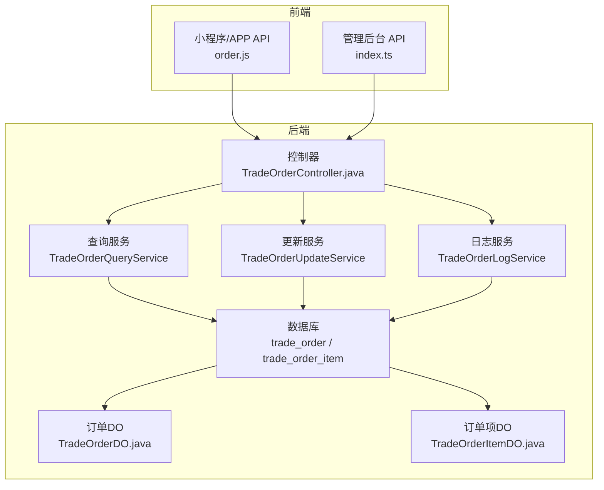
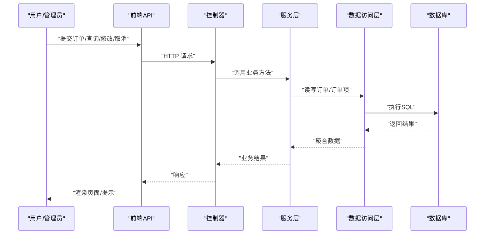
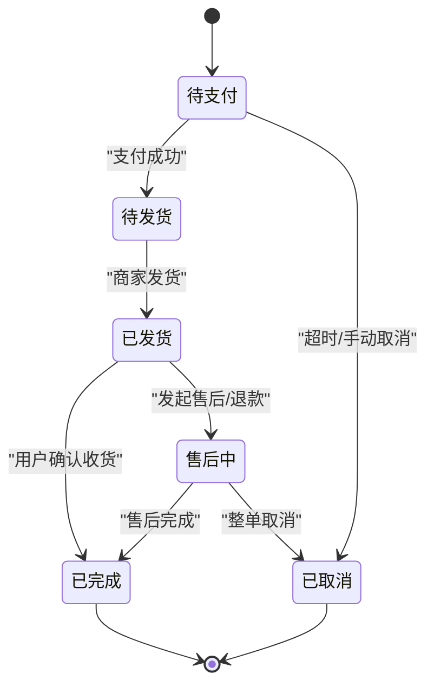
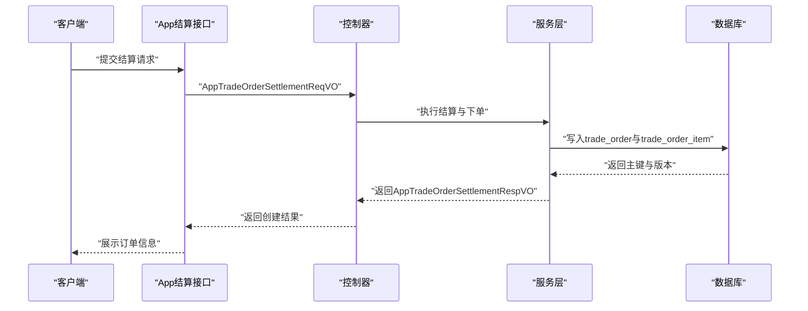
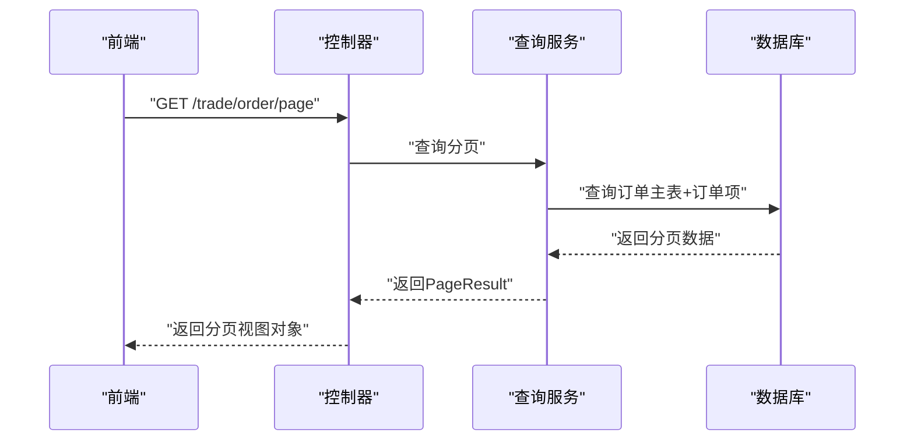
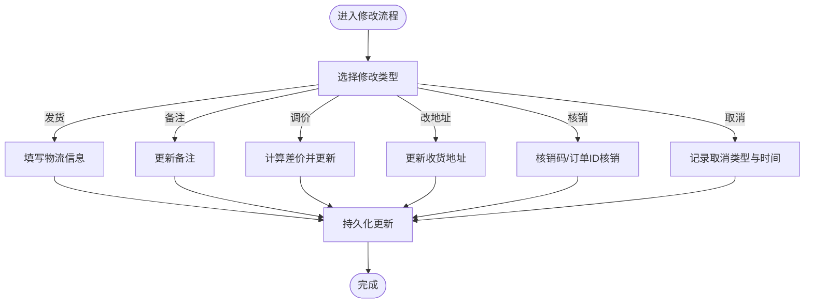
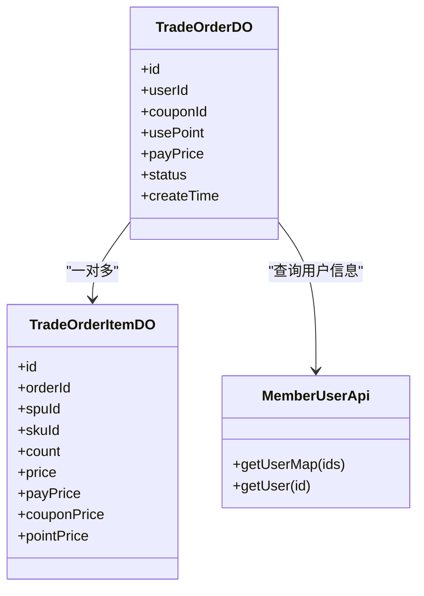
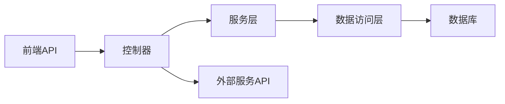

# 订单管理

<cite>
**本文引用的文件**   
- [TradeOrderController.java](file://backend/yudao-module-mall/yudao-module-trade/src/main/java/cn/iocoder/yudao/module/trade/controller/admin/order/TradeOrderController.java)
- [TradeOrderDO.java](file://backend/yudao-module-mall/yudao-module-trade/src/main/java/cn/iocoder/yudao/module/trade/dal/dataobject/order/TradeOrderDO.java)
- [TradeOrderItemDO.java](file://backend/yudao-module-mall/yudao-module-trade/src/main/java/cn/iocoder/yudao/module/trade/dal/dataobject/order/TradeOrderItemDO.java)
- [create_tables.sql](file://backend/yudao-module-mall/yudao-module-trade/src/test/resources/sql/create_tables.sql)
- [order.js](file://frontend/mall-uniapp/sheep/api/trade/order.js)
- [index.ts](file://frontend/admin-vue3/src/api/mall/trade/order/index.ts)
- [ruoyi-vue-pro.sql](file://backend/sql/mysql/ruoyi-vue-pro.sql)
- [product_sku表结构](file://backend/yudao-module-mall/yudao-module-product/src/test/resources/sql/create_tables.sql)
</cite>

## 目录
1. [引言](#引言)
2. [项目结构](#项目结构)
3. [核心组件](#核心组件)
4. [架构总览](#架构总览)
5. [详细组件分析](#详细组件分析)
6. [依赖关系分析](#依赖关系分析)
7. [性能考量](#性能考量)
8. [故障排查指南](#故障排查指南)
9. [结论](#结论)
10. [附录](#附录)

## 引言
本文件面向订单管理模块，系统性阐述订单创建流程、状态管理、查询接口、修改与取消等核心能力，以及订单实体模型、状态机设计、生命周期管理、并发控制与事务一致性保障、性能优化策略。同时覆盖订单与商品SKU、会员信息、优惠券、积分等关联数据的处理逻辑，并提供完整的订单API接口文档与关键流程的时序图与类图。

## 项目结构
订单管理模块位于后端 yudao-module-mall 的 yudao-module-trade 子模块中，采用“控制器-服务-持久层”分层架构；前端包含小程序/APP侧与管理后台两套API封装，分别对应 mall-uniapp 与 admin-vue3 两个前端工程。

图表来源
- [TradeOrderController.java:35-169](file://backend/yudao-module-mall/yudao-module-trade/src/main/java/cn/iocoder/yudao/module/trade/controller/admin/order/TradeOrderController.java#L35-L169)
- [TradeOrderDO.java](file://backend/yudao-module-mall/yudao-module-trade/src/main/java/cn/iocoder/yudao/module/trade/dal/dataobject/order/TradeOrderDO.java)
- [TradeOrderItemDO.java](file://backend/yudao-module-mall/yudao-module-trade/src/main/java/cn/iocoder/yudao/module/trade/dal/dataobject/order/TradeOrderItemDO.java)
- [order.js:93-168](file://frontend/mall-uniapp/sheep/api/trade/order.js#L93-L168)
- [index.ts:1-188](file://frontend/admin-vue3/src/api/mall/trade/order/index.ts#L1-L188)

章节来源
- [TradeOrderController.java:35-169](file://backend/yudao-module-mall/yudao-module-trade/src/main/java/cn/iocoder/yudao/module/trade/controller/admin/order/TradeOrderController.java#L35-L169)

## 核心组件
- 控制器层：提供订单分页、详情、发货、备注、调价、改地址、核销、物流轨迹等REST接口，统一鉴权与权限校验。
- 服务层：封装查询、更新、日志记录等业务逻辑，协调订单主从表与外部服务（会员、营销等）。
- 数据访问层：基于DO映射trade_order与trade_order_item表，支撑订单生命周期与明细管理。
- 前端API：小程序/APP与管理后台分别封装订单相关HTTP请求，统一调用后端接口。

章节来源
- [TradeOrderController.java:52-169](file://backend/yudao-module-mall/yudao-module-trade/src/main/java/cn/iocoder/yudao/module/trade/controller/admin/order/TradeOrderController.java#L52-L169)

## 架构总览
订单管理遵循“高内聚、低耦合”的分层设计，控制器负责接口编排，服务层承担业务规则与事务边界，DAO层专注数据持久化。订单状态机与价格计算在服务层集中实现，前端仅负责参数传递与结果展示。

图表来源
- [TradeOrderController.java:52-169](file://backend/yudao-module-mall/yudao-module-trade/src/main/java/cn/iocoder/yudao/module/trade/controller/admin/order/TradeOrderController.java#L52-L169)

## 详细组件分析

### 订单实体模型与表结构
订单主表与订单项表是订单管理的核心数据结构，分别承载订单整体信息与购买明细。二者通过订单ID建立一对多关系，支持多商品合并下单与售后拆分。

```mermaid
erDiagram
TRADE_ORDER {
bigint id PK
varchar no UK
int type
int terminal
bigint user_id
varchar user_ip
varchar user_remark
int status
int product_count
int cancel_type
varchar remark
boolean comment_status
bigint brokerage_user_id
bit pay_status
datetime pay_time
datetime finish_time
datetime cancel_time
int total_price
int order_price
int discount_price
int delivery_price
int adjust_price
int pay_price
int delivery_type
bigint pay_order_id
varchar pay_channel_code
bigint delivery_template_id
bigint logistics_id
varchar logistics_no
datetime delivery_time
datetime receive_time
varchar receiver_name
varchar receiver_mobile
int receiver_area_id
int receiver_post_code
varchar receiver_detail_address
bigint pick_up_store_id
varchar pick_up_verify_code
int refund_status
int refund_price
int after_sale_status
bigint coupon_id
int coupon_price
int use_point
int point_price
int give_point
int refund_point
int vip_price
varchar give_coupons_map
bigint seckill_activity_id
bigint bargain_activity_id
bigint bargain_record_id
bigint combination_activity_id
bigint combination_head_id
bigint combination_record_id
datetime create_time
datetime update_time
bit deleted
}
TRADE_ORDER_ITEM {
bigint id PK
bigint user_id
bigint order_id FK
int cart_id
bigint spu_id
varchar spu_name
bigint sku_id
varchar properties
varchar pic_url
int count
boolean comment_status
int price
int discount_price
int delivery_price
int adjust_price
int pay_price
int coupon_price
int point_price
int use_point
int give_point
int vip_price
bigint after_sale_id
datetime create_time
datetime update_time
bit deleted
}
TRADE_ORDER ||--o{ TRADE_ORDER_ITEM : "包含"
```

图表来源
- [create_tables.sql:1-89](file://backend/yudao-module-mall/yudao-module-trade/src/test/resources/sql/create_tables.sql#L1-L89)
- [create_tables.sql:66-89](file://backend/yudao-module-mall/yudao-module-trade/src/test/resources/sql/create_tables.sql#L66-L89)

章节来源
- [create_tables.sql:1-89](file://backend/yudao-module-mall/yudao-module-trade/src/test/resources/sql/create_tables.sql#L1-L89)

### 订单状态机设计与生命周期
订单状态贯穿“下单-支付-发货-收货-完成/取消”，并支持售后状态与退款状态联动。状态字典定义了各阶段含义与UI呈现。

图表来源
- [ruoyi-vue-pro.sql:2408-2416](file://backend/sql/mysql/ruoyi-vue-pro.sql#L2408-L2416)

章节来源
- [ruoyi-vue-pro.sql:2408-2416](file://backend/sql/mysql/ruoyi-vue-pro.sql#L2408-L2416)

### 订单创建流程
订单创建涉及购物车/直接购买、价格计算（含优惠券、积分、VIP折扣）、库存锁定、支付单关联、订单生成与日志记录。前端通过结算接口传入用户选择的商品与优惠信息，后端完成原子性落库与状态初始化。

图表来源
- [index.ts:1-188](file://frontend/admin-vue3/src/api/mall/trade/order/index.ts#L1-L188)

### 订单查询接口
- 分页查询：支持按状态、支付渠道、时间范围等筛选，返回订单基础信息与用户信息映射。
- 详情查询：返回订单、订单项、物流轨迹、订单日志、用户信息等聚合数据。
- 统计汇总：返回订单数量、金额等指标。

图表来源
- [TradeOrderController.java:52-71](file://backend/yudao-module-mall/yudao-module-trade/src/main/java/cn/iocoder/yudao/module/trade/controller/admin/order/TradeOrderController.java#L52-L71)

章节来源
- [TradeOrderController.java:52-78](file://backend/yudao-module-mall/yudao-module-trade/src/main/java/cn/iocoder/yudao/module/trade/controller/admin/order/TradeOrderController.java#L52-L78)

### 订单修改与取消
- 发货：填写物流信息并更新订单状态为已发货。
- 备注：支持对订单补充商家备注。
- 调价：支持对订单或订单项进行价格调整。
- 改地址：支持修改收货地址信息。
- 核销：支持按订单ID或核销码进行自提核销。
- 取消：支持整单取消，结合取消类型与时间戳记录。

图表来源
- [TradeOrderController.java:110-167](file://backend/yudao-module-mall/yudao-module-trade/src/main/java/cn/iocoder/yudao/module/trade/controller/admin/order/TradeOrderController.java#L110-L167)

章节来源
- [TradeOrderController.java:110-167](file://backend/yudao-module-mall/yudao-module-trade/src/main/java/cn/iocoder/yudao/module/trade/controller/admin/order/TradeOrderController.java#L110-L167)

### 订单与关联数据处理
- 商品SKU：订单项中记录spu_id/sku_id及属性，用于展示与售后追溯。
- 会员信息：通过MemberUserApi批量查询用户昵称/头像等，提升列表渲染效率。
- 优惠券：记录coupon_id与coupon_price，支持订单级与订单项级优惠。
- 积分：记录use_point、point_price、give_point、refund_point等，配合积分业务类型字典进行记账。

图表来源
- [TradeOrderDO.java](file://backend/yudao-module-mall/yudao-module-trade/src/main/java/cn/iocoder/yudao/module/trade/dal/dataobject/order/TradeOrderDO.java)
- [TradeOrderItemDO.java](file://backend/yudao-module-mall/yudao-module-trade/src/main/java/cn/iocoder/yudao/module/trade/dal/dataobject/order/TradeOrderItemDO.java)
- [TradeOrderController.java:62-69](file://backend/yudao-module-mall/yudao-module-trade/src/main/java/cn/iocoder/yudao/module/trade/controller/admin/order/TradeOrderController.java#L62-L69)

章节来源
- [TradeOrderController.java:62-69](file://backend/yudao-module-mall/yudao-module-trade/src/main/java/cn/iocoder/yudao/module/trade/controller/admin/order/TradeOrderController.java#L62-L69)
- [product_sku表结构:1-23](file://backend/yudao-module-mall/yudao-module-product/src/test/resources/sql/create_tables.sql#L1-L23)

### 订单API接口文档
以下为后端提供的订单相关接口清单（管理后台），参数与返回值均以VO/DTO为准，具体字段见相应VO定义。

- GET /trade/order/page
  - 功能：分页查询订单
  - 权限：trade:order:query
  - 请求参数：参见分页请求VO
  - 返回：分页结果（包含订单项与用户信息映射）

- GET /trade/order/summary
  - 功能：统计订单指标
  - 权限：trade:order:query
  - 请求参数：参见分页请求VO
  - 返回：统计汇总VO

- GET /trade/order/get-detail
  - 功能：获取订单详情
  - 权限：trade:order:query
  - 请求参数：id（订单编号）
  - 返回：订单详情VO（含订单项、日志、用户信息）

- GET /trade/order/get-express-track-list
  - 功能：获取物流轨迹
  - 权限：trade:order:query
  - 请求参数：id（订单编号）
  - 返回：轨迹列表

- PUT /trade/order/delivery
  - 功能：订单发货
  - 权限：trade:order:update
  - 请求体：发货请求VO
  - 返回：布尔值

- PUT /trade/order/update-remark
  - 功能：更新订单备注
  - 权限：trade:order:update
  - 请求体：备注请求VO
  - 返回：布尔值

- PUT /trade/order/update-price
  - 功能：订单调价
  - 权限：trade:order:update
  - 请求体：调价请求VO
  - 返回：布尔值

- PUT /trade/order/update-address
  - 功能：修改收货地址
  - 权限：trade:order:update
  - 请求体：地址请求VO
  - 返回：布尔值

- PUT /trade/order/pick-up-by-id
  - 功能：按订单ID核销
  - 权限：trade:order:pick-up
  - 请求参数：id（订单编号）
  - 返回：布尔值

- PUT /trade/order/pick-up-by-verify-code
  - 功能：按核销码核销
  - 权限：trade:order:pick-up
  - 请求参数：pickUpVerifyCode（核销码）
  - 返回：布尔值

- GET /trade/order/get-by-pick-up-verify-code
  - 功能：根据核销码查询订单
  - 权限：trade:order:query
  - 请求参数：pickUpVerifyCode（核销码）
  - 返回：订单详情VO

章节来源
- [TradeOrderController.java:52-167](file://backend/yudao-module-mall/yudao-module-trade/src/main/java/cn/iocoder/yudao/module/trade/controller/admin/order/TradeOrderController.java#L52-L167)

### 前端调用示例（小程序/APP与管理后台）
- 小程序/APP侧
  - 订单列表：GET /trade/order/page
  - 确认收货：PUT /trade/order/receive
  - 取消订单：DELETE /trade/order/cancel
  - 删除订单：DELETE /trade/order/delete
  - 物流轨迹：GET /trade/order/get-express-track-list
  - 订单数量：GET /trade/order/get-count
  - 创建评论：POST /trade/order/item/create-comment

- 管理后台侧
  - 订单列表：GET /trade/order/page
  - 发货：PUT /trade/order/delivery
  - 备注：PUT /trade/order/update-remark
  - 调价：PUT /trade/order/update-price
  - 改地址：PUT /trade/order/update-address
  - 核销：PUT /trade/order/pick-up-by-id 或 /pick-up-by-verify-code
  - 查询核销码对应订单：GET /trade/order/get-by-pick-up-verify-code

章节来源
- [order.js:93-168](file://frontend/mall-uniapp/sheep/api/trade/order.js#L93-L168)
- [index.ts:1-188](file://frontend/admin-vue3/src/api/mall/trade/order/index.ts#L1-L188)

## 依赖关系分析
- 控制器依赖服务层接口，服务层依赖DAO与外部API（会员、营销等）。
- 订单主表与订单项表通过外键关联，查询时需注意批量加载与缓存。
- 前端通过统一API封装调用后端，避免跨模块耦合。

图表来源
- [TradeOrderController.java:42-50](file://backend/yudao-module-mall/yudao-module-trade/src/main/java/cn/iocoder/yudao/module/trade/controller/admin/order/TradeOrderController.java#L42-L50)

章节来源
- [TradeOrderController.java:42-50](file://backend/yudao-module-mall/yudao-module-trade/src/main/java/cn/iocoder/yudao/module/trade/controller/admin/order/TradeOrderController.java#L42-L50)

## 性能考量
- 批量查询与映射：分页查询时一次性拉取用户ID集合，通过MemberUserApi批量查询用户信息，减少多次RPC调用。
- 订单项预加载：分页场景下提前加载订单项集合，避免N+1查询。
- 字段裁剪与懒加载：详情页按需加载物流轨迹、订单日志等，避免冗余数据传输。
- 索引与分页：对常用过滤字段（如状态、用户ID、创建时间）建立索引，提升分页查询性能。
- 缓存策略：对热点用户信息与SKU信息进行缓存，降低数据库压力。

## 故障排查指南
- 订单状态异常：检查状态字典与业务流转是否一致，核对日志表与事务提交点。
- 发货失败：确认物流信息完整性与模板匹配，检查库存与锁定状态。
- 调价不生效：核对调价规则与事务边界，确保价格字段更新顺序正确。
- 核销失败：验证核销码唯一性与有效期，检查订单状态是否允许核销。
- 前端无数据：确认分页参数与权限，检查批量用户映射是否为空。

章节来源
- [ruoyi-vue-pro.sql:2408-2416](file://backend/sql/mysql/ruoyi-vue-pro.sql#L2408-L2416)

## 结论
订单管理模块通过清晰的分层设计与完善的接口体系，实现了从创建到完结的全生命周期管理。结合状态机、价格计算、优惠券与积分处理，以及并发控制与性能优化策略，能够满足电商场景下的高可用与高性能需求。建议在生产环境中持续完善监控与告警，确保订单数据一致性与用户体验。

## 附录
- 订单状态字典参考：待支付、待发货、已发货、已完成、已取消等。
- 积分业务类型字典参考：订单积分抵扣、奖励等。
- SKU表结构参考：spu_id、properties、price、stock等字段。

章节来源
- [ruoyi-vue-pro.sql:2408-2416](file://backend/sql/mysql/ruoyi-vue-pro.sql#L2408-L2416)
- [ruoyi-vue-pro.sql:997-1000](file://backend/sql/mysql/ruoyi-vue-pro.sql#L997-L1000)
- [product_sku表结构:1-23](file://backend/yudao-module-mall/yudao-module-product/src/test/resources/sql/create_tables.sql#L1-L23)