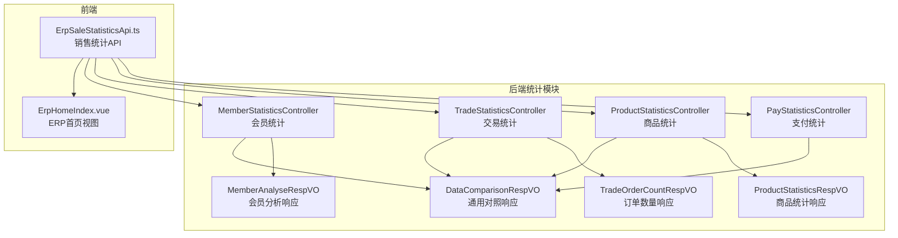
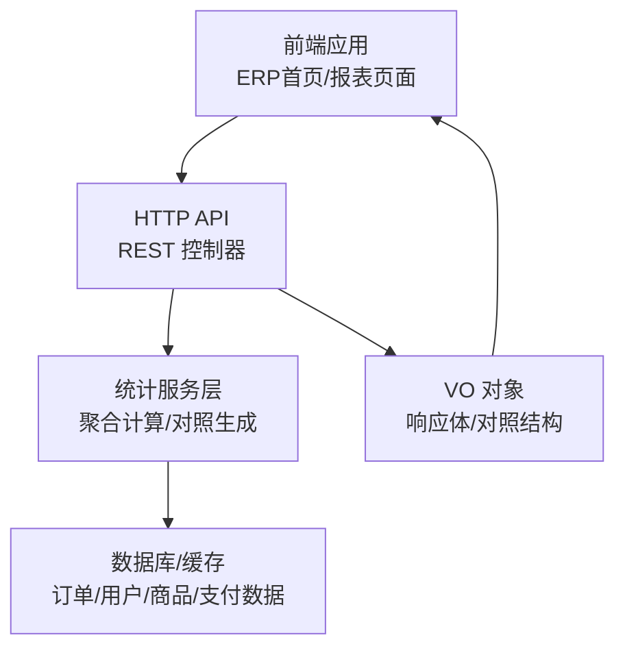
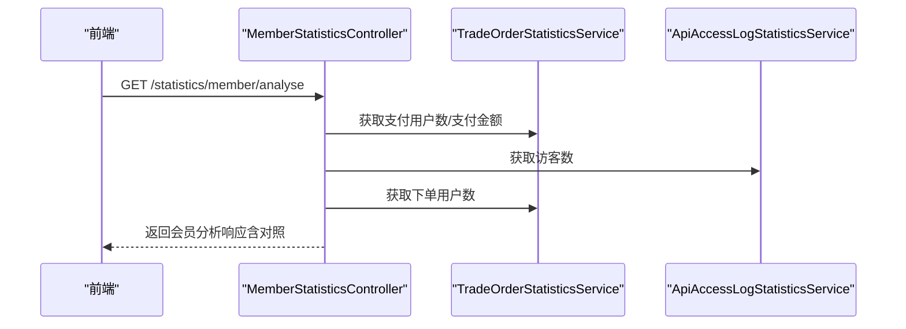
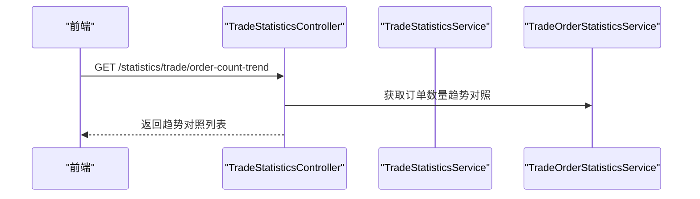
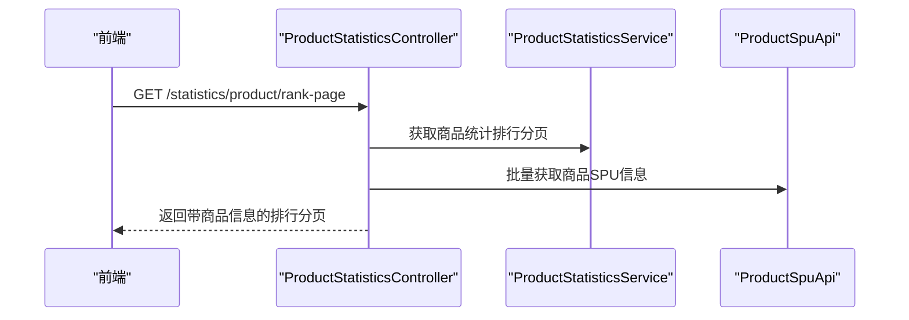
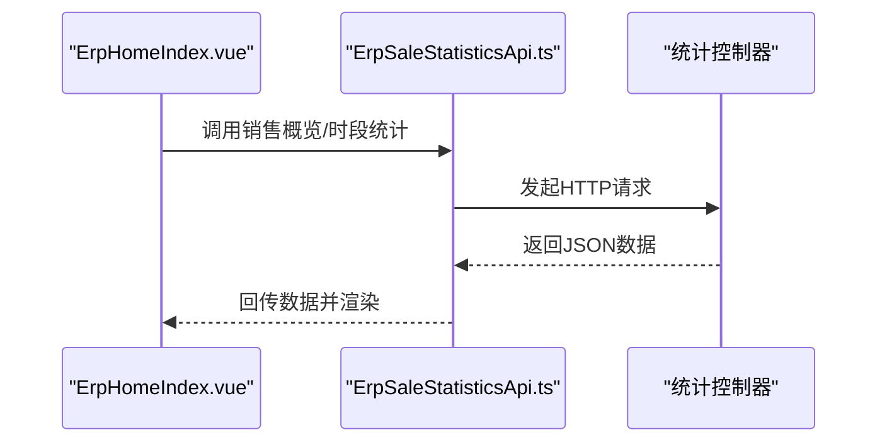
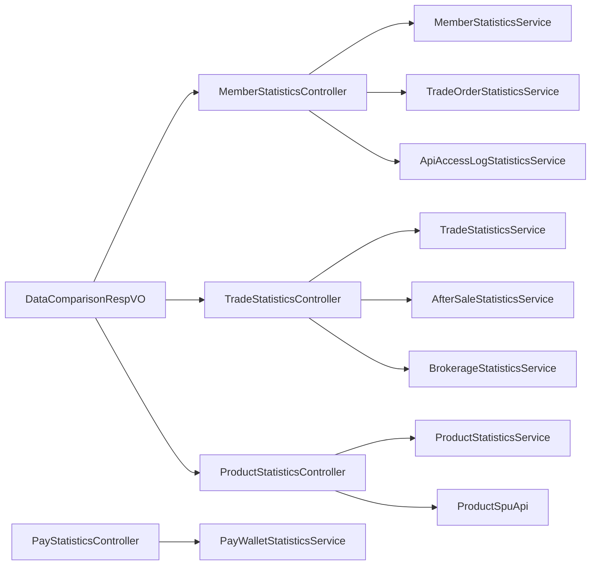

# 订单统计分析

<cite>
**本文引用的文件**
- [MemberStatisticsController.java](file://backend/yudao-module-mall/yudao-module-statistics/src/main/java/cn/iocoder/yudao/module/statistics/controller/admin/member/MemberStatisticsController.java)
- [TradeStatisticsController.java](file://backend/yudao-module-mall/yudao-module-statistics/src/main/java/cn/iocoder/yudao/module/statistics/controller/admin/trade/TradeStatisticsController.java)
- [ProductStatisticsController.java](file://backend/yudao-module-mall/yudao-module-statistics/src/main/java/cn/iocoder/yudao/module/statistics/controller/admin/product/ProductStatisticsController.java)
- [PayStatisticsController.java](file://backend/yudao-module-mall/yudao-module-statistics/src/main/java/cn/iocoder/yudao/module/statistics/controller/admin/pay/PayStatisticsController.java)
- [DataComparisonRespVO.java](file://backend/yudao-module-mall/yudao-module-statistics/src/main/java/cn/iocoder/yudao/module/statistics/controller/admin/common/vo/DataComparisonRespVO.java)
- [MemberAnalyseRespVO.java](file://backend/yudao-module-mall/yudao-module-statistics/src/main/java/cn/iocoder/yudao/module/statistics/controller/admin/member/vo/MemberAnalyseRespVO.java)
- [TradeOrderCountRespVO.java](file://backend/yudao-module-mall/yudao-module-statistics/src/main/java/cn/iocoder/yudao/module/statistics/controller/admin/trade/vo/TradeOrderCountRespVO.java)
- [ProductStatisticsRespVO.java](file://backend/yudao-module-mall/yudao-module-statistics/src/main/java/cn/iocoder/yudao/module/statistics/controller/admin/product/vo/ProductStatisticsRespVO.java)
- [ErpSaleStatisticsApi.ts](file://frontend/admin-vue3/src/api/erp/statistics/sale/index.ts)
- [ErpHomeIndex.vue](file://frontend/admin-vue3/src/views/erp/home/index.vue)
</cite>

## 目录
1. [简介](#简介)
2. [项目结构](#项目结构)
3. [核心组件](#核心组件)
4. [架构总览](#架构总览)
5. [详细组件分析](#详细组件分析)
6. [依赖分析](#依赖分析)
7. [性能考虑](#性能考虑)
8. [故障排查指南](#故障排查指南)
9. [结论](#结论)
10. [附录](#附录)

## 简介
本模块聚焦于订单统计分析、销售分析报表与用户行为分析，提供多维度的统计能力，包括但不限于：
- 订单金额与数量统计
- 时间维度分析（日、月、同比/环比）
- 维度钻取（按地区、性别、终端、商品等）
- 用户行为分析（访客、下单、支付、客单价、转化率、复购率等）
- 实时统计与历史趋势
- 统计API接口与前端展示

模块通过“控制器-服务-数据对象”的分层设计，结合通用对照响应体，形成统一的统计输出格式，便于前端进行可视化与报表集成。

## 项目结构
统计模块位于后端 yudao-module-mall 子模块下的 statistics 包中，采用按业务域划分的控制器层组织方式：
- admin/member：会员统计与用户行为分析
- admin/trade：交易统计与订单趋势
- admin/product：商品统计与排行榜
- admin/pay：支付统计（钱包充值）
- admin/common/vo：通用统计响应体（含对照数据）

前端在 admin-vue3 中提供 ERP 首页的销售/采购统计卡片与时段图表，并通过 API 文件定义接口契约。

**图表来源**
- [MemberStatisticsController.java:30-115](file://backend/yudao-module-mall/yudao-module-statistics/src/main/java/cn/iocoder/yudao/module/statistics/controller/admin/member/MemberStatisticsController.java#L30-L115)
- [TradeStatisticsController.java:36-131](file://backend/yudao-module-mall/yudao-module-statistics/src/main/java/cn/iocoder/yudao/module/statistics/controller/admin/trade/TradeStatisticsController.java#L36-L131)
- [ProductStatisticsController.java:36-87](file://backend/yudao-module-mall/yudao-module-statistics/src/main/java/cn/iocoder/yudao/module/statistics/controller/admin/product/ProductStatisticsController.java#L36-L87)
- [PayStatisticsController.java:19-37](file://backend/yudao-module-mall/yudao-module-statistics/src/main/java/cn/iocoder/yudao/module/statistics/controller/admin/pay/PayStatisticsController.java#L19-L37)
- [DataComparisonRespVO.java:8-21](file://backend/yudao-module-mall/yudao-module-statistics/src/main/java/cn/iocoder/yudao/module/statistics/controller/admin/common/vo/DataComparisonRespVO.java#L8-L21)
- [MemberAnalyseRespVO.java:7-27](file://backend/yudao-module-mall/yudao-module-statistics/src/main/java/cn/iocoder/yudao/module/statistics/controller/admin/member/vo/MemberAnalyseRespVO.java#L7-L27)
- [TradeOrderCountRespVO.java:6-23](file://backend/yudao-module-mall/yudao-module-statistics/src/main/java/cn/iocoder/yudao/module/statistics/controller/admin/trade/vo/TradeOrderCountRespVO.java#L6-L23)
- [ProductStatisticsRespVO.java:13-82](file://backend/yudao-module-mall/yudao-module-statistics/src/main/java/cn/iocoder/yudao/module/statistics/controller/admin/product/vo/ProductStatisticsRespVO.java#L13-L82)
- [ErpSaleStatisticsApi.ts:18-28](file://frontend/admin-vue3/src/api/erp/statistics/sale/index.ts#L18-L28)
- [ErpHomeIndex.vue:45-86](file://frontend/admin-vue3/src/views/erp/home/index.vue#L45-L86)

**章节来源**
- [MemberStatisticsController.java:28-115](file://backend/yudao-module-mall/yudao-module-statistics/src/main/java/cn/iocoder/yudao/module/statistics/controller/admin/member/MemberStatisticsController.java#L28-L115)
- [TradeStatisticsController.java:36-131](file://backend/yudao-module-mall/yudao-module-statistics/src/main/java/cn/iocoder/yudao/module/statistics/controller/admin/trade/TradeStatisticsController.java#L36-L131)
- [ProductStatisticsController.java:36-87](file://backend/yudao-module-mall/yudao-module-statistics/src/main/java/cn/iocoder/yudao/module/statistics/controller/admin/product/ProductStatisticsController.java#L36-L87)
- [PayStatisticsController.java:19-37](file://backend/yudao-module-mall/yudao-module-statistics/src/main/java/cn/iocoder/yudao/module/statistics/controller/admin/pay/PayStatisticsController.java#L19-L37)
- [ErpSaleStatisticsApi.ts:1-28](file://frontend/admin-vue3/src/api/erp/statistics/sale/index.ts#L1-L28)
- [ErpHomeIndex.vue:27-93](file://frontend/admin-vue3/src/views/erp/home/index.vue#L27-L93)

## 核心组件
- 通用对照响应体 DataComparisonRespVO：封装“当前值”与“参照值”，用于对比分析（如昨日 vs 前日、本月 vs 上月）。
- 会员统计控制器 MemberStatisticsController：提供会员概览、用户行为分析（访客、下单、支付、客单价、转化率对照）、区域/性别/终端分布、用户数量对照与注册趋势。
- 交易统计控制器 TradeStatisticsController：提供交易概览（含对照）、交易趋势明细、订单数量与趋势、订单状态对照、导出Excel。
- 商品统计控制器 ProductStatisticsController：提供商品分析（日期维度）、明细列表、排行榜分页（联动商品信息）、导出Excel。
- 支付统计控制器 PayStatisticsController：提供钱包充值金额汇总。
- 前端销售统计API ErpSaleStatisticsApi.ts 与首页视图 ErpHomeIndex.vue：负责调用后端接口并渲染销售/采购概览与时段统计。

**章节来源**
- [DataComparisonRespVO.java:8-21](file://backend/yudao-module-mall/yudao-module-statistics/src/main/java/cn/iocoder/yudao/module/statistics/controller/admin/common/vo/DataComparisonRespVO.java#L8-L21)
- [MemberAnalyseRespVO.java:7-27](file://backend/yudao-module-mall/yudao-module-statistics/src/main/java/cn/iocoder/yudao/module/statistics/controller/admin/member/vo/MemberAnalyseRespVO.java#L7-L27)
- [TradeOrderCountRespVO.java:6-23](file://backend/yudao-module-mall/yudao-module-statistics/src/main/java/cn/iocoder/yudao/module/statistics/controller/admin/trade/vo/TradeOrderCountRespVO.java#L6-L23)
- [ProductStatisticsRespVO.java:13-82](file://backend/yudao-module-mall/yudao-module-statistics/src/main/java/cn/iocoder/yudao/module/statistics/controller/admin/product/vo/ProductStatisticsRespVO.java#L13-L82)
- [MemberStatisticsController.java:42-112](file://backend/yudao-module-mall/yudao-module-statistics/src/main/java/cn/iocoder/yudao/module/statistics/controller/admin/member/MemberStatisticsController.java#L42-L112)
- [TradeStatisticsController.java:52-128](file://backend/yudao-module-mall/yudao-module-statistics/src/main/java/cn/iocoder/yudao/module/statistics/controller/admin/trade/TradeStatisticsController.java#L52-L128)
- [ProductStatisticsController.java:48-85](file://backend/yudao-module-mall/yudao-module-statistics/src/main/java/cn/iocoder/yudao/module/statistics/controller/admin/product/ProductStatisticsController.java#L48-L85)
- [PayStatisticsController.java:29-34](file://backend/yudao-module-mall/yudao-module-statistics/src/main/java/cn/iocoder/yudao/module/statistics/controller/admin/pay/PayStatisticsController.java#L29-L34)
- [ErpSaleStatisticsApi.ts:18-28](file://frontend/admin-vue3/src/api/erp/statistics/sale/index.ts#L18-L28)
- [ErpHomeIndex.vue:45-86](file://frontend/admin-vue3/src/views/erp/home/index.vue#L45-L86)

## 架构总览
统计模块遵循“控制器-服务-DAO/BO”的分层架构，控制器负责请求参数解析与权限控制，服务层执行聚合计算与跨表关联，DAO/BO承载数据模型与查询结果。通用对照响应体贯穿各控制器，保证前后端一致的对比数据结构。

[此图为概念性架构示意，不直接映射具体源码文件，故不提供图表来源]

## 详细组件分析

### 会员统计分析
- 接口能力
  - 会员概览：实时统计会员相关指标
  - 会员分析：访客、下单、支付用户数，客单价，转化率对照
  - 地区/性别/终端分布：按维度统计会员数量
  - 用户数量对照：用户总量趋势对照
  - 注册趋势：指定时间范围内的注册人数列表
- 关键指标
  - 客单价 ATV = 支付金额 / 支付用户数
  - 转化率（访客到支付）= 支付用户数 / 访客数
  - 复购率：可基于服务层对“多次购买用户”的统计口径扩展
- 数据来源与耦合
  - 会员分析依赖交易统计服务（支付金额/支付用户数/下单用户数）与访问日志统计服务（访客数）

**图表来源**
- [MemberStatisticsController.java:49-75](file://backend/yudao-module-mall/yudao-module-statistics/src/main/java/cn/iocoder/yudao/module/statistics/controller/admin/member/MemberStatisticsController.java#L49-L75)

**章节来源**
- [MemberStatisticsController.java:42-112](file://backend/yudao-module-mall/yudao-module-statistics/src/main/java/cn/iocoder/yudao/module/statistics/controller/admin/member/MemberStatisticsController.java#L42-L112)
- [MemberAnalyseRespVO.java:7-27](file://backend/yudao-module-mall/yudao-module-statistics/src/main/java/cn/iocoder/yudao/module/statistics/controller/admin/member/vo/MemberAnalyseRespVO.java#L7-L27)

### 交易统计分析
- 接口能力
  - 交易概览：按日/月维度生成对照（昨日 vs 前日、本月 vs 上月）
  - 交易趋势：指定时间范围的趋势明细
  - 订单数量：待发货、待核销、售后申请、提现待审等状态汇总
  - 订单趋势：按周期统计订单数量对照
  - 导出Excel：将明细导出为表格
- 关键指标
  - 订单数量趋势：支持按日/周/月等周期聚合
  - 订单状态对照：对比不同状态的数量变化
- 数据来源与耦合
  - 依赖交易统计服务与售后、佣金提现服务

**图表来源**
- [TradeStatisticsController.java:122-128](file://backend/yudao-module-mall/yudao-module-statistics/src/main/java/cn/iocoder/yudao/module/statistics/controller/admin/trade/TradeStatisticsController.java#L122-L128)

**章节来源**
- [TradeStatisticsController.java:52-128](file://backend/yudao-module-mall/yudao-module-statistics/src/main/java/cn/iocoder/yudao/module/statistics/controller/admin/trade/TradeStatisticsController.java#L52-L128)
- [TradeOrderCountRespVO.java:6-23](file://backend/yudao-module-mall/yudao-module-statistics/src/main/java/cn/iocoder/yudao/module/statistics/controller/admin/trade/vo/TradeOrderCountRespVO.java#L6-L23)

### 商品统计分析
- 接口能力
  - 商品分析：按日期维度的浏览、访客、收藏、加购、下单、支付、退款等指标
  - 明细列表：日期维度的商品统计明细
  - 排行榜分页：按支付件数/金额等维度的商品排行，联动商品名称与图片
  - 导出Excel：导出商品统计明细
- 关键指标
  - 访客支付转化率 = 支付访客数 / 浏览访客数 × 100%
  - 支付件数、支付金额、退款件数与退款金额
- 数据来源与耦合
  - 依赖商品统计服务与商品API以补充商品基础信息

**图表来源**
- [ProductStatisticsController.java:73-85](file://backend/yudao-module-mall/yudao-module-statistics/src/main/java/cn/iocoder/yudao/module/statistics/controller/admin/product/ProductStatisticsController.java#L73-L85)

**章节来源**
- [ProductStatisticsController.java:48-85](file://backend/yudao-module-mall/yudao-module-statistics/src/main/java/cn/iocoder/yudao/module/statistics/controller/admin/product/ProductStatisticsController.java#L48-L85)
- [ProductStatisticsRespVO.java:13-82](file://backend/yudao-module-mall/yudao-module-statistics/src/main/java/cn/iocoder/yudao/module/statistics/controller/admin/product/vo/ProductStatisticsRespVO.java#L13-L82)

### 支付统计分析
- 接口能力
  - 充值金额汇总：钱包充值金额总览
- 数据来源与耦合
  - 依赖钱包充值统计服务

**章节来源**
- [PayStatisticsController.java:29-34](file://backend/yudao-module-mall/yudao-module-statistics/src/main/java/cn/iocoder/yudao/module/statistics/controller/admin/pay/PayStatisticsController.java#L29-L34)

### 前端统计API与展示
- 前端销售统计API
  - 提供销售概览与销售时段统计两个接口，返回今日/昨日/本月/本年金额与时间序列
- 前端首页视图
  - 在 ERP 首页加载销售与采购的概览卡片与时段图表，使用异步并发请求提升加载体验

**图表来源**
- [ErpHomeIndex.vue:64-85](file://frontend/admin-vue3/src/views/erp/home/index.vue#L64-L85)
- [ErpSaleStatisticsApi.ts:18-28](file://frontend/admin-vue3/src/api/erp/statistics/sale/index.ts#L18-L28)

**章节来源**
- [ErpHomeIndex.vue:45-86](file://frontend/admin-vue3/src/views/erp/home/index.vue#L45-L86)
- [ErpSaleStatisticsApi.ts:1-28](file://frontend/admin-vue3/src/api/erp/statistics/sale/index.ts#L1-L28)

## 依赖分析
- 控制器到服务层：各控制器通过资源注入的方式依赖对应的服务层接口，实现关注点分离与可测试性
- 服务层到DAO/BO：服务层负责聚合计算与跨表关联，返回领域对象或VO
- 通用VO：DataComparisonRespVO 作为跨域统一对照结构，降低前后端对接成本
- 前后端契约：前端API文件定义了接口路径与返回类型，确保前后端一致

**图表来源**
- [MemberStatisticsController.java:35-40](file://backend/yudao-module-mall/yudao-module-statistics/src/main/java/cn/iocoder/yudao/module/statistics/controller/admin/member/MemberStatisticsController.java#L35-L40)
- [TradeStatisticsController.java:43-50](file://backend/yudao-module-mall/yudao-module-statistics/src/main/java/cn/iocoder/yudao/module/statistics/controller/admin/trade/TradeStatisticsController.java#L43-L50)
- [ProductStatisticsController.java:42-46](file://backend/yudao-module-mall/yudao-module-statistics/src/main/java/cn/iocoder/yudao/module/statistics/controller/admin/product/ProductStatisticsController.java#L42-L46)
- [PayStatisticsController.java:26-27](file://backend/yudao-module-mall/yudao-module-statistics/src/main/java/cn/iocoder/yudao/module/statistics/controller/admin/pay/PayStatisticsController.java#L26-L27)
- [DataComparisonRespVO.java:8-21](file://backend/yudao-module-mall/yudao-module-statistics/src/main/java/cn/iocoder/yudao/module/statistics/controller/admin/common/vo/DataComparisonRespVO.java#L8-L21)

**章节来源**
- [MemberStatisticsController.java:35-40](file://backend/yudao-module-mall/yudao-module-statistics/src/main/java/cn/iocoder/yudao/module/statistics/controller/admin/member/MemberStatisticsController.java#L35-L40)
- [TradeStatisticsController.java:43-50](file://backend/yudao-module-mall/yudao-module-statistics/src/main/java/cn/iocoder/yudao/module/statistics/controller/admin/trade/TradeStatisticsController.java#L43-L50)
- [ProductStatisticsController.java:42-46](file://backend/yudao-module-mall/yudao-module-statistics/src/main/java/cn/iocoder/yudao/module/statistics/controller/admin/product/ProductStatisticsController.java#L42-L46)
- [PayStatisticsController.java:26-27](file://backend/yudao-module-mall/yudao-module-statistics/src/main/java/cn/iocoder/yudao/module/statistics/controller/admin/pay/PayStatisticsController.java#L26-L27)

## 性能考虑
- 大数据量处理
  - 使用分页接口（如商品排行榜分页）避免一次性拉取海量数据
  - 时间范围查询应限制最大跨度，防止超大窗口导致的查询压力
- 缓存策略
  - 对高频查询的概览数据（如今日/昨日/本月汇总）可引入Redis缓存，设置合理过期时间
  - 对商品信息（SPU）可做本地缓存，减少重复RPC调用
- 实时统计
  - 通过定时任务或消息驱动更新统计缓存，保证实时性与一致性
- 导出性能
  - 导出接口建议异步化，前端轮询或服务端回调通知下载链接

[本节为通用性能建议，不直接分析具体文件，故不提供章节来源]

## 故障排查指南
- 接口鉴权失败
  - 确认调用接口是否具备相应权限（如“statistics:member:query”、“statistics:trade:export”等）
- 时间参数异常
  - 确保前端传递的时间数组顺序正确（开始时间在前），后端已使用数组取值逻辑处理
- 数据为空或为零
  - 检查统计服务的聚合口径与过滤条件，确认数据库中是否存在目标时间范围内的记录
- 前端渲染异常
  - 检查API返回字段与前端类型定义是否一致，特别是金额单位（分）与日期格式

**章节来源**
- [MemberStatisticsController.java:42-47](file://backend/yudao-module-mall/yudao-module-statistics/src/main/java/cn/iocoder/yudao/module/statistics/controller/admin/member/MemberStatisticsController.java#L42-L47)
- [TradeStatisticsController.java:86-96](file://backend/yudao-module-mall/yudao-module-statistics/src/main/java/cn/iocoder/yudao/module/statistics/controller/admin/trade/TradeStatisticsController.java#L86-L96)
- [ProductStatisticsController.java:63-71](file://backend/yudao-module-mall/yudao-module-statistics/src/main/java/cn/iocoder/yudao/module/statistics/controller/admin/product/ProductStatisticsController.java#L63-L71)

## 结论
本模块通过清晰的分层设计与统一的对照响应结构，实现了从订单、商品到会员的多维统计分析能力。配合前端的概览与趋势展示，能够满足日常运营与决策所需的统计需求。后续可在缓存、异步导出、指标口径标准化等方面持续优化，进一步提升性能与可维护性。

## 附录

### 统计API接口清单（后端）
- 会员统计
  - GET /statistics/member/summary：会员概览（实时统计）
  - GET /statistics/member/analyse：会员分析（访客、下单、支付、ATV、转化率对照）
  - GET /statistics/member/area-statistics-list：按省份统计列表
  - GET /statistics/member/sex-statistics-list：按性别统计列表
  - GET /statistics/member/terminal-statistics-list：按终端统计列表
  - GET /statistics/member/user-count-comparison：用户数量对照
  - GET /statistics/member/register-count-list：注册数量列表
- 交易统计
  - GET /statistics/trade/summary：交易概览（含对照）
  - GET /statistics/trade/analyse：交易状况统计
  - GET /statistics/trade/list：交易状况明细
  - GET /statistics/trade/export-excel：导出交易状况明细Excel
  - GET /statistics/trade/order-count：订单数量汇总
  - GET /statistics/trade/order-comparison：订单数量对照
  - GET /statistics/trade/order-count-trend：订单量趋势统计
- 商品统计
  - GET /statistics/product/analyse：商品统计分析（日期维度）
  - GET /statistics/product/list：商品统计明细（日期维度）
  - GET /statistics/product/export-excel：导出商品统计明细Excel
  - GET /statistics/product/rank-page：商品统计排行榜分页
- 支付统计
  - GET /statistics/pay/summary：钱包充值金额汇总

**章节来源**
- [MemberStatisticsController.java:42-112](file://backend/yudao-module-mall/yudao-module-statistics/src/main/java/cn/iocoder/yudao/module/statistics/controller/admin/member/MemberStatisticsController.java#L42-L112)
- [TradeStatisticsController.java:52-128](file://backend/yudao-module-mall/yudao-module-statistics/src/main/java/cn/iocoder/yudao/module/statistics/controller/admin/trade/TradeStatisticsController.java#L52-L128)
- [ProductStatisticsController.java:48-85](file://backend/yudao-module-mall/yudao-module-statistics/src/main/java/cn/iocoder/yudao/module/statistics/controller/admin/product/ProductStatisticsController.java#L48-L85)
- [PayStatisticsController.java:29-34](file://backend/yudao-module-mall/yudao-module-statistics/src/main/java/cn/iocoder/yudao/module/statistics/controller/admin/pay/PayStatisticsController.java#L29-L34)

### 关键统计指标说明
- 订单金额统计
  - 支付金额：由交易统计服务按订单状态与时间范围聚合
- 订单数量统计
  - 支付件数、下单件数、退款件数：分别对应支付/下单/售后流程节点
- 转化率分析
  - 访客支付转化率 = 支付访客数 / 浏览访客数 × 100%
  - 订单分析中的“访客 → 下单 → 支付”漏斗可通过服务层统一口径实现
- 复购率分析
  - 可基于“支付用户数”与“重复支付用户数”的比值计算，需在服务层扩展相应统计口径

**章节来源**
- [MemberAnalyseRespVO.java:7-27](file://backend/yudao-module-mall/yudao-module-statistics/src/main/java/cn/iocoder/yudao/module/statistics/controller/admin/member/vo/MemberAnalyseRespVO.java#L7-L27)
- [ProductStatisticsRespVO.java:78-81](file://backend/yudao-module-mall/yudao-module-statistics/src/main/java/cn/iocoder/yudao/module/statistics/controller/admin/product/vo/ProductStatisticsRespVO.java#L78-L81)
- [MemberStatisticsController.java:56-74](file://backend/yudao-module-mall/yudao-module-statistics/src/main/java/cn/iocoder/yudao/module/statistics/controller/admin/member/MemberStatisticsController.java#L56-L74)