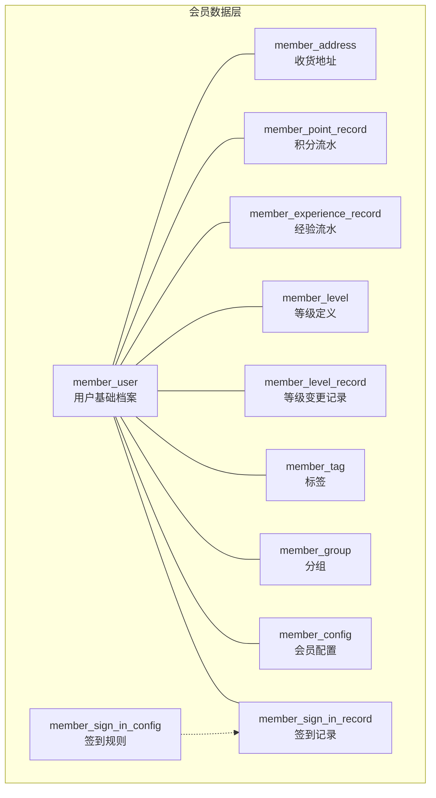
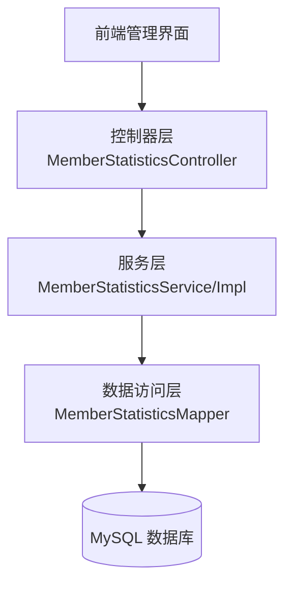
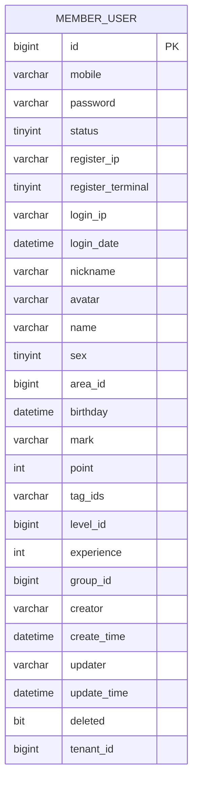
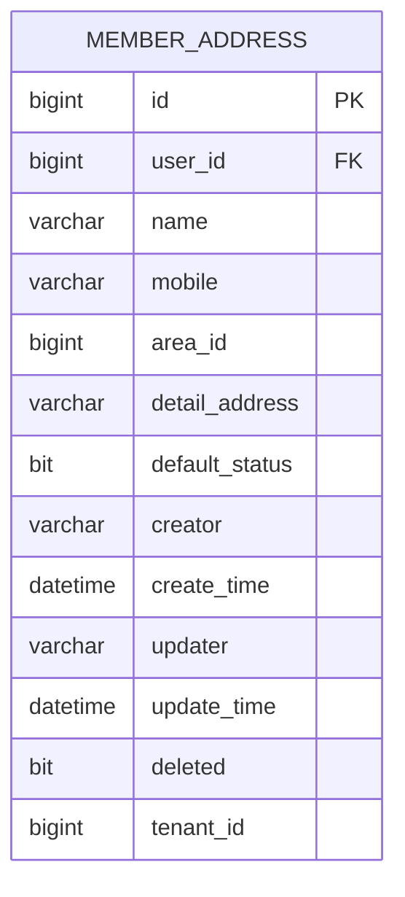
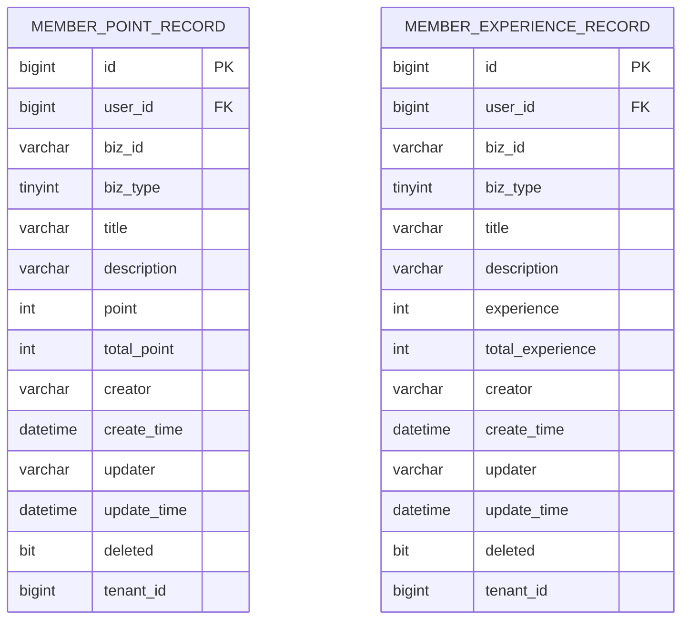
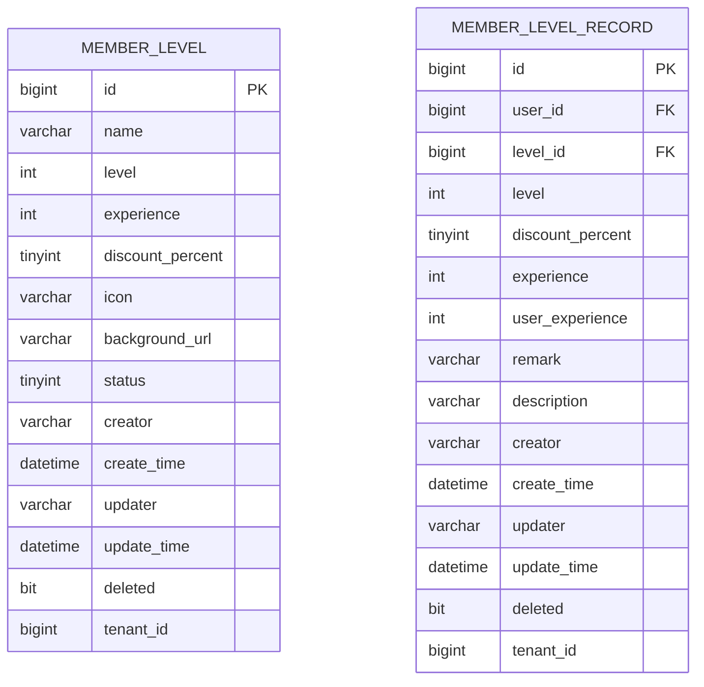
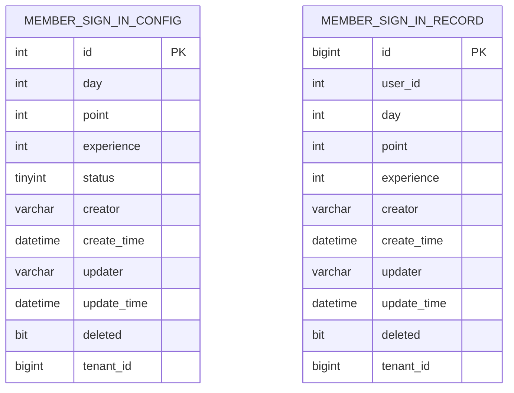
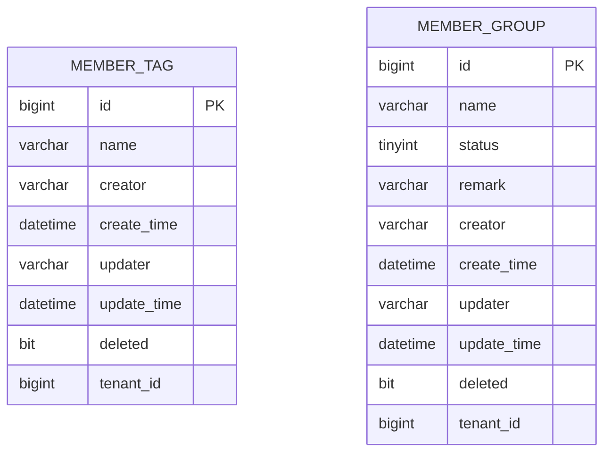
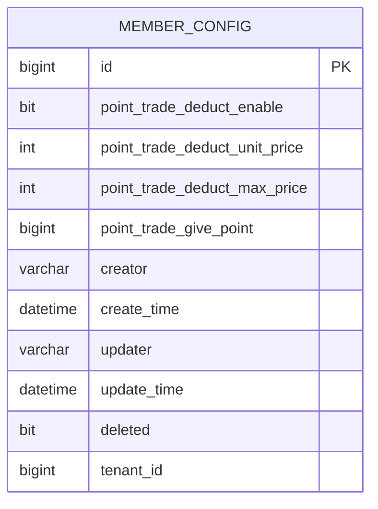
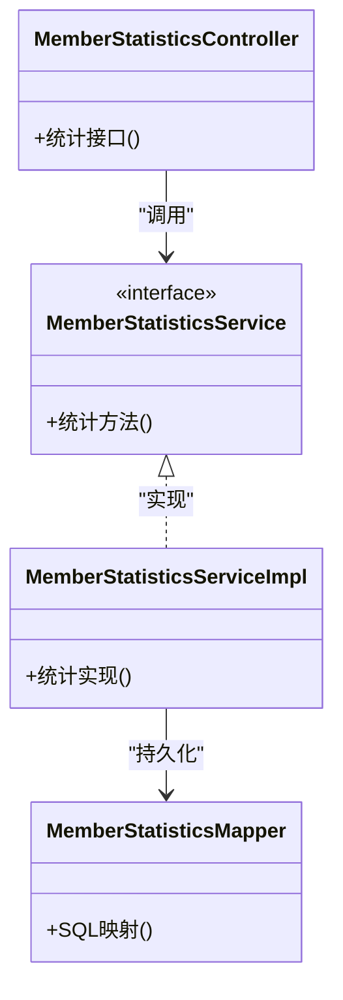

# 会员档案管理

<cite>
**本文引用的文件**
- [member-2024-01-18.sql](file://backend/sql/module/member-2024-01-18.sql)
- [MemberStatisticsController.java](file://backend/yudao-module-mall/yudao-module-statistics/src/main/java/cn/iocoder/yudao/module/statistics/controller/admin/member/MemberStatisticsController.java)
- [MemberStatisticsMapper.java](file://backend/yudao-module-mall/yudao-module-statistics/src/main/java/cn/iocoder/yudao/module/statistics/dal/mysql/member/MemberStatisticsMapper.java)
- [MemberStatisticsService.java](file://backend/yudao-module-mall/yudao-module-statistics/src/main/java/cn/iocoder/yudao/module/statistics/service/member/MemberStatisticsService.java)
- [MemberStatisticsServiceImpl.java](file://backend/yudao-module-mall/yudao-module-statistics/src/main/java/cn/iocoder/yudao/module/statistics/service/member/MemberStatisticsServiceImpl.java)
- [MemberUserRespVO.java](file://backend/yudao-module-mall/yudao-module-trade/src/main/java/cn/iocoder/yudao/module/trade/controller/admin/base/member/user/MemberUserRespVO.java)
</cite>

## 目录
1. [简介](#简介)
2. [项目结构](#项目结构)
3. [核心组件](#核心组件)
4. [架构总览](#架构总览)
5. [详细组件分析](#详细组件分析)
6. [依赖关系分析](#依赖关系分析)
7. [性能考量](#性能考量)
8. [故障排查指南](#故障排查指南)
9. [结论](#结论)
10. [附录](#附录)

## 简介
本文件面向“会员档案管理”主题，基于仓库中现有的会员相关数据表与统计模块，系统化梳理会员档案的字段设计、数据验证规则、档案历史记录、权限控制、头像管理、联系方式维护、地址簿管理、偏好设置等能力边界与实现要点。文档同时提供接口与数据模型说明，以及安全与隐私保护建议，帮助开发者在现有基础上扩展或实现安全可靠的会员档案管理系统。

## 项目结构
会员档案相关的核心数据模型集中在数据库脚本中，包含用户基础信息、地址簿、积分与经验流水、等级与等级记录、签到配置与记录、标签、分组、配置等表。统计模块提供了会员维度的数据聚合与查询能力，便于在后台管理端进行运营分析。

图表来源
- [member-2024-01-18.sql:298-339](file://backend/sql/module/member-2024-01-18.sql#L298-L339)
- [member-2024-01-18.sql:21-40](file://backend/sql/module/member-2024-01-18.sql#L21-L40)
- [member-2024-01-18.sql:191-221](file://backend/sql/module/member-2024-01-18.sql#L191-L221)
- [member-2024-01-18.sql:75-105](file://backend/sql/module/member-2024-01-18.sql#L75-L105)
- [member-2024-01-18.sql:131-159](file://backend/sql/module/member-2024-01-18.sql#L131-L159)
- [member-2024-01-18.sql:160-183](file://backend/sql/module/member-2024-01-18.sql#L160-L183)
- [member-2024-01-18.sql:222-247](file://backend/sql/module/member-2024-01-18.sql#L222-L247)
- [member-2024-01-18.sql:248-273](file://backend/sql/module/member-2024-01-18.sql#L248-L273)
- [member-2024-01-18.sql:274-296](file://backend/sql/module/member-2024-01-18.sql#L274-L296)
- [member-2024-01-18.sql:106-130](file://backend/sql/module/member-2024-01-18.sql#L106-L130)
- [member-2024-01-18.sql:49-74](file://backend/sql/module/member-2024-01-18.sql#L49-L74)

章节来源
- [member-2024-01-18.sql:1-339](file://backend/sql/module/member-2024-01-18.sql#L1-L339)

## 核心组件
- 用户档案（member_user）
  - 字段覆盖手机号、密码、状态、注册与登录信息、昵称、头像、姓名、性别、地区、生日、备注、积分、标签、等级、经验、分组等。
  - 关系：与地址簿、积分/经验流水、等级记录、标签、分组、配置等存在一对多或多对多关联。
- 地址簿（member_address）
  - 收件人、手机号、地区编码、详细地址、默认状态；支持多地址与默认地址切换。
- 积分与经验流水（member_point_record、member_experience_record）
  - 记录业务类型、标题、描述、变动数值及累计值，支撑运营对账与审计。
- 等级体系（member_level、member_level_record）
  - 等级定义与变更记录，支持按经验值升降级。
- 签到体系（member_sign_in_config、member_sign_in_record）
  - 规则配置与签到记录，支持连续签到奖励。
- 标签与分组（member_tag、member_group）
  - 用户打标与分组，便于运营筛选与营销。
- 会员配置（member_config）
  - 积分抵扣开关、单价、上限、充值送积分等策略配置。

章节来源
- [member-2024-01-18.sql:298-339](file://backend/sql/module/member-2024-01-18.sql#L298-L339)
- [member-2024-01-18.sql:21-40](file://backend/sql/module/member-2024-01-18.sql#L21-L40)
- [member-2024-01-18.sql:191-221](file://backend/sql/module/member-2024-01-18.sql#L191-L221)
- [member-2024-01-18.sql:75-105](file://backend/sql/module/member-2024-01-18.sql#L75-L105)
- [member-2024-01-18.sql:131-159](file://backend/sql/module/member-2024-01-18.sql#L131-L159)
- [member-2024-01-18.sql:160-183](file://backend/sql/module/member-2024-01-18.sql#L160-L183)
- [member-2024-01-18.sql:222-247](file://backend/sql/module/member-2024-01-18.sql#L222-L247)
- [member-2024-01-18.sql:248-273](file://backend/sql/module/member-2024-01-18.sql#L248-L273)
- [member-2024-01-18.sql:274-296](file://backend/sql/module/member-2024-01-18.sql#L274-L296)
- [member-2024-01-18.sql:106-130](file://backend/sql/module/member-2024-01-18.sql#L106-L130)
- [member-2024-01-18.sql:49-74](file://backend/sql/module/member-2024-01-18.sql#L49-L74)

## 架构总览
会员档案管理由“数据模型层 + 服务层 + 控制器层 + 前端展示层”构成。统计模块提供会员维度的数据聚合能力，支持后台运营分析。

图表来源
- [MemberStatisticsController.java](file://backend/yudao-module-mall/yudao-module-statistics/src/main/java/cn/iocoder/yudao/module/statistics/controller/admin/member/MemberStatisticsController.java)
- [MemberStatisticsService.java](file://backend/yudao-module-mall/yudao-module-statistics/src/main/java/cn/iocoder/yudao/module/statistics/service/member/MemberStatisticsService.java)
- [MemberStatisticsServiceImpl.java](file://backend/yudao-module-mall/yudao-module-statistics/src/main/java/cn/iocoder/yudao/module/statistics/service/member/MemberStatisticsServiceImpl.java)
- [MemberStatisticsMapper.java](file://backend/yudao-module-mall/yudao-module-statistics/src/main/java/cn/iocoder/yudao/module/statistics/dal/mysql/member/MemberStatisticsMapper.java)

## 详细组件分析

### 用户档案（member_user）数据模型
- 字段设计要点
  - 身份标识：手机号、密码（加密存储）、状态、注册与登录信息（IP、时间、终端）。
  - 基本信息：昵称、头像、真实姓名、性别、所在地区、出生日期。
  - 运营属性：备注、标签集合、分组、等级、经验、积分。
  - 审计字段：创建者、创建时间、更新者、更新时间、逻辑删除、租户编号。
- 数据验证规则
  - 手机号长度与格式约束（根据业务需要在服务层或校验层补充）。
  - 密码采用安全散列算法存储，禁止明文保存。
  - 性别、状态、等级、经验、积分等数值字段需范围校验。
  - 头像URL需可访问性与合规性校验。
- 档案完整性检查
  - 必填项校验：手机号、昵称、头像等。
  - 一致性校验：等级与经验匹配、标签与分组存在性。
  - 历史一致性：通过等级记录与流水记录交叉核对。
- 档案更新机制
  - 仅允许授权主体更新自身或具备管理权限的用户。
  - 更新需记录操作日志与审计轨迹。
  - 头像更新后清理缓存或触发CDN刷新。
- 权限控制
  - 基于角色的访问控制（RBAC），区分普通会员与管理员。
  - 租户隔离：通过租户编号过滤数据。
- 隐私保护策略
  - 敏感字段脱敏显示（如手机号中间位隐藏）。
  - 日志脱敏与最小化采集原则。
  - 合规存储与删除（到期自动清理）。

图表来源
- [member-2024-01-18.sql:298-339](file://backend/sql/module/member-2024-01-18.sql#L298-L339)

章节来源
- [member-2024-01-18.sql:298-339](file://backend/sql/module/member-2024-01-18.sql#L298-L339)

### 地址簿（member_address）数据模型
- 字段设计要点
  - 收件人、手机号、地区编码、详细地址、默认状态。
  - 支持多地址与默认地址切换。
- 数据验证规则
  - 收件人与手机号必填且格式校验。
  - 地区编码与详细地址长度限制。
- 档案完整性检查
  - 默认地址唯一性约束（同一用户仅一个默认地址）。
- 档案更新机制
  - 新增/编辑/删除地址需同步更新默认标记。
- 权限控制
  - 仅本人可维护自己的地址。
- 隐私保护策略
  - 地址信息不外泄，仅用于订单履约。

图表来源
- [member-2024-01-18.sql:21-40](file://backend/sql/module/member-2024-01-18.sql#L21-L40)

章节来源
- [member-2024-01-18.sql:21-40](file://backend/sql/module/member-2024-01-18.sql#L21-L40)

### 积分与经验流水（member_point_record、member_experience_record）数据模型
- 字段设计要点
  - 业务编号、业务类型、标题、描述、变动数值、累计值。
- 数据验证规则
  - 流水金额与累计值一致性校验。
  - 业务类型枚举校验。
- 档案完整性检查
  - 通过用户维度流水汇总核对账户余额。
- 档案更新机制
  - 事务性写入，失败回滚。
- 权限控制
  - 管理员可调整积分/经验，需审批与审计。
- 隐私保护策略
  - 流水记录不暴露敏感信息，仅展示必要摘要。

图表来源
- [member-2024-01-18.sql:191-221](file://backend/sql/module/member-2024-01-18.sql#L191-L221)
- [member-2024-01-18.sql:75-105](file://backend/sql/module/member-2024-01-18.sql#L75-L105)

章节来源
- [member-2024-01-18.sql:191-221](file://backend/sql/module/member-2024-01-18.sql#L191-L221)
- [member-2024-01-18.sql:75-105](file://backend/sql/module/member-2024-01-18.sql#L75-L105)

### 等级体系（member_level、member_level_record）数据模型
- 字段设计要点
  - 等级名称、等级序号、升级所需经验、折扣比例、图标与背景图、状态。
  - 等级记录包含变更时的等级、折扣、经验与描述。
- 数据验证规则
  - 经验阈值单调递增，折扣比例范围校验。
- 档案完整性检查
  - 等级记录与用户当前等级一致。
- 档案更新机制
  - 经验达标自动升级，管理员可手动调整并记录原因。
- 权限控制
  - 等级策略与记录变更需管理员权限。
- 隐私保护策略
  - 等级信息属于公开展示内容，不涉及敏感数据。

图表来源
- [member-2024-01-18.sql:131-159](file://backend/sql/module/member-2024-01-18.sql#L131-L159)
- [member-2024-01-18.sql:160-183](file://backend/sql/module/member-2024-01-18.sql#L160-L183)

章节来源
- [member-2024-01-18.sql:131-159](file://backend/sql/module/member-2024-01-18.sql#L131-L159)
- [member-2024-01-18.sql:160-183](file://backend/sql/module/member-2024-01-18.sql#L160-L183)

### 签到体系（member_sign_in_config、member_sign_in_record）数据模型
- 字段设计要点
  - 连续签到天数与对应奖励（积分/经验）。
  - 签到记录包含用户、天数、奖励明细。
- 数据验证规则
  - 连续性校验与重复签到防刷。
- 档案完整性检查
  - 累计签到天数与规则配置一致。
- 档案更新机制
  - 签到成功后原子性增加奖励并记录流水。
- 权限控制
  - 仅本人可签到，管理员可配置规则。
- 隐私保护策略
  - 签到记录不暴露个人隐私，仅展示汇总。

图表来源
- [member-2024-01-18.sql:222-247](file://backend/sql/module/member-2024-01-18.sql#L222-L247)
- [member-2024-01-18.sql:248-273](file://backend/sql/module/member-2024-01-18.sql#L248-L273)

章节来源
- [member-2024-01-18.sql:222-247](file://backend/sql/module/member-2024-01-18.sql#L222-L247)
- [member-2024-01-18.sql:248-273](file://backend/sql/module/member-2024-01-18.sql#L248-L273)

### 标签与分组（member_tag、member_group）数据模型
- 字段设计要点
  - 标签名称、分组名称、状态与备注。
- 数据验证规则
  - 名称唯一性与状态枚举校验。
- 档案完整性检查
  - 用户标签与分组存在性校验。
- 权限控制
  - 管理员维护标签与分组。
- 隐私保护策略
  - 标签与分组信息属于公开运营数据。

图表来源
- [member-2024-01-18.sql:274-296](file://backend/sql/module/member-2024-01-18.sql#L274-L296)
- [member-2024-01-18.sql:106-130](file://backend/sql/module/member-2024-01-18.sql#L106-L130)

章节来源
- [member-2024-01-18.sql:274-296](file://backend/sql/module/member-2024-01-18.sql#L274-L296)
- [member-2024-01-18.sql:106-130](file://backend/sql/module/member-2024-01-18.sql#L106-L130)

### 会员配置（member_config）数据模型
- 字段设计要点
  - 积分抵扣开关、单价、上限、充值送积分等。
- 数据验证规则
  - 开关与数值范围校验。
- 权限控制
  - 管理员配置，支持版本化与灰度发布。
- 隐私保护策略
  - 配置信息不涉及个人数据。

图表来源
- [member-2024-01-18.sql:49-74](file://backend/sql/module/member-2024-01-18.sql#L49-L74)

章节来源
- [member-2024-01-18.sql:49-74](file://backend/sql/module/member-2024-01-18.sql#L49-L74)

### 统计模块（会员维度）
- 功能概述
  - 提供会员维度的统计数据聚合与查询接口，便于后台运营分析。
- 关键类
  - 控制器：MemberStatisticsController
  - 服务：MemberStatisticsService、MemberStatisticsServiceImpl
  - 数据访问：MemberStatisticsMapper
- 数据模型映射
  - 与会员用户、地址、积分、经验、等级、签到等表关联查询。

图表来源
- [MemberStatisticsController.java](file://backend/yudao-module-mall/yudao-module-statistics/src/main/java/cn/iocoder/yudao/module/statistics/controller/admin/member/MemberStatisticsController.java)
- [MemberStatisticsService.java](file://backend/yudao-module-mall/yudao-module-statistics/src/main/java/cn/iocoder/yudao/module/statistics/service/member/MemberStatisticsService.java)
- [MemberStatisticsServiceImpl.java](file://backend/yudao-module-mall/yudao-module-statistics/src/main/java/cn/iocoder/yudao/module/statistics/service/member/MemberStatisticsServiceImpl.java)
- [MemberStatisticsMapper.java](file://backend/yudao-module-mall/yudao-module-statistics/src/main/java/cn/iocoder/yudao/module/statistics/dal/mysql/member/MemberStatisticsMapper.java)

章节来源
- [MemberStatisticsController.java](file://backend/yudao-module-mall/yudao-module-statistics/src/main/java/cn/iocoder/yudao/module/statistics/controller/admin/member/MemberStatisticsController.java)
- [MemberStatisticsService.java](file://backend/yudao-module-mall/yudao-module-statistics/src/main/java/cn/iocoder/yudao/module/statistics/service/member/MemberStatisticsService.java)
- [MemberStatisticsServiceImpl.java](file://backend/yudao-module-mall/yudao-module-statistics/src/main/java/cn/iocoder/yudao/module/statistics/service/member/MemberStatisticsServiceImpl.java)
- [MemberStatisticsMapper.java](file://backend/yudao-module-mall/yudao-module-statistics/src/main/java/cn/iocoder/yudao/module/statistics/dal/mysql/member/MemberStatisticsMapper.java)

### API 接口文档（示例）
以下为“会员用户基础档案”相关接口的规范说明，具体实现以实际控制器为准。

- 获取会员用户基础信息
  - 方法：GET
  - 路径：/admin-api/xxx/member/user/base
  - 请求参数：用户ID
  - 返回：MemberUserRespVO
  - 权限：管理员或本人
  - 安全：鉴权+脱敏

- 更新会员用户基础信息
  - 方法：PUT
  - 路径：/admin-api/xxx/member/user/base
  - 请求体：MemberUserUpdateReqVO
  - 返回：布尔值
  - 权限：管理员或本人
  - 安全：鉴权+审计+脱敏

- 删除会员用户
  - 方法：DELETE
  - 路径：/admin-api/xxx/member/user
  - 请求参数：用户ID
  - 返回：布尔值
  - 权限：管理员
  - 安全：软删除+审计

章节来源
- [MemberUserRespVO.java](file://backend/yudao-module-mall/yudao-module-trade/src/main/java/cn/iocoder/yudao/module/trade/controller/admin/base/member/user/MemberUserRespVO.java)

## 依赖关系分析
- 内部耦合
  - 控制器依赖服务接口，服务实现依赖Mapper，Mapper依赖数据库表。
  - 会员档案各表之间存在外键与索引约束，保证数据一致性。
- 外部依赖
  - 数据库：MySQL（InnoDB引擎）。
  - 框架：Spring Boot、MyBatis、安全框架等（由工程整体提供）。
- 循环依赖
  - 控制器→服务→Mapper→DAO→实体，单向依赖，无循环。

图表来源
- [MemberStatisticsController.java](file://backend/yudao-module-mall/yudao-module-statistics/src/main/java/cn/iocoder/yudao/module/statistics/controller/admin/member/MemberStatisticsController.java)
- [MemberStatisticsService.java](file://backend/yudao-module-mall/yudao-module-statistics/src/main/java/cn/iocoder/yudao/module/statistics/service/member/MemberStatisticsService.java)
- [MemberStatisticsServiceImpl.java](file://backend/yudao-module-mall/yudao-module-statistics/src/main/java/cn/iocoder/yudao/module/statistics/service/member/MemberStatisticsServiceImpl.java)
- [MemberStatisticsMapper.java](file://backend/yudao-module-mall/yudao-module-statistics/src/main/java/cn/iocoder/yudao/module/statistics/dal/mysql/member/MemberStatisticsMapper.java)

## 性能考量
- 查询优化
  - 为常用查询字段建立索引（如用户ID、业务编号、创建时间）。
  - 分页查询避免一次性加载大量流水。
- 写入优化
  - 批量写入积分/经验流水，减少事务开销。
  - 使用异步任务处理非关键路径（如通知、统计）。
- 缓存策略
  - 对高频读取的用户基础信息进行缓存（注意缓存失效与一致性）。
- 监控与告警
  - 关键接口响应时间、错误率、慢查询监控。

## 故障排查指南
- 常见问题
  - 登录失败：检查密码哈希与账号状态。
  - 头像无法显示：检查URL有效性与CDN缓存。
  - 积分/经验异常：核对流水与累计值一致性。
  - 等级不正确：核对经验阈值与等级记录。
- 排查步骤
  - 查看操作日志与审计记录。
  - 核对数据库索引与约束。
  - 复现最小化场景并抓包分析。
- 安全加固
  - 强制HTTPS传输。
  - 输入参数严格校验与白名单过滤。
  - 最小权限原则与操作审计。

## 结论
本项目已具备完善的会员档案数据模型与统计能力，可作为会员档案管理的基础。建议在此基础上完善API接口、增强数据校验与审计、强化权限控制与隐私保护，并持续优化性能与稳定性，以满足更复杂的业务需求。

## 附录
- 数据模型总览（简化）
  - 用户档案：member_user
  - 地址簿：member_address
  - 积分流水：member_point_record
  - 经验流水：member_experience_record
  - 等级定义：member_level
  - 等级记录：member_level_record
  - 签到规则：member_sign_in_config
  - 签到记录：member_sign_in_record
  - 标签：member_tag
  - 分组：member_group
  - 配置：member_config

章节来源
- [member-2024-01-18.sql:1-339](file://backend/sql/module/member-2024-01-18.sql#L1-L339)