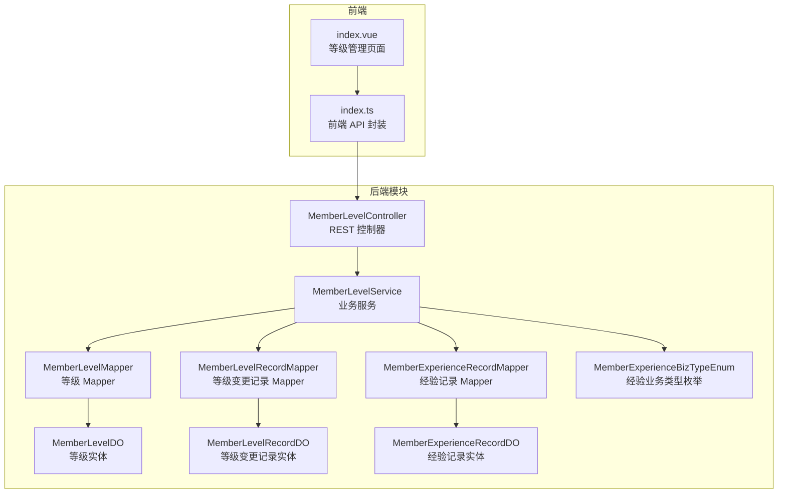
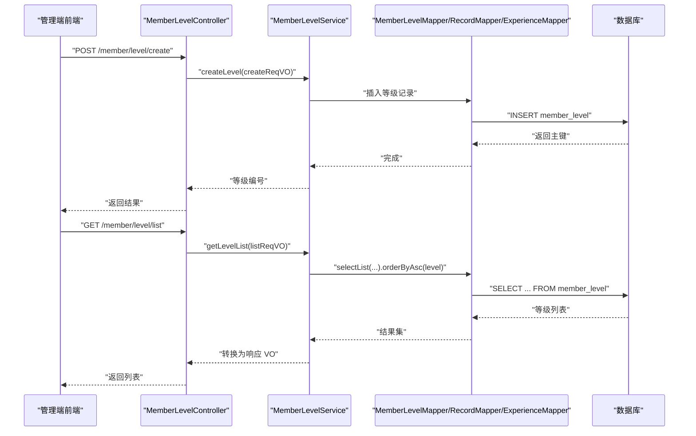
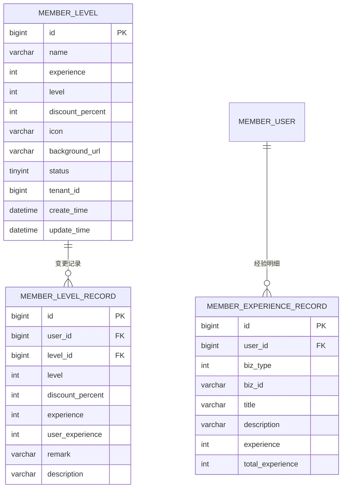
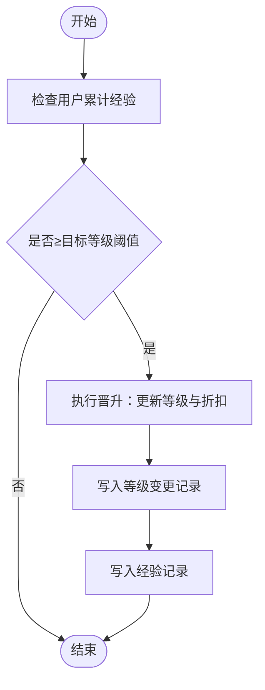
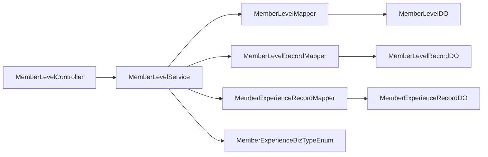

# 会员等级管理

<cite>
**本文引用的文件**
- [MemberLevelDO.java](file://backend/yudao-module-member/src/main/java/cn/iocoder/yudao/module/member/dal/dataobject/level/MemberLevelDO.java)
- [MemberLevelRecordDO.java](file://backend/yudao-module-member/src/main/java/cn/iocoder/yudao/module/member/dal/dataobject/level/MemberLevelRecordDO.java)
- [MemberExperienceRecordDO.java](file://backend/yudao-module-member/src/main/java/cn/iocoder/yudao/module/member/dal/dataobject/level/MemberExperienceRecordDO.java)
- [MemberLevelMapper.java](file://backend/yudao-module-member/src/main/java/cn/iocoder/yudao/module/member/dal/mysql/level/MemberLevelMapper.java)
- [MemberLevelRecordMapper.java](file://backend/yudao-module-member/src/main/java/cn/iocoder/yudao/module/member/dal/mysql/level/MemberLevelRecordMapper.java)
- [MemberExperienceRecordMapper.java](file://backend/yudao-module-member/src/main/java/cn/iocoder/yudao/module/member/dal/mysql/level/MemberExperienceRecordMapper.java)
- [MemberLevelService.java](file://backend/yudao-module-member/src/main/java/cn/iocoder/yudao/module/member/service/level/MemberLevelService.java)
- [MemberLevelController.java](file://backend/yudao-module-member/src/main/java/cn/iocoder/yudao/module/member/controller/admin/level/MemberLevelController.java)
- [MemberLevelBaseVO.java](file://backend/yudao-module-member/src/main/java/cn/iocoder/yudao/module/member/controller/admin/level/vo/level/MemberLevelBaseVO.java)
- [MemberLevelCreateReqVO.java](file://backend/yudao-module-member/src/main/java/cn/iocoder/yudao/module/member/controller/admin/level/vo/level/MemberLevelCreateReqVO.java)
- [MemberLevelConvert.java](file://backend/yudao-module-member/src/main/java/cn/iocoder/yudao/module/member/convert/level/MemberLevelConvert.java)
- [MemberExperienceBizTypeEnum.java](file://backend/yudao-module-member/src/main/java/cn/iocoder/yudao/module/member/enums/MemberExperienceBizTypeEnum.java)
- [create_tables.sql](file://backend/yudao-module-member/test/resources/sql/create_tables.sql)
- [index.ts](file://frontend/admin-vue3/src/api/member/level/index.ts)
- [index.vue](file://frontend/admin-vue3/src/views/member/level/index.vue)
- [ruoyi-vue-pro.sql](file://backend/sql/mysql/ruoyi-vue-pro.sql)
- [CPS系统PRD文档.md](file://docs/CPS系统PRD文档.md)
</cite>

## 目录
1. [简介](#简介)
2. [项目结构](#项目结构)
3. [核心组件](#核心组件)
4. [架构总览](#架构总览)
5. [详细组件分析](#详细组件分析)
6. [依赖分析](#依赖分析)
7. [性能考虑](#性能考虑)
8. [故障排查指南](#故障排查指南)
9. [结论](#结论)
10. [附录](#附录)

## 简介
本文件面向开发者与产品人员，系统化阐述会员等级管理模块的设计与实现，覆盖等级体系设计、等级晋升规则、等级权益配置、等级计算逻辑、阈值与状态管理、权限控制、等级变更历史记录、API 接口定义与使用示例，以及与 CPS 订单返利联动的业务流程。通过数据模型、接口契约、序列图与流程图，帮助快速理解并落地灵活的会员等级管理体系。

## 项目结构
会员等级管理位于后端 yudao-module-member 模块中，采用典型的分层架构：控制器层负责对外暴露 REST API；服务层封装业务规则；数据访问层负责持久化；数据对象与枚举描述领域模型；前端 admin-vue3 提供管理界面与调用示例。

图表来源
- [MemberLevelController.java:1-81](file://backend/yudao-module-member/src/main/java/cn/iocoder/yudao/module/member/controller/admin/level/MemberLevelController.java#L1-L81)
- [MemberLevelService.java:1-103](file://backend/yudao-module-member/src/main/java/cn/iocoder/yudao/module/member/service/level/MemberLevelService.java#L1-L103)
- [MemberLevelMapper.java:1-34](file://backend/yudao-module-member/src/main/java/cn/iocoder/yudao/module/member/dal/mysql/level/MemberLevelMapper.java#L1-L34)
- [MemberLevelRecordMapper.java:1-27](file://backend/yudao-module-member/src/main/java/cn/iocoder/yudao/module/member/dal/mysql/level/MemberLevelRecordMapper.java#L1-L27)
- [MemberExperienceRecordMapper.java:1-36](file://backend/yudao-module-member/src/main/java/cn/iocoder/yudao/module/member/dal/mysql/level/MemberExperienceRecordMapper.java#L1-L36)
- [MemberLevelDO.java:1-65](file://backend/yudao-module-member/src/main/java/cn/iocoder/yudao/module/member/dal/dataobject/level/MemberLevelDO.java#L1-L65)
- [MemberLevelRecordDO.java:1-72](file://backend/yudao-module-member/src/main/java/cn/iocoder/yudao/module/member/dal/dataobject/level/MemberLevelRecordDO.java#L1-L72)
- [MemberExperienceRecordDO.java:1-65](file://backend/yudao-module-member/src/main/java/cn/iocoder/yudao/module/member/dal/dataobject/level/MemberExperienceRecordDO.java#L1-L65)
- [MemberExperienceBizTypeEnum.java:1-52](file://backend/yudao-module-member/src/main/java/cn/iocoder/yudao/module/member/enums/MemberExperienceBizTypeEnum.java#L1-L52)
- [index.ts:1-42](file://frontend/admin-vue3/src/api/member/level/index.ts#L1-L42)
- [index.vue:1-38](file://frontend/admin-vue3/src/views/member/level/index.vue#L1-L38)

章节来源
- [MemberLevelController.java:1-81](file://backend/yudao-module-member/src/main/java/cn/iocoder/yudao/module/member/controller/admin/level/MemberLevelController.java#L1-L81)
- [MemberLevelService.java:1-103](file://backend/yudao-module-member/src/main/java/cn/iocoder/yudao/module/member/service/level/MemberLevelService.java#L1-L103)
- [MemberLevelMapper.java:1-34](file://backend/yudao-module-member/src/main/java/cn/iocoder/yudao/module/member/dal/mysql/level/MemberLevelMapper.java#L1-L34)
- [MemberLevelRecordMapper.java:1-27](file://backend/yudao-module-member/src/main/java/cn/iocoder/yudao/module/member/dal/mysql/level/MemberLevelRecordMapper.java#L1-L27)
- [MemberExperienceRecordMapper.java:1-36](file://backend/yudao-module-member/src/main/java/cn/iocoder/yudao/module/member/dal/mysql/level/MemberExperienceRecordMapper.java#L1-L36)
- [MemberLevelDO.java:1-65](file://backend/yudao-module-member/src/main/java/cn/iocoder/yudao/module/member/dal/dataobject/level/MemberLevelDO.java#L1-L65)
- [MemberLevelRecordDO.java:1-72](file://backend/yudao-module-member/src/main/java/cn/iocoder/yudao/module/member/dal/dataobject/level/MemberLevelRecordDO.java#L1-L72)
- [MemberExperienceRecordDO.java:1-65](file://backend/yudao-module-member/src/main/java/cn/iocoder/yudao/module/member/dal/dataobject/level/MemberExperienceRecordDO.java#L1-L65)
- [MemberExperienceBizTypeEnum.java:1-52](file://backend/yudao-module-member/src/main/java/cn/iocoder/yudao/module/member/enums/MemberExperienceBizTypeEnum.java#L1-L52)
- [index.ts:1-42](file://frontend/admin-vue3/src/api/member/level/index.ts#L1-L42)
- [index.vue:1-38](file://frontend/admin-vue3/src/views/member/level/index.vue#L1-L38)

## 核心组件
- 数据模型
  - 等级实体：包含等级名称、等级序号、升级经验阈值、折扣百分比、图标、背景图、状态等字段。
  - 等级变更记录：记录用户每次等级变更时的上下文（用户、等级、折扣、经验、备注等）。
  - 经验记录：记录用户获得或扣除经验的明细（业务类型、业务编号、标题、描述、经验数、累计经验）。
- 业务服务
  - 提供等级 CRUD、按状态筛选、按条件查询、用户等级变更、增加经验等能力。
- 控制器
  - 对外提供 REST 接口：创建、更新、删除、查询、列表、精简列表等。
- 前端
  - 提供管理界面与 API 调用封装，支持搜索、新增、编辑、删除等操作。

章节来源
- [MemberLevelDO.java:1-65](file://backend/yudao-module-member/src/main/java/cn/iocoder/yudao/module/member/dal/dataobject/level/MemberLevelDO.java#L1-L65)
- [MemberLevelRecordDO.java:1-72](file://backend/yudao-module-member/src/main/java/cn/iocoder/yudao/module/member/dal/dataobject/level/MemberLevelRecordDO.java#L1-L72)
- [MemberExperienceRecordDO.java:1-65](file://backend/yudao-module-member/src/main/java/cn/iocoder/yudao/module/member/dal/dataobject/level/MemberExperienceRecordDO.java#L1-L65)
- [MemberLevelService.java:1-103](file://backend/yudao-module-member/src/main/java/cn/iocoder/yudao/module/member/service/level/MemberLevelService.java#L1-L103)
- [MemberLevelController.java:1-81](file://backend/yudao-module-member/src/main/java/cn/iocoder/yudao/module/member/controller/admin/level/MemberLevelController.java#L1-L81)
- [index.ts:1-42](file://frontend/admin-vue3/src/api/member/level/index.ts#L1-L42)
- [index.vue:1-38](file://frontend/admin-vue3/src/views/member/level/index.vue#L1-L38)

## 架构总览
会员等级管理遵循“控制器-服务-数据访问-数据对象”的分层设计，前后端通过 REST API 交互。经验与等级联动由服务层统一编排，确保晋升/降级的原子性与一致性。

图表来源
- [MemberLevelController.java:1-81](file://backend/yudao-module-member/src/main/java/cn/iocoder/yudao/module/member/controller/admin/level/MemberLevelController.java#L1-L81)
- [MemberLevelService.java:1-103](file://backend/yudao-module-member/src/main/java/cn/iocoder/yudao/module/member/service/level/MemberLevelService.java#L1-L103)
- [MemberLevelMapper.java:1-34](file://backend/yudao-module-member/src/main/java/cn/iocoder/yudao/module/member/dal/mysql/level/MemberLevelMapper.java#L1-L34)

## 详细组件分析

### 数据模型设计
- 等级实体（MemberLevelDO）
  - 关键字段：名称、等级序号、升级经验阈值、折扣百分比、图标、背景图、状态。
  - 设计要点：以“等级序号”作为排序与晋升判断依据；“升级经验阈值”决定晋升门槛；“状态”控制是否启用。
- 等级变更记录（MemberLevelRecordDO）
  - 关键字段：用户编号、等级编号、等级、折扣、升级经验、用户当前经验、备注、描述。
  - 设计要点：冗余等级与折扣字段便于查询展示；记录每次变更的上下文，支撑审计与回溯。
- 经验记录（MemberExperienceRecordDO）
  - 关键字段：用户编号、业务类型、业务编号、标题、描述、经验数、累计经验。
  - 设计要点：统一记录经验来源与去向，配合枚举区分加减场景。

图表来源
- [MemberLevelDO.java:1-65](file://backend/yudao-module-member/src/main/java/cn/iocoder/yudao/module/member/dal/dataobject/level/MemberLevelDO.java#L1-L65)
- [MemberLevelRecordDO.java:1-72](file://backend/yudao-module-member/src/main/java/cn/iocoder/yudao/module/member/dal/dataobject/level/MemberLevelRecordDO.java#L1-L72)
- [MemberExperienceRecordDO.java:1-65](file://backend/yudao-module-member/src/main/java/cn/iocoder/yudao/module/member/dal/dataobject/level/MemberExperienceRecordDO.java#L1-L65)
- [create_tables.sql:60-77](file://backend/yudao-module-member/test/resources/sql/create_tables.sql#L60-L77)

章节来源
- [MemberLevelDO.java:1-65](file://backend/yudao-module-member/src/main/java/cn/iocoder/yudao/module/member/dal/dataobject/level/MemberLevelDO.java#L1-L65)
- [MemberLevelRecordDO.java:1-72](file://backend/yudao-module-member/src/main/java/cn/iocoder/yudao/module/member/dal/dataobject/level/MemberLevelRecordDO.java#L1-L72)
- [MemberExperienceRecordDO.java:1-65](file://backend/yudao-module-member/src/main/java/cn/iocoder/yudao/module/member/dal/dataobject/level/MemberExperienceRecordDO.java#L1-L65)
- [create_tables.sql:60-77](file://backend/yudao-module-member/test/resources/sql/create_tables.sql#L60-L77)

### 等级晋升与降级规则
- 晋升判定
  - 当用户累计经验达到某等级的“升级经验阈值”时，触发晋升。
  - 晋升后更新用户当前等级、折扣、累计经验，并记录等级变更与经验明细。
- 降级机制
  - 当前实现未直接暴露“降级”接口；如需降级，可通过管理员调整经验或限制条件实现。
- 权益生效
  - 新等级的折扣从变更时刻起生效；历史订单仍按下单时的等级比例结算。

图表来源
- [MemberLevelService.java:92-101](file://backend/yudao-module-member/src/main/java/cn/iocoder/yudao/module/member/service/level/MemberLevelService.java#L92-L101)
- [MemberExperienceBizTypeEnum.java:1-52](file://backend/yudao-module-member/src/main/java/cn/iocoder/yudao/module/member/enums/MemberExperienceBizTypeEnum.java#L1-L52)

章节来源
- [MemberLevelService.java:92-101](file://backend/yudao-module-member/src/main/java/cn/iocoder/yudao/module/member/service/level/MemberLevelService.java#L92-L101)
- [MemberExperienceBizTypeEnum.java:1-52](file://backend/yudao-module-member/src/main/java/cn/iocoder/yudao/module/member/enums/MemberExperienceBizTypeEnum.java#L1-L52)
- [CPS系统PRD文档.md:803-824](file://docs/CPS系统PRD文档.md#L803-L824)

### 等级权益配置
- 折扣配置
  - 每个等级维护“折扣百分比”，用于商品结算时的优惠计算。
- 图标与背景
  - 支持为等级配置图标与背景图，用于前端展示。
- 状态控制
  - 通过状态字段控制等级是否参与晋升/展示；提供“精简列表”仅返回启用状态的等级。

章节来源
- [MemberLevelDO.java:1-65](file://backend/yudao-module-member/src/main/java/cn/iocoder/yudao/module/member/dal/dataobject/level/MemberLevelDO.java#L1-L65)
- [MemberLevelBaseVO.java:1-54](file://backend/yudao-module-member/src/main/java/cn/iocoder/yudao/module/member/controller/admin/level/vo/level/MemberLevelBaseVO.java#L1-L54)
- [MemberLevelController.java:63-70](file://backend/yudao-module-member/src/main/java/cn/iocoder/yudao/module/member/controller/admin/level/MemberLevelController.java#L63-L70)

### 等级计算逻辑
- 经验累计
  - 通过“增加经验”接口为用户累计经验，支持多种业务类型（下单、签到、邀新、抽奖等）。
- 晋升触发
  - 服务层根据用户当前经验与等级阈值进行比较，必要时批量晋升至最新等级。
- 记录生成
  - 每次晋升生成等级变更记录与经验明细，便于审计与统计。

章节来源
- [MemberLevelService.java:92-101](file://backend/yudao-module-member/src/main/java/cn/iocoder/yudao/module/member/service/level/MemberLevelService.java#L92-L101)
- [MemberExperienceBizTypeEnum.java:1-52](file://backend/yudao-module-member/src/main/java/cn/iocoder/yudao/module/member/enums/MemberExperienceBizTypeEnum.java#L1-L52)
- [MemberExperienceRecordMapper.java:1-36](file://backend/yudao-module-member/src/main/java/cn/iocoder/yudao/module/member/dal/mysql/level/MemberExperienceRecordMapper.java#L1-L36)

### 等级数据模型与权限控制
- 数据模型
  - 等级表、等级变更记录表、经验记录表三者通过外键关联，保证数据一致性。
- 权限控制
  - 控制器方法均标注权限注解，确保只有具备相应权限的管理员才能操作等级。

章节来源
- [MemberLevelController.java:30-52](file://backend/yudao-module-member/src/main/java/cn/iocoder/yudao/module/member/controller/admin/level/MemberLevelController.java#L30-L52)
- [ruoyi-vue-pro.sql:1775-1777](file://backend/sql/mysql/ruoyi-vue-pro.sql#L1775-L1777)

### 等级变更历史记录
- 等级变更记录
  - 记录每次变更的用户、等级、折扣、经验、备注与描述，支持按用户、等级、时间范围分页查询。
- 经验明细
  - 记录每次经验变动的来源、业务编号、标题、描述、经验数与累计经验，支持按用户、业务类型、时间范围分页查询。

章节来源
- [MemberLevelRecordMapper.java:1-27](file://backend/yudao-module-member/src/main/java/cn/iocoder/yudao/module/member/dal/mysql/level/MemberLevelRecordMapper.java#L1-L27)
- [MemberExperienceRecordMapper.java:1-36](file://backend/yudao-module-member/src/main/java/cn/iocoder/yudao/module/member/dal/mysql/level/MemberExperienceRecordMapper.java#L1-L36)

### API 接口说明
- 获取等级列表
  - GET /member/level/list
  - 支持按名称、状态过滤，按等级升序排列。
- 获取等级精简列表
  - GET /member/level/list-all-simple
  - 返回启用状态的等级列表，用于前端下拉选择。
- 获取等级详情
  - GET /member/level/get?id={id}
- 创建等级
  - POST /member/level/create
  - 请求体：等级基础信息（名称、等级、升级经验、折扣、图标、背景图、状态）。
- 更新等级
  - PUT /member/level/update
  - 请求体：更新信息。
- 删除等级
  - DELETE /member/level/delete?id={id}

章节来源
- [MemberLevelController.java:30-78](file://backend/yudao-module-member/src/main/java/cn/iocoder/yudao/module/member/controller/admin/level/MemberLevelController.java#L30-L78)
- [MemberLevelBaseVO.java:1-54](file://backend/yudao-module-member/src/main/java/cn/iocoder/yudao/module/member/controller/admin/level/vo/level/MemberLevelBaseVO.java#L1-L54)
- [MemberLevelCreateReqVO.java:1-15](file://backend/yudao-module-member/src/main/java/cn/iocoder/yudao/module/member/controller/admin/level/vo/level/MemberLevelCreateReqVO.java#L1-L15)
- [index.ts:1-42](file://frontend/admin-vue3/src/api/member/level/index.ts#L1-L42)

### 前端集成与使用示例
- 页面入口
  - 管理端等级管理页面提供搜索、新增、编辑、删除等操作。
- API 调用
  - 前端通过封装的 index.ts 调用后端接口，实现列表查询、详情获取、创建与更新等操作。

章节来源
- [index.vue:1-38](file://frontend/admin-vue3/src/views/member/level/index.vue#L1-L38)
- [index.ts:1-42](file://frontend/admin-vue3/src/api/member/level/index.ts#L1-L42)

## 依赖分析
- 组件耦合
  - 控制器依赖服务接口；服务层依赖多个 Mapper；Mapper 依赖 DO；DO 之间通过外键关联。
- 外部依赖
  - 基于 MyBatis-Plus 的通用 Mapper 与查询包装器；MapStruct 进行 VO/DO 转换；Swagger 注解用于接口文档生成。
- 权限与菜单
  - 后端菜单中包含会员配置与签到配置等权限点，前端页面通过权限指令控制按钮显示。

图表来源
- [MemberLevelController.java:1-81](file://backend/yudao-module-member/src/main/java/cn/iocoder/yudao/module/member/controller/admin/level/MemberLevelController.java#L1-L81)
- [MemberLevelService.java:1-103](file://backend/yudao-module-member/src/main/java/cn/iocoder/yudao/module/member/service/level/MemberLevelService.java#L1-L103)
- [MemberLevelMapper.java:1-34](file://backend/yudao-module-member/src/main/java/cn/iocoder/yudao/module/member/dal/mysql/level/MemberLevelMapper.java#L1-L34)
- [MemberLevelRecordMapper.java:1-27](file://backend/yudao-module-member/src/main/java/cn/iocoder/yudao/module/member/dal/mysql/level/MemberLevelRecordMapper.java#L1-L27)
- [MemberExperienceRecordMapper.java:1-36](file://backend/yudao-module-member/src/main/java/cn/iocoder/yudao/module/member/dal/mysql/level/MemberExperienceRecordMapper.java#L1-L36)
- [MemberExperienceBizTypeEnum.java:1-52](file://backend/yudao-module-member/src/main/java/cn/iocoder/yudao/module/member/enums/MemberExperienceBizTypeEnum.java#L1-L52)

章节来源
- [MemberLevelController.java:1-81](file://backend/yudao-module-member/src/main/java/cn/iocoder/yudao/module/member/controller/admin/level/MemberLevelController.java#L1-L81)
- [MemberLevelService.java:1-103](file://backend/yudao-module-member/src/main/java/cn/iocoder/yudao/module/member/service/level/MemberLevelService.java#L1-L103)
- [MemberLevelMapper.java:1-34](file://backend/yudao-module-member/src/main/java/cn/iocoder/yudao/module/member/dal/mysql/level/MemberLevelMapper.java#L1-L34)
- [MemberLevelRecordMapper.java:1-27](file://backend/yudao-module-member/src/main/java/cn/iocoder/yudao/module/member/dal/mysql/level/MemberLevelRecordMapper.java#L1-L27)
- [MemberExperienceRecordMapper.java:1-36](file://backend/yudao-module-member/src/main/java/cn/iocoder/yudao/module/member/dal/mysql/level/MemberExperienceRecordMapper.java#L1-L36)
- [MemberExperienceBizTypeEnum.java:1-52](file://backend/yudao-module-member/src/main/java/cn/iocoder/yudao/module/member/enums/MemberExperienceBizTypeEnum.java#L1-L52)

## 性能考虑
- 查询优化
  - 等级列表按等级升序排列，建议在等级字段建立索引以提升排序与过滤性能。
- 分页策略
  - 等级变更与经验明细均提供分页查询，建议结合时间范围与用户维度进行过滤，避免全表扫描。
- 批量晋升
  - 当经验增长较大时，服务层应一次性处理多级晋升，减少多次事务开销。
- 缓存建议
  - 对启用状态的等级列表可做缓存，降低频繁查询成本。

## 故障排查指南
- 权限不足
  - 若接口返回无权限，请确认菜单与权限点配置是否正确。
- 参数校验失败
  - 等级名称、等级、升级经验、折扣、状态等字段需满足校验规则；请检查请求体格式与取值范围。
- 数据不一致
  - 检查经验记录与等级变更记录是否同时写入成功；若部分失败，需回滚或补偿。

章节来源
- [MemberLevelController.java:30-52](file://backend/yudao-module-member/src/main/java/cn/iocoder/yudao/module/member/controller/admin/level/MemberLevelController.java#L30-L52)
- [MemberLevelBaseVO.java:21-51](file://backend/yudao-module-member/src/main/java/cn/iocoder/yudao/module/member/controller/admin/level/vo/level/MemberLevelBaseVO.java#L21-L51)

## 结论
会员等级管理模块以清晰的数据模型与严格的分层设计，提供了完整的等级配置、晋升规则、权益映射与历史记录能力。通过统一的经验业务类型与规范的接口契约，能够灵活适配不同业务场景（如 CPS 返利联动），并为后续扩展（如降级、等级标签、权益叠加等）预留空间。

## 附录

### 等级与 CPS 返利联动（参考 PRD）
- 等级体系复用现有等级体系，CPS 订单为会员贡献经验值。
- 不同等级享有不同返利比例；等级变动不影响已下单但未结算的订单。

章节来源
- [CPS系统PRD文档.md:803-824](file://docs/CPS系统PRD文档.md#L803-L824)