# 会员管理系统

<cite>
**本文档引用的文件**
- [member-2024-01-18.sql](file://backend/sql/module/member-2024-01-18.sql)
- [MemberUserServiceImpl.java](file://backend/yudao-module-member/src/main/java/cn/iocoder/yudao/module/member/service/user/MemberUserServiceImpl.java)
- [MemberAuthServiceImpl.java](file://backend/yudao-module-member/src/main/java/cn/iocoder/yudao/module/member/service/auth/MemberAuthServiceImpl.java)
- [MemberLevelServiceImpl.java](file://backend/yudao-module-member/src/main/java/cn/iocoder/yudao/module/member/service/level/MemberLevelServiceImpl.java)
- [MemberExperienceRecordServiceImpl.java](file://backend/yudao-module-member/src/main/java/cn/iocoder/yudao/module/member/service/level/MemberExperienceRecordServiceImpl.java)
- [MemberPointRecordServiceImpl.java](file://backend/yudao-module-member/src/main/java/cn/iocoder/yudao/module/member/service/point/MemberPointRecordServiceImpl.java)
- [MemberSignInConfigServiceImpl.java](file://backend/yudao-module-member/src/main/java/cn/iocoder/yudao/module/member/service/signin/MemberSignInConfigServiceImpl.java)
- [MemberSignInRecordServiceImpl.java](file://backend/yudao-module-member/src/main/java/cn/iocoder/yudao/module/member/service/signin/MemberSignInRecordServiceImpl.java)
- [MemberConfigServiceImpl.java](file://backend/yudao-module-member/src/main/java/cn/iocoder/yudao/module/member/service/config/MemberConfigServiceImpl.java)
- [MemberTagServiceImpl.java](file://backend/yudao-module-member/src/main/java/cn/iocoder/yudao/module/member/service/tag/MemberTagServiceImpl.java)
- [MemberGroupServiceImpl.java](file://backend/yudao-module-member/src/main/java/cn/iocoder/yudao/module/member/service/group/MemberGroupServiceImpl.java)
- [MemberUserController.java](file://backend/yudao-module-member/src/main/java/cn/iocoder/yudao/module/member/controller/admin/user/MemberUserController.java)
- [MemberTagController.java](file://backend/yudao-module-member/src/main/java/cn/iocoder/yudao/module/member/controller/admin/tag/MemberTagController.java)
- [MemberSignInRecordPageReqVO.java](file://backend/yudao-module-member/src/main/java/cn/iocoder/yudao/module/member/controller/admin/signin/vo/record/MemberSignInRecordPageReqVO.java)
- [MemberSignInRecordRespVO.java](file://backend/yudao-module-member/src/main/java/cn/iocoder/yudao/module/member/controller/admin/signin/vo/record/MemberSignInRecordRespVO.java)
- [MemberTagBaseVO.java](file://backend/yudao-module-member/src/main/java/cn/iocoder/yudao/module/member/controller/admin/tag/vo/MemberTagBaseVO.java)
- [MemberTagCreateReqVO.java](file://backend/yudao-module-member/src/main/java/cn/iocoder/yudao/module/member/controller/admin/tag/vo/MemberTagCreateReqVO.java)
- [MemberTagPageReqVO.java](file://backend/yudao-module-member/src/main/java/cn/iocoder/yudao/module/member/controller/admin/tag/vo/MemberTagPageReqVO.java)
- [MemberTagRespVO.java](file://backend/yudao-module-member/src/main/java/cn/iocoder/yudao/module/member/controller/admin/tag/vo/MemberTagRespVO.java)
- [MemberTagUpdateReqVO.java](file://backend/yudao-module-member/src/main/java/cn/iocoder/yudao/module/member/controller/admin/tag/vo/MemberTagUpdateReqVO.java)
- [MemberUserBaseVO.java](file://backend/yudao-module-member/src/main/java/cn/iocoder/yudao/module/member/controller/admin/user/vo/MemberUserBaseVO.java)
- [MemberUserCreateReqVO.java](file://backend/yudao-module-member/src/main/java/cn/iocoder/yudao/module/member/controller/admin/user/vo/MemberUserCreateReqVO.java)
- [MemberUserPageReqVO.java](file://backend/yudao-module-member/src/main/java/cn/iocoder/yudao/module/member/controller/admin/user/vo/MemberUserPageReqVO.java)
- [MemberUserRespVO.java](file://backend/yudao-module-member/src/main/java/cn/iocoder/yudao/module/member/controller/admin/user/vo/MemberUserRespVO.java)
- [MemberUserUpdateReqVO.java](file://backend/yudao-module-member/src/main/java/cn/iocoder/yudao/module/member/controller/admin/user/vo/MemberUserUpdateReqVO.java)
- [MemberStatisticsController.java](file://backend/yudao-module-mall/yudao-module-statistics/src/main/java/cn/iocoder/yudao/module/statistics/controller/admin/member/MemberStatisticsController.java)
- [MemberStatisticsServiceImpl.java](file://backend/yudao-module-mall/yudao-module-statistics/src/main/java/cn/iocoder/yudao/module/statistics/service/member/MemberStatisticsServiceImpl.java)
- [MemberAnalyseDataRespVO.java](file://backend/yudao-module-mall/yudao-module-statistics/src/main/java/cn/iocoder/yudao/module/statistics/controller/admin/member/vo/MemberAnalyseDataRespVO.java)
- [MemberAnalyseReqVO.java](file://backend/yudao-module-mall/yudao-module-statistics/src/main/java/cn/iocoder/yudao/module/statistics/controller/admin/member/vo/MemberAnalyseReqVO.java)
- [MemberAnalyseRespVO.java](file://backend/yudao-module-mall/yudao-module-statistics/src/main/java/cn/iocoder/yudao/module/statistics/controller/admin/member/vo/MemberAnalyseRespVO.java)
- [MemberAreaStatisticsRespVO.java](file://backend/yudao-module-mall/yudao-module-statistics/src/main/java/cn/iocoder/yudao/module/statistics/controller/admin/member/vo/MemberAreaStatisticsRespVO.java)
- [MemberCountRespVO.java](file://backend/yudao-module-mall/yudao-module-statistics/src/main/java/cn/iocoder/yudao/module/statistics/controller/admin/member/vo/MemberCountRespVO.java)
- [MemberRegisterCountRespVO.java](file://backend/yudao-module-mall/yudao-module-statistics/src/main/java/cn/iocoder/yudao/module/statistics/controller/admin/member/vo/MemberRegisterCountRespVO.java)
- [MemberSexStatisticsRespVO.java](file://backend/yudao-module-mall/yudao-module-statistics/src/main/java/cn/iocoder/yudao/module/statistics/controller/admin/member/vo/MemberSexStatisticsRespVO.java)
- [MemberSummaryRespVO.java](file://backend/yudao-module-mall/yudao-module-statistics/src/main/java/cn/iocoder/yudao/module/statistics/controller/admin/member/vo/MemberSummaryRespVO.java)
- [MemberTerminalStatisticsRespVO.java](file://backend/yudao-module-mall/yudao-module-statistics/src/main/java/cn/iocoder/yudao/module/statistics/controller/admin/member/vo/MemberTerminalStatisticsRespVO.java)
- [MemberStatisticsMapper.java](file://backend/yudao-module-mall/yudao-module-statistics/src/main/java/cn/iocoder/yudao/module/statistics/dal/mysql/member/MemberStatisticsMapper.java)
- [MemberStatisticsMapper.xml](file://backend/yudao-module-mall/yudao-module-statistics/src/main/resources/mapper/member/MemberStatisticsMapper.xml)
- [MemberStatisticsConvert.java](file://backend/yudao-module-mall/yudao-module-statistics/src/main/java/cn/iocoder/yudao/module/statistics/convert/member/MemberStatisticsConvert.java)
- [ruoyi-vue-pro.sql](file://backend/sql/mysql/ruoyi-vue-pro.sql)
</cite>

## 目录
1. [简介](#简介)
2. [项目结构](#项目结构)
3. [核心组件](#核心组件)
4. [架构概览](#架构概览)
5. [详细组件分析](#详细组件分析)
6. [依赖关系分析](#依赖关系分析)
7. [性能考虑](#性能考虑)
8. [故障排除指南](#故障排除指南)
9. [结论](#结论)
10. [附录](#附录)

## 简介

会员管理系统是基于芋道框架构建的企业级会员管理解决方案，集成了完整的会员注册登录机制、等级体系、积分管理、经验值管理和签到功能。该系统采用模块化设计，支持多租户架构，具备完善的权限控制和数据同步机制。

系统主要包含以下核心功能模块：
- **会员注册与登录**：支持手机号注册、密码登录、第三方登录等多种认证方式
- **会员等级体系**：动态等级管理，支持经验值自动升级
- **积分与经验值管理**：完整的积分获取、消费、转移机制
- **签到奖励系统**：连续签到奖励，支持自定义奖励规则
- **会员信息管理**：个人信息维护、地址管理、标签分类
- **统计分析功能**：会员数据统计、行为分析、趋势预测

## 项目结构

会员管理系统采用标准的Maven多模块架构，整体结构清晰，职责分明：

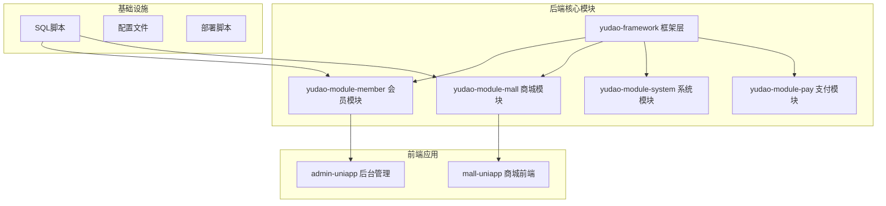

**图表来源**
- [pom.xml](file://backend/pom.xml)
- [yudao-module-member/pom.xml](file://backend/yudao-module-member/pom.xml)
- [yudao-module-mall/pom.xml](file://backend/yudao-module-mall/pom.xml)

**章节来源**
- [pom.xml](file://backend/pom.xml)
- [yudao-module-member/pom.xml](file://backend/yudao-module-member/pom.xml)
- [yudao-module-mall/pom.xml](file://backend/yudao-module-mall/pom.xml)

## 核心组件

### 数据模型设计

系统采用关系型数据库设计，核心数据表包括：

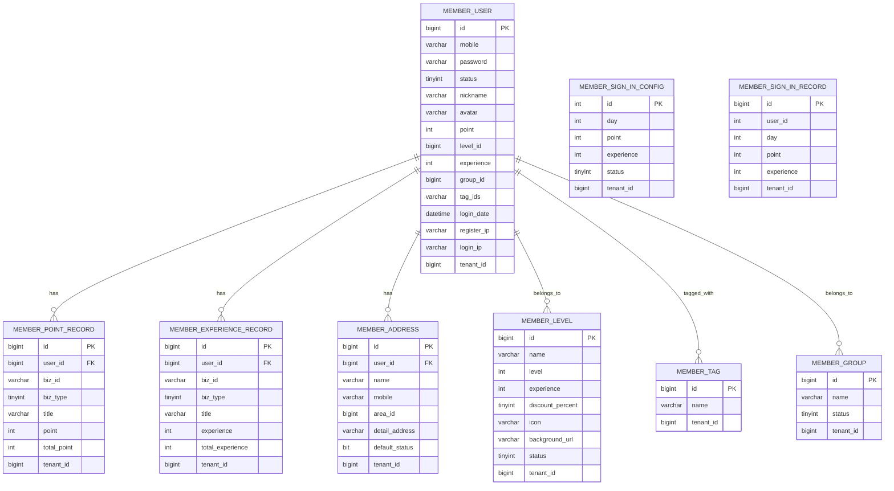

**图表来源**
- [member-2024-01-18.sql](file://backend/sql/module/member-2024-01-18.sql)

### 服务层架构

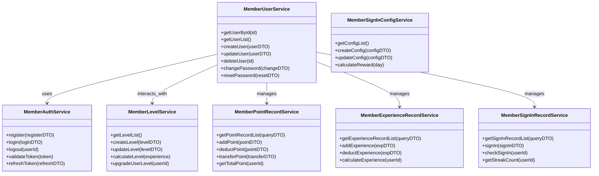

**图表来源**
- [MemberUserServiceImpl.java](file://backend/yudao-module-member/src/main/java/cn/iocoder/yudao/module/member/service/user/MemberUserServiceImpl.java)
- [MemberAuthServiceImpl.java](file://backend/yudao-module-member/src/main/java/cn/iocoder/yudao/module/member/service/auth/MemberAuthServiceImpl.java)
- [MemberLevelServiceImpl.java](file://backend/yudao-module-member/src/main/java/cn/iocoder/yudao/module/member/service/level/MemberLevelServiceImpl.java)
- [MemberPointRecordServiceImpl.java](file://backend/yudao-module-member/src/main/java/cn/iocoder/yudao/module/member/service/point/MemberPointRecordServiceImpl.java)
- [MemberExperienceRecordServiceImpl.java](file://backend/yudao-module-member/src/main/java/cn/iocoder/yudao/module/member/service/level/MemberExperienceRecordServiceImpl.java)
- [MemberSignInConfigServiceImpl.java](file://backend/yudao-module-member/src/main/java/cn/iocoder/yudao/module/member/service/signin/MemberSignInConfigServiceImpl.java)
- [MemberSignInRecordServiceImpl.java](file://backend/yudao-module-member/src/main/java/cn/iocoder/yudao/module/member/service/signin/MemberSignInRecordServiceImpl.java)

**章节来源**
- [MemberUserServiceImpl.java](file://backend/yudao-module-member/src/main/java/cn/iocoder/yudao/module/member/service/user/MemberUserServiceImpl.java)
- [MemberAuthServiceImpl.java](file://backend/yudao-module-member/src/main/java/cn/iocoder/yudao/module/member/service/auth/MemberAuthServiceImpl.java)
- [MemberLevelServiceImpl.java](file://backend/yudao-module-member/src/main/java/cn/iocoder/yudao/module/member/service/level/MemberLevelServiceImpl.java)
- [MemberPointRecordServiceImpl.java](file://backend/yudao-module-member/src/main/java/cn/iocoder/yudao/module/member/service/point/MemberPointRecordServiceImpl.java)
- [MemberExperienceRecordServiceImpl.java](file://backend/yudao-module-member/src/main/java/cn/iocoder/yudao/module/member/service/level/MemberExperienceRecordServiceImpl.java)
- [MemberSignInConfigServiceImpl.java](file://backend/yudao-module-member/src/main/java/cn/iocoder/yudao/module/member/service/signin/MemberSignInConfigServiceImpl.java)
- [MemberSignInRecordServiceImpl.java](file://backend/yudao-module-member/src/main/java/cn/iocoder/yudao/module/member/service/signin/MemberSignInRecordServiceImpl.java)

## 架构概览

### 整体架构设计

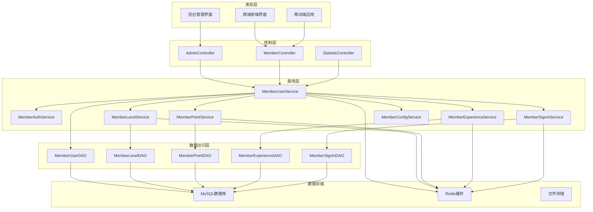

**图表来源**
- [MemberUserController.java](file://backend/yudao-module-member/src/main/java/cn/iocoder/yudao/module/member/controller/admin/user/MemberUserController.java)
- [MemberTagController.java](file://backend/yudao-module-member/src/main/java/cn/iocoder/yudao/module/member/controller/admin/tag/MemberTagController.java)
- [MemberStatisticsController.java](file://backend/yudao-module-mall/yudao-module-statistics/src/main/java/cn/iocoder/yudao/module/statistics/controller/admin/member/MemberStatisticsController.java)

### 数据流处理

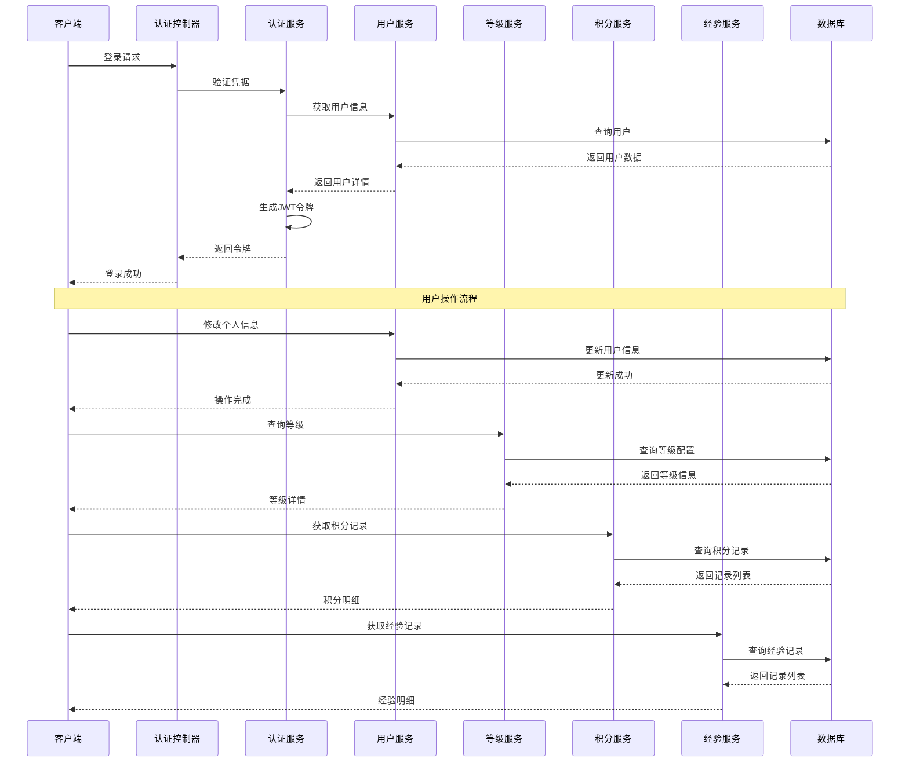

**图表来源**
- [MemberAuthServiceImpl.java](file://backend/yudao-module-member/src/main/java/cn/iocoder/yudao/module/member/service/auth/MemberAuthServiceImpl.java)
- [MemberUserServiceImpl.java](file://backend/yudao-module-member/src/main/java/cn/iocoder/yudao/module/member/service/user/MemberUserServiceImpl.java)
- [MemberLevelServiceImpl.java](file://backend/yudao-module-member/src/main/java/cn/iocoder/yudao/module/member/service/level/MemberLevelServiceImpl.java)
- [MemberPointRecordServiceImpl.java](file://backend/yudao-module-member/src/main/java/cn/iocoder/yudao/module/member/service/point/MemberPointRecordServiceImpl.java)
- [MemberExperienceRecordServiceImpl.java](file://backend/yudao-module-member/src/main/java/cn/iocoder/yudao/module/member/service/level/MemberExperienceRecordServiceImpl.java)

## 详细组件分析

### 会员注册与登录机制

#### 注册流程

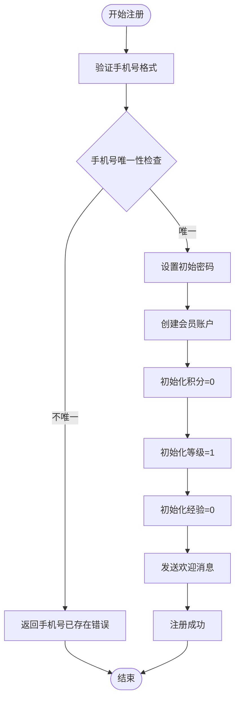

**图表来源**
- [MemberAuthServiceImpl.java](file://backend/yudao-module-member/src/main/java/cn/iocoder/yudao/module/member/service/auth/MemberAuthServiceImpl.java)

#### 登录认证流程

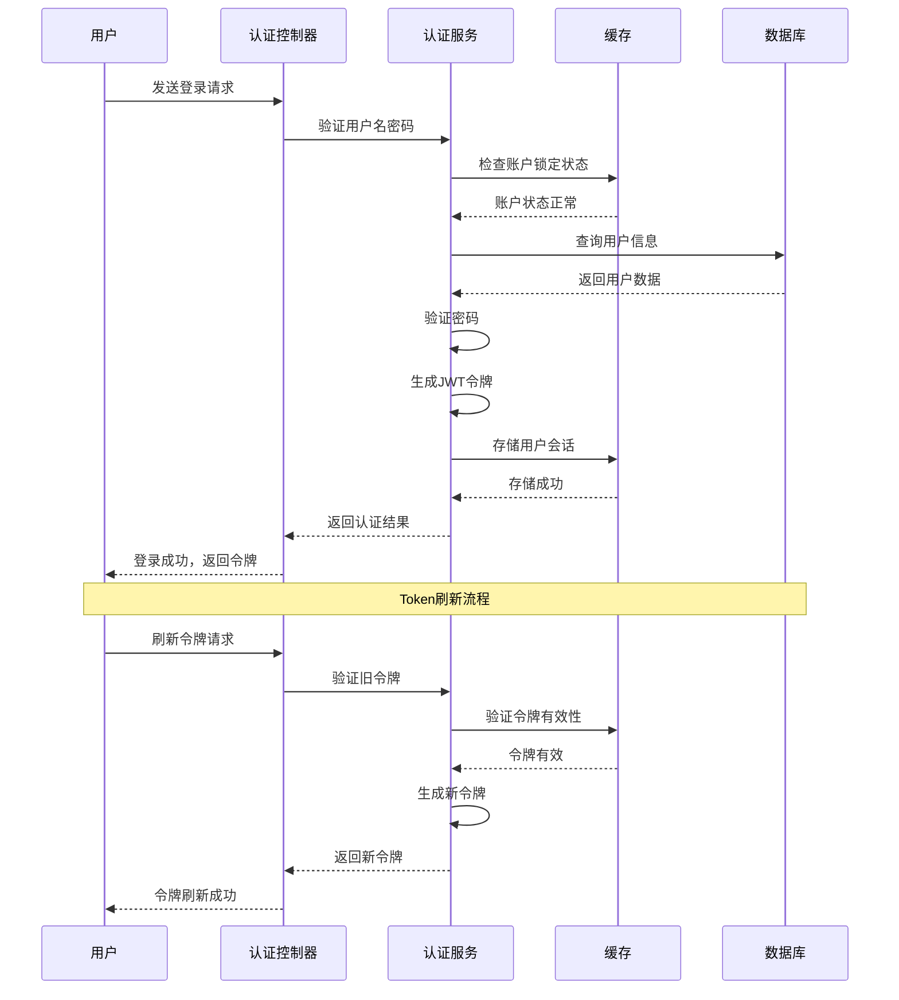

**图表来源**
- [MemberAuthServiceImpl.java](file://backend/yudao-module-member/src/main/java/cn/iocoder/yudao/module/member/service/auth/MemberAuthServiceImpl.java)

**章节来源**
- [MemberAuthServiceImpl.java](file://backend/yudao-module-member/src/main/java/cn/iocoder/yudao/module/member/service/auth/MemberAuthServiceImpl.java)
- [MemberUserController.java](file://backend/yudao-module-member/src/main/java/cn/iocoder/yudao/module/member/controller/admin/user/MemberUserController.java)

### 会员等级体系设计

#### 等级晋升规则

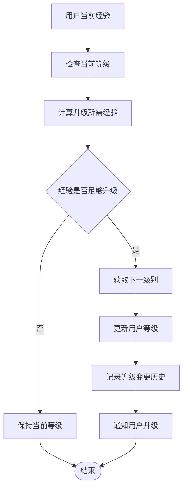

**图表来源**
- [MemberLevelServiceImpl.java](file://backend/yudao-module-member/src/main/java/cn/iocoder/yudao/module/member/service/level/MemberLevelServiceImpl.java)
- [MemberExperienceRecordServiceImpl.java](file://backend/yudao-module-member/src/main/java/cn/iocoder/yudao/module/member/service/level/MemberExperienceRecordServiceImpl.java)

#### 等级配置管理

系统支持灵活的等级配置，包括：
- **等级名称**：如青铜、白银、黄金等
- **等级排序**：数字越大等级越高
- **升级经验**：达到该经验值可升级
- **折扣比例**：不同等级享受不同购物折扣
- **等级图标**：支持自定义等级标识
- **状态控制**：启用/禁用等级

**章节来源**
- [MemberLevelServiceImpl.java](file://backend/yudao-module-member/src/main/java/cn/iocoder/yudao/module/member/service/level/MemberLevelServiceImpl.java)
- [MemberExperienceRecordServiceImpl.java](file://backend/yudao-module-member/src/main/java/cn/iocoder/yudao/module/member/service/level/MemberExperienceRecordServiceImpl.java)

### 积分与经验值管理

#### 积分获取机制

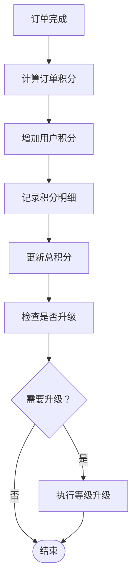

**图表来源**
- [MemberPointRecordServiceImpl.java](file://backend/yudao-module-member/src/main/java/cn/iocoder/yudao/module/member/service/point/MemberPointRecordServiceImpl.java)
- [MemberExperienceRecordServiceImpl.java](file://backend/yudao-module-member/src/main/java/cn/iocoder/yudao/module/member/service/level/MemberExperienceRecordServiceImpl.java)

#### 积分消费流程

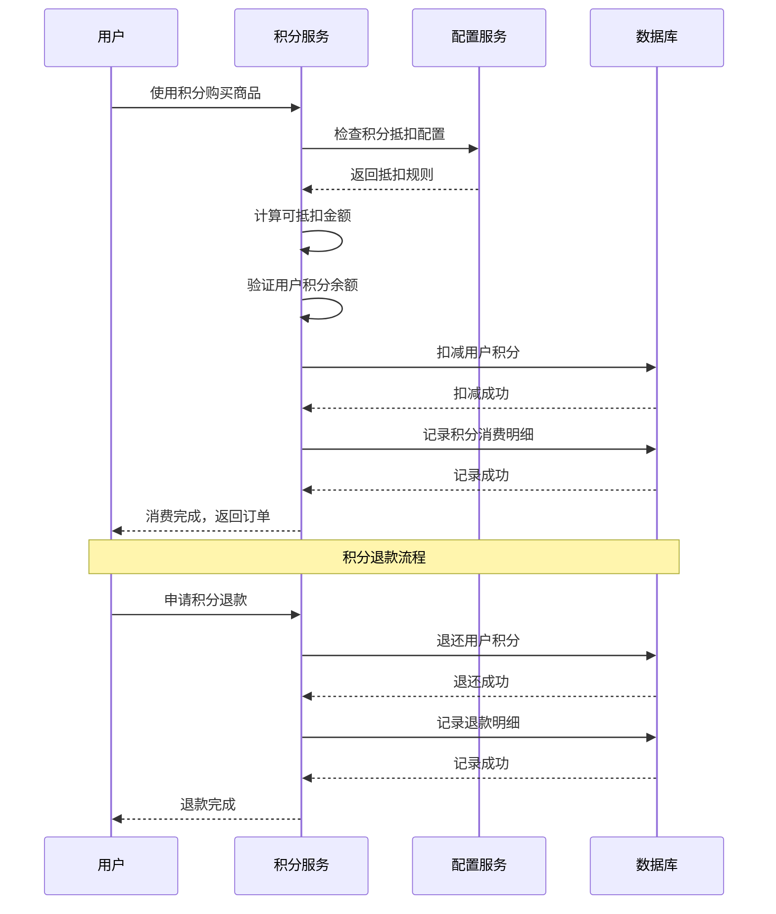

**图表来源**
- [MemberPointRecordServiceImpl.java](file://backend/yudao-module-member/src/main/java/cn/iocoder/yudao/module/member/service/point/MemberPointRecordServiceImpl.java)
- [MemberConfigServiceImpl.java](file://backend/yudao-module-member/src/main/java/cn/iocoder/yudao/module/member/service/config/MemberConfigServiceImpl.java)

**章节来源**
- [MemberPointRecordServiceImpl.java](file://backend/yudao-module-member/src/main/java/cn/iocoder/yudao/module/member/service/point/MemberPointRecordServiceImpl.java)
- [MemberExperienceRecordServiceImpl.java](file://backend/yudao-module-member/src/main/java/cn/iocoder/yudao/module/member/service/level/MemberExperienceRecordServiceImpl.java)
- [MemberConfigServiceImpl.java](file://backend/yudao-module-member/src/main/java/cn/iocoder/yudao/module/member/service/config/MemberConfigServiceImpl.java)

### 签到奖励机制

#### 连续签到算法

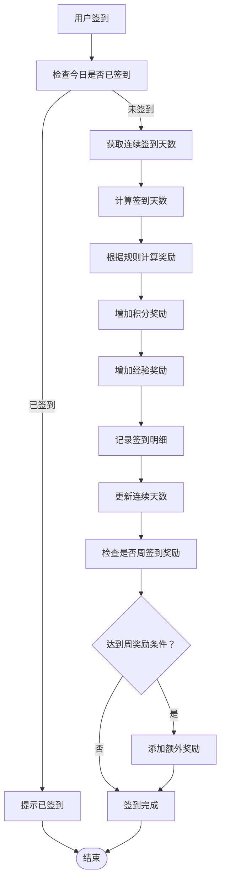

**图表来源**
- [MemberSignInRecordServiceImpl.java](file://backend/yudao-module-member/src/main/java/cn/iocoder/yudao/module/member/service/signin/MemberSignInRecordServiceImpl.java)
- [MemberSignInConfigServiceImpl.java](file://backend/yudao-module-member/src/main/java/cn/iocoder/yudao/module/member/service/signin/MemberSignInConfigServiceImpl.java)

#### 签到配置规则

系统支持灵活的签到奖励配置：
- **连续天数奖励**：第1天10积分，第2天20积分，第7天1001积分
- **经验奖励**：可配置签到获得的经验值
- **状态控制**：启用/禁用签到功能
- **租户隔离**：支持多租户独立配置

**章节来源**
- [MemberSignInRecordServiceImpl.java](file://backend/yudao-module-member/src/main/java/cn/iocoder/yudao/module/member/service/signin/MemberSignInRecordServiceImpl.java)
- [MemberSignInConfigServiceImpl.java](file://backend/yudao-module-member/src/main/java/cn/iocoder/yudao/module/member/service/signin/MemberSignInConfigServiceImpl.java)

### 会员信息管理

#### 个人信息维护

```mermaid
classDiagram
class MemberUser {
+id : bigint
+mobile : string
+password : string
+status : tinyint
+nickname : string
+avatar : string
+name : string
+sex : tinyint
+birthday : datetime
+area_id : bigint
+point : int
+experience : int
+level_id : bigint
+group_id : bigint
+tag_ids : string
+register_ip : string
+login_ip : string
+login_date : datetime
+tenant_id : bigint
}
class MemberAddress {
+id : bigint
+user_id : bigint
+name : string
+mobile : string
+area_id : bigint
+detail_address : string
+default_status : bit
+tenant_id : bigint
}
class MemberTag {
+id : bigint
+name : string
+tenant_id : bigint
}
class MemberGroup {
+id : bigint
+name : string
+status : tinyint
+tenant_id : bigint
}
MemberUser ||--o{ MemberAddress : has
MemberUser ||--o{ MemberTag : tagged_with
MemberUser ||--o{ MemberGroup : belongs_to
```

**图表来源**
- [member-2024-01-18.sql](file://backend/sql/module/member-2024-01-18.sql)

#### 地址管理功能

系统提供完整的地址管理功能：
- **默认地址设置**：支持设置默认收货地址
- **地址验证**：支持地区编码验证
- **批量操作**：支持地址的增删改查
- **地址同步**：与订单系统实时同步

**章节来源**
- [member-2024-01-18.sql](file://backend/sql/module/member-2024-01-18.sql)

### 权限控制策略

#### 角色权限管理

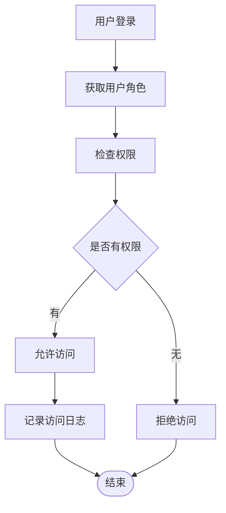

**图表来源**
- [ruoyi-vue-pro.sql](file://backend/sql/mysql/ruoyi-vue-pro.sql)

#### 菜单权限控制

系统通过菜单权限实现细粒度的访问控制：
- **菜单树结构**：支持多级菜单嵌套
- **权限标识**：每个菜单对应唯一的权限标识
- **动态加载**：根据用户权限动态加载菜单
- **按钮权限**：支持页面按钮级别的权限控制

**章节来源**
- [ruoyi-vue-pro.sql](file://backend/sql/mysql/ruoyi-vue-pro.sql)

## 依赖关系分析

### 模块间依赖

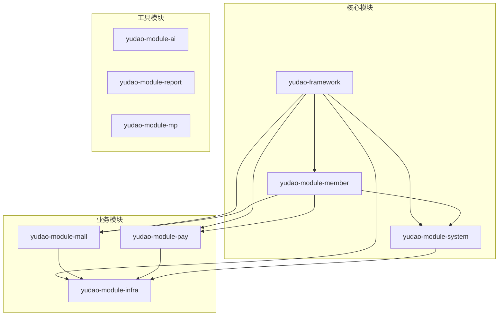

**图表来源**
- [pom.xml](file://backend/pom.xml)
- [yudao-module-member/pom.xml](file://backend/yudao-module-member/pom.xml)
- [yudao-module-mall/pom.xml](file://backend/yudao-module-mall/pom.xml)

### 数据依赖关系

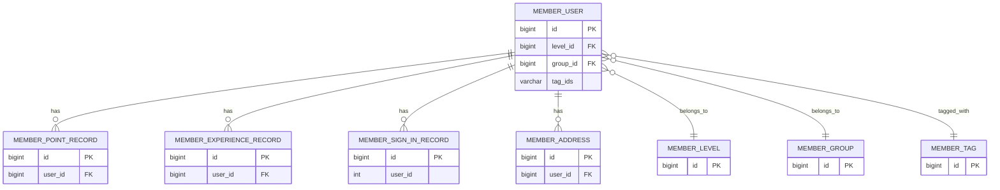

**图表来源**
- [member-2024-01-18.sql](file://backend/sql/module/member-2024-01-18.sql)

**章节来源**
- [pom.xml](file://backend/pom.xml)
- [yudao-module-member/pom.xml](file://backend/yudao-module-member/pom.xml)
- [yudao-module-mall/pom.xml](file://backend/yudao-module-mall/pom.xml)

## 性能考虑

### 缓存策略

系统采用多层次缓存策略优化性能：

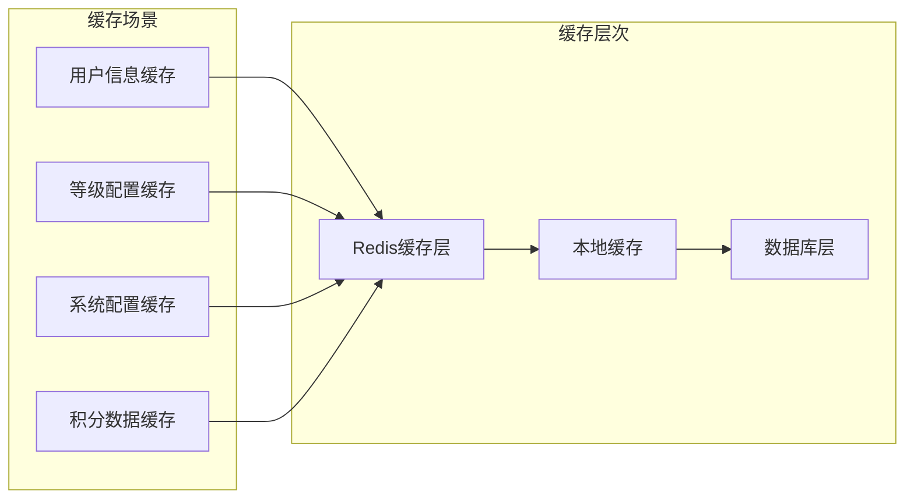

### 数据同步机制

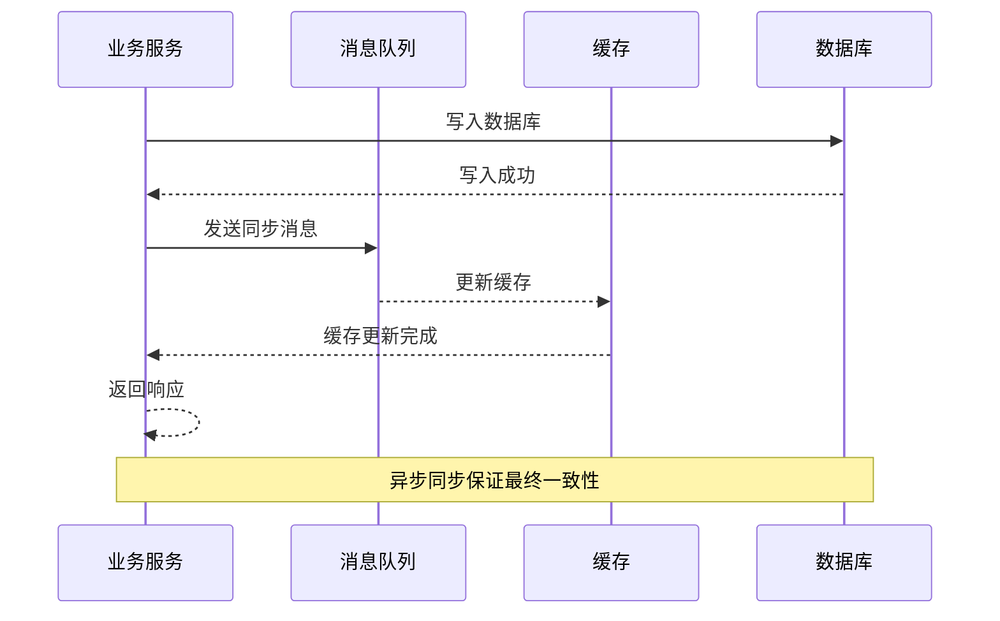

### 性能优化建议

1. **索引优化**：为常用查询字段建立合适索引
2. **批量操作**：支持批量数据导入导出
3. **分页查询**：大数据量场景使用分页查询
4. **连接池配置**：合理配置数据库连接池参数
5. **监控告警**：建立完善的性能监控体系

## 故障排除指南

### 常见问题诊断

#### 登录失败排查

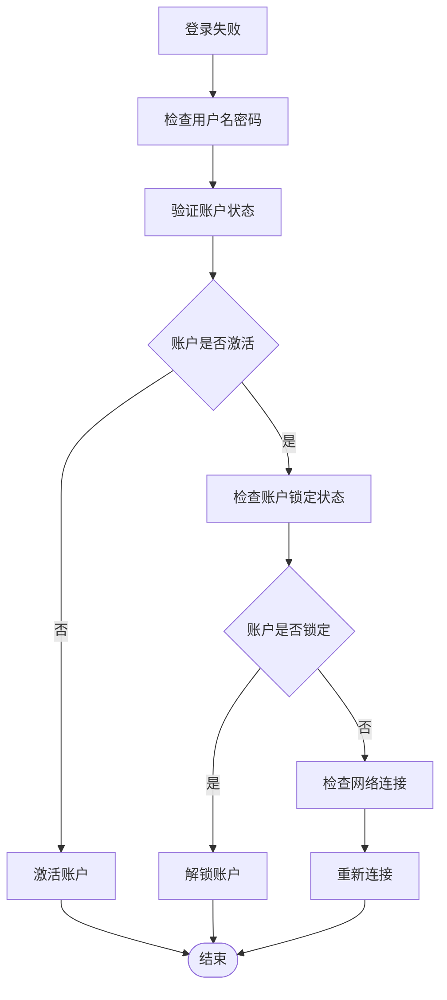

#### 积分异常处理

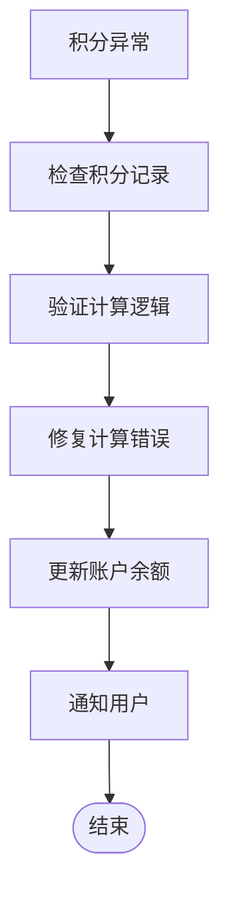

### 错误处理机制

系统提供完善的错误处理机制：
- **统一异常处理**：全局异常捕获和处理
- **事务回滚**：数据库操作失败自动回滚
- **重试机制**：网络异常自动重试
- **降级策略**：服务不可用时的降级方案

**章节来源**
- [MemberAuthServiceImpl.java](file://backend/yudao-module-member/src/main/java/cn/iocoder/yudao/module/member/service/auth/MemberAuthServiceImpl.java)
- [MemberUserServiceImpl.java](file://backend/yudao-module-member/src/main/java/cn/iocoder/yudao/module/member/service/user/MemberUserServiceImpl.java)

## 结论

会员管理系统是一个功能完善、架构清晰的企业级会员管理解决方案。系统采用模块化设计，支持多租户架构，具备完善的权限控制和数据同步机制。

### 主要优势

1. **功能完整**：涵盖会员管理的所有核心功能
2. **架构清晰**：采用分层架构，职责明确
3. **扩展性强**：支持灵活的功能扩展和定制
4. **性能优秀**：多层缓存和异步处理机制
5. **安全可靠**：完善的权限控制和数据保护

### 技术特色

- **微服务架构**：模块化设计，便于维护和扩展
- **多租户支持**：支持多租户独立配置和数据隔离
- **实时同步**：基于消息队列的数据同步机制
- **智能缓存**：多层次缓存策略优化性能
- **监控完备**：完善的性能监控和告警机制

该系统为企业提供了完整的会员管理能力，能够满足各种规模企业的会员运营需求。

## 附录

### API接口规范

#### 用户管理接口

| 接口 | 方法 | 路径 | 功能描述 |
|------|------|------|----------|
| 获取用户列表 | GET | /member/user/list | 获取会员列表 |
| 创建用户 | POST | /member/user/create | 创建新会员 |
| 更新用户 | PUT | /member/user/update | 更新会员信息 |
| 删除用户 | DELETE | /member/user/delete/{id} | 删除会员 |
| 获取用户详情 | GET | /member/user/get/{id} | 获取会员详情 |

#### 等级管理接口

| 接口 | 方法 | 路径 | 功能描述 |
|------|------|------|----------|
| 获取等级列表 | GET | /member/level/list | 获取等级列表 |
| 创建等级 | POST | /member/level/create | 创建等级 |
| 更新等级 | PUT | /member/level/update | 更新等级 |
| 删除等级 | DELETE | /member/level/delete/{id} | 删除等级 |

#### 积分管理接口

| 接口 | 方法 | 路径 | 功能描述 |
|------|------|------|----------|
| 获取积分记录 | GET | /member/point-record/page | 获取积分记录列表 |
| 增加积分 | POST | /member/point-record/add | 增加积分 |
| 扣减积分 | POST | /member/point-record/deduct | 扣减积分 |
| 积分转账 | POST | /member/point-record/transfer | 积分转账 |

#### 经验值管理接口

| 接口 | 方法 | 路径 | 功能描述 |
|------|------|------|----------|
| 获取经验记录 | GET | /member/experience-record/page | 获取经验记录列表 |
| 增加经验 | POST | /member/experience-record/add | 增加经验 |
| 扣减经验 | POST | /member/experience-record/deduct | 扣减经验 |

#### 签到管理接口

| 接口 | 方法 | 路径 | 功能描述 |
|------|------|------|----------|
| 获取签到配置 | GET | /member/sign-in-config/list | 获取签到配置列表 |
| 获取签到记录 | GET | /member/sign-in-record/page | 获取签到记录列表 |
| 用户签到 | POST | /member/sign-in-record/sign-in | 用户签到 |
| 检查签到状态 | GET | /member/sign-in-record/check/{userId} | 检查用户签到状态 |

### 数据字典

#### 会员用户表 (member_user)

| 字段名 | 类型 | 允许空 | 默认值 | 描述 |
|--------|------|--------|--------|------|
| id | bigint | NO | 自增 | 会员编号 |
| mobile | varchar(11) | YES | NULL | 手机号 |
| password | varchar(100) | NO | 空字符串 | 密码 |
| status | tinyint | NO | 0 | 状态 |
| nickname | varchar(30) | NO | 空字符串 | 昵称 |
| avatar | varchar(512) | NO | 空字符串 | 头像 |
| name | varchar(30) | YES | NULL | 真实姓名 |
| sex | tinyint | YES | 0 | 性别 |
| birthday | datetime | YES | NULL | 出生日期 |
| area_id | bigint | YES | NULL | 所在地 |
| point | int | NO | 0 | 积分 |
| experience | int | NO | 0 | 经验值 |
| level_id | bigint | YES | NULL | 等级编号 |
| group_id | bigint | YES | NULL | 分组编号 |
| tag_ids | varchar(255) | YES | NULL | 标签编号列表 |
| register_ip | varchar(32) | NO | 0 | 注册IP |
| login_ip | varchar(50) | YES | 空字符串 | 最后登录IP |
| login_date | datetime | YES | NULL | 最后登录时间 |
| tenant_id | bigint | NO | 0 | 租户编号 |

#### 等级配置表 (member_level)

| 字段名 | 类型 | 允许空 | 默认值 | 描述 |
|--------|------|--------|--------|------|
| id | bigint | NO | 自增 | 等级编号 |
| name | varchar(30) | NO | 空字符串 | 等级名称 |
| level | int | NO | 0 | 等级排序 |
| experience | int | NO | 0 | 升级所需经验 |
| discount_percent | tinyint | NO | 100 | 折扣百分比 |
| icon | varchar(255) | NO | 空字符串 | 等级图标 |
| background_url | varchar(255) | NO | 空字符串 | 背景图片URL |
| status | tinyint | NO | 0 | 状态 |
| tenant_id | bigint | NO | 0 | 租户编号 |

#### 积分记录表 (member_point_record)

| 字段名 | 类型 | 允许空 | 默认值 | 描述 |
|--------|------|--------|--------|------|
| id | bigint | NO | 自增 | 记录编号 |
| user_id | bigint | NO | 0 | 用户编号 |
| biz_id | varchar(255) | NO | 空字符串 | 业务编号 |
| biz_type | tinyint | NO | 0 | 业务类型 |
| title | varchar(255) | NO | 空字符串 | 标题 |
| description | varchar(5000) | YES | NULL | 描述 |
| point | int | NO | 0 | 积分变化 |
| total_point | int | NO | 0 | 变更后总积分 |
| tenant_id | bigint | NO | 0 | 租户编号 |

#### 经验记录表 (member_experience_record)

| 字段名 | 类型 | 允许空 | 默认值 | 描述 |
|--------|------|--------|--------|------|
| id | bigint | NO | 自增 | 记录编号 |
| user_id | bigint | NO | 0 | 用户编号 |
| biz_id | varchar(64) | NO | 空字符串 | 业务编号 |
| biz_type | tinyint | NO | 0 | 业务类型 |
| title | varchar(30) | NO | 空字符串 | 标题 |
| description | varchar(512) | NO | 空字符串 | 描述 |
| experience | int | NO | 0 | 经验变化 |
| total_experience | int | NO | 0 | 变更后总经验 |
| tenant_id | bigint | NO | 0 | 租户编号 |

#### 签到配置表 (member_sign_in_config)

| 字段名 | 类型 | 允许空 | 默认值 | 描述 |
|--------|------|--------|--------|------|
| id | int | NO | 自增 | 配置编号 |
| day | int | NO | 0 | 第几天 |
| point | int | NO | 0 | 奖励积分 |
| experience | int | NO | 0 | 奖励经验 |
| status | tinyint | NO | 0 | 状态 |
| tenant_id | bigint | NO | 0 | 租户编号 |

#### 签到记录表 (member_sign_in_record)

| 字段名 | 类型 | 允许空 | 默认值 | 描述 |
|--------|------|--------|--------|------|
| id | bigint | NO | 自增 | 记录编号 |
| user_id | int | YES | NULL | 用户编号 |
| day | int | YES | NULL | 第几天 |
| point | int | NO | 0 | 奖励积分 |
| experience | int | NO | 0 | 奖励经验 |
| tenant_id | bigint | NO | 0 | 租户编号 |

### 业务流程图

#### 会员注册流程

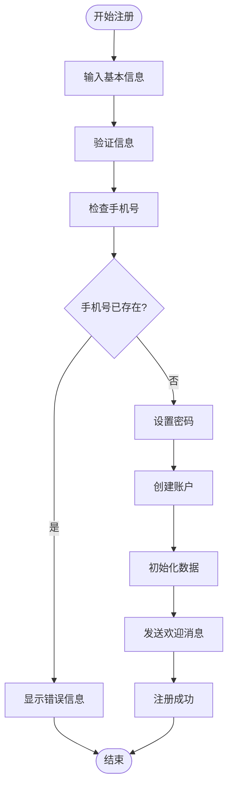

#### 订单积分计算流程

```mermaid
flowchart TD
OrderComplete[订单完成] --> CalcAmount[计算订单金额]
CalcAmount --> CalcPointRate[获取积分比率]
CalcPointRate --> CalcBasePoint[计算基础积分]
CalcBasePoint --> ApplyDiscount[应用折扣]
ApplyDiscount --> CheckMaxLimit[检查最高限制]
CheckMaxLimit --> LimitPoint[应用上限限制]
LimitPoint --> AddPoint[增加用户积分]
AddPoint --> RecordPoint[记录积分明细]
RecordPoint --> UpdateTotal[更新总积分]
UpdateTotal --> CheckLevelUp[检查升级]
CheckLevelUp --> LevelUp{需要升级?}
LevelUp --> |是| Upgrade[执行升级]
LevelUp --> |否| Complete[流程完成]
Upgrade --> Complete
```