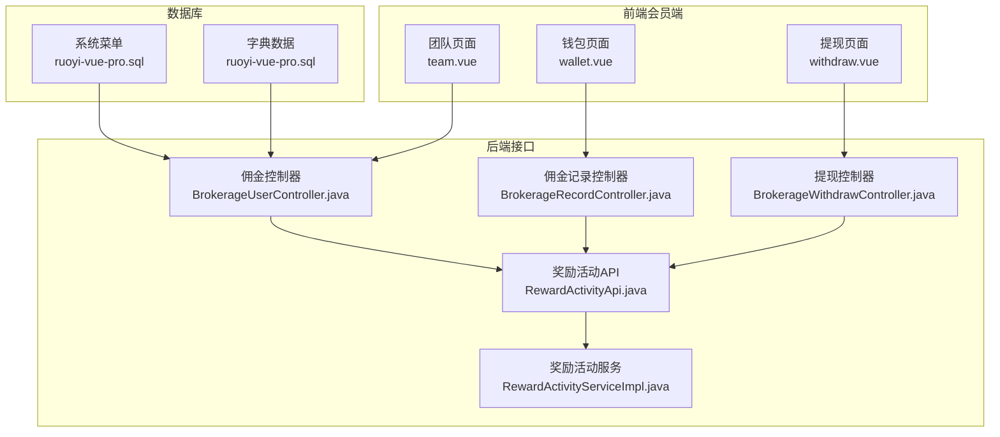
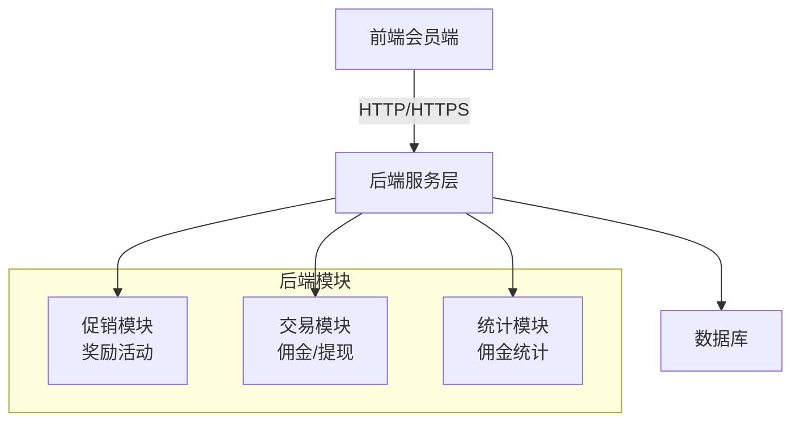
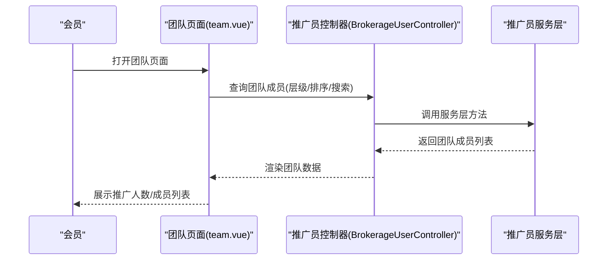
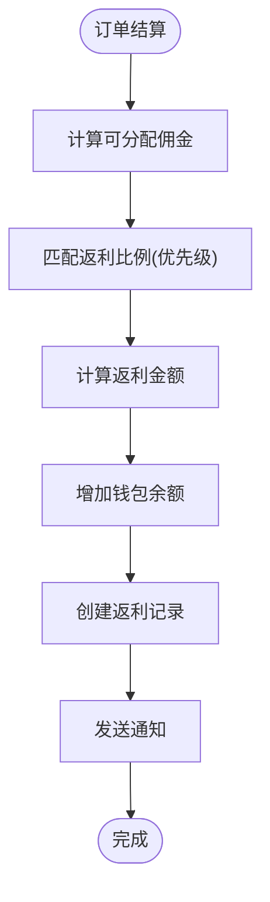
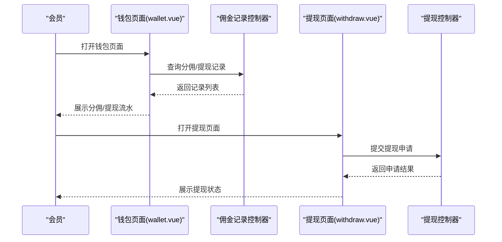
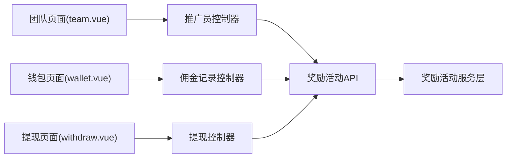

# 推荐奖励系统

<cite>
**本文引用的文件**
- [CPS系统PRD文档.md](file://docs/CPS系统PRD文档.md)
- [team.vue](file://frontend/mall-uniapp/pages/commission/team.vue)
- [wallet.vue](file://frontend/mall-uniapp/pages/commission/wallet.vue)
- [withdraw.vue](file://frontend/mall-uniapp/pages/commission/withdraw.vue)
- [ruoyi-vue-pro.sql](file://backend/sql/mysql/ruoyi-vue-pro.sql)
- [RewardActivityApi.java](file://backend/yudao-module-mall/yudao-module-promotion/src/main/java/cn/iocoder/yudao/module/promotion/api/reward/RewardActivityApi.java)
- [RewardActivityApiImpl.java](file://backend/yudao-module-mall/yudao-module-promotion/src/main/java/cn/iocoder/yudao/module/promotion/api/reward/RewardActivityApiImpl.java)
- [RewardActivityService.java](file://backend/yudao-module-mall/yudao-module-promotion/src/main/java/cn/iocoder/yudao/module/promotion/service/reward/RewardActivityService.java)
- [RewardActivityServiceImpl.java](file://backend/yudao-module-mall/yudao-module-promotion/src/main/java/cn/iocoder/yudao/module/promotion/service/reward/RewardActivityServiceImpl.java)
- [RewardActivityController.java](file://backend/yudao-module-mall/yudao-module-promotion/src/main/java/cn/iocoder/yudao/module/promotion/controller/admin/reward/RewardActivityController.java)
- [AppRewardActivityController.java](file://backend/yudao-module-mall/yudao-module-promotion/src/main/java/cn/iocoder/yudao/module/promotion/controller/app/reward/AppRewardActivityController.java)
- [RewardActivityDO.java](file://backend/yudao-module-mall/yudao-module-promotion/src/main/java/cn/iocoder/yudao/module/promotion/dal/dataobject/reward/RewardActivityDO.java)
- [RewardActivityMapper.java](file://backend/yudao-module-mall/yudao-module-promotion/src/main/java/cn/iocoder/yudao/module/promotion/dal/mysql/reward/RewardActivityMapper.java)
- [BrokerageRecordController.java](file://backend/yudao-module-mall/yudao-module-trade/src/main/java/cn/iocoder/yudao/module/trade/controller/admin/brokerage/BrokerageRecordController.java)
- [BrokerageUserController.java](file://backend/yudao-module-mall/yudao-module-trade/src/main/java/cn/iocoder/yudao/module/trade/controller/admin/brokerage/BrokerageUserController.java)
- [BrokerageWithdrawController.java](file://backend/yudao-module-mall/yudao-module-trade/src/main/java/cn/iocoder/yudao/module/trade/controller/admin/brokerage/BrokerageWithdrawController.java)
- [AppBrokerageRecordController.java](file://backend/yudao-module-mall/yudao-module-trade/src/main/java/cn/iocoder/yudao/module/trade/controller/app/brokerage/AppBrokerageRecordController.java)
- [AppBrokerageUserController.java](file://backend/yudao-module-mall/yudao-module-trade/src/main/java/cn/iocoder/yudao/module/trade/controller/app/brokerage/AppBrokerageUserController.java)
- [AppBrokerageWithdrawController.java](file://backend/yudao-module-mall/yudao-module-trade/src/main/java/cn/iocoder/yudao/module/trade/controller/app/brokerage/AppBrokerageWithdrawController.java)
</cite>

## 目录
1. [简介](#简介)
2. [项目结构](#项目结构)
3. [核心组件](#核心组件)
4. [架构总览](#架构总览)
5. [详细组件分析](#详细组件分析)
6. [依赖分析](#依赖分析)
7. [性能考量](#性能考量)
8. [故障排查指南](#故障排查指南)
9. [结论](#结论)
10. [附录](#附录)

## 简介
本文件面向“推荐奖励系统”的综合文档，围绕推荐关系建立、推荐奖励计算、奖励发放机制、团队奖励规则等核心功能展开，结合前端页面与后端接口，系统化阐述推荐层级设计、奖励比例配置、奖励条件设置、奖励结算周期等业务逻辑，并覆盖推荐记录管理、奖励流水、团队统计、推荐关系图谱等实现要点。文档同时提供完整的推荐奖励 API 接口说明、奖励规则配置示例与业务流程图，帮助开发者快速构建完善的推荐激励体系。

## 项目结构
推荐奖励系统由前端会员端页面与后端接口共同组成，前端包含团队、钱包、提现等页面；后端提供奖励活动、佣金记录、推广员管理、提现管理等控制器与服务层实现。数据库层面包含系统菜单与字典数据，支撑推广关系绑定模式、启用条件等配置。

**图表来源**
- [team.vue:1-605](file://frontend/mall-uniapp/pages/commission/team.vue#L1-L605)
- [wallet.vue:1-644](file://frontend/mall-uniapp/pages/commission/wallet.vue#L1-L644)
- [withdraw.vue:1-487](file://frontend/mall-uniapp/pages/commission/withdraw.vue#L1-L487)
- [RewardActivityApi.java](file://backend/yudao-module-mall/yudao-module-promotion/src/main/java/cn/iocoder/yudao/module/promotion/api/reward/RewardActivityApi.java)
- [RewardActivityServiceImpl.java](file://backend/yudao-module-mall/yudao-module-promotion/src/main/java/cn/iocoder/yudao/module/promotion/service/reward/RewardActivityServiceImpl.java)
- [BrokerageUserController.java](file://backend/yudao-module-mall/yudao-module-trade/src/main/java/cn/iocoder/yudao/module/trade/controller/admin/brokerage/BrokerageUserController.java)
- [BrokerageRecordController.java](file://backend/yudao-module-mall/yudao-module-trade/src/main/java/cn/iocoder/yudao/module/trade/controller/admin/brokerage/BrokerageRecordController.java)
- [BrokerageWithdrawController.java](file://backend/yudao-module-mall/yudao-module-trade/src/main/java/cn/iocoder/yudao/module/trade/controller/admin/brokerage/BrokerageWithdrawController.java)
- [ruoyi-vue-pro.sql:1838-1840](file://backend/sql/mysql/ruoyi-vue-pro.sql#L1838-L1840)

**章节来源**
- [team.vue:1-605](file://frontend/mall-uniapp/pages/commission/team.vue#L1-L605)
- [wallet.vue:1-644](file://frontend/mall-uniapp/pages/commission/wallet.vue#L1-L644)
- [withdraw.vue:1-487](file://frontend/mall-uniapp/pages/commission/withdraw.vue#L1-L487)
- [ruoyi-vue-pro.sql:1838-1840](file://backend/sql/mysql/ruoyi-vue-pro.sql#L1838-L1840)

## 核心组件
- 推荐关系建立与管理
  - 推广员绑定模式与启用条件：通过系统字典与菜单配置，支持首次绑定、注册绑定、覆盖绑定等模式，以及后台手动设置推广员的启用条件。
  - 推广员变更与清理：提供修改推广员、清除推广员等管理能力。
- 推荐奖励计算与发放
  - 奖励活动与比例配置：通过奖励活动 API 与服务层，支持按会员等级、平台、个人专属等多维配置奖励比例。
  - 佣金结算与入账：订单结算后，系统计算可分配佣金与返利金额，增加会员钱包余额并创建返利记录。
- 团队奖励与统计
  - 团队页面支持一级/二级层级切换、搜索与排序，展示团队成员数量、订单数与佣金金额。
  - 佣金流水与提现：钱包页面展示分佣与提现记录，支持按时间筛选与分页加载。
- 提现流程与风控
  - 提现页面支持多种提现方式与账户信息录入，遵循最低提现金额、冻结期等规则。
  - 管理后台提供提现审核、异常订单处理、风控配置等能力。

**章节来源**
- [CPS系统PRD文档.md:760-824](file://docs/CPS系统PRD文档.md#L760-L824)
- [team.vue:1-605](file://frontend/mall-uniapp/pages/commission/team.vue#L1-L605)
- [wallet.vue:1-644](file://frontend/mall-uniapp/pages/commission/wallet.vue#L1-L644)
- [withdraw.vue:1-487](file://frontend/mall-uniapp/pages/commission/withdraw.vue#L1-L487)
- [ruoyi-vue-pro.sql:1838-1840](file://backend/sql/mysql/ruoyi-vue-pro.sql#L1838-L1840)

## 架构总览
推荐奖励系统采用前后端分离架构，前端会员端通过接口与后端交互，后端提供奖励活动、佣金记录、推广员与提现管理等控制器与服务层，数据库通过系统菜单与字典数据支撑配置能力。

**图表来源**
- [RewardActivityApi.java](file://backend/yudao-module-mall/yudao-module-promotion/src/main/java/cn/iocoder/yudao/module/promotion/api/reward/RewardActivityApi.java)
- [RewardActivityServiceImpl.java](file://backend/yudao-module-mall/yudao-module-promotion/src/main/java/cn/iocoder/yudao/module/promotion/service/reward/RewardActivityServiceImpl.java)
- [BrokerageUserController.java](file://backend/yudao-module-mall/yudao-module-trade/src/main/java/cn/iocoder/yudao/module/trade/controller/admin/brokerage/BrokerageUserController.java)
- [BrokerageRecordController.java](file://backend/yudao-module-mall/yudao-module-trade/src/main/java/cn/iocoder/yudao/module/trade/controller/admin/brokerage/BrokerageRecordController.java)
- [BrokerageWithdrawController.java](file://backend/yudao-module-mall/yudao-module-trade/src/main/java/cn/iocoder/yudao/module/trade/controller/admin/brokerage/BrokerageWithdrawController.java)

## 详细组件分析

### 推荐关系建立与团队统计
- 推广员绑定模式
  - 支持“首次绑定”“注册绑定”“覆盖绑定”等模式，后台可设置“仅可后台手动设置推广员”的启用条件。
  - 系统菜单包含“修改推广员”“清除推广员”等权限点，保障推广关系的可控变更。
- 团队统计与展示
  - 团队页面支持按一级/二级层级切换，提供昵称搜索、团队人数/订单数/佣金金额排序，展示推广人数概览与成员列表。
  - 通过接口分页加载团队成员数据，支持上拉加载更多。

**图表来源**
- [team.vue:303-354](file://frontend/mall-uniapp/pages/commission/team.vue#L303-L354)
- [BrokerageUserController.java](file://backend/yudao-module-mall/yudao-module-trade/src/main/java/cn/iocoder/yudao/module/trade/controller/admin/brokerage/BrokerageUserController.java)

**章节来源**
- [team.vue:1-605](file://frontend/mall-uniapp/pages/commission/team.vue#L1-L605)
- [ruoyi-vue-pro.sql:1838-1840](file://backend/sql/mysql/ruoyi-vue-pro.sql#L1838-L1840)

### 推荐奖励计算与发放
- 奖励活动与比例配置
  - 奖励活动 API 与服务层提供奖励活动的创建、更新、分页查询等能力，支持按会员等级、平台、个人专属等维度配置返利比例。
  - 返利比例优先级：个人专属配置（平台/全平台）> 等级+平台组合 > 等级全平台 > 平台默认 > 全局默认。
- 佣金结算与入账
  - 订单结算后，系统计算可分配佣金与返利金额，增加会员钱包余额并创建返利记录，通知会员。

**图表来源**
- [CPS系统PRD文档.md:760-824](file://docs/CPS系统PRD文档.md#L760-L824)
- [RewardActivityApi.java](file://backend/yudao-module-mall/yudao-module-promotion/src/main/java/cn/iocoder/yudao/module/promotion/api/reward/RewardActivityApi.java)
- [RewardActivityServiceImpl.java](file://backend/yudao-module-mall/yudao-module-promotion/src/main/java/cn/iocoder/yudao/module/promotion/service/reward/RewardActivityServiceImpl.java)

**章节来源**
- [CPS系统PRD文档.md:760-824](file://docs/CPS系统PRD文档.md#L760-L824)

### 奖励流水与钱包管理
- 钱包页面
  - 展示当前佣金、冻结佣金、可提现佣金，支持切换“分佣/提现”标签页，按日期范围筛选，分页加载记录。
  - 支持将佣金转入余额钱包的操作。
- 提现流程
  - 提现页面支持多种提现方式与账户信息录入，校验最低提现金额与冻结期，提交后进入审核流程，审核通过后打款并更新状态。

**图表来源**
- [wallet.vue:239-382](file://frontend/mall-uniapp/pages/commission/wallet.vue#L239-L382)
- [withdraw.vue:207-265](file://frontend/mall-uniapp/pages/commission/withdraw.vue#L207-L265)
- [BrokerageRecordController.java](file://backend/yudao-module-mall/yudao-module-trade/src/main/java/cn/iocoder/yudao/module/trade/controller/admin/brokerage/BrokerageRecordController.java)
- [BrokerageWithdrawController.java](file://backend/yudao-module-mall/yudao-module-trade/src/main/java/cn/iocoder/yudao/module/trade/controller/admin/brokerage/BrokerageWithdrawController.java)

**章节来源**
- [wallet.vue:1-644](file://frontend/mall-uniapp/pages/commission/wallet.vue#L1-L644)
- [withdraw.vue:1-487](file://frontend/mall-uniapp/pages/commission/withdraw.vue#L1-L487)

### 推荐奖励 API 接口说明
- 会员端接口
  - 商品搜索、多平台比价、商品详情、商品推荐、生成推广链接、我的订单列表、订单详情、返利汇总、返利明细、发起提现、提现记录、搜索历史、热门搜索。
- 管理端接口
  - 平台配置管理、推广位管理、返利配置管理、会员专属返利、订单管理、返利记录、提现审核、数据看板、平台统计、趋势统计等。

**章节来源**
- [CPS系统PRD文档.md:923-958](file://docs/CPS系统PRD文档.md#L923-L958)

## 依赖分析
- 前端依赖后端控制器与服务层，通过 HTTP 接口获取团队成员、佣金记录、提现状态等数据。
- 后端模块间协作：促销模块负责奖励活动配置，交易模块负责佣金与提现管理，统计模块提供佣金统计能力。
- 数据库支撑：系统菜单与字典数据为推广关系绑定模式与启用条件提供配置基础。

**图表来源**
- [team.vue:303-354](file://frontend/mall-uniapp/pages/commission/team.vue#L303-L354)
- [wallet.vue:239-382](file://frontend/mall-uniapp/pages/commission/wallet.vue#L239-L382)
- [withdraw.vue:207-265](file://frontend/mall-uniapp/pages/commission/withdraw.vue#L207-L265)
- [RewardActivityApi.java](file://backend/yudao-module-mall/yudao-module-promotion/src/main/java/cn/iocoder/yudao/module/promotion/api/reward/RewardActivityApi.java)
- [RewardActivityServiceImpl.java](file://backend/yudao-module-mall/yudao-module-promotion/src/main/java/cn/iocoder/yudao/module/promotion/service/reward/RewardActivityServiceImpl.java)
- [BrokerageUserController.java](file://backend/yudao-module-mall/yudao-module-trade/src/main/java/cn/iocoder/yudao/module/trade/controller/admin/brokerage/BrokerageUserController.java)
- [BrokerageRecordController.java](file://backend/yudao-module-mall/yudao-module-trade/src/main/java/cn/iocoder/yudao/module/trade/controller/admin/brokerage/BrokerageRecordController.java)
- [BrokerageWithdrawController.java](file://backend/yudao-module-mall/yudao-module-trade/src/main/java/cn/iocoder/yudao/module/trade/controller/admin/brokerage/BrokerageWithdrawController.java)

**章节来源**
- [team.vue:1-605](file://frontend/mall-uniapp/pages/commission/team.vue#L1-L605)
- [wallet.vue:1-644](file://frontend/mall-uniapp/pages/commission/wallet.vue#L1-L644)
- [withdraw.vue:1-487](file://frontend/mall-uniapp/pages/commission/withdraw.vue#L1-L487)

## 性能考量
- 搜索与比价性能：单平台搜索响应时间与多平台比价响应时间应满足 P99 要求，确保用户体验。
- 并发能力：支持高并发查询与订单同步，保证系统稳定性。
- 缓存命中：重复搜索应具备高缓存命中率，降低后端压力。

**章节来源**
- [CPS系统PRD文档.md:972-981](file://docs/CPS系统PRD文档.md#L972-L981)

## 故障排查指南
- 推广关系异常
  - 检查推广员绑定模式与启用条件配置，确认是否存在覆盖绑定或后台手动设置的情况。
  - 使用“修改推广员”“清除推广员”等菜单权限进行修正。
- 提现异常
  - 校验最低提现金额、冻结期、提现方式与账户信息是否符合要求。
  - 查看提现记录状态，确认审核与打款流程是否正常。
- 订单同步与返利入账
  - 检查订单同步延迟与归因成功率，关注平台结算后入账时间是否符合预期。

**章节来源**
- [ruoyi-vue-pro.sql:1838-1840](file://backend/sql/mysql/ruoyi-vue-pro.sql#L1838-L1840)
- [CPS系统PRD文档.md:982-988](file://docs/CPS系统PRD文档.md#L982-L988)

## 结论
推荐奖励系统通过清晰的推荐关系建立、灵活的奖励比例配置、严谨的结算与入账流程、完善的团队统计与提现管理，形成了完整的推荐激励闭环。前端页面与后端接口协同，配合数据库配置能力，能够支撑多平台、多层级的推荐场景。建议在实际落地中重点关注比例优先级、结算周期与风控策略，确保系统稳定与合规运营。

## 附录
- 术语表
  - CPS：按销售计费的推广模式
  - 佣金：CPS平台支付给推广者的销售提成
  - 返利：系统将佣金的一部分返还给下单会员
  - PID：推广位标识，用于追踪订单来源
  - 转链：将普通商品链接转换为含推广追踪参数的链接
  - 归因：将CPS订单关联到具体会员的过程
  - 可分配佣金：佣金扣除平台技术服务费后，可用于分配的部分

**章节来源**
- [CPS系统PRD文档.md:1085-1099](file://docs/CPS系统PRD文档.md#L1085-L1099)