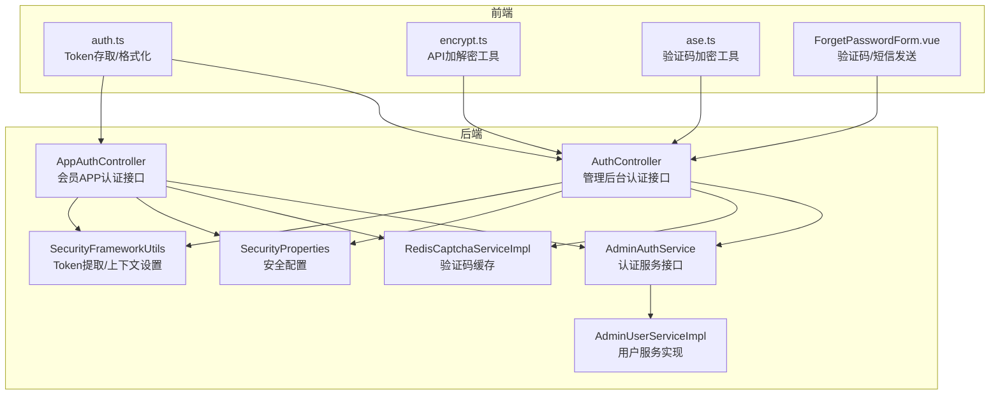
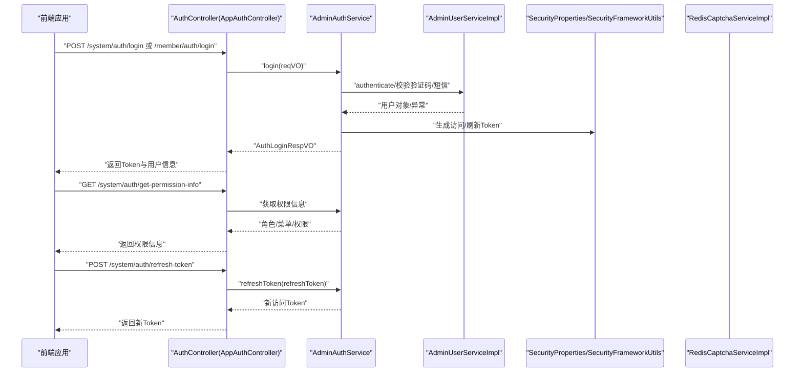
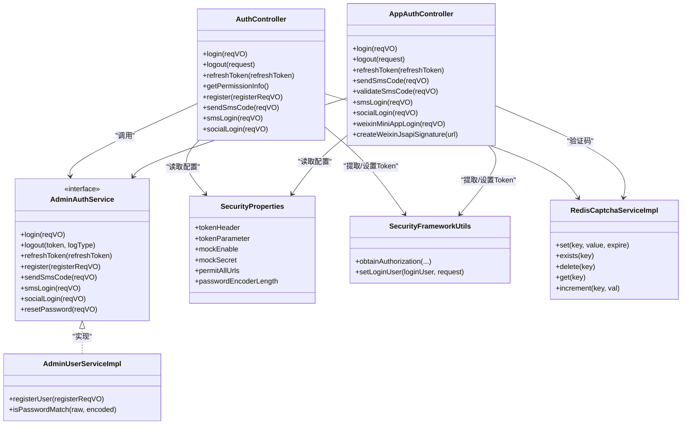

# 用户注册与登录

<cite>
**本文引用的文件**   
- [AuthController.java](file://backend/yudao-module-system/src/main/java/cn/iocoder/yudao/module/system/controller/admin/auth/AuthController.java)
- [AppAuthController.java](file://backend/yudao-module-member/src/main/java/cn/iocoder/yudao/module/member/controller/app/auth/AppAuthController.java)
- [AdminAuthService.java](file://backend/yudao-module-system/src/main/java/cn/iocoder/yudao/module/system/service/auth/AdminAuthService.java)
- [AdminUserServiceImpl.java](file://backend/yudao-module-system/src/main/java/cn/iocoder/yudao/module/system/service/user/AdminUserServiceImpl.java)
- [AuthLoginReqVO.java](file://backend/yudao-module-system/src/main/java/cn/iocoder/yudao/module/system/controller/admin/auth/vo/AuthLoginReqVO.java)
- [AuthRegisterReqVO.java](file://backend/yudao-module-system/src/main/java/cn/iocoder/yudao/module/system/controller/admin/auth/vo/AuthRegisterReqVO.java)
- [AuthSmsSendReqVO.java](file://backend/yudao-module-system/src/main/java/cn/iocoder/yudao/module/system/controller/admin/auth/vo/AuthSmsSendReqVO.java)
- [SecurityProperties.java](file://backend/yudao-framework/yudao-spring-boot-starter-security/src/main/java/cn/iocoder/yudao/framework/security/config/SecurityProperties.java)
- [SecurityFrameworkUtils.java](file://backend/yudao-framework/yudao-spring-boot-starter-security/src/main/java/cn/iocoder/yudao/framework/security/core/util/SecurityFrameworkUtils.java)
- [RedisCaptchaServiceImpl.java](file://backend/yudao-module-system/src/main/java/cn/iocoder/yudao/module/system/framework/captcha/core/RedisCaptchaServiceImpl.java)
- [auth.ts](file://frontend/admin-vue3/src/utils/auth.ts)
- [encrypt.ts](file://frontend/admin-vue3/src/utils/encrypt.ts)
- [ase.ts](file://frontend/admin-vue3/src/components/Verifition/src/utils/ase.ts)
- [ForgetPasswordForm.vue](file://frontend/admin-vue3/src/views/Login/components/ForgetPasswordForm.vue)
</cite>

## 目录
1. [简介](#简介)
2. [项目结构](#项目结构)
3. [核心组件](#核心组件)
4. [架构总览](#架构总览)
5. [详细组件分析](#详细组件分析)
6. [依赖关系分析](#依赖关系分析)
7. [性能考量](#性能考量)
8. [故障排查指南](#故障排查指南)
9. [结论](#结论)
10. [附录](#附录)

## 简介
本文件面向开发者，系统性梳理用户注册与登录功能的实现与使用，覆盖以下主题：
- 用户注册流程与字段校验
- 登录验证机制与会话管理
- 密码加密策略与配置
- 验证码系统（图形验证码与短信验证码）
- 第三方登录（社交授权）集成
- Token 生成、携带、刷新与登出
- API 接口定义、请求/响应示例与错误处理
- 最佳实践与安全建议

## 项目结构
后端采用模块化分层：
- 控制器层：管理后台与会员 APP 的认证接口分别位于不同模块的控制器中
- 服务层：认证与用户服务接口与实现
- 安全框架：统一的安全属性、Token 提取与上下文设置
- 验证码：基于 Redis 的验证码缓存实现
- 前端：登录/注册页面、Token 管理、加密工具与验证码加密

图表来源
- [AuthController.java:66-176](file://backend/yudao-module-system/src/main/java/cn/iocoder/yudao/module/system/controller/admin/auth/AuthController.java#L66-L176)
- [AppAuthController.java:45-135](file://backend/yudao-module-member/src/main/java/cn/iocoder/yudao/module/member/controller/app/auth/AppAuthController.java#L45-L135)
- [AdminAuthService.java:15-88](file://backend/yudao-module-system/src/main/java/cn/iocoder/yudao/module/system/service/auth/AdminAuthService.java#L15-L88)
- [AdminUserServiceImpl.java:123-144](file://backend/yudao-module-system/src/main/java/cn/iocoder/yudao/module/system/service/user/AdminUserServiceImpl.java#L123-L144)
- [RedisCaptchaServiceImpl.java:14-49](file://backend/yudao-module-system/src/main/java/cn/iocoder/yudao/module/system/framework/captcha/core/RedisCaptchaServiceImpl.java#L14-L49)
- [SecurityProperties.java:12-51](file://backend/yudao-framework/yudao-spring-boot-starter-security/src/main/java/cn/iocoder/yudao/framework/security/config/SecurityProperties.java#L12-L51)
- [SecurityFrameworkUtils.java:24-143](file://backend/yudao-framework/yudao-spring-boot-starter-security/src/main/java/cn/iocoder/yudao/framework/security/core/util/SecurityFrameworkUtils.java#L24-L143)
- [auth.ts:10-37](file://frontend/admin-vue3/src/utils/auth.ts#L10-L37)
- [encrypt.ts:9-14](file://frontend/admin-vue3/src/utils/encrypt.ts#L9-L14)
- [ase.ts:6-13](file://frontend/admin-vue3/src/components/Verifition/src/utils/ase.ts#L6-L13)
- [ForgetPasswordForm.vue:199-225](file://frontend/admin-vue3/src/views/Login/components/ForgetPasswordForm.vue#L199-L225)

章节来源
- [AuthController.java:66-176](file://backend/yudao-module-system/src/main/java/cn/iocoder/yudao/module/system/controller/admin/auth/AuthController.java#L66-L176)
- [AppAuthController.java:45-135](file://backend/yudao-module-member/src/main/java/cn/iocoder/yudao/module/member/controller/app/auth/AppAuthController.java#L45-L135)
- [AdminAuthService.java:15-88](file://backend/yudao-module-system/src/main/java/cn/iocoder/yudao/module/system/service/auth/AdminAuthService.java#L15-L88)
- [AdminUserServiceImpl.java:123-144](file://backend/yudao-module-system/src/main/java/cn/iocoder/yudao/module/system/service/user/AdminUserServiceImpl.java#L123-L144)
- [RedisCaptchaServiceImpl.java:14-49](file://backend/yudao-module-system/src/main/java/cn/iocoder/yudao/module/system/framework/captcha/core/RedisCaptchaServiceImpl.java#L14-L49)
- [SecurityProperties.java:12-51](file://backend/yudao-framework/yudao-spring-boot-starter-security/src/main/java/cn/iocoder/yudao/framework/security/config/SecurityProperties.java#L12-L51)
- [SecurityFrameworkUtils.java:24-143](file://backend/yudao-framework/yudao-spring-boot-starter-security/src/main/java/cn/iocoder/yudao/framework/security/core/util/SecurityFrameworkUtils.java#L24-L143)
- [auth.ts:10-37](file://frontend/admin-vue3/src/utils/auth.ts#L10-L37)
- [encrypt.ts:9-14](file://frontend/admin-vue3/src/utils/encrypt.ts#L9-L14)
- [ase.ts:6-13](file://frontend/admin-vue3/src/components/Verifition/src/utils/ase.ts#L6-L13)
- [ForgetPasswordForm.vue:199-225](file://frontend/admin-vue3/src/views/Login/components/ForgetPasswordForm.vue#L199-L225)

## 核心组件
- 管理后台认证控制器：提供账号密码登录、注册、刷新 Token、登出、短信登录、发送短信验证码、重置密码、社交授权跳转与快捷登录等接口
- 会员 APP 认证控制器：提供手机号+密码登录、刷新 Token、登出、短信登录、发送/校验短信验证码、社交授权跳转与快捷登录、微信小程序一键登录、微信 JS-SDK 签名等接口
- 认证服务接口：定义登录、注册、刷新 Token、短信验证码发送与登录、社交登录、重置密码等能力契约
- 用户服务实现：负责注册校验（是否开启注册、租户配额、账号唯一性）、密码加密、登录成功后的信息返回
- 安全配置与工具：Token 请求头/参数名、Mock 密钥、免登录白名单、PasswordEncoder 复杂度；从请求中提取 Token、设置登录用户上下文
- 验证码服务：基于 Redis 存储验证码，支持过期、增减计数等
- 前端工具：Token 存取与格式化、API 加解密、验证码加密、忘记密码流程（含验证码与短信）

章节来源
- [AuthController.java:66-176](file://backend/yudao-module-system/src/main/java/cn/iocoder/yudao/module/system/controller/admin/auth/AuthController.java#L66-L176)
- [AppAuthController.java:45-135](file://backend/yudao-module-member/src/main/java/cn/iocoder/yudao/module/member/controller/app/auth/AppAuthController.java#L45-L135)
- [AdminAuthService.java:15-88](file://backend/yudao-module-system/src/main/java/cn/iocoder/yudao/module/system/service/auth/AdminAuthService.java#L15-L88)
- [AdminUserServiceImpl.java:123-144](file://backend/yudao-module-system/src/main/java/cn/iocoder/yudao/module/system/service/user/AdminUserServiceImpl.java#L123-L144)
- [SecurityProperties.java:12-51](file://backend/yudao-framework/yudao-spring-boot-starter-security/src/main/java/cn/iocoder/yudao/framework/security/config/SecurityProperties.java#L12-L51)
- [SecurityFrameworkUtils.java:24-143](file://backend/yudao-framework/yudao-spring-boot-starter-security/src/main/java/cn/iocoder/yudao/framework/security/core/util/SecurityFrameworkUtils.java#L24-L143)
- [RedisCaptchaServiceImpl.java:14-49](file://backend/yudao-module-system/src/main/java/cn/iocoder/yudao/module/system/framework/captcha/core/RedisCaptchaServiceImpl.java#L14-L49)
- [auth.ts:10-37](file://frontend/admin-vue3/src/utils/auth.ts#L10-L37)
- [encrypt.ts:9-14](file://frontend/admin-vue3/src/utils/encrypt.ts#L9-L14)
- [ase.ts:6-13](file://frontend/admin-vue3/src/components/Verifition/src/utils/ase.ts#L6-L13)
- [ForgetPasswordForm.vue:199-225](file://frontend/admin-vue3/src/views/Login/components/ForgetPasswordForm.vue#L199-L225)

## 架构总览
下图展示了从客户端发起登录/注册请求，到后端认证、Token 返回与前端存储的完整链路。

图表来源
- [AuthController.java:66-118](file://backend/yudao-module-system/src/main/java/cn/iocoder/yudao/module/system/controller/admin/auth/AuthController.java#L66-L118)
- [AppAuthController.java:45-70](file://backend/yudao-module-member/src/main/java/cn/iocoder/yudao/module/member/controller/app/auth/AppAuthController.java#L45-L70)
- [AdminAuthService.java:15-88](file://backend/yudao-module-system/src/main/java/cn/iocoder/yudao/module/system/service/auth/AdminAuthService.java#L15-L88)
- [AdminUserServiceImpl.java:123-144](file://backend/yudao-module-system/src/main/java/cn/iocoder/yudao/module/system/service/user/AdminUserServiceImpl.java#L123-L144)
- [SecurityProperties.java:12-51](file://backend/yudao-framework/yudao-spring-boot-starter-security/src/main/java/cn/iocoder/yudao/framework/security/config/SecurityProperties.java#L12-L51)
- [SecurityFrameworkUtils.java:24-143](file://backend/yudao-framework/yudao-spring-boot-starter-security/src/main/java/cn/iocoder/yudao/framework/security/core/util/SecurityFrameworkUtils.java#L24-L143)

## 详细组件分析

### 管理后台认证接口
- 登录：账号密码登录，支持可选的社交授权参数
- 注册：基于配置开关与租户配额校验后创建用户并加密密码
- 刷新 Token：根据刷新令牌换取新的访问令牌
- 登出：基于请求中的 Token 执行登出
- 权限信息：获取当前登录用户的用户、角色、菜单与权限
- 短信登录与验证码：发送/校验短信验证码
- 社交登录：授权跳转与快捷登录

章节来源
- [AuthController.java:66-176](file://backend/yudao-module-system/src/main/java/cn/iocoder/yudao/module/system/controller/admin/auth/AuthController.java#L66-L176)

### 会员 APP 认证接口
- 登录：手机号+密码登录
- 刷新 Token：根据刷新令牌换取新的访问令牌
- 登出：基于请求中的 Token 执行登出
- 短信登录与验证码：发送/校验短信验证码
- 社交登录：授权跳转与快捷登录
- 微信小程序一键登录与 JS-SDK 签名

章节来源
- [AppAuthController.java:45-135](file://backend/yudao-module-member/src/main/java/cn/iocoder/yudao/module/member/controller/app/auth/AppAuthController.java#L45-L135)

### 认证服务接口与实现
- authenticate：账号密码认证
- login：登录入口，返回登录结果
- logout：基于 Token 的登出
- sendSmsCode/smsLogin：短信验证码发送与登录
- socialLogin：社交授权码登录
- refreshToken：刷新访问令牌
- register：注册用户（含开关与配额校验、唯一性校验、密码加密）
- resetPassword：重置密码

章节来源
- [AdminAuthService.java:15-88](file://backend/yudao-module-system/src/main/java/cn/iocoder/yudao/module/system/service/auth/AdminAuthService.java#L15-L88)
- [AdminUserServiceImpl.java:123-144](file://backend/yudao-module-system/src/main/java/cn/iocoder/yudao/module/system/service/user/AdminUserServiceImpl.java#L123-L144)

### 用户信息字段与校验
- 管理后台登录请求体：账号、密码、验证码相关参数、可选社交授权参数
- 管理后台注册请求体：账号、昵称、密码、验证码相关参数
- 短信发送请求体：手机号、短信场景枚举

章节来源
- [AuthLoginReqVO.java:22-57](file://backend/yudao-module-system/src/main/java/cn/iocoder/yudao/module/system/controller/admin/auth/vo/AuthLoginReqVO.java#L22-L57)
- [AuthRegisterReqVO.java:12-29](file://backend/yudao-module-system/src/main/java/cn/iocoder/yudao/module/system/controller/admin/auth/vo/AuthRegisterReqVO.java#L12-L29)
- [AuthSmsSendReqVO.java:20-33](file://backend/yudao-module-system/src/main/java/cn/iocoder/yudao/module/system/controller/admin/auth/vo/AuthSmsSendReqVO.java#L20-L33)

### 密码加密策略
- 使用 Spring Security 的 PasswordEncoder 进行密码加密与匹配
- 加密复杂度可通过安全配置项调整
- 用户密码在注册与修改时均进行加密存储

章节来源
- [AdminUserServiceImpl.java:538-550](file://backend/yudao-module-system/src/main/java/cn/iocoder/yudao/module/system/service/user/AdminUserServiceImpl.java#L538-L550)
- [SecurityProperties.java:48-51](file://backend/yudao-framework/yudao-spring-boot-starter-security/src/main/java/cn/iocoder/yudao/framework/security/config/SecurityProperties.java#L48-L51)

### 验证码系统
- 图形验证码：基于 anji-captcha，使用 Redis 存储验证码、过期时间与计数
- 前端验证码加密：对验证码输入进行 AES 加密传输
- 短信验证码：发送/校验短信验证码（APP 与管理后台分别提供接口）

章节来源
- [RedisCaptchaServiceImpl.java:14-49](file://backend/yudao-module-system/src/main/java/cn/iocoder/yudao/module/system/framework/captcha/core/RedisCaptchaServiceImpl.java#L14-L49)
- [ase.ts:6-13](file://frontend/admin-vue3/src/components/Verifition/src/utils/ase.ts#L6-L13)
- [ForgetPasswordForm.vue:199-225](file://frontend/admin-vue3/src/views/Login/components/ForgetPasswordForm.vue#L199-L225)

### 第三方登录（社交授权）集成
- 授权跳转：生成授权 URL，支持指定回调地址
- 快捷登录：使用授权码进行快捷登录
- 微信 JS-SDK 签名：生成前端初始化所需签名

章节来源
- [AuthController.java:156-174](file://backend/yudao-module-system/src/main/java/cn/iocoder/yudao/module/system/controller/admin/auth/AuthController.java#L156-L174)
- [AppAuthController.java:99-133](file://backend/yudao-module-member/src/main/java/cn/iocoder/yudao/module/member/controller/app/auth/AppAuthController.java#L99-L133)

### 会话管理与 Token
- Token 提取：从请求头或参数中提取访问令牌
- Token 设置：将当前登录用户写入安全上下文与请求属性
- 访问令牌与刷新令牌：登录成功返回访问/刷新令牌；刷新接口使用刷新令牌换取新访问令牌
- 登出：基于 Token 执行登出

章节来源
- [SecurityFrameworkUtils.java:24-143](file://backend/yudao-framework/yudao-spring-boot-starter-security/src/main/java/cn/iocoder/yudao/framework/security/core/util/SecurityFrameworkUtils.java#L24-L143)
- [AuthController.java:77-82](file://backend/yudao-module-system/src/main/java/cn/iocoder/yudao/module/system/controller/admin/auth/AuthController.java#L77-L82)
- [AppAuthController.java:55-61](file://backend/yudao-module-member/src/main/java/cn/iocoder/yudao/module/member/controller/app/auth/AppAuthController.java#L55-L61)
- [auth.ts:10-37](file://frontend/admin-vue3/src/utils/auth.ts#L10-L37)

### API 接口文档与示例

- 管理后台
  - POST /system/auth/login
    - 请求体：账号、密码、验证码相关参数、可选社交授权参数
    - 响应体：访问令牌、刷新令牌、用户信息
  - POST /system/auth/register
    - 请求体：账号、昵称、密码、验证码相关参数
    - 响应体：登录结果（包含访问/刷新令牌与用户信息）
  - POST /system/auth/refresh-token
    - 查询参数：refreshToken
    - 响应体：新的访问令牌与用户信息
  - POST /system/auth/logout
    - 请求头/参数：携带访问令牌
    - 响应体：布尔成功
  - GET /system/auth/get-permission-info
    - 响应体：用户、角色、菜单、权限
  - POST /system/auth/send-sms-code
    - 请求体：手机号、短信场景
    - 响应体：布尔成功
  - POST /system/auth/sms-login
    - 请求体：手机号、短信验证码
    - 响应体：登录结果
  - GET /system/auth/social-auth-redirect
    - 查询参数：type、redirectUri
    - 响应体：授权跳转 URL
  - POST /system/auth/social-login
    - 请求体：社交授权参数
    - 响应体：登录结果

- 会员 APP
  - POST /member/auth/login
    - 请求体：手机号、密码
    - 响应体：访问令牌、刷新令牌、用户信息
  - POST /member/auth/refresh-token
    - 查询参数：refreshToken
    - 响应体：新的访问令牌与用户信息
  - POST /member/auth/logout
    - 请求头/参数：携带访问令牌
    - 响应体：布尔成功
  - POST /member/auth/send-sms-code
    - 请求体：手机号、短信场景
    - 响应体：布尔成功
  - POST /member/auth/validate-sms-code
    - 请求体：手机号、短信验证码
    - 响应体：布尔成功
  - POST /member/auth/sms-login
    - 请求体：手机号、短信验证码
    - 响应体：登录结果
  - GET /member/auth/social-auth-redirect
    - 查询参数：type、redirectUri
    - 响应体：授权跳转 URL
  - POST /member/auth/social-login
    - 请求体：社交授权参数
    - 响应体：登录结果
  - POST /member/auth/weixin-mini-app-login
    - 请求体：微信小程序登录参数
    - 响应体：登录结果
  - POST /member/auth/create-weixin-jsapi-signature
    - 查询参数：url
    - 响应体：微信 JS-SDK 签名

章节来源
- [AuthController.java:66-176](file://backend/yudao-module-system/src/main/java/cn/iocoder/yudao/module/system/controller/admin/auth/AuthController.java#L66-L176)
- [AppAuthController.java:45-135](file://backend/yudao-module-member/src/main/java/cn/iocoder/yudao/module/member/controller/app/auth/AppAuthController.java#L45-L135)

### 错误处理机制
- 参数校验：基于注解的参数校验（非空、长度、格式、枚举范围等）
- 业务异常：用户不存在、账号已存在、手机号已存在、邮箱已存在、密码错误、注册关闭、租户配额超限等
- 登录日志：登录/登出类型记录，便于审计与问题定位
- 前端提示：验证码/短信发送倒计时、错误消息提示

章节来源
- [AdminUserServiceImpl.java:405-457](file://backend/yudao-module-system/src/main/java/cn/iocoder/yudao/module/system/service/user/AdminUserServiceImpl.java#L405-L457)
- [AuthController.java:96-118](file://backend/yudao-module-system/src/main/java/cn/iocoder/yudao/module/system/controller/admin/auth/AuthController.java#L96-L118)
- [ForgetPasswordForm.vue:199-225](file://frontend/admin-vue3/src/views/Login/components/ForgetPasswordForm.vue#L199-L225)

## 依赖关系分析

图表来源
- [AuthController.java:66-176](file://backend/yudao-module-system/src/main/java/cn/iocoder/yudao/module/system/controller/admin/auth/AuthController.java#L66-L176)
- [AppAuthController.java:45-135](file://backend/yudao-module-member/src/main/java/cn/iocoder/yudao/module/member/controller/app/auth/AppAuthController.java#L45-L135)
- [AdminAuthService.java:15-88](file://backend/yudao-module-system/src/main/java/cn/iocoder/yudao/module/system/service/auth/AdminAuthService.java#L15-L88)
- [AdminUserServiceImpl.java:123-144](file://backend/yudao-module-system/src/main/java/cn/iocoder/yudao/module/system/service/user/AdminUserServiceImpl.java#L123-L144)
- [SecurityProperties.java:12-51](file://backend/yudao-framework/yudao-spring-boot-starter-security/src/main/java/cn/iocoder/yudao/framework/security/config/SecurityProperties.java#L12-L51)
- [SecurityFrameworkUtils.java:24-143](file://backend/yudao-framework/yudao-spring-boot-starter-security/src/main/java/cn/iocoder/yudao/framework/security/core/util/SecurityFrameworkUtils.java#L24-L143)
- [RedisCaptchaServiceImpl.java:14-49](file://backend/yudao-module-system/src/main/java/cn/iocoder/yudao/module/system/framework/captcha/core/RedisCaptchaServiceImpl.java#L14-L49)

## 性能考量
- 密码加密复杂度：通过配置项调节，复杂度越高 CPU 开销越大，建议结合业务负载评估
- 验证码缓存：Redis 存储，注意过期时间与键空间清理策略
- 短信验证码：建议配合限流策略，防止刷验证码
- Token 刷新：合理设置有效期与刷新周期，平衡安全与体验
- 登录失败与锁定：可结合登录日志与失败次数策略，避免暴力破解

## 故障排查指南
- 登录失败
  - 检查账号/密码是否正确
  - 核对验证码/短信验证码是否有效
  - 查看登录日志与错误码
- 注册失败
  - 确认注册开关是否开启
  - 检查租户配额与唯一性约束
- Token 无效
  - 确认请求头/参数中携带正确的令牌名称与值
  - 检查刷新令牌是否过期
- 验证码问题
  - 检查 Redis 是否可用
  - 核对验证码加密传输是否正确
- 前端 Token 存取
  - 确认本地缓存键名与格式化前缀一致

章节来源
- [AdminUserServiceImpl.java:405-457](file://backend/yudao-module-system/src/main/java/cn/iocoder/yudao/module/system/service/user/AdminUserServiceImpl.java#L405-L457)
- [AuthController.java:77-82](file://backend/yudao-module-system/src/main/java/cn/iocoder/yudao/module/system/controller/admin/auth/AuthController.java#L77-L82)
- [AppAuthController.java:55-61](file://backend/yudao-module-member/src/main/java/cn/iocoder/yudao/module/member/controller/app/auth/AppAuthController.java#L55-L61)
- [auth.ts:10-37](file://frontend/admin-vue3/src/utils/auth.ts#L10-L37)

## 结论
该认证体系以模块化与接口契约为核心，结合安全配置、密码加密、验证码与社交授权，提供了完善的用户注册与登录能力。通过清晰的 API 设计与前后端协同，开发者可快速实现并扩展认证功能，同时遵循最佳实践保障安全性与稳定性。

## 附录

### 前端最佳实践
- Token 存储：使用本地缓存保存访问/刷新令牌，避免明文存储
- 请求头携带：统一在请求头中携带访问令牌，必要时支持参数方式
- 加密传输：对敏感参数（如验证码）进行前端加密
- 错误提示：统一错误提示与重试机制，提升用户体验

章节来源
- [auth.ts:10-37](file://frontend/admin-vue3/src/utils/auth.ts#L10-L37)
- [encrypt.ts:9-14](file://frontend/admin-vue3/src/utils/encrypt.ts#L9-L14)
- [ase.ts:6-13](file://frontend/admin-vue3/src/components/Verifition/src/utils/ase.ts#L6-L13)
- [ForgetPasswordForm.vue:199-225](file://frontend/admin-vue3/src/views/Login/components/ForgetPasswordForm.vue#L199-L225)