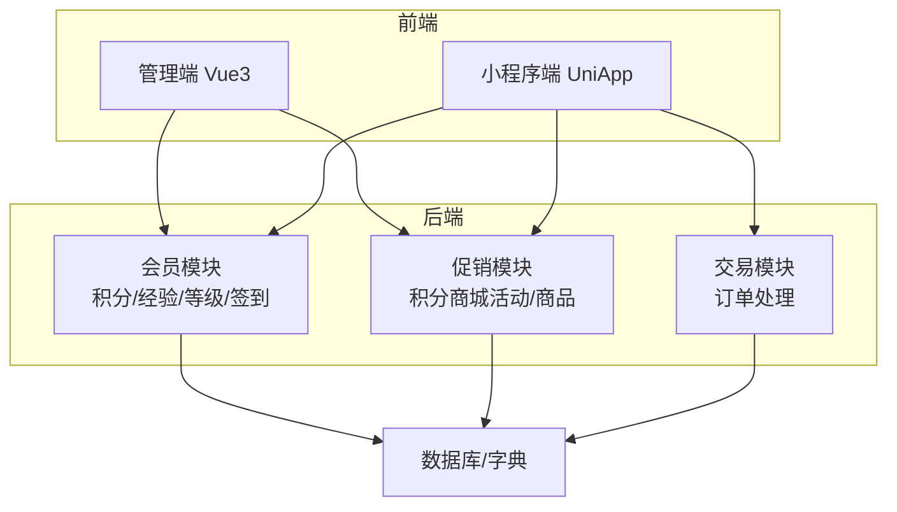
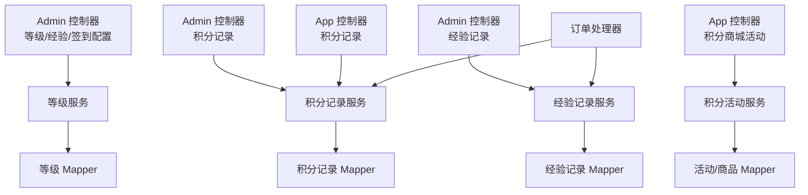
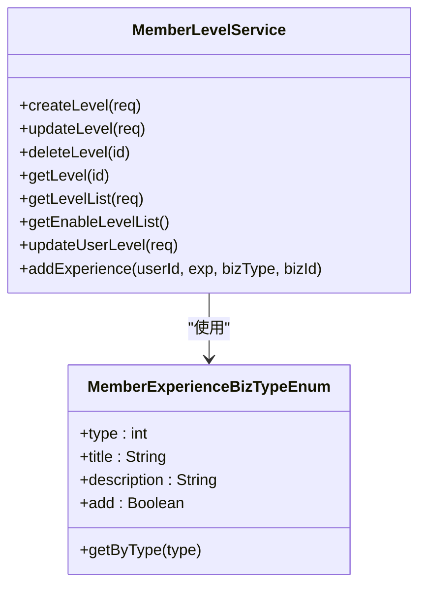
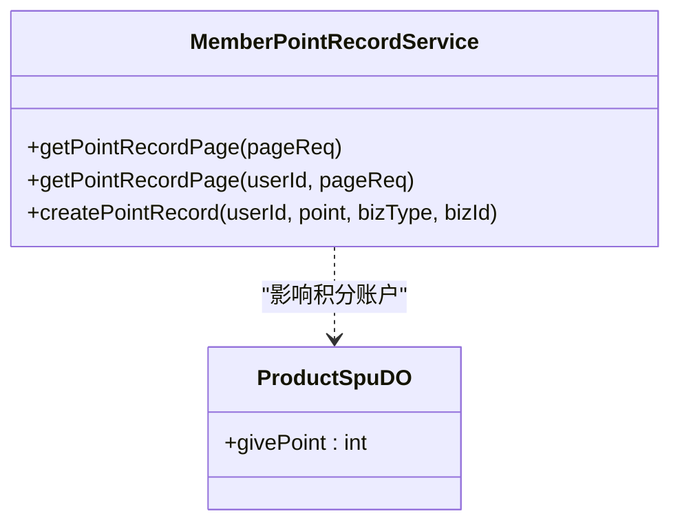
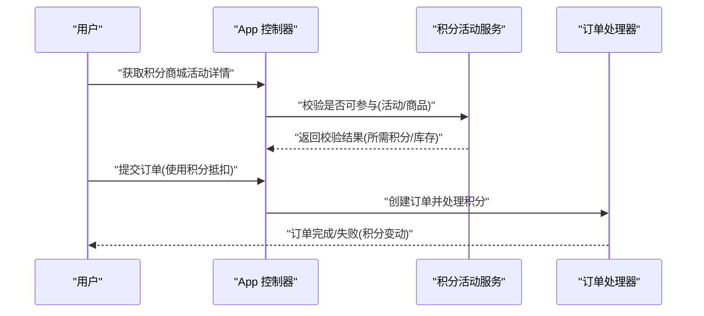
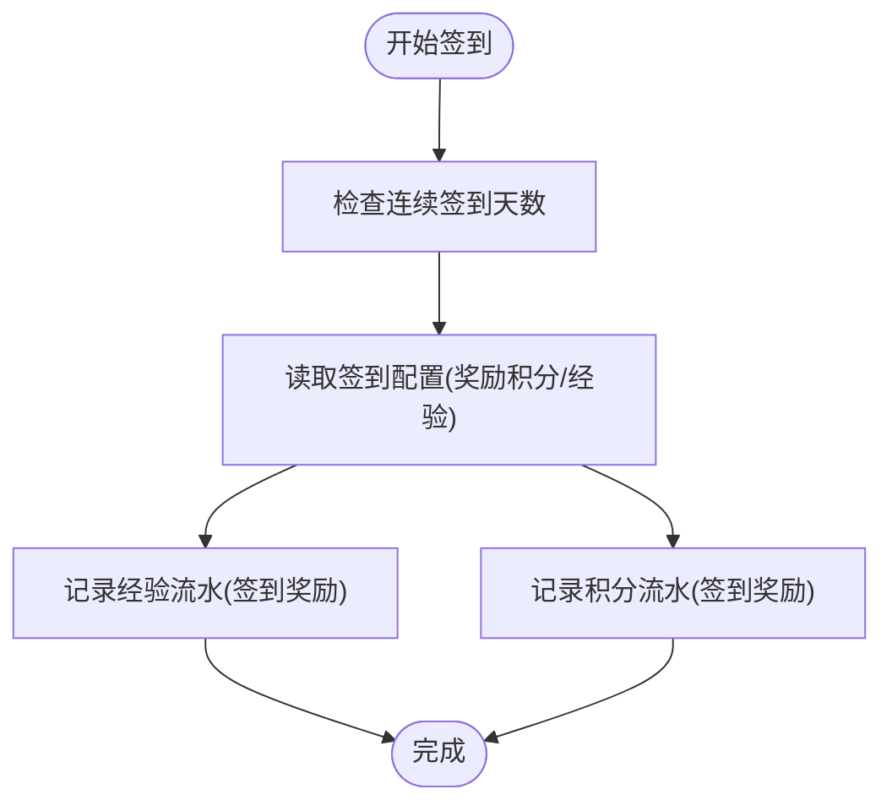
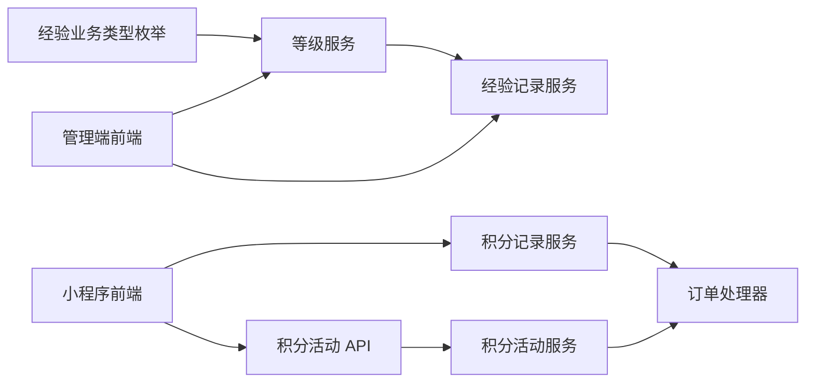
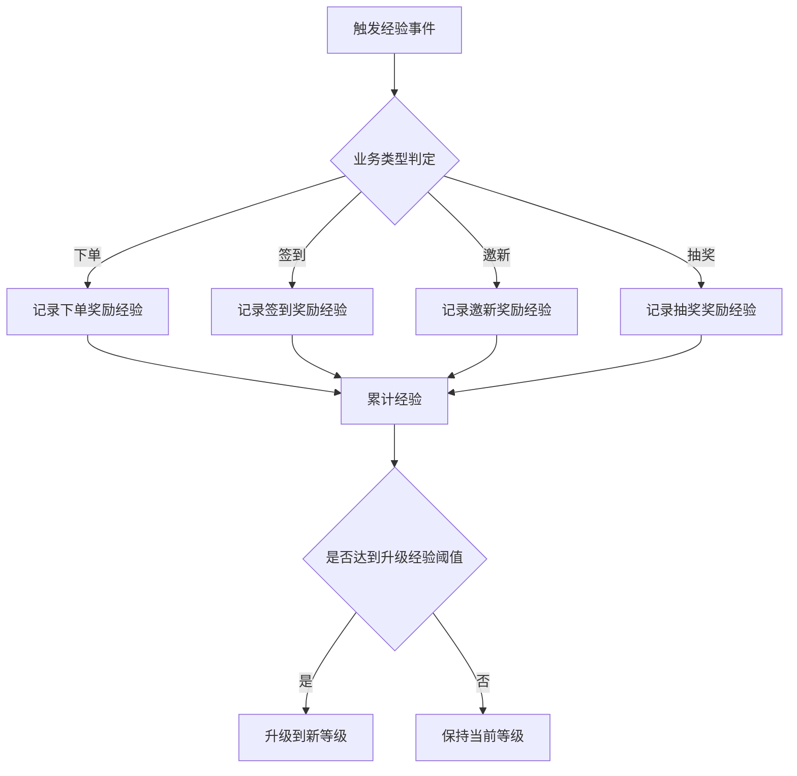
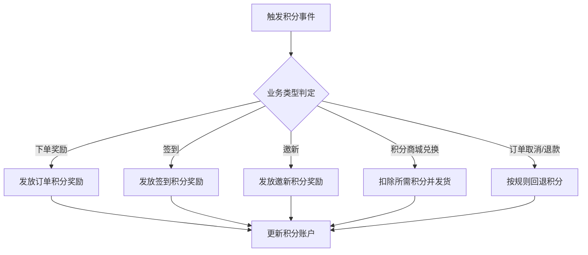

# 积分与经验值管理

<cite>
**本文引用的文件**
- [ruoyi-vue-pro.sql](file://backend/sql/postgresql/ruoyi-vue-pro.sql)
- [ruoyi-vue-pro.sql](file://backend/sql/opengauss/ruoyi-vue-pro.sql)
- [ruoyi-vue-pro.sql](file://backend/sql/kingbase/ruoyi-vue-pro.sql)
- [ruoyi-vue-pro-dm8.sql](file://backend/sql/dm/ruoyi-vue-pro-dm8.sql)
- [ruoyi-vue-pro.sql](file://backend/sql/sqlserver/ruoyi-vue-pro.sql)
- [MemberPointRecordService.java](file://backend/yudao-module-member/src/main/java/cn/iocoder/yudao/module/member/service/point/MemberPointRecordService.java)
- [MemberExperienceRecordService.java](file://backend/yudao-module-member/src/main/java/cn/iocoder/yudao/module/member/service/level/MemberExperienceRecordService.java)
- [MemberLevelService.java](file://backend/yudao-module-member/src/main/java/cn/iocoder/yudao/module/member/service/level/MemberLevelService.java)
- [MemberExperienceBizTypeEnum.java](file://backend/yudao-module-member/src/main/java/cn/iocoder/yudao/module/member/enums/MemberExperienceBizTypeEnum.java)
- [PointActivityApi.java](file://backend/yudao-module-mall/yudao-module-promotion/src/main/java/cn/iocoder/yudao/module/promotion/api/point/PointActivityApi.java)
- [PointActivityApiImpl.java](file://backend/yudao-module-mall/yudao-module-promotion/src/main/java/cn/iocoder/yudao/module/promotion/api/point/PointActivityApiImpl.java)
- [PointActivityController.java](file://backend/yudao-module-mall/yudao-module-promotion/src/main/java/cn/iocoder/yudao/module/promotion/controller/admin/point/PointActivityController.java)
- [AppPointActivityController.java](file://backend/yudao-module-mall/yudao-module-promotion/src/main/java/cn/iocoder/yudao/module/promotion/controller/app/point/AppPointActivityController.java)
- [PointActivityDO.java](file://backend/yudao-module-mall/yudao-module-promotion/src/main/java/cn/iocoder/yudao/module/promotion/dal/dataobject/point/PointActivityDO.java)
- [PointProductDO.java](file://backend/yudao-module-mall/yudao-module-promotion/src/main/java/cn/iocoder/yudao/module/promotion/dal/dataobject/point/PointProductDO.java)
- [PointActivityMapper.java](file://backend/yudao-module-mall/yudao-module-promotion/src/main/java/cn/iocoder/yudao/module/promotion/dal/mysql/point/PointActivityMapper.java)
- [PointProductMapper.java](file://backend/yudao-module-mall/yudao-module-promotion/src/main/java/cn/iocoder/yudao/module/promotion/dal/mysql/point/PointProductMapper.java)
- [PointActivityServiceImpl.java](file://backend/yudao-module-mall/yudao-module-promotion/src/main/java/cn/iocoder/yudao/module/promotion/service/point/PointActivityServiceImpl.java)
- [PointActivityService.java](file://backend/yudao-module-mall/yudao-module-promotion/src/main/java/cn/iocoder/yudao/module/promotion/service/point/PointActivityService.java)
- [PointValidateJoinRespDTO.java](file://backend/yudao-module-mall/yudao-module-promotion/src/main/java/cn/iocoder/yudao/module/promotion/api/point/dto/PointValidateJoinRespDTO.java)
- [ProductSpuDO.java](file://backend/yudao-module-mall/yudao-module-product/src/main/java/cn/iocoder/yudao/module/product/dal/dataobject/spu/ProductSpuDO.java)
- [ProductSpuRespVO.java](file://backend/yudao-module-mall/yudao-module-product/src/main/java/cn/iocoder/yudao/module/product/controller/admin/spu/vo/ProductSpuRespVO.java)
- [ProductSpuSaveReqVO.java](file://backend/yudao-module-mall/yudao-module-product/src/main/java/cn/iocoder/yudao/module/product/controller/admin/spu/vo/ProductSpuSaveReqVO.java)
- [TradeMemberPointOrderHandler.java](file://backend/yudao-module-mall/yudao-module-trade/src/main/java/cn/iocoder/yudao/module/trade/service/order/handler/TradeMemberPointOrderHandler.java)
- [UserExperienceRecordList.vue](file://frontend/admin-vue3/src/views/member/user/detail/UserExperienceRecordList.vue)
- [index.vue](file://frontend/admin-vue3/src/views/member/level/index.vue)
- [LevelForm.vue](file://frontend/admin-vue3/src/views/member/level/LevelForm.vue)
- [index.vue](file://frontend/admin-vue3/src/views/member/signin/config/index.vue)
- [index.ts](file://frontend/admin-vue3/src/api/member/experience-record/index.ts)
- [index.ts](file://frontend/admin-vue3/src/api/member/point/record/index.ts)
- [index.ts](file://frontend/admin-vue3/src/api/mall/promotion/point/index.ts)
- [point.js](file://frontend/mall-uniapp/sheep/api/member/point.js)
- [point.js](file://frontend/mall-uniapp/sheep/api/promotion/point.js)
- [sign.vue](file://frontend/mall-uniapp/pages/app/sign.vue)
</cite>

## 目录
1. [简介](#简介)
2. [项目结构](#项目结构)
3. [核心组件](#核心组件)
4. [架构总览](#架构总览)
5. [详细组件分析](#详细组件分析)
6. [依赖分析](#依赖分析)
7. [性能考虑](#性能考虑)
8. [故障排查指南](#故障排查指南)
9. [结论](#结论)
10. [附录](#附录)

## 简介
本文件面向开发者，系统化梳理“积分与经验值管理”子系统的设计与实现，覆盖以下主题：
- 积分获取与消费规则：来源、变更类型、流水记录与账户管理
- 经验值计算方式、升级条件、经验来源与消耗用途
- 积分流水记录、积分账户管理、积分活动配置、积分兑换
- 完整的积分 API 接口定义与业务流程图
- 规则配置示例与最佳实践

该系统以会员模块为核心，结合促销模块的商品积分商城能力，并通过交易模块在订单场景下联动积分抵扣与奖励。

## 项目结构
围绕积分与经验值管理的关键目录与文件如下：
- 后端会员模块：提供积分与经验的记录、等级、签到配置等服务接口与枚举
- 后端促销模块：提供积分商城活动与商品的定义、查询、校验与库存更新
- 后端交易模块：在订单流程中处理积分抵扣与奖励
- 前端管理端：等级配置、经验记录、签到配置等可视化界面
- 前端小程序端：积分记录、积分商城活动、签到等移动端能力
- 数据字典：统一维护业务类型枚举（经验与积分）

图表来源
- [MemberPointRecordService.java:1-43](file://backend/yudao-module-member/src/main/java/cn/iocoder/yudao/module/member/service/point/MemberPointRecordService.java#L1-L43)
- [MemberExperienceRecordService.java:1-54](file://backend/yudao-module-member/src/main/java/cn/iocoder/yudao/module/member/service/level/MemberExperienceRecordService.java#L1-L54)
- [MemberLevelService.java:1-103](file://backend/yudao-module-member/src/main/java/cn/iocoder/yudao/module/member/service/level/MemberLevelService.java#L1-L103)
- [PointActivityApi.java:1-33](file://backend/yudao-module-mall/yudao-module-promotion/src/main/java/cn/iocoder/yudao/module/promotion/api/point/PointActivityApi.java#L1-L33)
- [PointActivityServiceImpl.java](file://backend/yudao-module-mall/yudao-module-promotion/src/main/java/cn/iocoder/yudao/module/promotion/service/point/PointActivityServiceImpl.java)
- [TradeMemberPointOrderHandler.java](file://backend/yudao-module-mall/yudao-module-trade/src/main/java/cn/iocoder/yudao/module/trade/service/order/handler/TradeMemberPointOrderHandler.java)

章节来源
- [MemberPointRecordService.java:1-43](file://backend/yudao-module-member/src/main/java/cn/iocoder/yudao/module/member/service/point/MemberPointRecordService.java#L1-L43)
- [MemberExperienceRecordService.java:1-54](file://backend/yudao-module-member/src/main/java/cn/iocoder/yudao/module/member/service/level/MemberExperienceRecordService.java#L1-L54)
- [MemberLevelService.java:1-103](file://backend/yudao-module-member/src/main/java/cn/iocoder/yudao/module/member/service/level/MemberLevelService.java#L1-L103)
- [PointActivityApi.java:1-33](file://backend/yudao-module-mall/yudao-module-promotion/src/main/java/cn/iocoder/yudao/module/promotion/api/point/PointActivityApi.java#L1-L33)

## 核心组件
- 积分记录服务：负责积分流水的创建与分页查询
- 经验记录服务：负责经验值流水的创建与分页查询
- 等级服务：负责等级配置、经验阈值、折扣设置以及用户等级变更
- 经验业务类型枚举：统一管理经验来源与消耗的业务类型
- 积分商城活动 API：提供活动校验、详情、分页、上下架等能力
- 订单处理器：在订单流程中处理积分抵扣与奖励发放

章节来源
- [MemberPointRecordService.java:14-42](file://backend/yudao-module-member/src/main/java/cn/iocoder/yudao/module/member/service/point/MemberPointRecordService.java#L14-L42)
- [MemberExperienceRecordService.java:14-53](file://backend/yudao-module-member/src/main/java/cn/iocoder/yudao/module/member/service/level/MemberExperienceRecordService.java#L14-L53)
- [MemberLevelService.java:20-102](file://backend/yudao-module-member/src/main/java/cn/iocoder/yudao/module/member/service/level/MemberLevelService.java#L20-L102)
- [MemberExperienceBizTypeEnum.java:14-51](file://backend/yudao-module-member/src/main/java/cn/iocoder/yudao/module/member/enums/MemberExperienceBizTypeEnum.java#L14-L51)
- [PointActivityApi.java:5-33](file://backend/yudao-module-mall/yudao-module-promotion/src/main/java/cn/iocoder/yudao/module/promotion/api/point/PointActivityApi.java#L5-L33)

## 架构总览
系统采用“模块化分层”的设计：
- 控制器层：Admin/APP 分别暴露管理端与移动端接口
- 服务层：封装业务规则（积分/经验/等级/活动）
- 数据访问层：持久化活动、商品、记录、等级配置
- 前端：管理端用于配置与查看，小程序端用于用户侧使用

图表来源
- [PointActivityController.java](file://backend/yudao-module-mall/yudao-module-promotion/src/main/java/cn/iocoder/yudao/module/promotion/controller/admin/point/PointActivityController.java)
- [AppPointActivityController.java](file://backend/yudao-module-mall/yudao-module-promotion/src/main/java/cn/iocoder/yudao/module/promotion/controller/app/point/AppPointActivityController.java)
- [MemberLevelService.java:20-102](file://backend/yudao-module-member/src/main/java/cn/iocoder/yudao/module/member/service/level/MemberLevelService.java#L20-L102)
- [MemberPointRecordService.java:14-42](file://backend/yudao-module-member/src/main/java/cn/iocoder/yudao/module/member/service/point/MemberPointRecordService.java#L14-L42)
- [MemberExperienceRecordService.java:14-53](file://backend/yudao-module-member/src/main/java/cn/iocoder/yudao/module/member/service/level/MemberExperienceRecordService.java#L14-L53)

## 详细组件分析

### 经验值体系与升级机制
- 经验来源与业务类型：包含管理员调整、邀新奖励、签到奖励、抽奖奖励、下单奖励及其取消/退款对应的回退
- 升级条件：等级配置中包含“等级”“升级经验”“享受折扣”等字段；用户累计经验达到某等级的阈值即可升级
- 经验消耗用途：未在现有代码中发现直接的经验消费用途（如兑换），经验主要用于升级

图表来源
- [MemberLevelService.java:20-102](file://backend/yudao-module-member/src/main/java/cn/iocoder/yudao/module/member/service/level/MemberLevelService.java#L20-L102)
- [MemberExperienceBizTypeEnum.java:14-51](file://backend/yudao-module-member/src/main/java/cn/iocoder/yudao/module/member/enums/MemberExperienceBizTypeEnum.java#L14-L51)

章节来源
- [MemberExperienceBizTypeEnum.java:16-28](file://backend/yudao-module-member/src/main/java/cn/iocoder/yudao/module/member/enums/MemberExperienceBizTypeEnum.java#L16-L28)
- [index.vue:64-67](file://frontend/admin-vue3/src/views/member/level/index.vue#L64-L67)
- [LevelForm.vue:29-43](file://frontend/admin-vue3/src/views/member/level/LevelForm.vue#L29-L43)

### 积分流水与账户管理
- 流水记录：支持管理员与会员维度的分页查询，记录包含业务类型、变动积分、累计积分等
- 账户管理：通过服务接口创建积分变动记录，业务类型由枚举统一约束
- 商品赠送积分：商品模型中包含“赠送积分”字段，便于在商品层面配置积分奖励

图表来源
- [MemberPointRecordService.java:14-42](file://backend/yudao-module-member/src/main/java/cn/iocoder/yudao/module/member/service/point/MemberPointRecordService.java#L14-L42)
- [ProductSpuDO.java](file://backend/yudao-module-mall/yudao-module-product/src/main/java/cn/iocoder/yudao/module/product/dal/dataobject/spu/ProductSpuDO.java#L143)

章节来源
- [MemberPointRecordService.java:22-41](file://backend/yudao-module-member/src/main/java/cn/iocoder/yudao/module/member/service/point/MemberPointRecordService.java#L22-L41)
- [ProductSpuRespVO.java:103-104](file://backend/yudao-module-mall/yudao-module-product/src/main/java/cn/iocoder/yudao/module/product/controller/admin/spu/vo/ProductSpuRespVO.java#L103-L104)
- [ProductSpuSaveReqVO.java:70-71](file://backend/yudao-module-mall/yudao-module-product/src/main/java/cn/iocoder/yudao/module/product/controller/admin/spu/vo/ProductSpuSaveReqVO.java#L70-L71)

### 积分商城活动与兑换
- 活动能力：提供活动分页、详情、校验是否可参与、上下架、库存增减等
- 兑换流程：下单前校验是否参与积分商城活动，按所需积分进行抵扣或兑换
- 商品库存：支持库存减少（下单扣减）与增加（取消/退货入库）

图表来源
- [PointActivityApi.java:5-33](file://backend/yudao-module-mall/yudao-module-promotion/src/main/java/cn/iocoder/yudao/module/promotion/api/point/PointActivityApi.java#L5-L33)
- [PointActivityApiImpl.java:1-20](file://backend/yudao-module-mall/yudao-module-promotion/src/main/java/cn/iocoder/yudao/module/promotion/api/point/PointActivityApiImpl.java#L1-L20)
- [PointActivityServiceImpl.java](file://backend/yudao-module-mall/yudao-module-promotion/src/main/java/cn/iocoder/yudao/module/promotion/service/point/PointActivityServiceImpl.java)
- [TradeMemberPointOrderHandler.java](file://backend/yudao-module-mall/yudao-module-trade/src/main/java/cn/iocoder/yudao/module/trade/service/order/handler/TradeMemberPointOrderHandler.java)

章节来源
- [PointActivityApi.java:12-33](file://backend/yudao-module-mall/yudao-module-promotion/src/main/java/cn/iocoder/yudao/module/promotion/api/point/PointActivityApi.java#L12-L33)
- [PointValidateJoinRespDTO.java:1-20](file://backend/yudao-module-mall/yudao-module-promotion/src/main/java/cn/iocoder/yudao/module/promotion/api/point/dto/PointValidateJoinRespDTO.java#L1-L20)

### 签到与经验/积分奖励
- 签到配置：支持按签到天数配置奖励积分与经验
- 前端展示：管理端列表展示签到天数、奖励积分与经验、状态等

图表来源
- [index.vue:18-42](file://frontend/admin-vue3/src/views/member/signin/config/index.vue#L18-L42)
- [MemberExperienceBizTypeEnum.java](file://backend/yudao-module-member/src/main/java/cn/iocoder/yudao/module/member/enums/MemberExperienceBizTypeEnum.java#L23)

章节来源
- [index.vue:18-42](file://frontend/admin-vue3/src/views/member/signin/config/index.vue#L18-L42)

## 依赖分析
- 经验业务类型枚举被等级服务广泛使用，保证经验来源的一致性与可追溯性
- 积分/经验记录服务依赖枚举与业务 ID，形成稳定的流水记录
- 积分商城活动服务与订单处理器协作，在订单生命周期内完成积分抵扣与库存同步
- 前端管理端与小程序端分别调用后端接口，实现配置与使用闭环

图表来源
- [MemberExperienceBizTypeEnum.java:14-51](file://backend/yudao-module-member/src/main/java/cn/iocoder/yudao/module/member/enums/MemberExperienceBizTypeEnum.java#L14-L51)
- [MemberLevelService.java:92-100](file://backend/yudao-module-member/src/main/java/cn/iocoder/yudao/module/member/service/level/MemberLevelService.java#L92-L100)
- [MemberExperienceRecordService.java:40-51](file://backend/yudao-module-member/src/main/java/cn/iocoder/yudao/module/member/service/level/MemberExperienceRecordService.java#L40-L51)
- [PointActivityApi.java:5-33](file://backend/yudao-module-mall/yudao-module-promotion/src/main/java/cn/iocoder/yudao/module/promotion/api/point/PointActivityApi.java#L5-L33)
- [TradeMemberPointOrderHandler.java](file://backend/yudao-module-mall/yudao-module-trade/src/main/java/cn/iocoder/yudao/module/trade/service/order/handler/TradeMemberPointOrderHandler.java)

## 性能考虑
- 分页查询：积分/经验记录均提供分页接口，建议前端按需加载，避免一次性拉取大量数据
- 字典与枚举：业务类型集中于枚举与字典，减少重复配置与不一致风险
- 库存与积分一致性：积分商城活动的库存增减与积分抵扣应在同一事务中处理，避免并发问题
- 前端渲染：管理端表格对经验/积分采用标签样式区分正负，建议在大数据量时启用虚拟滚动与懒加载

## 故障排查指南
- 经验/积分流水异常
  - 检查业务类型是否正确传入，确认枚举值与字典一致
  - 核对流水记录中的业务编号与实际业务是否匹配
- 等级升级不生效
  - 检查等级配置中的“升级经验”阈值是否正确
  - 确认用户累计经验是否已达到阈值
- 积分商城活动异常
  - 校验活动状态与商品库存
  - 检查下单前校验接口返回的所需积分是否正确
- 订单积分抵扣失败
  - 确认订单处理器在创建订单时是否调用了积分抵扣逻辑
  - 核对用户积分余额是否充足

章节来源
- [MemberExperienceBizTypeEnum.java:16-28](file://backend/yudao-module-member/src/main/java/cn/iocoder/yudao/module/member/enums/MemberExperienceBizTypeEnum.java#L16-L28)
- [PointActivityApi.java:12-33](file://backend/yudao-module-mall/yudao-module-promotion/src/main/java/cn/iocoder/yudao/module/promotion/api/point/PointActivityApi.java#L12-L33)
- [TradeMemberPointOrderHandler.java](file://backend/yudao-module-mall/yudao-module-trade/src/main/java/cn/iocoder/yudao/module/trade/service/order/handler/TradeMemberPointOrderHandler.java)

## 结论
本系统通过“经验/积分+等级+活动”的组合，构建了完整的会员激励闭环。经验用于驱动等级成长，积分用于兑换与抵扣，二者均具备完善的流水记录与可配置规则。建议在后续迭代中补充经验消费场景（如兑换），并完善积分清零策略与转移规则，以满足更复杂的运营需求。

## 附录

### 业务类型与字典配置
- 经验业务类型字典（示例字段）
  - 类型：0 管理员调整、1 邀新奖励、4 签到奖励、5 抽奖奖励、11 下单奖励、12 下单奖励（整单取消）、13 下单奖励（单个退款）
- 积分业务类型字典（示例字段）
  - 类型：12 订单积分抵扣（整单取消）、21 订单积分奖励、22 订单积分奖励（整单取消）、23 订单积分奖励（单个退款）

章节来源
- [ruoyi-vue-pro.sql:935-982](file://backend/sql/postgresql/ruoyi-vue-pro.sql#L935-L982)
- [ruoyi-vue-pro.sql:956-959](file://backend/sql/opengauss/ruoyi-vue-pro.sql#L956-L959)
- [ruoyi-vue-pro.sql:956-959](file://backend/sql/kingbase/ruoyi-vue-pro.sql#L956-L959)
- [ruoyi-vue-pro-dm8.sql:842-845](file://backend/sql/dm/ruoyi-vue-pro-dm8.sql#L842-L845)
- [ruoyi-vue-pro.sql:2499-2507](file://backend/sql/sqlserver/ruoyi-vue-pro.sql#L2499-L2507)

### 积分 API 接口清单
- 积分记录
  - 管理端分页：GET /member/point/record/page
  - 小程序端分页：GET /member/point/record/page?addStatus=...
- 经验记录
  - 管理端分页：GET /member/experience-record/page
  - 详情：GET /member/experience-record/get?id={id}
- 积分商城活动
  - 管理端分页：GET /promotion/point-activity/page
  - 列表（按 ID 数组）：GET /promotion/point-activity/list-by-ids?ids=...
  - 详情：GET /promotion/point-activity/get-detail?id={id}
  - 修改：PUT /promotion/point-activity/update
  - 删除：DELETE /promotion/point-activity/delete?id={id}
  - 关闭：PUT /promotion/point-activity/close?id={id}

章节来源
- [index.ts:15-18](file://frontend/admin-vue3/src/api/member/point/record/index.ts#L15-L18)
- [index.ts:15-22](file://frontend/admin-vue3/src/api/member/experience-record/index.ts#L15-L22)
- [index.ts:75-91](file://frontend/admin-vue3/src/api/mall/promotion/point/index.ts#L75-L91)
- [point.js:5-16](file://frontend/mall-uniapp/sheep/api/member/point.js#L5-L16)
- [point.js:5-27](file://frontend/mall-uniapp/sheep/api/promotion/point.js#L5-L27)

### 积分与经验值业务流程图

#### 经验值获取与升级

图表来源
- [MemberExperienceBizTypeEnum.java:16-28](file://backend/yudao-module-member/src/main/java/cn/iocoder/yudao/module/member/enums/MemberExperienceBizTypeEnum.java#L16-L28)
- [MemberLevelService.java:92-100](file://backend/yudao-module-member/src/main/java/cn/iocoder/yudao/module/member/service/level/MemberLevelService.java#L92-L100)

#### 积分获取与消费

图表来源
- [MemberExperienceBizTypeEnum.java:16-28](file://backend/yudao-module-member/src/main/java/cn/iocoder/yudao/module/member/enums/MemberExperienceBizTypeEnum.java#L16-L28)
- [PointActivityApi.java:12-33](file://backend/yudao-module-mall/yudao-module-promotion/src/main/java/cn/iocoder/yudao/module/promotion/api/point/PointActivityApi.java#L12-L33)