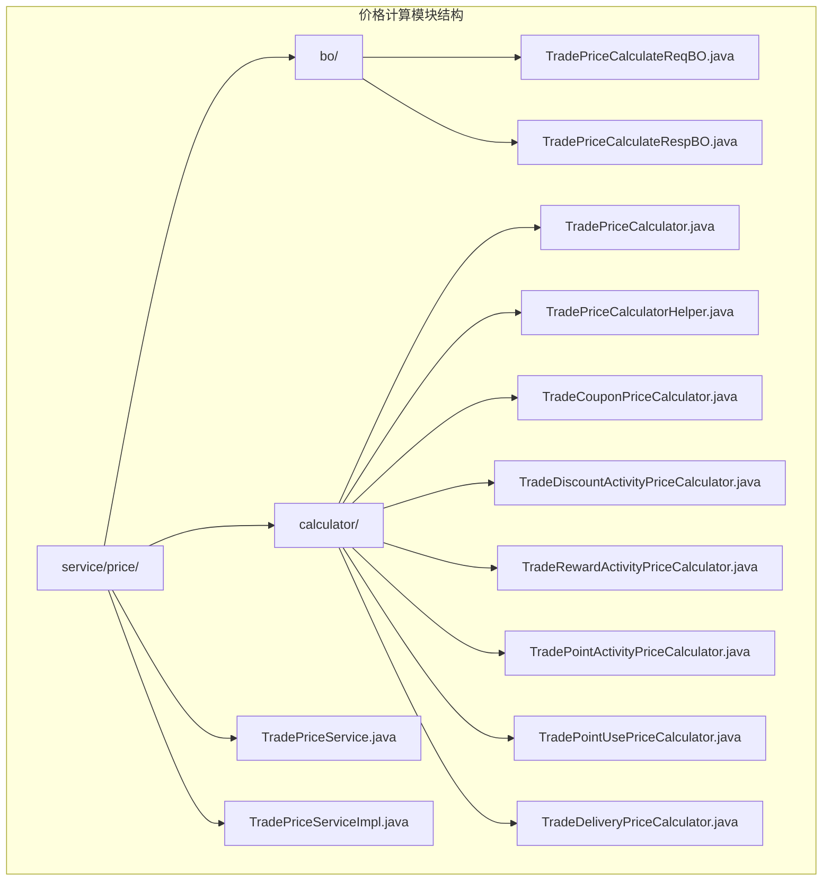
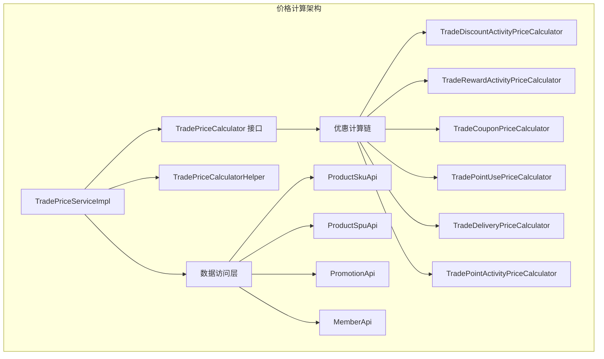
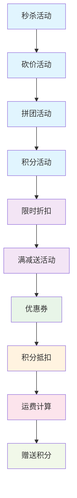
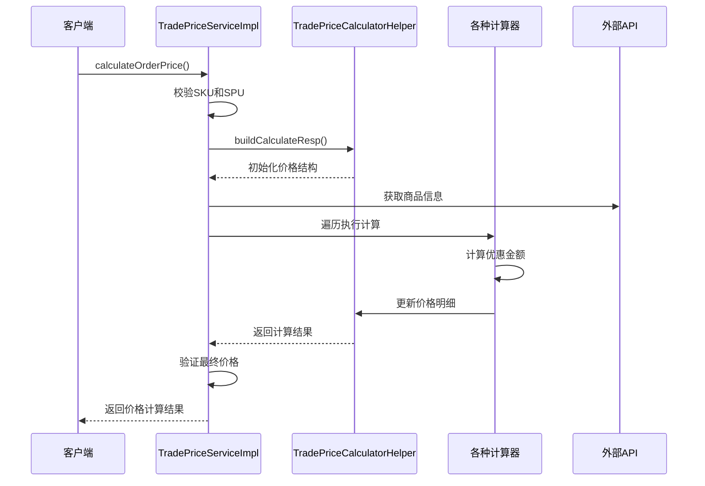
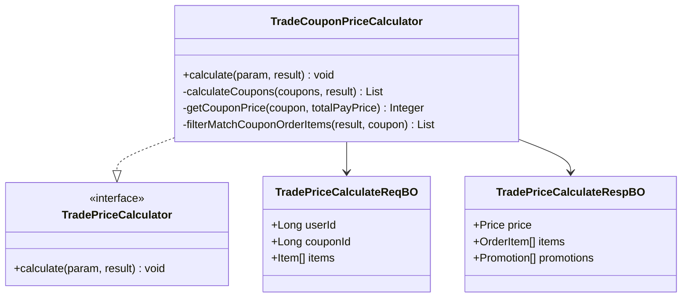
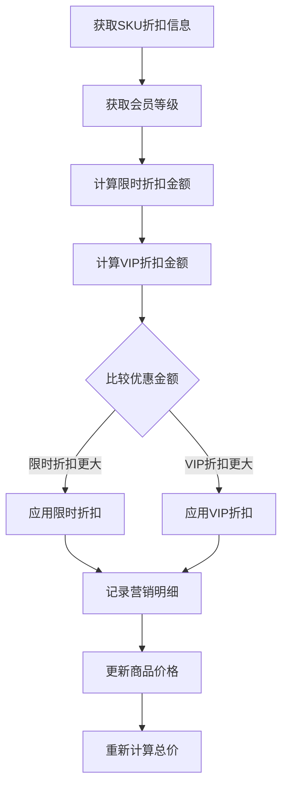
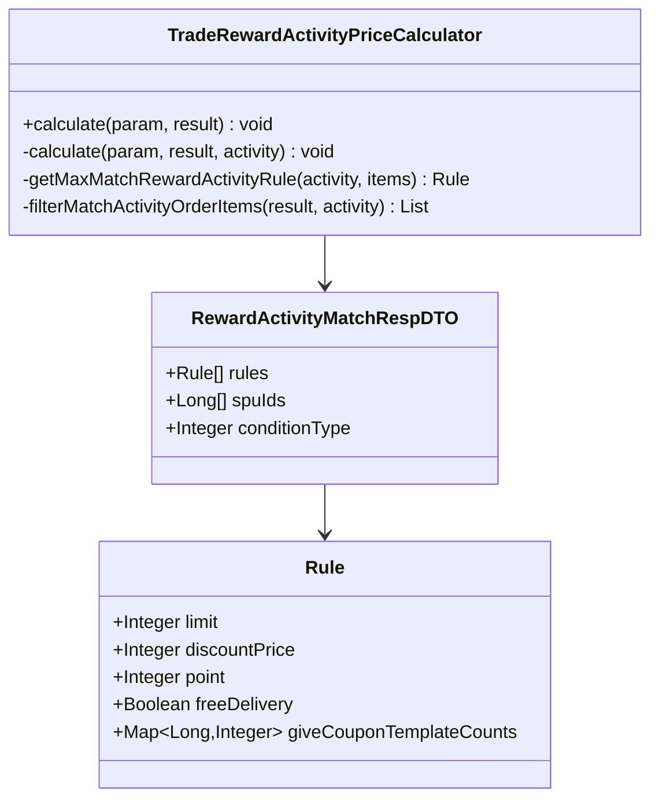
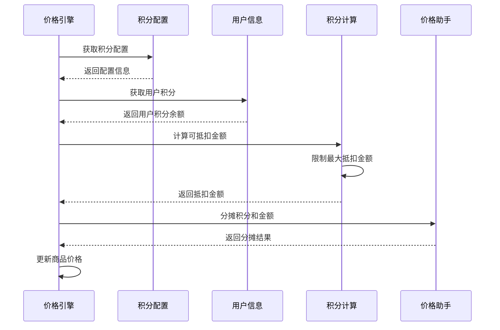
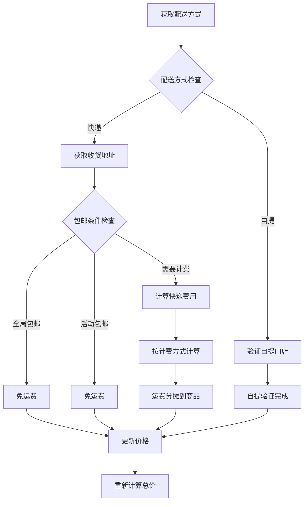
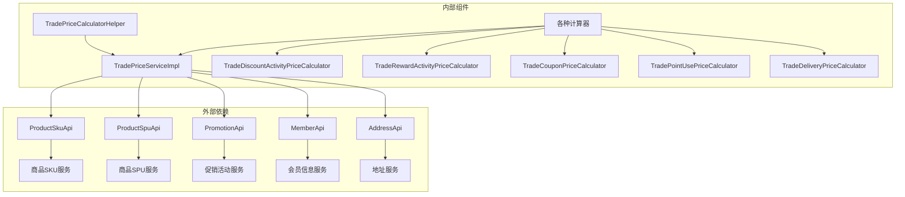

# 价格计算引擎

<cite>
**本文档引用的文件**
- [TradePriceService.java](file://backend/yudao-module-mall/yudao-module-trade/src/main/java/cn/iocoder/yudao/module/trade/service/price/TradePriceService.java)
- [TradePriceServiceImpl.java](file://backend/yudao-module-mall/yudao-module-trade/src/main/java/cn/iocoder/yudao/module/trade/service/price/TradePriceServiceImpl.java)
- [TradePriceCalculateReqBO.java](file://backend/yudao-module-mall/yudao-module-trade/src/main/java/cn/iocoder/yudao/module/trade/service/price/bo/TradePriceCalculateReqBO.java)
- [TradePriceCalculateRespBO.java](file://backend/yudao-module-mall/yudao-module-trade/src/main/java/cn/iocoder/yudao/module/trade/service/price/bo/TradePriceCalculateRespBO.java)
- [TradePriceCalculator.java](file://backend/yudao-module-mall/yudao-module-trade/src/main/java/cn/iocoder/yudao/module/trade/service/price/calculator/TradePriceCalculator.java)
- [TradePriceCalculatorHelper.java](file://backend/yudao-module-mall/yudao-module-trade/src/main/java/cn/iocoder/yudao/module/trade/service/price/calculator/TradePriceCalculatorHelper.java)
- [TradeCouponPriceCalculator.java](file://backend/yudao-module-mall/yudao-module-trade/src/main/java/cn/iocoder/yudao/module/trade/service/price/calculator/TradeCouponPriceCalculator.java)
- [TradeDiscountActivityPriceCalculator.java](file://backend/yudao-module-mall/yudao-module-trade/src/main/java/cn/iocoder/yudao/module/trade/service/price/calculator/TradeDiscountActivityPriceCalculator.java)
- [TradeRewardActivityPriceCalculator.java](file://backend/yudao-module-mall/yudao-module-trade/src/main/java/cn/iocoder/yudao/module/trade/service/price/calculator/TradeRewardActivityPriceCalculator.java)
- [TradePointActivityPriceCalculator.java](file://backend/yudao-module-mall/yudao-module-trade/src/main/java/cn/iocoder/yudao/module/trade/service/price/calculator/TradePointActivityPriceCalculator.java)
- [TradePointUsePriceCalculator.java](file://backend/yudao-module-mall/yudao-module-trade/src/main/java/cn/iocoder/yudao/module/trade/service/price/calculator/TradePointUsePriceCalculator.java)
- [TradeDeliveryPriceCalculator.java](file://backend/yudao-module-mall/yudao-module-trade/src/main/java/cn/iocoder/yudao/module/trade/service/price/calculator/TradeDeliveryPriceCalculator.java)
</cite>

## 目录
1. [简介](#简介)
2. [项目结构](#项目结构)
3. [核心组件](#核心组件)
4. [架构概览](#架构概览)
5. [详细组件分析](#详细组件分析)
6. [依赖关系分析](#依赖关系分析)
7. [性能考虑](#性能考虑)
8. [故障排除指南](#故障排除指南)
9. [结论](#结论)
10. [附录](#附录)

## 简介

价格计算引擎是 AgenticCPS 商城系统中的核心模块，负责处理复杂的商品价格计算、优惠叠加、价格修正等业务逻辑。该引擎支持多种优惠场景，包括优惠券叠加、满减活动叠加、会员折扣、积分抵扣等，并提供了完善的优先级规则、计算精度控制、性能优化策略和价格缓存机制。

该引擎采用模块化设计，通过计算器接口和辅助工具类实现了高度可扩展的价格计算架构，能够灵活处理各种促销活动组合和复杂的业务规则。

## 项目结构

价格计算引擎位于后端模块的贸易系统中，主要包含以下核心目录结构：

**图表来源**
- [TradePriceService.java:1-35](file://backend/yudao-module-mall/yudao-module-trade/src/main/java/cn/iocoder/yudao/module/trade/service/price/TradePriceService.java#L1-L35)
- [TradePriceServiceImpl.java:1-156](file://backend/yudao-module-mall/yudao-module-trade/src/main/java/cn/iocoder/yudao/module/trade/service/price/TradePriceServiceImpl.java#L1-L156)

**章节来源**
- [TradePriceService.java:1-35](file://backend/yudao-module-mall/yudao-module-trade/src/main/java/cn/iocoder/yudao/module/trade/service/price/TradePriceService.java#L1-L35)
- [TradePriceServiceImpl.java:1-156](file://backend/yudao-module-mall/yudao-module-trade/src/main/java/cn/iocoder/yudao/module/trade/service/price/TradePriceServiceImpl.java#L1-L156)

## 核心组件

价格计算引擎由多个核心组件构成，每个组件都有明确的职责和作用：

### 服务层组件

**TradePriceService 接口**
- 定义了价格计算的统一入口
- 提供订单价格计算和商品价格计算两种主要方法
- 支持参数验证和响应对象封装

**TradePriceServiceImpl 实现类**
- 实现了完整的订单价格计算流程
- 集成了所有价格计算器组件
- 提供了商品详情页的价格计算功能
- 实现了价格计算结果的验证和异常处理

### 数据传输对象

**TradePriceCalculateReqBO 请求对象**
- 封装了价格计算所需的输入参数
- 包含用户信息、优惠券信息、配送方式等
- 支持多种促销活动的参数配置
- 提供了完整的数据验证机制

**TradePriceCalculateRespBO 响应对象**
- 完整的价格计算结果封装
- 包含订单价格、商品明细、营销活动等信息
- 支持价格明细的详细展示
- 提供了营销活动的匹配状态

### 计算器组件

**TradePriceCalculator 接口**
- 定义了价格计算的标准接口
- 设定了各种优惠的计算优先级
- 提供了统一的计算方法签名
- 定义了计算顺序常量

**TradePriceCalculatorHelper 工具类**
- 提供了价格计算的核心辅助功能
- 实现了价格分摊算法
- 提供了订单类型的识别功能
- 支持价格的重新计算和统计

**章节来源**
- [TradePriceService.java:10-34](file://backend/yudao-module-mall/yudao-module-trade/src/main/java/cn/iocoder/yudao/module/trade/service/price/TradePriceService.java#L10-L34)
- [TradePriceServiceImpl.java:40-156](file://backend/yudao-module-mall/yudao-module-trade/src/main/java/cn/iocoder/yudao/module/trade/service/price/TradePriceServiceImpl.java#L40-L156)
- [TradePriceCalculateReqBO.java:16-126](file://backend/yudao-module-mall/yudao-module-trade/src/main/java/cn/iocoder/yudao/module/trade/service/price/bo/TradePriceCalculateReqBO.java#L16-L126)
- [TradePriceCalculateRespBO.java:21-406](file://backend/yudao-module-mall/yudao-module-trade/src/main/java/cn/iocoder/yudao/module/trade/service/price/bo/TradePriceCalculateRespBO.java#L21-L406)
- [TradePriceCalculator.java:14-41](file://backend/yudao-module-mall/yudao-module-trade/src/main/java/cn/iocoder/yudao/module/trade/service/price/calculator/TradePriceCalculator.java#L14-L41)
- [TradePriceCalculatorHelper.java:29-346](file://backend/yudao-module-mall/yudao-module-trade/src/main/java/cn/iocoder/yudao/module/trade/service/price/calculator/TradePriceCalculatorHelper.java#L29-L346)

## 架构概览

价格计算引擎采用了分层架构设计，通过计算器模式实现了高度模块化的功能组织：

**图表来源**
- [TradePriceServiceImpl.java:54-79](file://backend/yudao-module-mall/yudao-module-trade/src/main/java/cn/iocoder/yudao/module/trade/service/price/TradePriceServiceImpl.java#L54-L79)
- [TradePriceCalculator.java:14-41](file://backend/yudao-module-mall/yudao-module-trade/src/main/java/cn/iocoder/yudao/module/trade/service/price/calculator/TradePriceCalculator.java#L14-L41)

### 计算优先级体系

价格计算引擎定义了严格的计算优先级顺序，确保各种优惠能够正确叠加：

**图表来源**
- [TradePriceCalculator.java:16-36](file://backend/yudao-module-mall/yudao-module-trade/src/main/java/cn/iocoder/yudao/module/trade/service/price/calculator/TradePriceCalculator.java#L16-L36)

### 价格计算流程

价格计算引擎遵循标准化的计算流程，确保计算结果的准确性和一致性：

**图表来源**
- [TradePriceServiceImpl.java:60-79](file://backend/yudao-module-mall/yudao-module-trade/src/main/java/cn/iocoder/yudao/module/trade/service/price/TradePriceServiceImpl.java#L60-L79)
- [TradePriceCalculatorHelper.java:31-75](file://backend/yudao-module-mall/yudao-module-trade/src/main/java/cn/iocoder/yudao/module/trade/service/price/calculator/TradePriceCalculatorHelper.java#L31-L75)

**章节来源**
- [TradePriceServiceImpl.java:60-102](file://backend/yudao-module-mall/yudao-module-trade/src/main/java/cn/iocoder/yudao/module/trade/service/price/TradePriceServiceImpl.java#L60-L102)
- [TradePriceCalculatorHelper.java:104-146](file://backend/yudao-module-mall/yudao-module-trade/src/main/java/cn/iocoder/yudao/module/trade/service/price/calculator/TradePriceCalculatorHelper.java#L104-L146)

## 详细组件分析

### 优惠券计算组件

TradeCouponPriceCalculator 负责处理优惠券相关的价格计算逻辑：

**图表来源**
- [TradeCouponPriceCalculator.java:35-92](file://backend/yudao-module-mall/yudao-module-trade/src/main/java/cn/iocoder/yudao/module/trade/service/price/calculator/TradeCouponPriceCalculator.java#L35-L92)
- [TradePriceCalculator.java:14-41](file://backend/yudao-module-mall/yudao-module-trade/src/main/java/cn/iocoder/yudao/module/trade/service/price/calculator/TradePriceCalculator.java#L14-L41)

#### 优惠券计算逻辑

优惠券计算组件实现了复杂的优惠券匹配和使用逻辑：

1. **优惠券有效性检查**：验证优惠券的状态、有效期和使用条件
2. **商品范围匹配**：根据优惠券的商品范围限制筛选适用商品
3. **满减条件验证**：检查订单金额是否满足优惠券的使用门槛
4. **优惠金额计算**：支持固定金额和百分比两种优惠方式
5. **价格分摊算法**：将优惠金额按比例分摊到各个商品

**章节来源**
- [TradeCouponPriceCalculator.java:42-92](file://backend/yudao-module-mall/yudao-module-trade/src/main/java/cn/iocoder/yudao/module/trade/service/price/calculator/TradeCouponPriceCalculator.java#L42-L92)
- [TradeCouponPriceCalculator.java:101-140](file://backend/yudao-module-mall/yudao-module-trade/src/main/java/cn/iocoder/yudao/module/trade/service/price/calculator/TradeCouponPriceCalculator.java#L101-L140)

### 限时折扣计算组件

TradeDiscountActivityPriceCalculator 处理限时折扣和会员折扣的计算：

**图表来源**
- [TradeDiscountActivityPriceCalculator.java:47-97](file://backend/yudao-module-mall/yudao-module-trade/src/main/java/cn/iocoder/yudao/module/trade/service/price/calculator/TradeDiscountActivityPriceCalculator.java#L47-L97)

#### 折扣计算策略

该组件实现了限时折扣和会员折扣的竞争性计算策略：

1. **双重折扣计算**：同时计算限时折扣和会员折扣的优惠金额
2. **最优选择原则**：选择优惠金额更大的折扣方案
3. **营销明细记录**：详细记录所选折扣的计算过程
4. **价格更新机制**：实时更新商品的优惠价格和应付金额

**章节来源**
- [TradeDiscountActivityPriceCalculator.java:62-96](file://backend/yudao-module-mall/yudao-module-trade/src/main/java/cn/iocoder/yudao/module/trade/service/price/calculator/TradeDiscountActivityPriceCalculator.java#L62-L96)
- [TradeDiscountActivityPriceCalculator.java:120-152](file://backend/yudao-module-mall/yudao-module-trade/src/main/java/cn/iocoder/yudao/module/trade/service/price/calculator/TradeDiscountActivityPriceCalculator.java#L120-L152)

### 满减送活动计算组件

TradeRewardActivityPriceCalculator 处理满减送活动的复杂计算逻辑：

**图表来源**
- [TradeRewardActivityPriceCalculator.java:33-117](file://backend/yudao-module-mall/yudao-module-trade/src/main/java/cn/iocoder/yudao/module/trade/service/price/calculator/TradeRewardActivityPriceCalculator.java#L33-L117)

#### 满减送计算规则

满减送活动计算组件支持复杂的阶梯式优惠规则：

1. **条件类型判断**：支持按金额或数量两种条件类型
2. **规则匹配算法**：从最高优惠规则开始向下匹配
3. **多重优惠叠加**：支持满减、包邮、赠品等多种优惠组合
4. **智能分摊机制**：将优惠金额合理分摊到各个商品

**章节来源**
- [TradeRewardActivityPriceCalculator.java:56-117](file://backend/yudao-module-mall/yudao-module-trade/src/main/java/cn/iocoder/yudao/module/trade/service/price/calculator/TradeRewardActivityPriceCalculator.java#L56-L117)
- [TradeRewardActivityPriceCalculator.java:138-158](file://backend/yudao-module-mall/yudao-module-trade/src/main/java/cn/iocoder/yudao/module/trade/service/price/calculator/TradeRewardActivityPriceCalculator.java#L138-L158)

### 积分抵扣计算组件

TradePointUsePriceCalculator 实现了积分抵扣的核心逻辑：

**图表来源**
- [TradePointUsePriceCalculator.java:40-84](file://backend/yudao-module-mall/yudao-module-trade/src/main/java/cn/iocoder/yudao/module/trade/service/price/calculator/TradePointUsePriceCalculator.java#L40-L84)

#### 积分抵扣策略

积分抵扣组件实现了灵活的积分使用策略：

1. **配置验证机制**：检查积分抵扣功能是否启用
2. **余额限制控制**：根据用户积分余额和配置限制抵扣数量
3. **安全防护机制**：防止出现负支付金额的安全问题
4. **智能分摊算法**：将积分抵扣金额合理分配到各商品

**章节来源**
- [TradePointUsePriceCalculator.java:86-115](file://backend/yudao-module-mall/yudao-module-trade/src/main/java/cn/iocoder/yudao/module/trade/service/price/calculator/TradePointUsePriceCalculator.java#L86-L115)

### 运费计算组件

TradeDeliveryPriceCalculator 处理复杂的运费计算逻辑：

**图表来源**
- [TradeDeliveryPriceCalculator.java:54-156](file://backend/yudao-module-mall/yudao-module-trade/src/main/java/cn/iocoder/yudao/module/trade/service/price/calculator/TradeDeliveryPriceCalculator.java#L54-L156)

#### 运费计算策略

运费计算组件支持多种计费模式和包邮策略：

1. **配送方式验证**：确保商品支持所选的配送方式
2. **包邮条件判断**：检查全局包邮和活动包邮条件
3. **计费模式支持**：支持按件数、重量、体积三种计费方式
4. **智能分摊机制**：将运费按比例分摊到各个商品

**章节来源**
- [TradeDeliveryPriceCalculator.java:134-201](file://backend/yudao-module-mall/yudao-module-trade/src/main/java/cn/iocoder/yudao/module/trade/service/price/calculator/TradeDeliveryPriceCalculator.java#L134-L201)

## 依赖关系分析

价格计算引擎的依赖关系体现了清晰的分层架构设计：

**图表来源**
- [TradePriceServiceImpl.java:45-58](file://backend/yudao-module-mall/yudao-module-trade/src/main/java/cn/iocoder/yudao/module/trade/service/price/TradePriceServiceImpl.java#L45-L58)

### 组件耦合度分析

价格计算引擎通过接口抽象实现了低耦合的设计：

1. **接口隔离原则**：所有计算器都实现统一的 TradePriceCalculator 接口
2. **依赖注入机制**：通过 Spring 容器管理组件间的依赖关系
3. **单一职责原则**：每个计算器只负责特定的计算逻辑
4. **开闭原则**：新增优惠类型只需实现新的计算器接口

**章节来源**
- [TradePriceServiceImpl.java:54-59](file://backend/yudao-module-mall/yudao-module-trade/src/main/java/cn/iocoder/yudao/module/trade/service/price/TradePriceServiceImpl.java#L54-L59)

## 性能考虑

价格计算引擎在设计时充分考虑了性能优化需求：

### 计算效率优化

1. **延迟加载机制**：只在需要时加载相关的促销活动信息
2. **批量查询优化**：通过批量接口减少数据库访问次数
3. **内存缓存策略**：利用 Spring 缓存机制提升重复计算的性能
4. **并行计算支持**：支持多线程环境下的价格计算

### 内存使用优化

1. **对象复用机制**：通过对象池减少对象创建开销
2. **流式处理**：对大量数据采用流式处理避免内存溢出
3. **及时释放资源**：确保临时对象及时被垃圾回收

### 网络通信优化

1. **接口聚合**：将多个 API 调用合并为批量请求
2. **超时控制**：设置合理的超时时间避免长时间阻塞
3. **重试机制**：实现智能重试避免瞬时网络故障影响

## 故障排除指南

### 常见错误类型

**价格计算异常**
- 支付金额为负数或零：检查优惠金额是否超过商品总价
- 优惠券不可用：验证优惠券的有效期和使用条件
- 配送方式不匹配：确认商品是否支持所选配送方式

**数据验证错误**
- SKU 不存在：检查商品库存和状态
- 库存不足：确认商品库存是否满足购买数量
- 用户信息缺失：验证用户身份和权限

### 调试技巧

1. **日志记录**：启用详细的日志记录便于问题定位
2. **断点调试**：在关键计算节点设置断点观察变量变化
3. **单元测试**：编写针对性的单元测试验证计算逻辑
4. **性能监控**：监控计算耗时和资源使用情况

**章节来源**
- [TradePriceServiceImpl.java:71-78](file://backend/yudao-module-mall/yudao-module-trade/src/main/java/cn/iocoder/yudao/module/trade/service/price/TradePriceServiceImpl.java#L71-L78)
- [TradeCouponPriceCalculator.java:64-69](file://backend/yudao-module-mall/yudao-module-trade/src/main/java/cn/iocoder/yudao/module/trade/service/price/calculator/TradeCouponPriceCalculator.java#L64-L69)

## 结论

价格计算引擎通过模块化的设计和标准化的接口，实现了高度可扩展的价格计算解决方案。该引擎不仅支持复杂的优惠叠加逻辑，还提供了完善的性能优化和故障排除机制。

### 主要优势

1. **灵活性强**：通过计算器模式支持任意数量的优惠类型
2. **扩展性好**：新增优惠类型只需实现新的计算器接口
3. **性能优异**：采用多种优化策略确保计算效率
4. **可靠性高**：完善的错误处理和异常保护机制

### 应用价值

该价格计算引擎为电商系统的促销活动提供了强大的技术支持，能够有效提升用户体验和销售转化率。通过灵活的配置和强大的扩展能力，能够适应各种复杂的商业场景需求。

## 附录

### API 接口说明

**订单价格计算接口**
- 方法：calculateOrderPrice
- 输入：TradePriceCalculateReqBO
- 输出：TradePriceCalculateRespBO
- 用途：计算完整订单的价格明细

**商品价格计算接口**
- 方法：calculateProductPrice
- 输入：userId, spuIds
- 输出：List<AppTradeProductSettlementRespVO>
- 用途：计算商品详情页的促销价格

### 配置参数说明

**价格精度控制**
- 单位：分（最小货币单位）
- 精度：保留两位小数
- 计算：使用整数运算避免浮点误差

**优惠叠加规则**
- 优先级：按 TradePriceCalculator 中定义的顺序执行
- 上限：部分优惠设有使用上限
- 互斥：某些优惠类型不能同时使用

### 扩展开发指南

**新增优惠类型步骤**
1. 创建新的计算器类实现 TradePriceCalculator 接口
2. 在 calculate 方法中实现具体的计算逻辑
3. 设置合适的计算优先级
4. 注册到 Spring 容器中
5. 编写单元测试验证功能

**性能优化建议**
- 合理使用缓存机制
- 优化数据库查询
- 减少不必要的 API 调用
- 实现异步计算处理