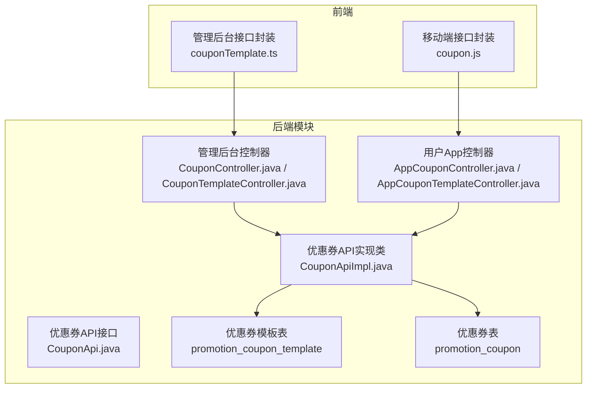
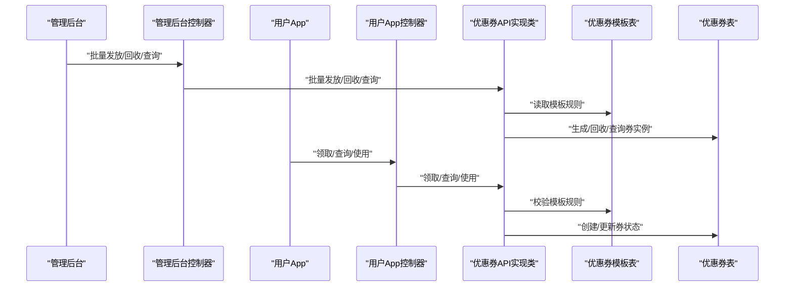
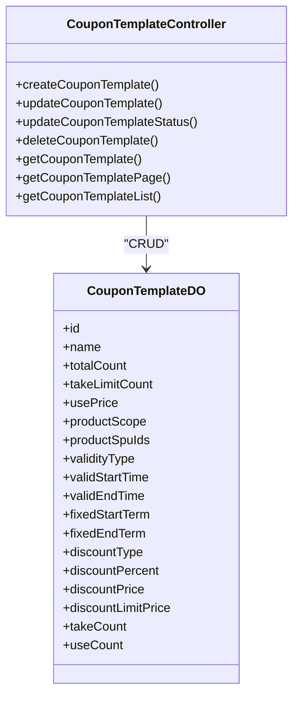
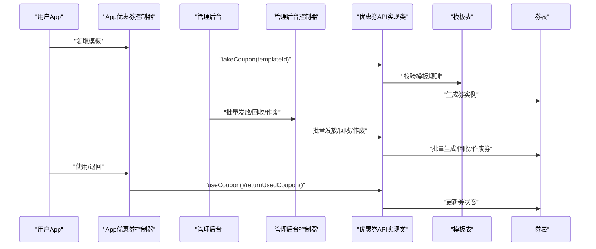
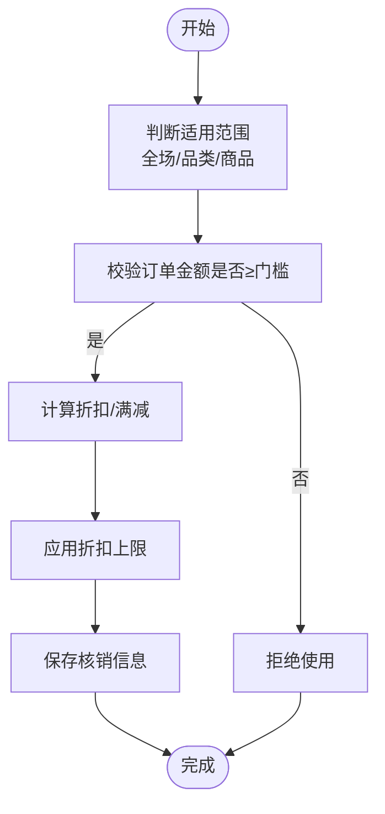
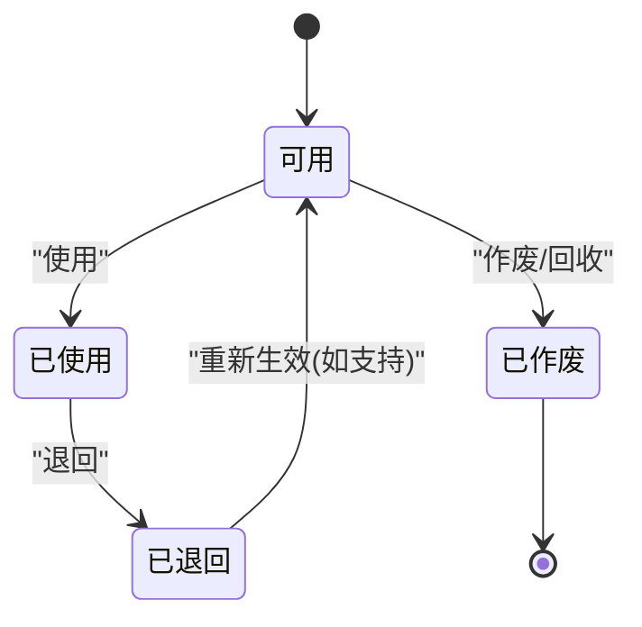
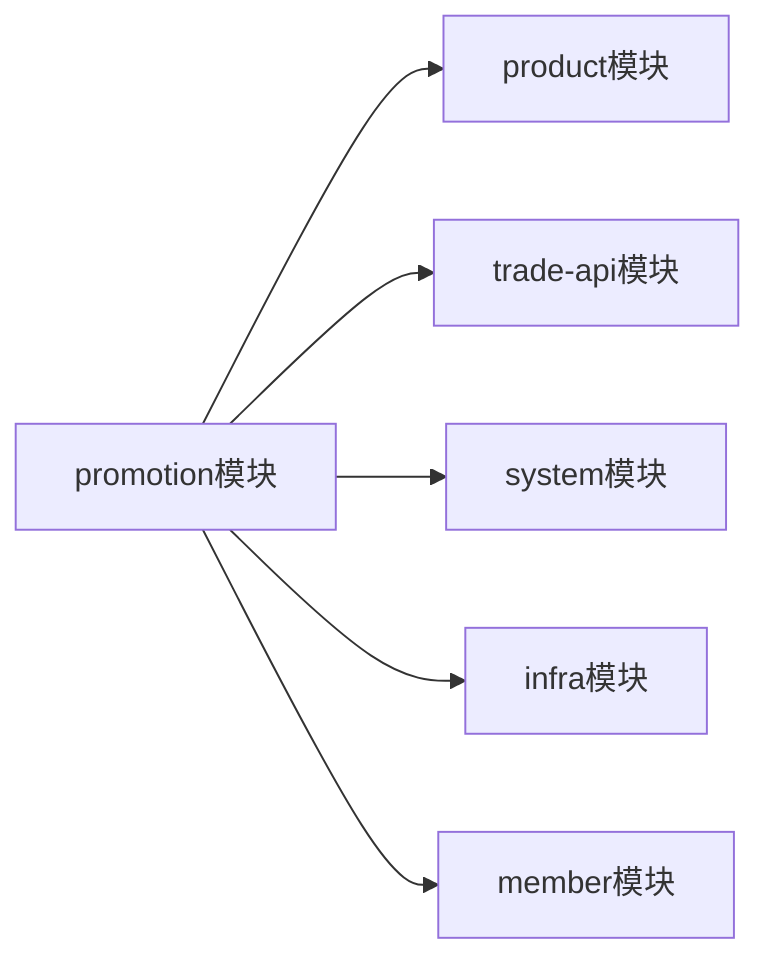
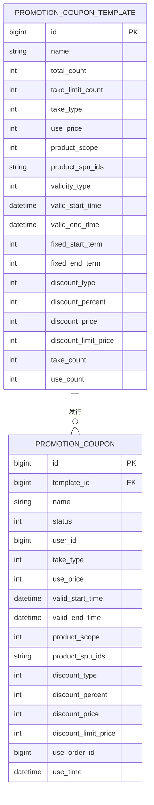

# 优惠券系统

<cite>
**本文引用的文件**
- [优惠券模块POM配置](file://backend/yudao-module-mall/yudao-module-promotion/pom.xml)
- [优惠券API接口定义](file://backend/yudao-module-mall/yudao-module-promotion/src/main/java/cn/iocoder/yudao/module/promotion/api/coupon/CouponApi.java)
- [优惠券API实现类](file://backend/yudao-module-mall/yudao-module-promotion/src/main/java/cn/iocoder/yudao/module/promotion/api/coupon/CouponApiImpl.java)
- [管理后台-优惠券控制器](file://backend/yudao-module-mall/yudao-module-promotion/src/main/java/cn/iocoder/yudao/module/promotion/controller/admin/coupon/CouponController.java)
- [管理后台-优惠券模板控制器](file://backend/yudao-module-mall/yudao-module-promotion/src/main/java/cn/iocoder/yudao/module/promotion/controller/admin/coupon/CouponTemplateController.java)
- [用户App-优惠券控制器](file://backend/yudao-module-mall/yudao-module-promotion/src/main/java/cn/iocoder/yudao/module/promotion/controller/app/coupon/AppCouponController.java)
- [用户App-优惠券模板控制器](file://backend/yudao-module-mall/yudao-module-promotion/src/main/java/cn/iocoder/yudao/module/promotion/controller/app/coupon/AppCouponTemplateController.java)
- [优惠券模板数据库表结构](file://backend/yudao-module-mall/yudao-module-promotion/src/test/resources/sql/create_tables.sql)
- [优惠券数据库表结构](file://backend/yudao-module-mall/yudao-module-promotion/src/test/resources/sql/create_tables.sql)
- [前端-优惠券模板API（管理端）](file://frontend/admin-vue3/src/api/mall/promotion/coupon/couponTemplate.ts)
- [前端-优惠券API（移动端）](file://frontend/mall-uniapp/sheep/api/promotion/coupon.js)
</cite>

## 目录
1. [简介](#简介)
2. [项目结构](#项目结构)
3. [核心组件](#核心组件)
4. [架构总览](#架构总览)
5. [详细组件分析](#详细组件分析)
6. [依赖关系分析](#依赖关系分析)
7. [性能考虑](#性能考虑)
8. [故障排查指南](#故障排查指南)
9. [结论](#结论)
10. [附录](#附录)

## 简介
本文件面向“优惠券系统”的设计与实现，覆盖优惠券模板管理、优惠券批次发行、用户领取与使用、核销流程、风控与统计分析等核心能力。系统采用前后端分离架构，后端基于 Java 微服务模块化设计，前端提供管理后台与移动端接口调用。本文档以代码为依据，结合数据库表结构，对业务规则、数据模型、接口定义与调用流程进行系统性梳理。

## 项目结构
优惠券系统位于后端模块 yudao-module-promotion 中，包含以下关键层次：
- API 层：对外暴露优惠券能力的接口定义与实现
- 控制器层：管理后台与用户 App 的 REST 接口
- 服务层：优惠券模板与优惠券的业务处理（由 API 实现类调用）
- 数据访问层：DAO/DO 对应数据库表结构（模板与券两张表）
- 前端层：管理后台与移动端的接口封装与调用

图表来源
- [优惠券API接口定义:1-58](file://backend/yudao-module-mall/yudao-module-promotion/src/main/java/cn/iocoder/yudao/module/promotion/api/coupon/CouponApi.java#L1-L58)
- [优惠券API实现类:1-54](file://backend/yudao-module-mall/yudao-module-promotion/src/main/java/cn/iocoder/yudao/module/promotion/api/coupon/CouponApiImpl.java#L1-L54)
- [管理后台-优惠券控制器:1-75](file://backend/yudao-module-mall/yudao-module-promotion/src/main/java/cn/iocoder/yudao/module/promotion/controller/admin/coupon/CouponController.java#L1-L75)
- [管理后台-优惠券模板控制器:1-91](file://backend/yudao-module-mall/yudao-module-promotion/src/main/java/cn/iocoder/yudao/module/promotion/controller/admin/coupon/CouponTemplateController.java#L1-L91)
- [用户App-优惠券控制器:1-81](file://backend/yudao-module-mall/yudao-module-promotion/src/main/java/cn/iocoder/yudao/module/promotion/controller/app/coupon/AppCouponController.java#L1-L81)
- [用户App-优惠券模板控制器:1-147](file://backend/yudao-module-mall/yudao-module-promotion/src/main/java/cn/iocoder/yudao/module/promotion/controller/app/coupon/AppCouponTemplateController.java#L1-L147)
- [优惠券模板数据库表结构:27-50](file://backend/yudao-module-mall/yudao-module-promotion/src/test/resources/sql/create_tables.sql#L27-L50)
- [优惠券数据库表结构:52-77](file://backend/yudao-module-mall/yudao-module-promotion/src/test/resources/sql/create_tables.sql#L52-L77)

章节来源
- [优惠券模块POM配置:1-84](file://backend/yudao-module-mall/yudao-module-promotion/pom.xml#L1-L84)

## 核心组件
- 优惠券模板（CouponTemplate）：定义优惠券的面额、折扣、有效期、适用范围、领取上限等规则
- 优惠券（Coupon）：用户实际持有的优惠券实例，记录模板信息、持有者、使用状态与核销信息
- API 接口：统一对外提供查询、使用、退回、批量发放、作废等能力
- 控制器：管理后台负责模板管理与券的回收、批量发放；App 端负责模板查询、用户领取与我的券列表

章节来源
- [优惠券模板数据库表结构:27-50](file://backend/yudao-module-mall/yudao-module-promotion/src/test/resources/sql/create_tables.sql#L27-L50)
- [优惠券数据库表结构:52-77](file://backend/yudao-module-mall/yudao-module-promotion/src/test/resources/sql/create_tables.sql#L52-L77)
- [优惠券API接口定义:1-58](file://backend/yudao-module-mall/yudao-module-promotion/src/main/java/cn/iocoder/yudao/module/promotion/api/coupon/CouponApi.java#L1-L58)
- [优惠券API实现类:1-54](file://backend/yudao-module-mall/yudao-module-promotion/src/main/java/cn/iocoder/yudao/module/promotion/api/coupon/CouponApiImpl.java#L1-L54)

## 架构总览
系统采用分层架构，前端通过 HTTP 接口调用后端控制器，控制器委托 API 实现类，最终访问数据库中的优惠券模板与优惠券表完成业务处理。

图表来源
- [管理后台-优惠券控制器:1-75](file://backend/yudao-module-mall/yudao-module-promotion/src/main/java/cn/iocoder/yudao/module/promotion/controller/admin/coupon/CouponController.java#L1-L75)
- [用户App-优惠券控制器:1-81](file://backend/yudao-module-mall/yudao-module-promotion/src/main/java/cn/iocoder/yudao/module/promotion/controller/app/coupon/AppCouponController.java#L1-L81)
- [优惠券API实现类:1-54](file://backend/yudao-module-mall/yudao-module-promotion/src/main/java/cn/iocoder/yudao/module/promotion/api/coupon/CouponApiImpl.java#L1-L54)
- [优惠券模板数据库表结构:27-50](file://backend/yudao-module-mall/yudao-module-promotion/src/test/resources/sql/create_tables.sql#L27-L50)
- [优惠券数据库表结构:52-77](file://backend/yudao-module-mall/yudao-module-promotion/src/test/resources/sql/create_tables.sql#L52-L77)

## 详细组件分析

### 优惠券模板管理
- 功能职责：创建、更新、上下线、删除、分页查询、按ID列表查询
- 关键字段：模板名称、总量、每人限领、使用门槛、有效期类型（固定/相对）、折扣类型（百分比/满减）、折扣上限、适用范围（全场/品类/商品）
- 权限控制：管理后台操作需具备相应权限
- 前端对接：管理后台提供创建、更新、上下线、删除、分页与列表查询接口

图表来源
- [管理后台-优惠券模板控制器:1-91](file://backend/yudao-module-mall/yudao-module-promotion/src/main/java/cn/iocoder/yudao/module/promotion/controller/admin/coupon/CouponTemplateController.java#L1-L91)
- [优惠券模板数据库表结构:27-50](file://backend/yudao-module-mall/yudao-module-promotion/src/test/resources/sql/create_tables.sql#L27-L50)

章节来源
- [管理后台-优惠券模板控制器:1-91](file://backend/yudao-module-mall/yudao-module-promotion/src/main/java/cn/iocoder/yudao/module/promotion/controller/admin/coupon/CouponTemplateController.java#L1-L91)
- [优惠券模板数据库表结构:27-50](file://backend/yudao-module-mall/yudao-module-promotion/src/test/resources/sql/create_tables.sql#L27-L50)
- [前端-优惠券模板API（管理端）:1-60](file://frontend/admin-vue3/src/api/mall/promotion/coupon/couponTemplate.ts#L1-L60)

### 优惠券批次发行与核销
- 批量发行：管理后台根据模板ID向指定用户集合发放优惠券
- 回收与作废：支持管理员回收或作废指定用户的优惠券
- 使用与退回：用户在订单结算时使用优惠券；若订单取消或异常，支持退回已使用优惠券
- App 端领取：用户可直接领取模板（限直接领取场景），并可查询我的优惠券列表与未使用数量

图表来源
- [用户App-优惠券控制器:1-81](file://backend/yudao-module-mall/yudao-module-promotion/src/main/java/cn/iocoder/yudao/module/promotion/controller/app/coupon/AppCouponController.java#L1-L81)
- [管理后台-优惠券控制器:1-75](file://backend/yudao-module-mall/yudao-module-promotion/src/main/java/cn/iocoder/yudao/module/promotion/controller/admin/coupon/CouponController.java#L1-L75)
- [优惠券API接口定义:1-58](file://backend/yudao-module-mall/yudao-module-promotion/src/main/java/cn/iocoder/yudao/module/promotion/api/coupon/CouponApi.java#L1-L58)
- [优惠券API实现类:1-54](file://backend/yudao-module-mall/yudao-module-promotion/src/main/java/cn/iocoder/yudao/module/promotion/api/coupon/CouponApiImpl.java#L1-L54)

章节来源
- [用户App-优惠券控制器:1-81](file://backend/yudao-module-mall/yudao-module-promotion/src/main/java/cn/iocoder/yudao/module/promotion/controller/app/coupon/AppCouponController.java#L1-L81)
- [管理后台-优惠券控制器:1-75](file://backend/yudao-module-mall/yudao-module-promotion/src/main/java/cn/iocoder/yudao/module/promotion/controller/admin/coupon/CouponController.java#L1-L75)
- [优惠券API接口定义:1-58](file://backend/yudao-module-mall/yudao-module-promotion/src/main/java/cn/iocoder/yudao/module/promotion/api/coupon/CouponApi.java#L1-L58)
- [优惠券API实现类:1-54](file://backend/yudao-module-mall/yudao-module-promotion/src/main/java/cn/iocoder/yudao/module/promotion/api/coupon/CouponApiImpl.java#L1-L54)

### 优惠券类型与使用规则
- 现金券：固定金额抵扣（满减）
- 折扣券：按比例折扣（百分比）
- 免邮券：满足门槛后免运费（系统侧逻辑可扩展）
- 使用门槛：满XX可用（use_price）
- 适用范围：全场、品类、指定商品
- 有效期：固定时间段或相对天数（fixed_start_term/fixed_end_term）

图表来源
- [优惠券模板数据库表结构:27-50](file://backend/yudao-module-mall/yudao-module-promotion/src/test/resources/sql/create_tables.sql#L27-L50)
- [优惠券数据库表结构:52-77](file://backend/yudao-module-mall/yudao-module-promotion/src/test/resources/sql/create_tables.sql#L52-L77)

章节来源
- [优惠券模板数据库表结构:27-50](file://backend/yudao-module-mall/yudao-module-promotion/src/test/resources/sql/create_tables.sql#L27-L50)
- [优惠券数据库表结构:52-77](file://backend/yudao-module-mall/yudao-module-promotion/src/test/resources/sql/create_tables.sql#L52-L77)

### 优惠券生命周期管理
- 创建模板：设置规则与库存
- 发放/领取：按模板规则生成券实例
- 使用：订单支付前核销
- 退回：订单取消或异常回滚
- 回收/作废：管理员回收或作废指定券
- 统计：模板与券的领取/使用计数

图表来源
- [优惠券API接口定义:1-58](file://backend/yudao-module-mall/yudao-module-promotion/src/main/java/cn/iocoder/yudao/module/promotion/api/coupon/CouponApi.java#L1-L58)
- [优惠券API实现类:1-54](file://backend/yudao-module-mall/yudao-module-promotion/src/main/java/cn/iocoder/yudao/module/promotion/api/coupon/CouponApiImpl.java#L1-L54)

章节来源
- [优惠券API接口定义:1-58](file://backend/yudao-module-mall/yudao-module-promotion/src/main/java/cn/iocoder/yudao/module/promotion/api/coupon/CouponApi.java#L1-L58)
- [优惠券API实现类:1-54](file://backend/yudao-module-mall/yudao-module-promotion/src/main/java/cn/iocoder/yudao/module/promotion/api/coupon/CouponApiImpl.java#L1-L54)

### 优惠券风控机制
- 领取次数限制：模板级每人限领（take_limit_count）
- 库存与发放计数：模板总库存与已领取计数
- 使用门槛校验：订单金额必须达到 use_price
- 适用范围校验：仅允许在指定范围使用
- 有效期校验：当前时间必须在有效期内
- 状态一致性：使用/退回/作废/回收均需保证状态一致

章节来源
- [优惠券模板数据库表结构:27-50](file://backend/yudao-module-mall/yudao-module-promotion/src/test/resources/sql/create_tables.sql#L27-L50)
- [优惠券数据库表结构:52-77](file://backend/yudao-module-mall/yudao-module-promotion/src/test/resources/sql/create_tables.sql#L52-L77)
- [用户App-优惠券模板控制器:1-147](file://backend/yudao-module-mall/yudao-module-promotion/src/main/java/cn/iocoder/yudao/module/promotion/controller/app/coupon/AppCouponTemplateController.java#L1-L147)

### 优惠券统计分析与效果评估
- 模板维度：模板总发行量、使用量、剩余量、使用率
- 用户维度：用户领取/使用/未使用数量
- 时间维度：按日/周/月统计使用趋势
- 效果评估：客单价变化、GMV影响、ROI（需结合订单与交易模块）

章节来源
- [优惠券模板数据库表结构:27-50](file://backend/yudao-module-mall/yudao-module-promotion/src/test/resources/sql/create_tables.sql#L27-L50)
- [用户App-优惠券控制器:1-81](file://backend/yudao-module-mall/yudao-module-promotion/src/main/java/cn/iocoder/yudao/module/promotion/controller/app/coupon/AppCouponController.java#L1-L81)

## 依赖关系分析
- 模块依赖：promotion 模块依赖 product、trade-api、system、infra、member 等模块
- 控制器依赖：管理后台与 App 控制器分别依赖优惠券服务与会员服务
- 数据依赖：优惠券模板与优惠券两张表，模板表驱动券实例

图表来源
- [优惠券模块POM配置:1-84](file://backend/yudao-module-mall/yudao-module-promotion/pom.xml#L1-L84)

章节来源
- [优惠券模块POM配置:1-84](file://backend/yudao-module-mall/yudao-module-promotion/pom.xml#L1-L84)

## 性能考虑
- 分页查询：模板与券列表查询建议使用分页参数，避免一次性加载大量数据
- 批量操作：批量发放与批量查询应使用集合参数，减少网络往返
- 缓存策略：可对模板基础信息与用户可领取状态进行缓存，降低重复查询
- 并发控制：券发放与使用涉及库存与计数更新，需注意并发一致性（如乐观锁/分布式锁）
- 数据索引：按模板ID、用户ID、状态、有效期等常用查询字段建立索引

## 故障排查指南
- 无法领取：检查模板状态、每人限领、库存、有效期与适用范围
- 无法使用：检查订单金额是否满足门槛、券状态是否正常、是否过期
- 批量发放失败：确认模板ID存在、用户ID有效、模板状态正常
- 统计异常：核对 take_count/use_count 是否正确更新，是否存在并发写入问题

章节来源
- [用户App-优惠券模板控制器:1-147](file://backend/yudao-module-mall/yudao-module-promotion/src/main/java/cn/iocoder/yudao/module/promotion/controller/app/coupon/AppCouponTemplateController.java#L1-L147)
- [用户App-优惠券控制器:1-81](file://backend/yudao-module-mall/yudao-module-promotion/src/main/java/cn/iocoder/yudao/module/promotion/controller/app/coupon/AppCouponController.java#L1-L81)
- [管理后台-优惠券控制器:1-75](file://backend/yudao-module-mall/yudao-module-promotion/src/main/java/cn/iocoder/yudao/module/promotion/controller/admin/coupon/CouponController.java#L1-L75)

## 结论
本优惠券系统以模板驱动为核心，围绕“模板—券实例”两条主线实现完整的生命周期管理。通过清晰的接口分层与严格的风控校验，保障了业务的稳定性与可扩展性。建议后续完善核销审计、风控策略与效果评估体系，并持续优化性能与用户体验。

## 附录

### API 接口清单（后端）
- 管理后台
  - 创建模板：POST /promotion/coupon-template/create
  - 更新模板：PUT /promotion/coupon-template/update
  - 更新模板状态：PUT /promotion/coupon-template/update-status
  - 删除模板：DELETE /promotion/coupon-template/delete
  - 获取模板：GET /promotion/coupon-template/get
  - 模板分页：GET /promotion/coupon-template/page
  - 模板列表：GET /promotion/coupon-template/list
  - 批量发放：POST /promotion/coupon/send
  - 券分页：GET /promotion/coupon/page
  - 券回收：DELETE /promotion/coupon/delete
- 用户 App
  - 领取优惠券：POST /promotion/coupon/take
  - 我的优惠券分页：GET /promotion/coupon/page
  - 获取优惠券：GET /promotion/coupon/get
  - 未使用数量：GET /promotion/coupon/get-unused-count
  - 模板详情：GET /promotion/coupon-template/get
  - 模板列表：GET /promotion/coupon-template/list
  - 模板分页：GET /promotion/coupon-template/page

章节来源
- [管理后台-优惠券模板控制器:1-91](file://backend/yudao-module-mall/yudao-module-promotion/src/main/java/cn/iocoder/yudao/module/promotion/controller/admin/coupon/CouponTemplateController.java#L1-L91)
- [管理后台-优惠券控制器:1-75](file://backend/yudao-module-mall/yudao-module-promotion/src/main/java/cn/iocoder/yudao/module/promotion/controller/admin/coupon/CouponController.java#L1-L75)
- [用户App-优惠券控制器:1-81](file://backend/yudao-module-mall/yudao-module-promotion/src/main/java/cn/iocoder/yudao/module/promotion/controller/app/coupon/AppCouponController.java#L1-L81)
- [用户App-优惠券模板控制器:1-147](file://backend/yudao-module-mall/yudao-module-promotion/src/main/java/cn/iocoder/yudao/module/promotion/controller/app/coupon/AppCouponTemplateController.java#L1-L147)

### 数据模型（简化）

图表来源
- [优惠券模板数据库表结构:27-50](file://backend/yudao-module-mall/yudao-module-promotion/src/test/resources/sql/create_tables.sql#L27-L50)
- [优惠券数据库表结构:52-77](file://backend/yudao-module-mall/yudao-module-promotion/src/test/resources/sql/create_tables.sql#L52-L77)