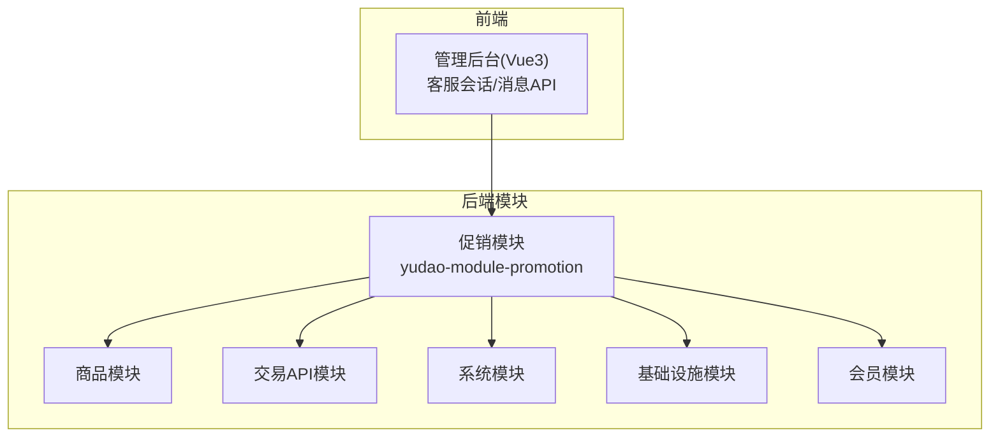
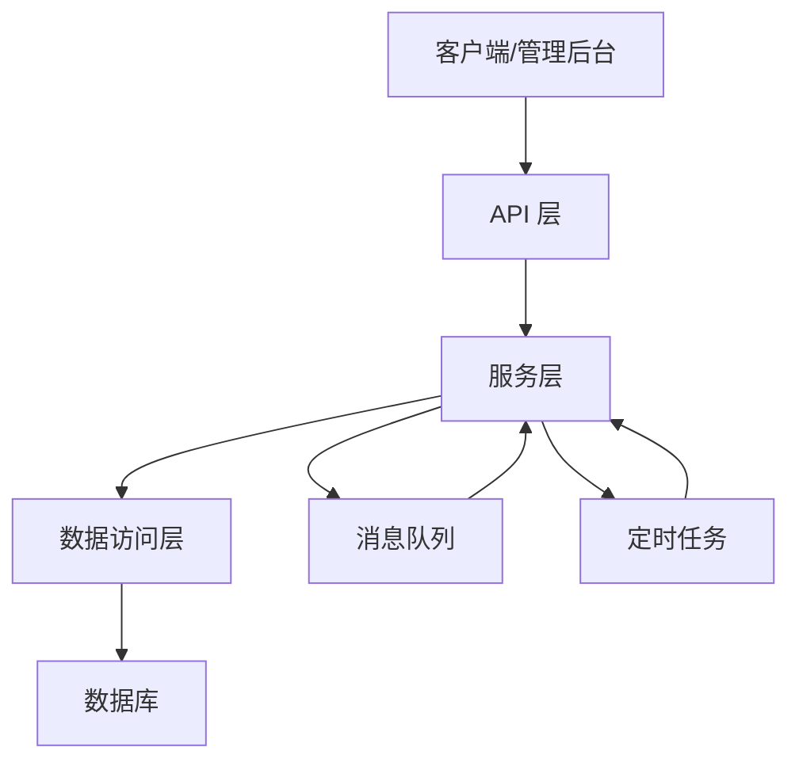
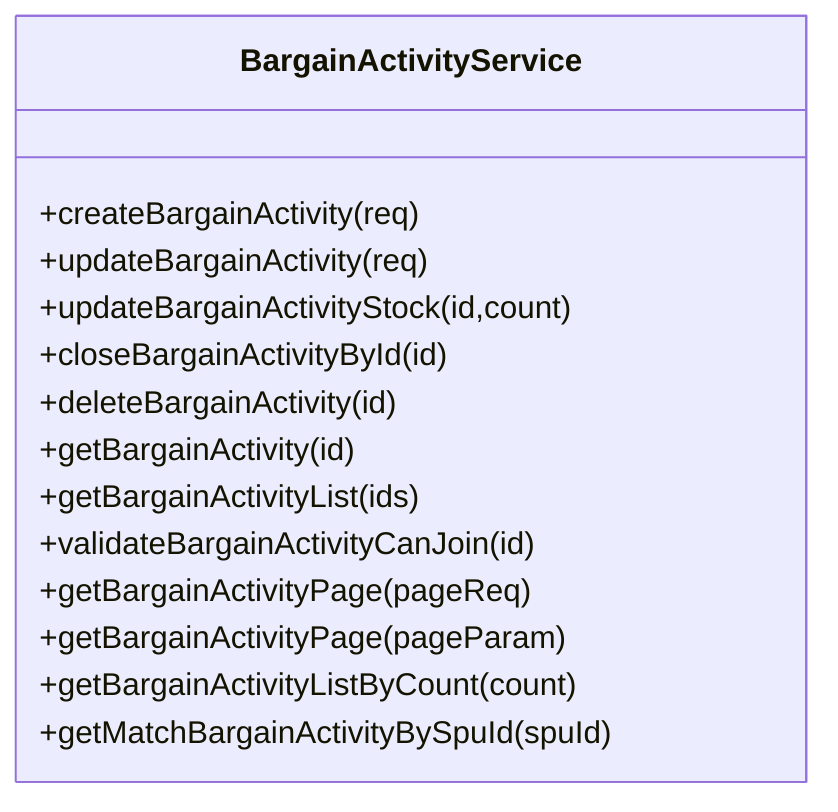
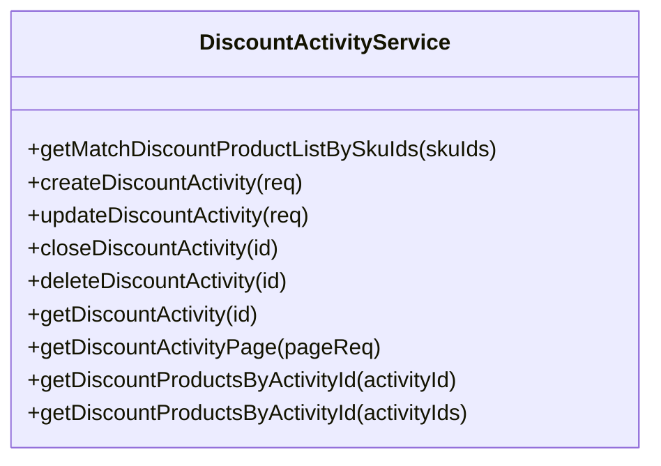
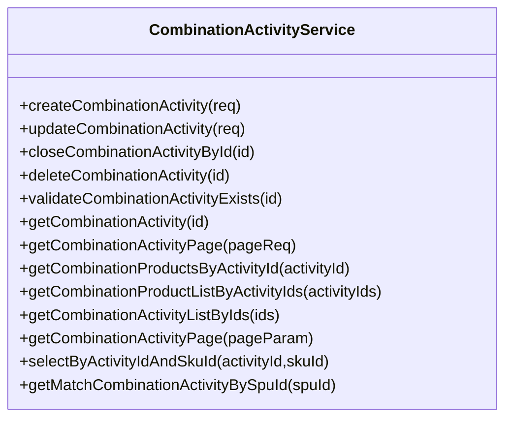
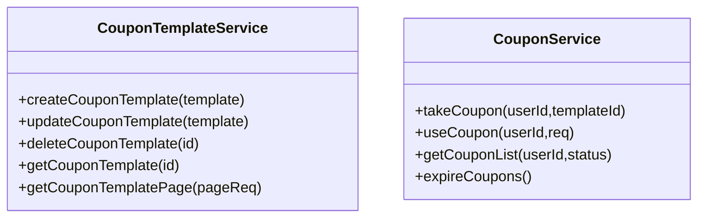
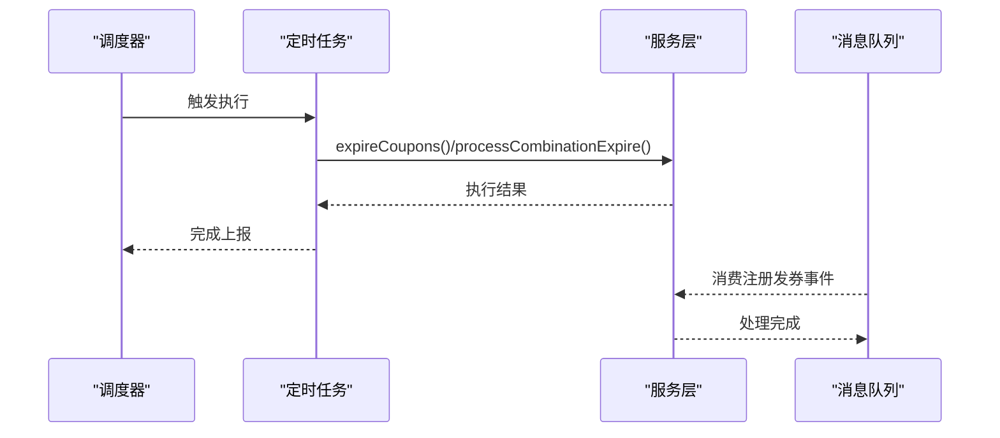
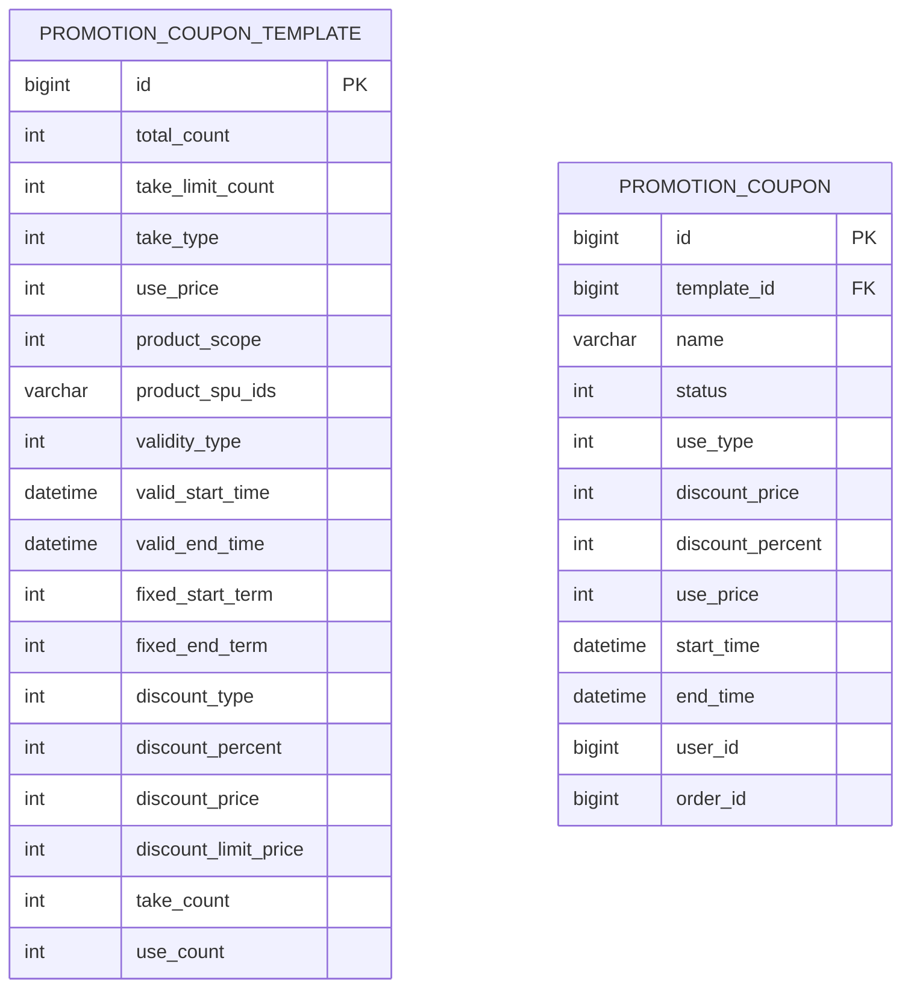
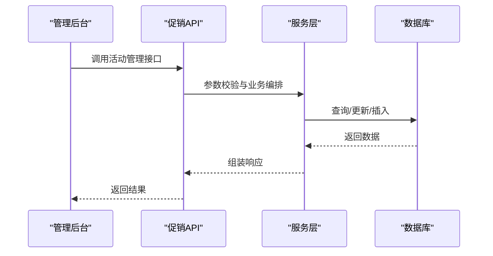
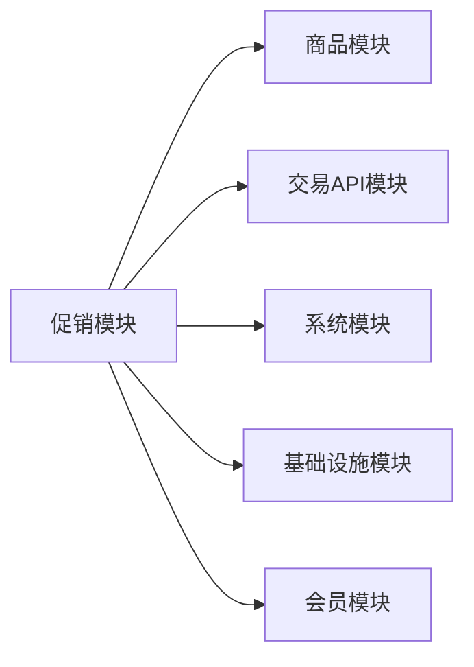

# 促销活动系统

<cite>
**本文档引用的文件**
- [pom.xml](file://backend/yudao-module-mall/yudao-module-promotion/pom.xml)
- [BargainActivityService.java](file://backend/yudao-module-mall/yudao-module-promotion/src/main/java/cn/iocoder/yudao/module/promotion/service/bargain/BargainActivityService.java)
- [DiscountActivityService.java](file://backend/yudao-module-mall/yudao-module-promotion/src/main/java/cn/iocoder/yudao/module/promotion/service/discount/DiscountActivityService.java)
- [CombinationActivityService.java](file://backend/yudao-module-mall/yudao-module-promotion/src/main/java/cn/iocoder/yudao/module/promotion/service/combination/CombinationActivityService.java)
- [CouponService.java](file://backend/yudao-module-mall/yudao-module-promotion/src/main/java/cn/iocoder/yudao/module/promotion/service/coupon/CouponService.java)
- [CouponTemplateService.java](file://backend/yudao-module-mall/yudao-module-promotion/src/main/java/cn/iocoder/yudao/module/promotion/service/coupon/CouponTemplateService.java)
- [BargainActivityApi.java](file://backend/yudao-module-mall/yudao-module-promotion/src/main/java/cn/iocoder/yudao/module/promotion/api/bargain/BargainActivityApi.java)
- [DiscountActivityApi.java](file://backend/yudao-module-mall/yudao-module-promotion/src/main/java/cn/iocoder/yudao/module/promotion/api/discount/DiscountActivityApi.java)
- [CombinationRecordApi.java](file://backend/yudao-module-mall/yudao-module-promotion/src/main/java/cn/iocoder/yudao/module/promotion/api/combination/CombinationRecordApi.java)
- [CouponApi.java](file://backend/yudao-module-mall/yudao-module-promotion/src/main/java/cn/iocoder/yudao/module/promotion/api/coupon/CouponApi.java)
- [CombinationRecordCreateReqDTO.java](file://backend/yudao-module-mall/yudao-module-promotion/src/main/java/cn/iocoder/yudao/module/promotion/api/combination/dto/CombinationRecordCreateReqDTO.java)
- [CombinationValidateJoinRespDTO.java](file://backend/yudao-module-mall/yudao-module-promotion/src/main/java/cn/iocoder/yudao/module/promotion/api/combination/dto/CombinationValidateJoinRespDTO.java)
- [BargainValidateJoinRespDTO.java](file://backend/yudao-module-mall/yudao-module-promotion/src/main/java/cn/iocoder/yudao/module/promotion/api/bargain/dto/BargainValidateJoinRespDTO.java)
- [DiscountProductRespDTO.java](file://backend/yudao-module-mall/yudao-module-promotion/src/main/java/cn/iocoder/yudao/module/promotion/api/discount/dto/DiscountProductRespDTO.java)
- [CouponUseReqDTO.java](file://backend/yudao-module-mall/yudao-module-promotion/src/main/java/cn/iocoder/yudao/module/promotion/api/coupon/dto/CouponUseReqDTO.java)
- [CouponRespDTO.java](file://backend/yudao-module-mall/yudao-module-promotion/src/main/java/cn/iocoder/yudao/module/promotion/api/coupon/dto/CouponRespDTO.java)
- [CombinationRecordExpireJob.java](file://backend/yudao-module-mall/yudao-module-promotion/src/main/java/cn/iocoder/yudao/module/promotion/job/combination/CombinationRecordExpireJob.java)
- [CouponExpireJob.java](file://backend/yudao-module-mall/yudao-module-promotion/src/main/java/cn/iocoder/yudao/module/promotion/job/coupon/CouponExpireJob.java)
- [CouponTakeByRegisterConsumer.java](file://backend/yudao-module-mall/yudao-module-promotion/src/main/java/cn/iocoder/yudao/module/promotion/mq/consumer/coupon/CouponTakeByRegisterConsumer.java)
- [create_tables.sql](file://backend/yudao-module-mall/yudao-module-promotion/src/test/resources/sql/create_tables.sql)
- [KeFuConversationApi.java](file://frontend/admin-vue3/src/api/mall/promotion/kefu/conversation/index.ts)
- [KeFuMessageApi.java](file://frontend/admin-vue3/src/api/mall/promotion/kefu/message/index.ts)
</cite>

## 目录
1. [简介](#简介)
2. [项目结构](#项目结构)
3. [核心组件](#核心组件)
4. [架构总览](#架构总览)
5. [详细组件分析](#详细组件分析)
6. [依赖关系分析](#依赖关系分析)
7. [性能考虑](#性能考虑)
8. [故障排除指南](#故障排除指南)
9. [结论](#结论)
10. [附录](#附录)

## 简介
本文件面向促销活动系统，系统化梳理各类营销活动的实现机制与业务流程，包括砍价活动、限时折扣、拼团活动、优惠券等。文档覆盖活动规则配置、参与条件设置、活动时间管理、活动预算控制、生命周期管理、效果统计、冲突检测、自动上下线等核心能力，并提供API接口设计、模板管理、数据分析与ROI评估的技术实现方案。

## 项目结构
促销模块位于后端 yudao-module-mall 子模块中，采用按功能域划分的包结构，包含服务层、API 层、定时任务、消息队列消费者以及数据库表结构定义。前端提供客服会话与消息的管理接口，便于后台运营对促销活动进行监控与干预。

**图表来源**
- [pom.xml:21-46](file://backend/yudao-module-mall/yudao-module-promotion/pom.xml#L21-L46)

**章节来源**
- [pom.xml:1-84](file://backend/yudao-module-mall/yudao-module-promotion/pom.xml#L1-L84)

## 核心组件
- 活动服务层：提供各类促销活动的业务能力封装，如砍价、折扣、拼团、优惠券等。
- API 层：对外暴露活动相关的HTTP接口，供前端或外部系统调用。
- 定时任务：负责活动过期、库存释放、状态变更等自动化处理。
- 消息队列：用于异步发放优惠券、通知等解耦场景。
- 数据模型：基于测试SQL定义了优惠券模板与记录等核心表结构。

**章节来源**
- [BargainActivityService.java:19-116](file://backend/yudao-module-mall/yudao-module-promotion/src/main/java/cn/iocoder/yudao/module/promotion/service/bargain/BargainActivityService.java#L19-L116)
- [DiscountActivityService.java:19-92](file://backend/yudao-module-mall/yudao-module-promotion/src/main/java/cn/iocoder/yudao/module/promotion/service/discount/DiscountActivityService.java#L19-L92)
- [CombinationActivityService.java:21-127](file://backend/yudao-module-mall/yudao-module-promotion/src/main/java/cn/iocoder/yudao/module/promotion/service/combination/CombinationActivityService.java#L21-L127)
- [CouponService.java](file://backend/yudao-module-mall/yudao-module-promotion/src/main/java/cn/iocoder/yudao/module/promotion/service/coupon/CouponService.java)
- [CouponTemplateService.java](file://backend/yudao-module-mall/yudao-module-promotion/src/main/java/cn/iocoder/yudao/module/promotion/service/coupon/CouponTemplateService.java)
- [CombinationRecordExpireJob.java](file://backend/yudao-module-mall/yudao-module-promotion/src/main/java/cn/iocoder/yudao/module/promotion/job/combination/CombinationRecordExpireJob.java)
- [CouponExpireJob.java](file://backend/yudao-module-mall/yudao-module-promotion/src/main/java/cn/iocoder/yudao/module/promotion/job/coupon/CouponExpireJob.java)
- [CouponTakeByRegisterConsumer.java](file://backend/yudao-module-mall/yudao-module-promotion/src/main/java/cn/iocoder/yudao/module/promotion/mq/consumer/coupon/CouponTakeByRegisterConsumer.java)
- [create_tables.sql:27-57](file://backend/yudao-module-mall/yudao-module-promotion/src/test/resources/sql/create_tables.sql#L27-L57)

## 架构总览
系统采用分层架构，服务层负责业务编排，API 层提供REST接口，定时任务与消息队列承担异步与自动化职责，模块间通过依赖注入与接口契约协作。

**图表来源**
- [pom.xml:21-46](file://backend/yudao-module-mall/yudao-module-promotion/pom.xml#L21-L46)

## 详细组件分析

### 砍价活动
- 服务接口职责
  - 创建、更新、关闭、删除活动
  - 库存扣减校验
  - 参与校验与活动分页查询
  - 基于SPU匹配进行中的活动
- API 接口职责
  - 提供砍价活动的创建、更新、查询、分页等接口
  - 返回参与校验结果DTO

**图表来源**
- [BargainActivityService.java:19-116](file://backend/yudao-module-mall/yudao-module-promotion/src/main/java/cn/iocoder/yudao/module/promotion/service/bargain/BargainActivityService.java#L19-L116)

**章节来源**
- [BargainActivityService.java:19-116](file://backend/yudao-module-mall/yudao-module-promotion/src/main/java/cn/iocoder/yudao/module/promotion/service/bargain/BargainActivityService.java#L19-L116)
- [BargainActivityApi.java](file://backend/yudao-module-mall/yudao-module-promotion/src/main/java/cn/iocoder/yudao/module/promotion/api/bargain/BargainActivityApi.java)
- [BargainValidateJoinRespDTO.java](file://backend/yudao-module-mall/yudao-module-promotion/src/main/java/cn/iocoder/yudao/module/promotion/api/bargain/dto/BargainValidateJoinRespDTO.java)

### 限时折扣活动
- 服务接口职责
  - 基于SKU匹配活动商品
  - 创建、更新、关闭、删除活动
  - 活动分页与商品明细查询
- API 接口职责
  - 提供折扣活动管理接口
  - 返回折扣商品响应DTO

**图表来源**
- [DiscountActivityService.java:19-92](file://backend/yudao-module-mall/yudao-module-promotion/src/main/java/cn/iocoder/yudao/module/promotion/service/discount/DiscountActivityService.java#L19-L92)

**章节来源**
- [DiscountActivityService.java:19-92](file://backend/yudao-module-mall/yudao-module-promotion/src/main/java/cn/iocoder/yudao/module/promotion/service/discount/DiscountActivityService.java#L19-L92)
- [DiscountActivityApi.java](file://backend/yudao-module-mall/yudao-module-promotion/src/main/java/cn/iocoder/yudao/module/promotion/api/discount/DiscountActivityApi.java)
- [DiscountProductRespDTO.java](file://backend/yudao-module-mall/yudao-module-promotion/src/main/java/cn/iocoder/yudao/module/promotion/api/discount/dto/DiscountProductRespDTO.java)

### 拼团活动
- 服务接口职责
  - 创建、更新、关闭、删除拼团活动
  - 商品明细查询与活动分页
  - 基于SPU匹配进行中的活动
- API 接口职责
  - 提供拼团活动管理与参与校验接口
  - 返回拼团记录创建与校验响应DTO

**图表来源**
- [CombinationActivityService.java:21-127](file://backend/yudao-module-mall/yudao-module-promotion/src/main/java/cn/iocoder/yudao/module/promotion/service/combination/CombinationActivityService.java#L21-L127)

**章节来源**
- [CombinationActivityService.java:21-127](file://backend/yudao-module-mall/yudao-module-promotion/src/main/java/cn/iocoder/yudao/module/promotion/service/combination/CombinationActivityService.java#L21-L127)
- [CombinationRecordApi.java](file://backend/yudao-module-mall/yudao-module-promotion/src/main/java/cn/iocoder/yudao/module/promotion/api/combination/CombinationRecordApi.java)
- [CombinationRecordCreateReqDTO.java](file://backend/yudao-module-mall/yudao-module-promotion/src/main/java/cn/iocoder/yudao/module/promotion/api/combination/dto/CombinationRecordCreateReqDTO.java)
- [CombinationValidateJoinRespDTO.java](file://backend/yudao-module-mall/yudao-module-promotion/src/main/java/cn/iocoder/yudao/module/promotion/api/combination/dto/CombinationValidateJoinRespDTO.java)

### 优惠券
- 服务接口职责
  - 优惠券模板与优惠券的创建、使用、状态管理
  - 优惠券发放、核销、过期处理
- API 接口职责
  - 提供优惠券领取、使用、查询接口
  - 返回优惠券响应与使用请求DTO

**图表来源**
- [CouponTemplateService.java](file://backend/yudao-module-mall/yudao-module-promotion/src/main/java/cn/iocoder/yudao/module/promotion/service/coupon/CouponTemplateService.java)
- [CouponService.java](file://backend/yudao-module-mall/yudao-module-promotion/src/main/java/cn/iocoder/yudao/module/promotion/service/coupon/CouponService.java)

**章节来源**
- [CouponTemplateService.java](file://backend/yudao-module-mall/yudao-module-promotion/src/main/java/cn/iocoder/yudao/module/promotion/service/coupon/CouponTemplateService.java)
- [CouponService.java](file://backend/yudao-module-mall/yudao-module-promotion/src/main/java/cn/iocoder/yudao/module/promotion/service/coupon/CouponService.java)
- [CouponApi.java](file://backend/yudao-module-mall/yudao-module-promotion/src/main/java/cn/iocoder/yudao/module/promotion/api/coupon/CouponApi.java)
- [CouponUseReqDTO.java](file://backend/yudao-module-mall/yudao-module-promotion/src/main/java/cn/iocoder/yudao/module/promotion/api/coupon/dto/CouponUseReqDTO.java)
- [CouponRespDTO.java](file://backend/yudao-module-mall/yudao-module-promotion/src/main/java/cn/iocoder/yudao/module/promotion/api/coupon/dto/CouponRespDTO.java)

### 定时任务与消息队列
- 定时任务
  - 拼团订单超时处理
  - 优惠券过期处理
- 消息队列
  - 注册即发券等事件驱动场景

**图表来源**
- [CombinationRecordExpireJob.java](file://backend/yudao-module-mall/yudao-module-promotion/src/main/java/cn/iocoder/yudao/module/promotion/job/combination/CombinationRecordExpireJob.java)
- [CouponExpireJob.java](file://backend/yudao-module-mall/yudao-module-promotion/src/main/java/cn/iocoder/yudao/module/promotion/job/coupon/CouponExpireJob.java)
- [CouponTakeByRegisterConsumer.java](file://backend/yudao-module-mall/yudao-module-promotion/src/main/java/cn/iocoder/yudao/module/promotion/mq/consumer/coupon/CouponTakeByRegisterConsumer.java)

**章节来源**
- [CombinationRecordExpireJob.java](file://backend/yudao-module-mall/yudao-module-promotion/src/main/java/cn/iocoder/yudao/module/promotion/job/combination/CombinationRecordExpireJob.java)
- [CouponExpireJob.java](file://backend/yudao-module-mall/yudao-module-promotion/src/main/java/cn/iocoder/yudao/module/promotion/job/coupon/CouponExpireJob.java)
- [CouponTakeByRegisterConsumer.java](file://backend/yudao-module-mall/yudao-module-promotion/src/main/java/cn/iocoder/yudao/module/promotion/mq/consumer/coupon/CouponTakeByRegisterConsumer.java)

### 数据模型与表结构
- 优惠券模板与优惠券记录表结构定义，包含有效期、使用门槛、适用范围、折扣方式等字段。

**图表来源**
- [create_tables.sql:27-57](file://backend/yudao-module-mall/yudao-module-promotion/src/test/resources/sql/create_tables.sql#L27-L57)

**章节来源**
- [create_tables.sql:27-57](file://backend/yudao-module-mall/yudao-module-promotion/src/test/resources/sql/create_tables.sql#L27-L57)

### API 接口设计
- 砍价活动API：提供活动创建、更新、查询、参与校验等接口。
- 折扣活动API：提供活动管理与匹配商品查询接口。
- 拼团活动API：提供活动管理与拼团记录创建、校验接口。
- 优惠券API：提供模板管理、领取、使用、查询接口。
- 客服会话与消息API：提供会话列表、消息发送、已读状态更新等接口。

**图表来源**
- [BargainActivityApi.java](file://backend/yudao-module-mall/yudao-module-promotion/src/main/java/cn/iocoder/yudao/module/promotion/api/bargain/BargainActivityApi.java)
- [DiscountActivityApi.java](file://backend/yudao-module-mall/yudao-module-promotion/src/main/java/cn/iocoder/yudao/module/promotion/api/discount/DiscountActivityApi.java)
- [CombinationRecordApi.java](file://backend/yudao-module-mall/yudao-module-promotion/src/main/java/cn/iocoder/yudao/module/promotion/api/combination/CombinationRecordApi.java)
- [CouponApi.java](file://backend/yudao-module-mall/yudao-module-promotion/src/main/java/cn/iocoder/yudao/module/promotion/api/coupon/CouponApi.java)
- [KeFuConversationApi.java:19-38](file://frontend/admin-vue3/src/api/mall/promotion/kefu/conversation/index.ts#L19-L38)
- [KeFuMessageApi.java:18-35](file://frontend/admin-vue3/src/api/mall/promotion/kefu/message/index.ts#L18-L35)

**章节来源**
- [KeFuConversationApi.java:1-39](file://frontend/admin-vue3/src/api/mall/promotion/kefu/conversation/index.ts#L1-L39)
- [KeFuMessageApi.java:1-36](file://frontend/admin-vue3/src/api/mall/promotion/kefu/message/index.ts#L1-L36)

## 依赖关系分析
促销模块依赖商品、交易API、系统、基础设施与会员模块，形成跨模块协作；同时通过定时任务与消息队列实现异步与自动化。

**图表来源**
- [pom.xml:21-46](file://backend/yudao-module-mall/yudao-module-promotion/pom.xml#L21-L46)

**章节来源**
- [pom.xml:1-84](file://backend/yudao-module-mall/yudao-module-promotion/pom.xml#L1-L84)

## 性能考虑
- 服务层方法命名清晰，职责单一，便于缓存与限流策略落地。
- 定时任务与消息队列解耦批量处理，降低主流程压力。
- 建议在高频查询路径上引入缓存与索引优化，结合分页参数限制单次查询规模。
- 对活动库存与状态变更采用原子操作与分布式锁，避免并发问题。

## 故障排除指南
- 活动无法参与
  - 检查活动状态与时间有效性
  - 核对参与门槛与库存
- 订单无法应用优惠券
  - 校验优惠券状态与适用范围
  - 确认订单金额满足使用门槛
- 活动自动下线异常
  - 查看定时任务执行日志
  - 确认数据库时间与时区设置
- 消息未送达
  - 检查消息队列消费者状态
  - 核对消费幂等与重试策略

## 结论
促销模块以清晰的分层与接口设计支撑多类营销活动，配合定时任务与消息队列实现自动化与异步处理。建议在生产环境中完善缓存、限流、监控与审计能力，确保活动高可用与可追溯性。

## 附录
- 活动模板管理：通过优惠券模板与活动配置实现灵活的规则组合。
- 活动效果统计：结合订单与优惠券使用记录进行转化率、GMV与ROI分析。
- 冲突检测：在活动创建与更新时校验时间区间与商品范围冲突。
- 自动上下线：基于时间与库存阈值触发状态变更，保障资源合理利用。