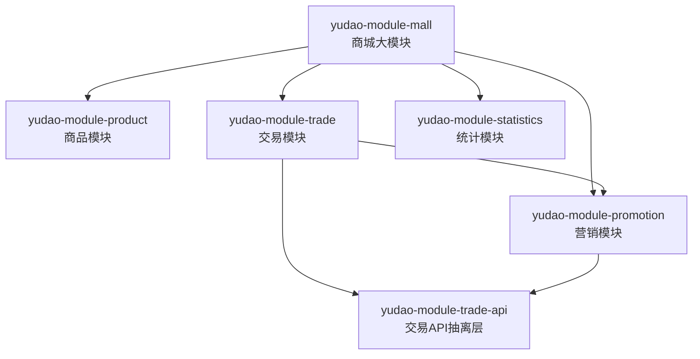
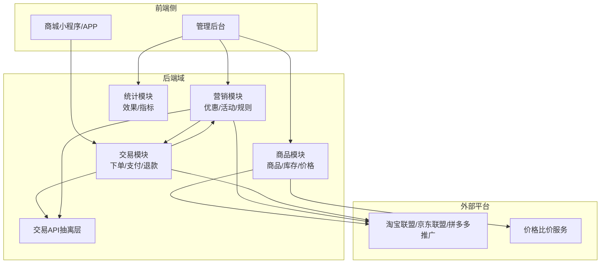
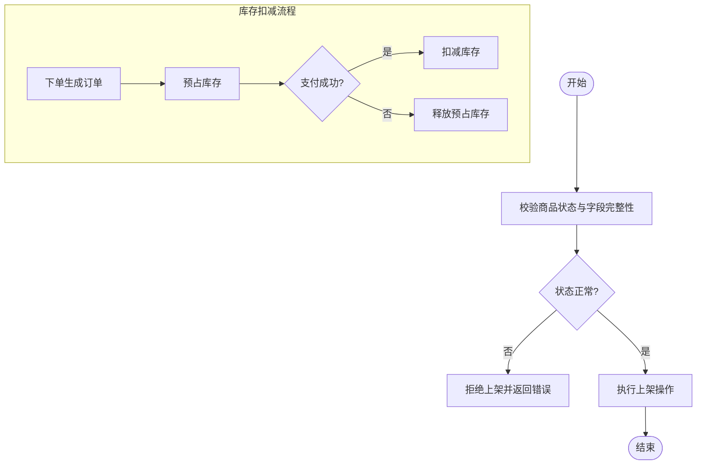
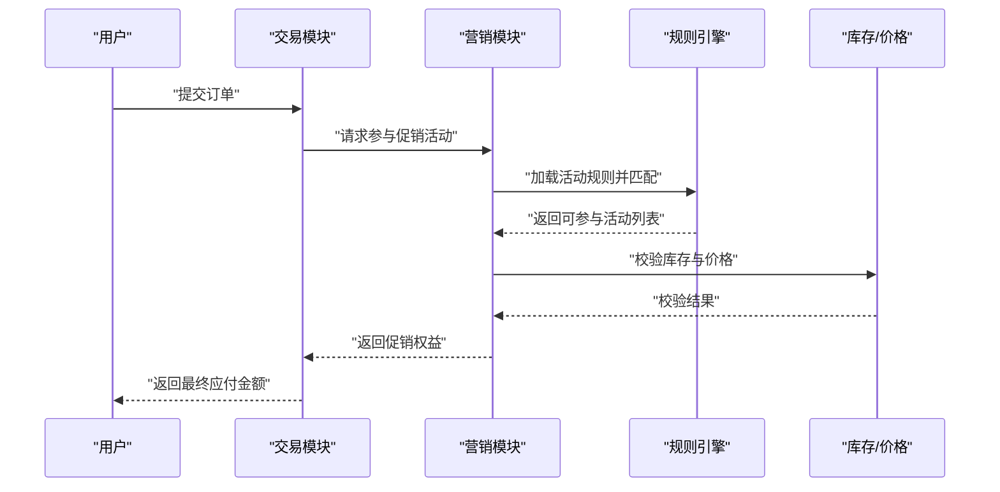
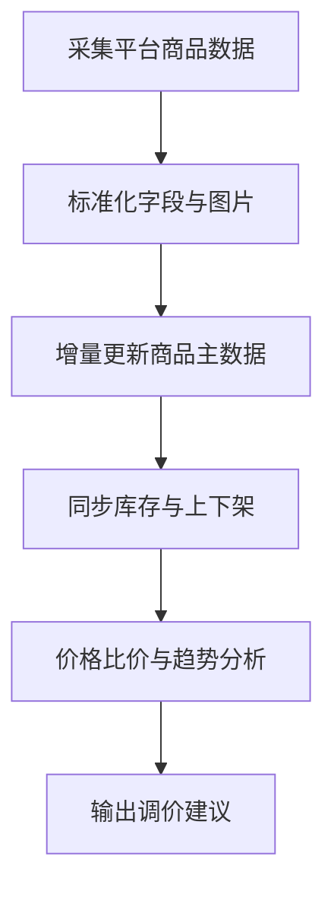
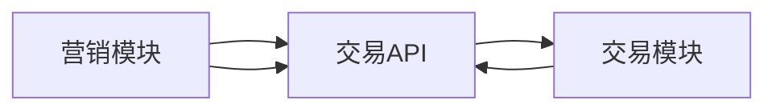

# 商品促销系统

<cite>
**本文引用的文件**
- [yudao-module-mall/pom.xml](file://backend/yudao-module-mall/pom.xml)
- [product/package-info.java](file://backend/yudao-module-mall/yudao-module-product/src/main/java/cn/iocoder/yudao/module/product/package-info.java)
- [promotion/package-info.java](file://backend/yudao-module-mall/yudao-module-promotion/src/main/java/cn/iocoder/yudao/module/promotion/package-info.java)
- [yudao-module-mall/README.md](file://docs/CPS系统PRD文档.md)
</cite>

## 目录
1. [引言](#引言)
2. [项目结构](#项目结构)
3. [核心组件](#核心组件)
4. [架构总览](#架构总览)
5. [详细组件分析](#详细组件分析)
6. [依赖分析](#依赖分析)
7. [性能考虑](#性能考虑)
8. [故障排查指南](#故障排查指南)
9. [结论](#结论)
10. [附录](#附录)

## 引言
本文件面向“商品促销系统”的综合技术文档，目标是为产品管理、分类管理、库存管理、价格管理等基础能力，以及优惠券、满减活动、拼团活动、秒杀活动等促销功能提供清晰的架构说明与实现要点。文档同时覆盖商品上下架机制、价格计算规则、库存扣减策略、活动参与条件等业务逻辑，并扩展到多平台商品同步、价格比价、活动规则配置、营销效果统计等技术实现路径。

由于当前仓库中后端模块的实体类与映射文件尚未完全展开，本文在不展示具体代码的前提下，基于现有模块信息与通用电商促销系统设计模式进行系统化阐述，并通过图示帮助读者建立对整体架构与关键流程的理解。

## 项目结构
后端采用多模块聚合结构，商城大模块由商品、营销、交易、统计等子模块构成。其中：
- product 模块：负责商品与库存相关的核心领域能力（如商品上下架、SKU、库存扣减等）
- promotion 模块：负责营销活动与优惠体系（如优惠券、满减、拼团、秒杀等）
- trade 模块：负责交易域能力（下单、支付、退款等）
- statistics 模块：负责营销效果与运营指标统计
- trade-api 模块：作为 trade 与 promotion 的共享 API 抽离层，避免循环依赖

图表来源
- [yudao-module-mall/pom.xml:20-33](file://backend/yudao-module-mall/pom.xml#L20-L33)

章节来源
- [yudao-module-mall/pom.xml:17-33](file://backend/yudao-module-mall/pom.xml#L17-L33)

## 核心组件
- 商品模块（product）
  - 职责边界：商品基础信息、SPU/SKU、分类、品牌、上下架、库存与价格管理
  - 关键接口命名规范：Controller URL 以 /product/ 开头；DO 表名以 product_ 开头
  - 与营销模块解耦：通过 trade-api 提供只读或受控的领域接口，避免直接耦合

- 营销模块（promotion）
  - 职责边界：优惠券模板与发放、满减活动、拼团活动、秒杀活动、活动规则配置与校验
  - 关键接口命名规范：Controller URL 以 /promotion/ 开头；DO 表名以 promotion_ 开头
  - 与交易模块协作：通过 trade-api 获取订单、用户、商品等上下文信息

- 交易模块（trade）
  - 职责边界：下单、支付、退款、发货、售后等交易生命周期管理
  - 与营销模块协作：在下单时触发促销规则匹配与权益计算

- 统计模块（statistics）
  - 职责边界：营销活动效果统计、GMV/UV/转化率等指标产出

章节来源
- [product/package-info.java:1-9](file://backend/yudao-module-mall/yudao-module-product/src/main/java/cn/iocoder/yudao/module/product/package-info.java#L1-L9)
- [promotion/package-info.java:1-9](file://backend/yudao-module-mall/yudao-module-promotion/src/main/java/cn/iocoder/yudao/module/promotion/package-info.java#L1-L9)

## 架构总览
下图展示了商品促销系统在业务域与模块间的交互关系，以及与外部平台的对接思路：

说明
- 商品模块负责商品与库存的基础数据与上下架控制
- 营销模块负责活动规则与优惠计算
- 交易模块负责订单生命周期与与营销的协同
- trade-api 作为中间层，避免营销与交易之间的循环依赖
- 外部平台用于多平台商品同步与价格比价

## 详细组件分析

### 商品管理与库存管理
- 商品上下架机制
  - 上架：校验商品状态、SPU/SKU 完整性、主图/详情/价格等关键字段
  - 下架：冻结 SKU 销售权限，保留历史订单与评价不受影响
  - 并发控制：使用版本号或乐观锁保证上下架操作一致性
- 库存管理
  - 实时库存：下单预占、支付成功扣减、取消订单释放
  - 扣减策略：支持“全款预售”、“定金预售”等差异化库存策略
  - 库存预警：低库存告警与补货提醒
- 价格管理
  - 原价/销售价/会员价/限时价等多价格维度
  - 价格生效时间与失效时间控制
  - 与营销规则联动：促销价优先于会员价，限时价优先于普通销售价

### 促销功能与规则引擎
- 优惠券
  - 模板：满减、折扣、免邮、专用券等
  - 发放：注册送、签到送、活动定向发
  - 使用：订单结算时自动匹配可用券，支持叠加与互斥规则
- 满减活动
  - 活动类型：满 M 减 N、第二件半价、N 折
  - 参与条件：品类/品牌/SKU 限定、最低消费门槛
- 拼团活动
  - 成团条件：成团人数、有效期、参团资格
  - 价格策略：团长价/拼团价
- 秒杀活动
  - 库存与流量控制：限流、排队、令牌桶
  - 价格策略：秒杀价、限购数量
  - 防刷：验证码、风控、IP 限制

### 多平台商品同步与价格比价
- 多平台同步
  - 商品主数据同步：SPU/SKU、图片、标题、卖点、价格
  - 库存与上下架同步：定时任务+事件驱动
  - 差异处理：平台差异字段映射与清洗
- 价格比价
  - 对标竞品价格，生成价格区间与趋势
  - 支持动态调价策略与促销联动

### 营销效果统计
- 活动维度：曝光量、点击率、下单转化、成交 GMV、客单价
- 用户维度：新客数、复购率、RFM 分层
- ROI 计算：投入成本/收益，支持分渠道与分活动对比

## 依赖分析
- 模块间依赖
  - trade 依赖 trade-api
  - promotion 依赖 trade-api
  - 通过 trade-api 解决 trade 与 promotion 的循环依赖问题
- 外部依赖
  - 定时任务：Quartz 等
  - 缓存：Redis
  - 消息队列：RocketMQ/RabbitMQ
  - 监控与链路追踪：SkyWalking/Actuator

图表来源
- [yudao-module-mall/pom.xml:26-32](file://backend/yudao-module-mall/pom.xml#L26-L32)

章节来源
- [yudao-module-mall/pom.xml:26-32](file://backend/yudao-module-mall/pom.xml#L26-L32)

## 性能考虑
- 缓存策略
  - 商品详情与活动信息缓存，热点数据本地缓存+分布式缓存双写
  - 价格与库存读多写少场景，采用缓存穿透防护与过期时间策略
- 并发控制
  - 库存扣减使用分布式锁或 CAS，避免超卖
  - 秒杀场景使用限流与排队，削峰填谷
- 数据库优化
  - 合理索引：按查询条件建立复合索引
  - 分表分库：按时间/活动维度拆分订单与日志表
- 异步化
  - 订单支付完成后异步扣减库存与更新统计
  - 商品与价格变更异步通知下游

## 故障排查指南
- 商品上下架异常
  - 检查商品字段完整性与状态机转换
  - 核对 SKU 是否存在重复或缺失
- 库存超卖
  - 核对预占/扣减/释放流程是否完整
  - 检查并发场景下的锁策略与重试机制
- 促销不生效
  - 校验活动时间、品类/品牌/SKU 限定
  - 检查优惠券状态与使用范围
- 多平台不同步
  - 核对字段映射与清洗规则
  - 查看定时任务执行日志与失败重试

## 结论
本系统通过清晰的模块划分与 trade-api 的解耦设计，实现了商品、营销、交易与统计的协同工作。围绕商品上下架、库存扣减、价格计算与促销规则，系统提供了可扩展的架构与可落地的实现路径。结合多平台同步与价格比价能力，能够支撑复杂的促销场景与精细化运营需求。

## 附录
- PRD 文档参考：CPS 系统 PRD 文档
  - 章节来源
    - [yudao-module-mall/README.md](file://docs/CPS系统PRD文档.md)