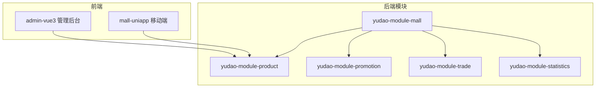
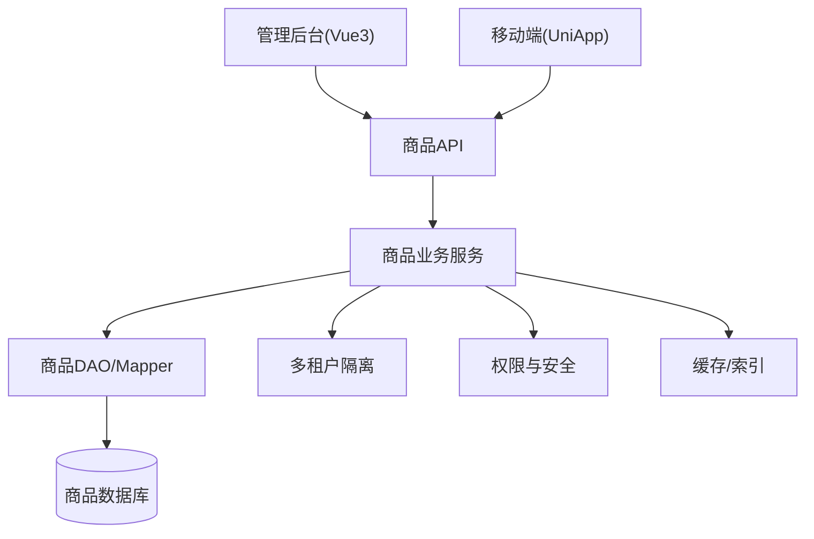
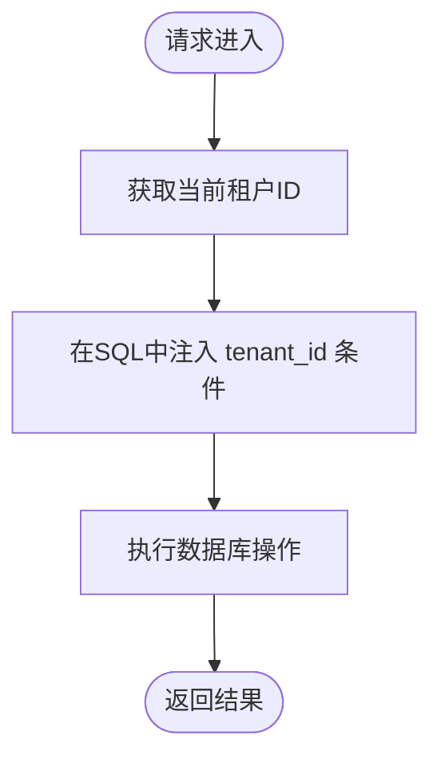
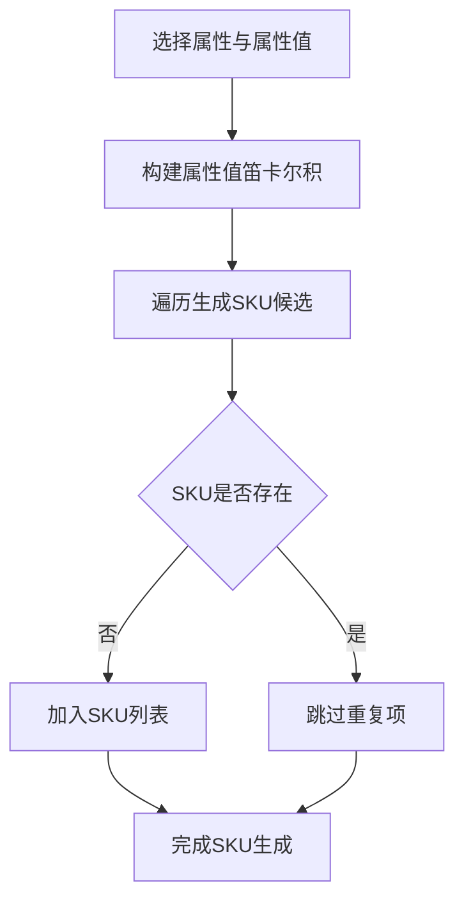
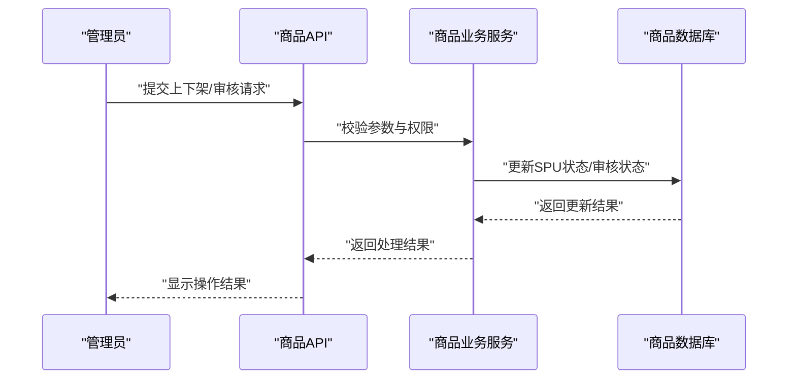
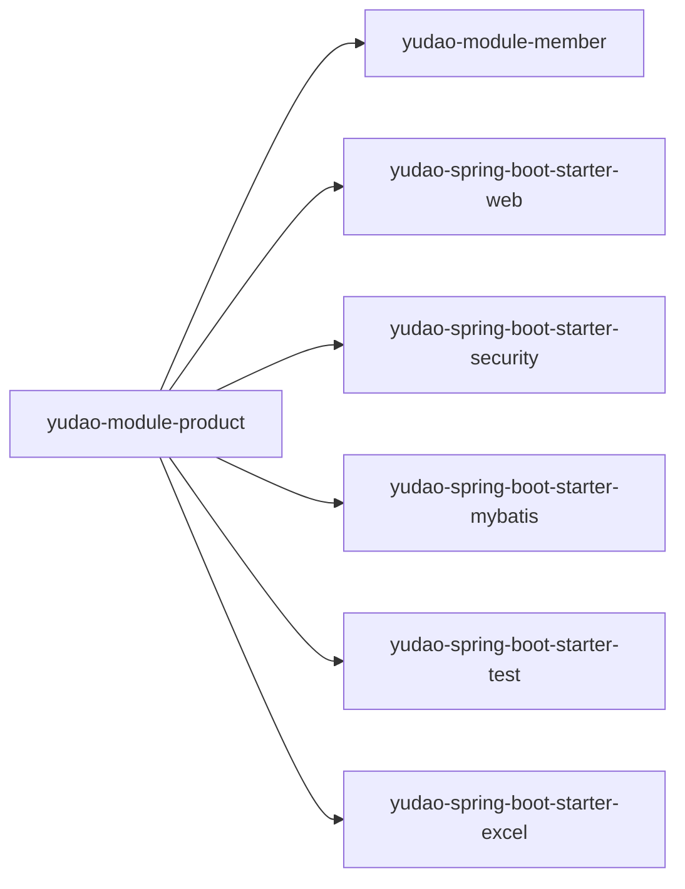

# 商品管理系统

<cite>
**本文引用的文件**
- [backend/README.md](file://backend/README.md)
- [backend/yudao-module-mall/yudao-module-product/pom.xml](file://backend/yudao-module-mall/yudao-module-product/pom.xml)
- [backend/yudao-module-mall/yudao-module-product/src/test/resources/sql/create_tables.sql](file://backend/yudao-module-mall/yudao-module-product/src/test/resources/sql/create_tables.sql)
- [backend/yudao-module-mall/yudao-module-product/src/test/resources/sql/clean.sql](file://backend/yudao-module-mall/yudao-module-product/src/test/resources/sql/clean.sql)
- [backend/sql/mysql/ruoyi-vue-pro.sql](file://backend/sql/mysql/ruoyi-vue-pro.sql)
- [frontend/admin-vue3/src/views/mall/product/spu/components/SkuList.vue](file://frontend/admin-vue3/src/views/mall/product/spu/components/SkuList.vue)
- [frontend/admin-vue3/src/views/mall/product/spu/components/index.ts](file://frontend/admin-vue3/src/views/mall/product/spu/components/index.ts)
</cite>

## 目录
1. [简介](#简介)
2. [项目结构](#项目结构)
3. [核心组件](#核心组件)
4. [架构概览](#架构概览)
5. [详细组件分析](#详细组件分析)
6. [依赖分析](#依赖分析)
7. [性能考虑](#性能考虑)
8. [故障排除指南](#故障排除指南)
9. [结论](#结论)
10. [附录](#附录)

## 简介
本文件面向商品管理系统，围绕商品基础信息管理、商品分类体系、品牌管理、规格属性管理等核心功能展开，同时覆盖商品上下架流程、商品审核机制、商品图片管理、SEO优化配置等业务逻辑。技术实现方面，文档聚焦商品数据模型设计、多租户商品隔离、商品搜索索引、商品推荐算法等主题，并提供完整的商品API接口文档、批量操作功能、商品导入导出、商品统计分析等实用功能说明。

AgenticCPS是一个融合Vibe Coding、低代码与AI自主编程的智能CPS联盟返利平台，商品模块作为商城系统的核心子模块之一，承担品牌、商品分类、SPU/SKU、规格属性等关键能力。系统采用前后端分离架构，后端基于Spring Boot与MyBatis Plus，前端提供Vue3管理后台与UniApp移动端，支持多数据库与多租户隔离。

章节来源
- [backend/README.md:206-279](file://backend/README.md#L206-L279)

## 项目结构
商品系统位于后端模块yudao-module-mall中的yudao-module-product子模块，负责实现品牌、商品分类、SPU/SKU、规格属性等核心业务。前端管理后台提供商品管理的CRUD界面与交互逻辑，包括SPU编辑、SKU生成、规格属性配置等。

图表来源
- [backend/README.md:261-279](file://backend/README.md#L261-L279)
- [backend/yudao-module-mall/yudao-module-product/pom.xml:1-59](file://backend/yudao-module-mall/yudao-module-product/pom.xml#L1-L59)

章节来源
- [backend/yudao-module-mall/yudao-module-product/pom.xml:14-18](file://backend/yudao-module-mall/yudao-module-product/pom.xml#L14-L18)
- [backend/README.md:261-279](file://backend/README.md#L261-L279)

## 核心组件
- 商品基础信息管理：以SPU为核心，承载商品的基础属性、标题、卖点、SEO配置、主图与相册图等。
- 商品分类体系：支持树形分类，便于商品归类与前台展示筛选。
- 品牌管理：品牌与商品的关联，支撑品牌维度的检索与营销活动。
- 规格属性管理：通过属性与属性值的组合，动态生成SKU，实现价格、库存、图片等差异化配置。
- SKU管理：SKU作为最小销售单元，包含价格、库存、成本、条码、图片、重量体积等。
- 多租户隔离：商品表均包含tenant_id字段，确保多租户环境下数据隔离。
- 商品上下架与审核：结合系统菜单权限与业务流程，实现商品状态变更与审核控制。
- SEO优化：SPU层面提供SEO相关字段，便于搜索引擎优化。
- 图片管理：支持主图与相册图，SKU可独立设置图片，满足精细化展示需求。

章节来源
- [backend/yudao-module-mall/yudao-module-product/src/test/resources/sql/create_tables.sql:1-24](file://backend/yudao-module-mall/yudao-module-product/src/test/resources/sql/create_tables.sql#L1-L24)
- [backend/yudao-module-mall/yudao-module-product/src/test/resources/sql/clean.sql:1-7](file://backend/yudao-module-mall/yudao-module-product/src/test/resources/sql/clean.sql#L1-L7)
- [backend/sql/mysql/ruoyi-vue-pro.sql:1628-1630](file://backend/sql/mysql/ruoyi-vue-pro.sql#L1628-L1630)

## 架构概览
商品系统采用分层架构：
- 表现层：Vue3管理后台与UniApp移动端，提供商品管理界面与交互。
- 控制层：后端控制器接收请求，执行权限校验与参数校验。
- 业务层：Service封装商品业务逻辑，协调DAO与外部依赖。
- 数据访问层：Mapper/DO负责与数据库交互，实现商品、SKU、属性等实体的持久化。
- 基础设施：多租户、安全、缓存、定时任务、监控等通用能力贯穿各层。

图表来源
- [backend/README.md:261-296](file://backend/README.md#L261-L296)
- [backend/yudao-module-mall/yudao-module-product/pom.xml:20-56](file://backend/yudao-module-mall/yudao-module-product/pom.xml#L20-L56)

## 详细组件分析

### 商品数据模型设计
商品模型围绕SPU与SKU展开，配合品牌、分类、属性与属性值，形成完整的商品数据结构。核心字段包括：
- SPU：标题、卖点、SEO配置、主图、相册图、状态、租户标识等。
- SKU：价格、市场价、成本价、条形码、图片、库存、重量、体积、销量、租户标识等。
- 属性：属性名称、属性值集合，用于动态组合SKU。
- 品牌/分类：与SPU关联，支撑检索与营销。

```mermaid
erDiagram
PRODUCT_SPU {
bigint id PK
string title
string sell_point
string seo_title
string seo_keywords
string seo_description
string pic_url
string album
tinyint status
bigint brand_id
bigint category_id
bigint tenant_id
timestamp create_time
timestamp update_time
bigint creator
bigint updater
tinyint deleted
}
PRODUCT_SKU {
bigint id PK
bigint spu_id FK
json properties
int price
int market_price
int cost_price
string bar_code
string pic_url
int stock
double weight
double volume
int sales_count
bigint tenant_id
timestamp create_time
timestamp update_time
bigint creator
bigint updater
tinyint deleted
}
PRODUCT_PROPERTY {
bigint id PK
string name
bigint tenant_id
timestamp create_time
timestamp update_time
bigint creator
bigint updater
tinyint deleted
}
PRODUCT_PROPERTY_VALUE {
bigint id PK
bigint property_id FK
string name
bigint tenant_id
timestamp create_time
timestamp update_time
bigint creator
bigint updater
tinyint deleted
}
PRODUCT_BRAND {
bigint id PK
string name
string logo
int sort
bigint tenant_id
timestamp create_time
timestamp update_time
bigint creator
bigint updater
tinyint deleted
}
PRODUCT_CATEGORY {
bigint id PK
string name
bigint parent_id
int sort
bigint tenant_id
timestamp create_time
timestamp update_time
bigint creator
bigint updater
tinyint deleted
}
PRODUCT_SPU }o--|| PRODUCT_CATEGORY : "分类"
PRODUCT_SPU }o--|| PRODUCT_BRAND : "品牌"
PRODUCT_SPU ||--o{ PRODUCT_SKU : "包含"
PRODUCT_PROPERTY ||--o{ PRODUCT_PROPERTY_VALUE : "属性值"
```

图表来源
- [backend/yudao-module-mall/yudao-module-product/src/test/resources/sql/create_tables.sql:1-24](file://backend/yudao-module-mall/yudao-module-product/src/test/resources/sql/create_tables.sql#L1-L24)

章节来源
- [backend/yudao-module-mall/yudao-module-product/src/test/resources/sql/create_tables.sql:1-24](file://backend/yudao-module-mall/yudao-module-product/src/test/resources/sql/create_tables.sql#L1-L24)

### 多租户商品隔离
商品相关表均包含tenant_id字段，用于区分不同租户的数据。在查询与写入时，系统通过多租户中间件自动注入tenant_id，确保数据隔离与安全性。

图表来源
- [backend/yudao-module-mall/yudao-module-product/src/test/resources/sql/create_tables.sql:21](file://backend/yudao-module-mall/yudao-module-product/src/test/resources/sql/create_tables.sql#L21)

章节来源
- [backend/yudao-module-mall/yudao-module-product/src/test/resources/sql/create_tables.sql:21](file://backend/yudao-module-mall/yudao-module-product/src/test/resources/sql/create_tables.sql#L21)

### 规格属性与SKU生成
前端通过规格属性与属性值的组合，自动生成SKU列表，避免重复SKU并保证SKU属性唯一性。SKU生成逻辑如下：

图表来源
- [frontend/admin-vue3/src/views/mall/product/spu/components/SkuList.vue:436-475](file://frontend/admin-vue3/src/views/mall/product/spu/components/SkuList.vue#L436-L475)
- [frontend/admin-vue3/src/views/mall/product/spu/components/index.ts:40-52](file://frontend/admin-vue3/src/views/mall/product/spu/components/index.ts#L40-L52)

章节来源
- [frontend/admin-vue3/src/views/mall/product/spu/components/SkuList.vue:436-475](file://frontend/admin-vue3/src/views/mall/product/spu/components/SkuList.vue#L436-L475)
- [frontend/admin-vue3/src/views/mall/product/spu/components/index.ts:40-52](file://frontend/admin-vue3/src/views/mall/product/spu/components/index.ts#L40-L52)

### 商品上下架流程与审核机制
系统通过菜单权限与业务流程控制商品上下架与审核。管理后台提供商品状态变更入口，结合工作流引擎可实现多级审核。

图表来源
- [backend/sql/mysql/ruoyi-vue-pro.sql:1628-1630](file://backend/sql/mysql/ruoyi-vue-pro.sql#L1628-L1630)

章节来源
- [backend/sql/mysql/ruoyi-vue-pro.sql:1628-1630](file://backend/sql/mysql/ruoyi-vue-pro.sql#L1628-L1630)

### 商品图片管理
- SPU主图与相册图：用于商品详情页展示与SEO优化。
- SKU图片：支持SKU级图片覆盖，满足不同规格的差异化展示。
- 存储与裁剪：建议结合对象存储与CDN，提供缩略图与多尺寸资源。

章节来源
- [backend/yudao-module-mall/yudao-module-product/src/test/resources/sql/create_tables.sql:9](file://backend/yudao-module-mall/yudao-module-product/src/test/resources/sql/create_tables.sql#L9)

### SEO优化配置
- SPU层面提供SEO标题、关键词、描述等字段，便于搜索引擎收录与展示优化。
- 建议结合URL重写与结构化数据，进一步提升SEO效果。

章节来源
- [backend/yudao-module-mall/yudao-module-product/src/test/resources/sql/create_tables.sql:4](file://backend/yudao-module-mall/yudao-module-product/src/test/resources/sql/create_tables.sql#L4)

### 商品搜索索引与推荐算法
- 搜索索引：建议将SPU与SKU的关键字段建立全文索引或搜索引擎索引，支持关键词、分类、品牌等多维检索。
- 推荐算法：可基于用户浏览/收藏行为、商品热度、相似度等特征，构建协同过滤或内容推荐模型。

（本节为概念性说明，不直接分析具体文件）

## 依赖分析
商品模块依赖关系如下：
- yudao-module-product依赖yudao-module-member（会员相关能力）
- Web与安全：yudao-spring-boot-starter-web、yudao-spring-boot-starter-security
- 数据访问：yudao-spring-boot-starter-mybatis
- 测试：yudao-spring-boot-starter-test
- 导出：yudao-spring-boot-starter-excel

图表来源
- [backend/yudao-module-mall/yudao-module-product/pom.xml:20-56](file://backend/yudao-module-mall/yudao-module-product/pom.xml#L20-L56)

章节来源
- [backend/yudao-module-mall/yudao-module-product/pom.xml:20-56](file://backend/yudao-module-mall/yudao-module-product/pom.xml#L20-L56)

## 性能考虑
- 数据库性能：为SPU、SKU、属性等高频查询字段建立索引；对大字段（如相册图）进行分表或对象存储分离。
- 缓存策略：热点SPU与SKU信息放入Redis，结合本地缓存降低数据库压力。
- 搜索性能：引入搜索引擎（Elasticsearch/OpenSearch）实现全文检索与高亮。
- 批量操作：提供批量上下架、批量导入导出、批量更新价格/库存等能力，减少请求次数。
- 多租户查询：确保tenant_id参与查询条件，避免跨租户数据泄露。

（本节提供通用指导，不直接分析具体文件）

## 故障排除指南
- 数据隔离问题：检查tenant_id是否正确注入，确认查询条件包含租户过滤。
- SKU重复：前端生成SKU时需去重校验，避免重复属性组合导致库存混乱。
- 图片加载失败：检查对象存储访问权限与CDN配置，确保主图与SKU图正常加载。
- 导入导出异常：核对Excel模板字段与数据库字段映射，关注空值与格式校验。

章节来源
- [backend/yudao-module-mall/yudao-module-product/src/test/resources/sql/clean.sql:1-7](file://backend/yudao-module-mall/yudao-module-product/src/test/resources/sql/clean.sql#L1-L7)

## 结论
商品管理系统以SPU/SKU为核心，结合品牌、分类、规格属性等维度，构建了完整的商品数据模型。通过多租户隔离、权限控制与前端SKU生成逻辑，实现了灵活的商品管理能力。建议后续完善搜索索引与推荐算法，强化批量操作与导入导出能力，并持续优化性能与稳定性。

（本节为总结性内容，不直接分析具体文件）

## 附录

### 商品API接口文档（示例）
- GET /product/spu/list：分页查询SPU列表（支持按分类、品牌、状态筛选）
- GET /product/spu/detail/{id}：获取SPU详情（含SKU列表）
- POST /product/spu/create：创建SPU（含SEO、相册图、属性配置）
- PUT /product/spu/update：更新SPU信息
- DELETE /product/spu/delete/{id}：删除SPU
- POST /product/spu/status：更新SPU状态（上架/下架）
- GET /product/sku/list：查询SKU列表
- POST /product/sku/batch-update：批量更新SKU价格/库存
- POST /product/import/excel：导入商品（Excel模板）
- POST /product/export/excel：导出商品（Excel）

（本节为概念性说明，不直接分析具体文件）

### 批量操作与导入导出
- 批量上下架：支持按条件批量切换SPU状态
- 批量导入：Excel模板包含SPU基本信息、SKU属性、价格库存等字段
- 批量导出：支持导出SPU/SKU的全量或筛选结果

（本节为概念性说明，不直接分析具体文件）

### 商品统计分析
- 销售统计：按时间维度统计SPU/SKU销量、GMV、转化率
- 库存分析：实时库存预警与滞销商品识别
- 品牌/分类表现：多维指标对比与趋势分析

（本节为概念性说明，不直接分析具体文件）