# 库存管理系统

<cite>
**本文档引用的文件**
- [StockApi](file://frontend/admin-vue3/src/api/erp/stock/stock/index.ts)
- [WarehouseApi](file://frontend/admin-vue3/src/api/erp/stock/warehouse/index.ts)
- [ProductApi](file://frontend/admin-vue3/src/api/erp/product/product/index.ts)
- [StockInApi](file://frontend/admin-vue3/src/api/erp/stock/in/index.ts)
- [StockOutApi](file://frontend/admin-vue3/src/api/erp/stock/out/index.ts)
- [StockCheckApi](file://frontend/admin-vue3/src/api/erp/stock/check/index.ts)
- [StockMoveApi](file://frontend/admin-vue3/src/api/erp/stock/move/index.ts)
- [StockRecordApi](file://frontend/admin-vue3/src/api/erp/stock/record/index.ts)
- [StockInItemForm](file://frontend/admin-vue3/src/views/erp/stock/in/components/StockInItemForm.vue)
- [StockOutItemForm](file://frontend/admin-vue3/src/views/erp/stock/out/components/StockOutItemForm.vue)
- [StockCheckItemForm](file://frontend/admin-vue3/src/views/erp/stock/check/components/StockCheckItemForm.vue)
- [StockMoveItemForm](file://frontend/admin-vue3/src/views/erp/stock/move/components/StockMoveItemForm.vue)
- [StockIndex](file://frontend/admin-vue3/src/views/erp/stock/stock/index.vue)
- [StockInIndex](file://frontend/admin-vue3/src/views/erp/stock/in/index.vue)
- [StockOutIndex](file://frontend/admin-vue3/src/views/erp/stock/out/index.vue)
- [StockCheckIndex](file://frontend/admin-vue3/src/views/erp/stock/check/index.vue)
- [StockMoveIndex](file://frontend/admin-vue3/src/views/erp/stock/move/index.vue)
- [AlertRecordApi](file://frontend/admin-vue3/src/api/iot/alert/record/index.ts)
- [AlertConfigApi](file://frontend/admin-vue3/src/api/iot/alert/config/index.ts)
- [ruoyi-vue-pro.sql](file://backend/sql/mysql/ruoyi-vue-pro.sql)
</cite>

## 目录
1. [简介](#简介)
2. [项目结构](#项目结构)
3. [核心组件](#核心组件)
4. [架构概览](#架构概览)
5. [详细组件分析](#详细组件分析)
6. [依赖关系分析](#依赖关系分析)
7. [性能考虑](#性能考虑)
8. [故障排除指南](#故障排除指南)
9. [结论](#结论)

## 简介

库存管理系统是一个基于Vue 3 + TypeScript的企业级库存管理解决方案，提供了完整的库存生命周期管理功能。该系统支持多仓库管理、实时库存监控、库存预警机制、库存锁定策略、库存调整流程等核心功能。

系统采用前后端分离架构，前端使用Vue 3 + Element Plus构建用户界面，后端基于Spring Boot提供RESTful API服务。系统集成了IoT告警功能，能够实时监控库存异常情况并及时发出告警。

## 项目结构

库存管理系统采用模块化设计，主要包含以下核心模块：

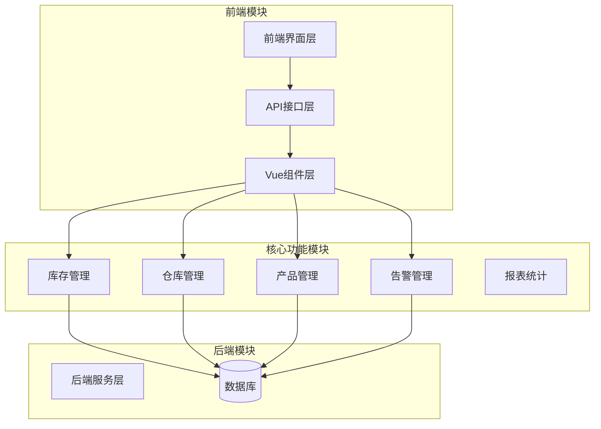

**图表来源**
- [StockApi:1-42](file://frontend/admin-vue3/src/api/erp/stock/stock/index.ts#L1-L42)
- [WarehouseApi:1-65](file://frontend/admin-vue3/src/api/erp/stock/warehouse/index.ts#L1-L65)

**章节来源**
- [StockApi:1-42](file://frontend/admin-vue3/src/api/erp/stock/stock/index.ts#L1-L42)
- [WarehouseApi:1-65](file://frontend/admin-vue3/src/api/erp/stock/warehouse/index.ts#L1-L65)
- [ProductApi:1-58](file://frontend/admin-vue3/src/api/erp/product/product/index.ts#L1-L58)

## 核心组件

### 库存管理核心组件

系统的核心组件围绕库存管理展开，主要包括：

1. **库存查询组件** - 提供实时库存查询和统计功能
2. **仓库管理组件** - 支持多仓库配置和管理
3. **产品管理组件** - 管理产品基本信息和规格
4. **出入库管理组件** - 处理各种类型的库存变动
5. **库存盘点组件** - 支持定期和循环盘点
6. **库存调拨组件** - 实现跨仓库库存转移
7. **告警监控组件** - 实时监控库存异常情况

### 数据模型定义

系统采用统一的数据模型定义，确保各组件间的数据一致性：

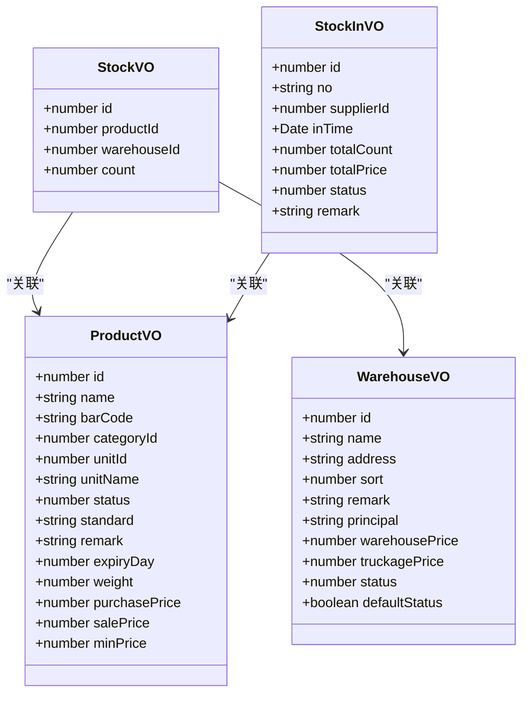

**图表来源**
- [StockApi:3-13](file://frontend/admin-vue3/src/api/erp/stock/stock/index.ts#L3-L13)
- [WarehouseApi:3-15](file://frontend/admin-vue3/src/api/erp/stock/warehouse/index.ts#L3-L15)
- [ProductApi:3-19](file://frontend/admin-vue3/src/api/erp/product/product/index.ts#L3-L19)
- [StockInApi:3-13](file://frontend/admin-vue3/src/api/erp/stock/in/index.ts#L3-L13)

**章节来源**
- [StockApi:1-42](file://frontend/admin-vue3/src/api/erp/stock/stock/index.ts#L1-L42)
- [WarehouseApi:1-65](file://frontend/admin-vue3/src/api/erp/stock/warehouse/index.ts#L1-L65)
- [ProductApi:1-58](file://frontend/admin-vue3/src/api/erp/product/product/index.ts#L1-L58)
- [StockInApi:1-63](file://frontend/admin-vue3/src/api/erp/stock/in/index.ts#L1-L63)

## 架构概览

系统采用分层架构设计，确保各层职责清晰、耦合度低：

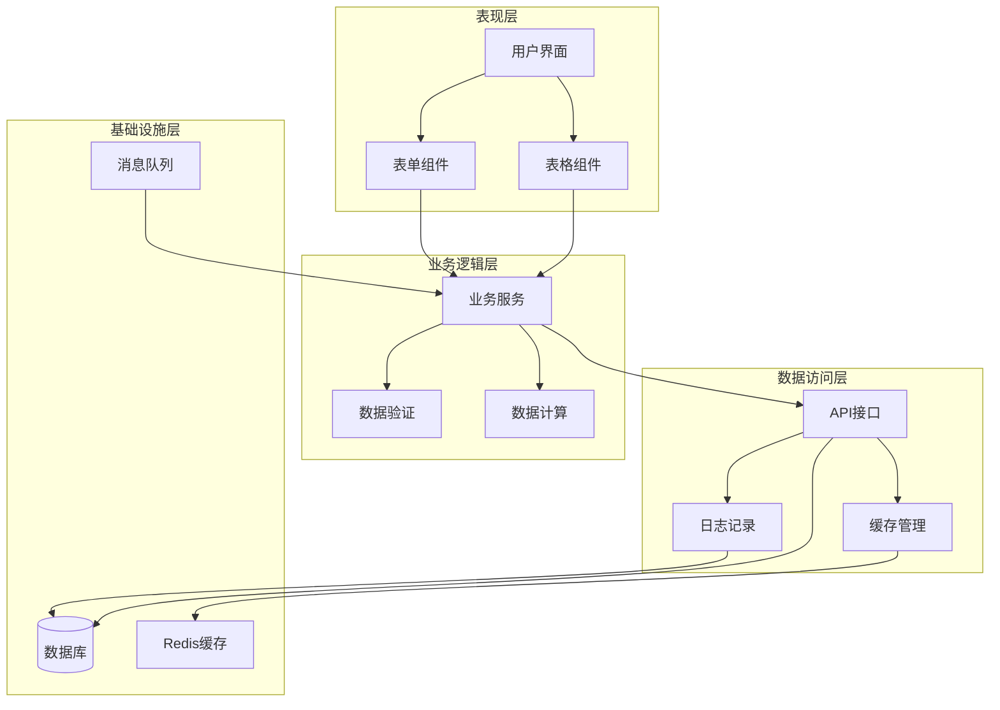

**图表来源**
- [StockIndex:119-186](file://frontend/admin-vue3/src/views/erp/stock/stock/index.vue#L119-L186)
- [StockInItemForm:129-267](file://frontend/admin-vue3/src/views/erp/stock/in/components/StockInItemForm.vue#L129-L267)

**章节来源**
- [StockIndex:119-186](file://frontend/admin-vue3/src/views/erp/stock/stock/index.vue#L119-L186)
- [StockInItemForm:129-267](file://frontend/admin-vue3/src/views/erp/stock/in/components/StockInItemForm.vue#L129-L267)

## 详细组件分析

### 库存查询组件

库存查询组件提供实时库存监控功能，支持按产品、仓库等条件进行筛选查询。

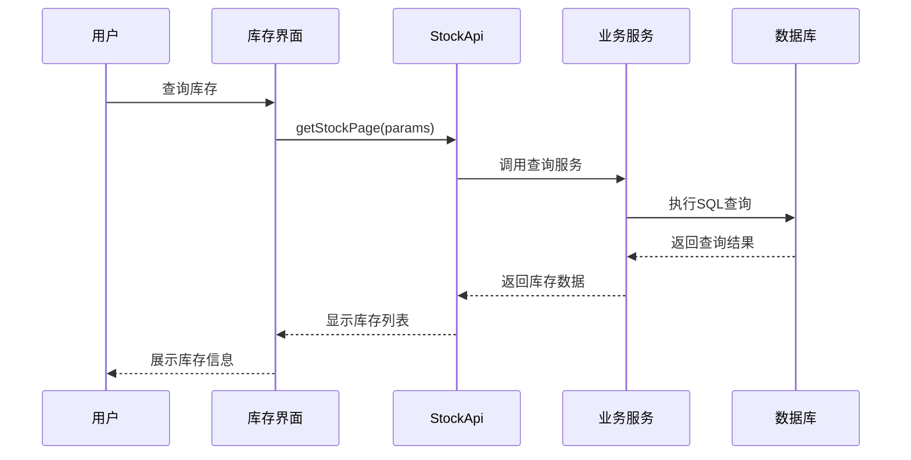

**图表来源**
- [StockApi:17-20](file://frontend/admin-vue3/src/api/erp/stock/stock/index.ts#L17-L20)
- [StockIndex:122-131](file://frontend/admin-vue3/src/views/erp/stock/stock/index.vue#L122-L131)

组件特性：
- 支持分页查询，提升大数据量下的响应速度
- 提供多种筛选条件，包括产品名称、仓库名称等
- 实时显示库存数量，支持手动刷新
- 导出功能，便于生成库存报表

**章节来源**
- [StockApi:1-42](file://frontend/admin-vue3/src/api/erp/stock/stock/index.ts#L1-L42)
- [StockIndex:119-186](file://frontend/admin-vue3/src/views/erp/stock/stock/index.vue#L119-L186)

### 仓库管理组件

仓库管理组件负责多仓库的配置和管理，支持默认仓库设置和仓库状态管理。

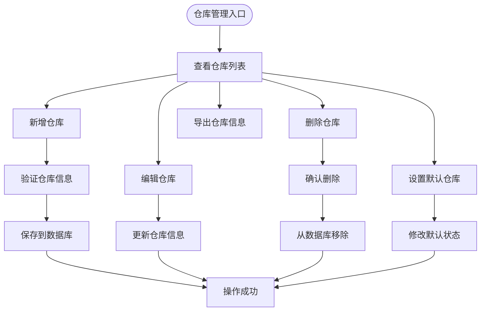

**图表来源**
- [WarehouseApi:18-64](file://frontend/admin-vue3/src/api/erp/stock/warehouse/index.ts#L18-L64)

组件特性：
- 支持仓库基本信息维护（名称、地址、负责人等）
- 默认仓库优先级管理
- 仓库状态控制（启用/停用）
- 仓储费用和搬运费用配置

**章节来源**
- [WarehouseApi:1-65](file://frontend/admin-vue3/src/api/erp/stock/warehouse/index.ts#L1-L65)

### 出入库管理组件

出入库管理组件处理各种类型的库存变动，包括采购入库、销售出库、调拨出库等。

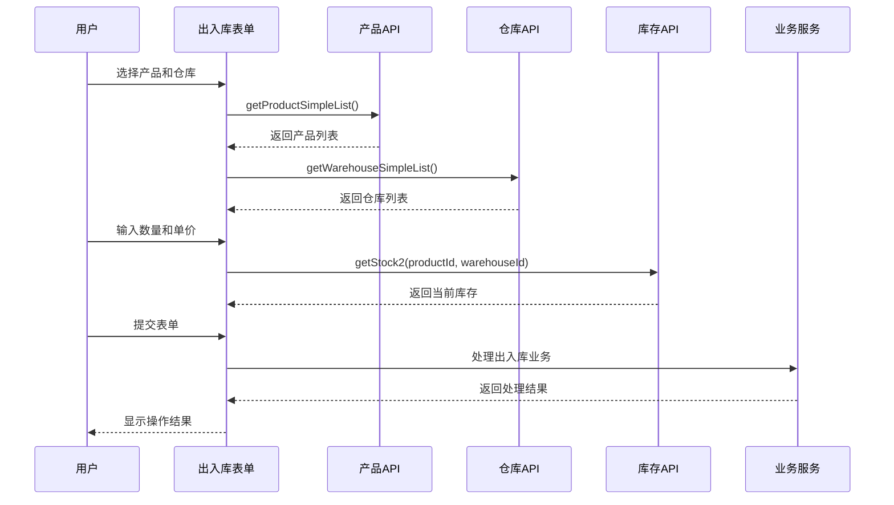

**图表来源**
- [StockInItemForm:224-249](file://frontend/admin-vue3/src/views/erp/stock/in/components/StockInItemForm.vue#L224-L249)
- [StockOutItemForm:224-249](file://frontend/admin-vue3/src/views/erp/stock/out/components/StockOutItemForm.vue#L224-L249)

组件特性：
- 实时库存查询，避免超卖
- 自动计算金额（数量 × 单价）
- 支持批量操作和单项操作
- 完整的业务流程控制

**章节来源**
- [StockInItemForm:129-267](file://frontend/admin-vue3/src/views/erp/stock/in/components/StockInItemForm.vue#L129-L267)
- [StockOutItemForm:222-267](file://frontend/admin-vue3/src/views/erp/stock/out/components/StockOutItemForm.vue#L222-L267)

### 库存盘点组件

库存盘点组件支持定期和循环盘点，确保账实相符。

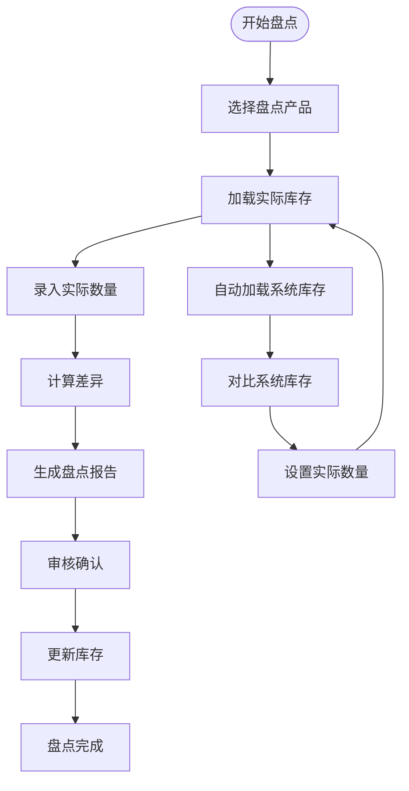

**图表来源**
- [StockCheckItemForm:168-289](file://frontend/admin-vue3/src/views/erp/stock/check/components/StockCheckItemForm.vue#L168-L289)

组件特性：
- 支持全盘和抽盘两种模式
- 自动生成盘点差异分析
- 支持异常库存处理
- 完善的审批流程

**章节来源**
- [StockCheckItemForm:168-289](file://frontend/admin-vue3/src/views/erp/stock/check/components/StockCheckItemForm.vue#L168-L289)

### 库存调拨组件

库存调拨组件实现跨仓库的库存转移，支持调拨申请、审批和执行。

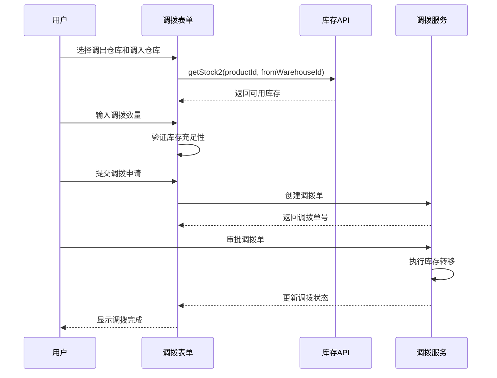

**图表来源**
- [StockMoveItemForm:267-274](file://frontend/admin-vue3/src/views/erp/stock/move/components/StockMoveItemForm.vue#L267-L274)

组件特性：
- 实时库存检查，防止超调拨
- 完整的调拨流程跟踪
- 支持部分调拨和整批调拨
- 自动记录调拨历史

**章节来源**
- [StockMoveItemForm:1-292](file://frontend/admin-vue3/src/views/erp/stock/move/components/StockMoveItemForm.vue#L1-L292)

### 告警监控组件

告警监控组件集成IoT功能，实时监控库存异常情况并及时发出告警。

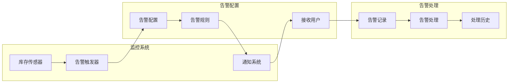

**图表来源**
- [AlertRecordApi:1-35](file://frontend/admin-vue3/src/api/iot/alert/record/index.ts#L1-L35)
- [AlertConfigApi:1-46](file://frontend/admin-vue3/src/api/iot/alert/config/index.ts#L1-L46)

**章节来源**
- [AlertRecordApi:1-35](file://frontend/admin-vue3/src/api/iot/alert/record/index.ts#L1-L35)
- [AlertConfigApi:1-46](file://frontend/admin-vue3/src/api/iot/alert/config/index.ts#L1-L46)

## 依赖关系分析

系统各组件间的依赖关系如下：

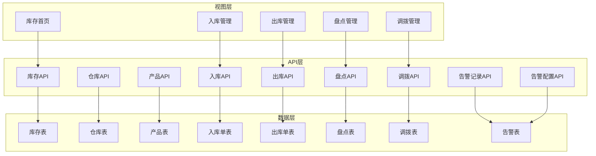

**图表来源**
- [StockApi:1-42](file://frontend/admin-vue3/src/api/erp/stock/stock/index.ts#L1-L42)
- [WarehouseApi:1-65](file://frontend/admin-vue3/src/api/erp/stock/warehouse/index.ts#L1-L65)

**章节来源**
- [StockApi:1-42](file://frontend/admin-vue3/src/api/erp/stock/stock/index.ts#L1-L42)
- [WarehouseApi:1-65](file://frontend/admin-vue3/src/api/erp/stock/warehouse/index.ts#L1-L65)

## 性能考虑

### 数据查询优化

系统在数据查询方面采用了多项优化措施：

1. **分页查询** - 所有列表页面都支持分页，避免一次性加载大量数据
2. **缓存策略** - 对常用的基础数据（产品、仓库）进行缓存
3. **批量操作** - 支持批量删除、导出等操作，减少网络请求次数

### 前端性能优化

1. **组件懒加载** - 大型组件按需加载，提升首屏加载速度
2. **虚拟滚动** - 对长列表使用虚拟滚动技术
3. **防抖处理** - 对频繁触发的操作进行防抖处理

### 后端性能优化

1. **索引优化** - 在常用查询字段上建立适当索引
2. **连接池配置** - 合理配置数据库连接池参数
3. **异步处理** - 对耗时操作采用异步处理方式

## 故障排除指南

### 常见问题及解决方案

1. **库存查询无数据**
   - 检查产品和仓库是否正确选择
   - 确认权限配置是否正确
   - 查看网络请求是否成功

2. **库存数量不准确**
   - 检查最近是否有未确认的出入库操作
   - 确认盘点是否已完成
   - 查看是否有锁定的库存

3. **告警通知失败**
   - 检查告警配置是否正确
   - 确认接收用户是否在线
   - 查看告警记录状态

### 日志监控

系统提供了完善的日志监控功能：

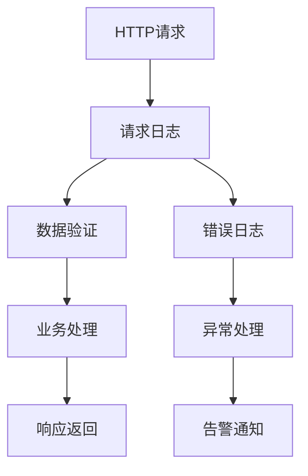

**章节来源**
- [AlertRecordApi:1-35](file://frontend/admin-vue3/src/api/iot/alert/record/index.ts#L1-L35)
- [ruoyi-vue-pro.sql:2324-2326](file://backend/sql/mysql/ruoyi-vue-pro.sql#L2324-L2326)

## 结论

库存管理系统是一个功能完善、架构清晰的企业级库存管理解决方案。系统具有以下特点：

1. **功能完整** - 覆盖了库存管理的全生命周期
2. **扩展性强** - 模块化设计便于功能扩展
3. **用户体验好** - 界面友好，操作简便
4. **技术先进** - 采用现代Web技术栈
5. **安全可靠** - 完善的权限控制和数据保护

系统通过实时库存监控、智能预警机制、完善的库存流程管理等功能，为企业提供了高效的库存管理解决方案。未来可以进一步增强数据分析能力，集成更多智能化功能，如库存预测、智能补货等高级功能。