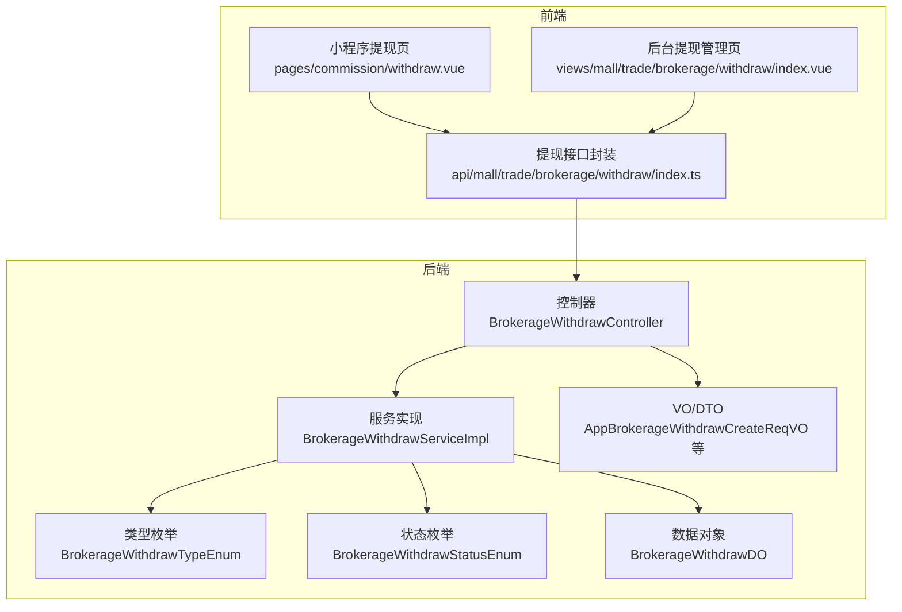
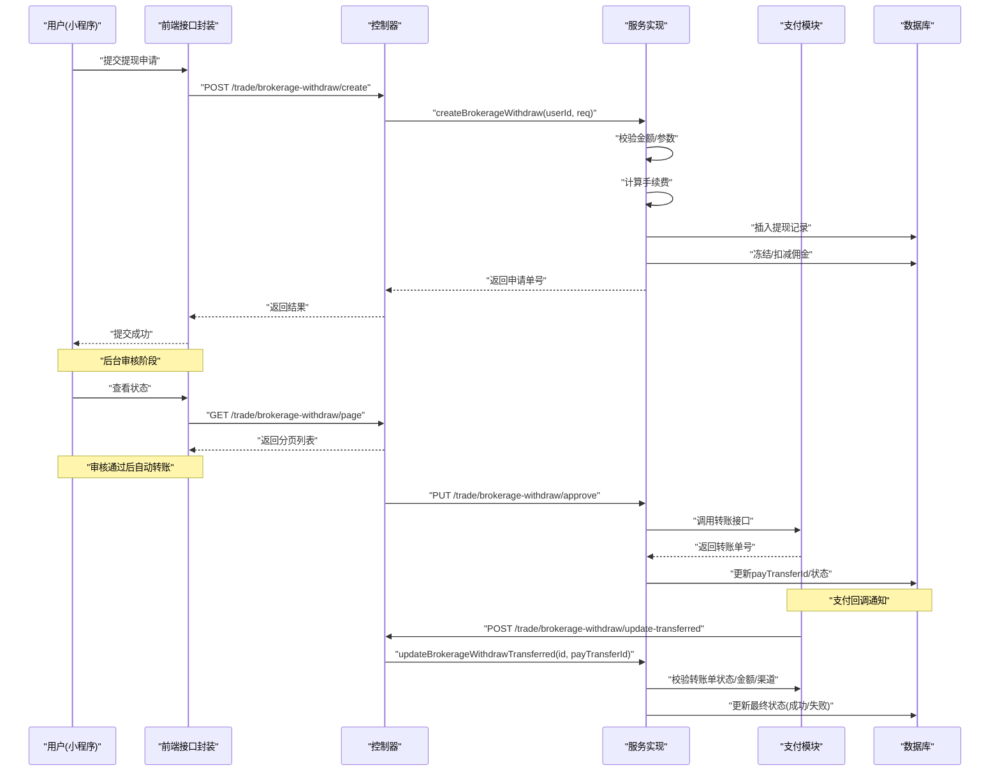
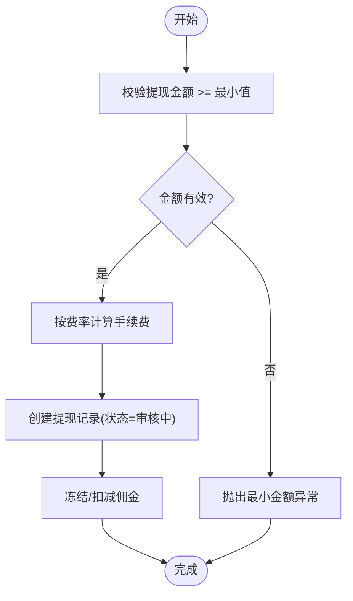
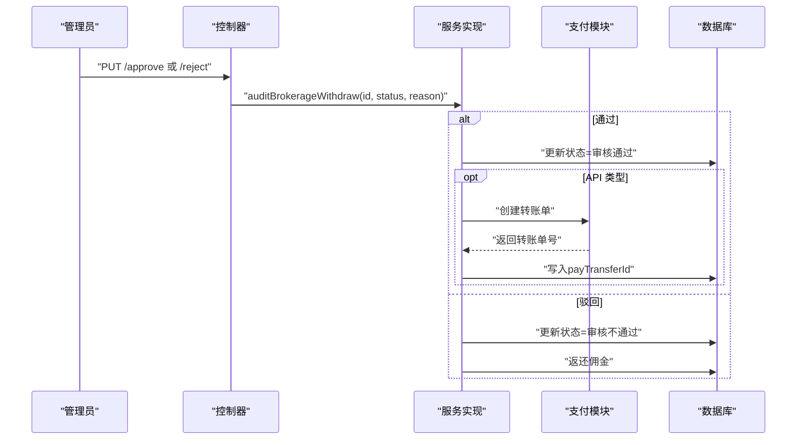
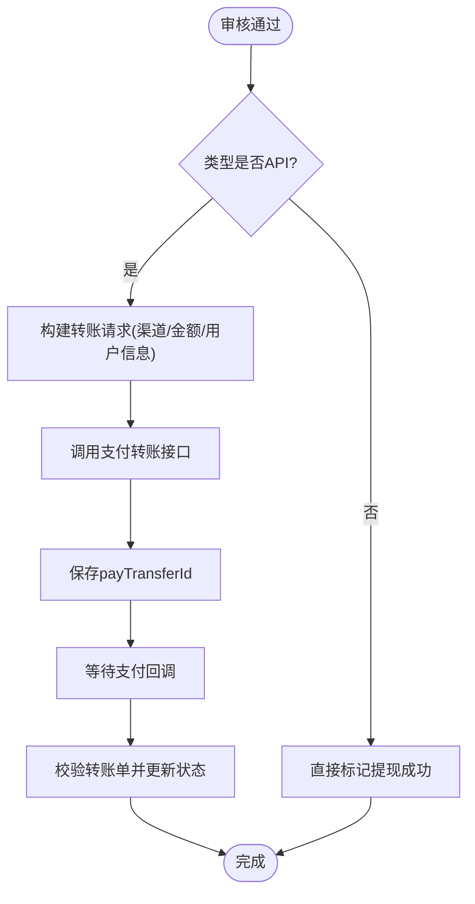
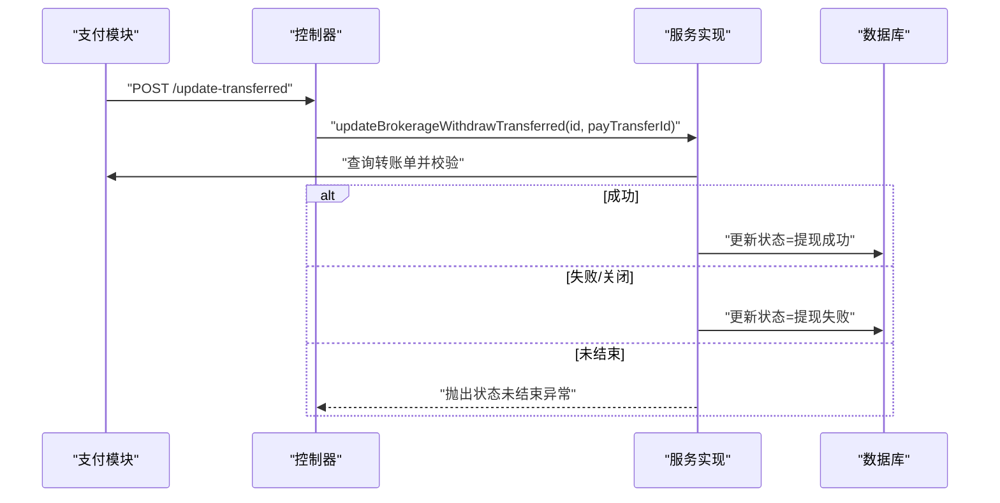
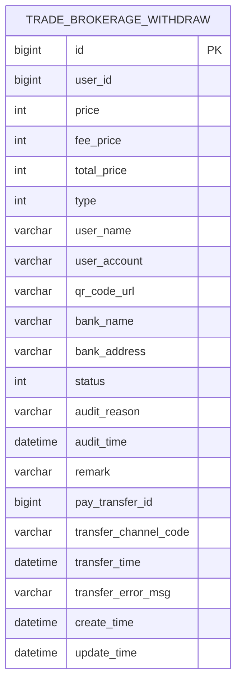
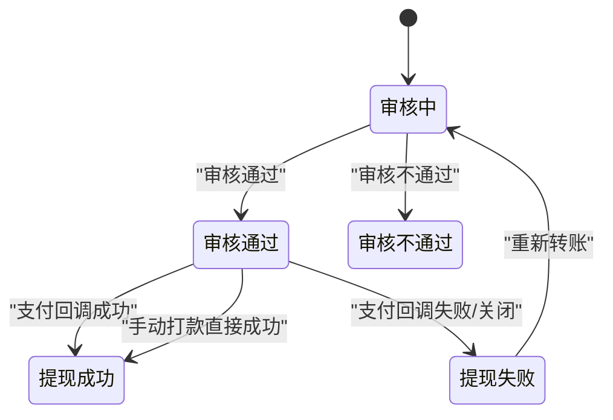
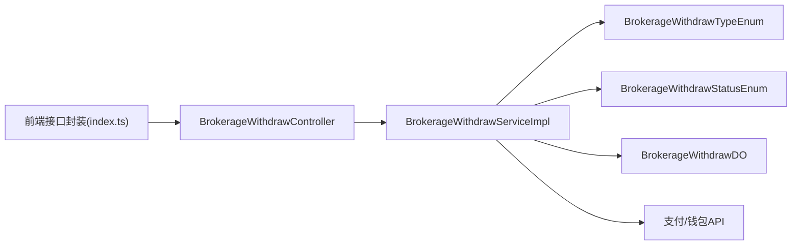

# 提现流程管理

<cite>
**本文引用的文件**
- [BrokerageWithdrawController.java](file://backend/yudao-module-mall/yudao-module-trade/src/main/java/cn/iocoder/yudao/module/trade/controller/admin/brokerage/BrokerageWithdrawController.java)
- [BrokerageWithdrawServiceImpl.java](file://backend/yudao-module-mall/yudao-module-trade/src/main/java/cn/iocoder/yudao/module/trade/service/brokerage/BrokerageWithdrawServiceImpl.java)
- [BrokerageWithdrawDO.java](file://backend/yudao-module-mall/yudao-module-trade/src/main/java/cn/iocoder/yudao/module/trade/dal/dataobject/brokerage/BrokerageWithdrawDO.java)
- [BrokerageWithdrawStatusEnum.java](file://backend/yudao-module-mall/yudao-module-trade-api/src/main/java/cn/iocoder/yudao/module/trade/enums/brokerage/BrokerageWithdrawStatusEnum.java)
- [BrokerageWithdrawTypeEnum.java](file://backend/yudao-module-mall/yudao-module-trade-api/src/main/java/cn/iocoder/yudao/module/trade/enums/brokerage/BrokerageWithdrawTypeEnum.java)
- [AppBrokerageWithdrawCreateReqVO.java](file://backend/yudao-module-mall/yudao-module-trade/src/main/java/cn/iocoder/yudao/module/trade/controller/app/brokerage/vo/withdraw/AppBrokerageWithdrawCreateReqVO.java)
- [BrokerageWithdrawPageReqVO.java](file://backend/yudao-module-mall/yudao-module-trade/src/main/java/cn/iocoder/yudao/module/trade/controller/admin/brokerage/vo/withdraw/BrokerageWithdrawPageReqVO.java)
- [BrokerageWithdrawRejectReqVO.java](file://backend/yudao-module-mall/yudao-module-trade/src/main/java/cn/iocoder/yudao/module/trade/controller/admin/brokerage/vo/withdraw/BrokerageWithdrawRejectReqVO.java)
- [BrokerageWithdrawRespVO.java](file://backend/yudao-module-mall/yudao-module-trade/src/main/java/cn/iocoder/yudao/module/trade/controller/admin/brokerage/vo/withdraw/BrokerageWithdrawRespVO.java)
- [index.ts](file://frontend/admin-vue3/src/api/mall/trade/brokerage/withdraw/index.ts)
- [withdraw.vue](file://frontend/mall-uniapp/pages/commission/withdraw.vue)
- [index.vue](file://frontend/admin-vue3/src/views/mall/trade/brokerage/withdraw/index.vue)
- [ruoyi-vue-pro.sql](file://backend/sql/mysql/ruoyi-vue-pro.sql)
</cite>

## 目录
1. [引言](#引言)
2. [项目结构](#项目结构)
3. [核心组件](#核心组件)
4. [架构总览](#架构总览)
5. [详细组件分析](#详细组件分析)
6. [依赖关系分析](#依赖关系分析)
7. [性能考量](#性能考量)
8. [故障排查指南](#故障排查指南)
9. [结论](#结论)
10. [附录](#附录)

## 引言
本文件面向开发者与产品/运营人员，系统性阐述“佣金提现”全流程管理：从用户提交提现申请、后台审核、自动/手动转账执行，到状态跟踪与异常处理。文档覆盖金额验证、手续费计算、提现银行信息管理、时间限制与风控要点，并给出状态机、流程图、数据模型、接口规范与风控控制建议，帮助快速理解并正确实施提现功能。

## 项目结构
提现能力横跨前端与后端模块：
- 前端
  - 商城小程序：提现页面与规则展示
  - 后台管理 Vue3：提现列表、审核、重试转账
- 后端
  - 控制器：Admin 端审核、查询；回调更新转账结果
  - 服务层：提现创建、审核、转账执行、状态更新
  - 数据对象：提现记录持久化
  - 枚举：提现类型与状态
  - VO/API：请求/响应参数定义
  - SQL：字典数据（类型/状态）

图表来源
- [BrokerageWithdrawController.java:1-96](file://backend/yudao-module-mall/yudao-module-trade/src/main/java/cn/iocoder/yudao/module/trade/controller/admin/brokerage/BrokerageWithdrawController.java#L1-L96)
- [BrokerageWithdrawServiceImpl.java:1-316](file://backend/yudao-module-mall/yudao-module-trade/src/main/java/cn/iocoder/yudao/module/trade/service/brokerage/BrokerageWithdrawServiceImpl.java#L1-L316)
- [BrokerageWithdrawDO.java:1-131](file://backend/yudao-module-mall/yudao-module-trade/src/main/java/cn/iocoder/yudao/module/trade/dal/dataobject/brokerage/BrokerageWithdrawDO.java#L1-L131)
- [BrokerageWithdrawTypeEnum.java:1-54](file://backend/yudao-module-mall/yudao-module-trade-api/src/main/java/cn/iocoder/yudao/module/trade/enums/brokerage/BrokerageWithdrawTypeEnum.java#L1-L54)
- [BrokerageWithdrawStatusEnum.java:1-42](file://backend/yudao-module-mall/yudao-module-trade-api/src/main/java/cn/iocoder/yudao/module/trade/enums/brokerage/BrokerageWithdrawStatusEnum.java#L1-L42)
- [index.ts:1-43](file://frontend/admin-vue3/src/api/mall/trade/brokerage/withdraw/index.ts#L1-L43)
- [withdraw.vue:1-357](file://frontend/mall-uniapp/pages/commission/withdraw.vue#L1-L357)
- [index.vue:1-309](file://frontend/admin-vue3/src/views/mall/trade/brokerage/withdraw/index.vue#L1-L309)

章节来源
- [BrokerageWithdrawController.java:1-96](file://backend/yudao-module-mall/yudao-module-trade/src/main/java/cn/iocoder/yudao/module/trade/controller/admin/brokerage/BrokerageWithdrawController.java#L1-L96)
- [BrokerageWithdrawServiceImpl.java:1-316](file://backend/yudao-module-mall/yudao-module-trade/src/main/java/cn/iocoder/yudao/module/trade/service/brokerage/BrokerageWithdrawServiceImpl.java#L1-L316)
- [BrokerageWithdrawDO.java:1-131](file://backend/yudao-module-mall/yudao-module-trade/src/main/java/cn/iocoder/yudao/module/trade/dal/dataobject/brokerage/BrokerageWithdrawDO.java#L1-L131)
- [BrokerageWithdrawTypeEnum.java:1-54](file://backend/yudao-module-mall/yudao-module-trade-api/src/main/java/cn/iocoder/yudao/module/trade/enums/brokerage/BrokerageWithdrawTypeEnum.java#L1-L54)
- [BrokerageWithdrawStatusEnum.java:1-42](file://backend/yudao-module-mall/yudao-module-trade-api/src/main/java/cn/iocoder/yudao/module/trade/enums/brokerage/BrokerageWithdrawStatusEnum.java#L1-L42)
- [index.ts:1-43](file://frontend/admin-vue3/src/api/mall/trade/brokerage/withdraw/index.ts#L1-L43)
- [withdraw.vue:1-357](file://frontend/mall-uniapp/pages/commission/withdraw.vue#L1-L357)
- [index.vue:1-309](file://frontend/admin-vue3/src/views/mall/trade/brokerage/withdraw/index.vue#L1-L309)

## 核心组件
- 控制器：提供 Admin 审核、查询、回调更新转账结果等接口
- 服务实现：负责提现创建、金额校验、手续费计算、审核状态流转、转账执行、转账结果校验与状态更新
- 数据对象：持久化提现记录及转账相关信息
- 枚举：提现类型与状态定义
- 前端接口封装与页面：小程序提交提现、后台管理列表与审核

章节来源
- [BrokerageWithdrawController.java:1-96](file://backend/yudao-module-mall/yudao-module-trade/src/main/java/cn/iocoder/yudao/module/trade/controller/admin/brokerage/BrokerageWithdrawController.java#L1-L96)
- [BrokerageWithdrawServiceImpl.java:1-316](file://backend/yudao-module-mall/yudao-module-trade/src/main/java/cn/iocoder/yudao/module/trade/service/brokerage/BrokerageWithdrawServiceImpl.java#L1-L316)
- [BrokerageWithdrawDO.java:1-131](file://backend/yudao-module-mall/yudao-module-trade/src/main/java/cn/iocoder/yudao/module/trade/dal/dataobject/brokerage/BrokerageWithdrawDO.java#L1-L131)
- [BrokerageWithdrawTypeEnum.java:1-54](file://backend/yudao-module-mall/yudao-module-trade-api/src/main/java/cn/iocoder/yudao/module/trade/enums/brokerage/BrokerageWithdrawTypeEnum.java#L1-L54)
- [BrokerageWithdrawStatusEnum.java:1-42](file://backend/yudao-module-mall/yudao-module-trade-api/src/main/java/cn/iocoder/yudao/module/trade/enums/brokerage/BrokerageWithdrawStatusEnum.java#L1-L42)
- [index.ts:1-43](file://frontend/admin-vue3/src/api/mall/trade/brokerage/withdraw/index.ts#L1-L43)
- [withdraw.vue:1-357](file://frontend/mall-uniapp/pages/commission/withdraw.vue#L1-L357)
- [index.vue:1-309](file://frontend/admin-vue3/src/views/mall/trade/brokerage/withdraw/index.vue#L1-L309)

## 架构总览
提现流程涉及“应用侧提交 -> 后台审核 -> 支付侧转账 -> 状态回推”的闭环：

图表来源
- [BrokerageWithdrawController.java:45-93](file://backend/yudao-module-mall/yudao-module-trade/src/main/java/cn/iocoder/yudao/module/trade/controller/admin/brokerage/BrokerageWithdrawController.java#L45-L93)
- [BrokerageWithdrawServiceImpl.java:80-116](file://backend/yudao-module-mall/yudao-module-trade/src/main/java/cn/iocoder/yudao/module/trade/service/brokerage/BrokerageWithdrawServiceImpl.java#L80-L116)
- [BrokerageWithdrawServiceImpl.java:130-163](file://backend/yudao-module-mall/yudao-module-trade/src/main/java/cn/iocoder/yudao/module/trade/service/brokerage/BrokerageWithdrawServiceImpl.java#L130-L163)
- [BrokerageWithdrawServiceImpl.java:234-267](file://backend/yudao-module-mall/yudao-module-trade/src/main/java/cn/iocoder/yudao/module/trade/service/brokerage/BrokerageWithdrawServiceImpl.java#L234-L267)

## 详细组件分析

### 1) 提现申请提交
- 应用侧提交：小程序页面收集提现金额、提现类型、账户信息（如银行/微信/支付宝），调用前端封装的接口
- 后端接收：控制器接收请求，服务层进行金额与参数校验、手续费计算、生成提现记录并冻结相应佣金
- 关键点
  - 金额下限校验：来源于交易配置
  - 手续费计算：按费率计算
  - 佣金冻结：减少可用佣金，生成提现记录

图表来源
- [BrokerageWithdrawServiceImpl.java:183-203](file://backend/yudao-module-mall/yudao-module-trade/src/main/java/cn/iocoder/yudao/module/trade/service/brokerage/BrokerageWithdrawServiceImpl.java#L183-L203)
- [BrokerageWithdrawServiceImpl.java:226-232](file://backend/yudao-module-mall/yudao-module-trade/src/main/java/cn/iocoder/yudao/module/trade/service/brokerage/BrokerageWithdrawServiceImpl.java#L226-L232)
- [BrokerageWithdrawServiceImpl.java:212-218](file://backend/yudao-module-mall/yudao-module-trade/src/main/java/cn/iocoder/yudao/module/trade/service/brokerage/BrokerageWithdrawServiceImpl.java#L212-L218)

章节来源
- [withdraw.vue:1-357](file://frontend/mall-uniapp/pages/commission/withdraw.vue#L1-L357)
- [index.ts:25-33](file://frontend/admin-vue3/src/api/mall/trade/brokerage/withdraw/index.ts#L25-L33)
- [BrokerageWithdrawServiceImpl.java:183-203](file://backend/yudao-module-mall/yudao-module-trade/src/main/java/cn/iocoder/yudao/module/trade/service/brokerage/BrokerageWithdrawServiceImpl.java#L183-L203)
- [BrokerageWithdrawServiceImpl.java:226-232](file://backend/yudao-module-mall/yudao-module-trade/src/main/java/cn/iocoder/yudao/module/trade/service/brokerage/BrokerageWithdrawServiceImpl.java#L226-L232)
- [BrokerageWithdrawServiceImpl.java:212-218](file://backend/yudao-module-mall/yudao-module-trade/src/main/java/cn/iocoder/yudao/module/trade/service/brokerage/BrokerageWithdrawServiceImpl.java#L212-L218)

### 2) 提现审核
- 审核入口：Admin 页面支持“通过”“驳回”，或对“提现失败”记录进行“重新转账”
- 审核逻辑：仅允许对“审核中”状态进行变更；通过则进入转账流程；驳回则返还佣金
- 重新转账：若提现失败且仍处于“审核中”，可将状态重置为“审核中”并清空失败原因，再次发起转账

图表来源
- [BrokerageWithdrawController.java:45-61](file://backend/yudao-module-mall/yudao-module-trade/src/main/java/cn/iocoder/yudao/module/trade/controller/admin/brokerage/BrokerageWithdrawController.java#L45-L61)
- [BrokerageWithdrawServiceImpl.java:80-116](file://backend/yudao-module-mall/yudao-module-trade/src/main/java/cn/iocoder/yudao/module/trade/service/brokerage/BrokerageWithdrawServiceImpl.java#L80-L116)
- [BrokerageWithdrawServiceImpl.java:118-128](file://backend/yudao-module-mall/yudao-module-trade/src/main/java/cn/iocoder/yudao/module/trade/service/brokerage/BrokerageWithdrawServiceImpl.java#L118-L128)

章节来源
- [index.vue:279-303](file://frontend/admin-vue3/src/views/mall/trade/brokerage/withdraw/index.vue#L279-L303)
- [BrokerageWithdrawController.java:45-61](file://backend/yudao-module-mall/yudao-module-trade/src/main/java/cn/iocoder/yudao/module/trade/controller/admin/brokerage/BrokerageWithdrawController.java#L45-L61)
- [BrokerageWithdrawServiceImpl.java:80-116](file://backend/yudao-module-mall/yudao-module-trade/src/main/java/cn/iocoder/yudao/module/trade/service/brokerage/BrokerageWithdrawServiceImpl.java#L80-L116)

### 3) 提现执行与转账
- API 类型转账：钱包、微信零钱、支付宝余额三类，统一走支付模块转账接口
- 非 API 类型转账：微信/支付宝收款码为手动打款，通过审核后直接标记为“提现成功”

图表来源
- [BrokerageWithdrawServiceImpl.java:118-128](file://backend/yudao-module-mall/yudao-module-trade/src/main/java/cn/iocoder/yudao/module/trade/service/brokerage/BrokerageWithdrawServiceImpl.java#L118-L128)
- [BrokerageWithdrawServiceImpl.java:130-163](file://backend/yudao-module-mall/yudao-module-trade/src/main/java/cn/iocoder/yudao/module/trade/service/brokerage/BrokerageWithdrawServiceImpl.java#L130-L163)
- [BrokerageWithdrawServiceImpl.java:234-267](file://backend/yudao-module-mall/yudao-module-trade/src/main/java/cn/iocoder/yudao/module/trade/service/brokerage/BrokerageWithdrawServiceImpl.java#L234-L267)

章节来源
- [BrokerageWithdrawServiceImpl.java:118-128](file://backend/yudao-module-mall/yudao-module-trade/src/main/java/cn/iocoder/yudao/module/trade/service/brokerage/BrokerageWithdrawServiceImpl.java#L118-L128)
- [BrokerageWithdrawServiceImpl.java:130-163](file://backend/yudao-module-mall/yudao-module-trade/src/main/java/cn/iocoder/yudao/module/trade/service/brokerage/BrokerageWithdrawServiceImpl.java#L130-L163)
- [BrokerageWithdrawTypeEnum.java:17-54](file://backend/yudao-module-mall/yudao-module-trade-api/src/main/java/cn/iocoder/yudao/module/trade/enums/brokerage/BrokerageWithdrawTypeEnum.java#L17-L54)

### 4) 提现状态跟踪与回调
- 支付回调：支付模块在转账完成后回调控制器，服务层校验转账单状态、金额、渠道一致性后更新提现状态
- 重复回调保护：若提现单已结束且转账单号相同，直接放行；否则进行异常处理

图表来源
- [BrokerageWithdrawController.java:85-93](file://backend/yudao-module-mall/yudao-module-trade/src/main/java/cn/iocoder/yudao/module/trade/controller/admin/brokerage/BrokerageWithdrawController.java#L85-L93)
- [BrokerageWithdrawServiceImpl.java:234-267](file://backend/yudao-module-mall/yudao-module-trade/src/main/java/cn/iocoder/yudao/module/trade/service/brokerage/BrokerageWithdrawServiceImpl.java#L234-L267)
- [BrokerageWithdrawServiceImpl.java:269-303](file://backend/yudao-module-mall/yudao-module-trade/src/main/java/cn/iocoder/yudao/module/trade/service/brokerage/BrokerageWithdrawServiceImpl.java#L269-L303)

章节来源
- [BrokerageWithdrawController.java:85-93](file://backend/yudao-module-mall/yudao-module-trade/src/main/java/cn/iocoder/yudao/module/trade/controller/admin/brokerage/BrokerageWithdrawController.java#L85-L93)
- [BrokerageWithdrawServiceImpl.java:234-267](file://backend/yudao-module-mall/yudao-module-trade/src/main/java/cn/iocoder/yudao/module/trade/service/brokerage/BrokerageWithdrawServiceImpl.java#L234-L267)
- [BrokerageWithdrawServiceImpl.java:269-303](file://backend/yudao-module-mall/yudao-module-trade/src/main/java/cn/iocoder/yudao/module/trade/service/brokerage/BrokerageWithdrawServiceImpl.java#L269-L303)

### 5) 数据模型设计
提现记录包含用户信息、提现金额与手续费、账户信息、状态与审计信息、转账相关信息等。

图表来源
- [BrokerageWithdrawDO.java:26-131](file://backend/yudao-module-mall/yudao-module-trade/src/main/java/cn/iocoder/yudao/module/trade/dal/dataobject/brokerage/BrokerageWithdrawDO.java#L26-L131)

章节来源
- [BrokerageWithdrawDO.java:26-131](file://backend/yudao-module-mall/yudao-module-trade/src/main/java/cn/iocoder/yudao/module/trade/dal/dataobject/brokerage/BrokerageWithdrawDO.java#L26-L131)

### 6) 接口规范
- 查询分页列表
  - 方法：GET
  - 路径：/trade/brokerage-withdraw/page
  - 权限：查询权限
- 获取单条记录
  - 方法：GET
  - 路径：/trade/brokerage-withdraw/get?id={id}
  - 权限：查询权限
- 审核通过
  - 方法：PUT
  - 路径：/trade/brokerage-withdraw/approve?id={id}
  - 权限：审核权限
- 审核驳回
  - 方法：PUT
  - 路径：/trade/brokerage-withdraw/reject
  - 请求体：包含id、auditReason
  - 权限：审核权限
- 更新转账结果（回调）
  - 方法：POST
  - 路径：/trade/brokerage-withdraw/update-transferred
  - 请求体：支付模块回调参数
  - 权限：无需登录（内部校验）

章节来源
- [BrokerageWithdrawController.java:45-93](file://backend/yudao-module-mall/yudao-module-trade/src/main/java/cn/iocoder/yudao/module/trade/controller/admin/brokerage/BrokerageWithdrawController.java#L45-L93)
- [index.ts:25-43](file://frontend/admin-vue3/src/api/mall/trade/brokerage/withdraw/index.ts#L25-L43)

### 7) 业务规则与风控
- 金额验证
  - 最小金额：来源于交易配置，低于阈值拒绝
- 手续费计算
  - 按费率计算，结果四舍五入到分
- 提现类型与银行信息
  - 银行卡类型需填写银行名称、账号、开户地址
  - 微信/支付宝类型需填写真实姓名与对应账户
- 时间限制
  - 未发现显式时间窗口限制；若需限制可在服务层增加时间范围校验
- 风控要点
  - 支付回调严格校验：转账单存在、状态为成功或关闭、金额一致、商户订单号一致、渠道一致
  - 重复回调保护：已结束且转账单号相同直接放行，否则抛错
  - 审核幂等：仅允许对“审核中”状态进行变更，避免并发导致的状态错乱

章节来源
- [BrokerageWithdrawServiceImpl.java:226-232](file://backend/yudao-module-mall/yudao-module-trade/src/main/java/cn/iocoder/yudao/module/trade/service/brokerage/BrokerageWithdrawServiceImpl.java#L226-L232)
- [BrokerageWithdrawServiceImpl.java:212-218](file://backend/yudao-module-mall/yudao-module-trade/src/main/java/cn/iocoder/yudao/module/trade/service/brokerage/BrokerageWithdrawServiceImpl.java#L212-L218)
- [BrokerageWithdrawServiceImpl.java:269-303](file://backend/yudao-module-mall/yudao-module-trade/src/main/java/cn/iocoder/yudao/module/trade/service/brokerage/BrokerageWithdrawServiceImpl.java#L269-L303)
- [BrokerageWithdrawServiceImpl.java:80-116](file://backend/yudao-module-mall/yudao-module-trade/src/main/java/cn/iocoder/yudao/module/trade/service/brokerage/BrokerageWithdrawServiceImpl.java#L80-L116)

### 8) 状态机与自动/人工审核
- 状态枚举
  - 审核中、审核通过、提现成功、审核不通过、提现失败
- 状态转换
  - 申请提交：初始状态=审核中
  - 审核通过：进入转账流程（API类型）或直接成功（手动打款）
  - 支付回调：根据转账单状态更新为成功或失败
  - 重新转账：失败状态下可重置为审核中并清空失败原因

图表来源
- [BrokerageWithdrawStatusEnum.java:16-42](file://backend/yudao-module-mall/yudao-module-trade-api/src/main/java/cn/iocoder/yudao/module/trade/enums/brokerage/BrokerageWithdrawStatusEnum.java#L16-L42)
- [BrokerageWithdrawServiceImpl.java:118-128](file://backend/yudao-module-mall/yudao-module-trade/src/main/java/cn/iocoder/yudao/module/trade/service/brokerage/BrokerageWithdrawServiceImpl.java#L118-L128)
- [BrokerageWithdrawServiceImpl.java:234-267](file://backend/yudao-module-mall/yudao-module-trade/src/main/java/cn/iocoder/yudao/module/trade/service/brokerage/BrokerageWithdrawServiceImpl.java#L234-L267)

章节来源
- [BrokerageWithdrawStatusEnum.java:16-42](file://backend/yudao-module-mall/yudao-module-trade-api/src/main/java/cn/iocoder/yudao/module/trade/enums/brokerage/BrokerageWithdrawStatusEnum.java#L16-L42)
- [BrokerageWithdrawServiceImpl.java:118-128](file://backend/yudao-module-mall/yudao-module-trade/src/main/java/cn/iocoder/yudao/module/trade/service/brokerage/BrokerageWithdrawServiceImpl.java#L118-L128)
- [BrokerageWithdrawServiceImpl.java:234-267](file://backend/yudao-module-mall/yudao-module-trade/src/main/java/cn/iocoder/yudao/module/trade/service/brokerage/BrokerageWithdrawServiceImpl.java#L234-L267)

## 依赖关系分析
- 控制器依赖服务实现与枚举
- 服务实现依赖 Mapper、支付转账/钱包 API、交易配置、佣金记录服务
- 前端通过接口封装调用控制器

图表来源
- [BrokerageWithdrawController.java:1-96](file://backend/yudao-module-mall/yudao-module-trade/src/main/java/cn/iocoder/yudao/module/trade/controller/admin/brokerage/BrokerageWithdrawController.java#L1-L96)
- [BrokerageWithdrawServiceImpl.java:1-316](file://backend/yudao-module-mall/yudao-module-trade/src/main/java/cn/iocoder/yudao/module/trade/service/brokerage/BrokerageWithdrawServiceImpl.java#L1-L316)
- [BrokerageWithdrawTypeEnum.java:1-54](file://backend/yudao-module-mall/yudao-module-trade-api/src/main/java/cn/iocoder/yudao/module/trade/enums/brokerage/BrokerageWithdrawTypeEnum.java#L1-L54)
- [BrokerageWithdrawStatusEnum.java:1-42](file://backend/yudao-module-mall/yudao-module-trade-api/src/main/java/cn/iocoder/yudao/module/trade/enums/brokerage/BrokerageWithdrawStatusEnum.java#L1-L42)
- [index.ts:1-43](file://frontend/admin-vue3/src/api/mall/trade/brokerage/withdraw/index.ts#L1-L43)

章节来源
- [BrokerageWithdrawController.java:1-96](file://backend/yudao-module-mall/yudao-module-trade/src/main/java/cn/iocoder/yudao/module/trade/controller/admin/brokerage/BrokerageWithdrawController.java#L1-L96)
- [BrokerageWithdrawServiceImpl.java:1-316](file://backend/yudao-module-mall/yudao-module-trade/src/main/java/cn/iocoder/yudao/module/trade/service/brokerage/BrokerageWithdrawServiceImpl.java#L1-L316)
- [BrokerageWithdrawTypeEnum.java:1-54](file://backend/yudao-module-mall/yudao-module-trade-api/src/main/java/cn/iocoder/yudao/module/trade/enums/brokerage/BrokerageWithdrawTypeEnum.java#L1-L54)
- [BrokerageWithdrawStatusEnum.java:1-42](file://backend/yudao-module-mall/yudao-module-trade-api/src/main/java/cn/iocoder/yudao/module/trade/enums/brokerage/BrokerageWithdrawStatusEnum.java#L1-L42)
- [index.ts:1-43](file://frontend/admin-vue3/src/api/mall/trade/brokerage/withdraw/index.ts#L1-L43)

## 性能考量
- 批量查询：分页接口使用分页参数，避免一次性拉取大量数据
- 并发控制：审核与状态更新均采用“基于当前状态”的乐观锁更新，防止并发覆盖
- 回调幂等：重复回调直接放行，减少重复处理开销
- 调用链优化：转账接口调用与状态更新尽量在事务内完成，减少跨模块交互次数

## 故障排查指南
- 审核状态异常
  - 现象：无法审核或状态不更新
  - 排查：确认提现单当前状态必须为“审核中”；检查是否触发了“重新转账”逻辑
- 转账失败
  - 现象：提现单显示失败
  - 排查：查看回调中的错误信息字段；确认转账单状态、金额、渠道与提现单一致
- 重复回调
  - 现象：日志出现重复回调警告
  - 排查：若提现单已结束且转账单号相同，属正常；否则需检查支付侧回调参数
- 参数校验失败
  - 现象：提交时报错
  - 排查：检查提现金额是否满足最小值、账户信息是否完整

章节来源
- [BrokerageWithdrawServiceImpl.java:80-116](file://backend/yudao-module-mall/yudao-module-trade/src/main/java/cn/iocoder/yudao/module/trade/service/brokerage/BrokerageWithdrawServiceImpl.java#L80-L116)
- [BrokerageWithdrawServiceImpl.java:234-267](file://backend/yudao-module-mall/yudao-module-trade/src/main/java/cn/iocoder/yudao/module/trade/service/brokerage/BrokerageWithdrawServiceImpl.java#L234-L267)
- [BrokerageWithdrawServiceImpl.java:269-303](file://backend/yudao-module-mall/yudao-module-trade/src/main/java/cn/iocoder/yudao/module/trade/service/brokerage/BrokerageWithdrawServiceImpl.java#L269-L303)

## 结论
该提现流程以“审核中 -> 审核通过 -> 提现成功/失败”为主线，结合支付模块回调实现自动化闭环。通过严格的参数校验、手续费计算、状态机约束与回调校验，保障资金安全与流程可控。建议在现有基础上补充时间窗口限制与更细粒度的风控策略（如限额、白名单、黑名单），并持续完善监控与告警体系。

## 附录

### A. 字典与枚举参考
- 提现类型字典（示例）
  - 钱包、银行卡、微信收款码、支付宝收款码、微信零钱、支付宝余额
- 提现状态字典（示例）
  - 审核中、审核通过、提现成功、审核不通过、提现失败

章节来源
- [ruoyi-vue-pro.sql:690-693](file://backend/sql/mysql/ruoyi-vue-pro.sql#L690-L693)
- [BrokerageWithdrawTypeEnum.java:17-54](file://backend/yudao-module-mall/yudao-module-trade-api/src/main/java/cn/iocoder/yudao/module/trade/enums/brokerage/BrokerageWithdrawTypeEnum.java#L17-L54)
- [BrokerageWithdrawStatusEnum.java:16-42](file://backend/yudao-module-mall/yudao-module-trade-api/src/main/java/cn/iocoder/yudao/module/trade/enums/brokerage/BrokerageWithdrawStatusEnum.java#L16-L42)