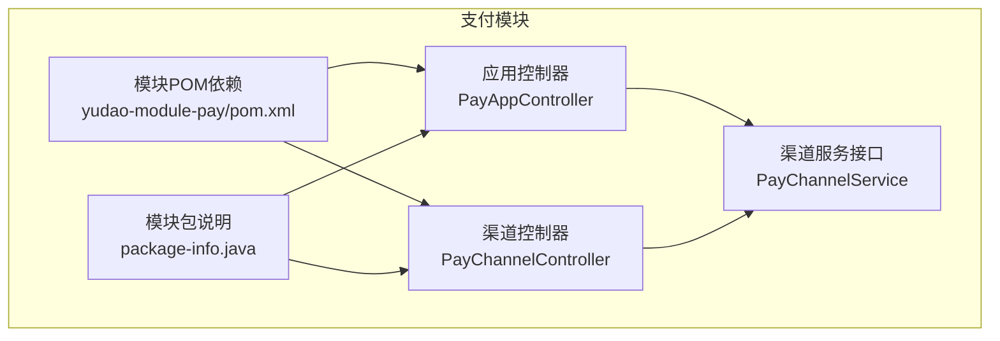
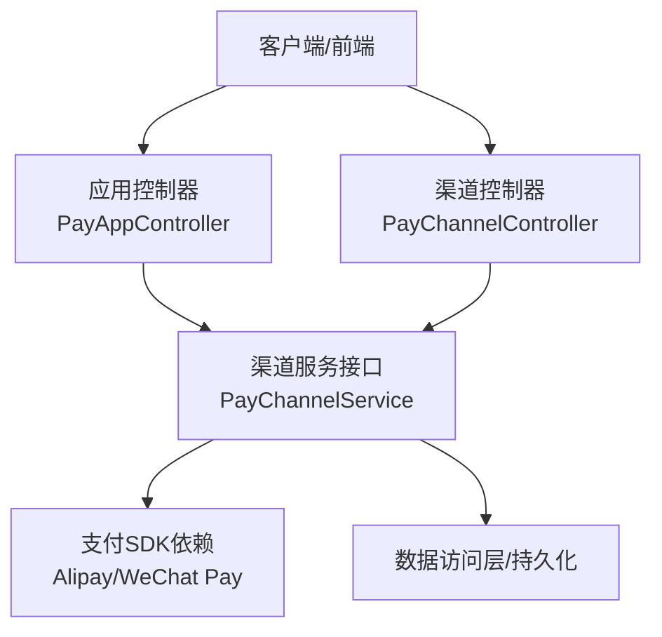
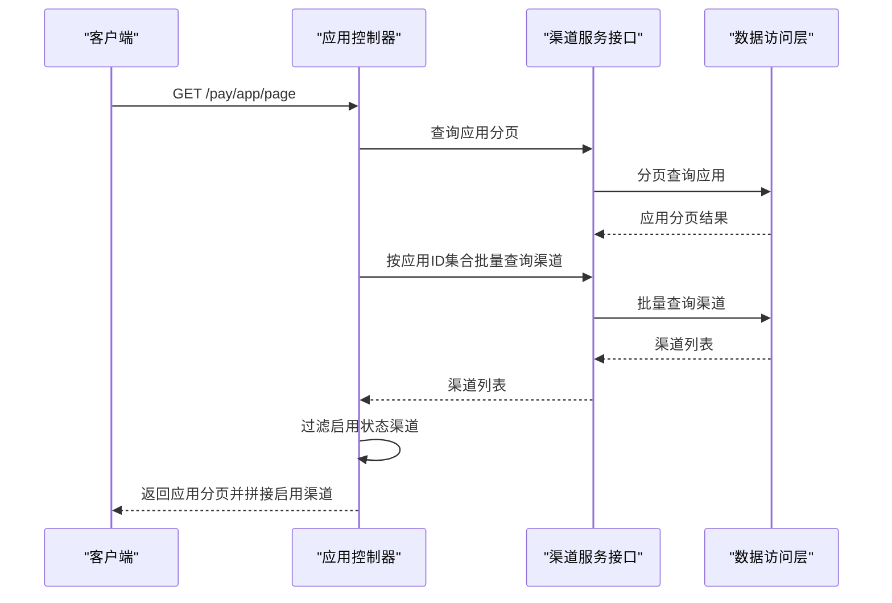
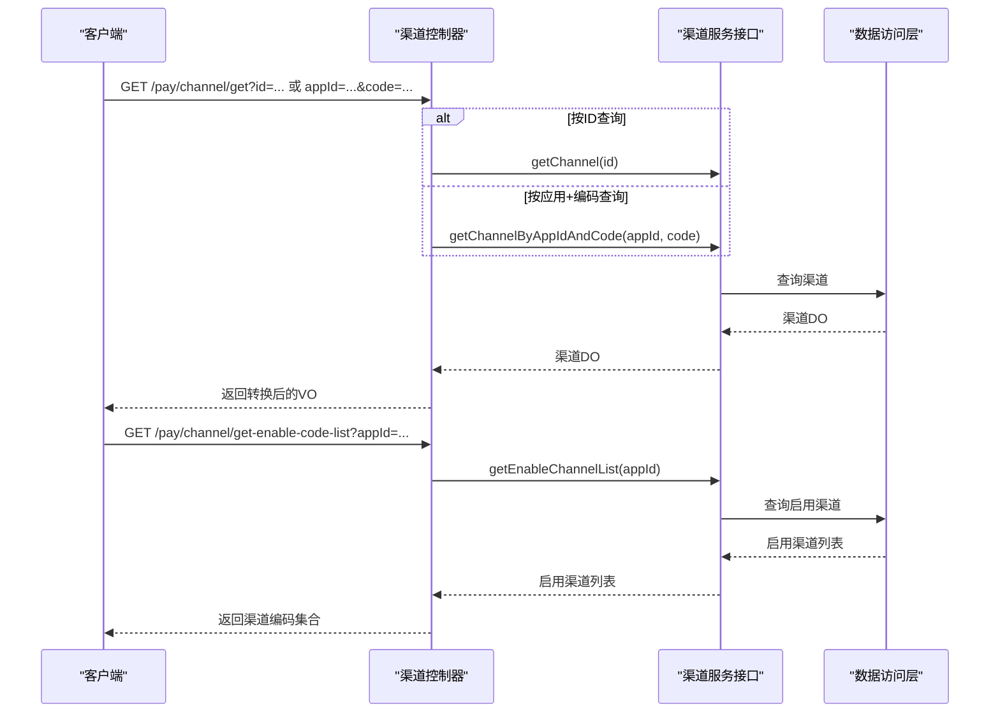
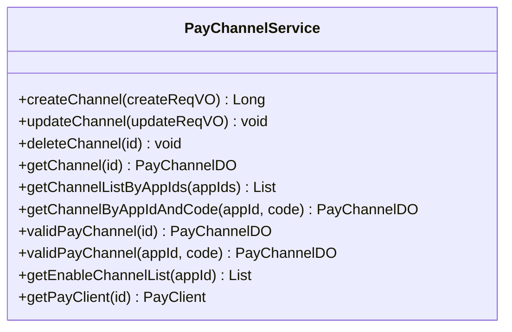
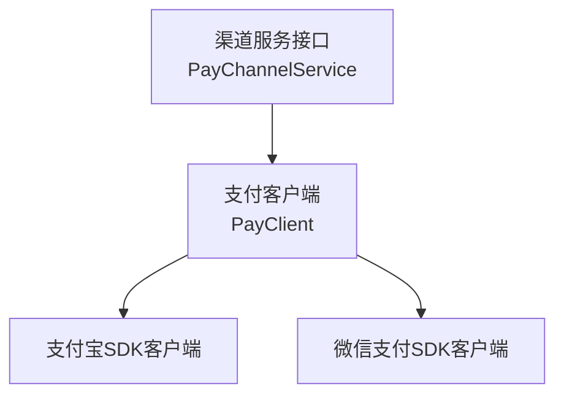
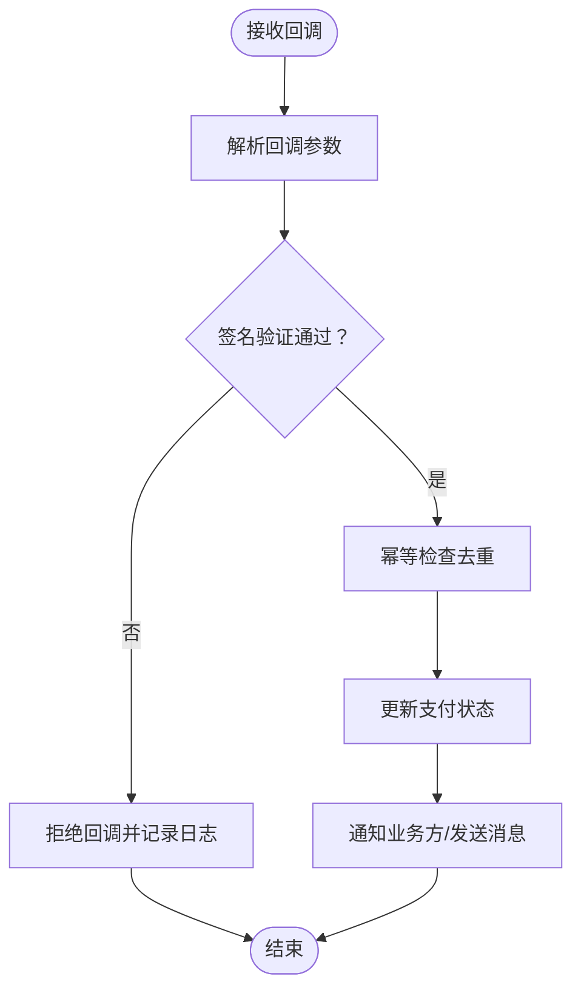
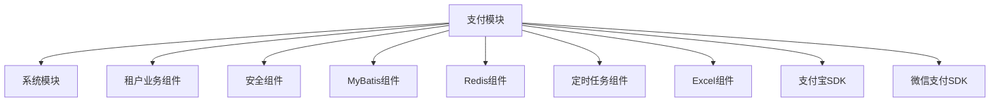

# 支付渠道集成

<cite>
**本文引用的文件**
- [支付模块说明](file://backend/yudao-module-pay/src/main/java/cn/iiocoder/yudao/module/pay/package-info.java)
- [支付模块POM依赖](file://backend/yudao-module-pay/pom.xml)
- [支付应用控制器](file://backend/yudao-module-pay/src/main/java/cn/iocoder/yudao/module/pay/controller/admin/app/PayAppController.java)
- [支付渠道控制器](file://backend/yudao-module-pay/src/main/java/cn/iocoder/yudao/module/pay/controller/admin/channel/PayChannelController.java)
- [支付渠道服务接口](file://backend/yudao-module-pay/src/main/java/cn/iocoder/yudao/module/pay/service/channel/PayChannelService.java)
</cite>

## 目录
1. [简介](#简介)
2. [项目结构](#项目结构)
3. [核心组件](#核心组件)
4. [架构总览](#架构总览)
5. [详细组件分析](#详细组件分析)
6. [依赖分析](#依赖分析)
7. [性能考虑](#性能考虑)
8. [故障排查指南](#故障排查指南)
9. [结论](#结论)
10. [附录](#附录)

## 简介
本文件面向支付渠道集成场景，系统性阐述支付应用配置、支付渠道管理、支付参数设置与回调处理等核心能力。结合现有代码库中的支付模块结构，重点覆盖以下方面：
- 支付应用与渠道的管理接口设计
- 支付参数校验与渠道合法性校验
- 回调处理与签名验证的实现思路
- 支付SDK集成、异步回调处理、支付状态轮询与错误重试机制的技术实现要点
- 提供完整的支付流程图、渠道配置示例、回调处理示例、安全验证机制与性能优化策略

## 项目结构
支付模块位于后端工程的独立模块中，采用标准的分层架构：控制层（Controller）、服务层（Service）、数据访问层（DAO）以及领域对象（DO）。模块通过统一的URL前缀进行隔离，避免与其他模块命名冲突；数据表均以特定前缀命名，便于数据库层面的区分。

**图表来源**
- [支付模块POM依赖:1-84](file://backend/yudao-module-pay/pom.xml#L1-L84)
- [支付应用控制器:1-109](file://backend/yudao-module-pay/src/main/java/cn/iocoder/yudao/module/pay/controller/admin/app/PayAppController.java#L1-L109)
- [支付渠道控制器:1-83](file://backend/yudao-module-pay/src/main/java/cn/iocoder/yudao/module/pay/controller/admin/channel/PayChannelController.java#L1-L83)
- [支付模块说明:1-11](file://backend/yudao-module-pay/src/main/java/cn/iocoder/yudao/module/pay/package-info.java#L1-L11)

**章节来源**
- [支付模块说明:1-11](file://backend/yudao-module-pay/src/main/java/cn/iocoder/yudao/module/pay/package-info.java#L1-L11)
- [支付模块POM依赖:1-84](file://backend/yudao-module-pay/pom.xml#L1-L84)

## 核心组件
- 控制层（Controller）
  - 应用管理：提供支付应用的创建、更新、状态变更、删除、查询与分页列表等接口，支持按应用ID集合批量查询关联渠道并过滤启用状态。
  - 渠道管理：提供支付渠道的创建、更新、删除、查询、按应用获取启用渠道编码列表等接口。
- 服务层（Service）
  - 渠道服务接口定义了渠道的增删改查、按应用批量查询、按应用+编码查询、渠道合法性校验、启用渠道列表查询以及获取支付客户端等能力。
- 数据模型与转换
  - VO/DO/Convert：通过统一的转换器将DO映射为对外VO，保证接口输出的一致性与可维护性。
- 外部SDK集成
  - 支付模块已引入主流支付SDK依赖，为后续接入具体支付渠道（如支付宝、微信支付）提供基础能力。

**章节来源**
- [支付应用控制器:1-109](file://backend/yudao-module-pay/src/main/java/cn/iocoder/yudao/module/pay/controller/admin/app/PayAppController.java#L1-L109)
- [支付渠道控制器:1-83](file://backend/yudao-module-pay/src/main/java/cn/iocoder/yudao/module/pay/controller/admin/channel/PayChannelController.java#L1-L83)
- [支付渠道服务接口:1-105](file://backend/yudao-module-pay/src/main/java/cn/iocoder/yudao/module/pay/service/channel/PayChannelService.java#L1-L105)
- [支付模块POM依赖:70-80](file://backend/yudao-module-pay/pom.xml#L70-L80)

## 架构总览
支付模块遵循“控制层-服务层-数据层”的分层设计，控制器负责HTTP请求处理与权限校验，服务层负责业务规则与渠道合法性校验，数据层负责持久化与查询。模块通过统一的URL前缀与表命名规范，确保在多租户与多应用场景下的清晰边界。

**图表来源**
- [支付应用控制器:1-109](file://backend/yudao-module-pay/src/main/java/cn/iocoder/yudao/module/pay/controller/admin/app/PayAppController.java#L1-L109)
- [支付渠道控制器:1-83](file://backend/yudao-module-pay/src/main/java/cn/iocoder/yudao/module/pay/controller/admin/channel/PayChannelController.java#L1-L83)
- [支付渠道服务接口:1-105](file://backend/yudao-module-pay/src/main/java/cn/iocoder/yudao/module/pay/service/channel/PayChannelService.java#L1-L105)
- [支付模块POM依赖:70-80](file://backend/yudao-module-pay/pom.xml#L70-L80)

## 详细组件分析

### 组件A：支付应用管理
- 功能职责
  - 创建/更新/删除/查询单个应用
  - 分页查询应用列表，并按应用ID集合批量查询关联渠道，过滤启用状态后拼接返回
  - 获取应用列表
- 关键流程
  - 分页查询应用列表后，根据应用ID集合批量查询渠道，再对渠道进行启用状态过滤，最后通过转换器将结果集映射为对外VO。
- 性能与可用性
  - 批量查询渠道可减少多次数据库往返
  - 启用状态过滤避免向客户端暴露不可用渠道

**图表来源**
- [支付应用控制器:81-98](file://backend/yudao-module-pay/src/main/java/cn/iocoder/yudao/module/pay/controller/admin/app/PayAppController.java#L81-L98)

**章节来源**
- [支付应用控制器:1-109](file://backend/yudao-module-pay/src/main/java/cn/iocoder/yudao/module/pay/controller/admin/app/PayAppController.java#L1-L109)

### 组件B：支付渠道管理
- 功能职责
  - 创建/更新/删除渠道
  - 查询单个渠道（支持按ID或按应用+编码两种方式）
  - 获取指定应用的启用渠道编码集合
- 关键流程
  - 查询渠道时优先按ID查询，若为空则按应用+编码组合查询，最终返回转换后的VO。
  - 获取启用渠道编码列表时，先查询启用渠道，再提取渠道编码集合返回。

**图表来源**
- [支付渠道控制器:58-80](file://backend/yudao-module-pay/src/main/java/cn/iocoder/yudao/module/pay/controller/admin/channel/PayChannelController.java#L58-L80)

**章节来源**
- [支付渠道控制器:1-83](file://backend/yudao-module-pay/src/main/java/cn/iocoder/yudao/module/pay/controller/admin/channel/PayChannelController.java#L1-L83)

### 组件C：支付渠道服务接口
- 职责边界
  - 渠道的增删改查、按应用批量查询、按应用+编码查询
  - 渠道合法性校验（抛出业务异常）
  - 获取指定应用的启用渠道列表
  - 获取支付客户端实例（用于后续SDK调用）
- 设计要点
  - 将“渠道合法性校验”抽象为服务层方法，便于在业务流程中统一使用
  - 提供“获取支付客户端”方法，为后续对接具体支付SDK提供统一入口

**图表来源**
- [支付渠道服务接口:1-105](file://backend/yudao-module-pay/src/main/java/cn/iocoder/yudao/module/pay/service/channel/PayChannelService.java#L1-L105)

**章节来源**
- [支付渠道服务接口:1-105](file://backend/yudao-module-pay/src/main/java/cn/iocoder/yudao/module/pay/service/channel/PayChannelService.java#L1-L105)

### 组件D：支付SDK集成与客户端
- 依赖现状
  - 模块已引入主流支付SDK依赖，为后续接入具体支付渠道（如支付宝、微信支付）提供基础能力。
- 集成建议
  - 基于服务接口提供的“获取支付客户端”方法，按渠道ID动态选择对应SDK客户端
  - 在客户端初始化时注入渠道参数（如应用ID、密钥、证书等），并进行参数校验
  - 对SDK调用结果进行统一封装，便于上层业务处理

**图表来源**
- [支付模块POM依赖:70-80](file://backend/yudao-module-pay/pom.xml#L70-L80)
- [支付渠道服务接口:96-104](file://backend/yudao-module-pay/src/main/java/cn/iocoder/yudao/module/pay/service/channel/PayChannelService.java#L96-L104)

**章节来源**
- [支付模块POM依赖:70-80](file://backend/yudao-module-pay/pom.xml#L70-L80)
- [支付渠道服务接口:96-104](file://backend/yudao-module-pay/src/main/java/cn/iocoder/yudao/module/pay/service/channel/PayChannelService.java#L96-L104)

### 组件E：支付参数校验与回调签名验证
- 参数校验
  - 控制器层使用校验注解对入参进行基础校验
  - 服务层提供渠道合法性校验方法，确保业务操作基于有效渠道
- 回调签名验证
  - 建议在回调处理流程中，先解析回调参数，再使用对应渠道的密钥/证书进行签名验证
  - 验证通过后，幂等处理业务状态变更，避免重复回调导致的状态不一致

[此图为概念性流程示意，无需图表来源]

## 依赖分析
支付模块通过统一的依赖声明，引入系统、安全、数据库、缓存、定时任务、Excel导出等基础设施能力，并引入主流支付SDK依赖，为支付渠道集成提供基础支撑。

**图表来源**
- [支付模块POM依赖:21-80](file://backend/yudao-module-pay/pom.xml#L21-L80)

**章节来源**
- [支付模块POM依赖:1-84](file://backend/yudao-module-pay/pom.xml#L1-L84)

## 性能考虑
- 批量查询优化
  - 应用分页查询后，按应用ID集合批量查询渠道，减少数据库往返次数
- 启用状态过滤
  - 在服务层对渠道进行启用状态过滤，避免向客户端传输无效渠道
- 缓存策略
  - 对常用渠道配置与启用渠道列表进行缓存，降低频繁查询数据库的压力
- 幂等与去重
  - 回调处理中实施幂等检查，避免重复回调导致的重复处理
- 错误重试
  - 对外调用失败时采用指数退避重试策略，避免雪崩效应

[本节为通用性能建议，无需章节来源]

## 故障排查指南
- 渠道合法性异常
  - 使用服务层的渠道合法性校验方法，确保业务操作基于有效渠道
- 回调签名失败
  - 检查回调参数是否完整、签名算法与参数顺序是否正确、渠道密钥/证书是否匹配
- 幂等问题
  - 核对回调ID去重逻辑，确保同一回调仅处理一次
- 性能瓶颈
  - 关注批量查询与缓存命中率，必要时增加索引或扩大缓存容量

**章节来源**
- [支付渠道服务接口:67-86](file://backend/yudao-module-pay/src/main/java/cn/iocoder/yudao/module/pay/service/channel/PayChannelService.java#L67-L86)

## 结论
支付模块通过清晰的分层设计与统一的接口规范，为支付应用与渠道管理提供了稳定的基础能力。结合模块内已有的SDK依赖与服务接口，开发者可以快速完成支付渠道的接入与扩展。建议在实际落地时重点关注参数校验、回调签名验证、幂等处理与性能优化，确保系统的可靠性与可维护性。

## 附录
- 支付流程示例（概念性）
  - 用户下单 → 选择支付方式 → 生成支付订单 → 调用支付SDK → 跳转至第三方支付页面 → 支付完成后异步回调 → 回调签名验证与幂等处理 → 更新支付状态 → 通知业务方
- 渠道配置示例（概念性）
  - 应用ID、渠道编码、状态、支付参数（如密钥、证书路径）、回调地址等
- 回调处理示例（概念性）
  - 解析回调参数 → 签名验证 → 幂等检查 → 更新订单状态 → 发送通知

[以上为概念性内容，无需章节来源]