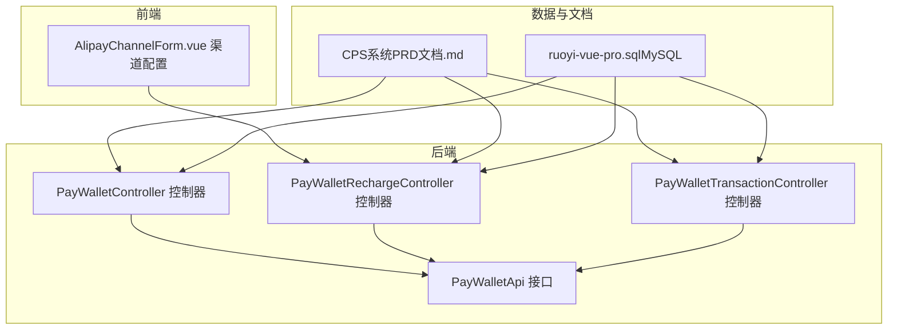
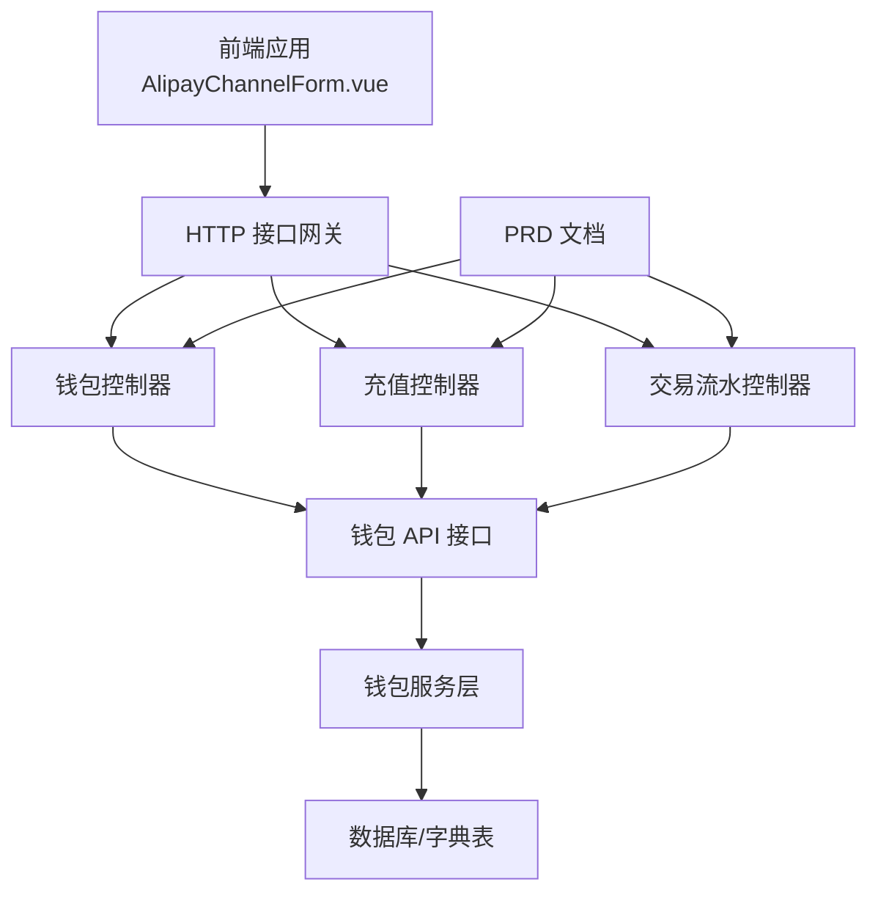
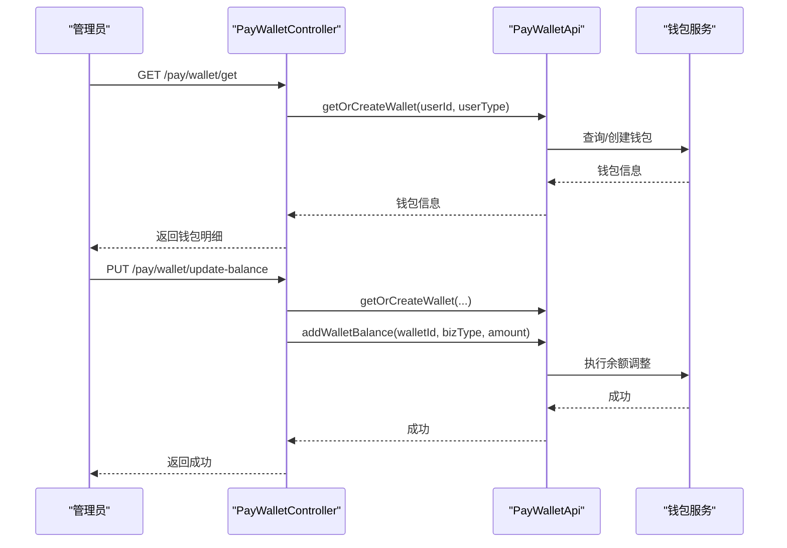
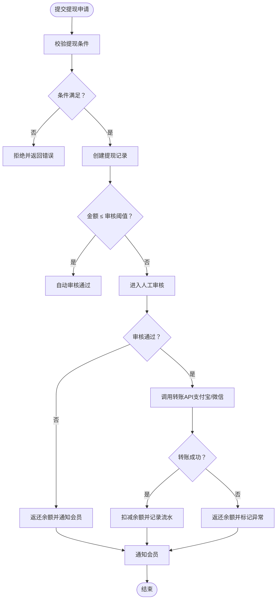
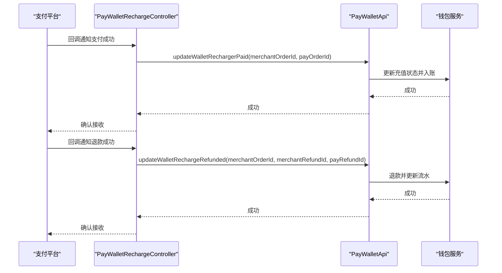
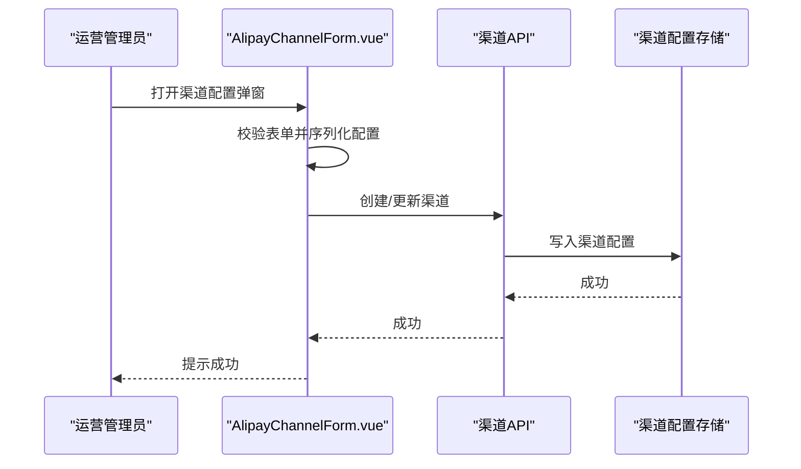
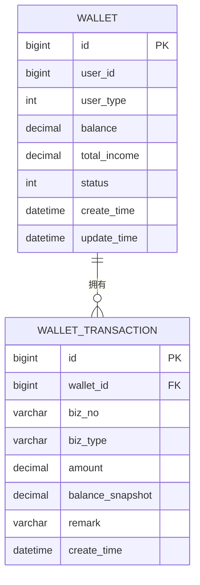
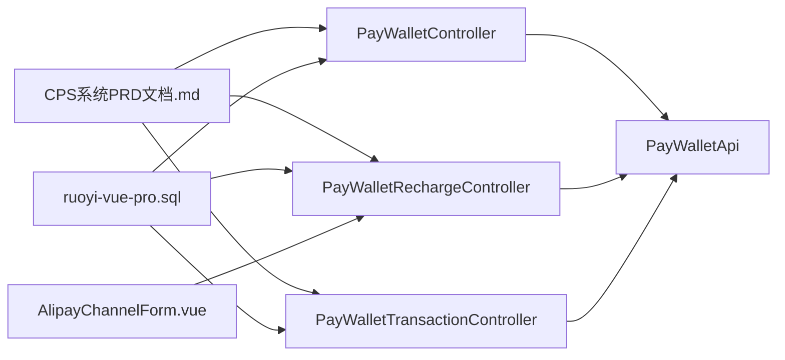

# 支付钱包系统

<cite>
**本文引用的文件**
- [PayWalletApi.java](file://backend/yudao-module-pay/src/main/java/cn/iocoder/yudao/module/pay/api/wallet/PayWalletApi.java)
- [PayWalletController.java](file://backend/yudao-module-pay/src/main/java/cn/iocoder/yudao/module/pay/controller/admin/wallet/PayWalletController.java)
- [PayWalletRechargeController.java](file://backend/yudao-module-pay/src/main/java/cn/iocoder/yudao/module/pay/controller/admin/wallet/PayWalletRechargeController.java)
- [PayWalletTransactionController.java](file://backend/yudao-module-pay/src/main/java/cn/iocoder/yudao/module/pay/controller/admin/wallet/PayWalletTransactionController.java)
- [CPS系统PRD文档.md](file://docs/CPS系统PRD文档.md)
- [AlipayChannelForm.vue](file://frontend/admin-vue3/src/views/pay/app/components/channel/AlipayChannelForm.vue)
- [ruoyi-vue-pro.sql（MySQL）](file://backend/sql/mysql/ruoyi-vue-pro.sql)
</cite>

## 目录
1. [简介](#简介)
2. [项目结构](#项目结构)
3. [核心组件](#核心组件)
4. [架构总览](#架构总览)
5. [详细组件分析](#详细组件分析)
6. [依赖分析](#依赖分析)
7. [性能考虑](#性能考虑)
8. [故障排查指南](#故障排查指南)
9. [结论](#结论)
10. [附录](#附录)

## 简介
本文件面向支付钱包系统，围绕“钱包余额管理、返利提现流程、提现审核机制、财务对账系统”等核心主题，结合后端控制器、API 接口与前端渠道配置组件，系统性梳理业务流程、数据模型、接口规范与安全控制，帮助开发者快速理解并实施该系统。

## 项目结构
支付钱包系统主要位于后端模块 yudao-module-pay，包含钱包 API、钱包控制器、充值控制器、交易流水控制器以及配套 PRD 文档；前端 admin-vue3 提供支付渠道配置界面，数据库脚本包含字典枚举（如审核状态）。

**图表来源**
- [PayWalletApi.java:1-30](file://backend/yudao-module-pay/src/main/java/cn/iocoder/yudao/module/pay/api/wallet/PayWalletApi.java#L1-L30)
- [PayWalletController.java:1-71](file://backend/yudao-module-pay/src/main/java/cn/iocoder/yudao/module/pay/controller/admin/wallet/PayWalletController.java#L1-L71)
- [PayWalletRechargeController.java:1-60](file://backend/yudao-module-pay/src/main/java/cn/iocoder/yudao/module/pay/controller/admin/wallet/PayWalletRechargeController.java#L1-L60)
- [PayWalletTransactionController.java:1-44](file://backend/yudao-module-pay/src/main/java/cn/iocoder/yudao/module/pay/controller/admin/wallet/PayWalletTransactionController.java#L1-L44)
- [AlipayChannelForm.vue:252-299](file://frontend/admin-vue3/src/views/pay/app/components/channel/AlipayChannelForm.vue#L252-L299)
- [CPS系统PRD文档.md:225-261](file://docs/CPS系统PRD文档.md#L225-L261)
- [ruoyi-vue-pro.sql（MySQL）:754-757](file://backend/sql/mysql/ruoyi-vue-pro.sql#L754-L757)

**章节来源**
- [PayWalletApi.java:1-30](file://backend/yudao-module-pay/src/main/java/cn/iocoder/yudao/module/pay/api/wallet/PayWalletApi.java#L1-L30)
- [PayWalletController.java:1-71](file://backend/yudao-module-pay/src/main/java/cn/iocoder/yudao/module/pay/controller/admin/wallet/PayWalletController.java#L1-L71)
- [PayWalletRechargeController.java:1-60](file://backend/yudao-module-pay/src/main/java/cn/iocoder/yudao/module/pay/controller/admin/wallet/PayWalletRechargeController.java#L1-L60)
- [PayWalletTransactionController.java:1-44](file://backend/yudao-module-pay/src/main/java/cn/iocoder/yudao/module/pay/controller/admin/wallet/PayWalletTransactionController.java#L1-L44)
- [AlipayChannelForm.vue:252-299](file://frontend/admin-vue3/src/views/pay/app/components/channel/AlipayChannelForm.vue#L252-L299)
- [CPS系统PRD文档.md:225-261](file://docs/CPS系统PRD文档.md#L225-L261)
- [ruoyi-vue-pro.sql（MySQL）:754-757](file://backend/sql/mysql/ruoyi-vue-pro.sql#L754-L757)

## 核心组件
- 钱包 API 接口：提供“添加余额”和“获取/创建钱包”的能力，作为钱包服务的对外契约。
- 钱包控制器：提供钱包查询、分页、余额调整等管理后台接口。
- 充值控制器：提供充值状态更新、退款、退款状态更新等回调与操作接口。
- 交易流水控制器：提供钱包流水分页查询接口。
- 前端渠道配置：提供支付渠道（如支付宝）配置表单，支持创建/编辑渠道及序列化配置。
- PRD 文档：明确提现流程、审核阈值、对账与异常处理等业务规则。
- 数据字典：提供审核状态等枚举值，支撑业务状态流转。

**章节来源**
- [PayWalletApi.java:11-29](file://backend/yudao-module-pay/src/main/java/cn/iocoder/yudao/module/pay/api/wallet/PayWalletApi.java#L11-L29)
- [PayWalletController.java:37-70](file://backend/yudao-module-pay/src/main/java/cn/iocoder/yudao/module/pay/controller/admin/wallet/PayWalletController.java#L37-L70)
- [PayWalletRechargeController.java:31-57](file://backend/yudao-module-pay/src/main/java/cn/iocoder/yudao/module/pay/controller/admin/wallet/PayWalletRechargeController.java#L31-L57)
- [PayWalletTransactionController.java:34-42](file://backend/yudao-module-pay/src/main/java/cn/iocoder/yudao/module/pay/controller/admin/wallet/PayWalletTransactionController.java#L34-L42)
- [AlipayChannelForm.vue:252-299](file://frontend/admin-vue3/src/views/pay/app/components/channel/AlipayChannelForm.vue#L252-L299)
- [CPS系统PRD文档.md:225-261](file://docs/CPS系统PRD文档.md#L225-L261)
- [ruoyi-vue-pro.sql（MySQL）:754-757](file://backend/sql/mysql/ruoyi-vue-pro.sql#L754-L757)

## 架构总览
系统采用“控制器-服务-数据对象-接口契约”的分层架构，前端通过 HTTP 接口与后端交互，后端通过钱包 API 与钱包服务对接，PRD 文档与数据字典为业务规则与状态提供依据。

**图表来源**
- [PayWalletController.java:37-70](file://backend/yudao-module-pay/src/main/java/cn/iocoder/yudao/module/pay/controller/admin/wallet/PayWalletController.java#L37-L70)
- [PayWalletRechargeController.java:31-57](file://backend/yudao-module-pay/src/main/java/cn/iocoder/yudao/module/pay/controller/admin/wallet/PayWalletRechargeController.java#L31-L57)
- [PayWalletTransactionController.java:34-42](file://backend/yudao-module-pay/src/main/java/cn/iocoder/yudao/module/pay/controller/admin/wallet/PayWalletTransactionController.java#L34-L42)
- [PayWalletApi.java:11-29](file://backend/yudao-module-pay/src/main/java/cn/iocoder/yudao/module/pay/api/wallet/PayWalletApi.java#L11-L29)
- [CPS系统PRD文档.md:225-261](file://docs/CPS系统PRD文档.md#L225-L261)
- [ruoyi-vue-pro.sql（MySQL）:754-757](file://backend/sql/mysql/ruoyi-vue-pro.sql#L754-L757)

## 详细组件分析

### 钱包余额管理
- 能力边界
  - 获取/创建钱包：根据用户编号与类型返回钱包信息。
  - 添加余额：向钱包增加余额，用于返利入账等场景。
- 控制器职责
  - 查询钱包明细、分页查询钱包列表。
  - 管理员更新余额（内部通过钱包 API 调用）。
- 业务要点
  - 余额变动需产生流水记录，便于对账与审计。
  - 余额调整需具备权限控制与日志记录。

**图表来源**
- [PayWalletController.java:37-70](file://backend/yudao-module-pay/src/main/java/cn/iocoder/yudao/module/pay/controller/admin/wallet/PayWalletController.java#L37-L70)
- [PayWalletApi.java:11-29](file://backend/yudao-module-pay/src/main/java/cn/iocoder/yudao/module/pay/api/wallet/PayWalletApi.java#L11-L29)

**章节来源**
- [PayWalletController.java:37-70](file://backend/yudao-module-pay/src/main/java/cn/iocoder/yudao/module/pay/controller/admin/wallet/PayWalletController.java#L37-L70)
- [PayWalletApi.java:11-29](file://backend/yudao-module-pay/src/main/java/cn/iocoder/yudao/module/pay/api/wallet/PayWalletApi.java#L11-L29)

### 返利提现流程
- 流程概览（来自 PRD）
  - 会员发起提现申请 → 校验条件（余额、最低金额、每日次数、单次上限、黑名单）→ 创建提现记录 → 审核判断（阈值内自动通过，阈值外人工审核）→ 审核通过则调用转账 API（支付宝/微信），失败则返还余额并标记异常 → 成功扣减余额并记录流水，失败则返还余额并通知会员。
- 关键控制点
  - 审核阈值：默认阈值决定自动审核或人工审核。
  - 异常处理：转账失败时返还余额并标记异常，保障资金安全。
  - 通知机制：提现状态变更需通知会员。

**图表来源**
- [CPS系统PRD文档.md:225-261](file://docs/CPS系统PRD文档.md#L225-L261)

**章节来源**
- [CPS系统PRD文档.md:225-261](file://docs/CPS系统PRD文档.md#L225-L261)

### 提现审核机制
- 审核状态枚举
  - 审批中、审核通过、审核不通过、已取消等状态，用于提现流程的状态流转。
- 审核阈值
  - 金额不超过阈值时自动通过，超过阈值进入人工审核队列。
- 权限与安全
  - 提审/复审接口需具备相应权限，防止越权操作。
  - 审核过程需记录日志，便于审计与追溯。

**章节来源**
- [ruoyi-vue-pro.sql（MySQL）:754-757](file://backend/sql/mysql/ruoyi-vue-pro.sql#L754-L757)
- [CPS系统PRD文档.md:225-261](file://docs/CPS系统PRD文档.md#L225-L261)

### 财务对账系统
- 对账范围
  - 充值对账：订单回调后更新充值状态，支持退款与二次确认。
  - 提现对账：提现流水与余额变动一一对应，异常状态需标记与修复。
- 对账触发
  - 订单定时同步后触发返利入账，入账后纳入余额与流水。
- 对账保障
  - 余额与流水一致性校验、异常流水标记与人工介入修复。

**图表来源**
- [PayWalletRechargeController.java:31-57](file://backend/yudao-module-pay/src/main/java/cn/iocoder/yudao/module/pay/controller/admin/wallet/PayWalletRechargeController.java#L31-L57)

**章节来源**
- [PayWalletRechargeController.java:31-57](file://backend/yudao-module-pay/src/main/java/cn/iocoder/yudao/module/pay/controller/admin/wallet/PayWalletRechargeController.java#L31-L57)

### 支付渠道集成
- 渠道配置
  - 前端提供渠道表单，支持创建/编辑渠道，序列化配置字段以便后端读取。
- 渠道能力
  - 支付宝/微信等渠道的配置项与回调处理，确保充值与提现的通道畅通。
- 安全与合规
  - 渠道密钥与回调签名校验，防止伪造请求。

**图表来源**
- [AlipayChannelForm.vue:252-299](file://frontend/admin-vue3/src/views/pay/app/components/channel/AlipayChannelForm.vue#L252-L299)

**章节来源**
- [AlipayChannelForm.vue:252-299](file://frontend/admin-vue3/src/views/pay/app/components/channel/AlipayChannelForm.vue#L252-L299)

### 风控策略
- 黑名单与限额
  - 提现校验包含黑名单检查、单次上限、每日次数等风控要素。
- 异常处理
  - 转账失败时返还余额并标记异常，避免资金沉淀。
- 日志与审计
  - 所有关键操作均需记录日志，便于风控分析与合规审计。

**章节来源**
- [CPS系统PRD文档.md:225-261](file://docs/CPS系统PRD文档.md#L225-L261)

### 异常处理
- 充值回调
  - 支付成功与退款成功回调分别更新充值状态与退款状态。
- 提现异常
  - 转账失败时返还余额并标记异常，通知会员。
- 错误码与日志
  - 控制器侧对异常进行捕获与记录，保证可观测性。

**章节来源**
- [PayWalletRechargeController.java:31-57](file://backend/yudao-module-pay/src/main/java/cn/iocoder/yudao/module/pay/controller/admin/wallet/PayWalletRechargeController.java#L31-L57)
- [PayWalletController.java:58-67](file://backend/yudao-module-pay/src/main/java/cn/iocoder/yudao/module/pay/controller/admin/wallet/PayWalletController.java#L58-L67)

### 数据模型设计
- 钱包表（概念）
  - 字段：用户标识、余额、累计收入、冻结余额、状态、创建/更新时间等。
- 交易流水表（概念）
  - 字段：流水号、用户标识、业务类型、变动金额、余额快照、关联单号、备注、创建时间等。
- 审核状态字典（参考）
  - 审批中、审核通过、审核不通过、已取消等状态值与标签。

**图表来源**
- [CPS系统PRD文档.md:225-261](file://docs/CPS系统PRD文档.md#L225-L261)

**章节来源**
- [CPS系统PRD文档.md:225-261](file://docs/CPS系统PRD文档.md#L225-L261)

### 接口规范
- 钱包查询
  - GET /pay/wallet/get：查询指定用户的钱包明细。
  - GET /pay/wallet/page：分页查询钱包列表。
- 余额调整
  - PUT /pay/wallet/update-balance：管理员更新用户余额。
- 充值回调
  - POST /pay/wallet-recharge/update-paid：支付成功回调，更新充值状态。
  - POST /pay/wallet-recharge/refund：发起充值退款。
  - POST /pay/wallet-recharge/update-refunded：退款成功回调，更新退款状态。
- 交易流水
  - GET /pay/wallet-transaction/page：分页查询钱包流水。

**章节来源**
- [PayWalletController.java:37-70](file://backend/yudao-module-pay/src/main/java/cn/iocoder/yudao/module/pay/controller/admin/wallet/PayWalletController.java#L37-L70)
- [PayWalletRechargeController.java:31-57](file://backend/yudao-module-pay/src/main/java/cn/iocoder/yudao/module/pay/controller/admin/wallet/PayWalletRechargeController.java#L31-L57)
- [PayWalletTransactionController.java:34-42](file://backend/yudao-module-pay/src/main/java/cn/iocoder/yudao/module/pay/controller/admin/wallet/PayWalletTransactionController.java#L34-L42)

### 安全控制措施
- 权限控制
  - 钱包查询与余额调整接口均标注权限注解，防止未授权访问。
- 回调安全
  - 充值回调接口标注无需登录，但需内部校验，确保回调来源可信。
- 日志与审计
  - 关键操作记录日志，保留证据链，便于审计与追责。

**章节来源**
- [PayWalletController.java:37-70](file://backend/yudao-module-pay/src/main/java/cn/iocoder/yudao/module/pay/controller/admin/wallet/PayWalletController.java#L37-L70)
- [PayWalletRechargeController.java:31-57](file://backend/yudao-module-pay/src/main/java/cn/iocoder/yudao/module/pay/controller/admin/wallet/PayWalletRechargeController.java#L31-L57)

## 依赖分析
- 控制器依赖钱包 API 接口，钱包 API 再依赖钱包服务层，形成清晰的分层依赖。
- PRD 文档与数据字典为业务规则与状态提供依据，贯穿提现、充值与对账流程。
- 前端渠道配置组件与充值回调接口配合，确保渠道配置与回调处理闭环。

**图表来源**
- [PayWalletController.java:37-70](file://backend/yudao-module-pay/src/main/java/cn/iocoder/yudao/module/pay/controller/admin/wallet/PayWalletController.java#L37-L70)
- [PayWalletRechargeController.java:31-57](file://backend/yudao-module-pay/src/main/java/cn/iocoder/yudao/module/pay/controller/admin/wallet/PayWalletRechargeController.java#L31-L57)
- [PayWalletTransactionController.java:34-42](file://backend/yudao-module-pay/src/main/java/cn/iocoder/yudao/module/pay/controller/admin/wallet/PayWalletTransactionController.java#L34-L42)
- [CPS系统PRD文档.md:225-261](file://docs/CPS系统PRD文档.md#L225-L261)
- [ruoyi-vue-pro.sql（MySQL）:754-757](file://backend/sql/mysql/ruoyi-vue-pro.sql#L754-L757)
- [AlipayChannelForm.vue:252-299](file://frontend/admin-vue3/src/views/pay/app/components/channel/AlipayChannelForm.vue#L252-L299)

**章节来源**
- [PayWalletController.java:37-70](file://backend/yudao-module-pay/src/main/java/cn/iocoder/yudao/module/pay/controller/admin/wallet/PayWalletController.java#L37-L70)
- [PayWalletRechargeController.java:31-57](file://backend/yudao-module-pay/src/main/java/cn/iocoder/yudao/module/pay/controller/admin/wallet/PayWalletRechargeController.java#L31-L57)
- [PayWalletTransactionController.java:34-42](file://backend/yudao-module-pay/src/main/java/cn/iocoder/yudao/module/pay/controller/admin/wallet/PayWalletTransactionController.java#L34-L42)
- [CPS系统PRD文档.md:225-261](file://docs/CPS系统PRD文档.md#L225-L261)
- [ruoyi-vue-pro.sql（MySQL）:754-757](file://backend/sql/mysql/ruoyi-vue-pro.sql#L754-L757)
- [AlipayChannelForm.vue:252-299](file://frontend/admin-vue3/src/views/pay/app/components/channel/AlipayChannelForm.vue#L252-L299)

## 性能考虑
- 充值与提现回调
  - 回调接口需快速校验与落库，避免阻塞支付通道。
- 分页查询
  - 钱包与流水分页查询需合理索引与分页大小控制，避免大偏移量导致慢查询。
- 审核阈值
  - 合理设置阈值，减少人工审核压力，提升自动化处理比例。
- 对账批处理
  - 订单定时同步与对账批处理需限流与幂等设计，避免重复入账与对账偏差。

## 故障排查指南
- 提现失败
  - 检查转账通道配置与回调是否正常，确认余额与流水一致，必要时人工干预。
- 充值未到账
  - 核对回调参数与签名，检查订单状态与二次确认流程。
- 权限不足
  - 确认接口权限配置与用户角色，确保管理员具备相应权限。
- 审核状态异常
  - 核对数据字典状态值，检查流程节点与日志，修复异常状态。

**章节来源**
- [PayWalletRechargeController.java:31-57](file://backend/yudao-module-pay/src/main/java/cn/iocoder/yudao/module/pay/controller/admin/wallet/PayWalletRechargeController.java#L31-L57)
- [PayWalletController.java:58-67](file://backend/yudao-module-pay/src/main/java/cn/iocoder/yudao/module/pay/controller/admin/wallet/PayWalletController.java#L58-L67)
- [ruoyi-vue-pro.sql（MySQL）:754-757](file://backend/sql/mysql/ruoyi-vue-pro.sql#L754-L757)

## 结论
支付钱包系统通过清晰的分层架构与完善的业务流程，实现了从返利入账、余额管理、提现审核到财务对账的闭环。结合 PRD 文档与数据字典，系统在自动化与人工审核之间取得平衡，并通过严格的权限控制与日志审计保障安全性与可追溯性。开发者可据此快速落地钱包功能并持续优化性能与风控策略。

## 附录
- 相关接口与文件路径
  - [PayWalletController.java:37-70](file://backend/yudao-module-pay/src/main/java/cn/iocoder/yudao/module/pay/controller/admin/wallet/PayWalletController.java#L37-L70)
  - [PayWalletRechargeController.java:31-57](file://backend/yudao-module-pay/src/main/java/cn/iocoder/yudao/module/pay/controller/admin/wallet/PayWalletRechargeController.java#L31-L57)
  - [PayWalletTransactionController.java:34-42](file://backend/yudao-module-pay/src/main/java/cn/iocoder/yudao/module/pay/controller/admin/wallet/PayWalletTransactionController.java#L34-L42)
  - [PayWalletApi.java:11-29](file://backend/yudao-module-pay/src/main/java/cn/iocoder/yudao/module/pay/api/wallet/PayWalletApi.java#L11-L29)
  - [AlipayChannelForm.vue:252-299](file://frontend/admin-vue3/src/views/pay/app/components/channel/AlipayChannelForm.vue#L252-L299)
  - [CPS系统PRD文档.md:225-261](file://docs/CPS系统PRD文档.md#L225-L261)
  - [ruoyi-vue-pro.sql（MySQL）:754-757](file://backend/sql/mysql/ruoyi-vue-pro.sql#L754-L757)