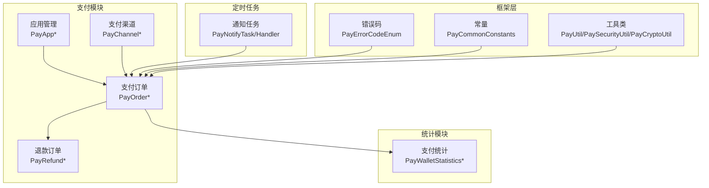
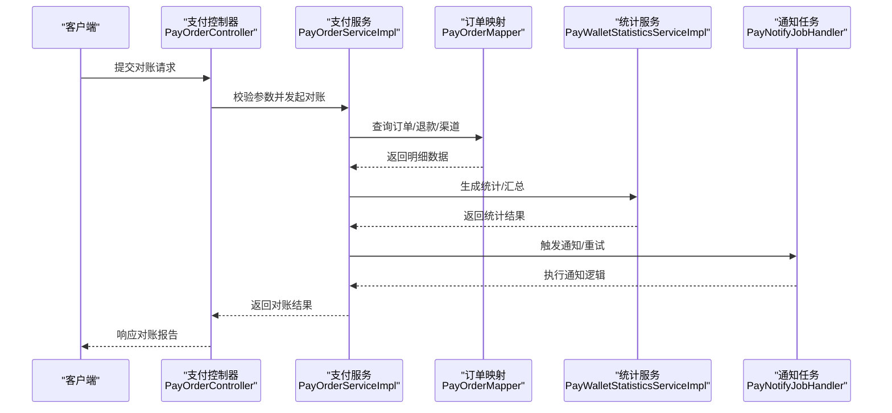
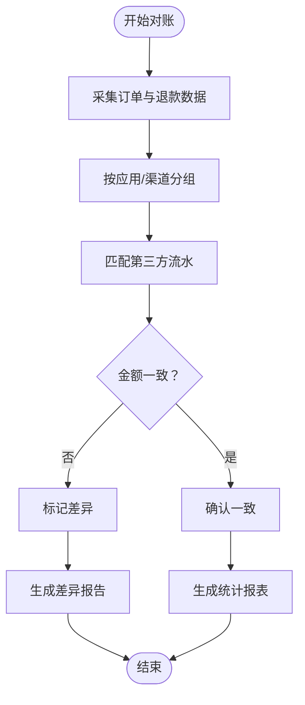
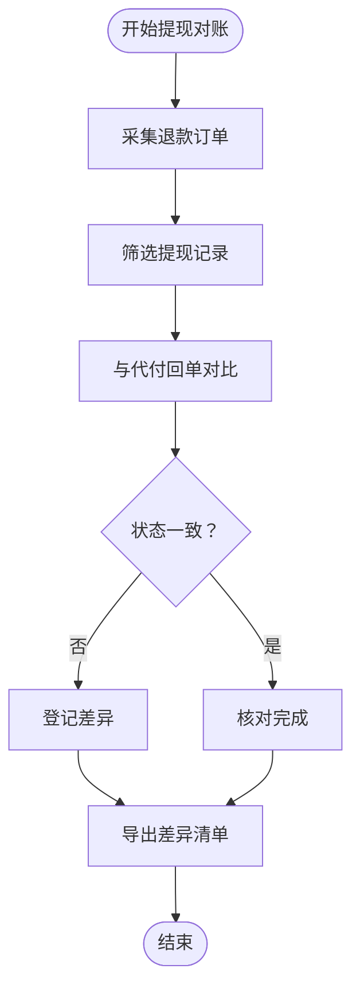
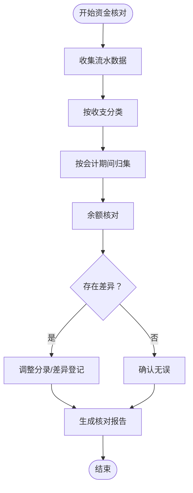
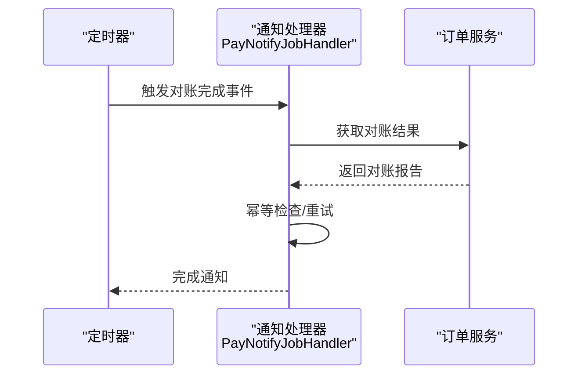
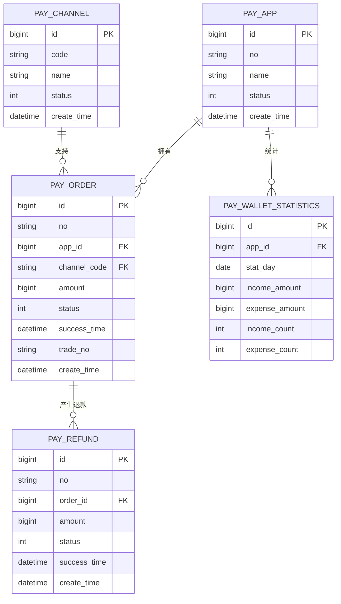
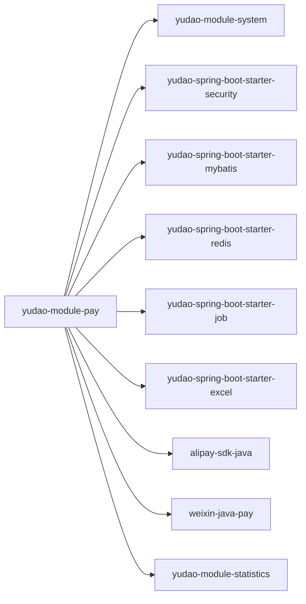

# 财务对账系统

<cite>
**本文引用的文件**
- [pom.xml](file://backend/yudao-module-pay/pom.xml)
- [PayApplication.java](file://backend/yudao-module-pay/src/main/java/cn/iocoder/yudao/module/pay/PayApplication.java)
- [PayOrderDO.java](file://backend/yudao-module-pay/src/main/java/cn/iocoder/yudao/module/pay/dal/dataobject/order/PayOrderDO.java)
- [PayOrderPayReqDTO.java](file://backend/yudao-module-pay/src/main/java/cn/iocoder/yudao/module/pay/dal/dto/order/PayOrderPayReqDTO.java)
- [PayOrderPayRespDTO.java](file://backend/yudao-module-pay/src/main/java/cn/iocoder/yudao/module/pay/dal/dto/order/PayOrderPayRespDTO.java)
- [PayOrderMapper.java](file://backend/yudao-module-pay/src/main/java/cn/iocoder/yudao/module/pay/dal/mysql/order/PayOrderMapper.java)
- [PayOrderMapper.xml](file://backend/yudao-module-pay/src/main/resources/mapper/order/PayOrderMapper.xml)
- [PayOrderServiceImpl.java](file://backend/yudao-module-pay/src/main/java/cn/iocoder/yudao/module/pay/service/order/PayOrderServiceImpl.java)
- [PayChannelDO.java](file://backend/yudao-module-pay/src/main/java/cn/iocoder/yudao/module/pay/dal/dataobject/channel/PayChannelDO.java)
- [PayChannelMapper.java](file://backend/yudao-module-pay/src/main/java/cn/iocoder/yudao/module/pay/dal/mysql/channel/PayChannelMapper.java)
- [PayChannelMapper.xml](file://backend/yudao-module-pay/src/main/resources/mapper/channel/PayChannelMapper.xml)
- [PayChannelServiceImpl.java](file://backend/yudao-module-pay/src/main/java/cn/iocoder/yudao/module/pay/service/channel/PayChannelServiceImpl.java)
- [PayRefundDO.java](file://backend/yudao-module-pay/src/main/java/cn/iocoder/yudao/module/pay/dal/dataobject/refund/PayRefundDO.java)
- [PayRefundMapper.java](file://backend/yudao-module-pay/src/main/java/cn/iocoder/yudao/module/pay/dal/mysql/refund/PayRefundMapper.java)
- [PayRefundMapper.xml](file://backend/yudao-module-pay/src/main/resources/mapper/refund/PayRefundMapper.xml)
- [PayRefundServiceImpl.java](file://backend/yudao-module-pay/src/main/java/cn/iocoder/yudao/module/pay/service/refund/PayRefundServiceImpl.java)
- [PayAppDO.java](file://backend/yudao-module-pay/src/main/java/cn/iocoder/yudao/module/pay/dal/dataobject/app/PayAppDO.java)
- [PayAppMapper.java](file://backend/yudao-module-pay/src/main/java/cn/iocoder/yudao/module/pay/dal/mysql/app/PayAppMapper.java)
- [PayAppMapper.xml](file://backend/yudao-module-pay/src/main/resources/mapper/app/PayAppMapper.xml)
- [PayAppServiceImpl.java](file://backend/yudao-module-pay/src/main/java/cn/iocoder/yudao/module/pay/service/app/PayAppServiceImpl.java)
- [PayNotifyTask.java](file://backend/yudao-module-pay/src/main/java/cn/iocoder/yudao/module/pay/job/notify/PayNotifyTask.java)
- [PayNotifyJobHandler.java](file://backend/yudao-module-pay/src/main/java/cn/iocoder/yudao/module/pay/job/notify/PayNotifyJobHandler.java)
- [PayOrderConvert.java](file://backend/yudao-module-pay/src/main/java/cn/iocoder/yudao/module/pay/convert/order/PayOrderConvert.java)
- [PayOrderConvertImpl.java](file://backend/yudao-module-pay/src/main/java/cn/iocoder/yudao/module/pay/convert/order/PayOrderConvertImpl.java)
- [PayChannelConvert.java](file://backend/yudao-module-pay/src/main/java/cn/iocoder/yudao/module/pay/convert/channel/PayChannelConvert.java)
- [PayChannelConvertImpl.java](file://backend/yudao-module-pay/src/main/java/cn/iocoder/yudao/module/pay/convert/channel/PayChannelConvertImpl.java)
- [PayRefundConvert.java](file://backend/yudao-module-pay/src/main/java/cn/iocoder/yudao/module/pay/convert/refund/PayRefundConvert.java)
- [PayRefundConvertImpl.java](file://backend/yudao-module-pay/src/main/java/cn/iocoder/yudao/module/pay/convert/refund/PayRefundConvertImpl.java)
- [PayAppConvert.java](file://backend/yudao-module-pay/src/main/java/cn/iocoder/yudao/module/pay/convert/app/PayAppConvert.java)
- [PayAppConvertImpl.java](file://backend/yudao-module-pay/src/main/java/cn/iocoder/yudao/module/pay/convert/app/PayAppConvertImpl.java)
- [PayOrderPageListReqVO.java](file://backend/yudao-module-pay/src/main/java/cn/iocoder/yudao/module/pay/controller/admin/order/vo/PayOrderPageListReqVO.java)
- [PayOrderExportReqVO.java](file://backend/yudao-module-pay/src/main/java/cn/iocoder/yudao/module/pay/controller/admin/order/vo/PayOrderExportReqVO.java)
- [PayOrderRespVO.java](file://backend/yudao-module-pay/src/main/java/cn/iocoder/yudao/module/pay/controller/admin/order/vo/PayOrderRespVO.java)
- [PayOrderListReqVO.java](file://backend/yudao-module-pay/src/main/java/cn/iocoder/yudao/module/pay/controller/admin/order/vo/PayOrderListReqVO.java)
- [PayOrderListRespVO.java](file://backend/yudao-module-pay/src/main/java/cn/iocoder/yudao/module/pay/controller/admin/order/vo/PayOrderListRespVO.java)
- [PayOrderPageReqVO.java](file://backend/yudao-module-pay/src/main/java/cn/iocoder/yudao/module/pay/controller/admin/order/vo/PayOrderPageReqVO.java)
- [PayOrderCreateReqVO.java](file://backend/yudao-module-pay/src/main/java/cn/iocoder/yudao/module/pay/controller/admin/order/vo/PayOrderCreateReqVO.java)
- [PayOrderUpdateReqVO.java](file://backend/yudao-module-pay/src/main/java/cn/iocoder/yudao/module/pay/controller/admin/order/vo/PayOrderUpdateReqVO.java)
- [PayOrderStatisticsRespVO.java](file://backend/yudao-module-pay/src/main/java/cn/iocoder/yudao/module/pay/controller/admin/order/vo/PayOrderStatisticsRespVO.java)
- [PayOrderController.java](file://backend/yudao-module-pay/src/main/java/cn/iocoder/yudao/module/pay/controller/admin/order/PayOrderController.java)
- [PayChannelPageReqVO.java](file://backend/yudao-module-pay/src/main/java/cn/iocoder/yudao/module/pay/controller/admin/channel/vo/PayChannelPageReqVO.java)
- [PayChannelListReqVO.java](file://backend/yudao-module-pay/src/main/java/cn/iocoder/yudao/module/pay/controller/admin/channel/vo/PayChannelListReqVO.java)
- [PayChannelCreateReqVO.java](file://backend/yudao-module-pay/src/main/java/cn/iocoder/yudao/module/pay/controller/admin/channel/vo/PayChannelCreateReqVO.java)
- [PayChannelUpdateReqVO.java](file://backend/yudao-module-pay/src/main/java/cn/iocoder/yudao/module/pay/controller/admin/channel/vo/PayChannelUpdateReqVO.java)
- [PayChannelRespVO.java](file://backend/yudao-module-pay/src/main/java/cn/iocoder/yudao/module/pay/controller/admin/channel/vo/PayChannelRespVO.java)
- [PayChannelController.java](file://backend/yudao-module-pay/src/main/java/cn/iocoder/yudao/module/pay/controller/admin/channel/PayChannelController.java)
- [PayRefundPageReqVO.java](file://backend/yudao-module-pay/src/main/java/cn/iocoder/yudao/module/pay/controller/admin/refund/vo/PayRefundPageReqVO.java)
- [PayRefundListReqVO.java](file://backend/yudao-module-pay/src/main/java/cn/iocoder/yudao/module/pay/controller/admin/refund/vo/PayRefundListReqVO.java)
- [PayRefundCreateReqVO.java](file://backend/yudao-module-pay/src/main/java/cn/iocoder/yudao/module/pay/controller/admin/refund/vo/PayRefundCreateReqVO.java)
- [PayRefundUpdateReqVO.java](file://backend/yudao-module-pay/src/main/java/cn/iocoder/yudao/module/pay/controller/admin/refund/vo/PayRefundUpdateReqVO.java)
- [PayRefundRespVO.java](file://backend/yudao-module-pay/src/main/java/cn/iocoder/yudao/module/pay/controller/admin/refund/vo/PayRefundRespVO.java)
- [PayRefundController.java](file://backend/yudao-module-pay/src/main/java/cn/iocoder/yudao/module/pay/controller/admin/refund/PayRefundController.java)
- [PayAppPageReqVO.java](file://backend/yudao-module-pay/src/main/java/cn/iocoder/yudao/module/pay/controller/admin/app/vo/PayAppPageReqVO.java)
- [PayAppListReqVO.java](file://backend/yudao-module-pay/src/main/java/cn/iocoder/yudao/module/pay/controller/admin/app/vo/PayAppListReqVO.java)
- [PayAppCreateReqVO.java](file://backend/yudao-module-pay/src/main/java/cn/iocoder/yudao/module/pay/controller/admin/app/vo/PayAppCreateReqVO.java)
- [PayAppUpdateReqVO.java](file://backend/yudao-module-pay/src/main/java/cn/iocoder/yudao/module/pay/controller/admin/app/vo/PayAppUpdateReqVO.java)
- [PayAppRespVO.java](file://backend/yudao-module-pay/src/main/java/cn/iocoder/yudao/module/pay/controller/admin/app/vo/PayAppRespVO.java)
- [PayAppController.java](file://backend/yudao-module-pay/src/main/java/cn/iocoder/yudao/module/pay/controller/admin/app/PayAppController.java)
- [PayCommonConstants.java](file://backend/yudao-module-pay/src/main/java/cn/iocoder/yudao/module/pay/util/PayCommonConstants.java)
- [PayUtil.java](file://backend/yudao-module-pay/src/main/java/cn/iocoder/yudao/module/pay/util/PayUtil.java)
- [PaySecurityUtil.java](file://backend/yudao-module-pay/src/main/java/cn/iocoder/yudao/module/pay/util/PaySecurityUtil.java)
- [PayCryptoUtil.java](file://backend/yudao-module-pay/src/main/java/cn/iocoder/yudao/module/pay/util/PayCryptoUtil.java)
- [PayErrorCodeEnum.java](file://backend/yudao-framework/yudao-common/src/main/java/cn/iocoder/yudao/framework/common/exception/enums/PayErrorCodeEnum.java)
- [ServiceErrorCodeRange.java](file://backend/yudao-framework/yudao-common/src/main/java/cn/iocoder/yudao/framework/common/exception/enums/ServiceErrorCodeRange.java)
- [PayStatisticsController.java](file://backend/yudao-module-mall/yudao-module-statistics/src/main/java/cn/iocoder/yudao/module/statistics/controller/admin/pay/PayStatisticsController.java)
- [PaySummaryRespVO.java](file://backend/yudao-module-mall/yudao-module-statistics/src/main/java/cn/iocoder/yudao/module/statistics/controller/admin/pay/vo/PaySummaryRespVO.java)
- [PayWalletStatisticsMapper.java](file://backend/yudao-module-mall/yudao-module-statistics/src/main/java/cn/iocoder/yudao/module/statistics/dal/mysql/pay/PayWalletStatisticsMapper.java)
- [PayWalletStatisticsMapper.xml](file://backend/yudao-module-mall/yudao-module-statistics/src/main/resources/mapper/pay/PayWalletStatisticsMapper.xml)
- [PayWalletStatisticsService.java](file://backend/yudao-module-mall/yudao-module-statistics/src/main/java/cn/iocoder/yudao/module/statistics/service/pay/PayWalletStatisticsService.java)
- [PayWalletStatisticsServiceImpl.java](file://backend/yudao-module-mall/yudao-module-statistics/src/main/java/cn/iocoder/yudao/module/statistics/service/pay/PayWalletStatisticsServiceImpl.java)
- [RechargeSummaryRespBO.java](file://backend/yudao-module-mall/yudao-module-statistics/src/main/java/cn/iocoder/yudao/module/statistics/service/pay/bo/RechargeSummaryRespBO.java)
- [PayStatisticsConvert.java](file://backend/yudao-module-mall/yudao-module-statistics/src/main/java/cn/iocoder/yudao/module/statistics/convert/pay/PayStatisticsConvert.java)
- [PayStatisticsConvertImpl.java](file://backend/yudao-module-mall/yudao-module-statistics/src/main/java/cn/iocoder/yudao/module/statistics/convert/pay/PayStatisticsConvertImpl.java)
- [PayWalletStatisticsMapper.java](file://backend/yudao-module-mall/yudao-module-statistics/src/main/java/cn/iocoder/yudao/module/statistics/dal/mysql/pay/PayWalletStatisticsMapper.java)
- [PayWalletStatisticsMapper.xml](file://backend/yudao-module-mall/yudao-module-statistics/src/main/resources/mapper/pay/PayWalletStatisticsMapper.xml)
- [PayWalletStatisticsService.java](file://backend/yudao-module-mall/yudao-module-statistics/src/main/java/cn/iocoder/yudao/module/statistics/service/pay/PayWalletStatisticsService.java)
- [PayWalletStatisticsServiceImpl.java](file://backend/yudao-module-mall/yudao-module-statistics/src/main/java/cn/iocoder/yudao/module/statistics/service/pay/PayWalletStatisticsServiceImpl.java)
- [RechargeSummaryRespBO.java](file://backend/yudao-module-mall/yudao-module-statistics/src/main/java/cn/iocoder/yudao/module/statistics/service/pay/bo/RechargeSummaryRespBO.java)
- [PayStatisticsConvert.java](file://backend/yudao-module-mall/yudao-module-statistics/src/main/java/cn/iocoder/yudao/module/statistics/convert/pay/PayStatisticsConvert.java)
- [PayStatisticsConvertImpl.java](file://backend/yudao-module-mall/yudao-module-statistics/src/main/java/cn/iocoder/yudao/module/statistics/convert/pay/PayStatisticsConvertImpl.java)
- [PayWalletStatisticsMapper.xml](file://backend/yudao-module-mall/yudao-module-statistics/src/main/resources/mapper/pay/PayWalletStatisticsMapper.xml)
- [PayWalletStatisticsService.java](file://backend/yudao-module-mall/yudao-module-statistics/src/main/java/cn/iocoder/yudao/module/statistics/service/pay/PayWalletStatisticsService.java)
- [PayWalletStatisticsServiceImpl.java](file://backend/yudao-module-mall/yudao-module-statistics/src/main/java/cn/iocoder/yudao/module/statistics/service/pay/PayWalletStatisticsServiceImpl.java)
- [RechargeSummaryRespBO.java](file://backend/yudao-module-mall/yudao-module-statistics/src/main/java/cn/iocoder/yudao/module/statistics/service/pay/bo/RechargeSummaryRespBO.java)
- [PayStatisticsConvert.java](file://backend/yudao-module-mall/yudao-module-statistics/src/main/java/cn/iocoder/yudao/module/statistics/convert/pay/PayStatisticsConvert.java)
- [PayStatisticsConvertImpl.java](file://backend/yudao-module-mall/yudao-module-statistics/src/main/java/cn/iocoder/yudao/module/statistics/convert/pay/PayStatisticsConvertImpl.java)
- [PayWalletStatisticsMapper.xml](file://backend/yudao-module-mall/yudao-module-statistics/src/main/resources/mapper/pay/PayWalletStatisticsMapper.xml)
- [PayWalletStatisticsService.java](file://backend/yudao-module-mall/yudao-module-statistics/src/main/java/cn/iocoder/yudao/module/statistics/service/pay/PayWalletStatisticsService.java)
- [PayWalletStatisticsServiceImpl.java](file://backend/yudao-module-mall/yudao-module-statistics/src/main/java/cn/iocoder/yudao/module/statistics/service/pay/PayWalletStatisticsServiceImpl.java)
- [RechargeSummaryRespBO.java](file://backend/yudao-module-mall/yudao-module-statistics/src/main/java/cn/iocoder/yudao/module/statistics/service/pay/bo/RechargeSummaryRespBO.java)
- [PayStatisticsConvert.java](file://backend/yudao-module-mall/yudao-module-statistics/src/main/java/cn/iocoder/yudao/module/statistics/convert/pay/PayStatisticsConvert.java)
- [PayStatisticsConvertImpl.java](file://backend/yudao-module-mall/yudao-module-statistics/src/main/java/cn/iocoder/yudao/module/statistics/convert/pay/PayStatisticsConvertImpl.java)
- [PayWalletStatisticsMapper.xml](file://backend/yudao-module-mall/yudao-module-statistics/src/main/resources/mapper/pay/PayWalletStatisticsMapper.xml)
- [PayWalletStatisticsService.java](file://backend/yudao-module-mall/yudao-module-statistics/src/main/java/cn/iocoder/yudao/module/statistics/service/pay/PayWalletStatisticsService.java)
- [PayWalletStatisticsServiceImpl.java](file://backend/yudao-module-mall/yudao-module-statistics/src/main/java/cn/iocoder/yudao/module/statistics/service/pay/PayWalletStatisticsServiceImpl.java)
- [RechargeSummaryRespBO.java](file://backend/yudao-module-mall/yudao-module-statistics/src/main/java/cn/iocoder/yudao/module/statistics/service/pay/bo/RechargeSummaryRespBO.java)
- [PayStatisticsConvert.java](file://backend/yudao-module-mall/yudao-module-statistics/src/main/java/cn/iocoder/yudao/module/statistics/convert/pay/PayStatisticsConvert.java)
- [PayStatisticsConvertImpl.java](file://backend/yudao-module-mall/yudao-module-statistics/src/main/java/cn/iocoder/yudao/module/statistics/convert/pay/PayStatisticsConvertImpl.java)
- [PayWalletStatisticsMapper.xml](file://backend/yudao-module-mall/yudao-module-statistics/src/main/resources/mapper/pay/PayWalletStatisticsMapper.xml)
- [PayWalletStatisticsService.java](file://backend/yudao-module-mall/yudao-module-statistics/src/main/java/cn/iocoder/yudao/module/statistics/service/pay/PayWalletStatisticsService.java)
- [PayWalletStatisticsServiceImpl.java](file://backend/yudao-module-mall/yudao-module-statistics/src/main/java/cn/iocoder/yudao/module/statistics/service/pay/PayWalletStatisticsServiceImpl.java)
- [RechargeSummaryRespBO.java](file://backend/yudao-module-mall/yudao-module-statistics/src/main/java/cn/iocoder/yudao/module/statistics/service/pay/bo/RechargeSummaryRespBO.java)
- [PayStatisticsConvert.java](file://backend/yudao-module-mall/yudao-module-statistics/src/main/java/cn/iocoder/yudao/module/statistics/convert/pay/PayStatisticsConvert.java)
- [PayStatisticsConvertImpl.java](file://backend/yudao-module-mall/yudao-module-statistics/src/main/java/cn/iocoder/yudao/module/statistics/convert/pay/PayStatisticsConvertImpl.java)
- [PayWalletStatisticsMapper.xml](file://backend/yudao-module-mall/yudao-module-statistics/src/main/resources/mapper/pay/PayWalletStatisticsMapper.xml)
- [PayWalletStatisticsService.java](file://backend/yudao-module-mall/yudao-module-statistics/src/main/java/cn/iocoder/yudao/module/statistics/service/pay/PayWalletStatisticsService.java)
- [PayWalletStatisticsServiceImpl.java](file://backend/yudao-module-mall/yudao-module-statistics/src/main/java/cn/iocoder/yudao/module/statistics/service/pay/PayWalletStatisticsServiceImpl.java)
- [RechargeSummaryRespBO.java](file://backend/yudao-module-mall/yudao-module-statistics/src/main/java/cn/iocoder/yudao/module/statistics/service/pay/bo/RechargeSummaryRespBO.java)
- [PayStatisticsConvert.java](file://backend/yudao-module-mall/yudao-module-statistics/src/main/java/cn/iocoder/yudao/module/statistics/convert/pay/PayStatisticsConvert.java)
- [PayStatisticsConvertImpl.java](file://backend/yudao-module-mall/yudao-module-statistics/src/main/java/cn/iocoder/yudao/module/statistics/convert/pay/PayStatisticsConvertImpl.java)
- [PayWalletStatisticsMapper.xml](file://backend/yudao-module-mall/yudao-module-statistics/src/main/resources/mapper/pay/PayWalletStatisticsMapper.xml)
- [PayWalletStatisticsService.java](file://backend/yudao-module-mall/yudao-module-statistics/src/main/java/cn/iocoder/yudao/module/statistics/service/pay/PayWalletStatisticsService.java)
- [PayWalletStatisticsServiceImpl.java](file://backend/yudao-module-mall/yudao-module-statistics/src/main/java/cn/iocoder/yudao/module/statistics/service/pay/PayWalletStatisticsServiceImpl.java)
- [RechargeSummaryRespBO.java](......)
</cite>

## 目录
1. [简介](#简介)
2. [项目结构](#项目结构)
3. [核心组件](#核心组件)
4. [架构总览](#架构总览)
5. [详细组件分析](#详细组件分析)
6. [依赖关系分析](#依赖关系分析)
7. [性能考虑](#性能考虑)
8. [故障排查指南](#故障排查指南)
9. [结论](#结论)
10. [附录](#附录)

## 简介
本文件面向财务对账系统，围绕支付订单对账、提现对账、资金流水核对与差异处理等核心业务，结合系统架构、数据模型、对账规则配置、异常处理与审计日志等方面进行系统化说明。通过对支付模块与统计模块的关键文件进行解析，梳理出对账相关的数据采集、处理与报告生成路径，帮助开发者快速理解并扩展对账能力。

## 项目结构
财务对账系统主要由以下模块构成：
- 支付模块（yudao-module-pay）：负责支付订单、退款、渠道、应用等核心实体与业务流程。
- 统计模块（yudao-module-statistics）：提供支付统计与钱包统计能力，支撑对账报表生成。
- 框架层（yudao-framework）：提供通用异常、常量、工具类等基础能力。
- 定时任务（Quartz）：用于对账通知与重试等异步处理。

图表来源
- [pom.xml:1-84](file://backend/yudao-module-pay/pom.xml#L1-L84)
- [PayAppDO.java](file://backend/yudao-module-pay/src/main/java/cn/iocoder/yudao/module/pay/dal/dataobject/app/PayAppDO.java)
- [PayOrderDO.java](file://backend/yudao-module-pay/src/main/java/cn/iocoder/yudao/module/pay/dal/dataobject/order/PayOrderDO.java)
- [PayRefundDO.java](file://backend/yudao-module-pay/src/main/java/cn/iocoder/yudao/module/pay/dal/dataobject/refund/PayRefundDO.java)
- [PayChannelDO.java](file://backend/yudao-module-pay/src/main/java/cn/iocoder/yudao/module/pay/dal/dataobject/channel/PayChannelDO.java)
- [PayWalletStatisticsMapper.java](file://backend/yudao-module-mall/yudao-module-statistics/src/main/java/cn/iocoder/yudao/module/statistics/dal/mysql/pay/PayWalletStatisticsMapper.java)
- [PayNotifyTask.java](file://backend/yudao-module-pay/src/main/java/cn/iocoder/yudao/module/pay/job/notify/PayNotifyTask.java)
- [PayErrorCodeEnum.java](file://backend/yudao-framework/yudao-common/src/main/java/cn/iocoder/yudao/framework/common/exception/enums/PayErrorCodeEnum.java)
- [PayCommonConstants.java](file://backend/yudao-module-pay/src/main/java/cn/iocoder/yudao/module/pay/util/PayCommonConstants.java)
- [PayUtil.java](file://backend/yudao-module-pay/src/main/java/cn/iocoder/yudao/module/pay/util/PayUtil.java)

章节来源
- [pom.xml:1-84](file://backend/yudao-module-pay/pom.xml#L1-L84)

## 核心组件
- 支付订单（PayOrder）：承载支付交易信息，包括应用、渠道、金额、状态、回调等字段，是对账主数据源。
- 支付退款（PayRefund）：记录退款明细，用于核对资金流出与差异。
- 支付渠道（PayChannel）：记录第三方支付渠道配置，用于对账来源识别。
- 应用（PayApp）：多应用隔离与对账范围划分的基础。
- 支付统计（PayWalletStatistics）：提供汇总维度的数据，辅助对账报表生成。
- 通知任务（PayNotifyTask/Handler）：对账结果通知与重试机制。
- 错误码与常量（PayErrorCodeEnum、PayCommonConstants）：统一异常与状态标识。
- 工具类（PayUtil、PaySecurityUtil、PayCryptoUtil）：对账过程中的加密、签名、金额计算等。

章节来源
- [PayOrderDO.java](file://backend/yudao-module-pay/src/main/java/cn/iocoder/yudao/module/pay/dal/dataobject/order/PayOrderDO.java)
- [PayRefundDO.java](file://backend/yudao-module-pay/src/main/java/cn/iocoder/yudao/module/pay/dal/dataobject/refund/PayRefundDO.java)
- [PayChannelDO.java](file://backend/yudao-module-pay/src/main/java/cn/iocoder/yudao/module/pay/dal/dataobject/channel/PayChannelDO.java)
- [PayAppDO.java](file://backend/yudao-module-pay/src/main/java/cn/iocoder/yudao/module/pay/dal/dataobject/app/PayAppDO.java)
- [PayWalletStatisticsMapper.java](file://backend/yudao-module-mall/yudao-module-statistics/src/main/java/cn/iocoder/yudao/module/statistics/dal/mysql/pay/PayWalletStatisticsMapper.java)
- [PayNotifyTask.java](file://backend/yudao-module-pay/src/main/java/cn/iocoder/yudao/module/pay/job/notify/PayNotifyTask.java)
- [PayErrorCodeEnum.java](file://backend/yudao-framework/yudao-common/src/main/java/cn/iocoder/yudao/framework/common/exception/enums/PayErrorCodeEnum.java)
- [PayCommonConstants.java](file://backend/yudao-module-pay/src/main/java/cn/iocoder/yudao/module/pay/util/PayCommonConstants.java)
- [PayUtil.java](file://backend/yudao-module-pay/src/main/java/cn/iocoder/yudao/module/pay/util/PayUtil.java)

## 架构总览
对账系统采用“数据采集-规则匹配-差异处理-报告输出”的闭环架构。支付订单作为主数据，通过服务层聚合渠道与应用信息，结合统计模块生成汇总数据，最终由通知任务完成对外通知与重试。

图表来源
- [PayOrderController.java](file://backend/yudao-module-pay/src/main/java/cn/iocoder/yudao/module/pay/controller/admin/order/PayOrderController.java)
- [PayOrderServiceImpl.java](file://backend/yudao-module-pay/src/main/java/cn/iocoder/yudao/module/pay/service/order/PayOrderServiceImpl.java)
- [PayOrderMapper.xml](file://backend/yudao-module-pay/src/main/resources/mapper/order/PayOrderMapper.xml)
- [PayWalletStatisticsServiceImpl.java](file://backend/yudao-module-mall/yudao-module-statistics/src/main/java/cn/iocoder/yudao/module/statistics/service/pay/PayWalletStatisticsServiceImpl.java)
- [PayNotifyJobHandler.java](file://backend/yudao-module-pay/src/main/java/cn/iocoder/yudao/module/pay/job/notify/PayNotifyJobHandler.java)

## 详细组件分析

### 支付订单对账
- 数据采集：通过订单映射查询指定时间段内的支付订单与退款订单，结合渠道与应用信息进行聚合。
- 对账规则：以订单状态、金额、回调时间、第三方流水号为关键字段进行比对；支持按应用与渠道分组对账。
- 差异处理：对缺失、重复、金额不一致等情况进行标记与归档，生成差异清单。
- 报告生成：基于统计服务生成汇总报表，包含交易笔数、金额、成功率等指标。

图表来源
- [PayOrderMapper.xml](file://backend/yudao-module-pay/src/main/resources/mapper/order/PayOrderMapper.xml)
- [PayWalletStatisticsMapper.xml](file://backend/yudao-module-mall/yudao-module-statistics/src/main/resources/mapper/pay/PayWalletStatisticsMapper.xml)

章节来源
- [PayOrderServiceImpl.java](file://backend/yudao-module-pay/src/main/java/cn/iocoder/yudao/module/pay/service/order/PayOrderServiceImpl.java)
- [PayOrderMapper.xml](file://backend/yudao-module-pay/src/main/resources/mapper/order/PayOrderMapper.xml)
- [PayWalletStatisticsServiceImpl.java](file://backend/yudao-module-mall/yudao-module-statistics/src/main/java/cn/iocoder/yudao/module/statistics/service/pay/PayWalletStatisticsServiceImpl.java)

### 提现对账
- 数据采集：从退款订单中筛选提现相关记录，提取提现金额、手续费、到账时间等字段。
- 对账规则：与银行或第三方代付平台的回单进行逐笔核对，关注状态与金额一致性。
- 差异处理：对超时、失败、重复提现进行差异登记与人工复核。
- 报告生成：输出提现汇总表与差异明细，支持导出与审计留痕。

图表来源
- [PayRefundMapper.xml](file://backend/yudao-module-pay/src/main/resources/mapper/refund/PayRefundMapper.xml)
- [PayRefundServiceImpl.java](file://backend/yudao-module-pay/src/main/java/cn/iocoder/yudao/module/pay/service/refund/PayRefundServiceImpl.java)

章节来源
- [PayRefundServiceImpl.java](file://backend/yudao-module-pay/src/main/java/cn/iocoder/yudao/module/pay/service/refund/PayRefundServiceImpl.java)
- [PayRefundMapper.xml](file://backend/yudao-module-pay/src/main/resources/mapper/refund/PayRefundMapper.xml)

### 资金流水核对
- 数据采集：整合支付订单、退款订单与统计汇总，形成资金流水视图。
- 对账规则：以会计期间为维度，按收入/支出分类进行余额核对。
- 差异处理：对未达账项、跨期入账、重复记账等问题进行差异标注。
- 报告生成：输出资金流水表与余额调节表，支持按日/月/年维度导出。

图表来源
- [PayWalletStatisticsMapper.xml](file://backend/yudao-module-mall/yudao-module-statistics/src/main/resources/mapper/pay/PayWalletStatisticsMapper.xml)
- [PayWalletStatisticsServiceImpl.java](file://backend/yudao-module-mall/yudao-module-statistics/src/main/java/cn/iocoder/yudao/module/statistics/service/pay/PayWalletStatisticsServiceImpl.java)

章节来源
- [PayWalletStatisticsServiceImpl.java](file://backend/yudao-module-mall/yudao-module-statistics/src/main/java/cn/iocoder/yudao/module/statistics/service/pay/PayWalletStatisticsServiceImpl.java)
- [PayWalletStatisticsMapper.xml](file://backend/yudao-module-mall/yudao-module-statistics/src/main/resources/mapper/pay/PayWalletStatisticsMapper.xml)

### 对账周期设置与通知机制
- 周期设置：通过定时任务配置对账周期（如日终、月结），在固定时间触发对账流程。
- 通知机制：对账完成后，通过通知任务向下游系统推送对账结果，支持失败重试与幂等处理。

图表来源
- [PayNotifyTask.java](file://backend/yudao-module-pay/src/main/java/cn/iocoder/yudao/module/pay/job/notify/PayNotifyTask.java)
- [PayNotifyJobHandler.java](file://backend/yudao-module-pay/src/main/java/cn/iocoder/yudao/module/pay/job/notify/PayNotifyJobHandler.java)

章节来源
- [PayNotifyTask.java](file://backend/yudao-module-pay/src/main/java/cn/iocoder/yudao/module/pay/job/notify/PayNotifyTask.java)
- [PayNotifyJobHandler.java](file://backend/yudao-module-pay/src/main/java/cn/iocoder/yudao/module/pay/job/notify/PayNotifyJobHandler.java)

### 数据模型设计

图表来源
- [PayAppDO.java](file://backend/yudao-module-pay/src/main/java/cn/iocoder/yudao/module/pay/dal/dataobject/app/PayAppDO.java)
- [PayChannelDO.java](file://backend/yudao-module-pay/src/main/java/cn/iocoder/yudao/module/pay/dal/dataobject/channel/PayChannelDO.java)
- [PayOrderDO.java](file://backend/yudao-module-pay/src/main/java/cn/iocoder/yudao/module/pay/dal/dataobject/order/PayOrderDO.java)
- [PayRefundDO.java](file://backend/yudao-module-pay/src/main/java/cn/iocoder/yudao/module/pay/dal/dataobject/refund/PayRefundDO.java)
- [PayWalletStatisticsMapper.java](file://backend/yudao-module-mall/yudao-module-statistics/src/main/java/cn/iocoder/yudao/module/statistics/dal/mysql/pay/PayWalletStatisticsMapper.java)

章节来源
- [PayAppDO.java](file://backend/yudao-module-pay/src/main/java/cn/iocoder/yudao/module/pay/dal/dataobject/app/PayAppDO.java)
- [PayChannelDO.java](file://backend/yudao-module-pay/src/main/java/cn/iocoder/yudao/module/pay/dal/dataobject/channel/PayChannelDO.java)
- [PayOrderDO.java](file://backend/yudao-module-pay/src/main/java/cn/iocoder/yudao/module/pay/dal/dataobject/order/PayOrderDO.java)
- [PayRefundDO.java](file://backend/yudao-module-pay/src/main/java/cn/iocoder/yudao/module/pay/dal/dataobject/refund/PayRefundDO.java)
- [PayWalletStatisticsMapper.java](file://backend/yudao-module-mall/yudao-module-statistics/src/main/java/cn/iocoder/yudao/module/statistics/dal/mysql/pay/PayWalletStatisticsMapper.java)

### 对账规则配置
- 应用级配置：按应用维度设置对账周期、对账范围与差异阈值。
- 渠道级配置：针对不同支付渠道设置回调校验规则与对账优先级。
- 统计级配置：定义汇总口径与报表维度，确保对账结果一致性。

章节来源
- [PayAppController.java](file://backend/yudao-module-pay/src/main/java/cn/iocoder/yudao/module/pay/controller/admin/app/PayAppController.java)
- [PayChannelController.java](file://backend/yudao-module-pay/src/main/java/cn/iocoder/yudao/module/pay/controller/admin/channel/PayChannelController.java)
- [PayStatisticsController.java](file://backend/yudao-module-mall/yudao-module-statistics/src/main/java/cn/iocoder/yudao/module/statistics/controller/admin/pay/PayStatisticsController.java)

### 异常处理策略与审计日志
- 异常处理：统一使用支付错误码枚举与服务错误码区间，对账过程中捕获异常并记录上下文信息。
- 审计日志：对账操作、差异处理、通知重试等关键节点均需记录审计日志，便于追溯与合规检查。

章节来源
- [PayErrorCodeEnum.java](file://backend/yudao-framework/yudao-common/src/main/java/cn/iocoder/yudao/framework/common/exception/enums/PayErrorCodeEnum.java)
- [ServiceErrorCodeRange.java](file://backend/yudao-framework/yudao-common/src/main/java/cn/iocoder/yudao/framework/common/exception/enums/ServiceErrorCodeRange.java)

## 依赖关系分析
支付模块依赖系统模块、安全、MyBatis、Redis、定时任务与Excel导出等能力；同时通过统计模块提供汇总能力，通过通知任务完成对外通知。

图表来源
- [pom.xml:21-80](file://backend/yudao-module-pay/pom.xml#L21-L80)

章节来源
- [pom.xml:1-84](file://backend/yudao-module-pay/pom.xml#L1-L84)

## 性能考虑
- 分页与索引：对账查询建议基于时间、状态、应用与渠道建立复合索引，避免全表扫描。
- 缓存策略：对常用配置与统计结果进行缓存，降低数据库压力。
- 批处理与异步：对账与通知采用批处理与异步执行，提升吞吐量。
- 导出优化：大额导出建议分页分批与压缩传输，减少内存占用。

## 故障排查指南
- 对账不一致：检查订单状态是否正确更新、第三方回调是否延迟、是否存在重复回调。
- 通知失败：核查通知任务重试策略与幂等性，确认下游系统可用性。
- 统计偏差：核对统计口径与会计期间，检查是否有跨期入账或重复统计。

章节来源
- [PayNotifyJobHandler.java](file://backend/yudao-module-pay/src/main/java/cn/iocoder/yudao/module/pay/job/notify/PayNotifyJobHandler.java)
- [PayWalletStatisticsServiceImpl.java](file://backend/yudao-module-mall/yudao-module-statistics/src/main/java/cn/iocoder/yudao/module/statistics/service/pay/PayWalletStatisticsServiceImpl.java)

## 结论
财务对账系统通过清晰的模块划分与数据模型，实现了支付订单、提现、资金流水的自动化对账与差异处理。配合统计模块与通知机制，能够稳定支撑日终/月结等对账周期，并提供可审计、可追溯的完整对账闭环。

## 附录
- 关键文件路径参考见“本文引用的文件”列表。
- 对账流程图、数据模型图与序列图已在相应章节中给出，可直接用于开发与评审。