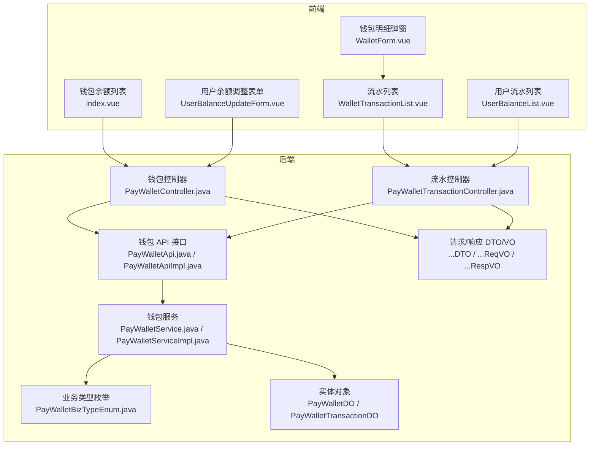
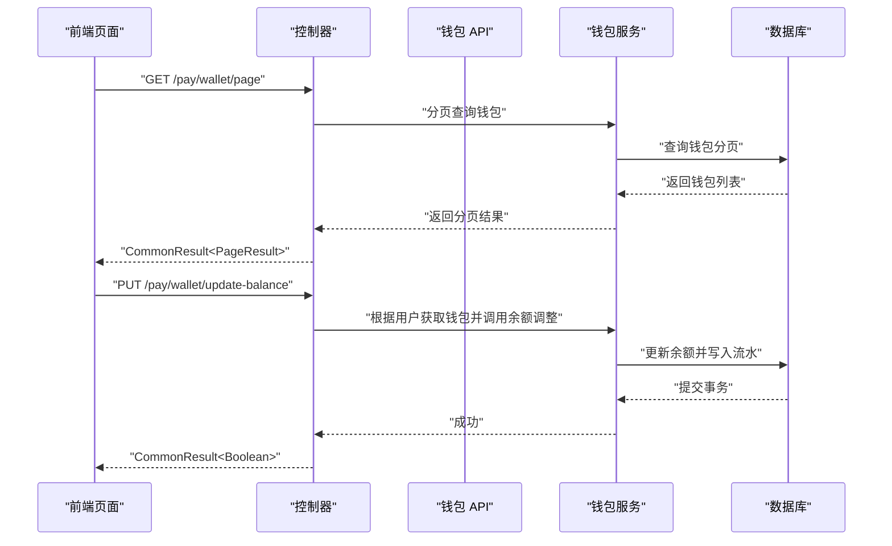
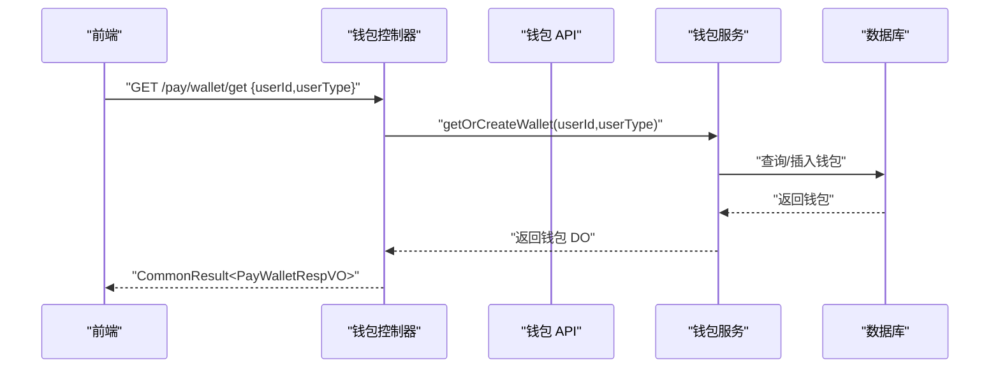
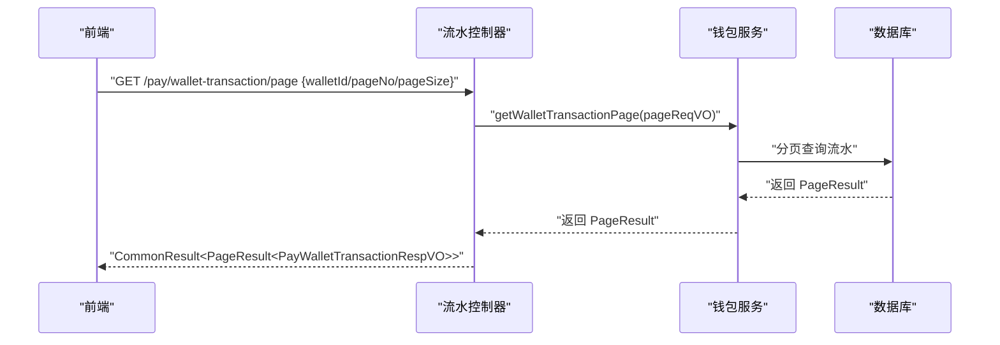
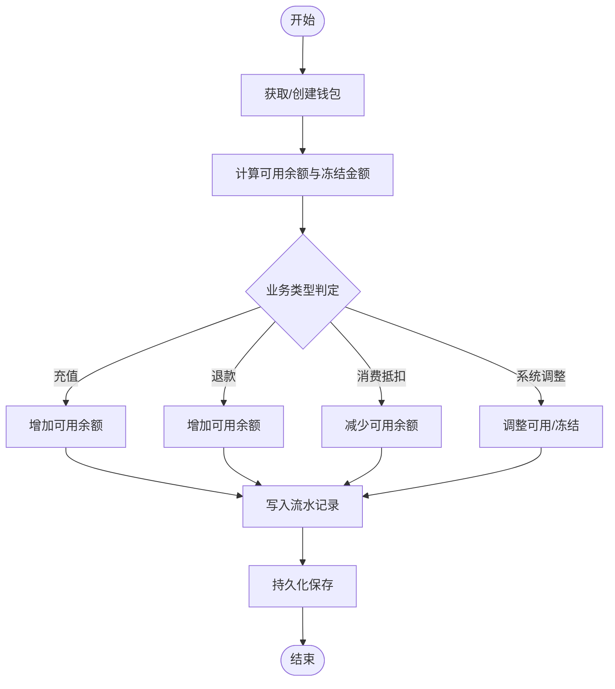
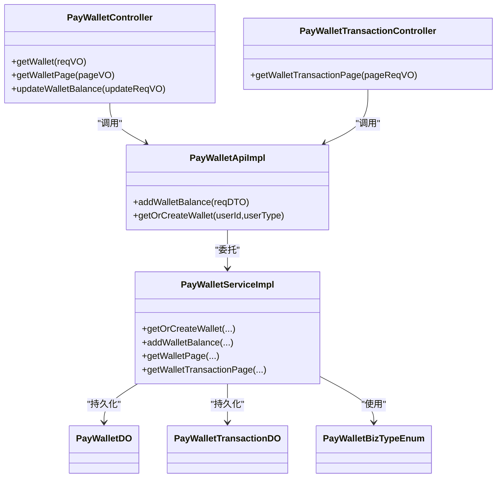
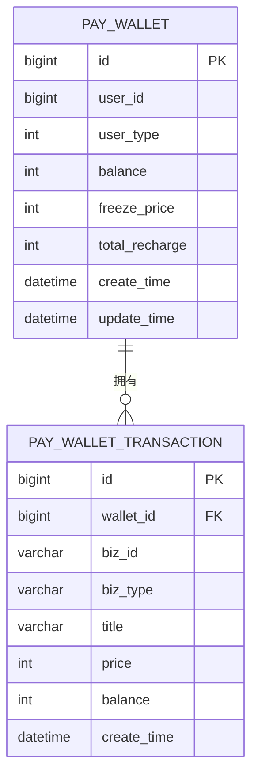

# 钱包余额管理

<cite>
**本文引用的文件**   
- [PayWalletApi.java](file://backend/yudao-module-pay/src/main/java/cn/iocoder/yudao/module/pay/api/wallet/PayWalletApi.java)
- [PayWalletApiImpl.java](file://backend/yudao-module-pay/src/main/java/cn/iocoder/yudao/module/pay/api/wallet/PayWalletApiImpl.java)
- [PayWalletController.java](file://backend/yudao-module-pay/src/main/java/cn/iocoder/yudao/module/pay/controller/admin/wallet/PayWalletController.java)
- [PayWalletTransactionController.java](file://backend/yudao-module-pay/src/main/java/cn/iocoder/yudao/module/pay/controller/admin/wallet/PayWalletTransactionController.java)
- [PayWalletService.java](file://backend/yudao-module-pay/src/main/java/cn/iocoder/yudao/module/pay/service/wallet/PayWalletService.java)
- [PayWalletServiceImpl.java](file://backend/yudao-module-pay/src/main/java/cn/iocoder/yudao/module/pay/service/wallet/PayWalletServiceImpl.java)
- [PayWalletDO.java](file://backend/yudao-module-pay/src/main/java/cn/iocoder/yudao/module/pay/dal/dataobject/wallet/PayWalletDO.java)
- [PayWalletTransactionDO.java](file://backend/yudao-module-pay/src/main/java/cn/iocoder/yudao/module/pay/dal/dataobject/wallet/PayWalletTransactionDO.java)
- [PayWalletBizTypeEnum.java](file://backend/yudao-module-pay/src/main/java/cn/iocoder/yudao/module/pay/enums/wallet/PayWalletBizTypeEnum.java)
- [PayWalletAddBalanceReqDTO.java](file://backend/yudao-module-pay/src/main/java/cn/iocoder/yudao/module/pay/api/wallet/dto/PayWalletAddBalanceReqDTO.java)
- [PayWalletRespDTO.java](file://backend/yudao-module-pay/src/main/java/cn/iocoder/yudao/module/pay/api/wallet/dto/PayWalletRespDTO.java)
- [PayWalletPageReqVO.java](file://backend/yudao-module-pay/src/main/java/cn/iocoder/yudao/module/pay/controller/admin/wallet/vo/wallet/PayWalletPageReqVO.java)
- [PayWalletUpdateBalanceReqVO.java](file://backend/yudao-module-pay/src/main/java/cn/iocoder/yudao/module/pay/controller/admin/wallet/vo/wallet/PayWalletUpdateBalanceReqVO.java)
- [PayWalletUserReqVO.java](file://backend/yudao-module-pay/src/main/java/cn/iocoder/yudao/module/pay/controller/admin/wallet/vo/wallet/PayWalletUserReqVO.java)
- [PayWalletTransactionPageReqVO.java](file://backend/yudao-module-pay/src/main/java/cn/iocoder/yudao/module/pay/controller/admin/wallet/vo/transaction/PayWalletTransactionPageReqVO.java)
- [PayWalletTransactionRespVO.java](file://backend/yudao-module-pay/src/main/java/cn/iocoder/yudao/module/pay/controller/admin/wallet/vo/transaction/PayWalletTransactionRespVO.java)
- [PayWalletRespVO.java](file://backend/yudao-module-pay/src/main/java/cn/iocoder/yudao/module/pay/controller/admin/wallet/vo/wallet/PayWalletRespVO.java)
- [index.vue（钱包余额列表）](file://frontend/admin-vue3/src/views/pay/wallet/balance/index.vue)
- [WalletForm.vue（钱包余额明细弹窗）](file://frontend/admin-vue3/src/views/pay/wallet/balance/WalletForm.vue)
- [WalletTransactionList.vue（钱包流水列表）](file://frontend/admin-vue3/src/views/pay/wallet/transaction/WalletTransactionList.vue)
- [UserBalanceList.vue（用户余额流水列表）](file://frontend/admin-vue3/src/views/member/user/detail/UserBalanceList.vue)
- [UserBalanceUpdateForm.vue（用户余额调整表单）](file://frontend/admin-vue3/src/views/member/user/components/UserBalanceUpdateForm.vue)
</cite>

## 目录
1. [简介](#简介)
2. [项目结构](#项目结构)
3. [核心组件](#核心组件)
4. [架构总览](#架构总览)
5. [详细组件分析](#详细组件分析)
6. [依赖关系分析](#依赖关系分析)
7. [性能考量](#性能考量)
8. [故障排查指南](#故障排查指南)
9. [结论](#结论)
10. [附录](#附录)

## 简介
本文件面向开发者，系统性阐述钱包余额管理功能的架构与实现，覆盖钱包账户创建、余额查询、余额变更记录、冻结余额处理、余额变动通知、账户状态管理、对账机制与异常处理策略，并提供完整的余额管理流程图、数据模型设计、API 接口规范与安全控制措施，帮助快速理解并高效扩展。

## 项目结构
钱包余额管理由“前端页面 + 后端接口 + 服务层 + 数据访问层 + 枚举与 DTO/VO”组成，前后端通过 REST API 交互，数据持久化在数据库中。

图表来源
- [PayWalletController.java:37-68](file://backend/yudao-module-pay/src/main/java/cn/iocoder/yudao/module/pay/controller/admin/wallet/PayWalletController.java#L37-L68)
- [PayWalletTransactionController.java:34-41](file://backend/yudao-module-pay/src/main/java/cn/iocoder/yudao/module/pay/controller/admin/wallet/PayWalletTransactionController.java#L34-L41)
- [PayWalletApi.java:11-29](file://backend/yudao-module-pay/src/main/java/cn/iocoder/yudao/module/pay/api/wallet/PayWalletApi.java#L11-L29)
- [PayWalletApiImpl.java:24-39](file://backend/yudao-module-pay/src/main/java/cn/iocoder/yudao/module/pay/api/wallet/PayWalletApiImpl.java#L24-L39)
- [PayWalletService.java](file://backend/yudao-module-pay/src/main/java/cn/iocoder/yudao/module/pay/service/wallet/PayWalletService.java)
- [PayWalletServiceImpl.java](file://backend/yudao-module-pay/src/main/java/cn/iocoder/yudao/module/pay/service/wallet/PayWalletServiceImpl.java)
- [PayWalletDO.java](file://backend/yudao-module-pay/src/main/java/cn/iocoder/yudao/module/pay/dal/dataobject/wallet/PayWalletDO.java)
- [PayWalletTransactionDO.java](file://backend/yudao-module-pay/src/main/java/cn/iocoder/yudao/module/pay/dal/dataobject/wallet/PayWalletTransactionDO.java)
- [PayWalletBizTypeEnum.java](file://backend/yudao-module-pay/src/main/java/cn/iocoder/yudao/module/pay/enums/wallet/PayWalletBizTypeEnum.java)

章节来源
- [PayWalletController.java:37-68](file://backend/yudao-module-pay/src/main/java/cn/iocoder/yudao/module/pay/controller/admin/wallet/PayWalletController.java#L37-L68)
- [PayWalletTransactionController.java:34-41](file://backend/yudao-module-pay/src/main/java/cn/iocoder/yudao/module/pay/controller/admin/wallet/PayWalletTransactionController.java#L34-L41)
- [index.vue（钱包余额列表）:101-156](file://frontend/admin-vue3/src/views/pay/wallet/balance/index.vue#L101-L156)
- [WalletForm.vue（钱包余额明细弹窗）:1-22](file://frontend/admin-vue3/src/views/pay/wallet/balance/WalletForm.vue#L1-L22)
- [WalletTransactionList.vue（钱包流水列表）:31-79](file://frontend/admin-vue3/src/views/pay/wallet/transaction/WalletTransactionList.vue#L31-L79)
- [UserBalanceList.vue（用户余额流水列表）:30-67](file://frontend/admin-vue3/src/views/member/user/detail/UserBalanceList.vue#L30-L67)
- [UserBalanceUpdateForm.vue（用户余额调整表单）:44-116](file://frontend/admin-vue3/src/views/member/user/components/UserBalanceUpdateForm.vue#L44-L116)

## 核心组件
- 钱包 API 层：对外暴露钱包余额增减与查询能力，封装业务类型与钱包实体转换。
- 控制器层：提供 REST 接口，负责鉴权、参数校验与结果返回。
- 服务层：实现余额计算、冻结处理、流水生成与对账逻辑。
- 数据访问层：持久化钱包与流水记录，提供分页查询与统计。
- 前端页面：提供钱包余额列表、明细弹窗、流水列表、用户余额调整等界面。

章节来源
- [PayWalletApi.java:11-29](file://backend/yudao-module-pay/src/main/java/cn/iocoder/yudao/module/pay/api/wallet/PayWalletApi.java#L11-L29)
- [PayWalletApiImpl.java:24-39](file://backend/yudao-module-pay/src/main/java/cn/iocoder/yudao/module/pay/api/wallet/PayWalletApiImpl.java#L24-L39)
- [PayWalletController.java:37-68](file://backend/yudao-module-pay/src/main/java/cn/iocoder/yudao/module/pay/controller/admin/wallet/PayWalletController.java#L37-L68)
- [PayWalletTransactionController.java:34-41](file://backend/yudao-module-pay/src/main/java/cn/iocoder/yudao/module/pay/controller/admin/wallet/PayWalletTransactionController.java#L34-L41)
- [PayWalletService.java](file://backend/yudao-module-pay/src/main/java/cn/iocoder/yudao/module/pay/service/wallet/PayWalletService.java)
- [PayWalletServiceImpl.java](file://backend/yudao-module-pay/src/main/java/cn/iocoder/yudao/module/pay/service/wallet/PayWalletServiceImpl.java)
- [PayWalletDO.java](file://backend/yudao-module-pay/src/main/java/cn/iocoder/yudao/module/pay/dal/dataobject/wallet/PayWalletDO.java)
- [PayWalletTransactionDO.java](file://backend/yudao-module-pay/src/main/java/cn/iocoder/yudao/module/pay/dal/dataobject/wallet/PayWalletTransactionDO.java)

## 架构总览
钱包余额管理采用经典的分层架构：前端通过 HTTP 请求调用后端控制器，控制器委托服务层执行业务逻辑，服务层与数据访问层交互完成持久化与计算。

图表来源
- [PayWalletController.java:45-68](file://backend/yudao-module-pay/src/main/java/cn/iocoder/yudao/module/pay/controller/admin/wallet/PayWalletController.java#L45-L68)
- [PayWalletApiImpl.java:24-39](file://backend/yudao-module-pay/src/main/java/cn/iocoder/yudao/module/pay/api/wallet/PayWalletApiImpl.java#L24-L39)
- [PayWalletServiceImpl.java](file://backend/yudao-module-pay/src/main/java/cn/iocoder/yudao/module/pay/service/wallet/PayWalletServiceImpl.java)

## 详细组件分析

### 钱包账户创建与查询
- 创建/查询逻辑：通过用户标识获取或创建钱包，若不存在则初始化默认字段。
- 前端入口：钱包余额列表页支持按用户/类型筛选，点击“详情”打开明细弹窗。
- 关键路径：
  - 前端：钱包列表页发起分页请求，明细弹窗加载对应钱包的流水列表。
  - 后端：控制器接收请求，调用服务层获取钱包并返回 VO 结果。

图表来源
- [PayWalletController.java:37-43](file://backend/yudao-module-pay/src/main/java/cn/iocoder/yudao/module/pay/controller/admin/wallet/PayWalletController.java#L37-L43)
- [PayWalletApiImpl.java:35-39](file://backend/yudao-module-pay/src/main/java/cn/iocoder/yudao/module/pay/api/wallet/PayWalletApiImpl.java#L35-L39)
- [PayWalletServiceImpl.java](file://backend/yudao-module-pay/src/main/java/cn/iocoder/yudao/module/pay/service/wallet/PayWalletServiceImpl.java)

章节来源
- [PayWalletController.java:37-43](file://backend/yudao-module-pay/src/main/java/cn/iocoder/yudao/module/pay/controller/admin/wallet/PayWalletController.java#L37-L43)
- [PayWalletApiImpl.java:35-39](file://backend/yudao-module-pay/src/main/java/cn/iocoder/yudao/module/pay/api/wallet/PayWalletApiImpl.java#L35-L39)
- [index.vue（钱包余额列表）:101-156](file://frontend/admin-vue3/src/views/pay/wallet/balance/index.vue#L101-L156)
- [WalletForm.vue（钱包余额明细弹窗）:1-22](file://frontend/admin-vue3/src/views/pay/wallet/balance/WalletForm.vue#L1-L22)

### 余额查询与变更记录
- 余额查询：支持按用户 ID 查询钱包余额与可用余额、冻结金额等。
- 流水查询：提供分页查询钱包流水，包含交易金额、余额快照、业务标题与时间。
- 前端实现：
  - 钱包余额列表页：分页查询钱包，展示冻结金额等字段。
  - 明细弹窗：内嵌流水列表，支持按钱包 ID 或用户 ID 自动解析钱包。
  - 用户详情页：展示该用户的余额流水列表。

图表来源
- [PayWalletTransactionController.java:34-41](file://backend/yudao-module-pay/src/main/java/cn/iocoder/yudao/module/pay/controller/admin/wallet/PayWalletTransactionController.java#L34-L41)
- [PayWalletServiceImpl.java](file://backend/yudao-module-pay/src/main/java/cn/iocoder/yudao/module/pay/service/wallet/PayWalletServiceImpl.java)

章节来源
- [PayWalletTransactionController.java:34-41](file://backend/yudao-module-pay/src/main/java/cn/iocoder/yudao/module/pay/controller/admin/wallet/PayWalletTransactionController.java#L34-L41)
- [WalletTransactionList.vue（钱包流水列表）:31-79](file://frontend/admin-vue3/src/views/pay/wallet/transaction/WalletTransactionList.vue#L31-L79)
- [UserBalanceList.vue（用户余额流水列表）:30-67](file://frontend/admin-vue3/src/views/member/user/detail/UserBalanceList.vue#L30-L67)

### 余额变更与冻结处理
- 余额变更：管理员可通过“用户余额调整表单”对用户余额进行增加/减少，前端校验变动金额与最终余额不得为负。
- 冻结处理：钱包实体包含冻结金额字段，服务层在余额调整时需区分可用与冻结，保证余额与冻结金额的正确性。
- 业务类型：通过业务类型枚举区分充值、退款、消费抵扣、系统调整等场景，便于对账与审计。

图表来源
- [PayWalletBizTypeEnum.java](file://backend/yudao-module-pay/src/main/java/cn/iocoder/yudao/module/pay/enums/wallet/PayWalletBizTypeEnum.java)
- [PayWalletServiceImpl.java](file://backend/yudao-module-pay/src/main/java/cn/iocoder/yudao/module/pay/service/wallet/PayWalletServiceImpl.java)

章节来源
- [UserBalanceUpdateForm.vue（用户余额调整表单）:44-116](file://frontend/admin-vue3/src/views/member/user/components/UserBalanceUpdateForm.vue#L44-L116)
- [PayWalletController.java:53-68](file://backend/yudao-module-pay/src/main/java/cn/iocoder/yudao/module/pay/controller/admin/wallet/PayWalletController.java#L53-L68)
- [PayWalletServiceImpl.java](file://backend/yudao-module-pay/src/main/java/cn/iocoder/yudao/module/pay/service/wallet/PayWalletServiceImpl.java)

### 余额对账机制与通知
- 对账机制：基于流水记录与钱包余额快照进行对账，支持按时间范围、业务类型、钱包 ID 进行核对。
- 通知策略：余额发生重大变化（如冻结到期、大额充值/支出）时触发通知，前端可结合消息中心或站内信展示。

章节来源
- [PayWalletTransactionDO.java](file://backend/yudao-module-pay/src/main/java/cn/iocoder/yudao/module/pay/dal/dataobject/wallet/PayWalletTransactionDO.java)
- [PayWalletDO.java](file://backend/yudao-module-pay/src/main/java/cn/iocoder/yudao/module/pay/dal/dataobject/wallet/PayWalletDO.java)

## 依赖关系分析
- 控制器依赖服务层，服务层依赖数据对象与业务枚举。
- 前端页面依赖控制器提供的接口，通过 VO/DTO 解析数据。
- 权限控制：控制器使用注解进行权限校验，确保仅授权用户可查询与调整余额。

图表来源
- [PayWalletController.java:37-68](file://backend/yudao-module-pay/src/main/java/cn/iocoder/yudao/module/pay/controller/admin/wallet/PayWalletController.java#L37-L68)
- [PayWalletTransactionController.java:34-41](file://backend/yudao-module-pay/src/main/java/cn/iocoder/yudao/module/pay/controller/admin/wallet/PayWalletTransactionController.java#L34-L41)
- [PayWalletApiImpl.java:24-39](file://backend/yudao-module-pay/src/main/java/cn/iocoder/yudao/module/pay/api/wallet/PayWalletApiImpl.java#L24-L39)
- [PayWalletServiceImpl.java](file://backend/yudao-module-pay/src/main/java/cn/iocoder/yudao/module/pay/service/wallet/PayWalletServiceImpl.java)
- [PayWalletDO.java](file://backend/yudao-module-pay/src/main/java/cn/iocoder/yudao/module/pay/dal/dataobject/wallet/PayWalletDO.java)
- [PayWalletTransactionDO.java](file://backend/yudao-module-pay/src/main/java/cn/iocoder/yudao/module/pay/dal/dataobject/wallet/PayWalletTransactionDO.java)
- [PayWalletBizTypeEnum.java](file://backend/yudao-module-pay/src/main/java/cn/iocoder/yudao/module/pay/enums/wallet/PayWalletBizTypeEnum.java)

## 性能考量
- 分页查询：钱包与流水均采用分页接口，避免一次性加载大量数据。
- 字段单位：前端以“分”为最小单位传参/显示，服务层统一换算，降低浮点误差。
- 缓存策略：对热点钱包信息可引入缓存，减少数据库压力。
- 并发控制：余额调整需使用乐观锁或分布式锁，防止超卖或重复计费。

## 故障排查指南
- 钱包不存在：当尝试更新余额但钱包未创建时，会抛出“钱包不存在”的错误，需先创建钱包再调整余额。
- 余额不足：调整后余额小于 0 时拒绝提交，前端提示“变动后的余额不能小于 0”。
- 权限不足：无权限访问相关接口时，返回鉴权失败，请确认角色与权限配置。

章节来源
- [PayWalletController.java:58-62](file://backend/yudao-module-pay/src/main/java/cn/iocoder/yudao/module/pay/controller/admin/wallet/PayWalletController.java#L58-L62)
- [UserBalanceUpdateForm.vue（用户余额调整表单）:99-106](file://frontend/admin-vue3/src/views/member/user/components/UserBalanceUpdateForm.vue#L99-L106)

## 结论
钱包余额管理通过清晰的分层设计与严格的业务约束，实现了从账户创建、余额查询到流水记录与冻结处理的完整闭环。配合完善的前端页面与权限控制，既满足运营需求，又保障了系统的稳定性与可维护性。

## 附录

### 数据模型设计

图表来源
- [PayWalletDO.java](file://backend/yudao-module-pay/src/main/java/cn/iocoder/yudao/module/pay/dal/dataobject/wallet/PayWalletDO.java)
- [PayWalletTransactionDO.java](file://backend/yudao-module-pay/src/main/java/cn/iocoder/yudao/module/pay/dal/dataobject/wallet/PayWalletTransactionDO.java)

### API 接口规范
- 获取钱包详情
  - 方法：GET
  - 路径：/pay/wallet/get
  - 权限：pay:wallet:query
  - 请求：PayWalletUserReqVO
  - 返回：CommonResult<PayWalletRespVO>

- 钱包分页查询
  - 方法：GET
  - 路径：/pay/wallet/page
  - 权限：pay:wallet:query
  - 请求：PayWalletPageReqVO
  - 返回：CommonResult<PageResult<PayWalletRespVO>>

- 更新用户余额
  - 方法：PUT
  - 路径：/pay/wallet/update-balance
  - 权限：pay:wallet:update-balance
  - 请求：PayWalletUpdateBalanceReqVO
  - 返回：CommonResult<Boolean>

- 钱包流水分页查询
  - 方法：GET
  - 路径：/pay/wallet-transaction/page
  - 权限：pay:wallet:query
  - 请求：PayWalletTransactionPageReqVO
  - 返回：CommonResult<PageResult<PayWalletTransactionRespVO>>

章节来源
- [PayWalletController.java:37-68](file://backend/yudao-module-pay/src/main/java/cn/iocoder/yudao/module/pay/controller/admin/wallet/PayWalletController.java#L37-L68)
- [PayWalletTransactionController.java:34-41](file://backend/yudao-module-pay/src/main/java/cn/iocoder/yudao/module/pay/controller/admin/wallet/PayWalletTransactionController.java#L34-L41)
- [PayWalletUserReqVO.java](file://backend/yudao-module-pay/src/main/java/cn/iocoder/yudao/module/pay/controller/admin/wallet/vo/wallet/PayWalletUserReqVO.java)
- [PayWalletPageReqVO.java](file://backend/yudao-module-pay/src/main/java/cn/iocoder/yudao/module/pay/controller/admin/wallet/vo/wallet/PayWalletPageReqVO.java)
- [PayWalletUpdateBalanceReqVO.java](file://backend/yudao-module-pay/src/main/java/cn/iocoder/yudao/module/pay/controller/admin/wallet/vo/wallet/PayWalletUpdateBalanceReqVO.java)
- [PayWalletTransactionPageReqVO.java](file://backend/yudao-module-pay/src/main/java/cn/iocoder/yudao/module/pay/controller/admin/wallet/vo/transaction/PayWalletTransactionPageReqVO.java)

### 安全控制措施
- 权限注解：@PreAuthorize 校验用户权限，防止越权访问。
- 参数校验：使用 @Valid 对请求参数进行校验，避免非法输入。
- 业务校验：余额调整前进行余额下限校验，防止透支。

章节来源
- [PayWalletController.java:37-68](file://backend/yudao-module-pay/src/main/java/cn/iocoder/yudao/module/pay/controller/admin/wallet/PayWalletController.java#L37-L68)
- [PayWalletTransactionController.java:34-41](file://backend/yudao-module-pay/src/main/java/cn/iocoder/yudao/module/pay/controller/admin/wallet/PayWalletTransactionController.java#L34-L41)
- [UserBalanceUpdateForm.vue（用户余额调整表单）:99-106](file://frontend/admin-vue3/src/views/member/user/components/UserBalanceUpdateForm.vue#L99-L106)