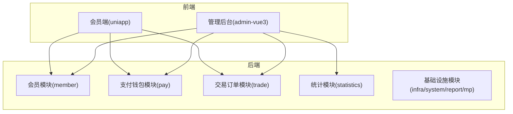
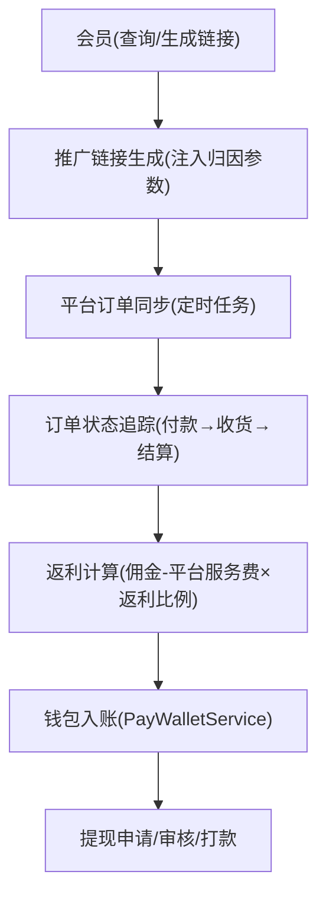
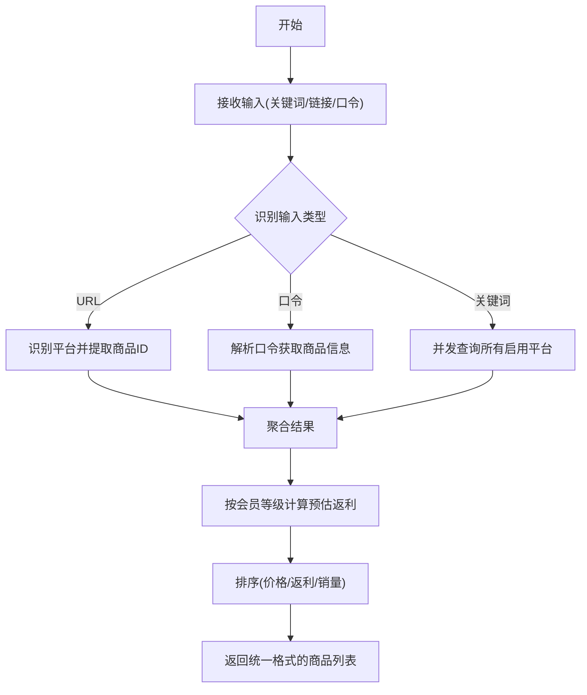
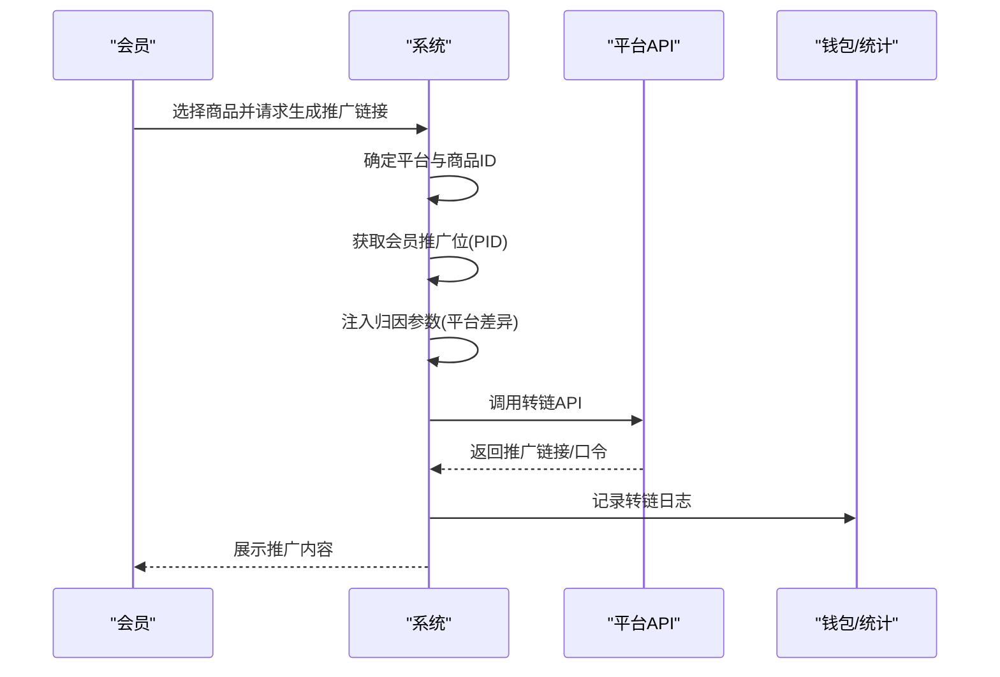
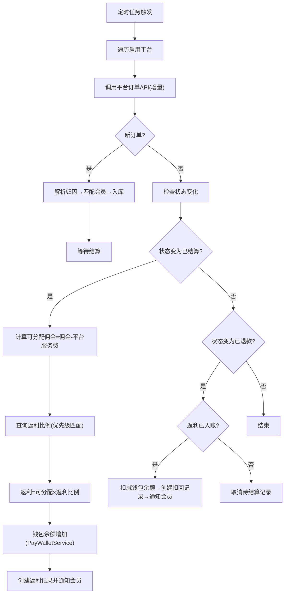
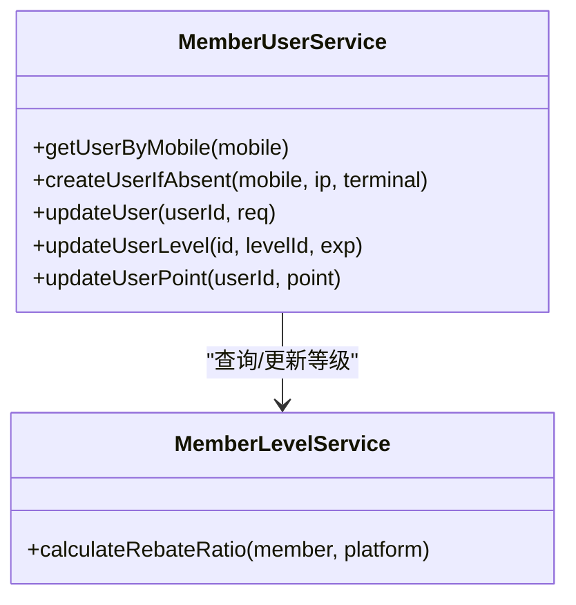
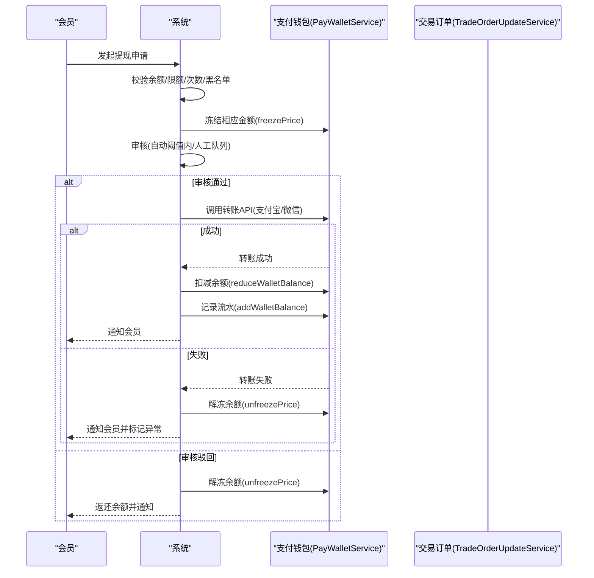
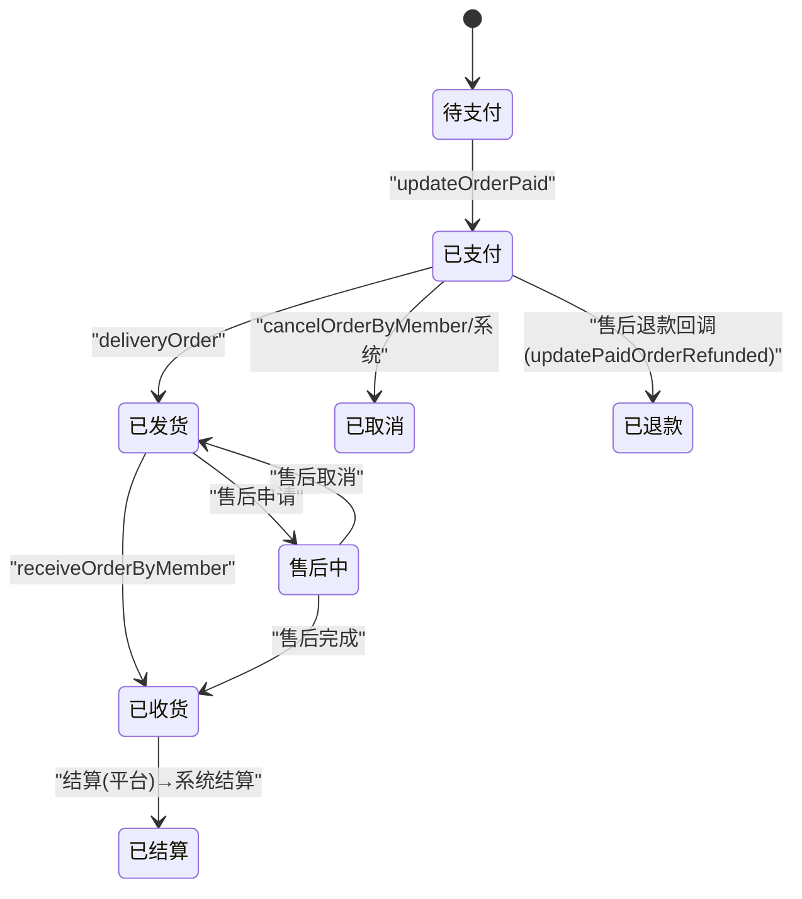
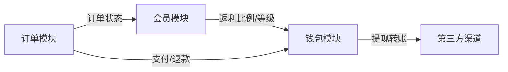

# 核心业务模块

<cite>
**本文引用的文件**
- [CPS系统PRD文档.md](file://docs/CPS系统PRD文档.md)
- [MemberUserService.java](file://backend/yudao-module-member/src/main/java/cn/iocoder/yudao/module/member/service/user/MemberUserService.java)
- [PayWalletService.java](file://backend/yudao-module-pay/src/main/java/cn/iocoder/yudao/module/pay/service/wallet/PayWalletService.java)
- [TradeOrderUpdateService.java](file://backend/yudao-module-mall/yudao-module-trade/src/main/java/cn/iocoder/yudao/module/trade/service/order/TradeOrderUpdateService.java)
</cite>

## 目录
1. [引言](#引言)
2. [项目结构](#项目结构)
3. [核心组件](#核心组件)
4. [架构总览](#架构总览)
5. [详细组件分析](#详细组件分析)
6. [依赖分析](#依赖分析)
7. [性能考虑](#性能考虑)
8. [故障排查指南](#故障排查指南)
9. [结论](#结论)
10. [附录](#附录)

## 引言
本文件面向 AgenticCPS 核心业务模块，围绕 CPS 联盟返利系统、会员管理系统、支付钱包系统展开，结合 PRD 文档中的业务流程与功能设计，系统性梳理模块间的关系、数据流转与接口交互，覆盖商品搜索与比价、推广链接生成、订单同步与结算、返利计算与入账、会员等级体系、钱包余额管理、提现流程等关键场景，并提供流程图、数据模型与 API 说明，帮助开发者快速理解并落地实现。

## 项目结构
AgenticCPS 采用前后端分离与多模块分层架构：
- 后端基于 yudao 框架，按领域拆分为 member（会员）、pay（支付钱包）、trade（交易订单）、statistics（统计）、mp（公众号）等模块
- 前端包含管理后台（admin-vue3）、会员端（admin-uniapp、mall-uniapp）等
- 文档侧提供完整的 PRD，定义了业务流程、功能清单与规则

**章节来源**
- [CPS系统PRD文档.md: 80-120:80-120](file://docs/CPS系统PRD文档.md#L80-L120)

## 核心组件
- 会员模块（Member）
  - 职责：用户注册/登录、个人信息维护、等级与经验管理、标签与分组管理
  - 关键接口：用户查询、创建、更新、等级变更、积分更新等
- 支付钱包模块（Pay）
  - 职责：钱包余额管理、交易流水、冻结/解冻、订单支付/退款、提现转账
  - 关键接口：获取/创建钱包、增减余额、冻结/解冻、订单支付/退款
- 交易订单模块（Trade）
  - 职责：订单创建、支付状态同步、发货/收货、价格/地址调整、售后联动
  - 关键接口：结算、创建、支付状态同步、发货、收货、取消/删除、备注/价格/地址调整、售后状态联动

**章节来源**
- [MemberUserService.java: 20-191:20-191](file://backend/yudao-module-member/src/main/java/cn/iocoder/yudao/module/member/service/user/MemberUserService.java#L20-L191)
- [PayWalletService.java: 14-100:14-100](file://backend/yudao-module-pay/src/main/java/cn/iocoder/yudao/module/pay/service/wallet/PayWalletService.java#L14-L100)
- [TradeOrderUpdateService.java: 22-230:22-230](file://backend/yudao-module-mall/yudao-module-trade/src/main/java/cn/iocoder/yudao/module/trade/service/order/TradeOrderUpdateService.java#L22-L230)

## 架构总览
整体业务闭环围绕“商品搜索/比价 -> 推广链接生成 -> 订单同步与结算 -> 返利入账 -> 提现”展开，会员、钱包、订单三大模块协同工作，配合定时任务与平台 API，完成从下单到返利到账的全链路。

**图示来源**
- [CPS系统PRD文档.md: 183-223:183-223](file://docs/CPS系统PRD文档.md#L183-L223)
- [PayWalletService.java: 78-81:78-81](file://backend/yudao-module-pay/src/main/java/cn/iocoder/yudao/module/pay/service/wallet/PayWalletService.java#L78-L81)

**章节来源**
- [CPS系统PRD文档.md: 82-119:82-119](file://docs/CPS系统PRD文档.md#L82-L119)

## 详细组件分析

### 1) 商品搜索与比价
- 功能要点
  - 输入类型识别：URL/口令/关键词
  - 单平台直查与多平台并发比价
  - 预估返利展示与排序（价格/返利/销量）
- 业务规则
  - 未登录：返利金额显示“登录查看返利”
  - 全部平台超时：展示已返回平台结果，其余显示“暂时无法查询”
  - 无结果：提示“未找到相关商品，请换个关键词试试”

**图示来源**
- [CPS系统PRD文档.md: 121-150:121-150](file://docs/CPS系统PRD文档.md#L121-L150)

**章节来源**
- [CPS系统PRD文档.md: 378-416:378-416](file://docs/CPS系统PRD文档.md#L378-L416)

### 2) 推广链接生成
- 功能要点
  - 依据平台与商品ID，获取会员推广位（PID）
  - 注入归因参数（淘宝/京东/拼多多差异化）
  - 调用平台转链 API，返回推广链接与口令（如适用）
- 业务规则
  - 会员专属 PID 优先于平台默认 PID
  - 归因参数需满足各平台要求

**图示来源**
- [CPS系统PRD文档.md: 152-181:152-181](file://docs/CPS系统PRD文档.md#L152-L181)

**章节来源**
- [CPS系统PRD文档.md: 449-480:449-480](file://docs/CPS系统PRD文档.md#L449-L480)

### 3) 订单同步与结算
- 功能要点
  - 定时任务（每5分钟）增量拉取各平台订单
  - 新订单解析归因参数匹配会员；已有订单检查状态变化
  - “已结算”触发返利结算：计算可分配佣金、查询返利比例、入账钱包
  - “已退款”触发返利扣回：已入账则扣减余额，未入账则取消待结算
- 返利比例优先级
  - 个人专属配置（平台/全平台）> 等级+平台 > 等级 > 平台 > 全局

**图示来源**
- [CPS系统PRD文档.md: 183-223:183-223](file://docs/CPS系统PRD文档.md#L183-L223)
- [PayWalletService.java: 78-81:78-81](file://backend/yudao-module-pay/src/main/java/cn/iocoder/yudao/module/pay/service/wallet/PayWalletService.java#L78-L81)

**章节来源**
- [CPS系统PRD文档.md: 760-780:760-780](file://docs/CPS系统PRD文档.md#L760-L780)
- [CPS系统PRD文档.md: 611-618:611-618](file://docs/CPS系统PRD文档.md#L611-L618)

### 4) 会员等级体系
- 功能要点
  - 等级与经验管理：更新用户等级与经验
  - 等级返利配置：按平台与等级配置返利比例
  - 个人专属配置：对特定会员设置更高返利比例与上限
- 业务规则
  - 返利比例优先级：个人专属 > 等级+平台 > 等级 > 平台 > 全局
  - 未登录时，搜索/比价页不展示返利金额

**图示来源**
- [MemberUserService.java: 149-155:149-155](file://backend/yudao-module-member/src/main/java/cn/iocoder/yudao/module/member/service/user/MemberUserService.java#L149-L155)
- [CPS系统PRD文档.md: 592-618:592-618](file://docs/CPS系统PRD文档.md#L592-L618)

**章节来源**
- [MemberUserService.java: 149-155:149-155](file://backend/yudao-module-member/src/main/java/cn/iocoder/yudao/module/member/service/user/MemberUserService.java#L149-L155)
- [CPS系统PRD文档.md: 586-618:586-618](file://docs/CPS系统PRD文档.md#L586-L618)

### 5) 钱包余额管理与提现
- 功能要点
  - 钱包余额：可提现余额即时可用；待结算为预估返利
  - 交易流水：订单支付、退款、返利入账、提现冻结/解冻
  - 提现规则：最低金额、每日次数、单次上限、黑名单校验、自动/人工审核阈值
- 业务规则
  - 提现成功：扣减余额、记录流水、通知会员
  - 提现失败：返还余额、标记异常、通知会员

**图示来源**
- [PayWalletService.java: 68-97:68-97](file://backend/yudao-module-pay/src/main/java/cn/iocoder/yudao/module/pay/service/wallet/PayWalletService.java#L68-L97)
- [TradeOrderUpdateService.java: 42-50:42-50](file://backend/yudao-module-mall/yudao-module-trade/src/main/java/cn/iocoder/yudao/module/trade/service/order/TradeOrderUpdateService.java#L42-L50)
- [CPS系统PRD文档.md: 225-261:225-261](file://docs/CPS系统PRD文档.md#L225-L261)

**章节来源**
- [PayWalletService.java: 14-100:14-100](file://backend/yudao-module-pay/src/main/java/cn/iocoder/yudao/module/pay/service/wallet/PayWalletService.java#L14-L100)
- [CPS系统PRD文档.md: 512-551:512-551](file://docs/CPS系统PRD文档.md#L512-L551)

### 6) 订单生命周期与售后联动
- 功能要点
  - 订单创建、支付状态同步、发货、收货、取消/删除、备注/价格/地址调整
  - 售后状态联动：售后创建/完成/取消后更新订单项状态
- 业务规则
  - 支付状态同步可能与支付回调并发，需静默同步避免异常

**图示来源**
- [TradeOrderUpdateService.java: 42-98:42-98](file://backend/yudao-module-mall/yudao-module-trade/src/main/java/cn/iocoder/yudao/module/trade/service/order/TradeOrderUpdateService.java#L42-L98)
- [TradeOrderUpdateService.java: 154-175:154-175](file://backend/yudao-module-mall/yudao-module-trade/src/main/java/cn/iocoder/yudao/module/trade/service/order/TradeOrderUpdateService.java#L154-L175)

**章节来源**
- [TradeOrderUpdateService.java: 22-230:22-230](file://backend/yudao-module-mall/yudao-module-trade/src/main/java/cn/iocoder/yudao/module/trade/service/order/TradeOrderUpdateService.java#L22-L230)

## 依赖分析
- 模块耦合
  - 会员模块与钱包模块：返利入账依赖钱包余额与流水
  - 订单模块与钱包模块：支付/退款与钱包交易一致
  - 订单模块与会员模块：订单状态影响会员等级/经验（间接）
- 外部依赖
  - 各平台 CPS API（转链、订单查询、结算）
  - 第三方转账渠道（支付宝/微信）

[此图为概念性依赖示意，无需图示来源]

## 性能考虑
- 搜索与比价
  - 多平台并发查询需设置超时与熔断，避免阻塞主流程
  - 结果聚合与排序应分页/懒加载，减少首屏压力
- 订单同步
  - 增量拉取与幂等处理，避免重复入账
  - 定时任务批量化处理，降低数据库压力
- 钱包与提现
  - 冻结/解冻与余额增减需事务一致性
  - 提现阈值与风控策略需可配置，支持热更新

[本节为通用指导，无需章节来源]

## 故障排查指南
- 订单未入账
  - 检查定时任务是否正常执行、平台订单是否成功返回
  - 核对归因参数是否正确、会员是否匹配
- 返利比例异常
  - 校验个人专属配置优先级是否生效
  - 确认等级+平台/等级/平台/全局配置是否正确
- 提现失败
  - 核对余额、限额、次数、黑名单
  - 检查转账接口返回与异常处理
- 支付状态不同步
  - 关注静默同步逻辑，避免与回调并发冲突

**章节来源**
- [CPS系统PRD文档.md: 225-261:225-261](file://docs/CPS系统PRD文档.md#L225-L261)
- [TradeOrderUpdateService.java: 53-61:53-61](file://backend/yudao-module-mall/yudao-module-trade/src/main/java/cn/iocoder/yudao/module/trade/service/order/TradeOrderUpdateService.java#L53-L61)

## 结论
AgenticCPS 通过会员、钱包、订单三大核心模块的协同，构建了从商品搜索/比价到返利入账/提现的完整闭环。PRD 文档明确了业务流程与规则，接口设计强调幂等与一致性，建议在实现中重点保障定时任务的稳定性、归因匹配的准确性、钱包交易的原子性与可审计性，以提升用户体验与平台可靠性。

## 附录
- API 设计建议（基于现有接口能力）
  - 会员相关
    - 获取/创建钱包：getOrCreateWallet
    - 增加/扣减余额：addWalletBalance/reduceWalletBalance
    - 冻结/解冻：freezePrice/unfreezePrice
  - 订单相关
    - 创建订单：createOrder
    - 支付状态同步：syncOrderPayStatusQuietly
    - 发货/收货：deliveryOrder/receiveOrderByMember
    - 售后联动：updateOrderItemWhenAfterSale*
  - 钱包相关
    - 订单支付：orderPay
    - 订单退款：orderRefund
    - 余额查询：getWallet

**章节来源**
- [PayWalletService.java: 24-97:24-97](file://backend/yudao-module-pay/src/main/java/cn/iocoder/yudao/module/pay/service/wallet/PayWalletService.java#L24-L97)
- [TradeOrderUpdateService.java: 42-175:42-175](file://backend/yudao-module-mall/yudao-module-trade/src/main/java/cn/iocoder/yudao/module/trade/service/order/TradeOrderUpdateService.java#L42-L175)