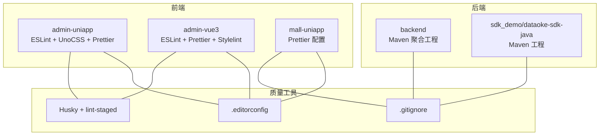
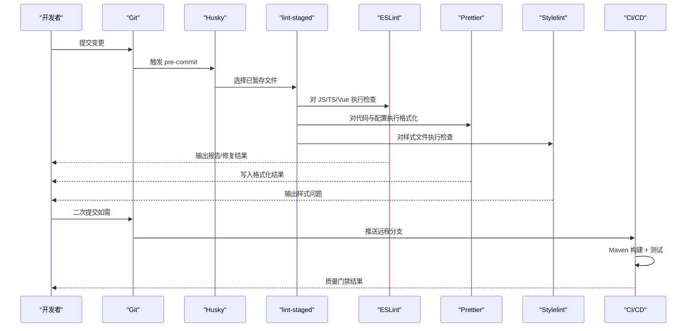
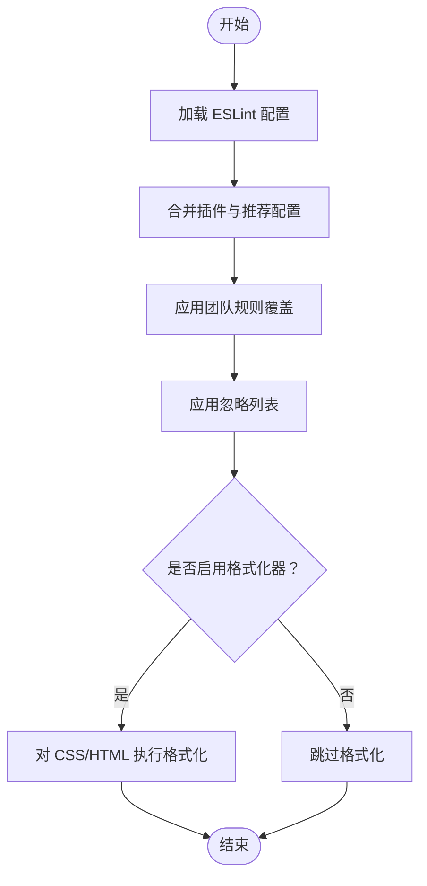
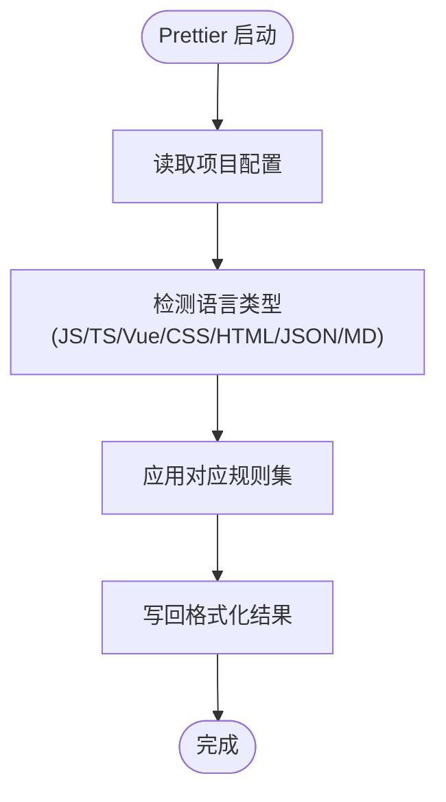
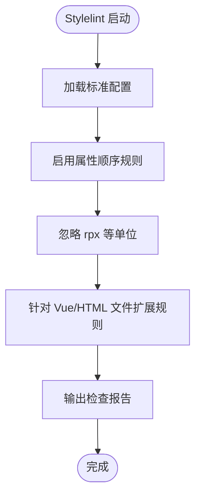
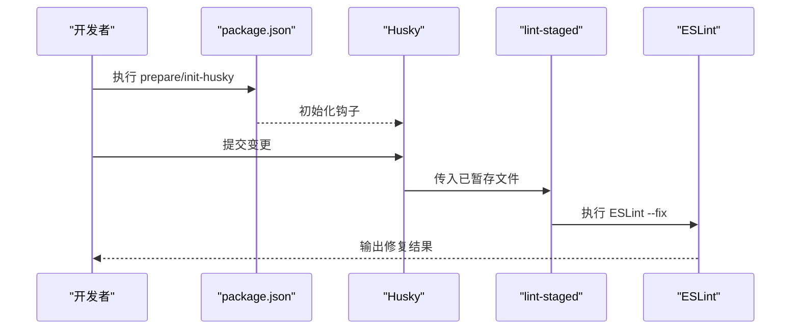
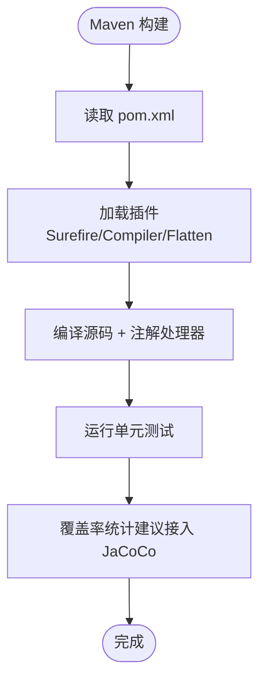
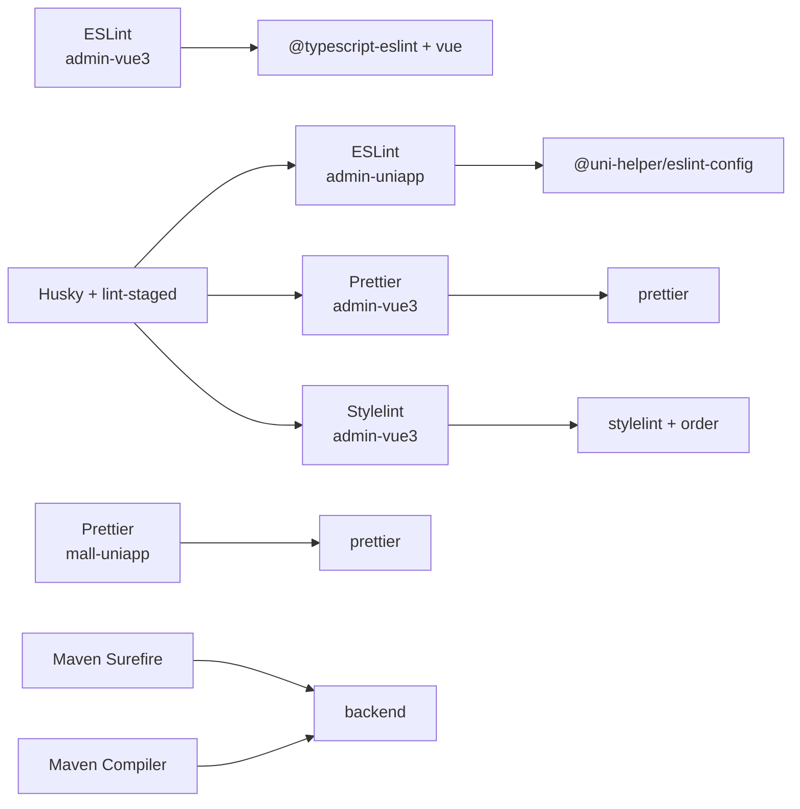

# 代码质量保障

<cite>
**本文引用的文件**
- [frontend/admin-uniapp/eslint.config.mjs](file://frontend/admin-uniapp/eslint.config.mjs)
- [frontend/admin-uniapp/package.json](file://frontend/admin-uniapp/package.json)
- [frontend/admin-uniapp/.editorconfig](file://frontend/admin-uniapp/.editorconfig)
- [frontend/admin-vue3/.eslintrc.js](file://frontend/admin-vue3/.eslintrc.js)
- [frontend/admin-vue3/prettier.config.js](file://frontend/admin-vue3/prettier.config.js)
- [frontend/admin-vue3/stylelint.config.js](file://frontend/admin-vue3/stylelint.config.js)
- [frontend/admin-vue3/.stylelintignore](file://frontend/admin-vue3/.stylelintignore)
- [frontend/admin-vue3/package.json](file://frontend/admin-vue3/package.json)
- [frontend/mall-uniapp/.prettierrc](file://frontend/mall-uniapp/.prettierrc)
- [frontend/mall-uniapp/.gitignore](file://frontend/mall-uniapp/.gitignore)
- [backend/pom.xml](file://backend/pom.xml)
- [agent_improvement/sdk_demo/dataoke-sdk-java/pom.xml](file://agent_improvement/sdk_demo/dataoke-sdk-java/pom.xml)
- [backend/.gitignore](file://backend/.gitignore)
- [frontend/admin-uniapp/.husky/_/husky](file://frontend/admin-uniapp/.husky/_/husky)
</cite>

## 目录
1. [简介](#简介)
2. [项目结构](#项目结构)
3. [核心组件](#核心组件)
4. [架构总览](#架构总览)
5. [详细组件分析](#详细组件分析)
6. [依赖分析](#依赖分析)
7. [性能考虑](#性能考虑)
8. [故障排查指南](#故障排查指南)
9. [结论](#结论)
10. [附录](#附录)

## 简介
本文件系统性梳理 AgenticCPS 项目的代码质量保障体系，覆盖前端（UniApp/Vue3）、后端（Java/Spring Boot）与跨端统一标准。内容包括：代码规范检查（ESLint/StyleLint/Prettier）、静态代码分析、代码审查流程、持续集成配置、Git Hooks 与 Pre-commit、质量门禁与覆盖率统计、代码审查清单与最佳实践、质量改进建议及团队协作规范。

## 项目结构
项目由三大部分组成：
- 前端工程：admin-uniapp（基于 uni-app）、admin-vue3（基于 Vue3 + Vite）、mall-uniapp（基于 uni-app 商城模板）
- 后端工程：backend（多模块 Maven 聚合工程，含 yudao-* 模块）
- 跨端与工具：统一的 EditorConfig、Prettier、ESLint、StyleLint 配置与 Husky/Lint-Staged 预提交钩子

**图表来源**
- [frontend/admin-uniapp/eslint.config.mjs:1-65](file://frontend/admin-uniapp/eslint.config.mjs#L1-L65)
- [frontend/admin-vue3/.eslintrc.js:1-76](file://frontend/admin-vue3/.eslintrc.js#L1-L76)
- [frontend/admin-vue3/prettier.config.js:1-23](file://frontend/admin-vue3/prettier.config.js#L1-L23)
- [frontend/admin-vue3/stylelint.config.js:1-236](file://frontend/admin-vue3/stylelint.config.js#L1-L236)
- [frontend/mall-uniapp/.prettierrc:1-11](file://frontend/mall-uniapp/.prettierrc#L1-L11)
- [backend/pom.xml:1-175](file://backend/pom.xml#L1-L175)
- [agent_improvement/sdk_demo/dataoke-sdk-java/pom.xml:1-124](file://agent_improvement/sdk_demo/dataoke-sdk-java/pom.xml#L1-L124)
- [frontend/admin-uniapp/.editorconfig:1-14](file://frontend/admin-uniapp/.editorconfig#L1-L14)
- [frontend/admin-uniapp/.husky/_/husky](file://frontend/admin-uniapp/.husky/_/husky)

**章节来源**
- [frontend/admin-uniapp/eslint.config.mjs:1-65](file://frontend/admin-uniapp/eslint.config.mjs#L1-L65)
- [frontend/admin-vue3/.eslintrc.js:1-76](file://frontend/admin-vue3/.eslintrc.js#L1-L76)
- [frontend/admin-vue3/prettier.config.js:1-23](file://frontend/admin-vue3/prettier.config.js#L1-L23)
- [frontend/admin-vue3/stylelint.config.js:1-236](file://frontend/admin-vue3/stylelint.config.js#L1-L236)
- [frontend/mall-uniapp/.prettierrc:1-11](file://frontend/mall-uniapp/.prettierrc#L1-L11)
- [backend/pom.xml:1-175](file://backend/pom.xml#L1-L175)
- [agent_improvement/sdk_demo/dataoke-sdk-java/pom.xml:1-124](file://agent_improvement/sdk_demo/dataoke-sdk-java/pom.xml#L1-L124)
- [frontend/admin-uniapp/.editorconfig:1-14](file://frontend/admin-uniapp/.editorconfig#L1-L14)

## 核心组件
- 前端代码规范与格式化
  - ESLint：admin-uniapp 使用 @uni-helper/eslint-config；admin-vue3 使用官方推荐配置与 TypeScript 支持
  - Prettier：admin-vue3 与 mall-uniapp 分别提供独立配置，统一缩进、引号、拖尾逗号等策略
  - StyleLint：admin-vue3 提供样式顺序与伪类/属性忽略规则，适配 Vue/SCSS/HTML
- EditorConfig：统一字符集、缩进、换行、行尾处理
- Git 与预提交：Husky + lint-staged，按文件类型自动执行 ESLint、Prettier、Stylelint
- 后端质量：Maven 聚合工程，统一 Java 版本与插件管理；可扩展引入 SonarQube/Jacoco 进行静态分析与覆盖率

**章节来源**
- [frontend/admin-uniapp/eslint.config.mjs:1-65](file://frontend/admin-uniapp/eslint.config.mjs#L1-L65)
- [frontend/admin-vue3/.eslintrc.js:1-76](file://frontend/admin-vue3/.eslintrc.js#L1-L76)
- [frontend/admin-vue3/prettier.config.js:1-23](file://frontend/admin-vue3/prettier.config.js#L1-L23)
- [frontend/admin-vue3/stylelint.config.js:1-236](file://frontend/admin-vue3/stylelint.config.js#L1-L236)
- [frontend/mall-uniapp/.prettierrc:1-11](file://frontend/mall-uniapp/.prettierrc#L1-L11)
- [frontend/admin-uniapp/.editorconfig:1-14](file://frontend/admin-uniapp/.editorconfig#L1-L14)
- [frontend/admin-uniapp/package.json:190-194](file://frontend/admin-uniapp/package.json#L190-L194)

## 架构总览
整体质量保障采用“本地预提交 + 远程 CI”双层控制：
- 本地：Husky 触发 lint-staged，分别对 JS/TS/Vue 执行 ESLint，对 CSS/SCSS/HTML 执行 Stylelint，对各类文件执行 Prettier
- 远程：Maven 构建阶段运行单元测试（Surefire），可扩展接入静态分析与覆盖率统计

**图表来源**
- [frontend/admin-uniapp/package.json:96-97](file://frontend/admin-uniapp/package.json#L96-L97)
- [frontend/admin-uniapp/package.json:190-194](file://frontend/admin-uniapp/package.json#L190-L194)
- [frontend/admin-vue3/package.json:22-25](file://frontend/admin-vue3/package.json#L22-L25)
- [backend/pom.xml:61-67](file://backend/pom.xml#L61-L67)

## 详细组件分析

### ESLint 配置与规则
- admin-uniapp
  - 基于 @uni-helper/eslint-config，启用 Vue、UnoCSS、Markdown 支持
  - 自定义忽略项：uni_modules、nativeplugins、dist、自动生成文件、服务端代码等
  - 关键规则：关闭 console、无用返回、未使用变量、JSDoc 等严格规则；调整 Vue SFC 块顺序与大括号风格
  - 格式化器：对 CSS/HTML 启用内置格式化
- admin-vue3
  - 继承 vue3-recommended、@typescript-eslint/recommended、prettier、@unocss
  - 大量关闭严格规则以适配团队开发习惯，保留必要的 Vue 属性顺序与自闭合标签规则
  - 关闭 Prettier 与 UnoCSS 过度提示，避免 IDE 干扰

**图表来源**
- [frontend/admin-uniapp/eslint.config.mjs:1-65](file://frontend/admin-uniapp/eslint.config.mjs#L1-L65)
- [frontend/admin-vue3/.eslintrc.js:20-74](file://frontend/admin-vue3/.eslintrc.js#L20-L74)

**章节来源**
- [frontend/admin-uniapp/eslint.config.mjs:1-65](file://frontend/admin-uniapp/eslint.config.mjs#L1-L65)
- [frontend/admin-vue3/.eslintrc.js:1-76](file://frontend/admin-vue3/.eslintrc.js#L1-L76)

### Prettier 代码格式化
- admin-vue3
  - 统一行宽、缩进、引号、拖尾逗号、箭头函数括号、HTML whitespace 敏感度等
  - 关闭 Vue 脚本与样式缩进，便于 IDE 自动格式化
- mall-uniapp
  - 更宽松的行宽与分号策略，适合 H5/小程序多场景

**图表来源**
- [frontend/admin-vue3/prettier.config.js:1-23](file://frontend/admin-vue3/prettier.config.js#L1-L23)
- [frontend/mall-uniapp/.prettierrc:1-11](file://frontend/mall-uniapp/.prettierrc#L1-L11)

**章节来源**
- [frontend/admin-vue3/prettier.config.js:1-23](file://frontend/admin-vue3/prettier.config.js#L1-L23)
- [frontend/mall-uniapp/.prettierrc:1-11](file://frontend/mall-uniapp/.prettierrc#L1-L11)

### StyleLint 样式检查
- admin-vue3
  - 基于 stylelint-config-standard，启用 stylelint-order 插件
  - 忽略 rpx 单位、未知伪元素/伪类、特定警告（如降序特异性）
  - Vue/HTML 文件启用 HTML 语法支持，忽略部分类名/动画名模式
  - 属性顺序采用字母表排序策略，保证一致性

**图表来源**
- [frontend/admin-vue3/stylelint.config.js:1-236](file://frontend/admin-vue3/stylelint.config.js#L1-L236)
- [frontend/admin-vue3/.stylelintignore:1-7](file://frontend/admin-vue3/.stylelintignore#L1-L7)

**章节来源**
- [frontend/admin-vue3/stylelint.config.js:1-236](file://frontend/admin-vue3/stylelint.config.js#L1-L236)
- [frontend/admin-vue3/.stylelintignore:1-7](file://frontend/admin-vue3/.stylelintignore#L1-L7)

### EditorConfig 统一约定
- 统一字符集、缩进风格与大小、换行符、行尾处理
- Markdown 文件关闭最大行长与末尾空格修剪，避免影响文档排版

**章节来源**
- [frontend/admin-uniapp/.editorconfig:1-14](file://frontend/admin-uniapp/.editorconfig#L1-L14)
- [frontend/admin-vue3/.editorconfig:1-13](file://frontend/admin-vue3/.editorconfig#L1-L13)

### Git Hooks 与 Pre-commit
- admin-uniapp
  - 通过 package.json 的 prepare/init-husky 脚本初始化 Husky
  - lint-staged 针对已暂存文件执行 ESLint 修复
- admin-vue3
  - 提供独立 lint 脚本：ESLint、Prettier、Stylelint，支持缓存与增量检查

**图表来源**
- [frontend/admin-uniapp/package.json:92-97](file://frontend/admin-uniapp/package.json#L92-L97)
- [frontend/admin-uniapp/package.json:190-194](file://frontend/admin-uniapp/package.json#L190-L194)
- [frontend/admin-vue3/package.json:22-25](file://frontend/admin-vue3/package.json#L22-L25)

**章节来源**
- [frontend/admin-uniapp/package.json:92-97](file://frontend/admin-uniapp/package.json#L92-L97)
- [frontend/admin-uniapp/package.json:190-194](file://frontend/admin-uniapp/package.json#L190-L194)
- [frontend/admin-vue3/package.json:22-25](file://frontend/admin-vue3/package.json#L22-L25)

### 后端质量与构建
- backend（Maven 聚合）
  - 统一 Java 版本、Surefire 插件版本、编译参数与注解处理器链
  - 通过 flatten-maven-plugin 统一版本，提升可维护性
- dataoke-sdk-java（Maven）
  - 基于 Spring Boot 2.2.5，配置 HTTP 客户端、Apache Commons、Jackson、Knife4j 等依赖

**图表来源**
- [backend/pom.xml:58-141](file://backend/pom.xml#L58-L141)
- [agent_improvement/sdk_demo/dataoke-sdk-java/pom.xml:85-122](file://agent_improvement/sdk_demo/dataoke-sdk-java/pom.xml#L85-L122)

**章节来源**
- [backend/pom.xml:1-175](file://backend/pom.xml#L1-L175)
- [agent_improvement/sdk_demo/dataoke-sdk-java/pom.xml:1-124](file://agent_improvement/sdk_demo/dataoke-sdk-java/pom.xml#L1-L124)

## 依赖分析
- 前端工具链
  - admin-uniapp：@uni-helper/eslint-config、UnoCSS、Husky、lint-staged
  - admin-vue3：@typescript-eslint、eslint-plugin-vue、prettier、stylelint、unocss
  - mall-uniapp：Prettier
- 后端工具链
  - Maven Surefire 插件用于测试执行
  - 可扩展引入 JaCoCo 进行覆盖率统计

**图表来源**
- [frontend/admin-uniapp/eslint.config.mjs:1-65](file://frontend/admin-uniapp/eslint.config.mjs#L1-L65)
- [frontend/admin-vue3/.eslintrc.js:20-26](file://frontend/admin-vue3/.eslintrc.js#L20-L26)
- [frontend/admin-vue3/prettier.config.js:1-23](file://frontend/admin-vue3/prettier.config.js#L1-L23)
- [frontend/admin-vue3/stylelint.config.js:1-236](file://frontend/admin-vue3/stylelint.config.js#L1-L236)
- [frontend/admin-uniapp/package.json:160-176](file://frontend/admin-uniapp/package.json#L160-L176)
- [backend/pom.xml:61-105](file://backend/pom.xml#L61-L105)

**章节来源**
- [frontend/admin-uniapp/package.json:128-176](file://frontend/admin-uniapp/package.json#L128-L176)
- [frontend/admin-vue3/package.json:85-144](file://frontend/admin-vue3/package.json#L85-L144)
- [backend/pom.xml:58-141](file://backend/pom.xml#L58-L141)

## 性能考虑
- 前端
  - 使用 lint-staged 仅对已暂存文件执行检查，减少开销
  - Prettier/Stylelint 支持缓存与增量检查，降低重复扫描成本
  - UnoCSS 与 @unocss/eslint-config 在保证一致性的前提下，避免过度严格的规则导致频繁告警
- 后端
  - Maven 插件版本统一，减少构建差异
  - 建议开启并行测试与增量编译，缩短 CI 时间

## 故障排查指南
- ESLint 报错
  - 检查规则覆盖与忽略列表，确认是否误关闭了必要规则
  - 确认 IDE 与 CLI 使用同一配置文件
- Prettier 格式化冲突
  - 统一团队使用的 Prettier 配置，避免 IDE 插件与 CLI 差异
  - 在 CI 中显式执行格式化并失败时阻止合并
- Stylelint 报错
  - 检查是否针对 Vue/HTML 文件启用了相应扩展规则
  - 确认忽略文件与单位配置（如 rpx）
- Husky 未生效
  - 确认 package.json 的 prepare/init-husky 脚本已执行
  - 检查 .husky 权限与 Git 钩子路径
- Maven 构建失败
  - 检查 Java 版本与插件版本匹配
  - 确认 Surefire 插件版本支持 JUnit 5

**章节来源**
- [frontend/admin-uniapp/eslint.config.mjs:24-51](file://frontend/admin-uniapp/eslint.config.mjs#L24-L51)
- [frontend/admin-vue3/.eslintrc.js:27-74](file://frontend/admin-vue3/.eslintrc.js#L27-L74)
- [frontend/admin-vue3/stylelint.config.js:35-40](file://frontend/admin-vue3/stylelint.config.js#L35-L40)
- [frontend/admin-uniapp/package.json:92-97](file://frontend/admin-uniapp/package.json#L92-L97)
- [backend/pom.xml:36-105](file://backend/pom.xml#L36-L105)

## 结论
本项目在前端与后端均建立了完善的代码质量保障体系：前端通过 ESLint、Prettier、Stylelint 与 Husky/Lint-Staged 实现本地质量门禁；后端通过 Maven 插件实现统一构建与测试。建议在 CI 中引入覆盖率统计与静态分析工具，进一步完善质量门禁与持续改进闭环。

## 附录

### 代码质量度量指标（建议）
- 前端
  - ESLint 错误/警告数量趋势
  - Prettier 格式化文件数与冲突次数
  - Stylelint 规则违规分布
- 后端
  - 单元测试通过率与覆盖率
  - 构建时间与插件执行耗时

### 代码审查清单（通用）
- 规范检查：ESLint/StyleLint/Prettier 是否通过
- 功能正确性：单元测试是否覆盖主要分支
- 可维护性：命名、注释、复杂度是否合理
- 安全性：输入校验、敏感信息处理
- 兼容性：跨端/跨浏览器验证

### 最佳实践指南
- 统一 EditorConfig，确保 IDE 与 CI 一致
- 将格式化与检查纳入 IDE 保存流程，减少提交失败
- 保持规则最小可用原则，避免过度严格导致效率下降
- 在 CI 中强制执行质量门禁，禁止带缺陷合并

### 团队协作规范
- 提交信息遵循 Conventional Commits
- 分支命名与 PR 描述标准化
- 审查者至少两人，关键模块必须有资深成员复核