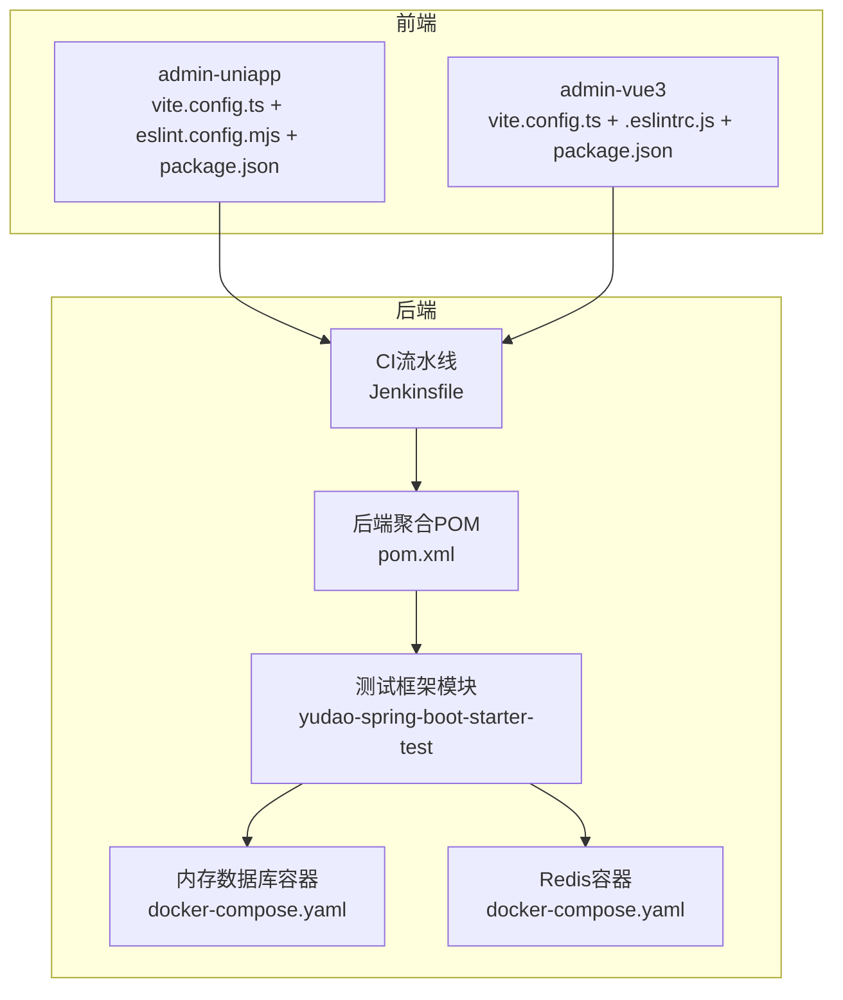
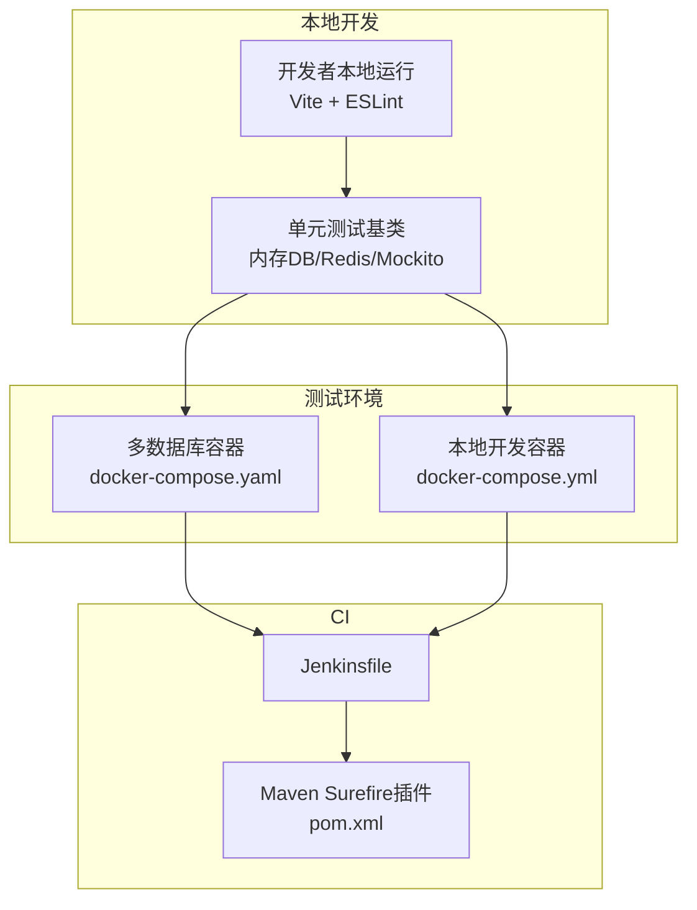
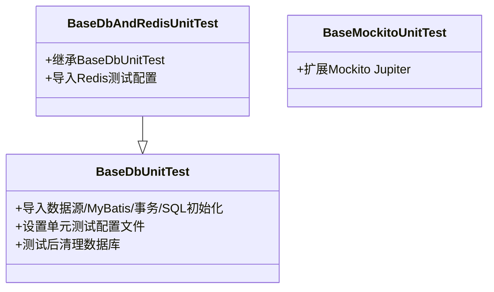
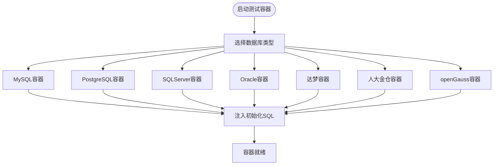
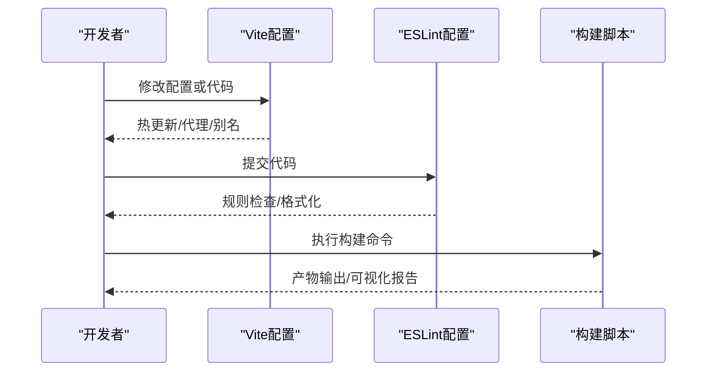
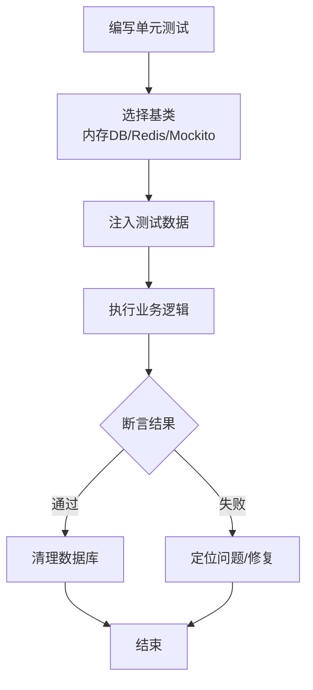
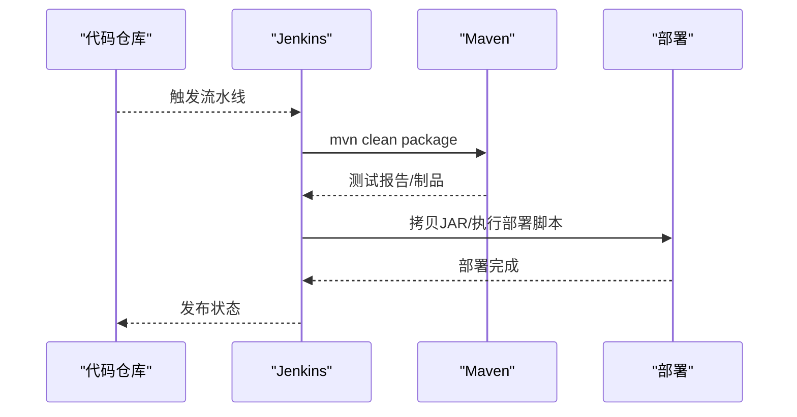
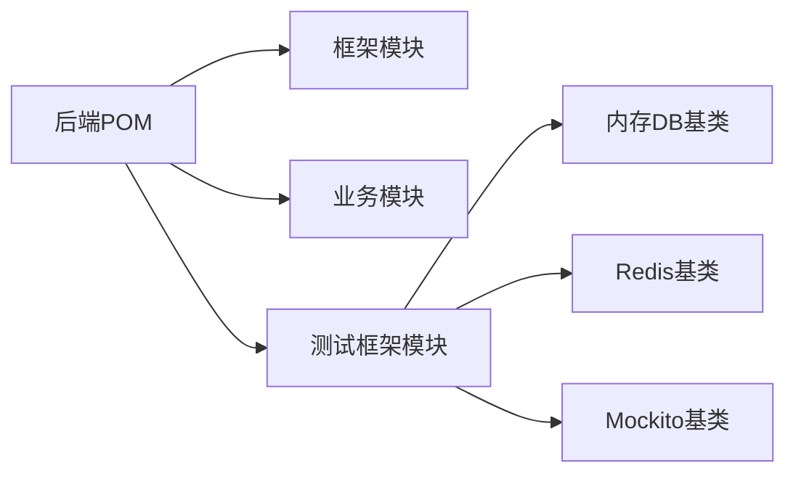

# 测试与质量保证

<cite>
**本文档引用的文件**   
- [Jenkinsfile](file://backend/script/jenkins/Jenkinsfile)
- [pom.xml](file://backend/pom.xml)
- [BaseDbUnitTest.java](file://backend/yudao-framework/yudao-spring-boot-starter-test/src/main/java/cn/iocoder/yudao/framework/test/core/ut/BaseDbUnitTest.java)
- [BaseDbAndRedisUnitTest.java](file://backend/yudao-framework/yudao-spring-boot-starter-test/src/main/java/cn/iocoder/yudao/framework/test/core/ut/BaseDbAndRedisUnitTest.java)
- [BaseMockitoUnitTest.java](file://backend/yudao-framework/yudao-spring-boot-starter-test/src/main/java/cn/iocoder/yudao/framework/test/core/ut/BaseMockitoUnitTest.java)
- [docker-compose.yaml](file://backend/sql/tools/docker-compose.yaml)
- [docker-compose.yml](file://backend/script/docker/docker-compose.yml)
- [vite.config.ts（admin-uniapp）](file://frontend/admin-uniapp/vite.config.ts)
- [vite.config.ts（admin-vue3）](file://frontend/admin-vue3/vite.config.ts)
- [eslint.config.mjs（admin-uniapp）](file://frontend/admin-uniapp/eslint.config.mjs)
- [.eslintrc.js（admin-vue3）](file://frontend/admin-vue3/.eslintrc.js)
- [package.json（admin-uniapp）](file://frontend/admin-uniapp/package.json)
- [package.json（admin-vue3）](file://frontend/admin-vue3/package.json)
- [pom.xml（dataoke-sdk-java）](file://agent_improvement/sdk_demo/dataoke-sdk-java/pom.xml)
</cite>

## 目录
1. [引言](#引言)
2. [项目结构](#项目结构)
3. [核心组件](#核心组件)
4. [架构总览](#架构总览)
5. [详细组件分析](#详细组件分析)
6. [依赖分析](#依赖分析)
7. [性能考虑](#性能考虑)
8. [故障排查指南](#故障排查指南)
9. [结论](#结论)
10. [附录](#附录)

## 引言
本指南面向AgenticCPS项目的测试与质量保证体系，覆盖后端单元测试、集成测试、前端质量保障、API与数据库测试、性能测试、测试环境与数据准备、测试报告与质量度量、以及持续集成配置。目标是帮助研发团队建立可落地的质量基线，确保代码质量与系统稳定性。

## 项目结构
项目采用前后端分离与多模块后端架构：
- 后端以Maven聚合工程组织，包含框架模块、业务模块与服务端模块；测试框架位于yudao-spring-boot-starter-test模块，提供基于内存数据库与Redis的单元测试基类。
- 前端包含admin-uniapp与admin-vue3两套管理端，分别采用Vite与Vue生态，具备完善的ESLint与构建配置。
- 提供多数据库Docker Compose脚本，便于快速搭建测试环境。

**图示来源**
- [pom.xml:1-175](file://backend/pom.xml#L1-L175)
- [docker-compose.yaml:1-134](file://backend/sql/tools/docker-compose.yaml#L1-L134)
- [Jenkinsfile:1-61](file://backend/script/jenkins/Jenkinsfile#L1-L61)
- [vite.config.ts（admin-uniapp）:1-214](file://frontend/admin-uniapp/vite.config.ts#L1-L214)
- [eslint.config.mjs（admin-uniapp）:1-65](file://frontend/admin-uniapp/eslint.config.mjs#L1-L65)
- [package.json（admin-uniapp）:1-194](file://frontend/admin-uniapp/package.json#L1-L194)
- [vite.config.ts（admin-vue3）:1-89](file://frontend/admin-vue3/vite.config.ts#L1-L89)
- [.eslintrc.js（admin-vue3）:1-76](file://frontend/admin-vue3/.eslintrc.js#L1-L76)
- [package.json（admin-vue3）:1-160](file://frontend/admin-vue3/package.json#L1-L160)

**章节来源**
- [pom.xml:1-175](file://backend/pom.xml#L1-L175)
- [docker-compose.yaml:1-134](file://backend/sql/tools/docker-compose.yaml#L1-L134)
- [Jenkinsfile:1-61](file://backend/script/jenkins/Jenkinsfile#L1-L61)

## 核心组件
- 单元测试基类
  - 内存数据库单元测试基类：提供内存数据库与MyBatis配置，适用于Service层对Mapper的单元测试。
  - 内存数据库+Redis单元测试基类：在上述基础上增加Redis测试配置。
  - 纯Mockito单元测试基类：适用于纯Mock场景。
- 测试容器与环境
  - 多数据库Docker Compose：MySQL、PostgreSQL、SQLServer、Oracle、达梦、人大金仓、openGauss等。
  - 本地开发Docker Compose：MySQL、Redis、后端服务、前端管理端。
- 前端质量保障
  - Vite配置：开发服务器、代理、构建优化、打包可视化等。
  - ESLint配置：统一规则、格式化、忽略项。
  - 依赖与脚本：统一的开发与构建命令。

**章节来源**
- [BaseDbUnitTest.java:1-48](file://backend/yudao-framework/yudao-spring-boot-starter-test/src/main/java/cn/iocoder/yudao/framework/test/core/ut/BaseDbUnitTest.java#L1-L48)
- [BaseDbAndRedisUnitTest.java:1-56](file://backend/yudao-framework/yudao-spring-boot-starter-test/src/main/java/cn/iocoder/yudao/framework/test/core/ut/BaseDbAndRedisUnitTest.java#L1-L56)
- [BaseMockitoUnitTest.java:1-14](file://backend/yudao-framework/yudao-spring-boot-starter-test/src/main/java/cn/iocoder/yudao/framework/test/core/ut/BaseMockitoUnitTest.java#L1-L14)
- [docker-compose.yaml:1-134](file://backend/sql/tools/docker-compose.yaml#L1-L134)
- [docker-compose.yml:1-85](file://backend/script/docker/docker-compose.yml#L1-L85)
- [vite.config.ts（admin-uniapp）:1-214](file://frontend/admin-uniapp/vite.config.ts#L1-L214)
- [eslint.config.mjs（admin-uniapp）:1-65](file://frontend/admin-uniapp/eslint.config.mjs#L1-L65)
- [vite.config.ts（admin-vue3）:1-89](file://frontend/admin-vue3/vite.config.ts#L1-L89)
- [.eslintrc.js（admin-vue3）:1-76](file://frontend/admin-vue3/.eslintrc.js#L1-L76)

## 架构总览
测试与质量保证的总体架构围绕“单元测试基类 + 测试容器 + 前端质量工具 + CI流水线”展开，形成从本地开发到CI执行的闭环。

**图示来源**
- [docker-compose.yaml:1-134](file://backend/sql/tools/docker-compose.yaml#L1-L134)
- [docker-compose.yml:1-85](file://backend/script/docker/docker-compose.yml#L1-L85)
- [Jenkinsfile:1-61](file://backend/script/jenkins/Jenkinsfile#L1-L61)
- [pom.xml:58-141](file://backend/pom.xml#L58-L141)

## 详细组件分析

### 单元测试基类设计
- 内存数据库单元测试基类
  - 导入数据源、MyBatis、事务与SQL初始化配置，设置单元测试配置文件，测试后自动清理数据库。
  - 适合对本模块Mapper进行真实SQL验证，对外部模块使用Mock。
- 内存数据库+Redis单元测试基类
  - 在上述基础上增加Redis测试配置，满足缓存相关逻辑的单元测试。
- 纯Mockito单元测试基类
  - 通过扩展Mockito Jupiter，简化Mock对象与断言。

**图示来源**
- [BaseDbUnitTest.java:1-48](file://backend/yudao-framework/yudao-spring-boot-starter-test/src/main/java/cn/iocoder/yudao/framework/test/core/ut/BaseDbUnitTest.java#L1-L48)
- [BaseDbAndRedisUnitTest.java:1-56](file://backend/yudao-framework/yudao-spring-boot-starter-test/src/main/java/cn/iocoder/yudao/framework/test/core/ut/BaseDbAndRedisUnitTest.java#L1-L56)
- [BaseMockitoUnitTest.java:1-14](file://backend/yudao-framework/yudao-spring-boot-starter-test/src/main/java/cn/iocoder/yudao/framework/test/core/ut/BaseMockitoUnitTest.java#L1-L14)

**章节来源**
- [BaseDbUnitTest.java:1-48](file://backend/yudao-framework/yudao-spring-boot-starter-test/src/main/java/cn/iocoder/yudao/framework/test/core/ut/BaseDbUnitTest.java#L1-L48)
- [BaseDbAndRedisUnitTest.java:1-56](file://backend/yudao-framework/yudao-spring-boot-starter-test/src/main/java/cn/iocoder/yudao/framework/test/core/ut/BaseDbAndRedisUnitTest.java#L1-L56)
- [BaseMockitoUnitTest.java:1-14](file://backend/yudao-framework/yudao-spring-boot-starter-test/src/main/java/cn/iocoder/yudao/framework/test/core/ut/BaseMockitoUnitTest.java#L1-L14)

### 测试容器与数据库
- 多数据库容器
  - 提供MySQL、PostgreSQL、SQLServer、Oracle、达梦、人大金仓、openGauss等镜像与初始化脚本挂载，便于在不同环境下进行集成测试。
- 本地开发容器
  - 启动MySQL、Redis、后端服务与前端管理端，便于本地联调。

**图示来源**
- [docker-compose.yaml:1-134](file://backend/sql/tools/docker-compose.yaml#L1-L134)

**章节来源**
- [docker-compose.yaml:1-134](file://backend/sql/tools/docker-compose.yaml#L1-L134)
- [docker-compose.yml:1-85](file://backend/script/docker/docker-compose.yml#L1-L85)

### 前端质量保障
- Vite配置
  - 开发服务器、代理、别名、构建优化（压缩、分包）、打包可视化等。
- ESLint配置
  - admin-uniapp使用@uni-helper/eslint-config，支持Vue、UnoCSS、Markdown等；admin-vue3使用Vue3推荐规则与TypeScript解析器。
- 依赖与脚本
  - 统一的开发与构建命令，支持H5、小程序、App等多端。

**图示来源**
- [vite.config.ts（admin-uniapp）:1-214](file://frontend/admin-uniapp/vite.config.ts#L1-L214)
- [eslint.config.mjs（admin-uniapp）:1-65](file://frontend/admin-uniapp/eslint.config.mjs#L1-L65)
- [vite.config.ts（admin-vue3）:1-89](file://frontend/admin-vue3/vite.config.ts#L1-L89)
- [.eslintrc.js（admin-vue3）:1-76](file://frontend/admin-vue3/.eslintrc.js#L1-L76)
- [package.json（admin-uniapp）:1-194](file://frontend/admin-uniapp/package.json#L1-L194)
- [package.json（admin-vue3）:1-160](file://frontend/admin-vue3/package.json#L1-L160)

**章节来源**
- [vite.config.ts（admin-uniapp）:1-214](file://frontend/admin-uniapp/vite.config.ts#L1-L214)
- [eslint.config.mjs（admin-uniapp）:1-65](file://frontend/admin-uniapp/eslint.config.mjs#L1-L65)
- [vite.config.ts（admin-vue3）:1-89](file://frontend/admin-vue3/vite.config.ts#L1-L89)
- [.eslintrc.js（admin-vue3）:1-76](file://frontend/admin-vue3/.eslintrc.js#L1-L76)
- [package.json（admin-uniapp）:1-194](file://frontend/admin-uniapp/package.json#L1-L194)
- [package.json（admin-vue3）:1-160](file://frontend/admin-vue3/package.json#L1-L160)

### API与数据库测试
- 单元测试策略
  - 使用内存数据库基类进行DAO与Service的单元测试；对外模块使用Mockito进行隔离。
  - 对缓存相关逻辑使用内存Redis基类。
- 集成测试建议
  - 使用多数据库容器进行跨数据库集成测试；结合后端接口文档与Swagger进行API验证。
- 测试数据准备
  - 通过初始化SQL脚本注入测试数据；测试结束后清理数据库。

**图示来源**
- [BaseDbUnitTest.java:1-48](file://backend/yudao-framework/yudao-spring-boot-starter-test/src/main/java/cn/iocoder/yudao/framework/test/core/ut/BaseDbUnitTest.java#L1-L48)
- [BaseDbAndRedisUnitTest.java:1-56](file://backend/yudao-framework/yudao-spring-boot-starter-test/src/main/java/cn/iocoder/yudao/framework/test/core/ut/BaseDbAndRedisUnitTest.java#L1-L56)
- [BaseMockitoUnitTest.java:1-14](file://backend/yudao-framework/yudao-spring-boot-starter-test/src/main/java/cn/iocoder/yudao/framework/test/core/ut/BaseMockitoUnitTest.java#L1-L14)

**章节来源**
- [BaseDbUnitTest.java:1-48](file://backend/yudao-framework/yudao-spring-boot-starter-test/src/main/java/cn/iocoder/yudao/framework/test/core/ut/BaseDbUnitTest.java#L1-L48)
- [BaseDbAndRedisUnitTest.java:1-56](file://backend/yudao-framework/yudao-spring-boot-starter-test/src/main/java/cn/iocoder/yudao/framework/test/core/ut/BaseDbAndRedisUnitTest.java#L1-L56)
- [BaseMockitoUnitTest.java:1-14](file://backend/yudao-framework/yudao-spring-boot-starter-test/src/main/java/cn/iocoder/yudao/framework/test/core/ut/BaseMockitoUnitTest.java#L1-L14)

### 性能测试与报告
- 前端性能
  - 使用Vite打包可视化插件生成构建分析报告，定位体积与分包问题。
- 后端性能
  - 结合监控与链路追踪模块进行性能观测；必要时引入压力测试工具进行接口级压测。
- 报告与度量
  - 单元测试由Surefire插件生成报告；前端可结合构建产物与可视化报告进行度量。

**章节来源**
- [vite.config.ts（admin-uniapp）:138-146](file://frontend/admin-uniapp/vite.config.ts#L138-L146)
- [pom.xml:58-141](file://backend/pom.xml#L58-L141)

### 持续集成配置
- Jenkins流水线
  - 定义环境变量、拉取代码、构建与部署阶段；支持参数化构建（如TAG_NAME）。
- Maven配置
  - 配置Surefire插件版本以支持JUnit 5；统一编译参数与处理器路径。

**图示来源**
- [Jenkinsfile:1-61](file://backend/script/jenkins/Jenkinsfile#L1-L61)
- [pom.xml:58-141](file://backend/pom.xml#L58-L141)

**章节来源**
- [Jenkinsfile:1-61](file://backend/script/jenkins/Jenkinsfile#L1-L61)
- [pom.xml:58-141](file://backend/pom.xml#L58-L141)

## 依赖分析
- 后端
  - 聚合工程包含框架与业务模块；测试框架提供统一的单元测试基类。
- 前端
  - admin-uniapp与admin-vue3分别维护独立的Vite与ESLint配置，保持风格一致与工具链稳定。
- 测试容器
  - 多数据库容器与本地开发容器解耦，便于按需选择测试环境。

**图示来源**
- [pom.xml:1-175](file://backend/pom.xml#L1-L175)
- [BaseDbUnitTest.java:1-48](file://backend/yudao-framework/yudao-spring-boot-starter-test/src/main/java/cn/iocoder/yudao/framework/test/core/ut/BaseDbUnitTest.java#L1-L48)
- [BaseDbAndRedisUnitTest.java:1-56](file://backend/yudao-framework/yudao-spring-boot-starter-test/src/main/java/cn/iocoder/yudao/framework/test/core/ut/BaseDbAndRedisUnitTest.java#L1-L56)
- [BaseMockitoUnitTest.java:1-14](file://backend/yudao-framework/yudao-spring-boot-starter-test/src/main/java/cn/iocoder/yudao/framework/test/core/ut/BaseMockitoUnitTest.java#L1-L14)

**章节来源**
- [pom.xml:1-175](file://backend/pom.xml#L1-L175)

## 性能考虑
- 前端
  - 合理配置构建压缩与分包策略，避免单体包过大；利用打包可视化定位瓶颈。
- 后端
  - 使用内存数据库与Redis进行单元测试，减少外部依赖带来的性能波动；在集成测试中评估不同数据库的性能差异。
- CI
  - 控制并发与缓存，缩短构建时间；对大依赖使用镜像加速。

## 故障排查指南
- 单元测试失败
  - 检查是否正确继承内存DB/Redis/Mockito基类；确认测试配置文件已激活；核对测试数据清理逻辑。
- 前端构建异常
  - 查看Vite配置与ESLint规则；确认Node与包管理器版本；检查环境变量与代理配置。
- CI构建失败
  - 检查Jenkins环境变量与凭证；确认Maven插件版本与依赖源；查看构建日志定位具体错误。

**章节来源**
- [BaseDbUnitTest.java:1-48](file://backend/yudao-framework/yudao-spring-boot-starter-test/src/main/java/cn/iocoder/yudao/framework/test/core/ut/BaseDbUnitTest.java#L1-L48)
- [BaseDbAndRedisUnitTest.java:1-56](file://backend/yudao-framework/yudao-spring-boot-starter-test/src/main/java/cn/iocoder/yudao/framework/test/core/ut/BaseDbAndRedisUnitTest.java#L1-L56)
- [BaseMockitoUnitTest.java:1-14](file://backend/yudao-framework/yudao-spring-boot-starter-test/src/main/java/cn/iocoder/yudao/framework/test/core/ut/BaseMockitoUnitTest.java#L1-L14)
- [vite.config.ts（admin-uniapp）:1-214](file://frontend/admin-uniapp/vite.config.ts#L1-L214)
- [eslint.config.mjs（admin-uniapp）:1-65](file://frontend/admin-uniapp/eslint.config.mjs#L1-L65)
- [vite.config.ts（admin-vue3）:1-89](file://frontend/admin-vue3/vite.config.ts#L1-L89)
- [.eslintrc.js（admin-vue3）:1-76](file://frontend/admin-vue3/.eslintrc.js#L1-L76)
- [Jenkinsfile:1-61](file://backend/script/jenkins/Jenkinsfile#L1-L61)
- [pom.xml:58-141](file://backend/pom.xml#L58-L141)

## 结论
通过统一的单元测试基类、完备的测试容器、严格的前端质量工具链与清晰的CI流程，AgenticCPS项目能够建立起高效、可维护的质量保障体系。建议在现有基础上逐步完善API与数据库的集成测试、UI自动化测试与性能测试，持续优化测试覆盖率与质量度量指标。

## 附录
- 测试覆盖率要求
  - 建议后端Service与DAO覆盖率不低于80%，关键路径不低于90%；前端核心逻辑覆盖率不低于75%。
- 代码规范与静态分析
  - 前端：ESLint规则已配置，建议配合Prettier与Stylelint；后端：结合SonarQube或SpotBugs进行静态分析。
- 代码审查流程
  - PR必带测试用例与变更说明；至少一名Reviewer通过；CI通过后再合并。
- 测试环境与数据
  - 使用多数据库容器进行跨环境验证；测试数据使用初始化脚本统一管理。
- 质量度量指标
  - 单元测试通过率、覆盖率、构建时长、前端包体积、CI成功率等。