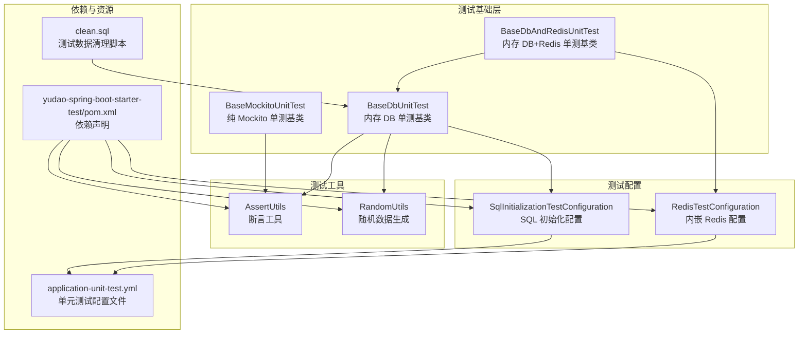
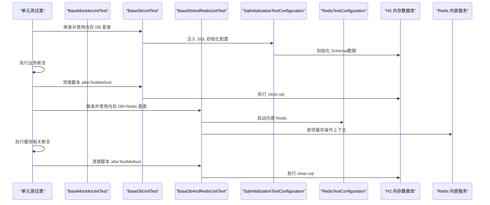
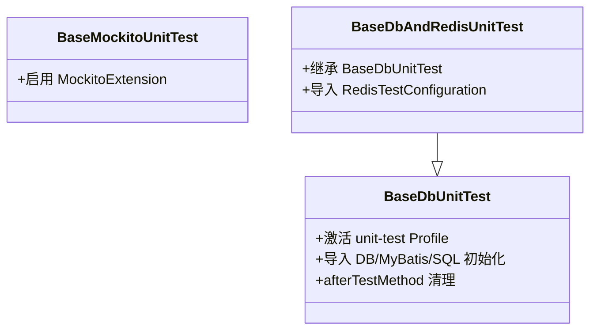
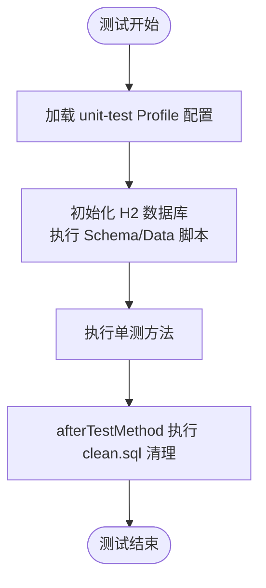
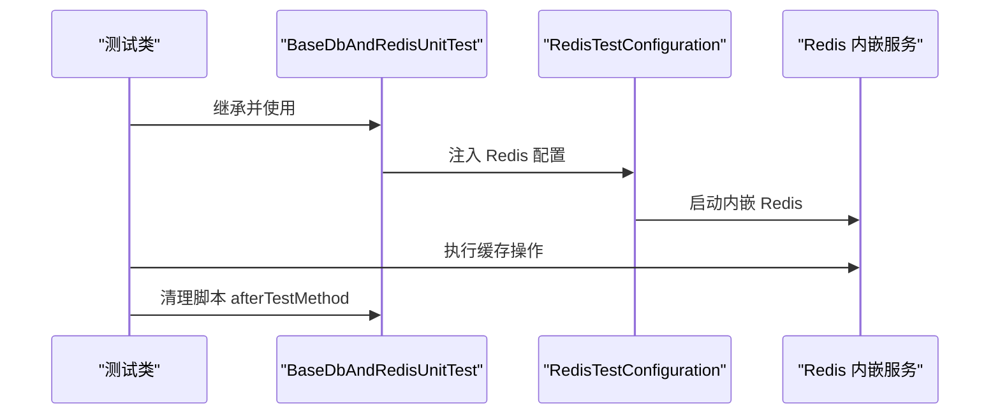
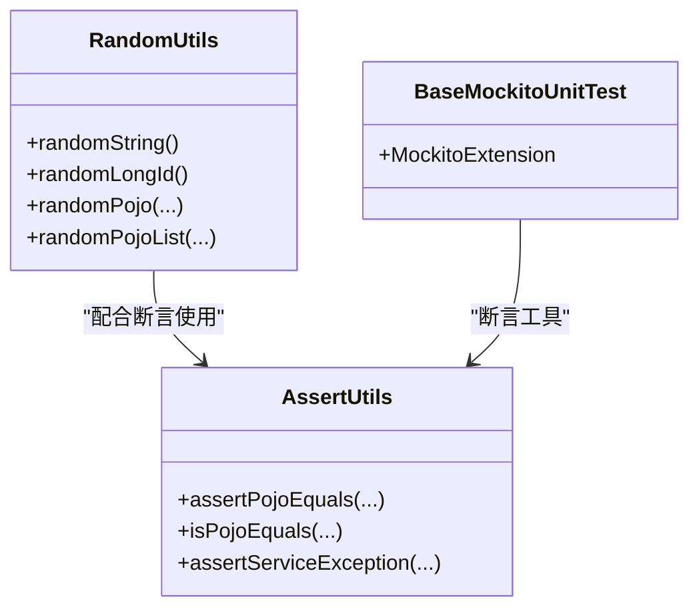
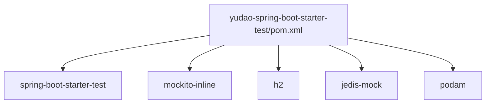

# 测试策略

<cite>
**本文引用的文件**
- [BaseDbUnitTest.java](file://backend/yudao-framework/yudao-spring-boot-starter-test/src/main/java/cn/iocoder/yudao/framework/test/core/ut/BaseDbUnitTest.java)
- [BaseDbAndRedisUnitTest.java](file://backend/yudao-framework/yudao-spring-boot-starter-test/src/main/java/cn/iocoder/yudao/framework/test/core/ut/BaseDbAndRedisUnitTest.java)
- [BaseMockitoUnitTest.java](file://backend/yudao-framework/yudao-spring-boot-starter-test/src/main/java/cn/iocoder/yudao/framework/test/core/ut/BaseMockitoUnitTest.java)
- [SqlInitializationTestConfiguration.java](file://backend/yudao-framework/yudao-spring-boot-starter-test/src/main/java/cn/iocoder/yudao/framework/test/config/SqlInitializationTestConfiguration.java)
- [RedisTestConfiguration.java](file://backend/yudao-framework/yudao-spring-boot-starter-test/src/main/java/cn/iocoder/yudao/framework/test/config/RedisTestConfiguration.java)
- [AssertUtils.java](file://backend/yudao-framework/yudao-spring-boot-starter-test/src/main/java/cn/iocoder/yudao/framework/test/core/util/AssertUtils.java)
- [RandomUtils.java](file://backend/yudao-framework/yudao-spring-boot-starter-test/src/main/java/cn/iocoder/yudao/framework/test/core/util/RandomUtils.java)
- [yudao-spring-boot-starter-test/pom.xml](file://backend/yudao-framework/yudao-spring-boot-starter-test/pom.xml)
- [clean.sql](file://backend/yudao-module-infra/src/test/resources/sql/clean.sql)
- [application-unit-test.yml](file://backend/yudao-server/src/test/resources/application-unit-test.yml)
- [Jenkinsfile](file://backend/script/jenkins/Jenkinsfile)
- [ProjectReactor.java](file://backend/yudao-server/src/test/java/cn/iocoder/yudao/ProjectReactor.java)
</cite>

## 目录
1. [引言](#引言)
2. [项目结构](#项目结构)
3. [核心组件](#核心组件)
4. [架构总览](#架构总览)
5. [详细组件分析](#详细组件分析)
6. [依赖分析](#依赖分析)
7. [性能考虑](#性能考虑)
8. [故障排查指南](#故障排查指南)
9. [结论](#结论)
10. [附录](#附录)

## 引言
本测试策略文档面向后端与前端团队，系统化阐述 AgenticCPS 项目的测试体系：单元测试、集成测试、端到端测试、API 测试、数据库测试、性能测试与安全测试。文档覆盖测试环境搭建、测试数据准备、Mock 对象使用、数据库测试配置（含 H2 内存数据库）、Spring Boot 测试注解与 JUnit 5、Mockito 框架集成、测试用例编写规范、测试覆盖率要求、测试报告生成以及在持续集成中执行测试的最佳实践。

## 项目结构
测试相关能力集中在 yudao-spring-boot-starter-test 测试组件中，并通过模块化测试基类与配置类支撑各业务模块的测试实施。整体结构如下：

图表来源
- [BaseMockitoUnitTest.java:1-14](file://backend/yudao-framework/yudao-spring-boot-starter-test/src/main/java/cn/iocoder/yudao/framework/test/core/ut/BaseMockitoUnitTest.java#L1-L14)
- [BaseDbUnitTest.java:1-48](file://backend/yudao-framework/yudao-spring-boot-starter-test/src/main/java/cn/iocoder/yudao/framework/test/core/ut/BaseDbUnitTest.java#L1-L48)
- [BaseDbAndRedisUnitTest.java:1-56](file://backend/yudao-framework/yudao-spring-boot-starter-test/src/main/java/cn/iocoder/yudao/framework/test/core/ut/BaseDbAndRedisUnitTest.java#L1-L56)
- [SqlInitializationTestConfiguration.java:1-53](file://backend/yudao-framework/yudao-spring-boot-starter-test/src/main/java/cn/iocoder/yudao/framework/test/config/SqlInitializationTestConfiguration.java#L1-L53)
- [RedisTestConfiguration.java:1-36](file://backend/yudao-framework/yudao-spring-boot-starter-test/src/main/java/cn/iocoder/yudao/framework/test/config/RedisTestConfiguration.java#L1-L36)
- [AssertUtils.java:1-102](file://backend/yudao-framework/yudao-spring-boot-starter-test/src/main/java/cn/iocoder/yudao/framework/test/core/util/AssertUtils.java#L1-L102)
- [RandomUtils.java:1-147](file://backend/yudao-framework/yudao-spring-boot-starter-test/src/main/java/cn/iocoder/yudao/framework/test/core/util/RandomUtils.java#L1-L147)
- [yudao-spring-boot-starter-test/pom.xml:1-61](file://backend/yudao-framework/yudao-spring-boot-starter-test/pom.xml#L1-L61)
- [application-unit-test.yml](file://backend/yudao-server/src/test/resources/application-unit-test.yml)
- [clean.sql:1-11](file://backend/yudao-module-infra/src/test/resources/sql/clean.sql#L1-L11)

章节来源
- [BaseMockitoUnitTest.java:1-14](file://backend/yudao-framework/yudao-spring-boot-starter-test/src/main/java/cn/iocoder/yudao/framework/test/core/ut/BaseMockitoUnitTest.java#L1-L14)
- [BaseDbUnitTest.java:1-48](file://backend/yudao-framework/yudao-spring-boot-starter-test/src/main/java/cn/iocoder/yudao/framework/test/core/ut/BaseDbUnitTest.java#L1-L48)
- [BaseDbAndRedisUnitTest.java:1-56](file://backend/yudao-framework/yudao-spring-boot-starter-test/src/main/java/cn/iocoder/yudao/framework/test/core/ut/BaseDbAndRedisUnitTest.java#L1-L56)
- [SqlInitializationTestConfiguration.java:1-53](file://backend/yudao-framework/yudao-spring-boot-starter-test/src/main/java/cn/iocoder/yudao/framework/test/config/SqlInitializationTestConfiguration.java#L1-L53)
- [RedisTestConfiguration.java:1-36](file://backend/yudao-framework/yudao-spring-boot-starter-test/src/main/java/cn/iocoder/yudao/framework/test/config/RedisTestConfiguration.java#L1-L36)
- [AssertUtils.java:1-102](file://backend/yudao-framework/yudao-spring-boot-starter-test/src/main/java/cn/iocoder/yudao/framework/test/core/util/AssertUtils.java#L1-L102)
- [RandomUtils.java:1-147](file://backend/yudao-framework/yudao-spring-boot-starter-test/src/main/java/cn/iocoder/yudao/framework/test/core/util/RandomUtils.java#L1-L147)
- [yudao-spring-boot-starter-test/pom.xml:1-61](file://backend/yudao-framework/yudao-spring-boot-starter-test/pom.xml#L1-L61)

## 核心组件
- 单测基类
  - BaseMockitoUnitTest：启用 Mockito 扩展，适用于纯 Mock 的单元测试场景。
  - BaseDbUnitTest：基于 H2 内存数据库的单元测试基类，自动导入数据源、MyBatis 及 SQL 初始化配置。
  - BaseDbAndRedisUnitTest：在 BaseDbUnitTest 基础上增加内嵌 Redis 支持，适合需要缓存交互的单测。
- 测试配置
  - SqlInitializationTestConfiguration：替代默认懒加载初始化行为，确保测试容器中正确执行 SQL 初始化。
  - RedisTestConfiguration：启动内嵌 Redis 服务，便于缓存相关功能的单元测试。
- 测试工具
  - AssertUtils：提供对象属性对比、业务异常断言等通用断言方法。
  - RandomUtils：基于 Podam 的随机数据生成器，支持字符串、数值、日期、枚举、集合等类型，便于构造测试数据。
- 依赖与资源
  - yudao-spring-boot-starter-test/pom.xml：集中声明 JUnit 5、Mockito、H2、jedis-mock、Podam 等测试依赖。
  - application-unit-test.yml：单元测试专用配置文件，激活 unit-test Profile。
  - clean.sql：每个测试方法结束后清理测试表，保证测试隔离性。

章节来源
- [BaseMockitoUnitTest.java:1-14](file://backend/yudao-framework/yudao-spring-boot-starter-test/src/main/java/cn/iocoder/yudao/framework/test/core/ut/BaseMockitoUnitTest.java#L1-L14)
- [BaseDbUnitTest.java:1-48](file://backend/yudao-framework/yudao-spring-boot-starter-test/src/main/java/cn/iocoder/yudao/framework/test/core/ut/BaseDbUnitTest.java#L1-L48)
- [BaseDbAndRedisUnitTest.java:1-56](file://backend/yudao-framework/yudao-spring-boot-starter-test/src/main/java/cn/iocoder/yudao/framework/test/core/ut/BaseDbAndRedisUnitTest.java#L1-L56)
- [SqlInitializationTestConfiguration.java:1-53](file://backend/yudao-framework/yudao-spring-boot-starter-test/src/main/java/cn/iocoder/yudao/framework/test/config/SqlInitializationTestConfiguration.java#L1-L53)
- [RedisTestConfiguration.java:1-36](file://backend/yudao-framework/yudao-spring-boot-starter-test/src/main/java/cn/iocoder/yudao/framework/test/config/RedisTestConfiguration.java#L1-L36)
- [AssertUtils.java:1-102](file://backend/yudao-framework/yudao-spring-boot-starter-test/src/main/java/cn/iocoder/yudao/framework/test/core/util/AssertUtils.java#L1-L102)
- [RandomUtils.java:1-147](file://backend/yudao-framework/yudao-spring-boot-starter-test/src/main/java/cn/iocoder/yudao/framework/test/core/util/RandomUtils.java#L1-L147)
- [yudao-spring-boot-starter-test/pom.xml:1-61](file://backend/yudao-framework/yudao-spring-boot-starter-test/pom.xml#L1-L61)
- [application-unit-test.yml](file://backend/yudao-server/src/test/resources/application-unit-test.yml)
- [clean.sql:1-11](file://backend/yudao-module-infra/src/test/resources/sql/clean.sql#L1-L11)

## 架构总览
下图展示测试运行时的组件交互与数据流：

图表来源
- [BaseDbUnitTest.java:1-48](file://backend/yudao-framework/yudao-spring-boot-starter-test/src/main/java/cn/iocoder/yudao/framework/test/core/ut/BaseDbUnitTest.java#L1-L48)
- [BaseDbAndRedisUnitTest.java:1-56](file://backend/yudao-framework/yudao-spring-boot-starter-test/src/main/java/cn/iocoder/yudao/framework/test/core/ut/BaseDbAndRedisUnitTest.java#L1-L56)
- [SqlInitializationTestConfiguration.java:1-53](file://backend/yudao-framework/yudao-spring-boot-starter-test/src/main/java/cn/iocoder/yudao/framework/test/config/SqlInitializationTestConfiguration.java#L1-L53)
- [RedisTestConfiguration.java:1-36](file://backend/yudao-framework/yudao-spring-boot-starter-test/src/main/java/cn/iocoder/yudao/framework/test/config/RedisTestConfiguration.java#L1-L36)
- [clean.sql:1-11](file://backend/yudao-module-infra/src/test/resources/sql/clean.sql#L1-L11)

## 详细组件分析

### 单元测试框架与基类
- BaseMockitoUnitTest：启用 MockitoExtension，适合纯 Mock 场景，无需数据库或缓存。
- BaseDbUnitTest：激活 unit-test Profile，导入数据源、MyBatis、SQL 初始化配置；每个测试方法结束后执行 clean.sql 清理。
- BaseDbAndRedisUnitTest：在上述基础上增加 RedisTestConfiguration，支持缓存相关单测。

图表来源
- [BaseMockitoUnitTest.java:1-14](file://backend/yudao-framework/yudao-spring-boot-starter-test/src/main/java/cn/iocoder/yudao/framework/test/core/ut/BaseMockitoUnitTest.java#L1-L14)
- [BaseDbUnitTest.java:1-48](file://backend/yudao-framework/yudao-spring-boot-starter-test/src/main/java/cn/iocoder/yudao/framework/test/core/ut/BaseDbUnitTest.java#L1-L48)
- [BaseDbAndRedisUnitTest.java:1-56](file://backend/yudao-framework/yudao-spring-boot-starter-test/src/main/java/cn/iocoder/yudao/framework/test/core/ut/BaseDbAndRedisUnitTest.java#L1-L56)

章节来源
- [BaseMockitoUnitTest.java:1-14](file://backend/yudao-framework/yudao-spring-boot-starter-test/src/main/java/cn/iocoder/yudao/framework/test/core/ut/BaseMockitoUnitTest.java#L1-L14)
- [BaseDbUnitTest.java:1-48](file://backend/yudao-framework/yudao-spring-boot-starter-test/src/main/java/cn/iocoder/yudao/framework/test/core/ut/BaseDbUnitTest.java#L1-L48)
- [BaseDbAndRedisUnitTest.java:1-56](file://backend/yudao-framework/yudao-spring-boot-starter-test/src/main/java/cn/iocoder/yudao/framework/test/core/ut/BaseDbAndRedisUnitTest.java#L1-L56)

### 数据库测试配置（H2 内存数据库）
- SqlInitializationTestConfiguration：禁用懒加载，按配置加载 schema/data 脚本，适配单元测试场景。
- clean.sql：在每个测试方法结束后删除测试表数据，确保测试隔离。
- application-unit-test.yml：激活 unit-test Profile，提供测试专用数据源与 MyBatis 配置。

图表来源
- [SqlInitializationTestConfiguration.java:1-53](file://backend/yudao-framework/yudao-spring-boot-starter-test/src/main/java/cn/iocoder/yudao/framework/test/config/SqlInitializationTestConfiguration.java#L1-L53)
- [clean.sql:1-11](file://backend/yudao-module-infra/src/test/resources/sql/clean.sql#L1-L11)
- [application-unit-test.yml](file://backend/yudao-server/src/test/resources/application-unit-test.yml)

章节来源
- [SqlInitializationTestConfiguration.java:1-53](file://backend/yudao-framework/yudao-spring-boot-starter-test/src/main/java/cn/iocoder/yudao/framework/test/config/SqlInitializationTestConfiguration.java#L1-L53)
- [clean.sql:1-11](file://backend/yudao-module-infra/src/test/resources/sql/clean.sql#L1-L11)
- [application-unit-test.yml](file://backend/yudao-server/src/test/resources/application-unit-test.yml)

### 缓存测试配置（内嵌 Redis）
- RedisTestConfiguration：启动内嵌 Redis 服务，避免外部 Redis 依赖。
- BaseDbAndRedisUnitTest：在内存 DB 基础上引入 Redis 测试配置，支持缓存相关单测。

图表来源
- [RedisTestConfiguration.java:1-36](file://backend/yudao-framework/yudao-spring-boot-starter-test/src/main/java/cn/iocoder/yudao/framework/test/config/RedisTestConfiguration.java#L1-L36)
- [BaseDbAndRedisUnitTest.java:1-56](file://backend/yudao-framework/yudao-spring-boot-starter-test/src/main/java/cn/iocoder/yudao/framework/test/core/ut/BaseDbAndRedisUnitTest.java#L1-L56)

章节来源
- [RedisTestConfiguration.java:1-36](file://backend/yudao-framework/yudao-spring-boot-starter-test/src/main/java/cn/iocoder/yudao/framework/test/config/RedisTestConfiguration.java#L1-L36)
- [BaseDbAndRedisUnitTest.java:1-56](file://backend/yudao-framework/yudao-spring-boot-starter-test/src/main/java/cn/iocoder/yudao/framework/test/core/ut/BaseDbAndRedisUnitTest.java#L1-L56)

### 测试数据准备与 Mock 对象
- RandomUtils：基于 Podam 生成随机 POJO，支持字符串、整数、布尔、日期、集合等，可自定义字段策略（如 status、deleted 等）。
- AssertUtils：提供对象属性对比、业务异常断言等，减少重复断言代码。
- Mockito：通过 BaseMockitoUnitTest 启用扩展，结合 @Mock/@Spy/@InjectMocks 等注解进行依赖注入与行为模拟。

图表来源
- [RandomUtils.java:1-147](file://backend/yudao-framework/yudao-spring-boot-starter-test/src/main/java/cn/iocoder/yudao/framework/test/core/util/RandomUtils.java#L1-L147)
- [AssertUtils.java:1-102](file://backend/yudao-framework/yudao-spring-boot-starter-test/src/main/java/cn/iocoder/yudao/framework/test/core/util/AssertUtils.java#L1-L102)
- [BaseMockitoUnitTest.java:1-14](file://backend/yudao-framework/yudao-spring-boot-starter-test/src/main/java/cn/iocoder/yudao/framework/test/core/ut/BaseMockitoUnitTest.java#L1-L14)

章节来源
- [RandomUtils.java:1-147](file://backend/yudao-framework/yudao-spring-boot-starter-test/src/main/java/cn/iocoder/yudao/framework/test/core/util/RandomUtils.java#L1-L147)
- [AssertUtils.java:1-102](file://backend/yudao-framework/yudao-spring-boot-starter-test/src/main/java/cn/iocoder/yudao/framework/test/core/util/AssertUtils.java#L1-L102)
- [BaseMockitoUnitTest.java:1-14](file://backend/yudao-framework/yudao-spring-boot-starter-test/src/main/java/cn/iocoder/yudao/framework/test/core/ut/BaseMockitoUnitTest.java#L1-L14)

### API 测试策略
- 建议使用 Spring Boot Test 与 @WebMvcTest 或 @SpringBootTest，结合 @AutoConfigureTestDatabase 排除真实数据源，优先使用内存 DB。
- 对于需要真实网关/鉴权的场景，可使用 @AutoConfigureTestH2Database 与 @Sql 注入测试数据。
- 使用 RestAssured 或 WebTestClient 进行端到端 API 行为验证，结合断言工具统一校验响应状态、消息体与异常码。

[本节为通用策略说明，未直接分析具体文件，故不附加章节来源]

### 集成测试方案
- 基于 BaseDbAndRedisUnitTest，覆盖跨模块交互（如 Service 调用、缓存读写）。
- 使用 @Sql 在测试方法级别注入初始化脚本，确保集成场景的数据一致性。
- 对外部依赖（如消息队列、第三方接口）采用 Mock 或内嵌实现（如 jedis-mock）。

[本节为通用策略说明，未直接分析具体文件，故不附加章节来源]

### 端到端测试方法
- 前端：基于 Vite/Vue/UniApp 的测试套件，建议使用 Vitest/Jest 与 Playwright/Cypress 进行页面级与交互级测试。
- 后端：使用 @SpringBootTest 启动完整应用上下文，结合 @AutoConfigureTestDatabase 与 @Sql 进行端到端验证。
- 建议在 CI 中分层执行：单元测试优先，随后集成与端到端测试。

[本节为通用策略说明，未直接分析具体文件，故不附加章节来源]

### 性能测试与安全测试
- 性能测试：使用 JMeter/Gatling 对关键接口进行并发压测，关注响应时间与吞吐量；结合 Actuator/Micrometer 指标监控。
- 安全测试：基于 Spring Security 的认证授权场景，使用 @WithMockUser/@WithUserDetails 等进行权限测试；对敏感接口进行 OWASP Top 10 风险扫描。

[本节为通用策略说明，未直接分析具体文件，故不附加章节来源]

## 依赖分析
yudao-spring-boot-starter-test 统一管理测试依赖，包括 JUnit 5、Mockito、H2、jedis-mock、Podam 等，确保各模块测试的一致性与可复用性。

图表来源
- [yudao-spring-boot-starter-test/pom.xml:1-61](file://backend/yudao-framework/yudao-spring-boot-starter-test/pom.xml#L1-L61)

章节来源
- [yudao-spring-boot-starter-test/pom.xml:1-61](file://backend/yudao-framework/yudao-spring-boot-starter-test/pom.xml#L1-L61)

## 性能考虑
- 测试隔离：通过 clean.sql 在每个测试方法后清理，避免数据累积影响性能。
- 内存数据库：H2 内存数据库速度快、易回滚，适合高频单测。
- 缓存模拟：内嵌 Redis 减少外部依赖带来的网络开销。
- 并发控制：在 CI 中合理拆分测试任务，避免过度并发导致资源争用。

[本节为通用指导，未直接分析具体文件，故不附加章节来源]

## 故障排查指南
- 测试失败定位
  - 使用 AssertUtils.assertServiceException 校验业务异常，快速定位错误码与消息。
  - 使用 AssertUtils.assertPojoEquals 对比对象属性，缩小问题范围。
- 数据残留
  - 确认 afterTestMethod 是否执行 clean.sql；检查 SQL 初始化顺序与依赖。
- Redis 端口冲突
  - RedisTestConfiguration 已处理启动异常，若仍冲突，检查端口占用或重启本地服务。
- 配置未生效
  - 确认已激活 unit-test Profile；检查 application-unit-test.yml 的数据源与 MyBatis 配置。

章节来源
- [AssertUtils.java:1-102](file://backend/yudao-framework/yudao-spring-boot-starter-test/src/main/java/cn/iocoder/yudao/framework/test/core/util/AssertUtils.java#L1-L102)
- [RedisTestConfiguration.java:1-36](file://backend/yudao-framework/yudao-spring-boot-starter-test/src/main/java/cn/iocoder/yudao/framework/test/config/RedisTestConfiguration.java#L1-L36)
- [clean.sql:1-11](file://backend/yudao-module-infra/src/test/resources/sql/clean.sql#L1-L11)
- [application-unit-test.yml](file://backend/yudao-server/src/test/resources/application-unit-test.yml)

## 结论
通过统一的测试基类、配置与工具，AgenticCPS 形成了高内聚、低耦合的测试体系。建议各模块遵循“先单元后集成再端到端”的分层策略，结合 H2 与内嵌 Redis，提升测试效率与稳定性；在 CI 中分层执行测试并生成报告，持续改进质量与覆盖率。

[本节为总结性内容，未直接分析具体文件，故不附加章节来源]

## 附录

### 测试用例编写规范
- 命名规范：以被测方法名+场景+期望结果命名，清晰表达意图。
- 断言规范：优先使用 AssertUtils 的断言工具，保持断言信息一致。
- 数据准备：优先使用 RandomUtils 生成随机数据，必要时使用 @Sql 注入。
- 隔离性：每个测试方法独立，依赖 clean.sql 清理。

[本节为通用规范说明，未直接分析具体文件，故不附加章节来源]

### 测试覆盖率要求
- 建议语句覆盖率≥80%，分支覆盖率≥70%，关键路径与异常分支重点保障。
- 使用 JaCoCo 生成覆盖率报告，并在 CI 中设置阈值门禁。

[本节为通用规范说明，未直接分析具体文件，故不附加章节来源]

### 测试报告生成与持续集成
- 报告生成：使用 JUnit 5 与 Surefire/Failsafe 插件生成 XML 报告；结合 JaCoCo 生成覆盖率报告。
- CI 执行：参考 Jenkinsfile 的测试阶段，按模块并行执行，汇总报告与覆盖率。

章节来源
- [Jenkinsfile](file://backend/script/jenkins/Jenkinsfile)
- [ProjectReactor.java](file://backend/yudao-server/src/test/java/cn/iocoder/yudao/ProjectReactor.java)