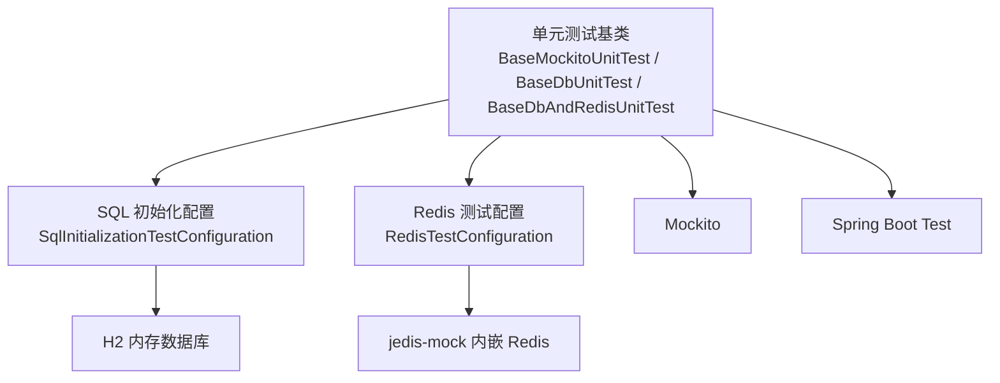
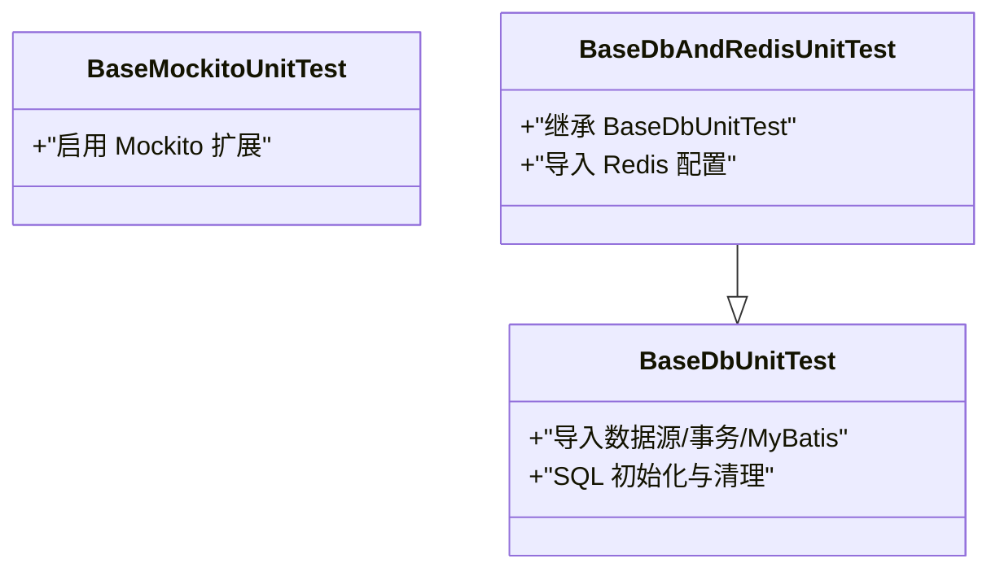
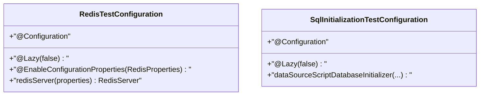
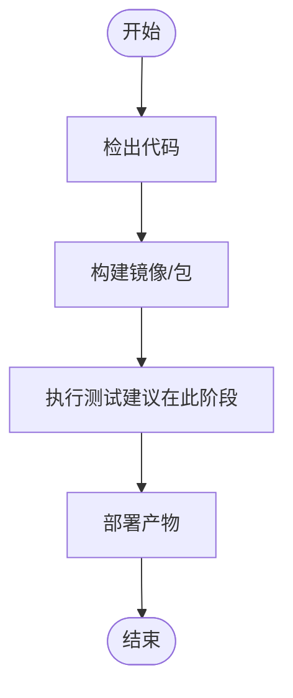
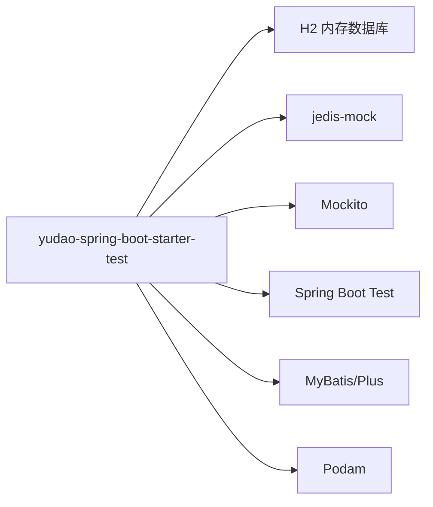

# 测试策略

<cite>
**本文引用的文件**
- [pom.xml](file://backend/yudao-framework/yudao-spring-boot-starter-test/pom.xml)
- [RedisTestConfiguration.java](file://backend/yudao-framework/yudao-spring-boot-starter-test/src/main/java/cn/iocoder/yudao/framework/test/config/RedisTestConfiguration.java)
- [SqlInitializationTestConfiguration.java](file://backend/yudao-framework/yudao-spring-boot-starter-test/src/main/java/cn/iocoder/yudao/framework/test/config/SqlInitializationTestConfiguration.java)
- [BaseDbUnitTest.java](file://backend/yudao-framework/yudao-spring-boot-starter-test/src/main/java/cn/iocoder/yudao/framework/test/core/ut/BaseDbUnitTest.java)
- [BaseDbAndRedisUnitTest.java](file://backend/yudao-framework/yudao-spring-boot-starter-test/src/main/java/cn/iocoder/yudao/framework/test/core/ut/BaseDbAndRedisUnitTest.java)
- [BaseMockitoUnitTest.java](file://backend/yudao-framework/yudao-spring-boot-starter-test/src/main/java/cn/iocoder/yudao/framework/test/core/ut/BaseMockitoUnitTest.java)
- [Jenkinsfile](file://backend/script/jenkins/Jenkinsfile)
- [CollectionUtilsTest.java](file://backend/yudao-framework/yudao-common/src/test/java/cn/iocoder/yudao/framework/common/util/collection/CollectionUtilsTest.java)
- [DataPermissionAnnotationInterceptorTest.java](file://backend/yudao-framework/yudao-spring-boot-starter-biz-data-permission/src/test/java/cn/iocoder/yudao/framework/datapermission/core/aop/DataPermissionAnnotationInterceptorTest.java)
- [IPUtilsTest.java](file://backend/yudao-framework/yudao-spring-boot-starter-biz-ip/src/test/java/cn/iocoder/yudao/framework/ip/core/utils/IPUtilsTest.java)
- [ApiEncryptTest.java](file://backend/yudao-framework/yudao-spring-boot-starter-web/src/test/java/cn/iocoder/yudao/framework/encrypt/ApiEncryptTest.java)
- [AiWorkflowTestReqVO.java](file://backend/yudao-module-ai/src/main/java/cn/iocoder/yudao/module/ai/controller/admin/workflow/vo/AiWorkflowTestReqVO.java)
</cite>

## 目录
1. [引言](#引言)
2. [项目结构](#项目结构)
3. [核心组件](#核心组件)
4. [架构总览](#架构总览)
5. [详细组件分析](#详细组件分析)
6. [依赖分析](#依赖分析)
7. [性能考虑](#性能考虑)
8. [故障排查指南](#故障排查指南)
9. [结论](#结论)
10. [附录](#附录)

## 引言
本测试策略文档面向 AgenticCPS 项目的后端与前端，系统性阐述测试体系：单元测试框架配置、业务逻辑测试方法、API 接口测试流程；集成测试与端到端测试的设计思路；CI 流程中的测试执行；测试数据管理、Mock 对象使用与测试环境配置；性能与压力测试、回归测试方法与工具；测试覆盖率要求、测试报告生成与质量度量指标；自动化测试脚本编写、测试用例设计与缺陷跟踪流程；以及测试最佳实践与常见问题解决方案。

## 项目结构
后端采用 Maven 多模块结构，测试能力由 yudao-spring-boot-starter-test 提供统一支撑，覆盖内存数据库（H2）、内嵌 Redis（jedis-mock）、MyBatis/MyBatis-Plus、Spring Boot Test、Mockito 等。各功能模块在各自模块下提供单元测试样例，如 yudao-common、yudao-spring-boot-starter-biz-data-permission、yudao-spring-boot-starter-biz-ip、yudao-spring-boot-starter-web 等均包含测试用例。

```mermaid
graph TB
subgraph "测试框架层"
TST["yudao-spring-boot-starter-test<br/>提供测试基类与配置"]
H2["H2 内存数据库"]
JEDIS["jedis-mock 内嵌 Redis"]
MOCK["Mockito 单元测试扩展"]
SBTEST["Spring Boot Test"]
end
subgraph "业务模块"
MOD_AI["yudao-module-ai"]
MOD_CPS["yudao-module-cps"]
MOD_INFRA["yudao-module-infra"]
MOD_MALL["yudao-module-mall"]
MOD_SYS["yudao-module-system"]
MOD_PAY["yudao-module-pay"]
MOD_REPORT["yudao-module-report"]
MOD_MEMBER["yudao-module-member"]
MOD_MP["yudao-module-mp"]
MOD_TRADE["yudao-module-trade"]
MOD_PROMO["yudao-module-promotion"]
MOD_STAT["yudao-module-statistics"]
end
TST --> H2
TST --> JEDIS
TST --> MOCK
TST --> SBTEST
TST -.-> MOD_AI
TST -.-> MOD_CPS
TST -.-> MOD_INFRA
TST -.-> MOD_MALL
TST -.-> MOD_SYS
TST -.-> MOD_PAY
TST -.-> MOD_REPORT
TST -.-> MOD_MEMBER
TST -.-> MOD_MP
TST -.-> MOD_TRADE
TST -.-> MOD_PROMO
TST -.-> MOD_STAT
```

图表来源
- [pom.xml:18-59](file://backend/yudao-framework/yudao-spring-boot-starter-test/pom.xml#L18-L59)
- [BaseDbUnitTest.java:29-43](file://backend/yudao-framework/yudao-spring-boot-starter-test/src/main/java/cn/iocoder/yudao/framework/test/core/ut/BaseDbUnitTest.java#L29-L43)
- [BaseDbAndRedisUnitTest.java:32-51](file://backend/yudao-framework/yudao-spring-boot-starter-test/src/main/java/cn/iocoder/yudao/framework/test/core/ut/BaseDbAndRedisUnitTest.java#L32-L51)

章节来源
- [pom.xml:1-61](file://backend/yudao-framework/yudao-spring-boot-starter-test/pom.xml#L1-L61)

## 核心组件
- 单元测试基类
  - BaseMockitoUnitTest：启用 Mockito 扩展，适合纯对象与接口 Mock 的单元测试。
  - BaseDbUnitTest：启用内存数据库（H2）与 MyBatis/Plus，适合需要持久化的单元测试。
  - BaseDbAndRedisUnitTest：在 BaseDbUnitTest 基础上增加内嵌 Redis（jedis-mock），适合缓存场景测试。
- 测试配置
  - RedisTestConfiguration：启动内嵌 Redis 服务，避免端口冲突影响。
  - SqlInitializationTestConfiguration：在延迟初始化模式下仍能正确执行 SQL 初始化。
- 测试依赖
  - H2、jedis-mock、Mockito、Spring Boot Test、MyBatis/Plus、Podam（POJO 随机填充）等。

章节来源
- [BaseMockitoUnitTest.java:1-14](file://backend/yudao-framework/yudao-spring-boot-starter-test/src/main/java/cn/iocoder/yudao/framework/test/core/ut/BaseMockitoUnitTest.java#L1-L14)
- [BaseDbUnitTest.java:1-48](file://backend/yudao-framework/yudao-spring-boot-starter-test/src/main/java/cn/iocoder/yudao/framework/test/core/ut/BaseDbUnitTest.java#L1-L48)
- [BaseDbAndRedisUnitTest.java:1-56](file://backend/yudao-framework/yudao-spring-boot-starter-test/src/main/java/cn/iocoder/yudao/framework/test/core/ut/BaseDbAndRedisUnitTest.java#L1-L56)
- [RedisTestConfiguration.java:1-36](file://backend/yudao-framework/yudao-spring-boot-starter-test/src/main/java/cn/iocoder/yudao/framework/test/config/RedisTestConfiguration.java#L1-L36)
- [SqlInitializationTestConfiguration.java:1-53](file://backend/yudao-framework/yudao-spring-boot-starter-test/src/main/java/cn/iocoder/yudao/framework/test/config/SqlInitializationTestConfiguration.java#L1-L53)
- [pom.xml:18-59](file://backend/yudao-framework/yudao-spring-boot-starter-test/pom.xml#L18-L59)

## 架构总览
测试架构围绕“内存数据库 + 内嵌缓存 + Spring Boot Test + Mockito”的组合展开，通过统一的测试基类与配置类，确保每个模块的测试具备一致的隔离性与可重复性。

图表来源
- [BaseDbUnitTest.java:24-43](file://backend/yudao-framework/yudao-spring-boot-starter-test/src/main/java/cn/iocoder/yudao/framework/test/core/ut/BaseDbUnitTest.java#L24-L43)
- [BaseDbAndRedisUnitTest.java:27-51](file://backend/yudao-framework/yudao-spring-boot-starter-test/src/main/java/cn/iocoder/yudao/framework/test/core/ut/BaseDbAndRedisUnitTest.java#L27-L51)
- [SqlInitializationTestConfiguration.java:26-52](file://backend/yudao-framework/yudao-spring-boot-starter-test/src/main/java/cn/iocoder/yudao/framework/test/config/SqlInitializationTestConfiguration.java#L26-L52)
- [RedisTestConfiguration.java:17-35](file://backend/yudao-framework/yudao-spring-boot-starter-test/src/main/java/cn/iocoder/yudao/framework/test/config/RedisTestConfiguration.java#L17-L35)

## 详细组件分析

### 单元测试基类与生命周期
- BaseMockitoUnitTest：为所有测试启用 Mockito 扩展，便于对依赖进行 Mock。
- BaseDbUnitTest：导入数据源、事务、MyBatis 配置与 SQL 初始化，测试结束后执行清理脚本，保证数据库状态一致性。
- BaseDbAndRedisUnitTest：在上述基础上引入 Redis 配置，支持缓存场景测试。

图表来源
- [BaseMockitoUnitTest.java:1-14](file://backend/yudao-framework/yudao-spring-boot-starter-test/src/main/java/cn/iocoder/yudao/framework/test/core/ut/BaseMockitoUnitTest.java#L1-L14)
- [BaseDbUnitTest.java:24-43](file://backend/yudao-framework/yudao-spring-boot-starter-test/src/main/java/cn/iocoder/yudao/framework/test/core/ut/BaseDbUnitTest.java#L24-L43)
- [BaseDbAndRedisUnitTest.java:27-51](file://backend/yudao-framework/yudao-spring-boot-starter-test/src/main/java/cn/iocoder/yudao/framework/test/core/ut/BaseDbAndRedisUnitTest.java#L27-L51)

章节来源
- [BaseMockitoUnitTest.java:1-14](file://backend/yudao-framework/yudao-spring-boot-starter-test/src/main/java/cn/iocoder/yudao/framework/test/core/ut/BaseMockitoUnitTest.java#L1-L14)
- [BaseDbUnitTest.java:1-48](file://backend/yudao-framework/yudao-spring-boot-starter-test/src/main/java/cn/iocoder/yudao/framework/test/core/ut/BaseDbUnitTest.java#L1-L48)
- [BaseDbAndRedisUnitTest.java:1-56](file://backend/yudao-framework/yudao-spring-boot-starter-test/src/main/java/cn/iocoder/yudao/framework/test/core/ut/BaseDbAndRedisUnitTest.java#L1-L56)

### 测试配置组件
- RedisTestConfiguration：启动内嵌 Redis 服务，避免多容器并发导致的端口占用问题。
- SqlInitializationTestConfiguration：在延迟初始化场景下仍能正确执行 SQL 初始化，确保测试前数据准备与清理。

图表来源
- [RedisTestConfiguration.java:12-35](file://backend/yudao-framework/yudao-spring-boot-starter-test/src/main/java/cn/iocoder/yudao/framework/test/config/RedisTestConfiguration.java#L12-L35)
- [SqlInitializationTestConfiguration.java:17-52](file://backend/yudao-framework/yudao-spring-boot-starter-test/src/main/java/cn/iocoder/yudao/framework/test/config/SqlInitializationTestConfiguration.java#L17-L52)

章节来源
- [RedisTestConfiguration.java:1-36](file://backend/yudao-framework/yudao-spring-boot-starter-test/src/main/java/cn/iocoder/yudao/framework/test/config/RedisTestConfiguration.java#L1-L36)
- [SqlInitializationTestConfiguration.java:1-53](file://backend/yudao-framework/yudao-spring-boot-starter-test/src/main/java/cn/iocoder/yudao/framework/test/config/SqlInitializationTestConfiguration.java#L1-L53)

### API 接口测试流程
- 使用 Spring Boot Test 启动最小化上下文，结合 @WebMvcTest 或 @Import 导入控制器层配置，对 API 进行请求/响应断言。
- 对于需要缓存或数据库的接口，可在测试中复用 BaseDbAndRedisUnitTest 或 BaseDbUnitTest，确保数据与缓存隔离。
- 可结合 Podam 随机生成请求体，提高用例覆盖面。

章节来源
- [BaseDbAndRedisUnitTest.java:27-51](file://backend/yudao-framework/yudao-spring-boot-starter-test/src/main/java/cn/iocoder/yudao/framework/test/core/ut/BaseDbAndRedisUnitTest.java#L27-L51)
- [BaseDbUnitTest.java:24-43](file://backend/yudao-framework/yudao-spring-boot-starter-test/src/main/java/cn/iocoder/yudao/framework/test/core/ut/BaseDbUnitTest.java#L24-L43)
- [pom.xml:55-58](file://backend/yudao-framework/yudao-spring-boot-starter-test/pom.xml#L55-L58)

### 集成测试设计思路
- 以模块为单位进行集成测试，验证跨模块协作（如支付、会员、商品、交易等）。
- 使用 BaseDbAndRedisUnitTest 作为基类，确保数据库与缓存的一致性与隔离性。
- 通过 @Sql 清理脚本在测试后恢复初始状态，避免相互污染。

章节来源
- [BaseDbAndRedisUnitTest.java:27-51](file://backend/yudao-framework/yudao-spring-boot-starter-test/src/main/java/cn/iocoder/yudao/framework/test/core/ut/BaseDbAndRedisUnitTest.java#L27-L51)

### 端到端测试实施
- 建议在独立的 E2E 测试模块中，使用真实数据库与缓存，模拟用户全流程操作。
- 结合 CI 的部署产物，启动完整应用，执行关键业务链路的冒烟测试与回归测试。

（本节为概念性说明，不直接分析具体文件）

### CI 测试流程
- Jenkins 管道包含“检出 → 构建 → 部署”阶段，当前构建步骤未启用测试跳过参数，建议在构建阶段加入测试命令以纳入质量门禁。
- 建议在流水线中增加“测试”阶段，执行 Maven 测试命令，并收集测试报告与覆盖率。

图表来源
- [Jenkinsfile:29-59](file://backend/script/jenkins/Jenkinsfile#L29-L59)

章节来源
- [Jenkinsfile:1-61](file://backend/script/jenkins/Jenkinsfile#L1-L61)

### 测试数据管理
- 使用 H2 内存数据库与 SQL 初始化配置，在测试前准备种子数据，测试后通过清理脚本恢复。
- 对于复杂对象，可借助 Podam 随机生成请求/响应对象，减少手工构造成本。

章节来源
- [SqlInitializationTestConfiguration.java:34-50](file://backend/yudao-framework/yudao-spring-boot-starter-test/src/main/java/cn/iocoder/yudao/framework/test/config/SqlInitializationTestConfiguration.java#L34-L50)
- [pom.xml:55-58](file://backend/yudao-framework/yudao-spring-boot-starter-test/pom.xml#L55-L58)

### Mock 对象使用
- 在单元测试中优先使用 Mockito 对外部依赖进行 Mock，提升测试稳定性与速度。
- 对于缓存与数据库交互，可在测试中注入 jedis-mock 与 H2，隔离真实资源。

章节来源
- [BaseMockitoUnitTest.java:1-14](file://backend/yudao-framework/yudao-spring-boot-starter-test/src/main/java/cn/iocoder/yudao/framework/test/core/ut/BaseMockitoUnitTest.java#L1-L14)
- [pom.xml:35-43](file://backend/yudao-framework/yudao-spring-boot-starter-test/pom.xml#L35-L43)

### 测试环境配置
- 通过 ActiveProfiles 指定 unit-test 配置文件，确保测试环境下的数据源、缓存与日志级别合理。
- RedisTestConfiguration 与 SqlInitializationTestConfiguration 在测试中自动装配，无需手动配置。

章节来源
- [BaseDbUnitTest.java:24-28](file://backend/yudao-framework/yudao-spring-boot-starter-test/src/main/java/cn/iocoder/yudao/framework/test/core/ut/BaseDbUnitTest.java#L24-L28)
- [BaseDbAndRedisUnitTest.java:27-30](file://backend/yudao-framework/yudao-spring-boot-starter-test/src/main/java/cn/iocoder/yudao/framework/test/core/ut/BaseDbAndRedisUnitTest.java#L27-L30)
- [RedisTestConfiguration.java:17-35](file://backend/yudao-framework/yudao-spring-boot-starter-test/src/main/java/cn/iocoder/yudao/framework/test/config/RedisTestConfiguration.java#L17-L35)
- [SqlInitializationTestConfiguration.java:26-32](file://backend/yudao-framework/yudao-spring-boot-starter-test/src/main/java/cn/iocoder/yudao/framework/test/config/SqlInitializationTestConfiguration.java#L26-L32)

### 性能测试与压力测试
- 单元测试阶段关注方法级性能与 Mock 行为的合理性。
- 集成测试阶段可对关键接口进行轻量级压测（如并发调用次数、平均响应时间），结合日志与监控指标评估。
- 建议在 CI 中引入性能回归阈值，防止性能退化。

（本节为通用指导，不直接分析具体文件）

### 回归测试
- 将关键业务用例纳入回归测试集，配合 CI 的自动化执行，确保每次变更不影响既有功能。
- 对热点模块（如支付、订单、会员）增加回归测试密度。

（本节为通用指导，不直接分析具体文件）

### 测试覆盖率、报告与质量度量
- 建议使用 JaCoCo 生成覆盖率报告，设置行覆盖率与分支覆盖率门槛。
- 在 CI 中输出测试报告与覆盖率报告，作为质量门禁的一部分。

（本节为通用指导，不直接分析具体文件）

### 自动化测试脚本与用例设计
- 使用 Maven Surefire/Failsafe 插件执行测试，结合 Jenkins 管道自动化执行。
- 用例设计遵循“三段式”：准备数据 → 执行操作 → 断言结果；对边界条件与异常路径进行专项覆盖。

（本节为通用指导，不直接分析具体文件）

### 缺陷跟踪流程
- 将测试中发现的问题登记为缺陷，明确模块、用例、复现步骤与期望结果。
- 在 CI 中阻断低质量提交，直至缺陷修复并通过回归测试。

（本节为通用指导，不直接分析具体文件）

## 依赖分析
yudao-spring-boot-starter-test 作为测试基础设施，向上游模块提供统一的测试能力，向下依赖 H2、jedis-mock、Mockito、Spring Boot Test、MyBatis/Plus 等组件。

图表来源
- [pom.xml:18-59](file://backend/yudao-framework/yudao-spring-boot-starter-test/pom.xml#L18-L59)

章节来源
- [pom.xml:1-61](file://backend/yudao-framework/yudao-spring-boot-starter-test/pom.xml#L1-L61)

## 性能考虑
- 单元测试优先使用内存数据库与内嵌缓存，避免网络与磁盘 IO 影响。
- 对 Mock 的行为进行合理约束，避免过度 Mock 导致测试“虚假通过”。
- 在集成测试中控制并发与批量规模，平衡测试深度与执行时间。

（本节为通用指导，不直接分析具体文件）

## 故障排查指南
- Redis 端口占用：RedisTestConfiguration 已处理启动异常，若仍失败，检查是否存在残留进程或端口冲突。
- SQL 初始化失败：确认 SQL 初始化配置与脚本路径，确保在延迟初始化模式下仍可执行。
- 测试数据污染：确认清理脚本是否在测试后执行，避免跨用例共享状态。

章节来源
- [RedisTestConfiguration.java:22-33](file://backend/yudao-framework/yudao-spring-boot-starter-test/src/main/java/cn/iocoder/yudao/framework/test/config/RedisTestConfiguration.java#L22-L33)
- [SqlInitializationTestConfiguration.java:34-50](file://backend/yudao-framework/yudao-spring-boot-starter-test/src/main/java/cn/iocoder/yudao/framework/test/config/SqlInitializationTestConfiguration.java#L34-L50)
- [BaseDbUnitTest.java:26-29](file://backend/yudao-framework/yudao-spring-boot-starter-test/src/main/java/cn/iocoder/yudao/framework/test/core/ut/BaseDbUnitTest.java#L26-L29)

## 结论
通过统一的测试基类与配置组件，AgenticCPS 实现了高内聚、低耦合的测试体系。结合 CI 的自动化执行与覆盖率门槛，能够有效保障代码质量与交付效率。建议在现有基础上完善性能与回归测试策略，并在 CI 中固化测试与报告输出流程。

## 附录
- 示例测试用例参考
  - 集合工具类测试：[CollectionUtilsTest.java](file://backend/yudao-framework/yudao-common/src/test/java/cn/iocoder/yudao/framework/common/util/collection/CollectionUtilsTest.java)
  - 数据权限注解拦截器测试：[DataPermissionAnnotationInterceptorTest.java](file://backend/yudao-framework/yudao-spring-boot-starter-biz-data-permission/src/test/java/cn/iocoder/yudao/framework/datapermission/core/aop/DataPermissionAnnotationInterceptorTest.java)
  - IP 工具类测试：[IPUtilsTest.java](file://backend/yudao-framework/yudao-spring-boot-starter-biz-ip/src/test/java/cn/iocoder/yudao/framework/ip/core/utils/IPUtilsTest.java)
  - API 加密测试：[ApiEncryptTest.java](file://backend/yudao-framework/yudao-spring-boot-starter-web/src/test/java/cn/iocoder/yudao/framework/encrypt/ApiEncryptTest.java)
  - AI 工作流测试请求 VO：[AiWorkflowTestReqVO.java](file://backend/yudao-module-ai/src/main/java/cn/iocoder/yudao/module/ai/controller/admin/workflow/vo/AiWorkflowTestReqVO.java)

章节来源
- [CollectionUtilsTest.java](file://backend/yudao-framework/yudao-common/src/test/java/cn/iocoder/yudao/framework/common/util/collection/CollectionUtilsTest.java)
- [DataPermissionAnnotationInterceptorTest.java](file://backend/yudao-framework/yudao-spring-boot-starter-biz-data-permission/src/test/java/cn/iocoder/yudao/framework/datapermission/core/aop/DataPermissionAnnotationInterceptorTest.java)
- [IPUtilsTest.java](file://backend/yudao-framework/yudao-spring-boot-starter-biz-ip/src/test/java/cn/iocoder/yudao/framework/ip/core/utils/IPUtilsTest.java)
- [ApiEncryptTest.java](file://backend/yudao-framework/yudao-spring-boot-starter-web/src/test/java/cn/iocoder/yudao/framework/encrypt/ApiEncryptTest.java)
- [AiWorkflowTestReqVO.java](file://backend/yudao-module-ai/src/main/java/cn/iocoder/yudao/module/ai/controller/admin/workflow/vo/AiWorkflowTestReqVO.java)