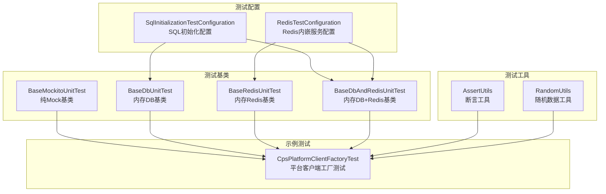
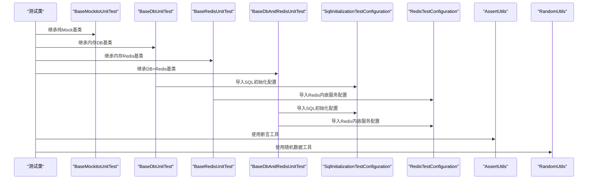
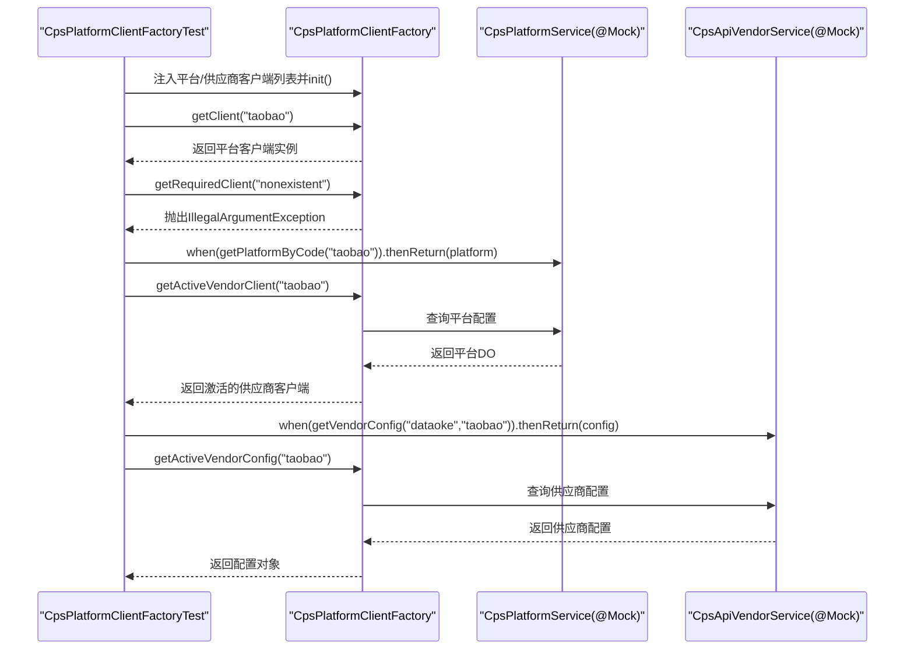
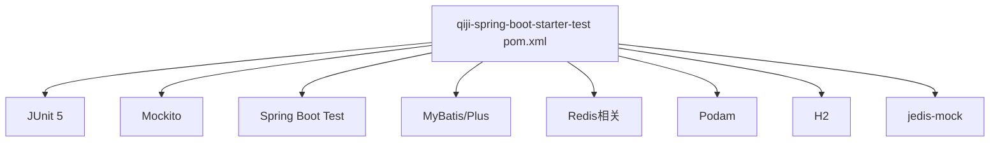

# 单元测试

<cite>
**本文引用的文件**
- [BaseMockitoUnitTest.java](file://backend/qiji-framework/qiji-spring-boot-starter-test/src/main/java/com/qiji/cps/framework/test/core/ut/BaseMockitoUnitTest.java)
- [BaseDbUnitTest.java](file://backend/qiji-framework/qiji-spring-boot-starter-test/src/main/java/com/qiji/cps/framework/test/core/ut/BaseDbUnitTest.java)
- [BaseDbAndRedisUnitTest.java](file://backend/qiji-framework/qiji-spring-boot-starter-test/src/main/java/com/qiji/cps/framework/test/core/ut/BaseDbAndRedisUnitTest.java)
- [BaseRedisUnitTest.java](file://backend/qiji-framework/qiji-spring-boot-starter-test/src/main/java/com/qiji/cps/framework/test/core/ut/BaseRedisUnitTest.java)
- [SqlInitializationTestConfiguration.java](file://backend/qiji-framework/qiji-spring-boot-starter-test/src/main/java/com/qiji/cps/framework/test/config/SqlInitializationTestConfiguration.java)
- [RedisTestConfiguration.java](file://backend/qiji-framework/qiji-spring-boot-starter-test/src/main/java/com/qiji/cps/framework/test/config/RedisTestConfiguration.java)
- [AssertUtils.java](file://backend/qiji-framework/qiji-spring-boot-starter-test/src/main/java/com/qiji/cps/framework/test/core/util/AssertUtils.java)
- [RandomUtils.java](file://backend/qiji-framework/qiji-spring-boot-starter-test/src/main/java/com/qiji/cps/framework/test/core/util/RandomUtils.java)
- [qiji-spring-boot-starter-test pom.xml](file://backend/qiji-framework/qiji-spring-boot-starter-test/pom.xml)
- [CpsPlatformClientFactoryTest.java](file://backend/qiji-module-cps/qiji-module-cps-biz/src/test/java/com/qiji/cps/module/cps/client/CpsPlatformClientFactoryTest.java)
</cite>

## 目录
1. [引言](#引言)
2. [项目结构](#项目结构)
3. [核心组件](#核心组件)
4. [架构总览](#架构总览)
5. [详细组件分析](#详细组件分析)
6. [依赖分析](#依赖分析)
7. [性能考虑](#性能考虑)
8. [故障排查指南](#故障排查指南)
9. [结论](#结论)
10. [附录](#附录)

## 引言
本指南面向AgenticCPS项目的开发者，提供基于JUnit 5与Mockito的单元测试实施规范与最佳实践。内容覆盖测试框架配置、Mock数据管理、断言与断言工具、测试用例设计（正常流程、异常场景、边界条件）、覆盖率建议以及可复用的测试基类与工具类。文中以CpsPlatformClientFactory等核心类为例，展示如何通过@Mock、@InjectMocks进行依赖注入测试，并结合项目内置的测试基类快速搭建纯Mock、内存数据库或内存Redis的测试环境。

## 项目结构
AgenticCPS的测试能力由“测试组件模块”统一提供，核心包括：
- 测试基类：纯Mock基类、内存数据库基类、内存Redis基类、数据库+Redis基类
- 测试配置：SQL初始化配置、Redis内嵌服务配置
- 测试工具：断言工具、随机数据生成工具
- 示例测试：CpsPlatformClientFactory路由逻辑测试

图表来源
- [BaseMockitoUnitTest.java:1-13](file://backend/qiji-framework/qiji-spring-boot-starter-test/src/main/java/com/qiji/cps/framework/test/core/ut/BaseMockitoUnitTest.java#L1-L13)
- [BaseDbUnitTest.java:1-47](file://backend/qiji-framework/qiji-spring-boot-starter-test/src/main/java/com/qiji/cps/framework/test/core/ut/BaseDbUnitTest.java#L1-L47)
- [BaseDbAndRedisUnitTest.java:1-55](file://backend/qiji-framework/qiji-spring-boot-starter-test/src/main/java/com/qiji/cps/framework/test/core/ut/BaseDbAndRedisUnitTest.java#L1-L55)
- [BaseRedisUnitTest.java:1-36](file://backend/qiji-framework/qiji-spring-boot-starter-test/src/main/java/com/qiji/cps/framework/test/core/ut/BaseRedisUnitTest.java#L1-L36)
- [SqlInitializationTestConfiguration.java:1-53](file://backend/qiji-framework/qiji-spring-boot-starter-test/src/main/java/com/qiji/cps/framework/test/config/SqlInitializationTestConfiguration.java#L1-L53)
- [RedisTestConfiguration.java:1-36](file://backend/qiji-framework/qiji-spring-boot-starter-test/src/main/java/com/qiji/cps/framework/test/config/RedisTestConfiguration.java#L1-L36)
- [AssertUtils.java:1-102](file://backend/qiji-framework/qiji-spring-boot-starter-test/src/main/java/com/qiji/cps/framework/test/core/util/AssertUtils.java#L1-L102)
- [RandomUtils.java:1-146](file://backend/qiji-framework/qiji-spring-boot-starter-test/src/main/java/com/qiji/cps/framework/test/core/util/RandomUtils.java#L1-L146)
- [CpsPlatformClientFactoryTest.java:1-186](file://backend/qiji-module-cps/qiji-module-cps-biz/src/test/java/com/qiji/cps/module/cps/client/CpsPlatformClientFactoryTest.java#L1-L186)

章节来源
- [BaseMockitoUnitTest.java:1-13](file://backend/qiji-framework/qiji-spring-boot-starter-test/src/main/java/com/qiji/cps/framework/test/core/ut/BaseMockitoUnitTest.java#L1-L13)
- [BaseDbUnitTest.java:1-47](file://backend/qiji-framework/qiji-spring-boot-starter-test/src/main/java/com/qiji/cps/framework/test/core/ut/BaseDbUnitTest.java#L1-L47)
- [BaseDbAndRedisUnitTest.java:1-55](file://backend/qiji-framework/qiji-spring-boot-starter-test/src/main/java/com/qiji/cps/framework/test/core/ut/BaseDbAndRedisUnitTest.java#L1-L55)
- [BaseRedisUnitTest.java:1-36](file://backend/qiji-framework/qiji-spring-boot-starter-test/src/main/java/com/qiji/cps/framework/test/core/ut/BaseRedisUnitTest.java#L1-L36)
- [SqlInitializationTestConfiguration.java:1-53](file://backend/qiji-framework/qiji-spring-boot-starter-test/src/main/java/com/qiji/cps/framework/test/config/SqlInitializationTestConfiguration.java#L1-L53)
- [RedisTestConfiguration.java:1-36](file://backend/qiji-framework/qiji-spring-boot-starter-test/src/main/java/com/qiji/cps/framework/test/config/RedisTestConfiguration.java#L1-L36)
- [AssertUtils.java:1-102](file://backend/qiji-framework/qiji-spring-boot-starter-test/src/main/java/com/qiji/cps/framework/test/core/util/AssertUtils.java#L1-L102)
- [RandomUtils.java:1-146](file://backend/qiji-framework/qiji-spring-boot-starter-test/src/main/java/com/qiji/cps/framework/test/core/util/RandomUtils.java#L1-L146)
- [CpsPlatformClientFactoryTest.java:1-186](file://backend/qiji-module-cps/qiji-module-cps-biz/src/test/java/com/qiji/cps/module/cps/client/CpsPlatformClientFactoryTest.java#L1-L186)

## 核心组件
- 纯Mock基类：启用Mockito JUnit扩展，适合仅需依赖注入与桩函数的单元测试。
- 内存数据库基类：导入数据源、MyBatis、SQL初始化配置，支持H2内存数据库，适合需要访问数据库但无需真实外设的测试。
- 内存Redis基类：导入Redis配置与内嵌Redis服务，适合缓存相关逻辑测试。
- 数据库+Redis基类：同时启用内存数据库与内存Redis，满足复杂场景。
- 断言工具：提供POJO字段对比、业务异常断言等便捷方法。
- 随机数据工具：基于Podam生成随机POJO，支持常见字段类型定制，便于构造测试数据。

章节来源
- [BaseMockitoUnitTest.java:1-13](file://backend/qiji-framework/qiji-spring-boot-starter-test/src/main/java/com/qiji/cps/framework/test/core/ut/BaseMockitoUnitTest.java#L1-L13)
- [BaseDbUnitTest.java:1-47](file://backend/qiji-framework/qiji-spring-boot-starter-test/src/main/java/com/qiji/cps/framework/test/core/ut/BaseDbUnitTest.java#L1-L47)
- [BaseDbAndRedisUnitTest.java:1-55](file://backend/qiji-framework/qiji-spring-boot-starter-test/src/main/java/com/qiji/cps/framework/test/core/ut/BaseDbAndRedisUnitTest.java#L1-L55)
- [BaseRedisUnitTest.java:1-36](file://backend/qiji-framework/qiji-spring-boot-starter-test/src/main/java/com/qiji/cps/framework/test/core/ut/BaseRedisUnitTest.java#L1-L36)
- [AssertUtils.java:1-102](file://backend/qiji-framework/qiji-spring-boot-starter-test/src/main/java/com/qiji/cps/framework/test/core/util/AssertUtils.java#L1-L102)
- [RandomUtils.java:1-146](file://backend/qiji-framework/qiji-spring-boot-starter-test/src/main/java/com/qiji/cps/framework/test/core/util/RandomUtils.java#L1-L146)

## 架构总览
下图展示了测试运行时的典型交互：测试类继承测试基类，通过Mockito注入依赖；若涉及数据库或缓存，基类负责导入相应配置并启动内嵌服务；断言工具与随机数据工具辅助验证与数据准备。

图表来源
- [BaseMockitoUnitTest.java:1-13](file://backend/qiji-framework/qiji-spring-boot-starter-test/src/main/java/com/qiji/cps/framework/test/core/ut/BaseMockitoUnitTest.java#L1-L13)
- [BaseDbUnitTest.java:1-47](file://backend/qiji-framework/qiji-spring-boot-starter-test/src/main/java/com/qiji/cps/framework/test/core/ut/BaseDbUnitTest.java#L1-L47)
- [BaseDbAndRedisUnitTest.java:1-55](file://backend/qiji-framework/qiji-spring-boot-starter-test/src/main/java/com/qiji/cps/framework/test/core/ut/BaseDbAndRedisUnitTest.java#L1-L55)
- [BaseRedisUnitTest.java:1-36](file://backend/qiji-framework/qiji-spring-boot-starter-test/src/main/java/com/qiji/cps/framework/test/core/ut/BaseRedisUnitTest.java#L1-L36)
- [SqlInitializationTestConfiguration.java:1-53](file://backend/qiji-framework/qiji-spring-boot-starter-test/src/main/java/com/qiji/cps/framework/test/config/SqlInitializationTestConfiguration.java#L1-L53)
- [RedisTestConfiguration.java:1-36](file://backend/qiji-framework/qiji-spring-boot-starter-test/src/main/java/com/qiji/cps/framework/test/config/RedisTestConfiguration.java#L1-L36)
- [AssertUtils.java:1-102](file://backend/qiji-framework/qiji-spring-boot-starter-test/src/main/java/com/qiji/cps/framework/test/core/util/AssertUtils.java#L1-L102)
- [RandomUtils.java:1-146](file://backend/qiji-framework/qiji-spring-boot-starter-test/src/main/java/com/qiji/cps/framework/test/core/util/RandomUtils.java#L1-L146)

## 详细组件分析

### 测试基类与配置
- 纯Mock基类：启用Mockito JUnit扩展，适合纯逻辑与依赖注入测试。
- 内存数据库基类：导入数据源、事务管理、MyBatis及Join配置，并通过SQL初始化配置在测试前后执行脚本清理。
- 内存Redis基类：导入Redis配置与内嵌Redis服务，确保测试期间缓存可用。
- 数据库+Redis基类：同时启用内存数据库与Redis，满足跨模块协作测试需求。
- SQL初始化配置：在禁用延迟初始化的前提下，按属性配置脚本位置与模式，实现测试前后的数据库状态一致性。
- Redis内嵌服务配置：启动内嵌RedisServer，避免端口冲突问题。

章节来源
- [BaseMockitoUnitTest.java:1-13](file://backend/qiji-framework/qiji-spring-boot-starter-test/src/main/java/com/qiji/cps/framework/test/core/ut/BaseMockitoUnitTest.java#L1-L13)
- [BaseDbUnitTest.java:1-47](file://backend/qiji-framework/qiji-spring-boot-starter-test/src/main/java/com/qiji/cps/framework/test/core/ut/BaseDbUnitTest.java#L1-L47)
- [BaseDbAndRedisUnitTest.java:1-55](file://backend/qiji-framework/qiji-spring-boot-starter-test/src/main/java/com/qiji/cps/framework/test/core/ut/BaseDbAndRedisUnitTest.java#L1-L55)
- [BaseRedisUnitTest.java:1-36](file://backend/qiji-framework/qiji-spring-boot-starter-test/src/main/java/com/qiji/cps/framework/test/core/ut/BaseRedisUnitTest.java#L1-L36)
- [SqlInitializationTestConfiguration.java:1-53](file://backend/qiji-framework/qiji-spring-boot-starter-test/src/main/java/com/qiji/cps/framework/test/config/SqlInitializationTestConfiguration.java#L1-L53)
- [RedisTestConfiguration.java:1-36](file://backend/qiji-framework/qiji-spring-boot-starter-test/src/main/java/com/qiji/cps/framework/test/config/RedisTestConfiguration.java#L1-L36)

### 断言工具与随机数据工具
- 断言工具：提供POJO字段逐项对比（可忽略指定字段）、业务异常断言（错误码与消息格式化校验），简化断言样板代码。
- 随机数据工具：基于Podam工厂生成随机POJO，内置字符串、整数、日期、布尔等类型的策略，支持集合与自定义消费者回调，便于构造多样化测试数据。

章节来源
- [AssertUtils.java:1-102](file://backend/qiji-framework/qiji-spring-boot-starter-test/src/main/java/com/qiji/cps/framework/test/core/util/AssertUtils.java#L1-L102)
- [RandomUtils.java:1-146](file://backend/qiji-framework/qiji-spring-boot-starter-test/src/main/java/com/qiji/cps/framework/test/core/util/RandomUtils.java#L1-L146)

### CpsPlatformClientFactory测试策略
该测试类演示了以下关键实践：
- 依赖注入：通过@Mock注入平台与供应商服务，通过@InjectMocks注入被测工厂。
- 反射注入：在@BeforeEach中通过反射向工厂注入平台客户端与供应商客户端列表，并调用初始化方法。
- 正常流程：验证getClient/getVendorClient/getActiveVendorClient等方法返回预期实例或空值。
- 异常场景：验证getRequiredClient在缺失平台时抛出非法参数异常。
- 边界条件：验证平台未设置activeVendorCode时默认使用特定供应商；验证注册平台编码集合包含预期值。
- 依赖行为：通过when(...).thenReturn(...)模拟服务层返回值，验证工厂的路由与选择逻辑。

图表来源
- [CpsPlatformClientFactoryTest.java:1-186](file://backend/qiji-module-cps/qiji-module-cps-biz/src/test/java/com/qiji/cps/module/cps/client/CpsPlatformClientFactoryTest.java#L1-L186)

章节来源
- [CpsPlatformClientFactoryTest.java:1-186](file://backend/qiji-module-cps/qiji-module-cps-biz/src/test/java/com/qiji/cps/module/cps/client/CpsPlatformClientFactoryTest.java#L1-L186)

### 依赖注入与Mock数据管理
- @Mock：用于声明外部依赖的桩对象，如服务层接口。
- @InjectMocks：用于声明被测对象，框架自动将@Mock注入到其依赖字段中。
- 反射注入：在setUp阶段通过反射向工厂注入客户端列表，绕过构造期限制，确保初始化后工厂具备完整路由信息。
- when(...).thenReturn(...)：用于定义桩行为，模拟外部服务返回值，隔离被测逻辑与外部副作用。

章节来源
- [CpsPlatformClientFactoryTest.java:1-186](file://backend/qiji-module-cps/qiji-module-cps-biz/src/test/java/com/qiji/cps/module/cps/client/CpsPlatformClientFactoryTest.java#L1-L186)

### 测试用例设计示例
- 正常流程测试：验证工厂能正确返回平台客户端、供应商客户端与激活配置。
- 异常场景测试：验证在缺少平台或供应商配置时抛出预期异常。
- 边界条件测试：验证默认供应商选择、注册平台编码集合等边界行为。
- 数据准备：使用随机数据工具生成请求对象与配置对象，减少手工构造成本。

章节来源
- [CpsPlatformClientFactoryTest.java:1-186](file://backend/qiji-module-cps/qiji-module-cps-biz/src/test/java/com/qiji/cps/module/cps/client/CpsPlatformClientFactoryTest.java#L1-L186)
- [RandomUtils.java:1-146](file://backend/qiji-framework/qiji-spring-boot-starter-test/src/main/java/com/qiji/cps/framework/test/core/util/RandomUtils.java#L1-L146)

## 依赖分析
测试模块依赖如下关键组件：
- JUnit 5与Mockito：提供测试框架与Mock能力。
- Spring Boot Test：提供@SpringBootTest与测试容器支持。
- MyBatis/MyBatis-Plus：提供ORM能力，配合H2内存数据库。
- Redis相关：提供Redis配置与内嵌Redis服务。
- Podam：提供随机POJO生成能力。
- H2：提供内存数据库能力。
- jedis-mock：提供内存Redis能力。

图表来源
- [qiji-spring-boot-starter-test pom.xml:1-61](file://backend/qiji-framework/qiji-spring-boot-starter-test/pom.xml#L1-L61)

章节来源
- [qiji-spring-boot-starter-test pom.xml:1-61](file://backend/qiji-framework/qiji-spring-boot-starter-test/pom.xml#L1-L61)

## 性能考虑
- 内存数据库与内存Redis：避免真实IO，提升测试执行速度。
- 禁用延迟初始化：测试配置中明确禁止延迟初始化，确保SQL初始化与Redis内嵌服务及时生效。
- 最小化外部依赖：优先使用@Mock与随机数据，减少真实网络或第三方服务调用。
- 合理的断言策略：使用断言工具进行批量字段对比，避免冗长的断言语句。

## 故障排查指南
- 端口占用导致Redis内嵌服务启动失败：内嵌Redis服务已处理重复启动导致的端口占用问题，若仍失败，请检查端口占用情况或重启测试进程。
- SQL初始化未生效：确认测试基类导入了SQL初始化配置，并且测试配置文件中启用了unit-test Profile。
- 断言失败：优先使用断言工具进行字段对比，核对忽略字段与期望值；对于业务异常，使用业务异常断言工具核对错误码与消息格式。

章节来源
- [RedisTestConfiguration.java:1-36](file://backend/qiji-framework/qiji-spring-boot-starter-test/src/main/java/com/qiji/cps/framework/test/config/RedisTestConfiguration.java#L1-L36)
- [SqlInitializationTestConfiguration.java:1-53](file://backend/qiji-framework/qiji-spring-boot-starter-test/src/main/java/com/qiji/cps/framework/test/config/SqlInitializationTestConfiguration.java#L1-L53)
- [AssertUtils.java:1-102](file://backend/qiji-framework/qiji-spring-boot-starter-test/src/main/java/com/qiji/cps/framework/test/core/util/AssertUtils.java#L1-L102)

## 结论
通过统一的测试基类与配置，AgenticCPS提供了灵活的测试运行时环境，既能满足纯Mock的快速验证，也能覆盖数据库与缓存的集成场景。结合断言工具与随机数据工具，开发者可以高效编写高质量的单元测试，确保核心业务逻辑（如平台客户端工厂）的稳定性与可维护性。

## 附录
- 测试覆盖率建议：建议核心业务逻辑达到较高覆盖率（如>80%），关键分支与异常路径必须覆盖。
- 断言方法使用：优先使用断言工具提供的POJO对比与业务异常断言，减少重复代码。
- 测试数据准备：优先使用随机数据工具生成多样化测试数据，必要时手动构造边界数据。
- 测试命名规范：测试方法使用语义化命名，清晰表达前置条件、输入与期望结果。