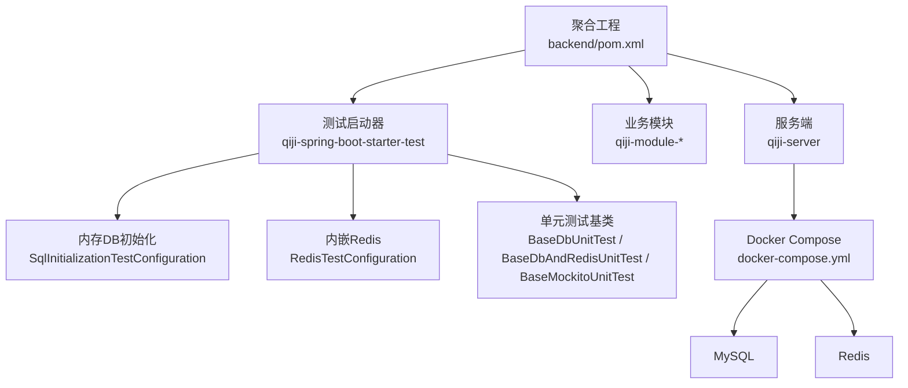
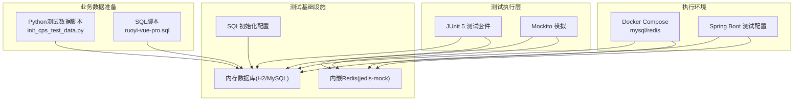
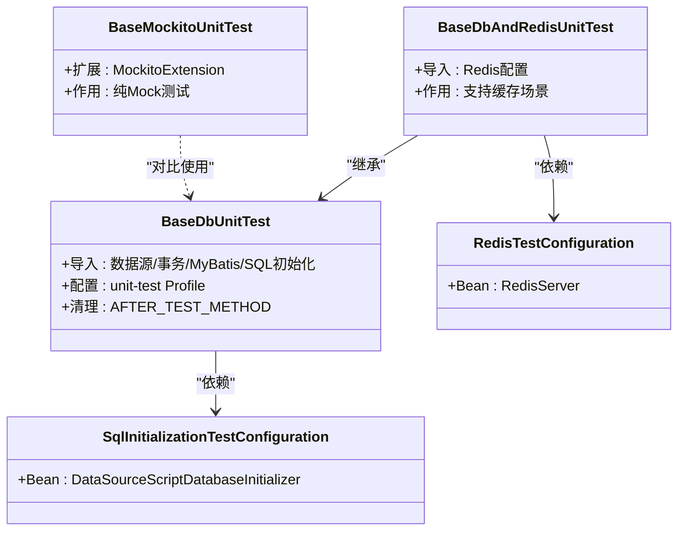
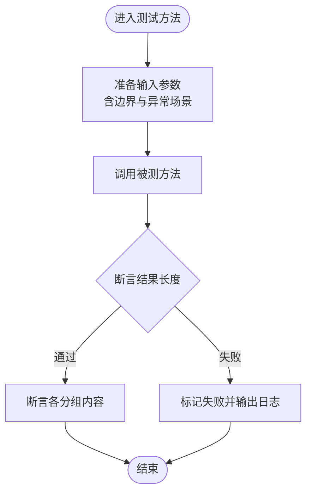
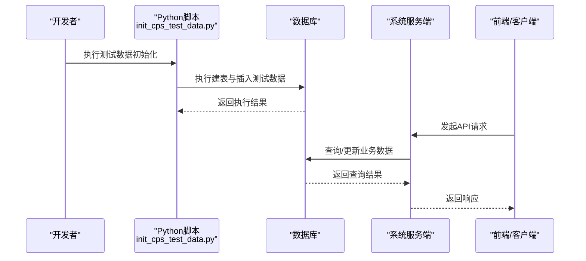
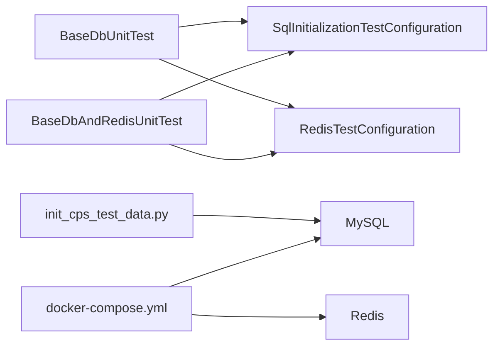

# 测试策略

<cite>
**本文引用的文件**
- [pom.xml](file://backend/pom.xml)
- [RedisTestConfiguration.java](file://backend/qiji-framework/qiji-spring-boot-starter-test/src/main/java/com/qiji/cps/framework/test/config/RedisTestConfiguration.java)
- [SqlInitializationTestConfiguration.java](file://backend/qiji-framework/qiji-spring-boot-starter-test/src/main/java/com/qiji/cps/framework/test/config/SqlInitializationTestConfiguration.java)
- [BaseDbUnitTest.java](file://backend/qiji-framework/qiji-spring-boot-starter-test/src/main/java/com/qiji/cps/framework/test/core/ut/BaseDbUnitTest.java)
- [BaseDbAndRedisUnitTest.java](file://backend/qiji-framework/qiji-spring-boot-starter-test/src/main/java/com/qiji/cps/framework/test/core/ut/BaseDbAndRedisUnitTest.java)
- [BaseMockitoUnitTest.java](file://backend/qiji-framework/qiji-spring-boot-starter-test/src/main/java/com/qiji/cps/framework/test/core/ut/BaseMockitoUnitTest.java)
- [CollectionUtilsTest.java](file://backend/qiji-framework/qiji-common/src/test/java/com/qiji/cps/framework/common/util/collection/CollectionUtilsTest.java)
- [docker-compose.yml](file://backend/script/docker/docker-compose.yml)
- [ruoyi-vue-pro.sql](file://backend/sql/mysql/ruoyi-vue-pro.sql)
- [init_cps_test_data.py](file://script/test/init_cps_test_data.py)
- [Jenkinsfile](file://backend/script/jenkins/Jenkinsfile)
</cite>

## 目录
1. [引言](#引言)
2. [项目结构](#项目结构)
3. [核心组件](#核心组件)
4. [架构总览](#架构总览)
5. [详细组件分析](#详细组件分析)
6. [依赖分析](#依赖分析)
7. [性能考虑](#性能考虑)
8. [故障排查指南](#故障排查指南)
9. [结论](#结论)
10. [附录](#附录)

## 引言
本测试策略面向AgenticCPS项目，旨在建立一套覆盖单元测试、业务逻辑测试、API接口测试、Mock数据管理、集成测试（含端到端、平台集成、AI功能、性能压力）、以及测试自动化（CI/CD集成、自动化脚本、报告与质量门禁）的完整保障体系。文档同时提供测试用例设计最佳实践（覆盖率、边界条件、异常场景、回归策略），并给出测试环境搭建、测试数据管理、执行监控与缺陷跟踪的全流程建议。

## 项目结构
AgenticCPS采用前后端分离与多模块聚合的Maven工程组织方式，后端以Spring Boot为基础，结合自研框架模块与业务模块；前端包含多个UniApp与Vue3应用；测试相关能力集中在后端框架模块中的“测试启动器”与脚本工具中。

- 后端聚合工程与模块划分
  - 聚合POM统一管理插件与依赖，启用maven-surefire-plugin以支持JUnit 5。
  - 测试启动器模块提供基于内存数据库与Redis的测试基类与配置。
  - 各业务模块（如AI、支付、交易、会员等）包含单元与集成测试。
  - Docker Compose提供本地联调环境，包含MySQL与Redis服务。
  - Python脚本负责初始化CPS测试数据（平台、供应商、推广位、返利、转链等）。

**图表来源**
- [pom.xml:59-142](file://backend/pom.xml#L59-L142)
- [SqlInitializationTestConfiguration.java:26-52](file://backend/qiji-framework/qiji-spring-boot-starter-test/src/main/java/com/qiji/cps/framework/test/config/SqlInitializationTestConfiguration.java#L26-L52)
- [RedisTestConfiguration.java:17-35](file://backend/qiji-framework/qiji-spring-boot-starter-test/src/main/java/com/qiji/cps/framework/test/config/RedisTestConfiguration.java#L17-L35)
- [BaseDbUnitTest.java:24-47](file://backend/qiji-framework/qiji-spring-boot-starter-test/src/main/java/com/qiji/cps/framework/test/core/ut/BaseDbUnitTest.java#L24-L47)
- [BaseDbAndRedisUnitTest.java:27-55](file://backend/qiji-framework/qiji-spring-boot-starter-test/src/main/java/com/qiji/cps/framework/test/core/ut/BaseDbAndRedisUnitTest.java#L27-L55)
- [BaseMockitoUnitTest.java:11-13](file://backend/qiji-framework/qiji-spring-boot-starter-test/src/main/java/com/qiji/cps/framework/test/core/ut/BaseMockitoUnitTest.java#L11-L13)
- [docker-compose.yml:5-57](file://backend/script/docker/docker-compose.yml#L5-L57)

**章节来源**
- [pom.xml:10-25](file://backend/pom.xml#L10-L25)
- [pom.xml:37-68](file://backend/pom.xml#L37-L68)
- [docker-compose.yml:1-85](file://backend/script/docker/docker-compose.yml#L1-L85)

## 核心组件
- 单元测试框架与基类
  - maven-surefire-plugin：启用JUnit 5，确保测试引擎兼容性。
  - BaseDbUnitTest：基于内存数据库的单元测试基类，导入数据源、MyBatis与SQL初始化配置。
  - BaseDbAndRedisUnitTest：在上述基础上增加内嵌Redis支持。
  - BaseMockitoUnitTest：纯Mockito扩展，适用于无需外部依赖的单元测试。
- 测试配置
  - SqlInitializationTestConfiguration：在测试环境下按配置初始化数据库脚本。
  - RedisTestConfiguration：启动内嵌Redis服务，避免端口冲突与容器生命周期问题。
- 示例测试
  - CollectionUtilsTest：展示如何编写参数化、断言清晰的单元测试。

**章节来源**
- [pom.xml:37-68](file://backend/pom.xml#L37-L68)
- [BaseDbUnitTest.java:24-47](file://backend/qiji-framework/qiji-spring-boot-starter-test/src/main/java/com/qiji/cps/framework/test/core/ut/BaseDbUnitTest.java#L24-L47)
- [BaseDbAndRedisUnitTest.java:27-55](file://backend/qiji-framework/qiji-spring-boot-starter-test/src/main/java/com/qiji/cps/framework/test/core/ut/BaseDbAndRedisUnitTest.java#L27-L55)
- [BaseMockitoUnitTest.java:11-13](file://backend/qiji-framework/qiji-spring-boot-starter-test/src/main/java/com/qiji/cps/framework/test/core/ut/BaseMockitoUnitTest.java#L11-L13)
- [SqlInitializationTestConfiguration.java:26-52](file://backend/qiji-framework/qiji-spring-boot-starter-test/src/main/java/com/qiji/cps/framework/test/config/SqlInitializationTestConfiguration.java#L26-L52)
- [RedisTestConfiguration.java:17-35](file://backend/qiji-framework/qiji-spring-boot-starter-test/src/main/java/com/qiji/cps/framework/test/config/RedisTestConfiguration.java#L17-L35)
- [CollectionUtilsTest.java:17-64](file://backend/qiji-framework/qiji-common/src/test/java/com/qiji/cps/framework/common/util/collection/CollectionUtilsTest.java#L17-L64)

## 架构总览
测试架构围绕“内存数据库+内嵌Redis+Spring Boot测试上下文”构建，配合Python脚本初始化真实业务数据，支撑端到端与平台集成测试。

**图表来源**
- [BaseDbUnitTest.java:29-43](file://backend/qiji-framework/qiji-spring-boot-starter-test/src/main/java/com/qiji/cps/framework/test/core/ut/BaseDbUnitTest.java#L29-L43)
- [BaseDbAndRedisUnitTest.java:32-51](file://backend/qiji-framework/qiji-spring-boot-starter-test/src/main/java/com/qiji/cps/framework/test/core/ut/BaseDbAndRedisUnitTest.java#L32-L51)
- [SqlInitializationTestConfiguration.java:34-39](file://backend/qiji-framework/qiji-spring-boot-starter-test/src/main/java/com/qiji/cps/framework/test/config/SqlInitializationTestConfiguration.java#L34-L39)
- [RedisTestConfiguration.java:25-33](file://backend/qiji-framework/qiji-spring-boot-starter-test/src/main/java/com/qiji/cps/framework/test/config/RedisTestConfiguration.java#L25-L33)
- [init_cps_test_data.py:382-413](file://script/test/init_cps_test_data.py#L382-L413)
- [ruoyi-vue-pro.sql:1-200](file://backend/sql/mysql/ruoyi-vue-pro.sql#L1-L200)
- [docker-compose.yml:5-57](file://backend/script/docker/docker-compose.yml#L5-L57)

## 详细组件分析

### 单元测试框架与基类
- 设计要点
  - 通过@Import引入数据源、事务、MyBatis与SQL初始化配置，确保每个测试在独立的内存数据库环境中执行。
  - 结合@Sql在测试方法后清理数据，避免跨用例污染。
  - 提供BaseDbAndRedisUnitTest以覆盖缓存交互场景。
  - BaseMockitoUnitTest用于纯逻辑单元测试，减少外部依赖。
- 最佳实践
  - 将复杂业务逻辑拆分为可测试的Service/Util方法，优先使用Mockito进行外部依赖隔离。
  - 对Mapper层使用内存数据库验证SQL与映射正确性。

**图表来源**
- [BaseDbUnitTest.java:24-47](file://backend/qiji-framework/qiji-spring-boot-starter-test/src/main/java/com/qiji/cps/framework/test/core/ut/BaseDbUnitTest.java#L24-L47)
- [BaseDbAndRedisUnitTest.java:27-55](file://backend/qiji-framework/qiji-spring-boot-starter-test/src/main/java/com/qiji/cps/framework/test/core/ut/BaseDbAndRedisUnitTest.java#L27-L55)
- [BaseMockitoUnitTest.java:11-13](file://backend/qiji-framework/qiji-spring-boot-starter-test/src/main/java/com/qiji/cps/framework/test/core/ut/BaseMockitoUnitTest.java#L11-L13)
- [SqlInitializationTestConfiguration.java:34-39](file://backend/qiji-framework/qiji-spring-boot-starter-test/src/main/java/com/qiji/cps/framework/test/config/SqlInitializationTestConfiguration.java#L34-L39)
- [RedisTestConfiguration.java:25-33](file://backend/qiji-framework/qiji-spring-boot-starter-test/src/main/java/com/qiji/cps/framework/test/config/RedisTestConfiguration.java#L25-L33)

**章节来源**
- [BaseDbUnitTest.java:24-47](file://backend/qiji-framework/qiji-spring-boot-starter-test/src/main/java/com/qiji/cps/framework/test/core/ut/BaseDbUnitTest.java#L24-L47)
- [BaseDbAndRedisUnitTest.java:27-55](file://backend/qiji-framework/qiji-spring-boot-starter-test/src/main/java/com/qiji/cps/framework/test/core/ut/BaseDbAndRedisUnitTest.java#L27-L55)
- [BaseMockitoUnitTest.java:11-13](file://backend/qiji-framework/qiji-spring-boot-starter-test/src/main/java/com/qiji/cps/framework/test/core/ut/BaseMockitoUnitTest.java#L11-L13)

### 业务逻辑测试
- 建议
  - 对工具类与算法进行充分的参数化测试，覆盖正常、边界与异常输入。
  - 使用断言组合验证多输出集合或元组，参考CollectionUtilsTest的分组断言模式。
- 示例参考
  - CollectionUtilsTest展示了对差异计算结果的三段式断言（新增/更新/删除）。

**图表来源**
- [CollectionUtilsTest.java:29-62](file://backend/qiji-framework/qiji-common/src/test/java/com/qiji/cps/framework/common/util/collection/CollectionUtilsTest.java#L29-L62)

**章节来源**
- [CollectionUtilsTest.java:17-64](file://backend/qiji-framework/qiji-common/src/test/java/com/qiji/cps/framework/common/util/collection/CollectionUtilsTest.java#L17-L64)

### API接口测试
- 建议
  - 在服务端侧使用@SpringBootTest加载Web环境，结合MockMvc或REST Assured发起HTTP请求。
  - 对认证、鉴权、参数校验、限流等横切关注点进行专项测试。
  - 对高频接口进行并发与超时测试，评估线程池与连接池配置。
- 集成点
  - 通过docker-compose拉起后端与前端，进行端到端交互验证。

**章节来源**
- [docker-compose.yml:29-78](file://backend/script/docker/docker-compose.yml#L29-L78)

### Mock数据管理
- 建议
  - 使用内存数据库与内嵌Redis作为测试基座，避免真实外部系统的脆弱性与不可重复性。
  - 对于需要真实第三方平台行为的场景，采用Mock客户端或本地代理，保证可控性。
- 实施
  - 通过SqlInitializationTestConfiguration与BaseDbUnitTest自动初始化与清理数据库。
  - 通过RedisTestConfiguration启动内嵌Redis，便于缓存相关测试。

**章节来源**
- [SqlInitializationTestConfiguration.java:26-52](file://backend/qiji-framework/qiji-spring-boot-starter-test/src/main/java/com/qiji/cps/framework/test/config/SqlInitializationTestConfiguration.java#L26-L52)
- [RedisTestConfiguration.java:17-35](file://backend/qiji-framework/qiji-spring-boot-starter-test/src/main/java/com/qiji/cps/framework/test/config/RedisTestConfiguration.java#L17-L35)
- [BaseDbUnitTest.java:24-47](file://backend/qiji-framework/qiji-spring-boot-starter-test/src/main/java/com/qiji/cps/framework/test/core/ut/BaseDbUnitTest.java#L24-L47)

### 集成测试策略
- 端到端测试
  - 使用Docker Compose启动MySQL、Redis与后端服务，再由前端或HTTP客户端发起请求，验证完整链路。
- 平台集成测试
  - 通过init_cps_test_data.py初始化平台、供应商、推广位、返利与转链等数据，覆盖多平台适配与返利计算。
- AI功能测试
  - 在AI模块中增加对LLM调用、工具调用与工作流的集成测试，必要时使用Mock服务。
- 性能压力测试
  - 使用JMeter或Gatling对关键接口进行并发压测，观察数据库连接池与Redis命中率。

**图表来源**
- [init_cps_test_data.py:382-413](file://script/test/init_cps_test_data.py#L382-L413)
- [ruoyi-vue-pro.sql:1-200](file://backend/sql/mysql/ruoyi-vue-pro.sql#L1-L200)

**章节来源**
- [init_cps_test_data.py:1-413](file://script/test/init_cps_test_data.py#L1-L413)
- [docker-compose.yml:5-57](file://backend/script/docker/docker-compose.yml#L5-L57)

### 测试自动化流程
- CI/CD集成
  - 使用Jenkinsfile定义流水线阶段：安装依赖、编译、单元测试、集成测试、打包与部署。
- 自动化测试脚本
  - 单元测试由maven-surefire-plugin驱动；集成测试可由Jenkins自由风格任务或Pipeline步骤触发。
- 测试报告与质量门禁
  - 建议生成JUnit XML与Surefire报告，并接入质量门禁（如覆盖率阈值、失败用例数上限）。
- 质量门禁建议
  - 用例通过率≥95%，关键模块分支覆盖率≥80%，阻塞性缺陷清零。

**章节来源**
- [Jenkinsfile](file://backend/script/jenkins/Jenkinsfile)

## 依赖分析
- 组件耦合
  - BaseDbUnitTest与BaseDbAndRedisUnitTest均依赖SqlInitializationTestConfiguration与RedisTestConfiguration，形成稳定的测试基座。
  - 测试基类与业务模块解耦，通过Spring Import机制注入配置，降低模块间耦合。
- 外部依赖
  - MySQL/Redis通过Docker Compose提供，Python脚本负责业务数据初始化，确保测试数据一致性与可重复性。

**图表来源**
- [BaseDbUnitTest.java:29-43](file://backend/qiji-framework/qiji-spring-boot-starter-test/src/main/java/com/qiji/cps/framework/test/core/ut/BaseDbUnitTest.java#L29-L43)
- [BaseDbAndRedisUnitTest.java:32-51](file://backend/qiji-framework/qiji-spring-boot-starter-test/src/main/java/com/qiji/cps/framework/test/core/ut/BaseDbAndRedisUnitTest.java#L32-L51)
- [SqlInitializationTestConfiguration.java:34-39](file://backend/qiji-framework/qiji-spring-boot-starter-test/src/main/java/com/qiji/cps/framework/test/config/SqlInitializationTestConfiguration.java#L34-L39)
- [RedisTestConfiguration.java:25-33](file://backend/qiji-framework/qiji-spring-boot-starter-test/src/main/java/com/qiji/cps/framework/test/config/RedisTestConfiguration.java#L25-L33)
- [init_cps_test_data.py:382-413](file://script/test/init_cps_test_data.py#L382-L413)
- [docker-compose.yml:5-57](file://backend/script/docker/docker-compose.yml#L5-L57)

**章节来源**
- [BaseDbUnitTest.java:24-47](file://backend/qiji-framework/qiji-spring-boot-starter-test/src/main/java/com/qiji/cps/framework/test/core/ut/BaseDbUnitTest.java#L24-L47)
- [BaseDbAndRedisUnitTest.java:27-55](file://backend/qiji-framework/qiji-spring-boot-starter-test/src/main/java/com/qiji/cps/framework/test/core/ut/BaseDbAndRedisUnitTest.java#L27-L55)

## 性能考虑
- 内存数据库与内嵌Redis可显著缩短测试执行时间，适合高频回归。
- 对高并发接口建议进行压力测试，观察数据库连接池与Redis连接池的饱和与抖动情况。
- 建议对热点查询与缓存失效策略进行专项压测，确保在峰值流量下的稳定性。

## 故障排查指南
- 单元测试失败
  - 检查测试基类是否正确导入配置；确认@Sql清理脚本是否执行；核对unit-test Profile是否生效。
- 数据库初始化失败
  - 核对SqlInitializationTestConfiguration的schema/data locations；检查ruoyi-vue-pro.sql是否完整。
- Redis端口冲突
  - 确认RedisTestConfiguration的端口未被占用；必要时调整端口或重启内嵌Redis实例。
- Python测试数据脚本异常
  - 关注init_cps_test_data.py的错误处理与回滚逻辑；检查数据库连接参数与SQL语法。

**章节来源**
- [SqlInitializationTestConfiguration.java:26-52](file://backend/qiji-framework/qiji-spring-boot-starter-test/src/main/java/com/qiji/cps/framework/test/config/SqlInitializationTestConfiguration.java#L26-L52)
- [RedisTestConfiguration.java:17-35](file://backend/qiji-framework/qiji-spring-boot-starter-test/src/main/java/com/qiji/cps/framework/test/config/RedisTestConfiguration.java#L17-L35)
- [init_cps_test_data.py:382-413](file://script/test/init_cps_test_data.py#L382-L413)
- [ruoyi-vue-pro.sql:1-200](file://backend/sql/mysql/ruoyi-vue-pro.sql#L1-L200)

## 结论
通过“内存数据库+内嵌Redis+Spring Boot测试基类”的测试基础设施，结合Python脚本与Docker Compose，AgenticCPS可以构建稳定、可重复、可扩展的测试体系。建议在持续集成中强制执行单元测试与关键集成测试，并以质量门禁保障交付质量。

## 附录
- 测试环境搭建清单
  - 安装JDK 17、Maven、Docker与Python3。
  - 启动docker-compose，等待MySQL与Redis就绪。
  - 执行init_cps_test_data.py初始化测试数据。
  - 运行mvn test执行单元测试。
- 测试数据管理
  - 使用Python脚本集中初始化平台、供应商、推广位、返利与转链数据，便于回归与演示。
- 执行监控与缺陷跟踪
  - 在CI中收集测试报告与覆盖率；对阻塞性缺陷进行闭环管理。