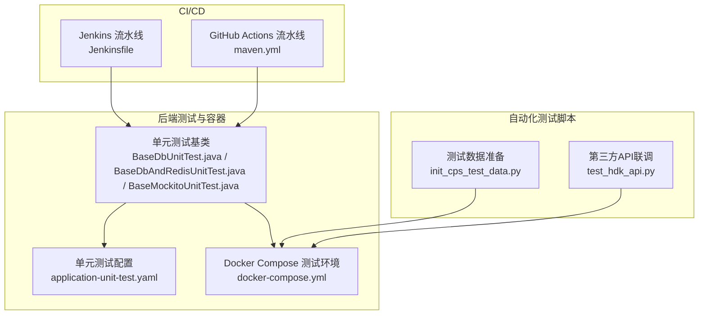
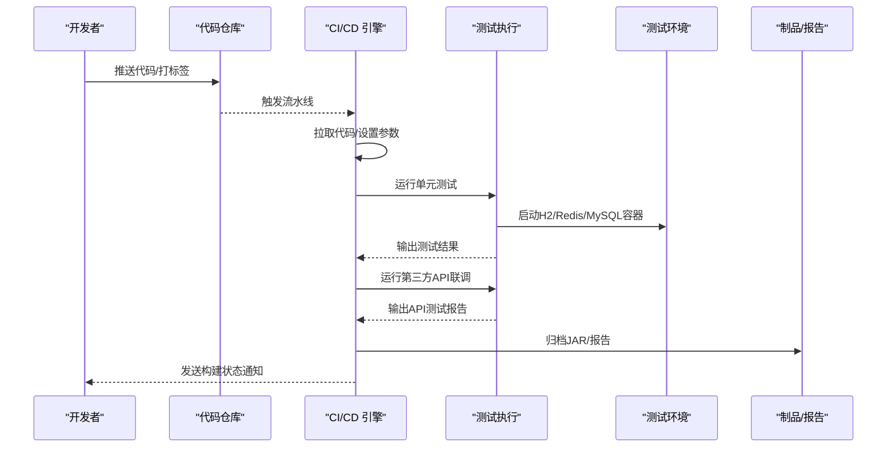
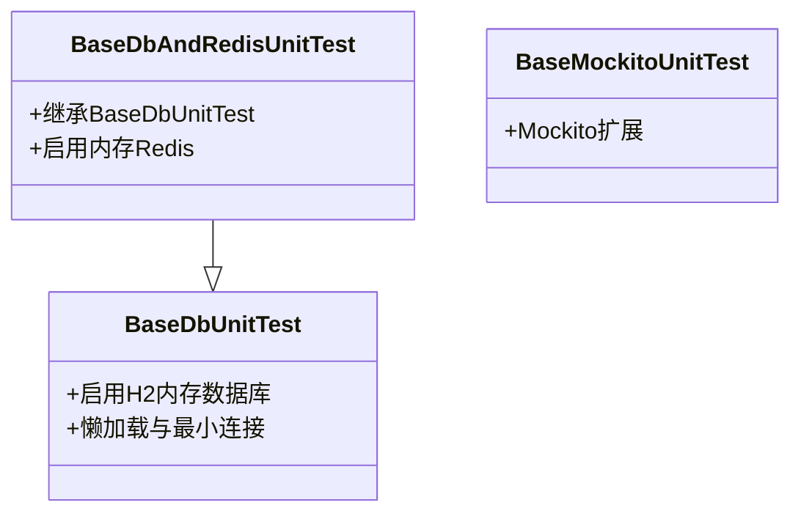
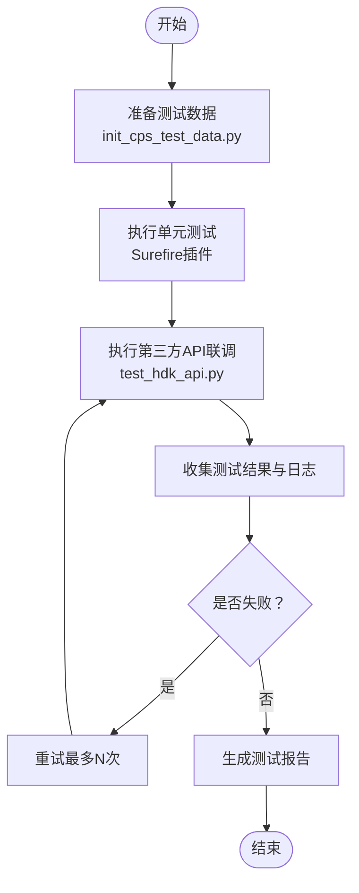
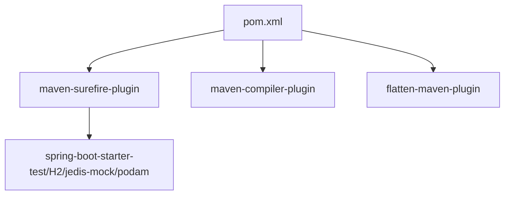

# 测试自动化

<cite>
**本文引用的文件**
- [Jenkinsfile](file://backend/script/jenkins/Jenkinsfile)
- [init_cps_test_data.py](file://script/test/init_cps_test_data.py)
- [test_hdk_api.py](file://script/test/test_hdk_api.py)
- [application-unit-test.yaml](file://backend/qiji-module-infra/src/test/resources/application-unit-test.yaml)
- [docker-compose.yml](file://backend/script/docker/docker-compose.yml)
- [pom.xml](file://backend/pom.xml)
- [BaseDbUnitTest.java](file://backend/qiji-framework/qiji-spring-boot-starter-test/src/main/java/com/qiji/cps/framework/test/core/ut/BaseDbUnitTest.java)
- [BaseDbAndRedisUnitTest.java](file://backend/qiji-framework/qiji-spring-boot-starter-test/src/main/java/com/qiji/cps/framework/test/core/ut/BaseDbAndRedisUnitTest.java)
- [BaseMockitoUnitTest.java](file://backend/qiji-framework/qiji-spring-boot-starter-test/src/main/java/com/qiji/cps/framework/test/core/ut/BaseMockitoUnitTest.java)
- [maven.yml](file://backend/.github/workflows/maven.yml)
</cite>

## 目录
1. [简介](#简介)
2. [项目结构](#项目结构)
3. [核心组件](#核心组件)
4. [架构总览](#架构总览)
5. [详细组件分析](#详细组件分析)
6. [依赖分析](#依赖分析)
7. [性能考虑](#性能考虑)
8. [故障排查指南](#故障排查指南)
9. [结论](#结论)
10. [附录](#附录)

## 简介
本文件面向AgenticCPS项目的测试自动化落地，提供从CI/CD集成、测试脚本编写、测试报告与质量门禁到测试环境自动化的完整实施框架。目标是实现：
- 自动化测试触发与构建状态监控
- 单元测试、接口测试、第三方API联调测试的标准化执行
- 测试覆盖率、性能测试、缺陷跟踪的自动化生成与分发
- 质量门禁（覆盖率阈值、构建成功率、缺陷密度）
- 测试环境一键搭建、测试数据自动准备、执行环境隔离

## 项目结构
AgenticCPS采用前后端分离与多模块后端架构，测试自动化涉及以下关键位置：
- 后端测试与容器化：backend/qiji-framework/qiji-spring-boot-starter-test 提供单元测试基类与配置；backend/script/docker 提供本地一键测试环境；backend/qiji-module-infra/src/test/resources 提供单元测试专用配置。
- CI/CD流水线：backend/script/jenkins/Jenkinsfile 定义Jenkins流水线；backend/.github/workflows/maven.yml 定义GitHub Actions流水线。
- 自动化测试脚本：script/test 下的Python脚本负责第三方API联调与测试数据准备。

**图表来源**
- [Jenkinsfile:1-61](file://backend/script/jenkins/Jenkinsfile#L1-L61)
- [maven.yml:1-30](file://backend/.github/workflows/maven.yml#L1-L30)
- [application-unit-test.yaml:1-51](file://backend/qiji-module-infra/src/test/resources/application-unit-test.yaml#L1-L51)
- [docker-compose.yml:1-85](file://backend/script/docker/docker-compose.yml#L1-L85)
- [BaseDbUnitTest.java:1-25](file://backend/qiji-framework/qiji-spring-boot-starter-test/src/main/java/com/qiji/cps/framework/test/core/ut/BaseDbUnitTest.java#L1-L25)
- [BaseDbAndRedisUnitTest.java:1-26](file://backend/qiji-framework/qiji-spring-boot-starter-test/src/main/java/com/qiji/cps/framework/test/core/ut/BaseDbAndRedisUnitTest.java#L1-L26)
- [BaseMockitoUnitTest.java:1-13](file://backend/qiji-framework/qiji-spring-boot-starter-test/src/main/java/com/qiji/cps/framework/test/core/ut/BaseMockitoUnitTest.java#L1-L13)
- [init_cps_test_data.py:1-413](file://script/test/init_cps_test_data.py#L1-L413)
- [test_hdk_api.py:1-205](file://script/test/test_hdk_api.py#L1-L205)

**章节来源**
- [pom.xml:1-176](file://backend/pom.xml#L1-L176)
- [docker-compose.yml:1-85](file://backend/script/docker/docker-compose.yml#L1-L85)

## 核心组件
- 单元测试基类与配置
  - BaseDbUnitTest：基于H2内存数据库的单元测试基类，配合application-unit-test.yaml启用内存数据库与Redis配置。
  - BaseDbAndRedisUnitTest：在上述基础上增加内存Redis支持。
  - BaseMockitoUnitTest：纯Mockito扩展，适用于Service层Mock场景。
- 测试数据准备脚本
  - init_cps_test_data.py：一键执行建表、平台/供应商配置、推广位、返利/冻结配置、订单/返利/账户、MCP Key与转链记录等测试数据初始化。
- 第三方API联调脚本
  - test_hdk_api.py：对好单库API进行搜索与推广链接转换的联调测试，包含多域名/路径尝试与响应字段校验。
- CI/CD流水线
  - Jenkinsfile：定义检出、构建、部署阶段，支持参数化构建与制品归档。
  - maven.yml：GitHub Actions流水线，多JDK矩阵构建与打包。
- 测试环境容器化
  - docker-compose.yml：一键拉起MySQL、Redis与后端服务，便于本地与CI中统一测试环境。

**章节来源**
- [BaseDbUnitTest.java:1-25](file://backend/qiji-framework/qiji-spring-boot-starter-test/src/main/java/com/qiji/cps/framework/test/core/ut/BaseDbUnitTest.java#L1-L25)
- [BaseDbAndRedisUnitTest.java:1-26](file://backend/qiji-framework/qiji-spring-boot-starter-test/src/main/java/com/qiji/cps/framework/test/core/ut/BaseDbAndRedisUnitTest.java#L1-L26)
- [BaseMockitoUnitTest.java:1-13](file://backend/qiji-framework/qiji-spring-boot-starter-test/src/main/java/com/qiji/cps/framework/test/core/ut/BaseMockitoUnitTest.java#L1-L13)
- [application-unit-test.yaml:1-51](file://backend/qiji-module-infra/src/test/resources/application-unit-test.yaml#L1-L51)
- [init_cps_test_data.py:1-413](file://script/test/init_cps_test_data.py#L1-L413)
- [test_hdk_api.py:1-205](file://script/test/test_hdk_api.py#L1-L205)
- [Jenkinsfile:1-61](file://backend/script/jenkins/Jenkinsfile#L1-L61)
- [maven.yml:1-30](file://backend/.github/workflows/maven.yml#L1-L30)
- [docker-compose.yml:1-85](file://backend/script/docker/docker-compose.yml#L1-L85)

## 架构总览
下图展示测试自动化在CI/CD中的整体流转：Jenkins/GitHub Actions触发构建，执行单元测试与第三方API联调，产出测试报告与制品，最终部署或归档。

**图表来源**
- [Jenkinsfile:1-61](file://backend/script/jenkins/Jenkinsfile#L1-L61)
- [maven.yml:1-30](file://backend/.github/workflows/maven.yml#L1-L30)
- [docker-compose.yml:1-85](file://backend/script/docker/docker-compose.yml#L1-L85)

## 详细组件分析

### CI/CD集成与流水线
- Jenkins流水线
  - 阶段划分：检出、构建、部署。构建阶段可扩展为“构建+测试”，部署阶段支持制品归档与远程部署。
  - 环境变量：镜像仓库、账号、应用名、部署路径等集中管理，便于跨环境复用。
  - 参数化：支持TAG_NAME等参数传入，便于灰度与发布控制。
- GitHub Actions流水线
  - 多JDK矩阵：同时在JDK 8/11/17上构建，确保兼容性。
  - 缓存：启用Maven缓存以提升构建速度。
- 建议增强
  - 在Jenkins中新增“测试”阶段，集成Maven Surefire插件执行单元测试与第三方API联调脚本。
  - 将测试报告与覆盖率指标上传至CI平台或外部系统，作为质量门禁依据。

**章节来源**
- [Jenkinsfile:1-61](file://backend/script/jenkins/Jenkinsfile#L1-L61)
- [maven.yml:1-30](file://backend/.github/workflows/maven.yml#L1-L30)

### 单元测试基类与配置
- BaseDbUnitTest
  - 作用：以H2内存数据库替代真实数据库，提升启动速度与隔离性。
  - 配置：application-unit-test.yaml启用内存数据库与Redis配置，设置懒加载与最小连接数。
- BaseDbAndRedisUnitTest
  - 作用：在内存数据库基础上增加内存Redis支持，适合需要缓存交互的场景。
- BaseMockitoUnitTest
  - 作用：为Service层Mock提供扩展点，便于隔离外部依赖。
- 建议
  - 在各模块的test/resources下放置独立的application-unit-test.yaml，避免相互污染。
  - 使用@ActiveProfiles("unit-test")确保测试加载正确配置。

**图表来源**
- [BaseDbUnitTest.java:1-25](file://backend/qiji-framework/qiji-spring-boot-starter-test/src/main/java/com/qiji/cps/framework/test/core/ut/BaseDbUnitTest.java#L1-L25)
- [BaseDbAndRedisUnitTest.java:1-26](file://backend/qiji-framework/qiji-spring-boot-starter-test/src/main/java/com/qiji/cps/framework/test/core/ut/BaseDbAndRedisUnitTest.java#L1-L26)
- [BaseMockitoUnitTest.java:1-13](file://backend/qiji-framework/qiji-spring-boot-starter-test/src/main/java/com/qiji/cps/framework/test/core/ut/BaseMockitoUnitTest.java#L1-L13)

**章节来源**
- [application-unit-test.yaml:1-51](file://backend/qiji-module-infra/src/test/resources/application-unit-test.yaml#L1-L51)
- [BaseDbUnitTest.java:1-25](file://backend/qiji-framework/qiji-spring-boot-starter-test/src/main/java/com/qiji/cps/framework/test/core/ut/BaseDbUnitTest.java#L1-L25)
- [BaseDbAndRedisUnitTest.java:1-26](file://backend/qiji-framework/qiji-spring-boot-starter-test/src/main/java/com/qiji/cps/framework/test/core/ut/BaseDbAndRedisUnitTest.java#L1-L26)
- [BaseMockitoUnitTest.java:1-13](file://backend/qiji-framework/qiji-spring-boot-starter-test/src/main/java/com/qiji/cps/framework/test/core/ut/BaseMockitoUnitTest.java#L1-L13)

### 自动化测试脚本编写规范
- 测试用例自动执行
  - 单元测试：通过Maven Surefire插件自动发现与执行，建议按模块拆分测试套件。
  - 第三方API联调：test_hdk_api.py提供示例，包含多域名/路径尝试与字段校验。
- 测试结果收集
  - 单元测试：Surefire插件生成XML报告，可接入CI平台。
  - 第三方API联调：脚本输出结构化日志，便于后续解析。
- 失败重试机制
  - 建议在CI中为第三方API联调添加重试策略（如最多3次），并区分网络异常与业务错误。
- 测试数据准备
  - init_cps_test_data.py提供一键初始化，包含建表、平台/供应商、推广位、返利/冻结配置、订单/返利/账户、MCP Key与转链记录等步骤。

**图表来源**
- [init_cps_test_data.py:1-413](file://script/test/init_cps_test_data.py#L1-L413)
- [test_hdk_api.py:1-205](file://script/test/test_hdk_api.py#L1-L205)

**章节来源**
- [test_hdk_api.py:1-205](file://script/test/test_hdk_api.py#L1-L205)
- [init_cps_test_data.py:1-413](file://script/test/init_cps_test_data.py#L1-L413)

### 测试报告生成自动化
- 单元测试报告
  - 使用Maven Surefire插件生成JUnit XML报告，可在CI平台中查看测试详情与统计。
- 第三方API联调报告
  - 建议将test_hdk_api.py的输出标准化为JSON格式，包含接口、状态码、耗时、字段校验结果等，便于后续解析与可视化。
- 覆盖率报告
  - 建议在CI中集成JaCoCo插件，生成覆盖率报告并上传至CI平台或覆盖率服务。
- 性能测试报告
  - 对关键API添加超时与吞吐统计，输出CSV/JSON报告，便于趋势分析。
- 缺陷跟踪报告
  - 将失败用例与日志关联到缺陷系统，形成闭环。

**章节来源**
- [pom.xml:59-142](file://backend/pom.xml#L59-L142)

### 质量门禁设置
- 代码覆盖率阈值
  - 建议在JaCoCo中设置最小覆盖率阈值（如总覆盖率≥80%，分支覆盖率≥70%），未达标则阻断合并。
- 构建成功率要求
  - 多JDK矩阵构建至少在一个版本上失败即视为失败；Jenkins流水线中可配置邮件/消息通知。
- 缺陷密度限制
  - 建议统计每千行代码缺陷数，设定阈值（如≤1），超过则阻断发布。
- 阈值配置建议
  - 在CI中通过环境变量或配置文件管理阈值，便于团队协商与调整。

**章节来源**
- [maven.yml:1-30](file://backend/.github/workflows/maven.yml#L1-L30)
- [pom.xml:59-142](file://backend/pom.xml#L59-L142)

### 测试环境自动搭建与隔离
- 本地一键环境
  - 使用docker-compose.yml一键拉起MySQL、Redis与后端服务，设置环境变量与卷挂载，保证与CI一致。
- CI执行环境
  - 在Jenkins/GitHub Actions中复用同一Compose文件，确保测试一致性。
- 数据隔离
  - 单元测试使用H2内存数据库；集成测试使用独立的MySQL实例；Redis使用内存实例或隔离数据库。
- 测试数据隔离
  - init_cps_test_data.py按前缀清理测试数据，避免跨分支/PR互相污染。

**章节来源**
- [docker-compose.yml:1-85](file://backend/script/docker/docker-compose.yml#L1-L85)
- [application-unit-test.yaml:1-51](file://backend/qiji-module-infra/src/test/resources/application-unit-test.yaml#L1-L51)
- [init_cps_test_data.py:1-413](file://script/test/init_cps_test_data.py#L1-L413)

## 依赖分析
- Maven插件与测试框架
  - maven-surefire-plugin：执行单元测试，需支持JUnit 5。
  - maven-compiler-plugin：配置注解处理器与参数编译选项。
  - flatten-maven-plugin：统一版本管理与清理。
- 单元测试依赖
  - spring-boot-starter-test、H2、jedis-mock、podam等，支撑内存数据库与Mock能力。
- CI依赖
  - Jenkins与GitHub Actions分别通过Jenkinsfile与maven.yml驱动构建。

**图表来源**
- [pom.xml:59-142](file://backend/pom.xml#L59-L142)

**章节来源**
- [pom.xml:59-142](file://backend/pom.xml#L59-L142)

## 性能考虑
- 单元测试性能
  - 使用H2内存数据库与懒加载配置，减少启动时间。
  - 最小化连接数与异步初始化，缩短测试总时长。
- API联调性能
  - 对第三方API添加超时与重试策略，避免长时间阻塞。
  - 并行执行不依赖共享资源的测试用例。
- 容器化测试
  - 使用Compose预热依赖服务，避免测试中重复启动。
  - 控制容器资源上限，防止CI节点资源争用。

## 故障排查指南
- 单元测试失败
  - 检查application-unit-test.yaml配置是否正确加载（profiles与数据源）。
  - 确认H2脚本初始化顺序与SQL语法。
- 第三方API联调失败
  - 检查API Key与域名白名单；确认SSL证书忽略仅用于测试环境。
  - 查看脚本输出的日志与HTTP状态码，定位具体接口与路径问题。
- CI构建失败
  - 查看Jenkins/GitHub Actions日志，确认插件版本与依赖缓存。
  - 检查覆盖率阈值与质量门禁配置是否过于严格。
- 环境问题
  - docker-compose服务端口冲突或卷权限问题，检查宿主机端口与目录权限。

**章节来源**
- [application-unit-test.yaml:1-51](file://backend/qiji-module-infra/src/test/resources/application-unit-test.yaml#L1-L51)
- [test_hdk_api.py:1-205](file://script/test/test_hdk_api.py#L1-L205)
- [Jenkinsfile:1-61](file://backend/script/jenkins/Jenkinsfile#L1-L61)
- [maven.yml:1-30](file://backend/.github/workflows/maven.yml#L1-L30)
- [docker-compose.yml:1-85](file://backend/script/docker/docker-compose.yml#L1-L85)

## 结论
通过以上实施框架，AgenticCPS可以实现从CI/CD到测试执行、报告与质量门禁的全链路自动化。建议优先落地：
- 在Jenkins/GitHub Actions中新增“测试”阶段，集成单元测试与第三方API联调。
- 统一测试报告格式并接入覆盖率与缺陷跟踪系统。
- 明确质量门禁阈值并在团队内达成共识。
- 持续优化测试环境与脚本，提升稳定性与可维护性。

## 附录
- 关键文件路径参考
  - Jenkins流水线：backend/script/jenkins/Jenkinsfile
  - GitHub Actions：backend/.github/workflows/maven.yml
  - 单元测试基类：backend/qiji-framework/qiji-spring-boot-starter-test/src/main/java/com/qiji/cps/framework/test/core/ut/*
  - 单元测试配置：backend/qiji-module-infra/src/test/resources/application-unit-test.yaml
  - 测试数据脚本：script/test/init_cps_test_data.py
  - API联调脚本：script/test/test_hdk_api.py
  - 测试环境：backend/script/docker/docker-compose.yml
  - Maven配置：backend/pom.xml