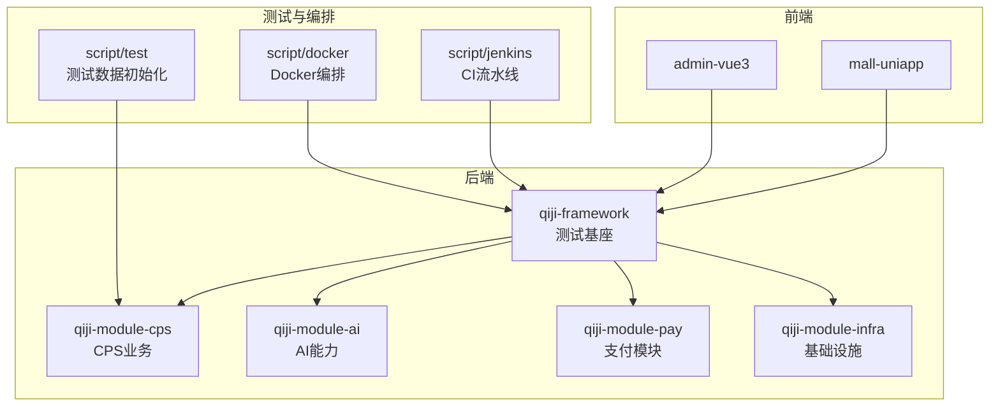
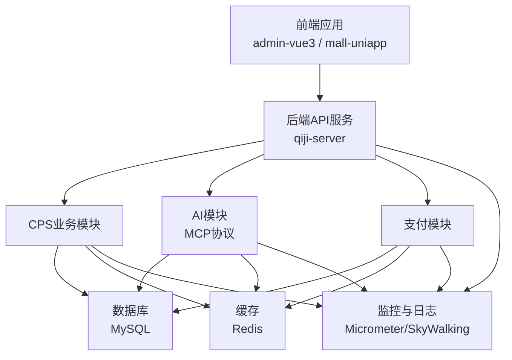
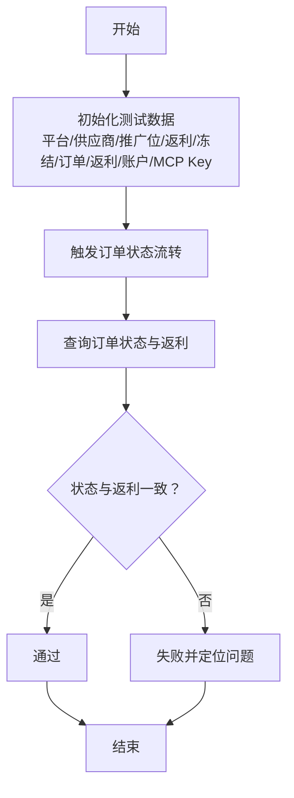
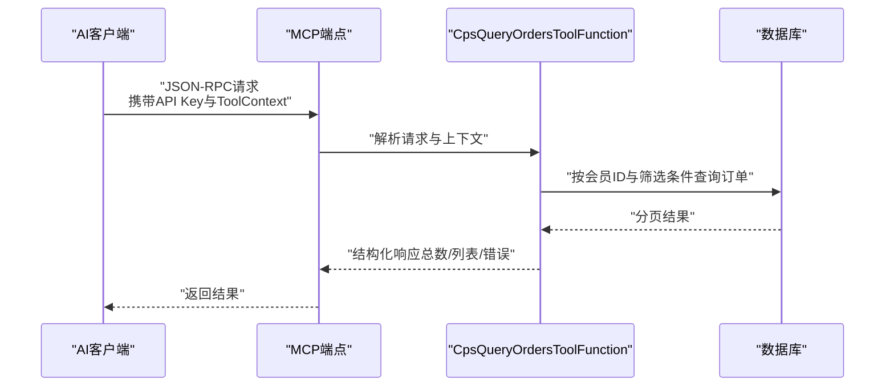
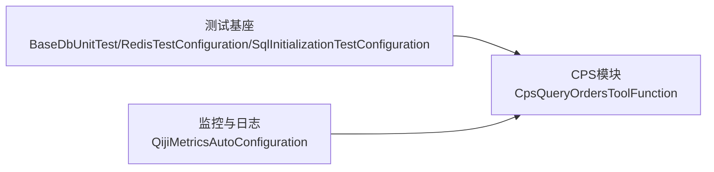

# 集成测试

<cite>
**本文引用的文件**   
- [init_cps_test_data.py](file://script/test/init_cps_test_data.py)
- [CpsQueryOrdersToolFunction.java](file://backend/qiji-module-cps/qiji-module-cps-biz/src/main/java/com/qiji/cps/module/cps/mcp/tool/CpsQueryOrdersToolFunction.java)
- [BaseDbUnitTest.java](file://backend/qiji-framework/qiji-spring-boot-starter-test/src/main/java/com/qiji/cps/framework/test/core/ut/BaseDbUnitTest.java)
- [SqlInitializationTestConfiguration.java](file://backend/qiji-framework/qiji-spring-boot-starter-test/src/main/java/com/qiji/cps/framework/test/config/SqlInitializationTestConfiguration.java)
- [RedisTestConfiguration.java](file://backend/qiji-framework/qiji-spring-boot-starter-test/src/main/java/com/qiji/cps/framework/test/config/RedisTestConfiguration.java)
- [docker-compose.yml](file://backend/script/docker/docker-compose.yml)
- [Docker-HOWTO.md](file://backend/script/docker/Docker-HOWTO.md)
- [CPS系统PRD文档.md](file://docs/CPS系统PRD文档.md)
- [AGENTS.md](file://AGENTS.md)
- [QijiMetricsAutoConfiguration.java](file://backend/qiji-framework/qiji-spring-boot-starter-monitor/src/main/java/com/qiji/cps/framework/tracer/config/QijiMetricsAutoConfiguration.java)
- [Jenkinsfile](file://backend/script/jenkins/Jenkinsfile)
</cite>

## 目录
1. [引言](#引言)
2. [项目结构](#项目结构)
3. [核心组件](#核心组件)
4. [架构总览](#架构总览)
5. [详细组件分析](#详细组件分析)
6. [依赖分析](#依赖分析)
7. [性能考虑](#性能考虑)
8. [故障排查指南](#故障排查指南)
9. [结论](#结论)
10. [附录](#附录)

## 引言
本文件面向AgenticCPS项目的集成测试，围绕端到端测试、平台集成测试、AI功能测试与性能压力测试四大部分，提供可落地的测试策略与实施步骤。重点覆盖CPS订单流程、AI聊天模型（MCP协议）、支付系统（基于现有模块的扩展思路）的完整链路测试；同时给出测试环境搭建、测试数据准备、测试执行与监控的全流程规范，确保系统各模块协同工作的质量。

## 项目结构
AgenticCPS采用前后端分离与多模块后端架构，核心与测试相关的目录如下：
- backend：后端工程，包含框架测试基座、业务模块（CPS、AI、支付、基础设施等），以及测试数据初始化脚本与Docker编排
- frontend：管理端与小程序前端
- script：测试脚本、Docker编排与CI流水线
- docs：产品文档与接口文档

**章节来源**
- [docker-compose.yml:1-85](file://backend/script/docker/docker-compose.yml#L1-L85)
- [Docker-HOWTO.md:1-50](file://backend/script/docker/Docker-HOWTO.md#L1-L50)

## 核心组件
- 测试基座（qiji-framework/test）：提供基于内存数据库与Redis的集成测试基类，支持SQL初始化与懒加载场景下的数据库初始化
- CPS业务（qiji-module-cps）：包含MCP工具（如订单查询）、平台/供应商配置、推广位、返利与冻结配置、订单与返利记录等
- AI模块（qiji-module-ai）：提供AI聊天与MCP协议对接能力（根据PRD与AGENTS文档）
- 支付模块（qiji-module-pay）：提供支付相关API与服务（用于端到端链路中的支付环节）
- 基础设施（qiji-module-infra）：提供配置、日志、定时任务等支撑能力
- 测试数据脚本（script/test）：一键初始化CPS全量测试数据，覆盖平台、供应商、推广位、返利/冻结配置、订单/返利/账户、MCP API Key与转链记录

**章节来源**
- [BaseDbUnitTest.java:1-47](file://backend/qiji-framework/qiji-spring-boot-starter-test/src/main/java/com/qiji/cps/framework/test/core/ut/BaseDbUnitTest.java#L1-L47)
- [SqlInitializationTestConfiguration.java:1-52](file://backend/qiji-framework/qiji-spring-boot-starter-test/src/main/java/com/qiji/cps/framework/test/config/SqlInitializationTestConfiguration.java#L1-L52)
- [RedisTestConfiguration.java:1-35](file://backend/qiji-framework/qiji-spring-boot-starter-test/src/main/java/com/qiji/cps/framework/test/config/RedisTestConfiguration.java#L1-L35)
- [init_cps_test_data.py:1-413](file://script/test/init_cps_test_data.py#L1-L413)

## 架构总览
下图展示端到端测试的关键链路：前端发起请求，后端API接收并路由至CPS订单与AI/MCP模块，AI通过MCP工具查询CPS订单，支付模块参与支付流程，数据经由数据库与Redis持久化，监控与日志贯穿全程。

**图表来源**
- [docker-compose.yml:5-85](file://backend/script/docker/docker-compose.yml#L5-L85)
- [QijiMetricsAutoConfiguration.java:1-27](file://backend/qiji-framework/qiji-spring-boot-starter-monitor/src/main/java/com/qiji/cps/framework/tracer/config/QijiMetricsAutoConfiguration.java#L1-L27)

## 详细组件分析

### 端到端测试：CPS订单流程
目标：验证从下单、支付、订单同步、返利计算到账户入账的完整链路，覆盖多平台（淘宝、京东、拼多多、抖音）与不同订单状态。

- 测试策略
  - 使用测试数据脚本初始化平台、供应商、推广位、返利/冻结配置、订单/返利/账户与MCP Key
  - 通过管理端或接口层触发订单状态流转（下单→付款→收货→结算→入账/退款/失效）
  - 校验订单状态与返利状态一致性、账户余额与冻结状态变化
  - 验证不同会员等级与平台优先级下的返利计算优先级

- 关键断言点
  - 订单状态流转顺序与时间戳
  - 返利金额计算与冻结/解冻逻辑
  - 会员账户总返利、可用余额、冻结余额
  - 平台默认与会员等级配置的优先级生效

- 测试数据准备
  - 使用测试脚本一次性导入全量测试数据，包含5种典型订单状态与对应返利记录

- 执行与监控
  - 在Docker环境中启动后端与数据库，执行集成测试用例，结合监控查看链路耗时与异常

**章节来源**
- [init_cps_test_data.py:382-413](file://script/test/init_cps_test_data.py#L382-L413)
- [CPS系统PRD文档.md:654-737](file://docs/CPS系统PRD文档.md#L654-L737)
- [AGENTS.md:182-226](file://AGENTS.md#L182-L226)

### 端到端测试：AI聊天模型与MCP协议
目标：验证AI Agent通过MCP协议调用CPS工具（如订单查询）与资源的能力，确保上下文传递、权限控制与响应格式正确。

- 测试策略
  - 使用测试数据脚本准备API Key与转链记录
  - 通过MCP端点发送JSON-RPC请求，携带API Key与ToolContext（含登录用户ID）
  - 调用工具函数（如订单查询），校验返回的订单列表、分页与错误信息
  - 验证不同权限级别（public/member/admin）与限流策略

- 关键断言点
  - ToolContext中用户ID提取与鉴权
  - 请求参数（平台、状态、分页）解析与默认值
  - 返回数据结构（总条数、订单列表字段）与错误信息
  - 访问日志记录（工具名、参数、耗时、客户端IP）

- 执行与监控
  - 在Docker环境中启动后端，使用HTTP客户端或MCP SDK发起请求，观察响应与访问日志

**图表来源**
- [CpsQueryOrdersToolFunction.java:120-157](file://backend/qiji-module-cps/qiji-module-cps-biz/src/main/java/com/qiji/cps/module/cps/mcp/tool/CpsQueryOrdersToolFunction.java#L120-L157)
- [AGENTS.md:182-188](file://AGENTS.md#L182-L188)

**章节来源**
- [CpsQueryOrdersToolFunction.java:1-169](file://backend/qiji-module-cps/qiji-module-cps-biz/src/main/java/com/qiji/cps/module/cps/mcp/tool/CpsQueryOrdersToolFunction.java#L1-L169)
- [AGENTS.md:182-226](file://AGENTS.md#L182-L226)

### 端到端测试：支付系统（扩展链路）
目标：验证支付流程与CPS订单、返利的协同，包括支付回调、订单状态更新与返利入账。

- 测试策略
  - 在测试数据中准备待支付订单
  - 模拟支付回调（或通过接口触发），校验订单状态更新与后续任务（如返利计算、冻结/解冻）
  - 校验账户余额与返利记录的最终一致性

- 关键断言点
  - 支付回调后订单状态变更
  - 返利计算与入账任务执行
  - 账户余额与明细的一致性

- 执行与监控
  - 在Docker环境中启动后端与数据库，执行支付链路测试用例

**章节来源**
- [CPS系统PRD文档.md:654-737](file://docs/CPS系统PRD文档.md#L654-L737)

### 平台集成测试：多平台API调用、数据同步与错误处理
目标：验证CPS对多平台（淘宝、京东、拼多多、抖音）的适配，包括API调用、数据同步与错误处理。

- 测试策略
  - 使用测试数据脚本准备平台与供应商配置，覆盖默认PID、聚合商与官方平台
  - 验证推广位（通用/渠道/会员专属）与不同平台的适配
  - 模拟平台API异常与网络波动，验证重试、降级与错误日志

- 关键断言点
  - 平台默认PID与渠道/会员专属推广位生效
  - 供应商优先级与聚合策略
  - 错误处理与访问日志记录

**章节来源**
- [init_cps_test_data.py:95-138](file://script/test/init_cps_test_data.py#L95-L138)
- [CPS系统PRD文档.md:654-737](file://docs/CPS系统PRD文档.md#L654-L737)

### AI功能测试：工具函数调用与Agent交互
目标：验证AI Agent与MCP工具的交互，包括参数解析、上下文传递、权限与限流控制。

- 测试策略
  - 使用测试数据脚本准备API Key与转链记录
  - 发起多种参数组合的工具调用，覆盖默认值、边界值与非法值
  - 验证不同权限级别与过期Key的行为

- 关键断言点
  - ToolContext中用户ID提取
  - 请求参数解析与默认值
  - 错误信息与访问日志

**章节来源**
- [CpsQueryOrdersToolFunction.java:120-157](file://backend/qiji-module-cps/qiji-module-cps-biz/src/main/java/com/qiji/cps/module/cps/mcp/tool/CpsQueryOrdersToolFunction.java#L120-L157)
- [init_cps_test_data.py:329-376](file://script/test/init_cps_test_data.py#L329-L376)

## 依赖分析
- 测试基座依赖：内存数据库与Redis配置、SQL初始化、懒加载场景下的数据库初始化
- CPS模块依赖：数据库与缓存，MCP工具函数依赖Mapper与分页查询
- 监控与日志：Micrometer与SkyWalking配置，统一标签与Prometheus导出

**图表来源**
- [BaseDbUnitTest.java:29-45](file://backend/qiji-framework/qiji-spring-boot-starter-test/src/main/java/com/qiji/cps/framework/test/core/ut/BaseDbUnitTest.java#L29-L45)
- [RedisTestConfiguration.java:25-33](file://backend/qiji-framework/qiji-spring-boot-starter-test/src/main/java/com/qiji/cps/framework/test/config/RedisTestConfiguration.java#L25-L33)
- [SqlInitializationTestConfiguration.java:34-39](file://backend/qiji-framework/qiji-spring-boot-starter-test/src/main/java/com/qiji/cps/framework/test/config/SqlInitializationTestConfiguration.java#L34-L39)
- [QijiMetricsAutoConfiguration.java:21-25](file://backend/qiji-framework/qiji-spring-boot-starter-monitor/src/main/java/com/qiji/cps/framework/tracer/config/QijiMetricsAutoConfiguration.java#L21-L25)

**章节来源**
- [BaseDbUnitTest.java:1-47](file://backend/qiji-framework/qiji-spring-boot-starter-test/src/main/java/com/qiji/cps/framework/test/core/ut/BaseDbUnitTest.java#L1-L47)
- [RedisTestConfiguration.java:1-35](file://backend/qiji-framework/qiji-spring-boot-starter-test/src/main/java/com/qiji/cps/framework/test/config/RedisTestConfiguration.java#L1-L35)
- [SqlInitializationTestConfiguration.java:1-52](file://backend/qiji-framework/qiji-spring-boot-starter-test/src/main/java/com/qiji/cps/framework/test/config/SqlInitializationTestConfiguration.java#L1-L52)
- [QijiMetricsAutoConfiguration.java:1-27](file://backend/qiji-framework/qiji-spring-boot-starter-monitor/src/main/java/com/qiji/cps/framework/tracer/config/QijiMetricsAutoConfiguration.java#L1-L27)

## 性能考虑
- 并发测试
  - 使用压测工具对MCP端点与CPS订单查询接口施加并发负载，观察响应时间与错误率
  - 关注数据库连接池与Redis热点键的瓶颈
- 负载测试
  - 逐步提升并发与数据规模，评估系统在高负载下的稳定性与资源消耗
- 稳定性测试
  - 模拟平台API抖动与超时，验证熔断、重试与降级策略
- 监控与指标
  - 通过Micrometer与Prometheus采集关键指标（请求量、错误率、P95/P99时延、线程池与连接池利用率）
  - 使用SkyWalking进行链路追踪与异常告警

**章节来源**
- [QijiMetricsAutoConfiguration.java:21-25](file://backend/qiji-framework/qiji-spring-boot-starter-monitor/src/main/java/com/qiji/cps/framework/tracer/config/QijiMetricsAutoConfiguration.java#L21-L25)
- [Jenkinsfile:1-41](file://backend/script/jenkins/Jenkinsfile#L1-L41)

## 故障排查指南
- 测试环境问题
  - 使用Docker编排快速拉起MySQL与Redis，检查端口映射与卷挂载
  - 如需本地开发，参考Docker构建与启动命令
- 数据初始化失败
  - 确认数据库连接参数与SQL脚本路径
  - 检查测试脚本的建表与插入逻辑，关注重复键与表存在性处理
- MCP工具调用异常
  - 校验API Key状态与权限级别，确认ToolContext中用户ID传递
  - 查看访问日志表记录，定位请求参数与耗时
- 监控与日志
  - 启用Micrometer与Prometheus导出，结合SkyWalking查看链路拓扑与慢调用

**章节来源**
- [docker-compose.yml:1-85](file://backend/script/docker/docker-compose.yml#L1-L85)
- [Docker-HOWTO.md:21-42](file://backend/script/docker/Docker-HOWTO.md#L21-L42)
- [init_cps_test_data.py:382-413](file://script/test/init_cps_test_data.py#L382-L413)
- [AGENTS.md:182-188](file://AGENTS.md#L182-L188)

## 结论
通过测试基座提供的内存数据库与Redis能力、全量测试数据脚本与Docker编排，AgenticCPS能够高效地开展端到端与平台集成测试。配合MCP协议与AI工具函数的专项测试，以及性能与稳定性测试，可全面保障CPS订单流程、AI交互与支付链路的质量与可靠性。

## 附录

### 测试环境搭建与执行流程
- 环境准备
  - 使用Docker Compose一键启动MySQL与Redis，并构建后端服务
  - 在本地或CI中设置数据库连接参数与Redis地址
- 数据准备
  - 执行测试数据初始化脚本，生成平台、供应商、推广位、返利/冻结、订单/返利/账户与MCP Key
- 执行测试
  - 在测试基座上编写集成测试用例，使用内存数据库与Redis进行隔离测试
  - 对MCP端点与CPS接口进行链路测试与并发测试
- 监控与报告
  - 启用Micrometer与Prometheus，结合SkyWalking进行链路追踪与异常告警
  - 在CI中集成Jenkins流水线，自动化构建与测试

**章节来源**
- [docker-compose.yml:1-85](file://backend/script/docker/docker-compose.yml#L1-L85)
- [Docker-HOWTO.md:21-42](file://backend/script/docker/Docker-HOWTO.md#L21-L42)
- [init_cps_test_data.py:1-413](file://script/test/init_cps_test_data.py#L1-L413)
- [Jenkinsfile:1-41](file://backend/script/jenkins/Jenkinsfile#L1-L41)