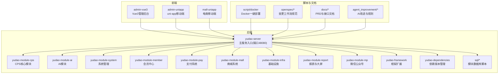
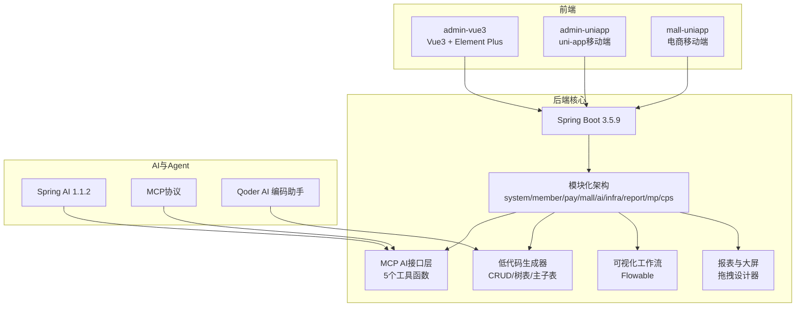
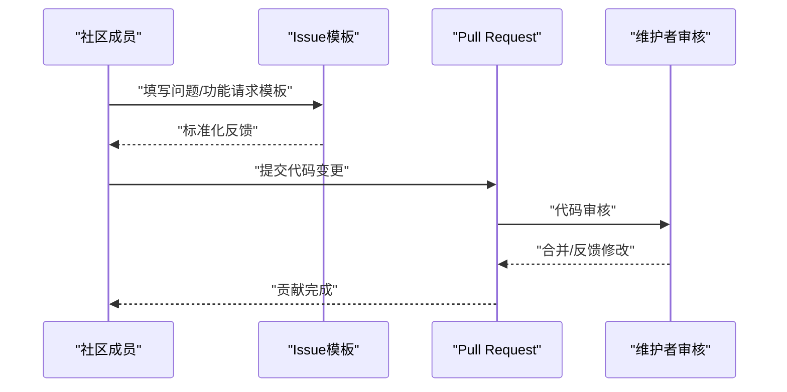
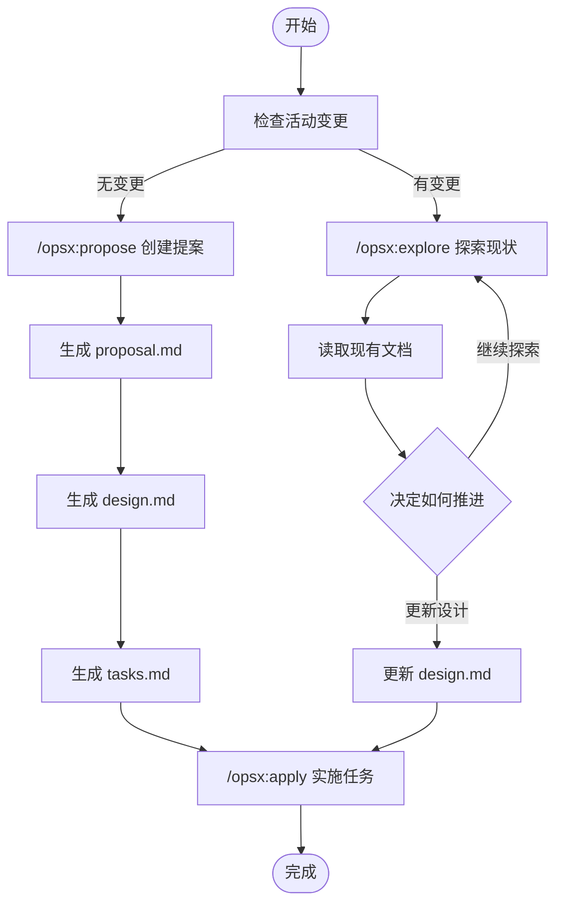
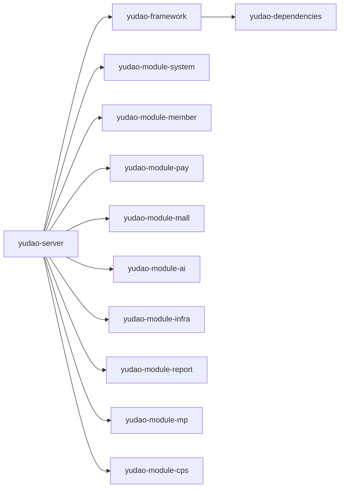
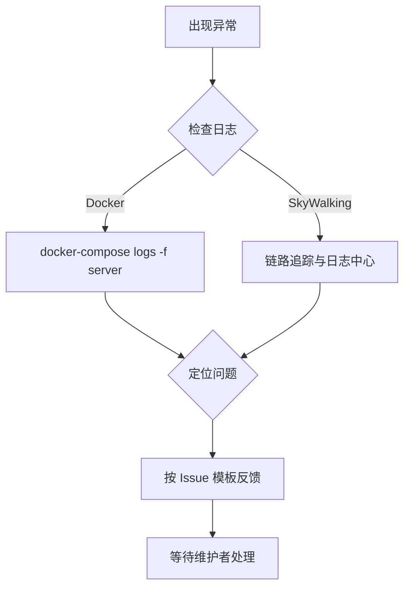

# 社区支持

<cite>
**本文引用的文件**
- [README.md](file://README.md)
- [backend/README.md](file://backend/README.md)
- [AGENTS.md](file://AGENTS.md)
- [agent_improvement/memory/MEMORY.md](file://agent_improvement/memory/MEMORY.md)
- [agent_improvement/memory/codegen-rules.md](file://agent_improvement/memory/codegen-rules.md)
- [backend/.gitee/ISSUE_TEMPLATE.zh-CN.md](file://backend/.gitee/ISSUE_TEMPLATE.zh-CN.md)
- [openspec/config.yaml](file://openspec/config.yaml)
- [.claude/commands/opsx/propose.md](file://.claude/commands/opsx/propose.md)
- [.claude/commands/opsx/apply.md](file://.claude/commands/opsx/apply.md)
- [.claude/skills/openspec-explore/SKILL.md](file://.claude/skills/openspec-explore/SKILL.md)
- [.claude/skills/openspec-apply-change/SKILL.md](file://.claude/skills/openspec-apply-change/SKILL.md)
- [frontend/admin-uniapp/README.md](file://frontend/admin-uniapp/README.md)
- [docs/CPS系统PRD文档.md](file://docs/CPS系统PRD文档.md)
- [docs/好单库OpenAPI接口文档.md](file://docs/好单库OpenAPI接口文档.md)
</cite>

## 目录
1. [简介](#简介)
2. [项目结构](#项目结构)
3. [核心组件](#核心组件)
4. [架构总览](#架构总览)
5. [详细组件分析](#详细组件分析)
6. [依赖分析](#依赖分析)
7. [性能考虑](#性能考虑)
8. [故障排查指南](#故障排查指南)
9. [结论](#结论)
10. [附录](#附录)

## 简介
AgenticCPS 是一个融合“氛围编程（Vibe Coding）”“低代码”“AI 自主编程”的智能 CPS 联盟返利与导购平台，面向一人公司（OPC）、自由职业者与小型工作室，提供“零代码启动、对话式开发、全自动运营”的一体化解决方案。项目采用 AGPL-3.0 开源协议，提供多平台接入、AI MCP 工具、低代码生成器、可视化工作流与报表大屏等能力，帮助用户以极低门槛实现从搜索到返利提现的完整闭环。

## 项目结构
项目采用前后端分离与模块化架构，后端基于 Spring Boot 3.5.9，前端提供 Vue3 管理后台与 uni-app 移动端，同时内置 Docker 一键部署脚本与丰富的技术栈生态。

**图表来源**
- [AGENTS.md:13-62](file://AGENTS.md#L13-L62)
- [backend/README.md:261-296](file://backend/README.md#L261-L296)
- [README.md:267-284](file://README.md#L267-L284)

**章节来源**
- [AGENTS.md:11-62](file://AGENTS.md#L11-L62)
- [backend/README.md:261-296](file://backend/README.md#L261-L296)
- [README.md:267-284](file://README.md#L267-L284)

## 核心组件
- 社区交流与支持
  - 微信群：技术交流、Bug 反馈、功能建议
  - 知识星球：深度教程、源码解析、运营经验分享与专属答疑
  - 微信：添加群主，备注“进技术交流群”
- 开源协议与赞助
  - AGPL-3.0：允许个人学习、内部企业使用、商业二次开发（需开源）、对外提供 SaaS 服务（需开源修改部分）、禁止闭源商业化分发
  - 赞助方式：微信支付/支付宝；企业赞助分级回报（青铜/白银/黄金/钻石）
- 功能悬赏
  - 当前悬赏：智能推送（¥1000，待开发）
  - 规则：认领任务 → 开发周期协商（一般2-4周）→ 代码审核 → 合并后3个工作日内发放赏金
- 学习资源
  - 视频教程：前端启动文档与视频教程链接
  - 技术文档：PRD 与 OpenAPI 接口文档
  - 在线课程：可结合技术栈与框架文档进行系统学习

**章节来源**
- [README.md:450-465](file://README.md#L450-L465)
- [README.md:468-481](file://README.md#L468-L481)
- [README.md:484-518](file://README.md#L484-L518)
- [README.md:521-546](file://README.md#L521-L546)
- [frontend/admin-uniapp/README.md:42-44](file://frontend/admin-uniapp/README.md#L42-L44)
- [docs/CPS系统PRD文档.md](file://docs/CPS系统PRD文档.md)
- [docs/好单库OpenAPI接口文档.md](file://docs/好单库OpenAPI接口文档.md)

## 架构总览
AgenticCPS 的整体架构围绕“后端模块化 + 前端多端 + AI MCP 接口 + 低代码生成器 + 可视化工作流与报表”的组合展开，后端通过 Spring Boot 与多模块划分实现高内聚低耦合，前端提供统一的管理后台与移动端体验，AI 通过 MCP 协议直接调用系统能力，低代码与可视化工具降低开发门槛。

**图表来源**
- [AGENTS.md:15-42](file://AGENTS.md#L15-L42)
- [backend/README.md:280-296](file://backend/README.md#L280-L296)
- [README.md:84-144](file://README.md#L84-L144)

**章节来源**
- [AGENTS.md:15-42](file://AGENTS.md#L15-L42)
- [backend/README.md:280-296](file://backend/README.md#L280-L296)
- [README.md:84-144](file://README.md#L84-L144)

## 详细组件分析

### 社区支持与贡献指南
- 交流渠道
  - 微信群：技术交流、Bug 反馈、功能建议
  - 知识星球：深度教程、源码解析、运营经验分享与专属答疑
  - 微信：添加群主，备注“进技术交流群”
- 问题反馈与功能建议
  - 使用 Issue 模板进行标准化反馈，确保问题可复现与可定位
  - 在 Issues 中创建功能请求并标注“💰 悬赏”标签，参与功能悬赏计划
- 代码贡献流程
  - Fork 仓库 → 创建分支（Feat_xxx）→ 提交代码 → 发起 Pull Request
  - 遵循 AGPL-3.0 协议，二次开发需开源修改部分
- 文档贡献方式
  - 通过 PR 提交文档更新，保持与代码同步
  - 参考 PRD 与 OpenAPI 文档，确保文档准确性与一致性

**图表来源**
- [backend/.gitee/ISSUE_TEMPLATE.zh-CN.md:1-26](file://backend/.gitee/ISSUE_TEMPLATE.zh-CN.md#L1-L26)
- [README.md:521-546](file://README.md#L521-L546)

**章节来源**
- [README.md:450-465](file://README.md#L450-L465)
- [backend/.gitee/ISSUE_TEMPLATE.zh-CN.md:1-26](file://backend/.gitee/ISSUE_TEMPLATE.zh-CN.md#L1-L26)
- [README.md:521-546](file://README.md#L521-L546)

### 项目治理与决策流程
- 变更工作流（openspec）
  - 提案阶段：/opsx:propose 创建变更提案，生成 proposal.md、design.md、tasks.md
  - 探索阶段：/opsx:explore 检查现有变更，阅读 proposal/design/tasks 等文档
  - 实施阶段：/opsx:apply 读取上下文文件，按任务逐步实施并标记完成
- 工作流规范
  - openspec/config.yaml：定义 spec-driven 工作流与项目上下文
  - 变更状态检查：通过 openspec list/status 获取活动变更与依赖关系
  - 任务推进：按依赖顺序创建与更新文档，确保 apply-ready

**图表来源**
- [.claude/commands/opsx/propose.md:19-106](file://.claude/commands/opsx/propose.md#L19-L106)
- [.claude/commands/opsx/apply.md:14-84](file://.claude/commands/opsx/apply.md#L14-L84)
- [.claude/skills/openspec-explore/SKILL.md:82-134](file://.claude/skills/openspec-explore/SKILL.md#L82-L134)
- [.claude/skills/openspec-apply-change/SKILL.md:16-88](file://.claude/skills/openspec-apply-change/SKILL.md#L16-L88)
- [openspec/config.yaml:1-20](file://openspec/config.yaml#L1-L20)

**章节来源**
- [.claude/commands/opsx/propose.md:19-106](file://.claude/commands/opsx/propose.md#L19-L106)
- [.claude/commands/opsx/apply.md:14-84](file://.claude/commands/opsx/apply.md#L14-L84)
- [.claude/skills/openspec-explore/SKILL.md:82-134](file://.claude/skills/openspec-explore/SKILL.md#L82-L134)
- [.claude/skills/openspec-apply-change/SKILL.md:16-88](file://.claude/skills/openspec-apply-change/SKILL.md#L16-L88)
- [openspec/config.yaml:1-20](file://openspec/config.yaml#L1-L20)

### 学习资源与参考路径
- 技术栈与框架
  - 后端：Spring Boot、Spring Security、MyBatis Plus、Redis/Redisson、Flowable、Quartz、SkyWalking、MapStruct
  - 前端：Vue3、Element Plus、UniApp、TypeScript、Vite、Pinia、UnoCSS、wot-design-uni、z-paging
  - AI：Spring AI 1.1.2、MCP 协议（Streamable HTTP + JSON-RPC 2.0）
- 在线资源
  - 视频教程：前端启动文档与视频教程链接
  - 技术文档：PRD 与 OpenAPI 接口文档
  - 开源项目对比与 MIT 协议说明（用于理解开源生态）
- 学习路径建议
  - 从后端模块入手，理解 CPS 核心模块与 MCP 接口
  - 通过低代码生成器与可视化工作流掌握快速开发技巧
  - 结合视频教程与技术文档，逐步深入 AI MCP 集成与前端多端开发

**章节来源**
- [backend/README.md:280-296](file://backend/README.md#L280-L296)
- [frontend/admin-uniapp/README.md:42-44](file://frontend/admin-uniapp/README.md#L42-L44)
- [docs/CPS系统PRD文档.md](file://docs/CPS系统PRD文档.md)
- [docs/好单库OpenAPI接口文档.md](file://docs/好单库OpenAPI接口文档.md)
- [frontend/admin-uniapp/README.md:102-112](file://frontend/admin-uniapp/README.md#L102-L112)

### 社区活动与合作
- 社区活动
  - 技术分享会：通过微信群与知识星球组织线上分享
  - 开源贡献认可：对贡献者进行公开致谢与荣誉展示
- 合作伙伴
  - 企业赞助：根据赞助等级提供 Logo 展示、优先处理、专属技术支持等回报
  - 开发者支持：功能悬赏计划激励社区开发者参与功能开发

**章节来源**
- [README.md:484-518](file://README.md#L484-L518)
- [README.md:521-546](file://README.md#L521-L546)

## 依赖分析
- 后端模块依赖
  - yudao-server 作为主容器，聚合各模块（system/member/pay/mall/ai/infra/report/mp/cps）
  - yudao-framework 提供 Web、Security、MyBatis、Redis、Job、Tenant、Data Permission、MQ、Monitor、Excel 等扩展
  - yudao-dependencies 统一管理依赖版本
- 前端依赖
  - admin-vue3：Vue3 + Element Plus + TypeScript
  - admin-uniapp：uni-app + wot-design-uni + z-paging
  - mall-uniapp：多端电商应用
- AI 与 MCP
  - Spring AI 1.1.2 + MCP 协议，提供 5 个开箱即用的 AI 工具函数
- 低代码与可视化
  - 低代码生成器支持通用/树表/ERP 主表三种模板
  - 可视化工作流基于 Flowable，报表与大屏支持拖拽设计器

**图表来源**
- [AGENTS.md:32-42](file://AGENTS.md#L32-L42)
- [backend/README.md:263-279](file://backend/README.md#L263-L279)

**章节来源**
- [AGENTS.md:32-42](file://AGENTS.md#L32-L42)
- [backend/README.md:263-279](file://backend/README.md#L263-L279)

## 性能考虑
- 性能目标
  - 单平台搜索 < 2 秒（P99）
  - 多平台比价 < 5 秒（P99）
  - 转链生成 < 1 秒
  - 订单同步延迟 < 30 分钟
  - 返利入账：平台结算后 24 小时内
  - MCP 工具调用：搜索类 < 3 秒，查询类 < 1 秒
- 优化方向
  - 缓存策略：Redis/Redisson 优化热点数据访问
  - 数据库：MyBatis Plus + 多租户 + 软删除，避免全表扫描
  - 定时任务：Quartz 精准增量同步，减少重复 IO
  - 链路追踪：SkyWalking 监控瓶颈与异常

**章节来源**
- [AGENTS.md:357-368](file://AGENTS.md#L357-L368)

## 故障排查指南
- 常见问题定位
  - 数据库连接：确认 application-local.yaml 中的 MySQL/Redis 配置
  - 端口冲突：后端默认 48080，前端默认 8080，Docker 映射需一致
  - 文件编码：Windows PowerShell 不支持 UTF-8，使用 Python 批量替换并校验
- 日志与监控
  - Docker 日志查看：docker-compose logs -f server
  - SkyWalking 链路追踪与日志中心定位异常
- Issue 模板
  - 严格按模板填写：ruoyi-vue-pro 版本、操作系统、数据库、复现步骤、报错信息与截图

**图表来源**
- [AGENTS.md:249-264](file://AGENTS.md#L249-L264)
- [backend/.gitee/ISSUE_TEMPLATE.zh-CN.md:1-26](file://backend/.gitee/ISSUE_TEMPLATE.zh-CN.md#L1-L26)

**章节来源**
- [AGENTS.md:249-264](file://AGENTS.md#L249-L264)
- [backend/.gitee/ISSUE_TEMPLATE.zh-CN.md:1-26](file://backend/.gitee/ISSUE_TEMPLATE.zh-CN.md#L1-L26)

## 结论
AgenticCPS 通过“氛围编程 + 低代码 + AI 自主编程”的组合，为社区成员提供从技术到运营的一站式支持。依托清晰的贡献流程、规范化的变更工作流与完善的社区资源，用户可在微信群、知识星球与 Issue 模板中高效获取帮助、反馈问题与参与共建。配合性能目标与故障排查指南，社区成员能够稳定地开展二次开发与功能扩展，共同推动项目演进。

## 附录
- 快速开始
  - 后端：克隆 → 初始化数据库 → 启动 yudao-server（端口 48080）
  - 前端：admin-vue3 与 admin-uniapp 分别安装依赖并启动
  - Docker：一键拉起 MySQL/Redis/后端/前端服务
- 低代码与代码生成
  - 通用/树表/ERP 主表三种模板，支持 Vue3、Vben Admin、Vben5 Antd、UniApp 移动端
- AI MCP 接口
  - 5 个工具函数：商品搜索、多平台比价、推广链接生成、订单查询、返利汇总
- 学习与文档
  - 视频教程、PRD 与 OpenAPI 文档、技术栈与框架说明

**章节来源**
- [README.md:305-368](file://README.md#L305-L368)
- [agent_improvement/memory/codegen-rules.md:1-788](file://agent_improvement/memory/codegen-rules.md#L1-L788)
- [AGENTS.md:170-190](file://AGENTS.md#L170-L190)
- [frontend/admin-uniapp/README.md:42-44](file://frontend/admin-uniapp/README.md#L42-L44)
- [docs/CPS系统PRD文档.md](file://docs/CPS系统PRD文档.md)
- [docs/好单库OpenAPI接口文档.md](file://docs/好单库OpenAPI接口文档.md)