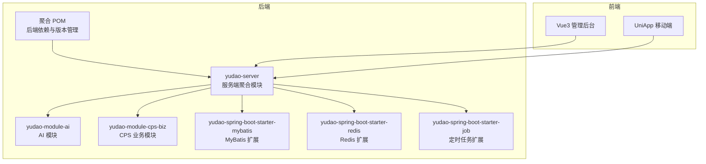
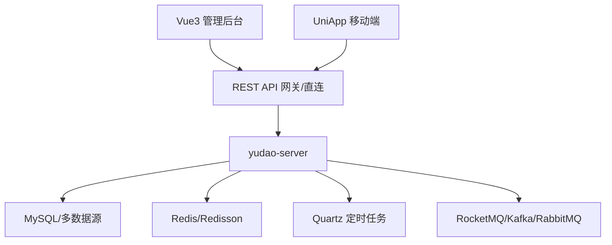
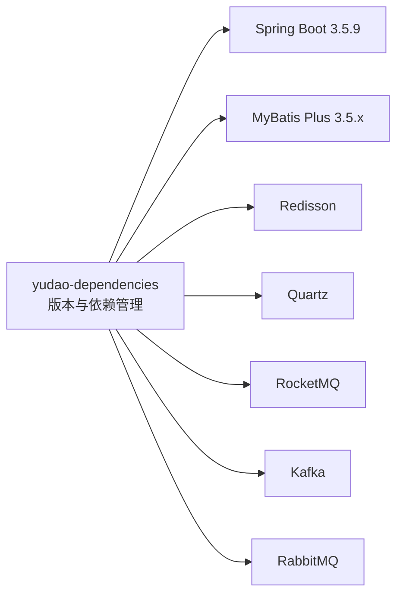

# 技术栈说明

<cite>
**本文引用的文件**
- [后端聚合 POM](file://backend/pom.xml)
- [后端依赖管理 POM](file://backend/yudao-dependencies/pom.xml)
- [后端服务主模块 POM](file://backend/yudao-server/pom.xml)
- [后端 MyBatis 启动器 POM](file://backend/yudao-framework/yudao-spring-boot-starter-mybatis/pom.xml)
- [后端 Redis 启动器 POM](file://backend/yudao-framework/yudao-spring-boot-starter-redis/pom.xml)
- [后端 定时任务启动器 POM](file://backend/yudao-framework/yudao-spring-boot-starter-job/pom.xml)
- [后端应用配置（通用）](file://backend/yudao-server/src/main/resources/application.yaml)
- [后端应用配置（开发）](file://backend/yudao-server/src/main/resources/application-dev.yaml)
- [后端 Dockerfile](file://backend/yudao-server/Dockerfile)
- [Vue3 前端 package.json](file://frontend/admin-vue3/package.json)
- [Vue3 前端 Vite 配置](file://frontend/admin-vue3/vite.config.ts)
- [UniApp 前端 package.json](file://frontend/admin-uniapp/package.json)
- [UniApp 前端 Vite 配置](file://frontend/admin-uniapp/vite.config.ts)
</cite>

## 目录
1. [简介](#简介)
2. [项目结构](#项目结构)
3. [核心组件](#核心组件)
4. [架构总览](#架构总览)
5. [详细组件分析](#详细组件分析)
6. [依赖分析](#依赖分析)
7. [性能考量](#性能考量)
8. [故障排查指南](#故障排查指南)
9. [结论](#结论)
10. [附录](#附录)

## 简介
本技术栈说明面向 AgenticCPS 项目，系统化阐述后端（Spring Boot 3.5.9、Java 17/21、MyBatis Plus、Redis、Quartz）、前端（Vue 3.5.12、Element Plus、UniApp、TypeScript）与移动端（基于 uni-app）的技术选型、版本依据、功能定位、配置方式、最佳实践、性能与维护成本，并提供升级路径与替代方案建议。

## 项目结构
AgenticCPS 采用前后端分离与多模块后端架构：
- 后端：Maven 多模块聚合工程，统一版本与依赖管理，按领域拆分模块，服务端模块聚合打包运行。
- 前端：Vue3 管理后台与 UniApp 移动端双端并行，分别独立构建与发布。
- 移动端：基于 uni-app 的多端统一开发，支持 H5、小程序、App 等多平台。

图表来源
- [后端聚合 POM:10-25](file://backend/pom.xml#L10-L25)
- [后端服务主模块 POM:23-99](file://backend/yudao-server/pom.xml#L23-L99)
- [后端 MyBatis 启动器 POM:18-108](file://backend/yudao-framework/yudao-spring-boot-starter-mybatis/pom.xml#L18-L108)
- [后端 Redis 启动器 POM:18-39](file://backend/yudao-framework/yudao-spring-boot-starter-redis/pom.xml#L18-L39)
- [后端 定时任务启动器 POM:21-38](file://backend/yudao-framework/yudao-spring-boot-starter-job/pom.xml#L21-L38)

章节来源
- [后端聚合 POM:1-176](file://backend/pom.xml#L1-L176)
- [后端服务主模块 POM:1-137](file://backend/yudao-server/pom.xml#L1-L137)

## 核心组件
- 后端技术栈
  - Spring Boot 3.5.9：统一容器与生态，提供自动装配、Actuator、Admin 等能力。
  - Java 17/21：以 Java 17 为主要编译与运行版本，兼顾新特性与稳定性。
  - MyBatis Plus 3.5.x：ORM 增强，逻辑删除、多数据源、联表查询等。
  - Redis + Redisson：缓存、分布式锁、限流等。
  - Quartz：定时任务持久化与集群。
  - Knife4j/SpringDoc：接口文档。
  - RocketMQ/Kafka/RabbitMQ：消息队列。
  - Flowable：工作流。
- 前端技术栈
  - Vue 3.5.12 + TypeScript：渐进式框架与强类型支持。
  - Element Plus：桌面端 UI 组件库。
  - Vite 5：快速构建与热更新。
  - Pinia：状态管理。
  - UnoCSS/样式体系：原子化与主题化。
- 移动端技术栈
  - uni-app 3：多端统一开发，H5/小程序/App。
  - Vite + 插件链：页面与组件自动发现、分包优化、打包可视化等。

章节来源
- [后端聚合 POM:31-45](file://backend/pom.xml#L31-L45)
- [后端依赖管理 POM:16-82](file://backend/yudao-dependencies/pom.xml#L16-L82)
- [Vue3 前端 package.json:27-84](file://frontend/admin-vue3/package.json#L27-L84)
- [UniApp 前端 package.json:99-127](file://frontend/admin-uniapp/package.json#L99-L127)

## 架构总览
后端通过 yudao-server 聚合模块引入各业务模块与框架扩展，对外提供 REST API；前端（Vue3/UniApp）通过 HTTP 与 WebSocket 与后端交互；缓存与任务调度由 Redis 与 Quartz 提供支撑。

图表来源
- [后端服务主模块 POM:23-99](file://backend/yudao-server/pom.xml#L23-L99)
- [后端应用配置（通用）:120-145](file://backend/yudao-server/src/main/resources/application.yaml#L120-L145)
- [后端应用配置（开发）:98-114](file://backend/yudao-server/src/main/resources/application-dev.yaml#L98-L114)

## 详细组件分析

### 后端：Spring Boot 3.5.9 与 Java 17/21
- 版本选择依据
  - Spring Boot 3.5.9：稳定 LTS 与社区支持，兼容 Jakarta EE 规范迁移。
  - Java 17：长期支持版本，生态成熟；21 用于实验性特性与更高性能场景。
- 兼容性考虑
  - Lombok + MapStruct 组合需配置编译参数与处理器链。
  - 参数名保留策略通过编译参数解决。
- 最佳实践
  - 使用 yudao-dependencies 统一依赖版本，避免冲突。
  - 启用 Spring Configuration Processor 生成配置元数据。

章节来源
- [后端聚合 POM:31-45](file://backend/pom.xml#L31-L45)
- [后端聚合 POM:70-106](file://backend/pom.xml#L70-L106)
- [后端依赖管理 POM:94-100](file://backend/yudao-dependencies/pom.xml#L94-L100)

### 后端：MyBatis Plus 与多数据源
- 功能定位
  - ORM 增强、逻辑删除、多数据源、动态表名、联表查询。
- 配置要点
  - MyBatis Plus 全局配置、驼峰映射、Banner 关闭。
  - 多数据源（主从）与 Druid 连接池参数。
- 最佳实践
  - 逻辑删除字段统一约定，避免误删。
  - 联表查询使用 mybatis-plus-join，减少手写 SQL。

章节来源
- [后端应用配置（通用）:66-89](file://backend/yudao-server/src/main/resources/application.yaml#L66-L89)
- [后端应用配置（开发）:32-58](file://backend/yudao-server/src/main/resources/application-dev.yaml#L32-L58)
- [后端 MyBatis 启动器 POM:72-98](file://backend/yudao-framework/yudao-spring-boot-starter-mybatis/pom.xml#L72-L98)

### 后端：Redis 与 Redisson
- 功能定位
  - 缓存、分布式锁、限流、WebSocket 消息广播。
- 配置要点
  - Cache 类型为 REDIS，TTL 1 小时。
  - Redisson Starter 默认配置即可满足多数场景。
- 最佳实践
  - 缓存键前缀规范，避免冲突。
  - 分布式锁超时与获取超时参数结合业务调优。

章节来源
- [后端应用配置（通用）:26-31](file://backend/yudao-server/src/main/resources/application.yaml#L26-L31)
- [后端应用配置（通用）:90-96](file://backend/yudao-server/src/main/resources/application.yaml#L90-L96)
- [后端 Redis 启动器 POM:24-39](file://backend/yudao-framework/yudao-spring-boot-starter-redis/pom.xml#L24-L39)

### 后端：Quartz 定时任务
- 功能定位
  - 定时任务持久化、集群、Misfire 处理。
- 配置要点
  - JobStore 使用 JDBC，集群模式，线程池大小与检查间隔。
  - 应用关闭等待任务完成。
- 最佳实践
  - 任务幂等设计，避免重复执行。
  - 集群节点时间同步，避免 Misfire。

章节来源
- [后端应用配置（开发）:67-97](file://backend/yudao-server/src/main/resources/application-dev.yaml#L67-L97)
- [后端 定时任务启动器 POM:27-31](file://backend/yudao-framework/yudao-spring-boot-starter-job/pom.xml#L27-L31)

### 后端：消息队列（RocketMQ/Kafka/RabbitMQ）
- 功能定位
  - 异步解耦、削峰填谷、事件驱动。
- 配置要点
  - RocketMQ NameServer 地址。
  - Kafka 生产者/消费者参数与反序列化配置。
  - RabbitMQ 连接参数。
- 最佳实践
  - Topic/Group 设计清晰，避免广播风暴。
  - 消费失败重试与死信队列策略。

章节来源
- [后端应用配置（开发）:98-114](file://backend/yudao-server/src/main/resources/application-dev.yaml#L98-L114)
- [后端应用配置（通用）:120-145](file://backend/yudao-server/src/main/resources/application.yaml#L120-L145)

### 前端：Vue3 + Element Plus + TypeScript
- 版本与生态
  - Vue 3.5.12、TypeScript 5、Element Plus 2.11.1、Vite 5。
- 配置与优化
  - Vite 服务器端口、代理、别名、构建产物与 Terser 压缩。
  - 按需打包（如 ECharts、FormCreate）提升首屏性能。
- 最佳实践
  - 统一 ESLint/Stylelint/Prettier 规范。
  - Pinia 状态管理与持久化插件配合使用。

章节来源
- [Vue3 前端 package.json:27-84](file://frontend/admin-vue3/package.json#L27-L84)
- [Vue3 前端 package.json](file://frontend/admin-vue3/package.json#L129)
- [Vue3 前端 Vite 配置:23-87](file://frontend/admin-vue3/vite.config.ts#L23-L87)

### 前端：UniApp 多端统一
- 版本与生态
  - uni-app 3、Vite 5、Pinia、UnoCSS、分包优化插件。
- 配置与优化
  - 页面与布局自动发现、分包策略、组件自动导入、打包可视化。
  - H5 端代理、构建目标 ES6、按需压缩。
- 最佳实践
  - 平台差异抽象，条件编译与平台适配。
  - 分包与异步加载优化首屏与包体。

章节来源
- [UniApp 前端 package.json:99-127](file://frontend/admin-uniapp/package.json#L99-L127)
- [UniApp 前端 package.json:171-176](file://frontend/admin-uniapp/package.json#L171-L176)
- [UniApp 前端 Vite 配置:64-213](file://frontend/admin-uniapp/vite.config.ts#L64-L213)

### 后端：Docker 与部署
- Dockerfile 用于将 yudao-server 打包为可执行镜像，便于容器化部署。
- 建议配合 docker-compose 与环境变量进行多环境部署。

章节来源
- [后端 Dockerfile](file://backend/yudao-server/Dockerfile)

## 依赖分析
后端通过 yudao-dependencies 统一管理 Spring Boot 与生态组件版本，确保一致性与可维护性；yudao-server 通过模块依赖聚合业务与框架扩展。

图表来源
- [后端依赖管理 POM:84-686](file://backend/yudao-dependencies/pom.xml#L84-L686)

章节来源
- [后端依赖管理 POM:16-82](file://backend/yudao-dependencies/pom.xml#L16-L82)
- [后端服务主模块 POM:23-99](file://backend/yudao-server/pom.xml#L23-L99)

## 性能考量
- 后端
  - 连接池与 SQL：Druid 参数调优（初始/最大连接、空闲检测、慢 SQL 记录）。
  - 缓存命中：合理 TTL、键前缀、热点数据预热。
  - 任务并发：Quartz 线程池大小与集群检查间隔按负载调整。
  - 多数据源：读写分离与延迟从库策略。
- 前端
  - 代码分割与懒加载：Vite manualChunks 与按需导入。
  - 构建压缩：Terser/ESBuild 去除调试与控制台语句。
  - 样式体积：UnoCSS 按需引入与 Tree-shaking。
- 移动端
  - 分包与异步组件：减少首屏体积，提升冷启动。
  - 平台差异：按平台特性做差异化优化（H5/小程序/App）。

## 故障排查指南
- 启动与配置
  - Actuator 暴露端点、Spring Boot Admin 客户端注册、日志文件路径。
  - 开发环境 Druid 监控、慢 SQL 与白名单配置。
- 数据与缓存
  - 多数据源连接串、账号密码、从库懒加载。
  - Redis 连接参数、密码、库索引。
- 任务与消息
  - Quartz JDBC 初始化策略、集群参数、Misfire 阀值。
  - RocketMQ/Kafka/RabbitMQ 连接参数与消费者组配置。
- 前端
  - Vite 代理与端口、别名解析、构建产物目录。
  - UniApp 分包与页面发现、打包可视化分析。

章节来源
- [后端应用配置（通用）:120-145](file://backend/yudao-server/src/main/resources/application.yaml#L120-L145)
- [后端应用配置（开发）:124-150](file://backend/yudao-server/src/main/resources/application-dev.yaml#L124-L150)
- [后端应用配置（开发）:32-58](file://backend/yudao-server/src/main/resources/application-dev.yaml#L32-L58)
- [后端应用配置（开发）:67-114](file://backend/yudao-server/src/main/resources/application-dev.yaml#L67-L114)
- [Vue3 前端 Vite 配置:23-87](file://frontend/admin-vue3/vite.config.ts#L23-L87)
- [UniApp 前端 Vite 配置:138-146](file://frontend/admin-uniapp/vite.config.ts#L138-L146)

## 结论
AgenticCPS 的技术栈在后端采用 Spring Boot 3.5.9 与 MyBatis Plus、Redis/Quartz 等成熟生态，具备良好的扩展性与稳定性；前端以 Vue3/TypeScript 与 Element Plus 为基础，配合 Vite 实现高效开发与构建；移动端基于 uni-app 实现多端统一。整体方案兼顾性能、可维护性与团队效率，适合中大型业务系统的演进需求。

## 附录
- 技术升级路径建议
  - 后端：Spring Boot 3.5.x → 3.6.x（逐步验证）→ 3.7.x（功能成熟后）；MyBatis Plus 3.5.x → 3.6.x；Redisson 3.x → 4.x；Quartz 2.x → 2.5+。
  - 前端：Vue 3.5.x → 3.6.x；TypeScript 5.x → 6.x；Vite 5.x → 6.x；Element Plus 2.x → 3.x。
  - 移动端：uni-app 3.x → 4.x；Vite 5.x → 6.x。
- 替代方案建议
  - ORM：MyBatis Plus → MyBatis X 或 Spring Data JPA（视团队熟悉度）。
  - 缓存：Redis → Hazelcast/Infinispan（高可用场景）。
  - 定时任务：Quartz → Elastic Job（更易运维）。
  - 消息队列：RocketMQ → Kafka（事件驱动为主）；RabbitMQ → NATS/EventGrid（云原生）。
  - 前端：Vue3 → SvelteKit（极致性能）；Element Plus → Naive UI（轻量）。
  - 移动端：uni-app → React Native（跨端但学习曲线高）；Flutter（性能与体验更佳）。