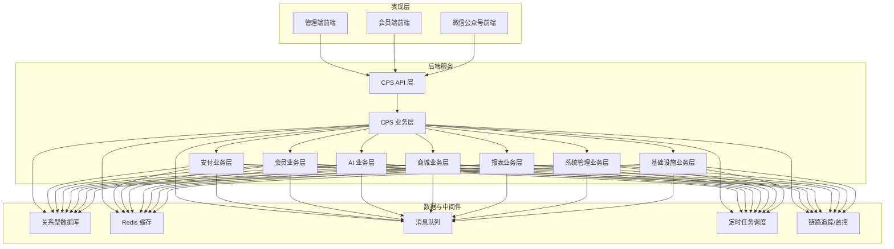
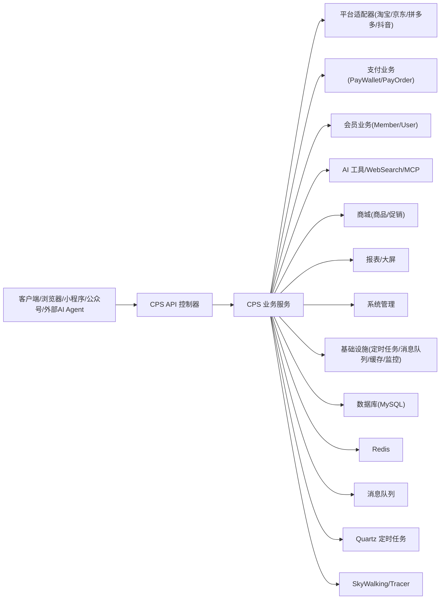
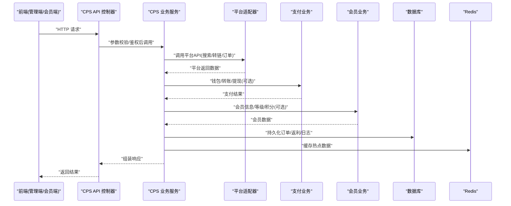
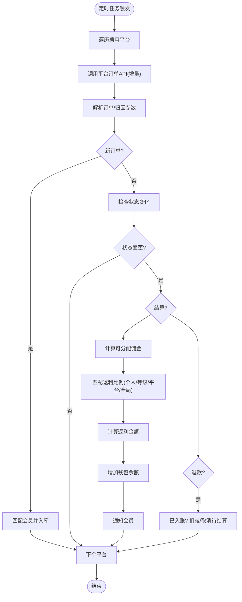
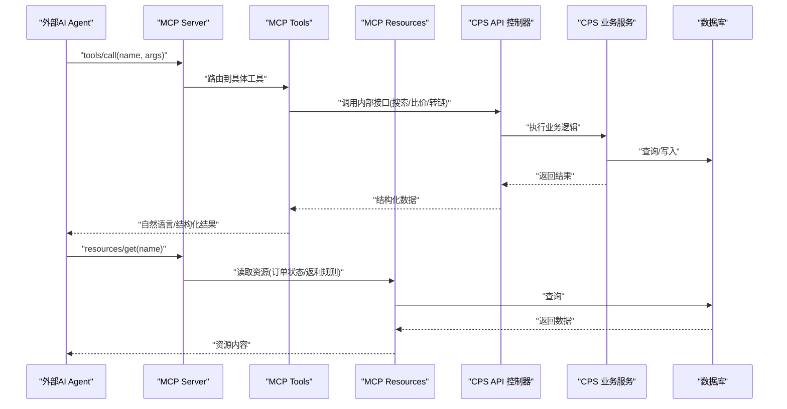
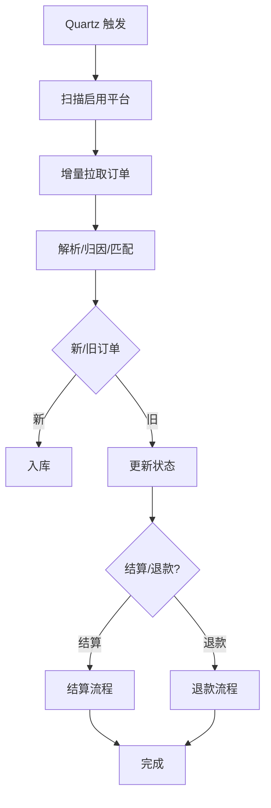
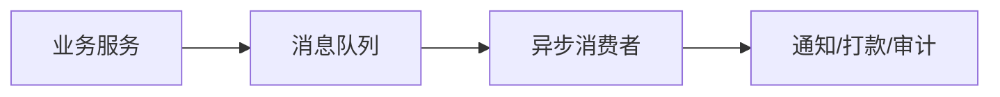
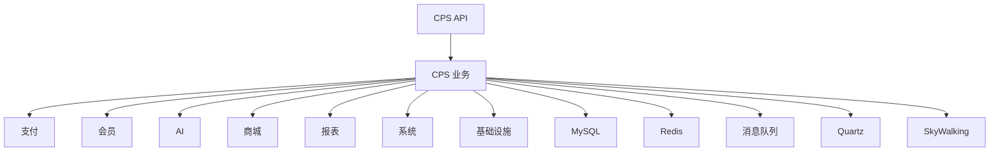

# 数据流设计

<cite>
**本文引用的文件**
- [README.md](file://README.md)
- [CPS系统PRD文档.md](file://docs/CPS系统PRD文档.md)
- [yudao-module-cps-api 枚举](file://backend/yudao-module-cps/yudao-module-cps-api/src/main/java/cn/iocoder/yudao/module/cps/enums)
- [yudao-module-cps-biz 控制器-管理端](file://backend/yudao-module-cps/yudao-module-cps-biz/src/main/java/cn/iocoder/yudao/module/cps/controller/admin)
- [yudao-module-cps-biz 控制器-会员端](file://backend/yudao-module-cps/yudao-module-cps-biz/src/main/java/cn/iocoder/yudao/module/cps/controller/app)
- [yudao-module-cps-biz 业务服务](file://backend/yudao-module-cps/yudao-module-cps-biz/src/main/java/cn/iocoder/yudao/module/cps/service)
- [yudao-module-cps-biz 平台适配器](file://backend/yudao-module-cps/yudao-module-cps-biz/src/main/java/cn/iocoder/yudao/module/cps/client)
- [yudao-module-cps-biz 定时任务](file://backend/yudao-module-cps/yudao-module-cps-biz/src/main/java/cn/iocoder/yudao/module/cps/job)
- [yudao-module-cps-biz MCP 接口层](file://backend/yudao-module-cps/yudao-module-cps-biz/src/main/java/cn/iocoder/yudao/module/cps/mcp)
- [yudao-module-pay 服务](file://backend/yudao-module-pay/yudao-module-pay-biz/src/main/java/cn/iocoder/yudao/module/pay/service)
- [yudao-module-member 服务](file://backend/yudao-module-member/yudao-module-member-biz/src/main/java/cn/iocoder/yudao/module/member/service)
- [yudao-framework 定时任务 Starter](file://backend/yudao-framework/yudao-spring-boot-starter-job/src/main/java/cn/iocoder/yudao/framework/quartz)
- [yudao-framework 消息队列 Starter](file://backend/yudao-framework/yudao-spring-boot-starter-mq/src/main/java/cn/iocoder/yudao/framework/mq)
- [yudao-framework Redis 缓存 Starter](file://backend/yudao-framework/yudao-spring-boot-starter-redis/src/main/java/cn/iocoder/yudao/framework/redis)
- [yudao-framework 监控 Starter](file://backend/yudao-framework/yudao-spring-boot-starter-monitor/src/main/java/cn/iocoder/yudao/framework/tracer)
- [yudao-module-mp 控制器](file://backend/yudao-module-mp/yudao-module-mp-biz/src/main/java/cn/iocoder/yudao/module/mp/controller)
- [yudao-module-report 控制器](file://backend/yudao-module-report/yudao-module-report-biz/src/main/java/cn/iocoder/yudao/module/report/controller)
- [yudao-module-system 控制器](file://backend/yudao-module-system/yudao-module-system-biz/src/main/java/cn/iocoder/yudao/module/system/controller)
- [yudao-module-infra 控制器](file://backend/yudao-module-infra/yudao-module-infra-biz/src/main/java/cn/iocoder/yudao/module/infra/controller)
- [yudao-module-mall 商品服务](file://backend/yudao-module-mall/yudao-module-product-biz/src/main/java/cn/iocoder/yudao/module/product/service)
- [yudao-module-mall 促销服务](file://backend/yudao-module-mall/yudao-module-promotion-biz/src/main/java/cn/iocoder/yudao/module/promotion/service)
- [yudao-module-statistics 服务](file://backend/yudao-module-statistics/yudao-module-statistics-biz/src/main/java/cn/iocoder/yudao/module/statistics/service)
- [yudao-module-ai 控制器](file://backend/yudao-module-ai/yudao-module-ai-biz/src/main/java/cn/iocoder/yudao/module/ai/controller)
- [yudao-module-ai 框架-工具](file://backend/yudao-module-ai/yudao-module-ai-biz/src/main/java/cn/iocoder/yudao/module/ai/tool)
- [yudao-module-ai 框架-框架](file://backend/yudao-module-ai/yudao-module-ai-biz/src/main/java/cn/iocoder/yudao/module/ai/framework)
- [yudao-module-ai 框架-作业](file://backend/yudao-module-ai/yudao-module-ai-biz/src/main/java/cn/iocoder/yudao/module/ai/job)
- [yudao-module-ai 框架-枚举](file://backend/yudao-module-ai/yudao-module-ai-biz/src/main/java/cn/iocoder/yudao/module/ai/enums)
- [yudao-module-ai 框架-工具-核心](file://backend/yudao-module-ai/yudao-module-ai-biz/src/main/java/cn/iocoder/yudao/module/ai/framework/ai/core)
- [yudao-module-ai 框架-工具-网络搜索](file://backend/yudao-module-ai/yudao-module-ai-biz/src/main/java/cn/iocoder/yudao/module/ai/framework/ai/websearch)
</cite>

## 目录
1. [简介](#简介)
2. [项目结构](#项目结构)
3. [核心组件](#核心组件)
4. [架构总览](#架构总览)
5. [详细组件分析](#详细组件分析)
6. [依赖关系分析](#依赖关系分析)
7. [性能考量](#性能考量)
8. [故障排查指南](#故障排查指南)
9. [结论](#结论)
10. [附录](#附录)

## 简介
本文件面向 AgenticCPS 的数据流设计，聚焦系统中“用户请求处理流程、业务数据流转、AI Agent 数据交互、定时任务数据同步”四大主线，阐述数据在表现层、业务层、数据访问层之间的传递与转换，并给出异步处理机制（消息队列、定时任务）、实时处理策略、数据一致性与缓存策略、数据同步机制、优化建议与监控方案。

## 项目结构
AgenticCPS 采用多模块分层架构，核心模块包括：
- yudao-module-cps：CPS 联盟返利系统（API 定义、业务实现、定时任务、MCP 接口）
- yudao-module-pay：支付系统（钱包、转账、提现）
- yudao-module-member：会员中心（用户、等级、积分等）
- yudao-module-ai：AI 大模型模块（MCP 协议、工具、网络搜索等）
- yudao-module-mp：微信公众号模块
- yudao-module-mall：商城系统（商品、促销）
- yudao-module-report：报表与大屏
- yudao-module-system：系统管理
- yudao-module-infra：基础设施（定时任务、消息队列、监控、缓存等）
- yudao-framework：框架扩展（安全、缓存、权限、多租户、定时任务、监控、消息队列、Redis、WebSocket 等）

**图表来源**
- [yudao-module-cps-api 枚举](file://backend/yudao-module-cps/yudao-module-cps-api/src/main/java/cn/iocoder/yudao/module/cps/enums)
- [yudao-module-cps-biz 控制器-管理端](file://backend/yudao-module-cps/yudao-module-cps-biz/src/main/java/cn/iocoder/yudao/module/cps/controller/admin)
- [yudao-module-cps-biz 控制器-会员端](file://backend/yudao-module-cps/yudao-module-cps-biz/src/main/java/cn/iocoder/yudao/module/cps/controller/app)
- [yudao-module-cps-biz 业务服务](file://backend/yudao-module-cps/yudao-module-cps-biz/src/main/java/cn/iocoder/yudao/module/cps/service)
- [yudao-module-cps-biz 平台适配器](file://backend/yudao-module-cps/yudao-module-cps-biz/src/main/java/cn/iocoder/yudao/module/cps/client)
- [yudao-module-cps-biz 定时任务](file://backend/yudao-module-cps/yudao-module-cps-biz/src/main/java/cn/iocoder/yudao/module/cps/job)
- [yudao-module-cps-biz MCP 接口层](file://backend/yudao-module-cps/yudao-module-cps-biz/src/main/java/cn/iocoder/yudao/module/cps/mcp)
- [yudao-module-pay 服务](file://backend/yudao-module-pay/yudao-module-pay-biz/src/main/java/cn/iocoder/yudao/module/pay/service)
- [yudao-module-member 服务](file://backend/yudao-module-member/yudao-module-member-biz/src/main/java/cn/iocoder/yudao/module/member/service)
- [yudao-framework 定时任务 Starter](file://backend/yudao-framework/yudao-spring-boot-starter-job/src/main/java/cn/iocoder/yudao/framework/quartz)
- [yudao-framework 消息队列 Starter](file://backend/yudao-framework/yudao-spring-boot-starter-mq/src/main/java/cn/iocoder/yudao/framework/mq)
- [yudao-framework Redis 缓存 Starter](file://backend/yudao-framework/yudao-spring-boot-starter-redis/src/main/java/cn/iocoder/yudao/framework/redis)
- [yudao-framework 监控 Starter](file://backend/yudao-framework/yudao-spring-boot-starter-monitor/src/main/java/cn/iocoder/yudao/framework/tracer)

**章节来源**
- [README.md: 229–284:229-284](file://README.md#L229-L284)
- [CPS系统PRD文档.md: 80–120:80-120](file://docs/CPS系统PRD文档.md#L80-L120)

## 核心组件
- 表现层：管理端前端、会员端前端、微信公众号前端，负责用户交互与请求入口。
- API 层：CPS API 定义与控制器，承接来自前端与 AI Agent 的请求。
- 业务层：CPS 业务服务（订单、返利、提现、平台适配器、MCP 工具）、支付、会员、AI、商城、报表、系统、基础设施等。
- 数据访问层：MyBatis Plus、Redis、消息队列、定时任务调度、链路追踪与监控。
- 关键数据实体：订单、返利、钱包、会员、平台配置、MCP 凭证与日志等。

**章节来源**
- [yudao-module-cps-api 枚举](file://backend/yudao-module-cps/yudao-module-cps-api/src/main/java/cn/iocoder/yudao/module/cps/enums)
- [yudao-module-cps-biz 控制器-管理端](file://backend/yudao-module-cps/yudao-module-cps-biz/src/main/java/cn/iocoder/yudao/module/cps/controller/admin)
- [yudao-module-cps-biz 控制器-会员端](file://backend/yudao-module-cps/yudao-module-cps-biz/src/main/java/cn/iocoder/yudao/module/cps/controller/app)
- [yudao-module-cps-biz 业务服务](file://backend/yudao-module-cps/yudao-module-cps-biz/src/main/java/cn/iocoder/yudao/module/cps/service)
- [yudao-module-cps-biz 平台适配器](file://backend/yudao-module-cps/yudao-module-cps-biz/src/main/java/cn/iocoder/yudao/module/cps/client)
- [yudao-module-cps-biz 定时任务](file://backend/yudao-module-cps/yudao-module-cps-biz/src/main/java/cn/iocoder/yudao/module/cps/job)
- [yudao-module-cps-biz MCP 接口层](file://backend/yudao-module-cps/yudao-module-cps-biz/src/main/java/cn/iocoder/yudao/module/cps/mcp)

## 架构总览
AgenticCPS 的数据流贯穿“请求入口 → API 层 → 业务层 → 数据访问层”，并辅以定时任务与消息队列实现异步与批处理，Redis 提供缓存与分布式锁，监控链路追踪保障可观测性。

**图表来源**
- [yudao-module-cps-biz 业务服务](file://backend/yudao-module-cps/yudao-module-cps-biz/src/main/java/cn/iocoder/yudao/module/cps/service)
- [yudao-module-cps-biz 平台适配器](file://backend/yudao-module-cps/yudao-module-cps-biz/src/main/java/cn/iocoder/yudao/module/cps/client)
- [yudao-module-pay 服务](file://backend/yudao-module-pay/yudao-module-pay-biz/src/main/java/cn/iocoder/yudao/module/pay/service)
- [yudao-module-member 服务](file://backend/yudao-module-member/yudao-module-member-biz/src/main/java/cn/iocoder/yudao/module/member/service)
- [yudao-module-ai 框架-工具-核心](file://backend/yudao-module-ai/yudao-module-ai-biz/src/main/java/cn/iocoder/yudao/module/ai/framework/ai/core)
- [yudao-module-ai 框架-工具-网络搜索](file://backend/yudao-module-ai/yudao-module-ai-biz/src/main/java/cn/iocoder/yudao/module/ai/framework/ai/websearch)
- [yudao-module-mall 商品服务](file://backend/yudao-module-mall/yudao-module-product-biz/src/main/java/cn/iocoder/yudao/module/product/service)
- [yudao-module-mall 促销服务](file://backend/yudao-module-mall/yudao-module-promotion-biz/src/main/java/cn/iocoder/yudao/module/promotion/service)
- [yudao-module-report 控制器](file://backend/yudao-module-report/yudao-module-report-biz/src/main/java/cn/iocoder/yudao/module/report/controller)
- [yudao-module-system 控制器](file://backend/yudao-module-system/yudao-module-system-biz/src/main/java/cn/iocoder/yudao/module/system/controller)
- [yudao-module-infra 控制器](file://backend/yudao-module-infra/yudao-module-infra-biz/src/main/java/cn/iocoder/yudao/module/infra/controller)
- [yudao-framework 定时任务 Starter](file://backend/yudao-framework/yudao-spring-boot-starter-job/src/main/java/cn/iocoder/yudao/framework/quartz)
- [yudao-framework 消息队列 Starter](file://backend/yudao-framework/yudao-spring-boot-starter-mq/src/main/java/cn/iocoder/yudao/framework/mq)
- [yudao-framework Redis 缓存 Starter](file://backend/yudao-framework/yudao-spring-boot-starter-redis/src/main/java/cn/iocoder/yudao/framework/redis)
- [yudao-framework 监控 Starter](file://backend/yudao-framework/yudao-spring-boot-starter-monitor/src/main/java/cn/iocoder/yudao/framework/tracer)

## 详细组件分析

### 用户请求处理流程（表现层 → API → 业务 → 数据）
- 管理端与会员端前端通过 HTTP/HTTPS 发起请求，经由网关或直接访问后端。
- API 控制器接收请求，进行鉴权与参数校验，调用相应业务服务。
- 业务服务协调平台适配器、支付、会员、AI、商城、报表、系统、基础设施等模块完成数据处理。
- 数据持久化至数据库，必要时写入缓存；异步场景通过消息队列解耦。

**图表来源**
- [yudao-module-cps-biz 控制器-管理端](file://backend/yudao-module-cps/yudao-module-cps-biz/src/main/java/cn/iocoder/yudao/module/cps/controller/admin)
- [yudao-module-cps-biz 控制器-会员端](file://backend/yudao-module-cps/yudao-module-cps-biz/src/main/java/cn/iocoder/yudao/module/cps/controller/app)
- [yudao-module-cps-biz 业务服务](file://backend/yudao-module-cps/yudao-module-cps-biz/src/main/java/cn/iocoder/yudao/module/cps/service)
- [yudao-module-cps-biz 平台适配器](file://backend/yudao-module-cps/yudao-module-cps-biz/src/main/java/cn/iocoder/yudao/module/cps/client)
- [yudao-module-pay 服务](file://backend/yudao-module-pay/yudao-module-pay-biz/src/main/java/cn/iocoder/yudao/module/pay/service)
- [yudao-module-member 服务](file://backend/yudao-module-member/yudao-module-member-biz/src/main/java/cn/iocoder/yudao/module/member/service)

**章节来源**
- [CPS系统PRD文档.md: 121–150:121-150](file://docs/CPS系统PRD文档.md#L121-L150)
- [CPS系统PRD文档.md: 152–181:152-181](file://docs/CPS系统PRD文档.md#L152-L181)

### 业务数据流转（订单、返利、提现）
- 订单同步：定时任务每 5 分钟拉取各平台增量订单，解析归因参数匹配会员，入库并更新状态。
- 返利结算：订单结算后按“可分配佣金 × 返利比例”计算返利，入账会员钱包并通知。
- 提现流程：校验余额/限额/风控，自动或人工审核，调用转账 API，成功则扣减余额并记录流水。

**图表来源**
- [yudao-module-cps-biz 定时任务](file://backend/yudao-module-cps/yudao-module-cps-biz/src/main/java/cn/iocoder/yudao/module/cps/job)
- [yudao-module-cps-biz 业务服务](file://backend/yudao-module-cps/yudao-module-cps-biz/src/main/java/cn/iocoder/yudao/module/cps/service)
- [yudao-module-pay 服务](file://backend/yudao-module-pay/yudao-module-pay-biz/src/main/java/cn/iocoder/yudao/module/pay/service)
- [CPS系统PRD文档.md: 183–223:183-223](file://docs/CPS系统PRD文档.md#L183-L223)

**章节来源**
- [CPS系统PRD文档.md: 183–223:183-223](file://docs/CPS系统PRD文档.md#L183-L223)

### AI Agent 数据交互（MCP 工具与资源）
- 外部 AI Agent 通过 MCP 协议调用系统工具（搜索、比价、转链、订单查询、返利汇总）。
- 管理后台提供 MCP 服务管理、API Key 管理、Tools 配置、资源管理、访问日志与统计分析。

**图表来源**
- [yudao-module-cps-biz MCP 接口层](file://backend/yudao-module-cps/yudao-module-cps-biz/src/main/java/cn/iocoder/yudao/module/cps/mcp)
- [yudao-module-ai 框架-工具-核心](file://backend/yudao-module-ai/yudao-module-ai-biz/src/main/java/cn/iocoder/yudao/module/ai/framework/ai/core)
- [yudao-module-ai 框架-工具-网络搜索](file://backend/yudao-module-ai/yudao-module-ai-biz/src/main/java/cn/iocoder/yudao/module/ai/framework/ai/websearch)
- [CPS系统PRD文档.md: 343–373:343-373](file://docs/CPS系统PRD文档.md#L343-L373)

**章节来源**
- [CPS系统PRD文档.md: 343–373:343-373](file://docs/CPS系统PRD文档.md#L343-L373)

### 定时任务数据同步（Quartz）
- 定时任务每 5 分钟扫描启用平台，增量拉取订单并处理结算/退款分支。
- 支持手动触发与平台连通测试，异常订单可人工绑定会员。

**图表来源**
- [yudao-framework 定时任务 Starter](file://backend/yudao-framework/yudao-spring-boot-starter-job/src/main/java/cn/iocoder/yudao/framework/quartz)
- [yudao-module-cps-biz 定时任务](file://backend/yudao-module-cps/yudao-module-cps-biz/src/main/java/cn/iocoder/yudao/module/cps/job)
- [CPS系统PRD文档.md: 186–223:186-223](file://docs/CPS系统PRD文档.md#L186-L223)

**章节来源**
- [CPS系统PRD文档.md: 186–223:186-223](file://docs/CPS系统PRD文档.md#L186-L223)

### 异步数据处理机制（消息队列）
- 消息队列用于削峰填谷、解耦关键路径（如订单结算通知、提现打款回调、风控事件）。
- 建议：将“通知发送、打款回调、日志审计”放入 MQ，确保主流程快速返回。

**图表来源**
- [yudao-framework 消息队列 Starter](file://backend/yudao-framework/yudao-spring-boot-starter-mq/src/main/java/cn/iocoder/yudao/framework/mq)
- [yudao-module-cps-biz 业务服务](file://backend/yudao-module-cps/yudao-module-cps-biz/src/main/java/cn/iocoder/yudao/module/cps/service)

**章节来源**
- [yudao-framework 消息队列 Starter](file://backend/yudao-framework/yudao-spring-boot-starter-mq/src/main/java/cn/iocoder/yudao/framework/mq)

### 实时数据处理策略
- 搜索/比价：并发调用多平台，先到先返回骨架屏，提升感知速度。
- 推广链接：即时转链，记录日志，返回口令/短链。
- MCP 工具：自然语言解析后并发查询，返回结构化结果与推荐理由。

**章节来源**
- [CPS系统PRD文档.md: 121–150:121-150](file://docs/CPS系统PRD文档.md#L121-L150)
- [CPS系统PRD文档.md: 152–181:152-181](file://docs/CPS系统PRD文档.md#L152-L181)
- [CPS系统PRD文档.md: 643–677:643-677](file://docs/CPS系统PRD文档.md#L643-L677)

### 数据一致性保证
- 事务边界：订单入库、返利入账、提现扣款均在事务中完成，失败回滚。
- 幂等设计：订单幂等键（平台订单号+平台标识），避免重复入账。
- 重试与死信：MQ 消费失败进入死信队列，人工核查后重试。
- 双写校验：关键数据双写（数据库+缓存），缓存失效策略与最终一致。

**章节来源**
- [CPS系统PRD文档.md: 183–223:183-223](file://docs/CPS系统PRD文档.md#L183-L223)

### 缓存策略
- 热点商品/平台配置：Redis 缓存，TTL 与更新策略（变更时失效）。
- 会员等级/返利比例：按会员维度缓存，变更时批量失效。
- 搜索结果：短期缓存聚合结果，降低平台调用压力。

**章节来源**
- [yudao-framework Redis 缓存 Starter](file://backend/yudao-framework/yudao-spring-boot-starter-redis/src/main/java/cn/iocoder/yudao/framework/redis)

### 数据同步机制
- 定时同步：每 5 分钟增量拉取订单，解析归因并入库。
- 手动同步：管理后台支持按平台/时间段手动触发同步。
- 异常处理：未归因订单列表，支持人工绑定会员。

**章节来源**
- [CPS系统PRD文档.md: 186–223:186-223](file://docs/CPS系统PRD文档.md#L186-L223)

## 依赖关系分析
- 模块间依赖：CPS 业务层依赖支付、会员、AI、商城、报表、系统、基础设施模块；API 层依赖业务层；表现层依赖 API 层。
- 外部依赖：MySQL、Redis、消息队列、Quartz、SkyWalking。

**图表来源**
- [yudao-module-cps-biz 控制器-管理端](file://backend/yudao-module-cps/yudao-module-cps-biz/src/main/java/cn/iocoder/yudao/module/cps/controller/admin)
- [yudao-module-cps-biz 控制器-会员端](file://backend/yudao-module-cps/yudao-module-cps-biz/src/main/java/cn/iocoder/yudao/module/cps/controller/app)
- [yudao-module-cps-biz 业务服务](file://backend/yudao-module-cps/yudao-module-cps-biz/src/main/java/cn/iocoder/yudao/module/cps/service)
- [yudao-module-pay 服务](file://backend/yudao-module-pay/yudao-module-pay-biz/src/main/java/cn/iocoder/yudao/module/pay/service)
- [yudao-module-member 服务](file://backend/yudao-module-member/yudao-module-member-biz/src/main/java/cn/iocoder/yudao/module/member/service)
- [yudao-module-ai 框架-工具-核心](file://backend/yudao-module-ai/yudao-module-ai-biz/src/main/java/cn/iocoder/yudao/module/ai/framework/ai/core)
- [yudao-module-mall 商品服务](file://backend/yudao-module-mall/yudao-module-product-biz/src/main/java/cn/iocoder/yudao/module/product/service)
- [yudao-module-report 控制器](file://backend/yudao-module-report/yudao-module-report-biz/src/main/java/cn/iocoder/yudao/module/report/controller)
- [yudao-module-system 控制器](file://backend/yudao-module-system/yudao-module-system-biz/src/main/java/cn/iocoder/yudao/module/system/controller)
- [yudao-module-infra 控制器](file://backend/yudao-module-infra/yudao-module-infra-biz/src/main/java/cn/iocoder/yudao/module/infra/controller)
- [yudao-framework 定时任务 Starter](file://backend/yudao-framework/yudao-spring-boot-starter-job/src/main/java/cn/iocoder/yudao/framework/quartz)
- [yudao-framework 消息队列 Starter](file://backend/yudao-framework/yudao-spring-boot-starter-mq/src/main/java/cn/iocoder/yudao/framework/mq)
- [yudao-framework Redis 缓存 Starter](file://backend/yudao-framework/yudao-spring-boot-starter-redis/src/main/java/cn/iocoder/yudao/framework/redis)
- [yudao-framework 监控 Starter](file://backend/yudao-framework/yudao-spring-boot-starter-monitor/src/main/java/cn/iocoder/yudao/framework/tracer)

## 性能考量
- 搜索/比价并发：多平台并发查询，先到先返回，减少首屏等待。
- 缓存命中：热点数据缓存，TTL 与失效策略，降低数据库压力。
- 异步处理：订单通知、打款回调、日志审计放入 MQ，缩短主流程耗时。
- 定时任务：每 5 分钟增量同步，兼顾实时性与成本。
- 监控与追踪：SkyWalking 链路追踪，结合指标与日志定位瓶颈。

[本节为通用性能建议，无需列出具体文件来源]

## 故障排查指南
- 订单未入账：检查定时任务是否执行、平台 API 返回、归因参数是否匹配、幂等键是否重复。
- 返利比例异常：核对个人专属配置、等级+平台组合、平台默认、全局配置优先级。
- 提现失败：检查余额、限额、风控、银行通道状态、回调处理。
- MCP 工具调用失败：查看 API Key 权限、限流配置、工具参数、访问日志与统计。

**章节来源**
- [CPS系统PRD文档.md: 694–757:694-757](file://docs/CPS系统PRD文档.md#L694-L757)

## 结论
AgenticCPS 的数据流设计以“用户请求 → API → 业务 → 数据”为主线，结合定时任务与消息队列实现异步与批处理，Redis 提供缓存与一致性保障，监控链路追踪确保可观测性。通过并发搜索、缓存策略、异步通知与严格的幂等设计，系统在性能与可靠性之间取得平衡，满足一人公司与 AI Agent 的高效运营需求。

[本节为总结性内容，无需列出具体文件来源]

## 附录
- 关键性能指标参考：单平台搜索 < 2 秒（P99）、多平台比价 < 5 秒（P99）、转链生成 < 1 秒、订单同步延迟 < 30 分钟、返利入账平台结算后 24 小时内、MCP Tool 调用 < 3 秒（搜索类）/ < 1 秒（查询类）。

**章节来源**
- [README.md: 332–341:332-341](file://README.md#L332-L341)