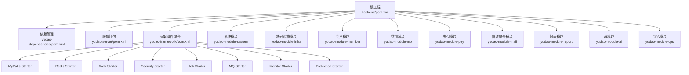
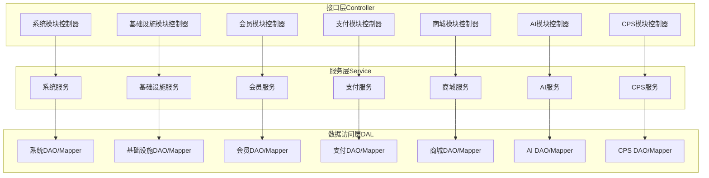
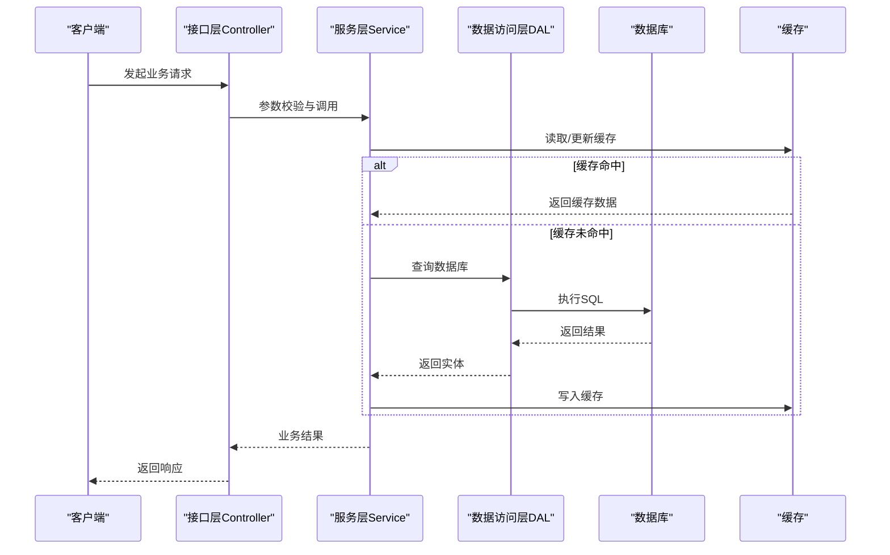
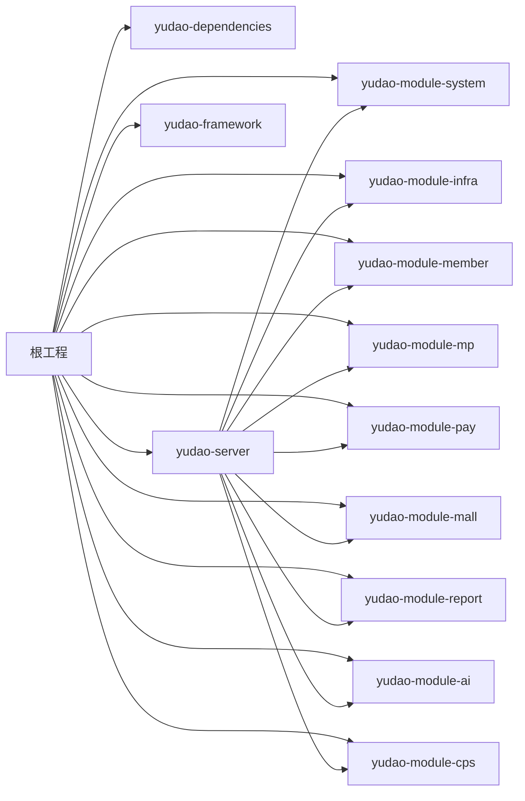

# 整体架构设计

<cite>
**本文引用的文件**
- [backend/pom.xml](file://backend/pom.xml)
- [backend/yudao-server/pom.xml](file://backend/yudao-server/pom.xml)
- [backend/yudao-dependencies/pom.xml](file://backend/yudao-dependencies/pom.xml)
- [backend/yudao-framework/pom.xml](file://backend/yudao-framework/pom.xml)
- [backend/yudao-module-system/src/main/java/cn/iocoder/yudao/module/system/package-info.java](file://backend/yudao-module-system/src/main/java/cn/iocoder/yudao/module/system/package-info.java)
- [backend/yudao-module-infra/src/main/java/cn/iocoder/yudao/module/infra/package-info.java](file://backend/yudao-module-infra/src/main/java/cn/iocoder/yudao/module/infra/package-info.java)
- [backend/yudao-module-member/src/main/java/cn/iocoder/yudao/module/member/package-info.java](file://backend/yudao-module-member/src/main/java/cn/iocoder/yudao/module/member/package-info.java)
- [backend/yudao-module-mp/src/main/java/cn/iocoder/yudao/module/mp/package-info.java](file://backend/yudao-module-mp/src/main/java/cn/iocoder/yudao/module/mp/package-info.java)
- [backend/yudao-module-pay/src/main/java/cn/iocoder/yudao/module/pay/package-info.java](file://backend/yudao-module-pay/src/main/java/cn/iocoder/yudao/module/pay/package-info.java)
- [backend/yudao-module-mall/src/main/java/cn/iocoder/yudao/module/mall/package-info.java](file://backend/yudao-module-mall/src/main/java/cn/iocoder/yudao/module/mall/package-info.java)
- [backend/yudao-module-report/src/main/java/cn/iocoder/yudao/module/report/package-info.java](file://backend/yudao-module-report/src/main/java/cn/iocoder/yudao/module/report/package-info.java)
- [backend/yudao-module-trade/src/main/java/cn/iocoder/yudao/module/trade/package-info.java](file://backend/yudao-module-trade/src/main/java/cn/iocoder/yudao/module/trade/package-info.java)
- [backend/yudao-module-statistics/src/main/java/cn/iocoder/yudao/module/statistics/package-info.java](file://backend/yudao-module-statistics/src/main/java/cn/iocoder/yudao/module/statistics/package-info.java)
- [backend/yudao-module-product/src/main/java/cn/iocoder/yudao/module/product/package-info.java](file://backend/yudao-module-product/src/main/java/cn/iocoder/yudao/module/product/package-info.java)
- [backend/yudao-module-promotion/src/main/java/cn/iocoder/yudao/module/promotion/package-info.java](file://backend/yudao-module-promotion/src/main/java/cn/iocoder/yudao/module/promotion/package-info.java)
- [backend/yudao-module-ai/src/main/java/cn/iocoder/yudao/module/ai/package-info.java](file://backend/yudao-module-ai/src/main/java/cn/iocoder/yudao/module/ai/package-info.java)
- [backend/yudao-module-cps/src/main/java/cn/iocoder/yudao/module/cps/package-info.java](file://backend/yudao-module-cps/src/main/java/cn/iocoder/yudao/module/cps/package-info.java)
</cite>

## 目录
1. [引言](#引言)
2. [项目结构](#项目结构)
3. [核心组件](#核心组件)
4. [架构总览](#架构总览)
5. [详细组件分析](#详细组件分析)
6. [依赖分析](#依赖分析)
7. [性能考量](#性能考量)
8. [故障排查指南](#故障排查指南)
9. [结论](#结论)
10. [附录](#附录)

## 引言
本文件面向 AgenticCPS 项目，提供基于 Spring Boot 的微服务架构设计文档。重点阐述：
- 分层架构（Controller-Service-DAL）
- 模块化设计（Maven 多模块）
- 适配器模式的应用
- 高内聚低耦合的设计原则
- 模块职责划分与依赖关系
- 架构演进历程、设计决策与技术权衡
- 系统边界、组件交互关系与数据流向
- 横切关注点（事务、缓存、安全、日志）实现
- 架构约束、质量属性与非功能性需求

## 项目结构
AgenticCPS 采用多模块聚合工程，顶层 POM 聚合多个子模块，形成“父工程 -> 框架组件 -> 业务模块 -> 服务打包”的层次化结构。

图表来源
- [backend/pom.xml:10-25](file://backend/pom.xml#L10-L25)
- [backend/yudao-server/pom.xml:23-114](file://backend/yudao-server/pom.xml#L23-L114)
- [backend/yudao-framework/pom.xml:12-31](file://backend/yudao-framework/pom.xml#L12-L31)

章节来源
- [backend/pom.xml:1-176](file://backend/pom.xml#L1-L176)
- [backend/yudao-server/pom.xml:1-137](file://backend/yudao-server/pom.xml#L1-L137)
- [backend/yudao-framework/pom.xml:1-47](file://backend/yudao-framework/pom.xml#L1-L47)

## 核心组件
- 根工程与依赖管理
  - 根 POM 聚合所有模块，并通过依赖管理统一版本与坐标，确保一致性与可维护性。
- 框架组件（Starter）
  - 提供横切能力封装，如 Web、Security、MyBatis、Redis、Job、MQ、Monitor、Protection 等，按需装配到业务模块。
- 业务模块
  - 按领域拆分，如系统、基础设施、会员、支付、商城、报表、AI、CPS 等，每个模块内部遵循分层架构。
- 服务打包（yudao-server）
  - 作为可执行容器，按需引入业务模块依赖，最终打包为可运行的单体服务。

章节来源
- [backend/yudao-dependencies/pom.xml:16-82](file://backend/yudao-dependencies/pom.xml#L16-L82)
- [backend/yudao-framework/pom.xml:12-31](file://backend/yudao-framework/pom.xml#L12-L31)
- [backend/yudao-server/pom.xml:23-114](file://backend/yudao-server/pom.xml#L23-L114)

## 架构总览
AgenticCPS 采用“分层 + 模块化 + Starter 适配器”的混合架构：
- 分层架构：Controller（接口层）- Service（服务层）- DAL（数据访问层），职责清晰、边界明确。
- 模块化设计：以业务域为单位划分模块，模块间通过 API 层或消息解耦，降低耦合度。
- 适配器模式：通过 Starter 将第三方能力（数据库、缓存、消息队列、监控等）以统一接口适配到业务模块。

图表来源
- [backend/yudao-module-system/src/main/java/cn/iocoder/yudao/module/system/package-info.java:1-9](file://backend/yudao-module-system/src/main/java/cn/iocoder/yudao/module/system/package-info.java#L1-L9)
- [backend/yudao-module-infra/src/main/java/cn/iocoder/yudao/module/infra/package-info.java:1-10](file://backend/yudao-module-infra/src/main/java/cn/iocoder/yudao/module/infra/package-info.java#L1-L10)
- [backend/yudao-module-member/src/main/java/cn/iocoder/yudao/module/member/package-info.java](file://backend/yudao-module-member/src/main/java/cn/iocoder/yudao/module/member/package-info.java)
- [backend/yudao-module-mp/src/main/java/cn/iocoder/yudao/module/mp/package-info.java](file://backend/yudao-module-mp/src/main/java/cn/iocoder/yudao/module/mp/package-info.java)
- [backend/yudao-module-pay/src/main/java/cn/iocoder/yudao/module/pay/package-info.java](file://backend/yudao-module-pay/src/main/java/cn/iocoder/yudao/module/pay/package-info.java)
- [backend/yudao-module-mall/src/main/java/cn/iocoder/yudao/module/mall/package-info.java](file://backend/yudao-module-mall/src/main/java/cn/iocoder/yudao/module/mall/package-info.java)
- [backend/yudao-module-report/src/main/java/cn/iocoder/yudao/module/report/package-info.java](file://backend/yudao-module-report/src/main/java/cn/iocoder/yudao/module/report/package-info.java)
- [backend/yudao-module-ai/src/main/java/cn/iocoder/yudao/module/ai/package-info.java](file://backend/yudao-module-ai/src/main/java/cn/iocoder/yudao/module/ai/package-info.java)
- [backend/yudao-module-cps/src/main/java/cn/iocoder/yudao/module/cps/package-info.java](file://backend/yudao-module-cps/src/main/java/cn/iocoder/yudao/module/cps/package-info.java)

## 详细组件分析

### 分层架构与职责
- 接口层（Controller）
  - 负责接收请求、参数校验、鉴权与响应封装；URL 前缀与模块命名规范避免冲突。
- 服务层（Service）
  - 负责业务编排、事务控制、领域逻辑处理；对 DAL 进行组合与协调。
- 数据访问层（DAL）
  - 负责与持久层交互，屏蔽具体存储差异；结合 MyBatis Plus 与多数据源能力。

章节来源
- [backend/yudao-module-system/src/main/java/cn/iocoder/yudao/module/system/package-info.java:5-6](file://backend/yudao-module-system/src/main/java/cn/iocoder/yudao/module/system/package-info.java#L5-L6)
- [backend/yudao-module-infra/src/main/java/cn/iocoder/yudao/module/infra/package-info.java:6-7](file://backend/yudao-module-infra/src/main/java/cn/iocoder/yudao/module/infra/package-info.java#L6-L7)

### 模块化设计与边界
- 模块边界
  - 每个模块有明确的领域边界与命名规范，接口前缀与表前缀清晰，便于维护与扩展。
- 模块职责
  - 系统模块：用户、部门、权限、数据字典等通用能力。
  - 基础设施模块：定时任务、运维与研发工具等。
  - 会员模块：会员相关业务。
  - 支付模块：支付相关业务。
  - 商城模块：商品、促销、交易、统计等。
  - 报表模块：数据报表。
  - AI 模块：大模型相关能力。
  - CPS 模块：联盟返利系统。

章节来源
- [backend/yudao-module-system/src/main/java/cn/iocoder/yudao/module/system/package-info.java:1-9](file://backend/yudao-module-system/src/main/java/cn/iocoder/yudao/module/system/package-info.java#L1-L9)
- [backend/yudao-module-infra/src/main/java/cn/iocoder/yudao/module/infra/package-info.java:1-10](file://backend/yudao-module-infra/src/main/java/cn/iocoder/yudao/module/infra/package-info.java#L1-L10)
- [backend/yudao-module-member/src/main/java/cn/iocoder/yudao/module/member/package-info.java](file://backend/yudao-module-member/src/main/java/cn/iocoder/yudao/module/member/package-info.java)
- [backend/yudao-module-mp/src/main/java/cn/iocoder/yudao/module/mp/package-info.java](file://backend/yudao-module-mp/src/main/java/cn/iocoder/yudao/module/mp/package-info.java)
- [backend/yudao-module-pay/src/main/java/cn/iocoder/yudao/module/pay/package-info.java](file://backend/yudao-module-pay/src/main/java/cn/iocoder/yudao/module/pay/package-info.java)
- [backend/yudao-module-mall/src/main/java/cn/iocoder/yudao/module/mall/package-info.java](file://backend/yudao-module-mall/src/main/java/cn/iocoder/yudao/module/mall/package-info.java)
- [backend/yudao-module-report/src/main/java/cn/iocoder/yudao/module/report/package-info.java](file://backend/yudao-module-report/src/main/java/cn/iocoder/yudao/module/report/package-info.java)
- [backend/yudao-module-ai/src/main/java/cn/iocoder/yudao/module/ai/package-info.java](file://backend/yudao-module-ai/src/main/java/cn/iocoder/yudao/module/ai/package-info.java)
- [backend/yudao-module-cps/src/main/java/cn/iocoder/yudao/module/cps/package-info.java](file://backend/yudao-module-cps/src/main/java/cn/iocoder/yudao/module/cps/package-info.java)

### 适配器模式与 Starter
- 适配器模式体现在 Starter 对第三方能力的封装与统一暴露，业务模块仅依赖抽象接口，不直接感知底层实现。
- 典型 Starter：
  - Web、Security、WebSocket：接口与安全。
  - MyBatis、Redis：数据访问与缓存。
  - Job、MQ：异步与调度。
  - Monitor、Protection：监控与防护。

章节来源
- [backend/yudao-framework/pom.xml:12-31](file://backend/yudao-framework/pom.xml#L12-L31)
- [backend/yudao-dependencies/pom.xml:138-173](file://backend/yudao-dependencies/pom.xml#L138-L173)
- [backend/yudao-dependencies/pom.xml:174-217](file://backend/yudao-dependencies/pom.xml#L174-L217)
- [backend/yudao-dependencies/pom.xml:244-261](file://backend/yudao-dependencies/pom.xml#L244-L261)
- [backend/yudao-dependencies/pom.xml:286-304](file://backend/yudao-dependencies/pom.xml#L286-L304)
- [backend/yudao-dependencies/pom.xml:324-330](file://backend/yudao-dependencies/pom.xml#L324-L330)
- [backend/yudao-dependencies/pom.xml:305-312](file://backend/yudao-dependencies/pom.xml#L305-L312)

### 横切关注点实现

#### 事务管理
- 通过 Service 层进行事务边界定义与传播控制，结合 Starter 提供的事务能力，确保业务一致性。

章节来源
- [backend/yudao-dependencies/pom.xml:174-217](file://backend/yudao-dependencies/pom.xml#L174-L217)

#### 缓存
- 通过 Redis Starter 与 Redisson 提供缓存与分布式锁能力，结合业务模块的缓存策略实现高性能读写。

章节来源
- [backend/yudao-dependencies/pom.xml:244-261](file://backend/yudao-dependencies/pom.xml#L244-L261)

#### 安全
- 通过 Security Starter 提供认证与授权能力，结合业务模块的权限控制策略，保障系统安全。

章节来源
- [backend/yudao-dependencies/pom.xml:144-156](file://backend/yudao-dependencies/pom.xml#L144-L156)
- [backend/yudao-dependencies/pom.xml:147-149](file://backend/yudao-dependencies/pom.xml#L147-L149)

#### 日志与监控
- 通过 Monitor Starter 与 SkyWalking 提供链路追踪与指标采集，结合日志输出实现可观测性。

章节来源
- [backend/yudao-dependencies/pom.xml:324-330](file://backend/yudao-dependencies/pom.xml#L324-L330)
- [backend/yudao-dependencies/pom.xml:331-355](file://backend/yudao-dependencies/pom.xml#L331-L355)

### 数据流向与组件交互

图表来源
- [backend/yudao-dependencies/pom.xml:244-261](file://backend/yudao-dependencies/pom.xml#L244-L261)
- [backend/yudao-dependencies/pom.xml:174-217](file://backend/yudao-dependencies/pom.xml#L174-L217)

## 依赖分析

图表来源
- [backend/pom.xml:10-25](file://backend/pom.xml#L10-L25)
- [backend/yudao-server/pom.xml:23-114](file://backend/yudao-server/pom.xml#L23-L114)

章节来源
- [backend/pom.xml:1-176](file://backend/pom.xml#L1-L176)
- [backend/yudao-server/pom.xml:1-137](file://backend/yudao-server/pom.xml#L1-L137)

## 性能考量
- 分层与模块化降低复杂度，提升开发与维护效率。
- 通过缓存与异步（Job/MQ）优化热点路径与吞吐量。
- 依赖管理统一版本，减少冲突与升级成本。
- Starter 按需装配，避免不必要的依赖引入。

## 故障排查指南
- 依赖冲突
  - 使用依赖管理统一版本，避免第三方库版本不一致导致的问题。
- 启动失败
  - 检查 yudao-server 中模块依赖是否正确引入；确认 Starter 是否按需启用。
- 性能问题
  - 关注缓存命中率、数据库慢 SQL、MQ 消息堆积与 Job 执行耗时。

章节来源
- [backend/yudao-dependencies/pom.xml:84-687](file://backend/yudao-dependencies/pom.xml#L84-L687)
- [backend/yudao-server/pom.xml:23-114](file://backend/yudao-server/pom.xml#L23-L114)

## 结论
AgenticCPS 通过“分层 + 模块化 + Starter 适配器”实现了高内聚低耦合的微服务架构。根工程统一治理，框架组件提供横切能力，业务模块聚焦领域职责，yudao-server 作为容器聚合模块并打包运行。该架构在可维护性、可扩展性与可观察性方面具备良好基础，适合持续演进与规模化扩展。

## 附录
- 架构约束
  - 模块命名与 URL 前缀规范，避免冲突。
  - 依赖版本由 yudao-dependencies 统一管理。
- 质量属性与非功能性需求
  - 可靠性：事务与异常处理。
  - 可伸缩性：缓存、异步与水平扩展。
  - 可观测性：监控、日志与链路追踪。
  - 安全性：认证、授权与防护。