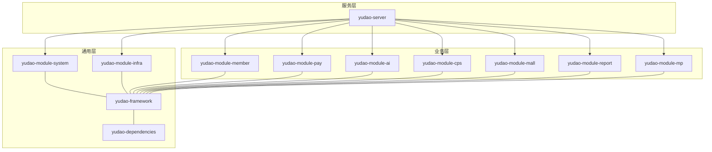
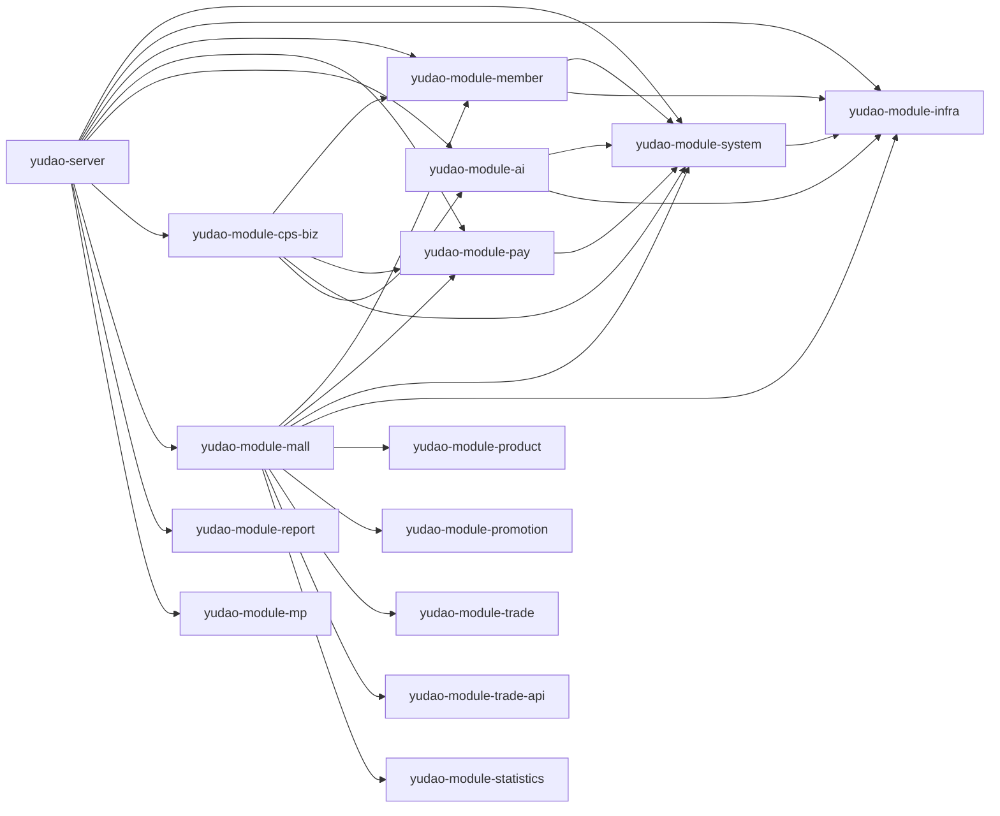

# 模块化设计

<cite>
**本文引用的文件**   
- [backend/pom.xml](file://backend/pom.xml)
- [backend/yudao-dependencies/pom.xml](file://backend/yudao-dependencies/pom.xml)
- [backend/yudao-framework/pom.xml](file://backend/yudao-framework/pom.xml)
- [backend/yudao-server/pom.xml](file://backend/yudao-server/pom.xml)
- [backend/yudao-module-cps/yudao-module-cps-api/pom.xml](file://backend/yudao-module-cps/yudao-module-cps-api/pom.xml)
- [backend/yudao-module-cps/yudao-module-cps-biz/pom.xml](file://backend/yudao-module-cps/yudao-module-cps-biz/pom.xml)
- [backend/yudao-module-ai/pom.xml](file://backend/yudao-module-ai/pom.xml)
- [backend/yudao-module-member/pom.xml](file://backend/yudao-module-member/pom.xml)
- [backend/yudao-module-pay/pom.xml](file://backend/yudao-module-pay/pom.xml)
- [backend/yudao-module-system/pom.xml](file://backend/yudao-module-system/pom.xml)
- [backend/yudao-module-infra/pom.xml](file://backend/yudao-module-infra/pom.xml)
- [backend/yudao-module-mall/yudao-module-product/pom.xml](file://backend/yudao-module-mall/yudao-module-product/pom.xml)
- [backend/yudao-module-mall/yudao-module-promotion/pom.xml](file://backend/yudao-module-mall/yudao-module-promotion/pom.xml)
- [backend/yudao-module-mall/yudao-module-trade/pom.xml](file://backend/yudao-module-mall/yudao-module-trade/pom.xml)
- [backend/yudao-module-mall/yudao-module-trade-api/pom.xml](file://backend/yudao-module-mall/yudao-module-trade-api/pom.xml)
- [backend/yudao-module-mall/yudao-module-statistics/pom.xml](file://backend/yudao-module-mall/yudao-module-statistics/pom.xml)
</cite>

## 目录
1. [简介](#简介)
2. [项目结构](#项目结构)
3. [核心组件](#核心组件)
4. [架构总览](#架构总览)
5. [详细组件分析](#详细组件分析)
6. [依赖分析](#依赖分析)
7. [性能考虑](#性能考虑)
8. [故障排查指南](#故障排查指南)
9. [结论](#结论)
10. [附录](#附录)

## 简介
本文件面向 AgenticCPS 的模块化设计，围绕基于 Maven 的多模块架构进行系统性说明。重点涵盖：
- 模块划分原则、命名规范与依赖管理策略
- 各业务模块（CPS、AI、会员、支付、系统、商城等）的职责边界与功能范围
- 模块间通信机制、接口设计与数据传递方式
- 模块化带来的收益与挑战
- 模块依赖图、构建顺序与发布策略
- 新模块添加指南与模块重构最佳实践

## 项目结构
AgenticCPS 采用“顶层聚合 + 多模块”的 Maven 结构，顶层 POM 负责统一版本与模块编排；yudao-dependencies 提供统一依赖版本管理；yudao-framework 定义通用技术组件；各 yudao-module-* 为业务模块；yudao-server 作为打包入口。

```mermaid
graph TB
Root["顶层聚合<br/>backend/pom.xml"] --> Deps["依赖管理<br/>yudao-dependencies/pom.xml"]
Root --> Fwk["框架组件聚合<br/>yudao-framework/pom.xml"]
Root --> Srv["服务打包入口<br/>yudao-server/pom.xml"]
Fwk --> FwkMyBatis["yudao-spring-boot-starter-mybatis"]
Fwk --> FwkRedis["yudao-spring-boot-starter-redis"]
Fwk --> FwkWeb["yudao-spring-boot-starter-web"]
Fwk --> FwkSecurity["yudao-spring-boot-starter-security"]
Fwk --> FwkWs["yudao-spring-boot-starter-websocket"]
Fwk --> FwkMonitor["yudao-spring-boot-starter-monitor"]
Fwk --> FwkProtection["yudao-spring-boot-starter-protection"]
Fwk --> FwkJob["yudao-spring-boot-starter-job"]
Fwk --> FwkMQ["yudao-spring-boot-starter-mq"]
Fwk --> FwkExcel["yudao-spring-boot-starter-excel"]
Fwk --> FwkTest["yudao-spring-boot-starter-test"]
Fwk --> FwkBizTenant["yudao-spring-boot-starter-biz-tenant"]
Fwk --> FwkBizDataPerm["yudao-spring-boot-starter-biz-data-permission"]
Fwk --> FwkBizIP["yudao-spring-boot-starter-biz-ip"]
Root --> Sys["系统模块<br/>yudao-module-system/pom.xml"]
Root --> Infra["基础设施模块<br/>yudao-module-infra/pom.xml"]
Root --> Member["会员模块<br/>yudao-module-member/pom.xml"]
Root --> Pay["支付模块<br/>yudao-module-pay/pom.xml"]
Root --> Mall["商城聚合<br/>yudao-module-mall/*"]
Root --> AI["AI 模块<br/>yudao-module-ai/pom.xml"]
Root --> CPS["CPS 聚合<br/>yudao-module-cps/*"]
Root --> Report["报表模块<br/>yudao-module-report/*"]
Root --> MP["微信模块<br/>yudao-module-mp/*"]
Srv --> Sys
Srv --> Infra
Srv --> Member
Srv --> Pay
Srv --> Mall
Srv --> AI
Srv --> CPS
Srv --> Report
Srv --> MP
```

图表来源
- [backend/pom.xml:10-25](file://backend/pom.xml#L10-L25)
- [backend/yudao-framework/pom.xml:12-31](file://backend/yudao-framework/pom.xml#L12-L31)
- [backend/yudao-server/pom.xml:23-114](file://backend/yudao-server/pom.xml#L23-L114)

章节来源
- [backend/pom.xml:10-25](file://backend/pom.xml#L10-L25)
- [backend/yudao-framework/pom.xml:12-31](file://backend/yudao-framework/pom.xml#L12-L31)
- [backend/yudao-server/pom.xml:23-114](file://backend/yudao-server/pom.xml#L23-L114)

## 核心组件
- 顶层聚合与版本控制：顶层 POM 统一版本号与插件配置，并声明所有模块。
- 依赖管理：yudao-dependencies 以 BOM 形式集中管理第三方依赖版本，确保一致性。
- 框架组件：yudao-framework 将通用技术能力拆分为可复用的 starter 组件，降低模块重复实现成本。
- 业务模块：按领域划分，如系统、基础设施、会员、支付、AI、CPS、商城、报表、微信等。
- 服务打包：yudao-server 作为最终可执行包的装配者，按需引入业务模块依赖。

章节来源
- [backend/pom.xml:31-57](file://backend/pom.xml#L31-L57)
- [backend/yudao-dependencies/pom.xml:84-687](file://backend/yudao-dependencies/pom.xml#L84-L687)
- [backend/yudao-framework/pom.xml:33-44](file://backend/yudao-framework/pom.xml#L33-L44)

## 架构总览
模块化架构遵循“分层清晰、边界明确、低耦合高内聚”的原则。系统通过 yudao-server 聚合各模块，形成统一的后端服务；yudao-dependencies 与 yudao-framework 提供统一的依赖与技术组件，保障模块间的协同与一致性。

图表来源
- [backend/yudao-server/pom.xml:23-114](file://backend/yudao-server/pom.xml#L23-L114)
- [backend/yudao-framework/pom.xml:12-31](file://backend/yudao-framework/pom.xml#L12-L31)
- [backend/yudao-dependencies/pom.xml:84-100](file://backend/yudao-dependencies/pom.xml#L84-L100)

## 详细组件分析

### 模块划分原则与命名规范
- 划分原则
  - 领域驱动：按业务域划分模块，如系统、会员、支付、AI、CPS、商城等。
  - 职责单一：每个模块聚焦特定业务或通用能力，避免交叉重叠。
  - 可替换性：通用能力下沉到 yudao-framework，业务模块仅关注自身领域。
- 命名规范
  - 通用框架组件：yudao-spring-boot-starter-*
  - 业务模块：yudao-module-*
  - 模块内部 API 层：yudao-module-*-api（仅暴露接口）
  - 模块内部业务实现：yudao-module-*-biz（包含控制器、服务、持久层等）

章节来源
- [backend/yudao-framework/pom.xml:33-44](file://backend/yudao-framework/pom.xml#L33-L44)
- [backend/yudao-module-cps/yudao-module-cps-api/pom.xml:10-17](file://backend/yudao-module-cps/yudao-module-cps-api/pom.xml#L10-L17)
- [backend/yudao-module-cps/yudao-module-cps-biz/pom.xml:10-18](file://backend/yudao-module-cps/yudao-module-cps-biz/pom.xml#L10-L18)

### 业务模块职责边界与功能范围

- 系统模块（yudao-module-system）
  - 职责：用户、部门、权限、菜单、数据字典、操作日志、验证码、社交登录等通用能力。
  - 依赖：infra 通用能力、安全、Web、Redis、定时任务、消息队列、Excel、邮件等。
  - 关键点：作为其他模块的“通用底座”，提供数据权限、租户隔离、IP 地址解析等业务组件。

- 基础设施模块（yudao-module-infra）
  - 职责：定时任务、代码生成、接口文档、监控、Spring Boot Admin、文件客户端（FTP/SFTP/S3）、Tika 文件识别等。
  - 依赖：MyBatis、Redis、Job、MQ、Monitor、Excel、Velocity 等。

- 会员模块（yudao-module-member）
  - 职责：会员中心、等级、积分、标签、消息队列事件等。
  - 依赖：system、infra、security、validation、MyBatis、Redis、MQ、Excel、IP 组件等。

- 支付模块（yudao-module-pay）
  - 职责：商户、应用、支付、退款、钱包、转账打款等支付能力。
  - 依赖：system、tenant、security、MyBatis、Redis、Job、Excel、三方支付 SDK（Alipay、WeChat）等。

- AI 模块（yudao-module-ai）
  - 职责：接入多种大模型（OpenAI、Azure OpenAI、Anthropic、DeepSeek、Ollama、Stability AI、通义、文心、Moonshot 等），向量存储（Qdrant、Redis、Milvus），内容解析（Tika），MCP 工具函数（ToolContext 等）。
  - 依赖：system、infra、tenant、security、MyBatis、Job、Excel、Redis、Spring AI、TinyFlow 等。

- CPS 模块（yudao-module-cps）
  - 职责：CPS 联盟返利系统核心业务，包含平台配置、推广位管理、订单同步、返利计算、提现管理、MCP AI 接口等。
  - 结构：API 层（仅接口）+ Biz 层（完整业务实现）。
  - 依赖：member、pay、system、tenant、security、validation、MyBatis、Redis、Job、Excel、AI 模块等。

- 商城模块（yudao-module-mall）
  - 职责：商品（品牌、分类、SPU/SKU）、营销（活动、广告、优惠券、优惠码）、交易（订单、退款、购物车）、统计（商品、会员、交易）。
  - 结构：product、promotion、trade、trade-api、statistics 等子模块。
  - 依赖：member、pay、system、infra、product、trade-api、tenant、security、MyBatis、Redis、Excel、Job 等。

- 报表模块（yudao-module-report）
  - 职责：报表引擎、积木报表集成等。
  - 依赖：system、infra、tenant、security、MyBatis、Excel、Job 等。

- 微信模块（yudao-module-mp）
  - 职责：公众号、小程序、微信支付、消息与菜单、素材、用户与标签等。
  - 依赖：system、infra、tenant、security、MyBatis、Excel、Job 等。

章节来源
- [backend/yudao-module-system/pom.xml:20-122](file://backend/yudao-module-system/pom.xml#L20-L122)
- [backend/yudao-module-infra/pom.xml:21-117](file://backend/yudao-module-infra/pom.xml#L21-L117)
- [backend/yudao-module-member/pom.xml:20-84](file://backend/yudao-module-member/pom.xml#L20-L84)
- [backend/yudao-module-pay/pom.xml:21-81](file://backend/yudao-module-pay/pom.xml#L21-L81)
- [backend/yudao-module-ai/pom.xml:28-262](file://backend/yudao-module-ai/pom.xml#L28-L262)
- [backend/yudao-module-cps/yudao-module-cps-api/pom.xml:19-31](file://backend/yudao-module-cps/yudao-module-cps-api/pom.xml#L19-L31)
- [backend/yudao-module-cps/yudao-module-cps-biz/pom.xml:20-99](file://backend/yudao-module-cps/yudao-module-cps-biz/pom.xml#L20-L99)
- [backend/yudao-module-mall/yudao-module-product/pom.xml:20-56](file://backend/yudao-module-mall/yudao-module-product/pom.xml#L20-L56)
- [backend/yudao-module-mall/yudao-module-promotion/pom.xml:21-81](file://backend/yudao-module-mall/yudao-module-promotion/pom.xml#L21-L81)
- [backend/yudao-module-mall/yudao-module-trade/pom.xml:20-95](file://backend/yudao-module-mall/yudao-module-trade/pom.xml#L20-L95)
- [backend/yudao-module-mall/yudao-module-trade-api/pom.xml:19-31](file://backend/yudao-module-mall/yudao-module-trade-api/pom.xml#L19-L31)
- [backend/yudao-module-mall/yudao-module-statistics/pom.xml:20-84](file://backend/yudao-module-mall/yudao-module-statistics/pom.xml#L20-L84)

### 模块间通信机制、接口设计与数据传递
- 接口设计
  - API 层（如 yudao-module-*-api）仅暴露接口与 DTO，不包含实现细节，便于跨模块调用与解耦。
  - 业务层（如 yudao-module-*-biz）实现具体逻辑，依赖系统通用能力与框架组件。
- 数据传递
  - 控制器层接收请求，调用服务层；服务层通过 DAO 访问数据库，必要时通过 MQ 异步处理。
  - 跨模块调用通过 API 层提供的接口进行，避免直接依赖实现类。
- 安全与校验
  - 统一使用 yudao-spring-boot-starter-security 提供的安全能力。
  - 参数校验通过 spring-boot-starter-validation 与 API 层的依赖配合完成。

章节来源
- [backend/yudao-module-cps/yudao-module-cps-api/pom.xml:19-31](file://backend/yudao-module-cps/yudao-module-cps-api/pom.xml#L19-L31)
- [backend/yudao-module-mall/yudao-module-trade-api/pom.xml:19-31](file://backend/yudao-module-mall/yudao-module-trade-api/pom.xml#L19-L31)
- [backend/yudao-module-system/pom.xml:41-50](file://backend/yudao-module-system/pom.xml#L41-L50)

### 模块化带来的好处与挑战
- 好处
  - 独立开发：各模块职责清晰，团队可并行开发不同模块。
  - 独立测试：模块内聚度高，便于编写单元测试与集成测试。
  - 独立部署：通过 yudao-server 可灵活装配所需模块，按需启用/禁用。
  - 代码复用：yudao-framework 提供通用组件，减少重复实现。
- 挑战
  - 模块间耦合：跨模块调用需通过 API 层，避免直接依赖实现类。
  - 版本管理：yudao-dependencies 统一版本，但模块升级需谨慎评估影响面。
  - 构建复杂度：模块数量较多，构建顺序与并行度需合理规划。

章节来源
- [backend/yudao-dependencies/pom.xml:84-100](file://backend/yudao-dependencies/pom.xml#L84-L100)
- [backend/yudao-framework/pom.xml:33-44](file://backend/yudao-framework/pom.xml#L33-L44)

## 依赖分析

### 模块依赖图

图表来源
- [backend/yudao-server/pom.xml:23-114](file://backend/yudao-server/pom.xml#L23-L114)
- [backend/yudao-module-member/pom.xml:20-84](file://backend/yudao-module-member/pom.xml#L20-L84)
- [backend/yudao-module-pay/pom.xml:21-81](file://backend/yudao-module-pay/pom.xml#L21-L81)
- [backend/yudao-module-ai/pom.xml:28-262](file://backend/yudao-module-ai/pom.xml#L28-L262)
- [backend/yudao-module-cps/yudao-module-cps-biz/pom.xml:20-99](file://backend/yudao-module-cps/yudao-module-cps-biz/pom.xml#L20-L99)
- [backend/yudao-module-mall/yudao-module-product/pom.xml:20-56](file://backend/yudao-module-mall/yudao-module-product/pom.xml#L20-L56)
- [backend/yudao-module-mall/yudao-module-promotion/pom.xml:21-81](file://backend/yudao-module-mall/yudao-module-promotion/pom.xml#L21-L81)
- [backend/yudao-module-mall/yudao-module-trade/pom.xml:20-95](file://backend/yudao-module-mall/yudao-module-trade/pom.xml#L20-L95)
- [backend/yudao-module-mall/yudao-module-trade-api/pom.xml:19-31](file://backend/yudao-module-mall/yudao-module-trade-api/pom.xml#L19-L31)
- [backend/yudao-module-mall/yudao-module-statistics/pom.xml:20-84](file://backend/yudao-module-mall/yudao-module-statistics/pom.xml#L20-L84)

### 构建顺序与发布策略
- 构建顺序
  - 优先构建 yudao-dependencies 与 yudao-framework，确保版本与组件可用。
  - 再构建 yudao-module-* 业务模块，最后构建 yudao-server 进行打包。
- 发布策略
  - 采用统一版本号（revision），通过 flatten-maven-plugin 统一固化版本。
  - 业务模块按需发布，yudao-server 作为可执行包统一发布。

章节来源
- [backend/pom.xml:31-57](file://backend/pom.xml#L31-L57)
- [backend/pom.xml:114-141](file://backend/pom.xml#L114-L141)
- [backend/yudao-server/pom.xml:116-134](file://backend/yudao-server/pom.xml#L116-L134)

## 性能考虑
- 依赖精简：仅引入模块实际所需的 starter 组件，避免不必要的依赖导致启动与运行开销。
- 缓存与异步：利用 yudao-spring-boot-starter-redis 与 yudao-spring-boot-starter-mq 提升性能与扩展性。
- 数据访问：MyBatis Plus 与多数据源组件结合，优化复杂查询与读写分离场景。
- 监控与链路追踪：通过 yudao-spring-boot-starter-monitor 与 SkyWalking 组件，持续观测性能瓶颈。

## 故障排查指南
- 依赖冲突
  - 使用 yudao-dependencies 的 BOM 管理版本，避免不同模块引入不同版本的依赖。
- 启动失败
  - 检查 yudao-server 是否正确引入所需模块依赖；确认 yudao-framework 组件是否齐全。
- 参数校验失败
  - 确认 API 层已引入 spring-boot-starter-validation，并在控制器中使用 @Validated。
- 安全与认证
  - 确认 yudao-spring-boot-starter-security 已启用，且相关过滤器链配置正确。
- 日志与监控
  - 检查 yudao-spring-boot-starter-monitor 与 Spring Boot Admin 配置，确保可观测性开启。

章节来源
- [backend/yudao-dependencies/pom.xml:84-100](file://backend/yudao-dependencies/pom.xml#L84-L100)
- [backend/yudao-server/pom.xml:23-114](file://backend/yudao-server/pom.xml#L23-L114)
- [backend/yudao-module-system/pom.xml:41-50](file://backend/yudao-module-system/pom.xml#L41-L50)
- [backend/yudao-module-system/pom.xml:41-122](file://backend/yudao-module-system/pom.xml#L41-L122)

## 结论
AgenticCPS 的模块化设计以 yudao-dependencies 与 yudao-framework 为基础，通过 yudao-module-* 实现业务域的清晰划分，yudao-server 作为统一打包入口，既满足独立开发、测试与部署的需求，又通过统一组件与版本管理降低了模块间的耦合与维护成本。建议在新增模块与重构过程中严格遵循接口层设计、最小依赖原则与统一版本策略，以保持系统的长期演进能力。

## 附录

### 新模块添加指南
- 命名与目录
  - 业务模块：yudao-module-模块名
  - API 层：yudao-module-模块名-api
  - 业务实现：yudao-module-模块名-biz
- 依赖管理
  - 在 yudao-dependencies 中统一声明版本与依赖项。
  - 在 yudao-framework 中沉淀通用组件（如需要）。
- 模块声明
  - 在顶层 POM 的 modules 中加入新模块。
- 接口与实现
  - API 层仅暴露接口与 DTO；业务层实现具体逻辑。
- 安全与校验
  - 引入 yudao-spring-boot-starter-security 与 spring-boot-starter-validation。
- 打包与发布
  - 在 yudao-server 中按需引入新模块依赖；统一版本与发布策略。

章节来源
- [backend/pom.xml:10-25](file://backend/pom.xml#L10-L25)
- [backend/yudao-dependencies/pom.xml:84-687](file://backend/yudao-dependencies/pom.xml#L84-L687)
- [backend/yudao-framework/pom.xml:33-44](file://backend/yudao-framework/pom.xml#L33-L44)
- [backend/yudao-module-cps/yudao-module-cps-api/pom.xml:19-31](file://backend/yudao-module-cps/yudao-module-cps-api/pom.xml#L19-L31)
- [backend/yudao-module-cps/yudao-module-cps-biz/pom.xml:20-99](file://backend/yudao-module-cps/yudao-module-cps-biz/pom.xml#L20-L99)