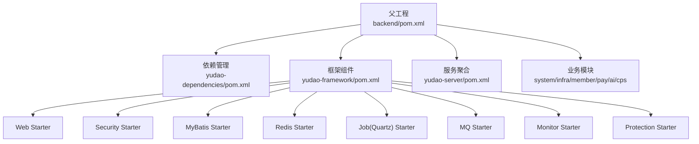
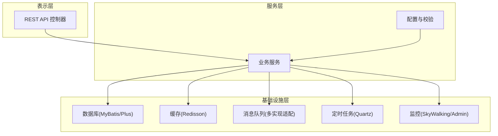
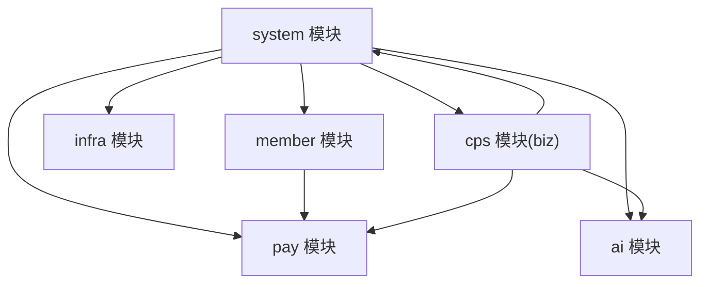
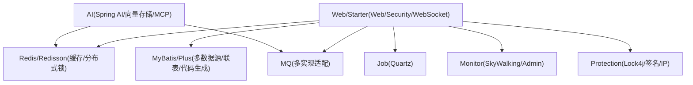
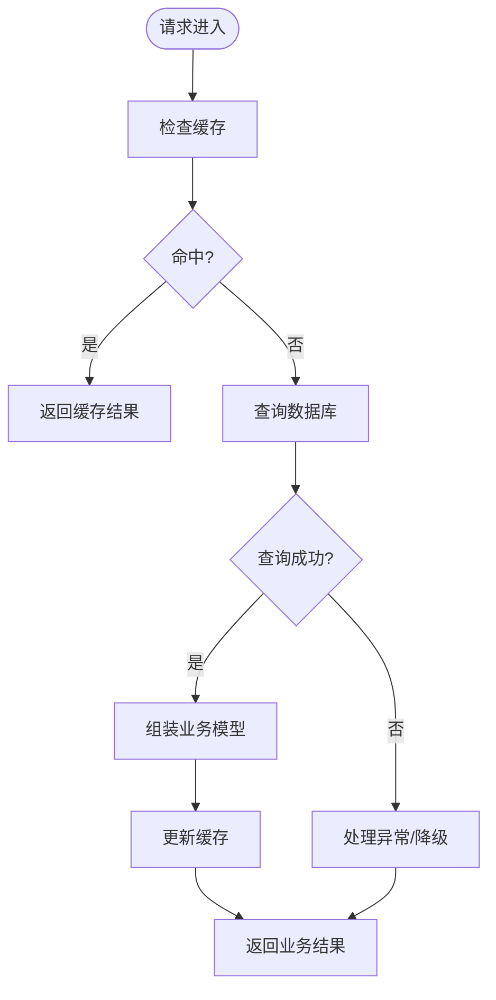
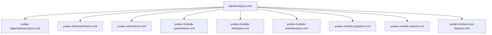

# 系统架构

<cite>
**本文引用的文件**
- [pom.xml](file://backend/pom.xml)
- [yudao-server/pom.xml](file://backend/yudao-server/pom.xml)
- [yudao-dependencies/pom.xml](file://backend/yudao-dependencies/pom.xml)
- [yudao-framework/pom.xml](file://backend/yudao-framework/pom.xml)
- [yudao-module-system/pom.xml](file://backend/yudao-module-system/pom.xml)
- [yudao-module-infra/pom.xml](file://backend/yudao-module-infra/pom.xml)
- [yudao-module-member/pom.xml](file://backend/yudao-module-member/pom.xml)
- [yudao-module-pay/pom.xml](file://backend/yudao-module-pay/pom.xml)
- [yudao-module-ai/pom.xml](file://backend/yudao-module-ai/pom.xml)
- [yudao-module-cps/yudao-module-cps-biz/pom.xml](file://backend/yudao-module-cps/yudao-module-cps-biz/pom.xml)
- [yudao-framework/yudao-spring-boot-starter-job/src/main/java/cn/iocoder/yudao/framework/quartz/package-info.java](file://backend/yudao-framework/yudao-spring-boot-starter-job/src/main/java/cn/iocoder/yudao/framework/quartz/package-info.java)
- [yudao-framework/yudao-spring-boot-starter-redis/src/main/java/cn/iocoder/yudao/framework/redis/package-info.java](file://backend/yudao-framework/yudao-spring-boot-starter-redis/src/main/java/cn/iocoder/yudao/framework/redis/package-info.java)
- [yudao-framework/yudao-spring-boot-starter-mq/src/main/java/cn/iocoder/yudao/framework/mq/package-info.java](file://backend/yudao-framework/yudao-spring-boot-starter-mq/src/main/java/cn/iocoder/yudao/framework/mq/package-info.java)
</cite>

## 目录
1. [引言](#引言)
2. [项目结构](#项目结构)
3. [核心组件](#核心组件)
4. [架构总览](#架构总览)
5. [详细组件分析](#详细组件分析)
6. [依赖分析](#依赖分析)
7. [性能考量](#性能考量)
8. [故障排查指南](#故障排查指南)
9. [结论](#结论)
10. [附录](#附录)

## 引言
本文件面向 AgenticCPS 项目，系统化梳理其基于 Spring Boot 的微服务多模块架构设计。项目采用 Maven 多模块聚合管理，以 yudao 为核心父工程，通过 yudao-dependencies 统一依赖版本，yudao-framework 提供可插拔的技术组件（如 Web、安全、MyBatis、Redis、定时任务、消息队列、监控、保护等），各业务模块（如 system、infra、member、pay、ai、cps 等）按领域拆分并复用框架组件，最终由 yudao-server 聚合并打包为可运行的后端服务。

## 项目结构
AgenticCPS 的后端采用“父工程 + 依赖管理 + 框架组件 + 业务模块 + 服务聚合”的分层结构：
- 父工程：backend/pom.xml，声明所有子模块并统一属性与插件。
- 依赖管理：yudao-dependencies/pom.xml，集中管理第三方依赖版本与 Bom。
- 框架组件：yudao-framework/pom.xml，聚合 yudao-common 与各类 starter，形成可复用的技术能力。
- 业务模块：yudao-module-system、yudao-module-infra、yudao-module-member、yudao-module-pay、yudao-module-ai、yudao-module-cps 等，按领域划分。
- 服务聚合：yudao-server/pom.xml，按需引入业务模块，打包为可执行服务。

**图表来源**
- [pom.xml:10-25](file://backend/pom.xml#L10-L25)
- [yudao-dependencies/pom.xml:84-686](file://backend/yudao-dependencies/pom.xml#L84-L686)
- [yudao-framework/pom.xml:12-31](file://backend/yudao-framework/pom.xml#L12-L31)

**章节来源**
- [pom.xml:10-25](file://backend/pom.xml#L10-L25)
- [yudao-framework/pom.xml:12-31](file://backend/yudao-framework/pom.xml#L12-L31)

## 核心组件
- 依赖管理组件：通过 yudao-dependencies/pom.xml 的 dependencyManagement 统一版本，避免依赖漂移；集中管理 Spring Boot、MyBatis、Redisson、Quartz、RocketMQ、SkyWalking、JustAuth、微信/支付宝 SDK 等生态组件。
- 框架组件：yudao-framework 下的 starter 提供横切能力，如 Web（接口文档、MVC）、Security（认证授权）、MyBatis（多数据源、联表查询、代码生成）、Redis（缓存、分布式锁）、Job（Quartz 定时任务）、MQ（多实现适配）、Monitor（链路追踪、指标）、Protection（签名防护）等。
- 业务模块：各模块仅聚焦自身领域，复用框架组件，降低重复开发与耦合度。
- 服务聚合：yudao-server 作为运行时容器，按需装配模块，打包为单体可执行服务。

**章节来源**
- [yudao-dependencies/pom.xml:84-686](file://backend/yudao-dependencies/pom.xml#L84-L686)
- [yudao-framework/pom.xml:12-31](file://backend/yudao-framework/pom.xml#L12-L31)
- [yudao-server/pom.xml:23-114](file://backend/yudao-server/pom.xml#L23-L114)

## 架构总览
AgenticCPS 采用“分层架构 + 模块化设计 + 适配器模式”的混合架构：
- 分层架构：表示层（Web 接口）、服务层（业务逻辑）、基础设施层（DB、Redis、MQ、定时任务、监控）清晰分层。
- 模块化设计：以 yudao-* 为单位按领域拆分，模块间通过 API 模块或共享依赖进行弱耦合协作。
- 适配器模式：框架组件以 Starter 形式提供，业务模块通过依赖装配即可获得能力，如 MQ 支持 Redis/RocketMQ/RabbitMQ/Kafka 的适配。

[本图为概念性架构示意，无需图表来源]

## 详细组件分析

### 模块化与职责划分
- yudao-module-system：通用业务（用户、部门、权限、数据字典、操作日志、邮件、社交登录等），向上支撑其他模块。
- yudao-module-infra：基础设施与研发工具（定时任务、WebSocket、代码生成、Spring Boot Admin、S3/FTP/SFTP、监控等）。
- yudao-module-member：会员中心（用户画像、等级、积分等）。
- yudao-module-pay：支付能力（商户、应用、支付、退款、钱包、转账）。
- yudao-module-ai：大模型接入（OpenAI、通义、文心、智谱、Ollama、Stable Diffusion 等），向量存储与 MCP 工具函数。
- yudao-module-cps：CPS 联盟返利系统（平台配置、推广位、订单同步、返利计算、提现、MCP AI 接口）。

**图表来源**
- [yudao-module-system/pom.xml:20-122](file://backend/yudao-module-system/pom.xml#L20-L122)
- [yudao-module-member/pom.xml:20-84](file://backend/yudao-module-member/pom.xml#L20-L84)
- [yudao-module-pay/pom.xml:21-81](file://backend/yudao-module-pay/pom.xml#L21-L81)
- [yudao-module-ai/pom.xml:28-262](file://backend/yudao-module-ai/pom.xml#L28-L262)
- [yudao-module-cps/yudao-module-cps-biz/pom.xml:20-99](file://backend/yudao-module-cps/yudao-module-cps-biz/pom.xml#L20-L99)

**章节来源**
- [yudao-module-system/pom.xml:20-122](file://backend/yudao-module-system/pom.xml#L20-L122)
- [yudao-module-infra/pom.xml:21-117](file://backend/yudao-module-infra/pom.xml#L21-L117)
- [yudao-module-member/pom.xml:20-84](file://backend/yudao-module-member/pom.xml#L20-L84)
- [yudao-module-pay/pom.xml:21-81](file://backend/yudao-module-pay/pom.xml#L21-L81)
- [yudao-module-ai/pom.xml:28-262](file://backend/yudao-module-ai/pom.xml#L28-L262)
- [yudao-module-cps/yudao-module-cps-biz/pom.xml:20-99](file://backend/yudao-module-cps/yudao-module-cps-biz/pom.xml#L20-L99)

### 技术选型与框架集成
- Web 与接口文档：Knife4j/OpenAPI3，提供在线接口文档与调试能力。
- 安全：Spring Security + JWT，结合 yudao-spring-boot-starter-security。
- 数据访问：MyBatis + MyBatis-Plus，支持多数据源与联表查询；动态数据源、代码生成器、EasyTrans 字典翻译。
- 缓存与分布式锁：Redis + Redisson，提供缓存、布隆过滤器、限流、分布式锁等。
- 定时任务：Quartz，支持集群化持久化与高可用。
- 消息队列：多实现适配（Redis、RocketMQ、RabbitMQ、Kafka），统一抽象。
- 监控与链路追踪：SkyWalking、Spring Boot Admin、Actuator。
- 保护与安全：Lock4j（基于 Redisson 的分布式锁）、签名保护、IP 地址组件。
- AI 能力：Spring AI 生态，接入多家大模型与向量存储，MCP 工具函数。

**图表来源**
- [yudao-dependencies/pom.xml:138-686](file://backend/yudao-dependencies/pom.xml#L138-L686)
- [yudao-framework/yudao-spring-boot-starter-job/src/main/java/cn/iocoder/yudao/framework/quartz/package-info.java:1-8](file://backend/yudao-framework/yudao-spring-boot-starter-job/src/main/java/cn/iocoder/yudao/framework/quartz/package-info.java#L1-L8)
- [yudao-framework/yudao-spring-boot-starter-redis/src/main/java/cn/iocoder/yudao/framework/redis/package-info.java:1-5](file://backend/yudao-framework/yudao-spring-boot-starter-redis/src/main/java/cn/iocoder/yudao/framework/redis/package-info.java#L1-L5)
- [yudao-framework/yudao-spring-boot-starter-mq/src/main/java/cn/iocoder/yudao/framework/mq/package-info.java:1-5](file://backend/yudao-framework/yudao-spring-boot-starter-mq/src/main/java/cn/iocoder/yudao/framework/mq/package-info.java#L1-L5)

**章节来源**
- [yudao-dependencies/pom.xml:84-686](file://backend/yudao-dependencies/pom.xml#L84-L686)
- [yudao-framework/yudao-spring-boot-starter-job/src/main/java/cn/iocoder/yudao/framework/quartz/package-info.java:1-8](file://backend/yudao-framework/yudao-spring-boot-starter-job/src/main/java/cn/iocoder/yudao/framework/quartz/package-info.java#L1-L8)
- [yudao-framework/yudao-spring-boot-starter-redis/src/main/java/cn/iocoder/yudao/framework/redis/package-info.java:1-5](file://backend/yudao-framework/yudao-spring-boot-starter-redis/src/main/java/cn/iocoder/yudao/framework/redis/package-info.java#L1-L5)
- [yudao-framework/yudao-spring-boot-starter-mq/src/main/java/cn/iocoder/yudao/framework/mq/package-info.java:1-5](file://backend/yudao-framework/yudao-spring-boot-starter-mq/src/main/java/cn/iocoder/yudao/framework/mq/package-info.java#L1-L5)

### 横切关注点实现
- 定时任务：基于 Quartz 的 Job Starter，支持持久化与集群，适合跨模块的周期性任务（对账、报表、清理等）。
- 分布式锁：基于 Redisson 的 Lock4j，保障并发一致性（幂等、库存扣减、返利结算等）。
- 缓存策略：以 Redis 为中心，结合本地缓存与过期策略，配合布隆过滤器降低冷查询与 DB 压力。
- 消息队列：异步解耦，支持延迟、死信、重试；多实现适配满足不同场景（高吞吐、可靠投递、流处理）。
- 监控与链路追踪：SkyWalking 与 Spring Boot Admin，覆盖调用链、指标、健康检查与可视化。

[本图为通用流程示意，无需图表来源]

**章节来源**
- [yudao-framework/yudao-spring-boot-starter-job/src/main/java/cn/iocoder/yudao/framework/quartz/package-info.java:1-8](file://backend/yudao-framework/yudao-spring-boot-starter-job/src/main/java/cn/iocoder/yudao/framework/quartz/package-info.java#L1-L8)
- [yudao-framework/yudao-spring-boot-starter-redis/src/main/java/cn/iocoder/yudao/framework/redis/package-info.java:1-5](file://backend/yudao-framework/yudao-spring-boot-starter-redis/src/main/java/cn/iocoder/yudao/framework/redis/package-info.java#L1-L5)
- [yudao-framework/yudao-spring-boot-starter-mq/src/main/java/cn/iocoder/yudao/framework/mq/package-info.java:1-5](file://backend/yudao-framework/yudao-spring-boot-starter-mq/src/main/java/cn/iocoder/yudao/framework/mq/package-info.java#L1-L5)

### 系统边界与集成点
- 系统边界：以 yudao-server 为运行边界，对外提供 REST API；内部通过模块化与框架组件实现能力复用。
- 集成点：与外部系统（微信/支付宝、各大模型厂商、对象存储）通过 SDK 与 HTTP 接口集成；内部通过 MQ 与定时任务实现模块间协作。

**章节来源**
- [yudao-server/pom.xml:23-114](file://backend/yudao-server/pom.xml#L23-L114)
- [yudao-module-ai/pom.xml:77-261](file://backend/yudao-module-ai/pom.xml#L77-L261)
- [yudao-module-pay/pom.xml:70-80](file://backend/yudao-module-pay/pom.xml#L70-L80)

## 依赖分析
- 父工程聚合：backend/pom.xml 声明 yudao-dependencies、yudao-framework、yudao-server 以及各业务模块。
- 依赖管理：yudao-dependencies/pom.xml 通过 dependencyManagement 统一版本，避免子模块重复声明。
- 模块依赖：yudao-server/pom.xml 动态装配业务模块；各业务模块之间通过共享依赖（如 system、infra）建立弱耦合。

**图表来源**
- [pom.xml:10-25](file://backend/pom.xml#L10-L25)
- [yudao-server/pom.xml:23-114](file://backend/yudao-server/pom.xml#L23-L114)
- [yudao-module-system/pom.xml:20-122](file://backend/yudao-module-system/pom.xml#L20-L122)
- [yudao-module-infra/pom.xml:21-117](file://backend/yudao-module-infra/pom.xml#L21-L117)
- [yudao-module-member/pom.xml:20-84](file://backend/yudao-module-member/pom.xml#L20-L84)
- [yudao-module-pay/pom.xml:21-81](file://backend/yudao-module-pay/pom.xml#L21-L81)
- [yudao-module-ai/pom.xml:28-262](file://backend/yudao-module-ai/pom.xml#L28-L262)
- [yudao-module-cps/yudao-module-cps-biz/pom.xml:20-99](file://backend/yudao-module-cps/yudao-module-cps-biz/pom.xml#L20-L99)

**章节来源**
- [pom.xml:10-25](file://backend/pom.xml#L10-L25)
- [yudao-dependencies/pom.xml:84-686](file://backend/yudao-dependencies/pom.xml#L84-L686)

## 性能考量
- 缓存优先：热点数据走 Redis，结合布隆过滤器减少无效查询；合理设置过期时间与淘汰策略。
- 异步化：耗时操作通过 MQ 异步处理，削峰填谷；定时任务拆分粒度，避免长事务阻塞。
- 并发控制：分布式锁保障关键路径幂等；线程池与限流策略防止雪崩。
- 数据库优化：多数据源与读写分离、联表查询优化、索引与慢查治理。
- 监控可观测：链路追踪与指标采集，快速定位瓶颈与异常。

[本节为通用性能建议，无需章节来源]

## 故障排查指南
- 接口文档：通过 Knife4j/OpenAPI3 快速验证接口与参数。
- 日志与链路：SkyWalking 查看调用链，定位异常节点；Admin/Actuator 查看实例状态。
- 缓存问题：确认键空间、过期策略与热点键；必要时清空或降级。
- MQ 消费：检查消费者组、堆积与死信；核对序列化与幂等。
- 定时任务：核对 Quartz 集群配置与触发器；排查并发执行与失败重试。
- 分布式锁：确认锁释放与超时；排查死锁与误删。

[本节为通用排查建议，无需章节来源]

## 结论
AgenticCPS 以 yudao 为核心，通过统一依赖管理与可插拔框架组件，实现了清晰的分层与模块化设计。业务模块按领域拆分、弱耦合协作，服务聚合层提供统一运行载体。结合 Quartz、Redisson、多实现 MQ、SkyWalking 等技术栈，系统具备良好的扩展性、稳定性与可观测性。CPS 与 AI 能力的融合，为智能代理与返利闭环提供了坚实基础。

[本节为总结性内容，无需章节来源]

## 附录
- 部署拓扑建议：前端（admin-uniapp/admin-vue3）+ 后端（yudao-server）+ 基础设施（MySQL/Redis/RocketMQ/SkyWalking/Admin）。可按模块独立部署或集中部署，依据流量与 SLA 调整。
- 扩展性考虑：新增模块遵循 yudao-* 规范；通过 yudao-dependencies 统一升级依赖；利用框架组件快速补齐能力；通过 MQ 与定时任务实现模块间解耦。

[本节为通用建议，无需章节来源]