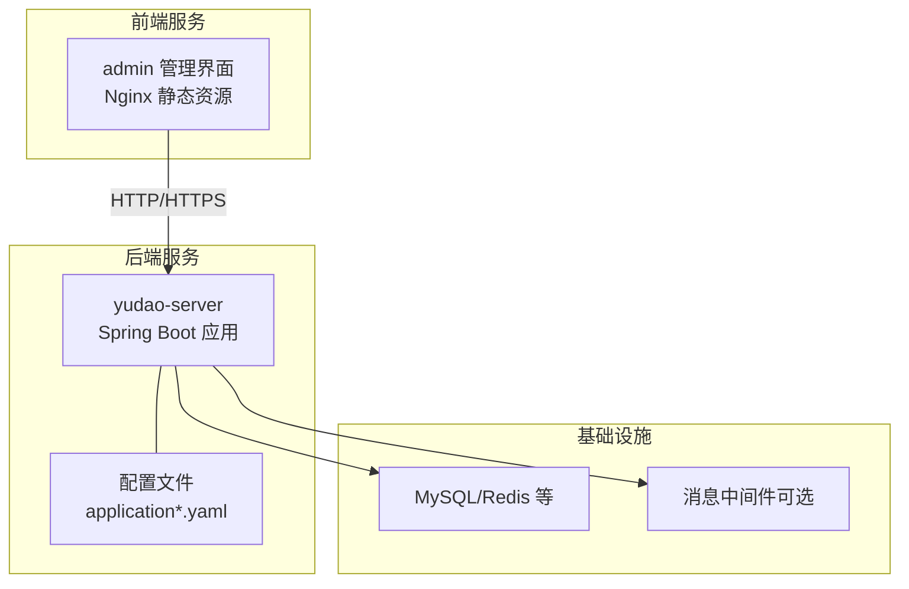
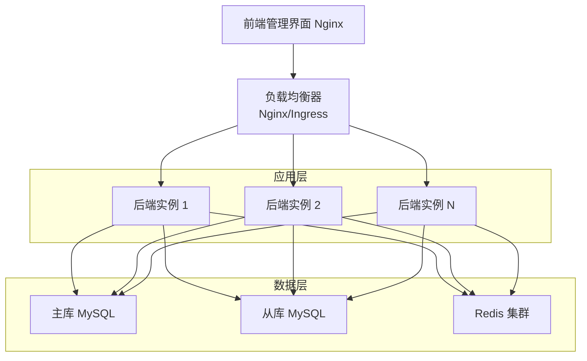
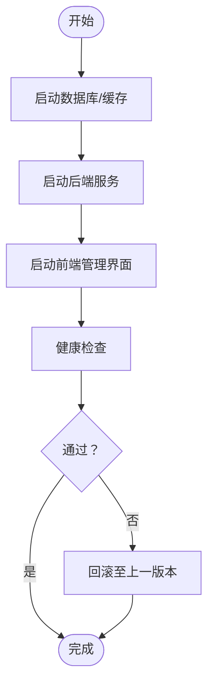
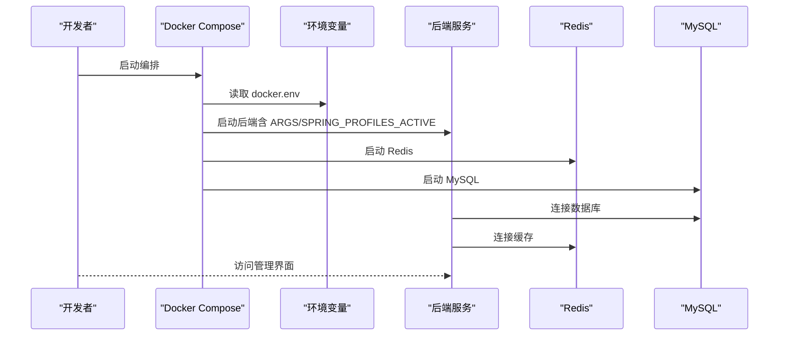
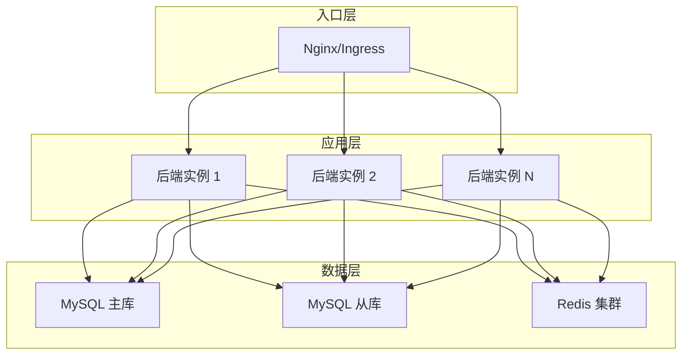
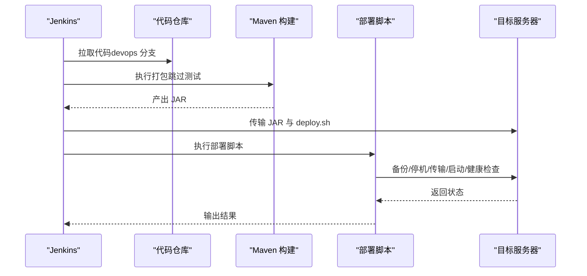
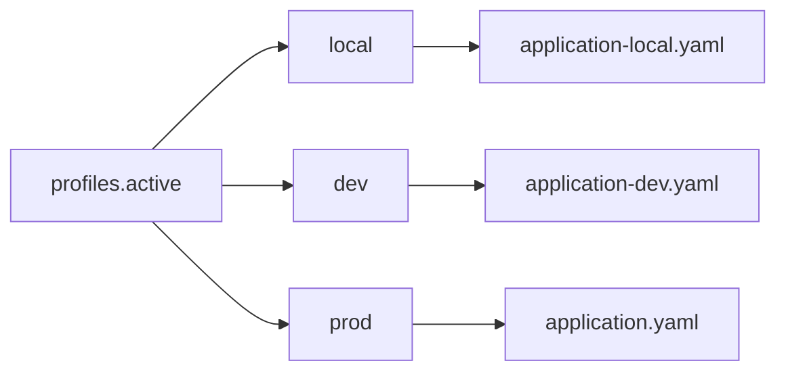
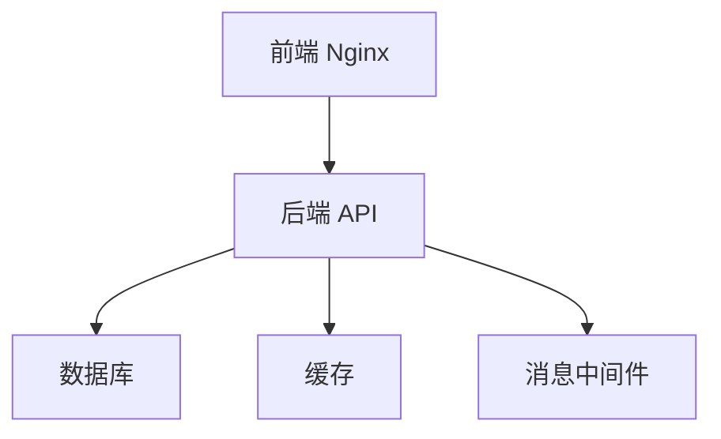

# 部署架构

<cite>
**本文引用的文件**
- [docker-compose.yml](file://backend/script/docker/docker-compose.yml)
- [docker.env](file://backend/script/docker/docker.env)
- [Docker-HOWTO.md](file://backend/script/docker/Docker-HOWTO.md)
- [Dockerfile（后端）](file://backend/yudao-server/Dockerfile)
- [Jenkinsfile](file://backend/script/jenkins/Jenkinsfile)
- [部署脚本 deploy.sh](file://backend/script/shell/deploy.sh)
- [application.yaml](file://backend/yudao-server/src/main/resources/application.yaml)
- [application-dev.yaml](file://backend/yudao-server/src/main/resources/application-dev.yaml)
- [application-local.yaml](file://backend/yudao-server/src/main/resources/application-local.yaml)
- [多数据库 docker-compose.yaml](file://backend/sql/tools/docker-compose.yaml)
</cite>

## 目录
1. [简介](#简介)
2. [项目结构](#项目结构)
3. [核心组件](#核心组件)
4. [架构总览](#架构总览)
5. [详细组件分析](#详细组件分析)
6. [依赖分析](#依赖分析)
7. [性能考虑](#性能考虑)
8. [故障排查指南](#故障排查指南)
9. [结论](#结论)
10. [附录](#附录)

## 简介
本文件面向 AgenticCPS 项目的部署与运维团队，系统化阐述单机部署、集群部署与容器化部署方案，涵盖 Docker 编排、负载均衡、高可用设计、CI/CD 流水线（Jenkins）、环境管理（开发/测试/生产）以及监控告警配置。文档同时提供部署最佳实践、故障恢复策略与性能调优建议，帮助读者在不同规模与环境下稳定交付系统。

## 项目结构
AgenticCPS 由后端 Spring Boot 服务、前端管理界面、数据库与消息中间件组成。后端通过 Maven 构建为可执行 JAR，配合 Dockerfile 打包为镜像；前端通过 Nginx 提供静态资源与反向代理；数据库与消息中间件通过 docker-compose 提供本地或开发环境的一键拉起。

图表来源
- [docker-compose.yml:5-78](file://backend/script/docker/docker-compose.yml#L5-L78)
- [application.yaml:1-362](file://backend/yudao-server/src/main/resources/application.yaml#L1-L362)

章节来源
- [docker-compose.yml:1-85](file://backend/script/docker/docker-compose.yml#L1-L85)
- [Dockerfile（后端）:1-24](file://backend/yudao-server/Dockerfile#L1-L24)
- [application.yaml:1-362](file://backend/yudao-server/src/main/resources/application.yaml#L1-L362)

## 核心组件
- 后端服务（yudao-server）
  - 基于 Spring Boot，打包为 JAR，容器内以 Java 进程运行。
  - 通过环境变量与配置文件切换开发/本地/生产等环境。
- 前端管理界面（admin）
  - 基于 Nginx 提供静态资源与 API 反向代理。
  - 通过构建参数注入环境变量（如 BASE_API、标题等）。
- 数据库与缓存
  - MySQL 与 Redis 通过 docker-compose 提供，支持持久化卷。
- CI/CD 流水线（Jenkins）
  - 通过 Jenkinsfile 定义检出、构建、打包与部署步骤。
- 部署脚本
  - 提供单机部署的优雅停机、备份与健康检查流程。

章节来源
- [Dockerfile（后端）:1-24](file://backend/yudao-server/Dockerfile#L1-L24)
- [docker-compose.yml:29-78](file://backend/script/docker/docker-compose.yml#L29-L78)
- [Jenkinsfile:1-61](file://backend/script/jenkins/Jenkinsfile#L1-L61)
- [部署脚本 deploy.sh:1-161](file://backend/script/shell/deploy.sh#L1-L161)

## 架构总览
AgenticCPS 支持多种部署形态：
- 单机部署：本地或单台服务器上运行后端与前端，数据库与缓存通过 docker-compose 或外部实例提供。
- 容器化部署：使用 docker-compose 或 Kubernetes 编排，实现服务发现、弹性扩缩容与滚动升级。
- 集群部署：通过负载均衡与多副本后端，结合数据库主从/读写分离与缓存集群，提升可用性与吞吐。

图表来源
- [docker-compose.yml:29-78](file://backend/script/docker/docker-compose.yml#L29-L78)
- [application-dev.yaml:48-57](file://backend/yudao-server/src/main/resources/application-dev.yaml#L48-L57)

## 详细组件分析

### 单机部署（本地/物理机）
- 启动顺序
  - 先启动数据库与缓存（docker-compose 或外部实例）。
  - 再启动后端服务（JAR 进程或容器），并配置环境变量（如数据库、Redis 地址）。
  - 最后启动前端管理界面（Nginx）。
- 配置要点
  - 使用 application-dev.yaml 或 application-local.yaml 切换开发/本地环境。
  - 通过 docker.env 或环境变量传入数据库与缓存连接信息。
- 健康检查与回滚
  - 部署脚本提供优雅停机、备份与健康检查，失败时可回滚至上一个版本。

图表来源
- [Docker-HOWTO.md:34-42](file://backend/script/docker/Docker-HOWTO.md#L34-L42)
- [部署脚本 deploy.sh:106-143](file://backend/script/shell/deploy.sh#L106-L143)

章节来源
- [Docker-HOWTO.md:1-50](file://backend/script/docker/Docker-HOWTO.md#L1-L50)
- [docker.env:1-26](file://backend/script/docker/docker.env#L1-L26)
- [application-dev.yaml:1-213](file://backend/yudao-server/src/main/resources/application-dev.yaml#L1-L213)
- [application-local.yaml:1-294](file://backend/yudao-server/src/main/resources/application-local.yaml#L1-L294)
- [部署脚本 deploy.sh:1-161](file://backend/script/shell/deploy.sh#L1-L161)

### 容器化部署（Docker Compose）
- 服务编排
  - mysql、redis、server（后端）、admin（前端）四服务协同。
  - 端口映射：admin 映射 8080:80，server 映射 48080:48080，mysql 3306，redis 6379。
- 环境变量
  - 通过 docker-compose.yml 的 environment 与 depends_on 管理依赖。
  - docker.env 提供默认值，便于本地快速启动。
- 镜像构建
  - 后端使用 Dockerfile 构建，暴露 48080 端口，设置 JAVA_OPTS 与 ARGS。

图表来源
- [docker-compose.yml:5-78](file://backend/script/docker/docker-compose.yml#L5-L78)
- [docker.env:1-26](file://backend/script/docker/docker.env#L1-L26)
- [Dockerfile（后端）:1-24](file://backend/yudao-server/Dockerfile#L1-L24)

章节来源
- [docker-compose.yml:1-85](file://backend/script/docker/docker-compose.yml#L1-L85)
- [docker.env:1-26](file://backend/script/docker/docker.env#L1-L26)
- [Dockerfile（后端）:1-24](file://backend/yudao-server/Dockerfile#L1-L24)

### 集群部署（高可用与扩展）
- 负载均衡
  - 使用 Nginx 或 Ingress 将流量分发至多个后端实例。
- 数据层高可用
  - MySQL 主从/读写分离，Redis 集群，确保热点与容量扩展。
- 配置与环境隔离
  - 通过 application.yaml 的 profiles 切换环境，配合环境变量覆盖敏感配置。
- 横向扩展
  - 后端服务可水平扩展，结合数据库连接池与缓存集群满足并发需求。

图表来源
- [application.yaml:5-6](file://backend/yudao-server/src/main/resources/application.yaml#L5-L6)
- [application-dev.yaml:48-57](file://backend/yudao-server/src/main/resources/application-dev.yaml#L48-L57)

章节来源
- [application.yaml:1-362](file://backend/yudao-server/src/main/resources/application.yaml#L1-L362)
- [application-dev.yaml:1-213](file://backend/yudao-server/src/main/resources/application-dev.yaml#L1-L213)

### CI/CD 流水线（Jenkins）
- 流水线阶段
  - 检出：从指定仓库与分支拉取代码。
  - 构建：根据 HOME 下是否存在 resources 目录决定是否替换配置文件，随后执行 Maven 打包。
  - 部署：复制构建产物与部署脚本到目标路径，赋予执行权限并触发部署。
- 环境凭证
  - DockerHub、GitHub、Kubernetes kubeconfig 凭证 ID 在环境段落中声明。
- 部署脚本
  - 部署脚本负责备份、优雅停机、传输新包、启动与健康检查。

图表来源
- [Jenkinsfile:1-61](file://backend/script/jenkins/Jenkinsfile#L1-L61)
- [部署脚本 deploy.sh:145-161](file://backend/script/shell/deploy.sh#L145-L161)

章节来源
- [Jenkinsfile:1-61](file://backend/script/jenkins/Jenkinsfile#L1-L61)
- [部署脚本 deploy.sh:1-161](file://backend/script/shell/deploy.sh#L1-L161)

### 环境管理（开发/测试/生产）
- 环境切换
  - 通过 application.yaml 的 profiles.active 切换环境（如 local/dev/prod）。
  - docker-compose.yml 中通过 SPRING_PROFILES_ACTIVE 指定本地环境。
- 配置覆盖
  - docker.env 提供默认值，可在不同环境中覆盖数据库、Redis、前端构建参数等。
- 多数据库支持
  - 提供多数据库 docker-compose，便于在不同数据库间切换验证。

图表来源
- [application.yaml:5-6](file://backend/yudao-server/src/main/resources/application.yaml#L5-L6)
- [docker-compose.yml:37-46](file://backend/script/docker/docker-compose.yml#L37-L46)
- [docker.env:1-26](file://backend/script/docker/docker.env#L1-L26)
- [多数据库 docker-compose.yaml:1-134](file://backend/sql/tools/docker-compose.yaml#L1-L134)

章节来源
- [application.yaml:1-362](file://backend/yudao-server/src/main/resources/application.yaml#L1-L362)
- [application-dev.yaml:1-213](file://backend/yudao-server/src/main/resources/application-dev.yaml#L1-L213)
- [application-local.yaml:1-294](file://backend/yudao-server/src/main/resources/application-local.yaml#L1-L294)
- [docker-compose.yml:1-85](file://backend/script/docker/docker-compose.yml#L1-L85)
- [docker.env:1-26](file://backend/script/docker/docker.env#L1-L26)
- [多数据库 docker-compose.yaml:1-134](file://backend/sql/tools/docker-compose.yaml#L1-L134)

### 监控与告警（建议）
- 监控端点
  - application-dev.yaml 暴露 Actuator 端点，便于健康检查与指标采集。
- 告警能力
  - 项目包含告警配置菜单与接口，可用于对接第三方告警平台（如 Prometheus/Grafana/PagerDuty）。
- 建议
  - 在生产环境启用只读端点、限流与熔断，结合链路追踪与日志聚合完善可观测性。

章节来源
- [application-dev.yaml:124-151](file://backend/yudao-server/src/main/resources/application-dev.yaml#L124-L151)
- [application.yaml:1-362](file://backend/yudao-server/src/main/resources/application.yaml#L1-L362)

## 依赖分析
- 组件耦合
  - 后端服务强依赖数据库与缓存；前端通过 Nginx 反向代理访问后端。
  - docker-compose 通过 depends_on 管理启动顺序，但不保证服务真正可用，需配合健康检查。
- 外部依赖
  - 数据库支持 MySQL、PostgreSQL、Oracle、SQLServer、达梦、人大金仓、openGauss 等。
  - 消息中间件支持 RocketMQ、Kafka、RabbitMQ 等（按配置启用）。

图表来源
- [docker-compose.yml:5-78](file://backend/script/docker/docker-compose.yml#L5-L78)
- [application-dev.yaml:100-114](file://backend/yudao-server/src/main/resources/application-dev.yaml#L100-L114)

章节来源
- [docker-compose.yml:1-85](file://backend/script/docker/docker-compose.yml#L1-L85)
- [application-dev.yaml:1-213](file://backend/yudao-server/src/main/resources/application-dev.yaml#L1-L213)

## 性能考虑
- JVM 与容器
  - Dockerfile 与部署脚本均提供 JAVA_OPTS 与堆转储路径，建议按业务峰值调整内存上限。
- 数据库连接池
  - application-dev.yaml 展示了 Druid 连接池的关键参数，建议根据并发与慢 SQL 情况调优。
- 缓存命中率
  - 合理设置缓存 TTL 与热点数据预热，减少数据库压力。
- 并发与限流
  - 结合限流与熔断组件，避免突发流量击穿系统。

章节来源
- [Dockerfile（后端）:11-18](file://backend/yudao-server/Dockerfile#L11-L18)
- [部署脚本 deploy.sh:18-26](file://backend/script/shell/deploy.sh#L18-L26)
- [application-dev.yaml:32-47](file://backend/yudao-server/src/main/resources/application-dev.yaml#L32-L47)

## 故障排查指南
- 健康检查失败
  - 部署脚本会轮询 /actuator/health，若非 200 则输出日志并退出。建议检查数据库连通性、缓存可用性与端口映射。
- 优雅停机
  - 脚本通过 kill -15 触发优雅停机，等待最多 120 秒；超时后强制 kill -9，需检查日志定位阻塞原因。
- 回滚策略
  - 部署前自动备份，失败时可回滚至上一个版本，建议保留最近 3 次备份。
- 端口冲突
  - docker-compose 默认端口与宿主机已有服务冲突时，请修改映射或释放端口。

章节来源
- [部署脚本 deploy.sh:60-143](file://backend/script/shell/deploy.sh#L60-L143)
- [docker-compose.yml:40-76](file://backend/script/docker/docker-compose.yml#L40-L76)

## 结论
AgenticCPS 提供了从单机到容器化再到集群化的完整部署路径。通过 docker-compose 与 Jenkins 流水线，团队可快速完成本地验证与自动化交付；通过 profiles 与环境变量实现多环境隔离；结合数据库与缓存的高可用方案，满足生产级可用性与性能要求。建议在生产环境进一步完善监控告警、限流熔断与容量规划，持续优化数据库与缓存策略。

## 附录
- 快速启动命令
  - 使用 docker-compose 一键启动：[Docker-HOWTO.md:34-42](file://backend/script/docker/Docker-HOWTO.md#L34-L42)
- 多数据库示例
  - 支持 MySQL、PostgreSQL、Oracle、SQLServer、达梦、人大金仓、openGauss：[多数据库 docker-compose.yaml:1-134](file://backend/sql/tools/docker-compose.yaml#L1-L134)
- 配置文件位置
  - application.yaml、application-dev.yaml、application-local.yaml：[application.yaml:1-362](file://backend/yudao-server/src/main/resources/application.yaml#L1-L362)、[application-dev.yaml:1-213](file://backend/yudao-server/src/main/resources/application-dev.yaml#L1-L213)、[application-local.yaml:1-294](file://backend/yudao-server/src/main/resources/application-local.yaml#L1-L294)