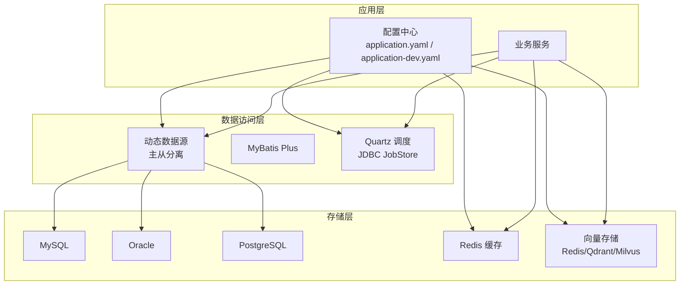
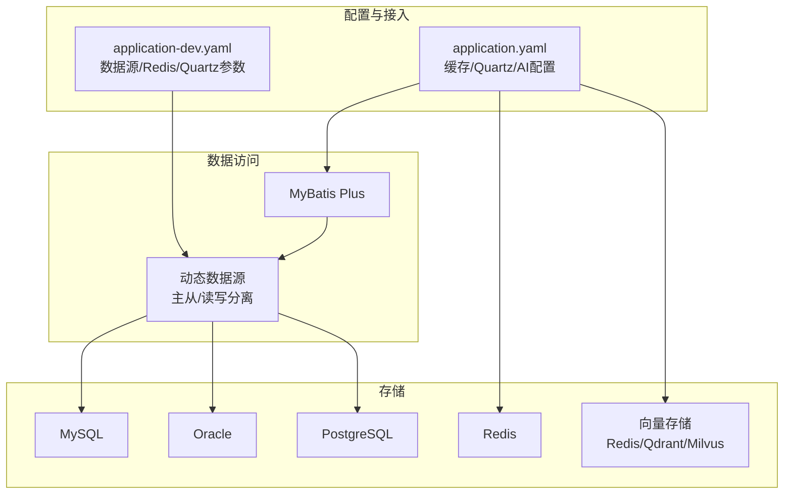
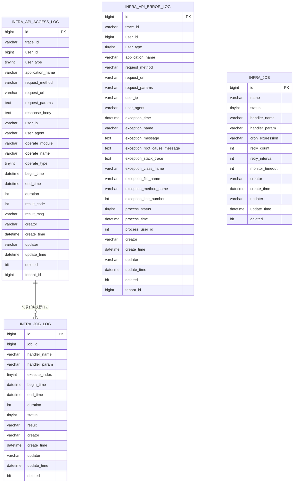
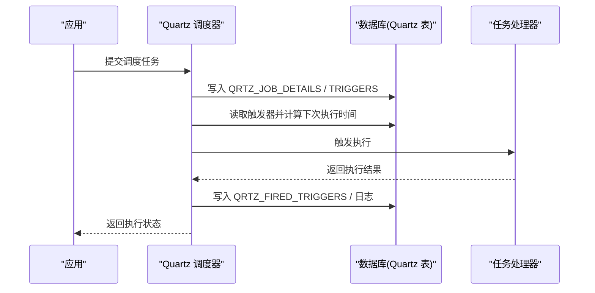
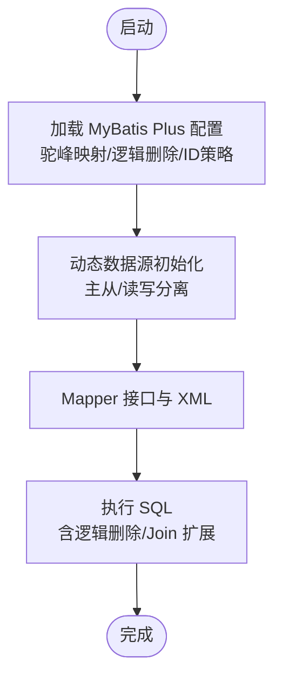
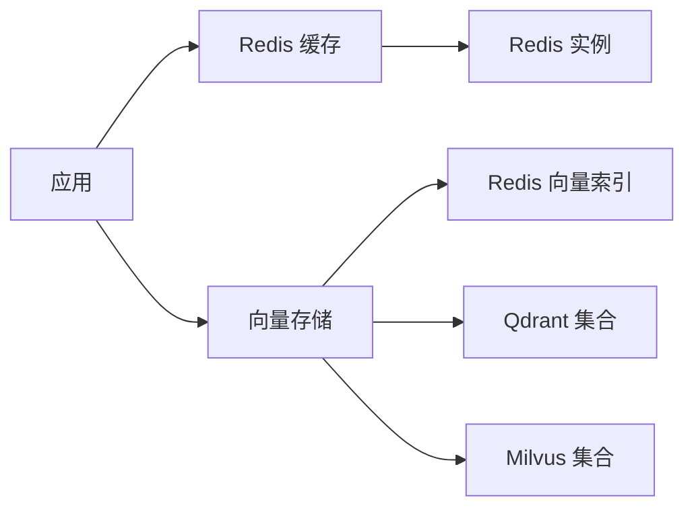
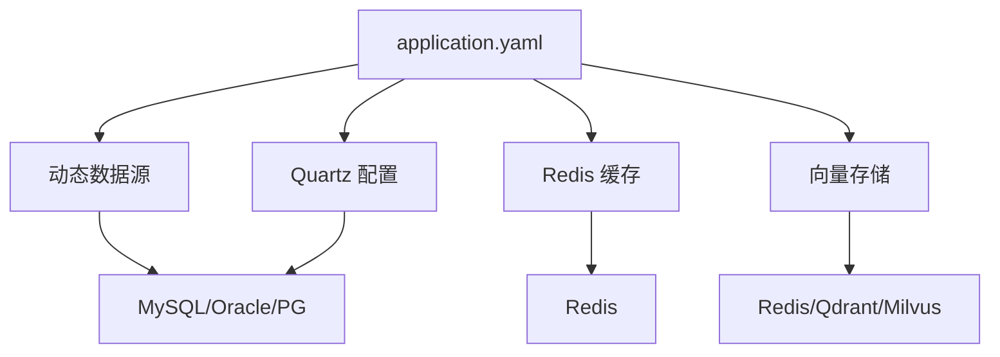

# 数据架构设计

<cite>
**本文引用的文件**
- [application.yaml](file://backend/yudao-server/src/main/resources/application.yaml)
- [application-dev.yaml](file://backend/yudao-server/src/main/resources/application-dev.yaml)
- [ruoyi-vue-pro.sql (MySQL)](file://backend/sql/mysql/ruoyi-vue-pro.sql)
- [quartz.sql (MySQL)](file://backend/sql/mysql/quartz.sql)
- [ruoyi-vue-pro.sql (Oracle)](file://backend/sql/oracle/ruoyi-vue-pro.sql)
- [ruoyi-vue-pro.sql (PostgreSQL)](file://backend/sql/postgresql/ruoyi-vue-pro.sql)
</cite>

## 目录
1. [简介](#简介)
2. [项目结构](#项目结构)
3. [核心组件](#核心组件)
4. [架构总览](#架构总览)
5. [详细组件分析](#详细组件分析)
6. [依赖关系分析](#依赖关系分析)
7. [性能考虑](#性能考虑)
8. [故障排查指南](#故障排查指南)
9. [结论](#结论)
10. [附录](#附录)

## 简介
本文件面向 AgenticCPS 的数据架构设计，聚焦于多数据库支持（MySQL、Oracle、PostgreSQL）、Redis 缓存架构、定时任务数据库设计与实现。文档从数据模型设计原则、表结构与索引策略、数据一致性机制出发，结合 MyBatis Plus 访问层、缓存策略、数据迁移与备份恢复方案，提供可落地的工程实践指导。

## 项目结构
- 后端服务配置位于 application.yaml 与 application-dev.yaml，集中定义了数据库连接池、Redis、Quartz 定时任务、缓存与 AI 向量存储等关键配置。
- 数据库脚本位于 backend/sql 下，按数据库类型拆分，包含基础业务表与 Quartz 调度表。
- 项目采用动态多数据源（主从）与 Quartz JDBC JobStore，支撑高可用与可扩展的定时任务能力。

**图表来源**
- [application.yaml:13-58](file://backend/yudao-server/src/main/resources/application.yaml#L13-L58)
- [application-dev.yaml:13-58](file://backend/yudao-server/src/main/resources/application-dev.yaml#L13-L58)
- [quartz.sql (MySQL):20-275](file://backend/sql/mysql/quartz.sql#L20-L275)

**章节来源**
- [application.yaml:13-58](file://backend/yudao-server/src/main/resources/application.yaml#L13-L58)
- [application-dev.yaml:13-58](file://backend/yudao-server/src/main/resources/application-dev.yaml#L13-L58)

## 核心组件
- 动态数据源与连接池：通过 Druid 在 application-dev.yaml 中配置初始/最大连接数、空闲检测、预编译语句缓存等，支持主从切换与读写分离。
- Quartz 调度：使用 JDBC JobStore 将作业与触发器持久化至数据库，支持集群部署与 Misfire 处理。
- Redis 缓存：统一 Cache 类型为 REDIS，配置 TTL 与多种业务缓存（验证码、社交登录状态等）。
- AI 向量存储：同时支持 Redis、Qdrant、Milvus，便于知识检索与向量相似度计算。
- 多数据库脚本：提供 MySQL、Oracle、PostgreSQL 的建表与索引脚本，确保跨数据库一致性。

**章节来源**
- [application-dev.yaml:33-47](file://backend/yudao-server/src/main/resources/application-dev.yaml#L33-L47)
- [application.yaml:26-31](file://backend/yudao-server/src/main/resources/application.yaml#L26-L31)
- [application.yaml:148-266](file://backend/yudao-server/src/main/resources/application.yaml#L148-L266)
- [quartz.sql (MySQL):20-275](file://backend/sql/mysql/quartz.sql#L20-L275)

## 架构总览
AgenticCPS 的数据架构围绕“统一配置 + 多数据源 + 缓存 + 定时任务 + 向量存储”展开，确保在不同数据库与部署环境下具备一致的数据行为与性能表现。

**图表来源**
- [application.yaml:26-31](file://backend/yudao-server/src/main/resources/application.yaml#L26-L31)
- [application.yaml:148-266](file://backend/yudao-server/src/main/resources/application.yaml#L148-L266)
- [application-dev.yaml:13-58](file://backend/yudao-server/src/main/resources/application-dev.yaml#L13-L58)

## 详细组件分析

### 关系型数据库设计（MySQL、Oracle、PostgreSQL）
- 基础表结构：以 infra_api_access_log、infra_api_error_log、infra_job、infra_job_log 等为核心，覆盖 API 访问日志、异常日志、定时任务与任务执行日志。
- 索引策略：针对高频查询字段（如 create_time）建立索引，提升日志清理与查询效率。
- 多数据库适配：提供三套建表脚本，分别适配 MySQL 的 utf8mb4、Oracle 的 NUMBER/VARCHAR2、PostgreSQL 的 int8/text 等类型映射。

**图表来源**
- [ruoyi-vue-pro.sql (MySQL):1-200](file://backend/sql/mysql/ruoyi-vue-pro.sql#L1-L200)
- [quartz.sql (MySQL):20-275](file://backend/sql/mysql/quartz.sql#L20-L275)

**章节来源**
- [ruoyi-vue-pro.sql (MySQL):1-200](file://backend/sql/mysql/ruoyi-vue-pro.sql#L1-L200)
- [ruoyi-vue-pro.sql (Oracle):13-200](file://backend/sql/oracle/ruoyi-vue-pro.sql#L13-L200)
- [ruoyi-vue-pro.sql (PostgreSQL):31-200](file://backend/sql/postgresql/ruoyi-vue-pro.sql#L31-L200)

### Quartz 定时任务数据库设计
- JobStore 类型：JDBC，持久化作业与触发器，支持集群与 Misfire。
- 关键表：QRTZ_JOB_DETAILS、QRTZ_TRIGGERS、QRTZ_CRON_TRIGGERS、QRTZ_FIRED_TRIGGERS、QRTZ_SCHEDULER_STATE 等。
- 配置要点：集群检查间隔、Misfire 阀值、线程池大小、Schema 初始化策略等。

**图表来源**
- [quartz.sql (MySQL):20-275](file://backend/sql/mysql/quartz.sql#L20-L275)
- [application-dev.yaml:69-96](file://backend/yudao-server/src/main/resources/application-dev.yaml#L69-L96)

**章节来源**
- [quartz.sql (MySQL):20-275](file://backend/sql/mysql/quartz.sql#L20-L275)
- [application-dev.yaml:69-96](file://backend/yudao-server/src/main/resources/application-dev.yaml#L69-L96)

### 数据访问层设计（MyBatis Plus）
- 配置要点：驼峰映射、逻辑删除值、全局 ID 策略（NONE 智能模式，支持多数据库）。
- Join 扩展：mybatis-plus-join 提供子表逻辑删除、缓存与表别名等增强能力。
- 多数据库兼容：通过动态数据源与 ID 类型策略适配不同数据库的自增/非自增差异。

**图表来源**
- [application.yaml:67-89](file://backend/yudao-server/src/main/resources/application.yaml#L67-L89)
- [application-dev.yaml:33-58](file://backend/yudao-server/src/main/resources/application-dev.yaml#L33-L58)

**章节来源**
- [application.yaml:67-89](file://backend/yudao-server/src/main/resources/application.yaml#L67-L89)

### 缓存架构设计（Redis）
- 统一缓存类型：REDIS，TTL 1 小时。
- 业务缓存：
  - 验证码：支持 Redis 缓存与阈值清理。
  - 社交登录状态：Redis 缓存与超时控制。
  - 微信/小程序配置：RedisTemplate 共享 Token。
- 向量存储：Redis、Qdrant、Milvus 多实现，支持知识检索与相似度匹配。

**图表来源**
- [application.yaml:26-31](file://backend/yudao-server/src/main/resources/application.yaml#L26-L31)
- [application.yaml:148-266](file://backend/yudao-server/src/main/resources/application.yaml#L148-L266)
- [application-dev.yaml:151-168](file://backend/yudao-server/src/main/resources/application-dev.yaml#L151-L168)

**章节来源**
- [application.yaml:26-31](file://backend/yudao-server/src/main/resources/application.yaml#L26-L31)
- [application.yaml:148-266](file://backend/yudao-server/src/main/resources/application.yaml#L148-L266)
- [application-dev.yaml:151-168](file://backend/yudao-server/src/main/resources/application-dev.yaml#L151-L168)

### 多数据库兼容性设计
- 类型映射：MySQL 使用 utf8mb4，Oracle 使用 NUMBER/VARCHAR2，PostgreSQL 使用 int8/text 等，确保字段语义一致。
- 主键策略：MySQL 支持自增，Oracle/PG 使用序列或分配策略，ID 类型策略为 NONE 以适配不同数据库。
- 索引与约束：统一在各数据库脚本中创建索引与主键约束，保证查询性能与数据完整性。

**章节来源**
- [ruoyi-vue-pro.sql (Oracle):13-200](file://backend/sql/oracle/ruoyi-vue-pro.sql#L13-L200)
- [ruoyi-vue-pro.sql (PostgreSQL):31-200](file://backend/sql/postgresql/ruoyi-vue-pro.sql#L31-L200)
- [application.yaml:70-78](file://backend/yudao-server/src/main/resources/application.yaml#L70-L78)

### 数据一致性保证机制
- 事务边界：业务层明确事务范围，避免跨库事务；对强一致需求使用本地事务与幂等设计。
- 逻辑删除：统一逻辑删除字段与值，配合查询过滤，减少物理删除风险。
- Quartz 一致性：JDBC JobStore 与集群配置，确保任务执行的最终一致性与可恢复性。
- 缓存一致性：TTL 与热点数据失效策略，结合缓存穿透防护与热点键降载。

**章节来源**
- [application.yaml:67-89](file://backend/yudao-server/src/main/resources/application.yaml#L67-L89)
- [application-dev.yaml:69-96](file://backend/yudao-server/src/main/resources/application-dev.yaml#L69-L96)

### 数据迁移与备份恢复
- 迁移策略：使用各数据库脚本进行结构迁移，结合版本化管理与回滚脚本。
- 备份策略：数据库定期全量/增量备份，Quartz 表结构与作业数据纳入备份范围。
- 恢复流程：先恢复数据库，再恢复 Quartz 表与作业配置，最后重启应用并验证。

**章节来源**
- [quartz.sql (MySQL):20-275](file://backend/sql/mysql/quartz.sql#L20-L275)

## 依赖关系分析
- 配置依赖：application.yaml 作为全局配置入口，application-dev.yaml 覆盖开发环境参数。
- 组件耦合：数据访问层与存储层松耦合，通过动态数据源与 ORM 框架屏蔽底层差异。
- 外部集成：Redis 与向量存储作为外部依赖，通过配置中心统一管理。

**图表来源**
- [application.yaml:26-31](file://backend/yudao-server/src/main/resources/application.yaml#L26-L31)
- [application.yaml:148-266](file://backend/yudao-server/src/main/resources/application.yaml#L148-L266)
- [application-dev.yaml:13-58](file://backend/yudao-server/src/main/resources/application-dev.yaml#L13-L58)

**章节来源**
- [application.yaml:26-31](file://backend/yudao-server/src/main/resources/application.yaml#L26-L31)
- [application-dev.yaml:13-58](file://backend/yudao-server/src/main/resources/application-dev.yaml#L13-L58)

## 性能考虑
- 连接池调优：根据并发与慢 SQL 阈值调整初始/最大连接数、空闲检测与预编译缓存。
- 索引优化：对高频查询字段建立合适索引，避免全表扫描；定期分析与重建索引。
- Quartz 线程池：根据任务复杂度与并发需求调整线程数与优先级。
- 缓存命中率：合理设置 TTL 与热点键降载，避免缓存雪崩与击穿。

## 故障排查指南
- 数据库连接异常：检查 application-dev.yaml 中数据源 URL、用户名、密码与连接池参数。
- Quartz 任务不执行：确认 JobStore 类型、Schema 初始化策略与集群配置，检查 Misfire 阀值。
- 缓存不可用：核对 Redis 地址、端口、密码与 Key 前缀，验证向量存储连接参数。
- 日志与监控：利用 Druid 监控面板与 Actuator 端点，定位慢 SQL 与系统健康状况。

**章节来源**
- [application-dev.yaml:13-58](file://backend/yudao-server/src/main/resources/application-dev.yaml#L13-L58)
- [application-dev.yaml:69-96](file://backend/yudao-server/src/main/resources/application-dev.yaml#L69-L96)
- [application.yaml:125-145](file://backend/yudao-server/src/main/resources/application.yaml#L125-L145)

## 结论
AgenticCPS 的数据架构以“统一配置 + 多数据源 + 缓存 + 定时任务 + 向量存储”为核心，通过标准化的表结构与索引策略、灵活的多数据库适配与缓存策略、以及 Quartz 的可靠调度，实现了在不同数据库与部署环境下的高性能与高可用。建议在生产环境中进一步完善监控告警、备份演练与容量规划，持续优化索引与缓存命中率。

## 附录
- 配置清单与参数说明可参考 application.yaml 与 application-dev.yaml。
- 数据库脚本与 Quartz 表结构可参考 backend/sql 下对应文件。