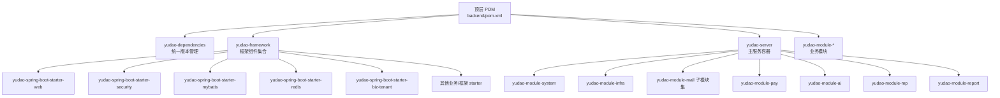
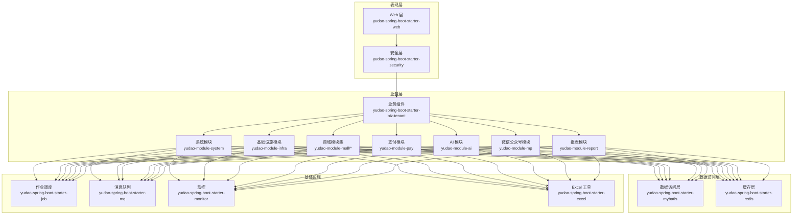
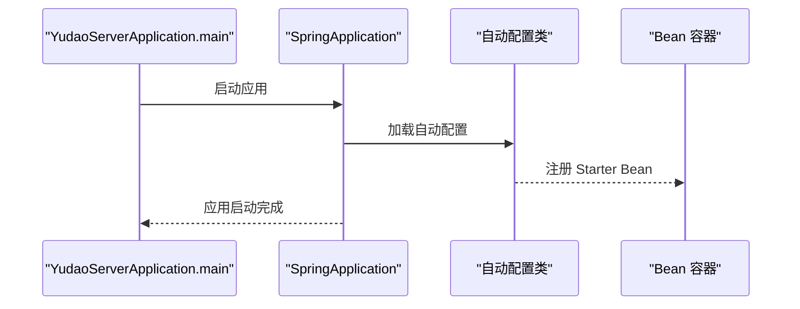
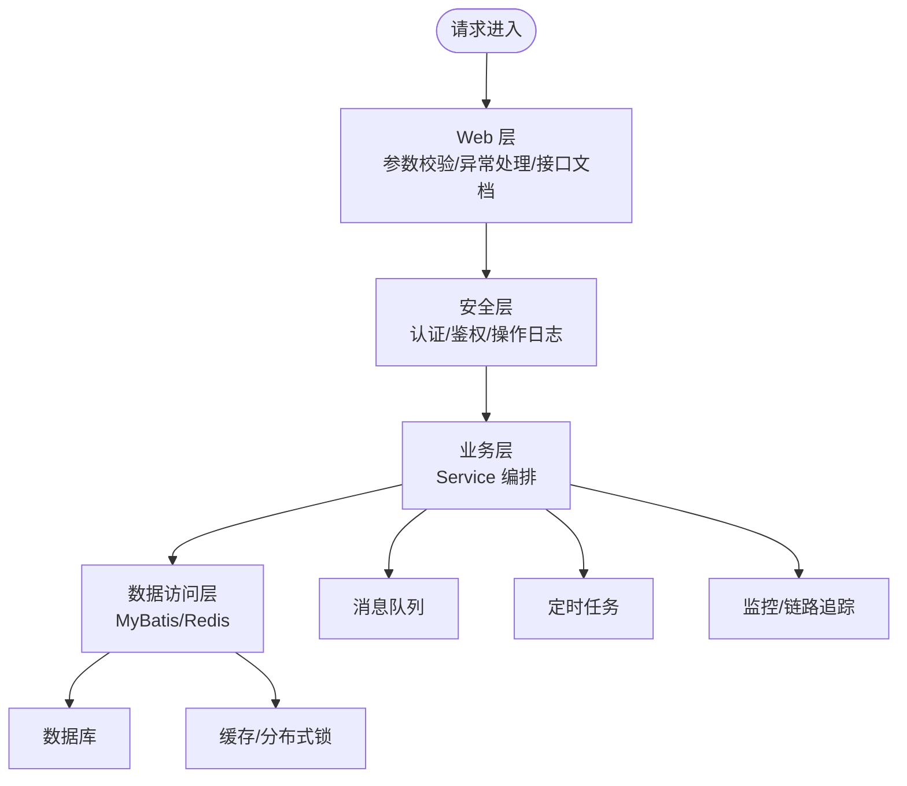
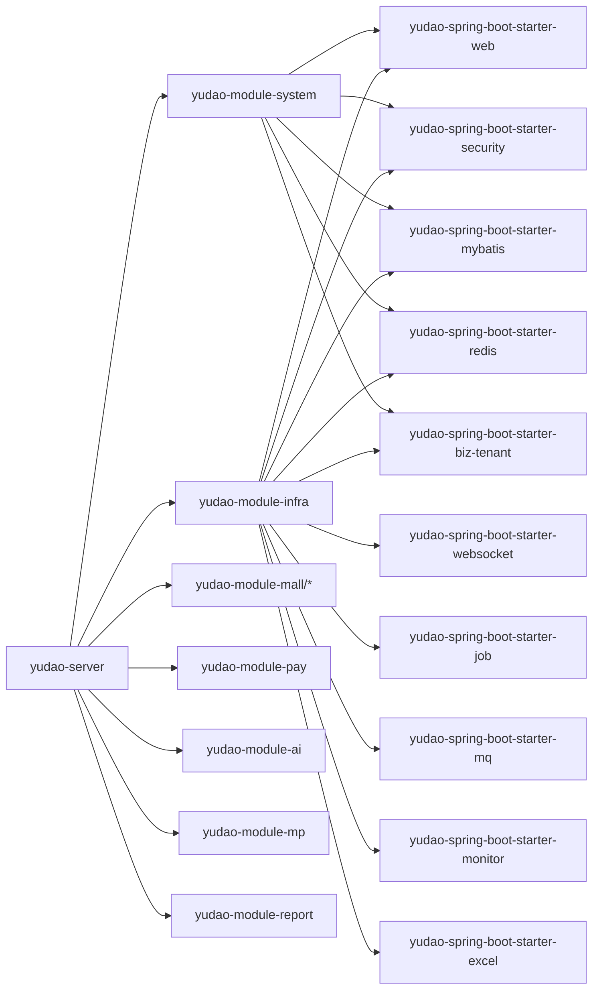

# 整体架构设计

<cite>
**本文引用的文件**
- [backend/pom.xml](file://backend/pom.xml)
- [backend/yudao-framework/pom.xml](file://backend/yudao-framework/pom.xml)
- [backend/yudao-server/pom.xml](file://backend/yudao-server/pom.xml)
- [backend/yudao-server/src/main/java/cn/iocoder/yudao/server/YudaoServerApplication.java](file://backend/yudao-server/src/main/java/cn/iocoder/yudao/server/YudaoServerApplication.java)
- [backend/yudao-framework/yudao-spring-boot-starter-web/pom.xml](file://backend/yudao-framework/yudao-spring-boot-starter-web/pom.xml)
- [backend/yudao-framework/yudao-spring-boot-starter-security/pom.xml](file://backend/yudao-framework/yudao-spring-boot-starter-security/pom.xml)
- [backend/yudao-framework/yudao-spring-boot-starter-mybatis/pom.xml](file://backend/yudao-framework/yudao-spring-boot-starter-mybatis/pom.xml)
- [backend/yudao-framework/yudao-spring-boot-starter-redis/pom.xml](file://backend/yudao-framework/yudao-spring-boot-starter-redis/pom.xml)
- [backend/yudao-framework/yudao-spring-boot-starter-biz-tenant/pom.xml](file://backend/yudao-framework/yudao-spring-boot-starter-biz-tenant/pom.xml)
- [backend/yudao-module-system/pom.xml](file://backend/yudao-module-system/pom.xml)
- [backend/yudao-module-infra/pom.xml](file://backend/yudao-module-infra/pom.xml)
- [backend/README.md](file://backend/README.md)
</cite>

## 目录
1. [简介](#简介)
2. [项目结构](#项目结构)
3. [核心组件](#核心组件)
4. [架构总览](#架构总览)
5. [详细组件分析](#详细组件分析)
6. [依赖分析](#依赖分析)
7. [性能考量](#性能考量)
8. [故障排查指南](#故障排查指南)
9. [结论](#结论)
10. [附录](#附录)

## 简介
AgenticCPS 基于 yudao 框架构建，采用分层架构与模块化设计，融合 Spring Boot 自动配置与组件扫描机制，形成“框架组件 + 业务模块 + 服务容器”的整体架构。系统以 yudao-server 为主容器，通过引入 yudao-module-* 模块提供系统管理、基础设施、会员中心、支付、商城、AI、微信公众号、报表等能力；yudao-framework 提供安全、缓存、Web、作业调度、消息队列、Excel、监控、业务组件（多租户、数据权限、IP）等通用能力；yudao-dependencies 统一版本与依赖管理。

该架构强调：
- 分层清晰：表现层（Web）、业务层（Service）、数据访问层（MyBatis/Redis）
- 模块化：按领域拆分模块，高内聚低耦合
- 可插拔：通过 starter 组件与可选依赖实现能力开关
- 可扩展：支持多数据库、多租户、分布式缓存、消息队列与监控

章节来源
- [backend/README.md:223-296](file://backend/README.md#L223-L296)

## 项目结构
AgenticCPS 后端采用 Maven 多模块结构，顶层 POM 声明模块与版本管理，yudao-framework 定义框架组件，yudao-server 作为主服务容器，yudao-module-* 为具体业务模块。

图示来源
- [backend/pom.xml:10-24](file://backend/pom.xml#L10-L24)
- [backend/yudao-framework/pom.xml:12-31](file://backend/yudao-framework/pom.xml#L12-L31)
- [backend/yudao-server/pom.xml:23-107](file://backend/yudao-server/pom.xml#L23-L107)

章节来源
- [backend/pom.xml:1-175](file://backend/pom.xml#L1-L175)
- [backend/yudao-framework/pom.xml:1-47](file://backend/yudao-framework/pom.xml#L1-L47)
- [backend/yudao-server/pom.xml:1-130](file://backend/yudao-server/pom.xml#L1-L130)

## 核心组件
- yudao-dependencies：集中管理版本与依赖范围，确保一致性
- yudao-framework：提供 Web、安全、MyBatis、Redis、作业、消息队列、Excel、监控、业务组件等 starter，形成可复用的技术基座
- yudao-server：主服务容器，按需引入模块，打包为可执行 jar
- yudao-module-*：按领域划分的业务模块，如系统管理、基础设施、会员、支付、商城、AI、微信公众号、报表等

章节来源
- [backend/README.md:261-279](file://backend/README.md#L261-L279)
- [backend/yudao-framework/pom.xml:34-43](file://backend/yudao-framework/pom.xml#L34-L43)

## 架构总览
AgenticCPS 采用分层架构与模块化设计，结合 Spring Boot 自动配置与组件扫描，实现“容器 + 模块 + 组件”的组合式架构。

图示来源
- [backend/yudao-framework/yudao-spring-boot-starter-web/pom.xml:18-79](file://backend/yudao-framework/yudao-spring-boot-starter-web/pom.xml#L18-L79)
- [backend/yudao-framework/yudao-spring-boot-starter-security/pom.xml:21-62](file://backend/yudao-framework/yudao-spring-boot-starter-security/pom.xml#L21-L62)
- [backend/yudao-framework/yudao-spring-boot-starter-mybatis/pom.xml:18-108](file://backend/yudao-framework/yudao-spring-boot-starter-mybatis/pom.xml#L18-L108)
- [backend/yudao-framework/yudao-spring-boot-starter-redis/pom.xml:18-39](file://backend/yudao-framework/yudao-spring-boot-starter-redis/pom.xml#L18-L39)
- [backend/yudao-framework/yudao-spring-boot-starter-biz-tenant/pom.xml:18-81](file://backend/yudao-framework/yudao-spring-boot-starter-biz-tenant/pom.xml#L18-L81)
- [backend/yudao-module-system/pom.xml:20-122](file://backend/yudao-module-system/pom.xml#L20-L122)
- [backend/yudao-module-infra/pom.xml:21-117](file://backend/yudao-module-infra/pom.xml#L21-L117)

## 详细组件分析

### yudao 框架核心设计理念
- 组件化：每个 starter 仅关注单一职责，如 Web、安全、MyBatis、Redis、作业、消息队列、Excel、监控、业务组件（多租户、数据权限、IP）
- 可插拔：通过依赖引入决定能力启用与否，支持按需装配
- 可复用：公共能力下沉到 yudao-common 与各 starter，避免重复造轮子
- 易扩展：支持多数据库驱动、多数据源、分布式缓存、消息队列、监控等

章节来源
- [backend/yudao-framework/pom.xml:34-43](file://backend/yudao-framework/pom.xml#L34-L43)

### Spring Boot 自动配置与组件扫描
- 启动类：YudaoServerApplication 使用 @SpringBootApplication，并通过 scanBasePackages 指定扫描基础包，确保模块与 server 包被纳入组件扫描
- 自动配置：各 starter 内置条件化配置，满足依赖即生效
- 配置属性：通过 application.yaml 等配置文件加载，配合 starter 的配置类生效

图示来源
- [backend/yudao-server/src/main/java/cn/iocoder/yudao/server/YudaoServerApplication.java:16](file://backend/yudao-server/src/main/java/cn/iocoder/yudao/server/YudaoServerApplication.java#L16)

章节来源
- [backend/yudao-server/src/main/java/cn/iocoder/yudao/server/YudaoServerApplication.java:1-35](file://backend/yudao-server/src/main/java/cn/iocoder/yudao/server/YudaoServerApplication.java#L1-L35)

### 分层架构设计
- 表现层：Web 层负责请求接入、参数校验、统一异常处理、接口文档；安全层负责认证授权与操作日志
- 业务层：各模块内的 Service 负责业务编排与领域逻辑
- 数据访问层：MyBatis 负责数据库访问，Redis 负责缓存与分布式锁

图示来源
- [backend/yudao-framework/yudao-spring-boot-starter-web/pom.xml:18-79](file://backend/yudao-framework/yudao-spring-boot-starter-web/pom.xml#L18-L79)
- [backend/yudao-framework/yudao-spring-boot-starter-security/pom.xml:21-62](file://backend/yudao-framework/yudao-spring-boot-starter-security/pom.xml#L21-L62)
- [backend/yudao-framework/yudao-spring-boot-starter-mybatis/pom.xml:18-108](file://backend/yudao-framework/yudao-spring-boot-starter-mybatis/pom.xml#L18-L108)
- [backend/yudao-framework/yudao-spring-boot-starter-redis/pom.xml:18-39](file://backend/yudao-framework/yudao-spring-boot-starter-redis/pom.xml#L18-L39)

### 模块化设计原理
- 领域驱动：按业务域拆分模块，如系统管理、基础设施、会员、支付、商城、AI、微信公众号、报表
- 依赖倒置：上层模块仅依赖 yudao-framework 与 yudao-module-* 的抽象，减少耦合
- 可选装配：yudao-server 默认引入部分模块，未使用的模块可通过注释控制依赖，降低编译与启动时间

章节来源
- [backend/yudao-server/pom.xml:23-107](file://backend/yudao-server/pom.xml#L23-L107)
- [backend/yudao-module-system/pom.xml:14-18](file://backend/yudao-module-system/pom.xml#L14-L18)
- [backend/yudao-module-infra/pom.xml:14-19](file://backend/yudao-module-infra/pom.xml#L14-L19)

### 微服务架构模式说明
- 当前为单体多模块架构，通过 yudao-server 容器化所有模块
- 若未来演进为微服务，可在现有模块基础上抽取独立服务，保留 yudao 框架组件与配置方式不变，便于迁移与复用

章节来源
- [backend/README.md:261-279](file://backend/README.md#L261-L279)

## 依赖分析
yudao 框架通过 starter 与模块化依赖，形成清晰的依赖关系：

图示来源
- [backend/yudao-server/pom.xml:23-107](file://backend/yudao-server/pom.xml#L23-L107)
- [backend/yudao-module-system/pom.xml:20-122](file://backend/yudao-module-system/pom.xml#L20-L122)
- [backend/yudao-module-infra/pom.xml:21-117](file://backend/yudao-module-infra/pom.xml#L21-L117)
- [backend/yudao-framework/yudao-spring-boot-starter-web/pom.xml:18-79](file://backend/yudao-framework/yudao-spring-boot-starter-web/pom.xml#L18-L79)
- [backend/yudao-framework/yudao-spring-boot-starter-security/pom.xml:21-62](file://backend/yudao-framework/yudao-spring-boot-starter-security/pom.xml#L21-L62)
- [backend/yudao-framework/yudao-spring-boot-starter-mybatis/pom.xml:18-108](file://backend/yudao-framework/yudao-spring-boot-starter-mybatis/pom.xml#L18-L108)
- [backend/yudao-framework/yudao-spring-boot-starter-redis/pom.xml:18-39](file://backend/yudao-framework/yudao-spring-boot-starter-redis/pom.xml#L18-L39)
- [backend/yudao-framework/yudao-spring-boot-starter-biz-tenant/pom.xml:18-81](file://backend/yudao-framework/yudao-spring-boot-starter-biz-tenant/pom.xml#L18-L81)

章节来源
- [backend/pom.xml:1-175](file://backend/pom.xml#L1-L175)
- [backend/yudao-framework/pom.xml:1-47](file://backend/yudao-framework/pom.xml#L1-L47)

## 性能考量
- 启动与编译：通过注释化模块依赖减少默认编译时间，按需开启模块
- 数据库：支持多数据库与多数据源，结合连接池与 MyBatis Plus 提升吞吐
- 缓存：Redisson 提供分布式锁与高性能缓存，降低数据库压力
- 监控：集成 Spring Boot Admin 与 SkyWalking，实现可观测性
- 任务调度：Quartz 与异步任务满足离线处理与削峰填谷

章节来源
- [backend/README.md:326-336](file://backend/README.md#L326-L336)
- [backend/yudao-framework/yudao-spring-boot-starter-monitor/pom.xml:18-39](file://backend/yudao-framework/yudao-spring-boot-starter-monitor/pom.xml#L18-L39)

## 故障排查指南
- 启动问题：参考启动类注释中的文档链接定位常见问题
- 组件缺失：检查对应 starter 依赖是否引入，确认版本与 Spring Boot 兼容
- 数据库连接：核对多数据源配置与驱动依赖
- 缓存异常：确认 Redis 配置与连接信息
- 安全相关：核对安全 starter 的配置与权限注解使用

章节来源
- [backend/yudao-server/src/main/java/cn/iocoder/yudao/server/YudaoServerApplication.java:9-11](file://backend/yudao-server/src/main/java/cn/iocoder/yudao/server/YudaoServerApplication.java#L9-L11)

## 结论
AgenticCPS 以 yudao 框架为核心，采用分层与模块化设计，结合 Spring Boot 自动配置与组件扫描，形成高内聚、低耦合、可插拔、易扩展的整体架构。通过统一版本管理与丰富的 starter 组件，系统在保证开发效率的同时，具备良好的可维护性与可演进性。

## 附录
- 技术栈概览（节选）
  - 应用框架：Spring Boot 3.5.9、Spring Security 6.5.2、Spring AI（MCP 支持）
  - 数据访问：MyBatis Plus 3.5.12、多数据库驱动、动态数据源
  - 缓存与分布式：Redis、Redisson 3.35.0
  - 工作流：Flowable 7.0.0
  - 前端：Vue 3 + Element Plus、UniApp
  - 数据库：MySQL（支持 8 种数据库）
  - 任务调度：Quartz 2.5.0
  - 链路追踪：SkyWalking 9.5.0

章节来源
- [backend/README.md:280-296](file://backend/README.md#L280-L296)