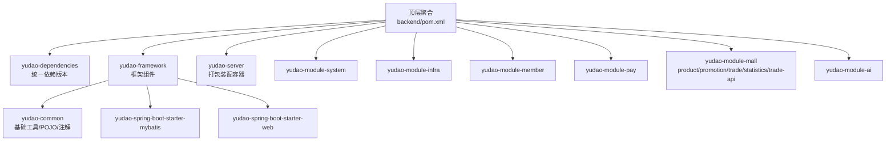
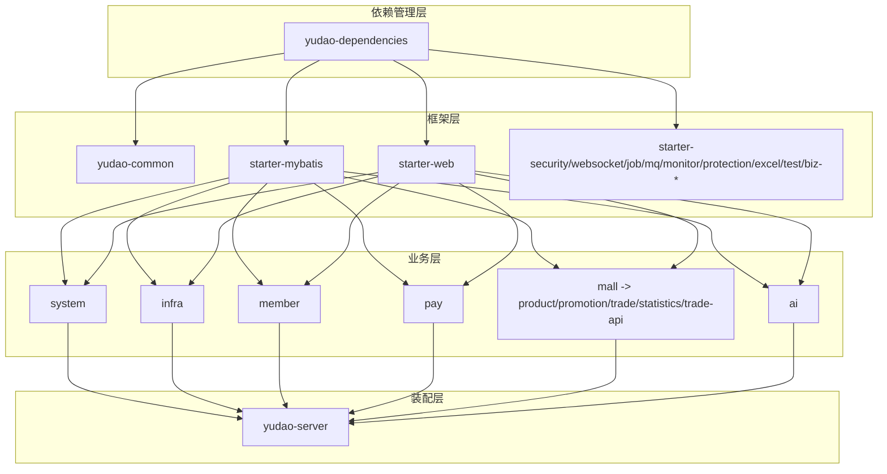
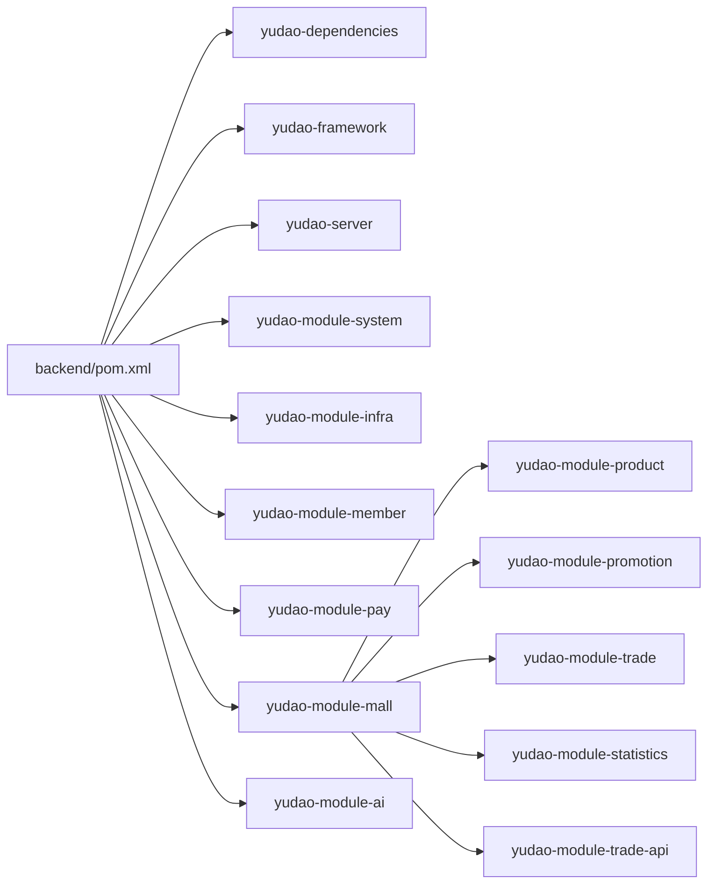

# 模块化架构

<cite>
**本文引用的文件**
- [backend/pom.xml](file://backend/pom.xml)
- [backend/yudao-dependencies/pom.xml](file://backend/yudao-dependencies/pom.xml)
- [backend/yudao-framework/pom.xml](file://backend/yudao-framework/pom.xml)
- [backend/yudao-framework/yudao-common/pom.xml](file://backend/yudao-framework/yudao-common/pom.xml)
- [backend/yudao-framework/yudao-spring-boot-starter-mybatis/pom.xml](file://backend/yudao-framework/yudao-spring-boot-starter-mybatis/pom.xml)
- [backend/yudao-framework/yudao-spring-boot-starter-web/pom.xml](file://backend/yudao-framework/yudao-spring-boot-starter-web/pom.xml)
- [backend/yudao-module-system/pom.xml](file://backend/yudao-module-system/pom.xml)
- [backend/yudao-module-infra/pom.xml](file://backend/yudao-module-infra/pom.xml)
- [backend/yudao-module-member/pom.xml](file://backend/yudao-module-member/pom.xml)
- [backend/yudao-module-pay/pom.xml](file://backend/yudao-module-pay/pom.xml)
- [backend/yudao-module-mall/pom.xml](file://backend/yudao-module-mall/pom.xml)
- [backend/yudao-module-mall/yudao-module-product/pom.xml](file://backend/yudao-module-mall/yudao-module-product/pom.xml)
- [backend/yudao-module-mall/yudao-module-promotion/pom.xml](file://backend/yudao-module-mall/yudao-module-promotion/pom.xml)
- [backend/yudao-module-mall/yudao-module-trade/pom.xml](file://backend/yudao-module-mall/yudao-module-trade/pom.xml)
- [backend/yudao-module-mall/yudao-module-statistics/pom.xml](file://backend/yudao-module-mall/yudao-module-statistics/pom.xml)
- [backend/yudao-module-mall/yudao-module-trade-api/pom.xml](file://backend/yudao-module-mall/yudao-module-trade-api/pom.xml)
- [backend/yudao-module-ai/pom.xml](file://backend/yudao-module-ai/pom.xml)
- [backend/yudao-server/pom.xml](file://backend/yudao-server/pom.xml)
</cite>

## 目录
1. [引言](#引言)
2. [项目结构](#项目结构)
3. [核心组件](#核心组件)
4. [架构总览](#架构总览)
5. [详细组件分析](#详细组件分析)
6. [依赖分析](#依赖分析)
7. [性能考虑](#性能考虑)
8. [故障排查指南](#故障排查指南)
9. [结论](#结论)
10. [附录](#附录)

## 引言
本文件面向 AgenticCPS（后端基于 Spring Boot 3 的多模块 Maven 项目），系统化阐述其模块化架构设计与实现。重点覆盖：
- yudao-dependencies 依赖管理策略
- yudao-framework 框架模块与技术/业务组件拆分
- 业务模块划分（system、member、pay、mall 子模块族、ai、infra 等）
- 模块间依赖关系、接口与契约、模块化带来的可维护性与可扩展性提升
- 版本管理策略、模块生命周期管理、模块化设计原则与最佳实践

## 项目结构
AgenticCPS 后端采用“顶层聚合 + 多模块”的 Maven 结构：
- 顶层 POM 声明模块清单与统一属性、插件与仓库配置
- yudao-dependencies 提供统一依赖版本与依赖管理
- yudao-framework 定义框架层组件（技术组件 + 业务组件）
- yudao-server 作为打包与装配容器，按需引入业务模块
- 业务模块按领域拆分，如 system、member、pay、mall（product/promotion/trade/statistics/trade-api）、ai、infra 等

图表来源
- [backend/pom.xml:10-24](file://backend/pom.xml#L10-L24)
- [backend/yudao-dependencies/pom.xml:16-82](file://backend/yudao-dependencies/pom.xml#L16-L82)
- [backend/yudao-framework/pom.xml:12-31](file://backend/yudao-framework/pom.xml#L12-L31)
- [backend/yudao-server/pom.xml:23-107](file://backend/yudao-server/pom.xml#L23-L107)

章节来源
- [backend/pom.xml:10-24](file://backend/pom.xml#L10-L24)
- [backend/yudao-framework/pom.xml:12-31](file://backend/yudao-framework/pom.xml#L12-L31)
- [backend/yudao-dependencies/pom.xml:16-82](file://backend/yudao-dependencies/pom.xml#L16-L82)

## 核心组件
- yudao-dependencies：集中管理第三方依赖版本与统一 BOM，确保跨模块一致性与升级可控
- yudao-framework：封装技术组件（如 mybatis、redis、web、security、websocket、job、mq、monitor、protection、excel、test、biz-tenant、biz-data-permission、biz-ip 等），形成可复用的“开箱即用”能力
- yudao-common：提供基础 POJO、枚举、工具类、注解与最小依赖集合，供框架与业务模块共享
- yudao-server：作为最终可执行包的装配容器，默认按需引入各业务模块依赖，便于按环境裁剪

章节来源
- [backend/yudao-dependencies/pom.xml:84-687](file://backend/yudao-dependencies/pom.xml#L84-L687)
- [backend/yudao-framework/pom.xml:33-44](file://backend/yudao-framework/pom.xml#L33-L44)
- [backend/yudao-framework/yudao-common/pom.xml:18-147](file://backend/yudao-framework/yudao-common/pom.xml#L18-L147)
- [backend/yudao-server/pom.xml:23-107](file://backend/yudao-server/pom.xml#L23-L107)

## 架构总览
模块化架构以“依赖管理 + 框架组件 + 业务模块 + 装配容器”为主线，形成清晰的层次与边界：
- 依赖管理层：yudao-dependencies 统一版本与依赖范围
- 框架层：yudao-framework 抽象出可复用的技术/业务组件
- 业务层：system、member、pay、mall（product/promotion/trade/statistics/trade-api）、ai、infra 等按领域划分
- 装配层：yudao-server 仅负责装配与打包，不承载业务逻辑

图表来源
- [backend/yudao-dependencies/pom.xml:84-687](file://backend/yudao-dependencies/pom.xml#L84-687)
- [backend/yudao-framework/pom.xml:12-31](file://backend/yudao-framework/pom.xml#L12-31)
- [backend/yudao-module-system/pom.xml:20-122](file://backend/yudao-module-system/pom.xml#L20-122)
- [backend/yudao-module-mall/pom.xml:20-33](file://backend/yudao-module-mall/pom.xml#L20-33)
- [backend/yudao-server/pom.xml:23-107](file://backend/yudao-server/pom.xml#L23-107)

## 详细组件分析

### yudao-dependencies：统一依赖与版本治理
- 作用：集中管理 Spring Boot、MyBatis、Redis、RocketMQ、SkyWalking、JustAuth、微信 SDK、Hutool、MapStruct、Guava 等依赖版本，并通过 dependencyManagement 导入到子模块
- 版本号：统一使用 ${revision}，顶层 POM 与 BOM 中均通过 flatten-maven-plugin 规范化输出
- 优势：避免版本漂移、简化升级成本、统一安全与漏洞修复节奏

章节来源
- [backend/pom.xml:46-56](file://backend/pom.xml#L46-L56)
- [backend/yudao-dependencies/pom.xml:16-82](file://backend/yudao-dependencies/pom.xml#L16-L82)
- [backend/yudao-dependencies/pom.xml:84-687](file://backend/yudao-dependencies/pom.xml#L84-L687)

### yudao-framework：技术与业务组件抽象
- 技术组件：mybatis、redis、web、security、websocket、job、mq、monitor、protection、excel、test 等
- 业务组件：biz-tenant、biz-data-permission、biz-ip 等
- 设计原则：每个 starter 模块聚焦单一能力域，依赖 yudao-common 提供最小公共依赖，降低业务模块耦合度

章节来源
- [backend/yudao-framework/pom.xml:12-31](file://backend/yudao-framework/pom.xml#L12-L31)
- [backend/yudao-framework/yudao-common/pom.xml:18-147](file://backend/yudao-framework/yudao-common/pom.xml#L18-L147)
- [backend/yudao-framework/yudao-spring-boot-starter-mybatis/pom.xml:18-108](file://backend/yudao-framework/yudao-spring-boot-starter-mybatis/pom.xml#L18-L108)
- [backend/yudao-framework/yudao-spring-boot-starter-web/pom.xml:18-79](file://backend/yudao-framework/yudao-spring-boot-starter-web/pom.xml#L18-L79)

### yudao-module-system：通用业务与基础设施入口
- 职责：用户、部门、权限、数据字典、验证码、社交登录、邮件等通用能力
- 依赖：依赖 infra（运维与研发工具）、security、validation、mybatis、redis、job、mq、excel、test 等
- 设计：作为上层业务模块（member、pay、mall 等）的共同基础

章节来源
- [backend/yudao-module-system/pom.xml:20-122](file://backend/yudao-module-system/pom.xml#L20-L122)

### yudao-module-infra：基础设施与研发工具
- 职责：定时任务、WebSocket、监控（Admin/SkyWalking）、代码生成、接口文档、S3/FTP/SFTP、文件类型识别等
- 依赖：mybatis、redis、security、websocket、job、mq、excel、monitor、test 等

章节来源
- [backend/yudao-module-infra/pom.xml:21-117](file://backend/yudao-module-infra/pom.xml#L21-L117)

### yudao-module-member：会员中心
- 职责：会员相关业务（示例：会员中心）
- 依赖：system、infra、security、validation、mybatis、redis、mq、excel、test、biz-ip 等

章节来源
- [backend/yudao-module-member/pom.xml:20-84](file://backend/yudao-module-member/pom.xml#L20-L84)

### yudao-module-pay：支付能力
- 职责：商户、应用、支付、退款等支付能力
- 依赖：system、security、mybatis、redis、job、excel、test，以及 Alipay/WeChat Pay SDK

章节来源
- [backend/yudao-module-pay/pom.xml:21-81](file://backend/yudao-module-pay/pom.xml#L21-L81)

### yudao-module-mall：电商子域（product/promotion/trade/statistics/trade-api）
- 设计要点：
  - product：品牌、商品分类、SPU/SKU 等
  - promotion：营销活动、广告、优惠券、优惠码等
  - trade：订单、退款、购物车等；与 promotion 通过 trade-api 解耦
  - statistics：商品/会员/交易统计
  - trade-api：抽取 trade 与 promotion 的公共接口，避免循环依赖
- 依赖关系：product 依赖 member；promotion 依赖 product、trade-api、system、infra、member；trade 依赖 trade-api、product、pay、promotion、member、system；statistics 依赖 promotion/product/trade-api/member/pay

章节来源
- [backend/yudao-module-mall/pom.xml:20-33](file://backend/yudao-module-mall/pom.xml#L20-L33)
- [backend/yudao-module-mall/yudao-module-product/pom.xml:20-56](file://backend/yudao-module-mall/yudao-module-product/pom.xml#L20-L56)
- [backend/yudao-module-mall/yudao-module-promotion/pom.xml:21-81](file://backend/yudao-module-mall/yudao-module-promotion/pom.xml#L21-L81)
- [backend/yudao-module-mall/yudao-module-trade/pom.xml:20-95](file://backend/yudao-module-mall/yudao-module-trade/pom.xml#L20-L95)
- [backend/yudao-module-mall/yudao-module-statistics/pom.xml:20-84](file://backend/yudao-module-mall/yudao-module-statistics/pom.xml#L20-L84)
- [backend/yudao-module-mall/yudao-module-trade-api/pom.xml:19-31](file://backend/yudao-module-mall/yudao-module-trade-api/pom.xml#L19-L31)

### yudao-module-ai：大模型与向量检索
- 职责：接入多种 LLM（OpenAI、通义、文心、智谱、DeepSeek、Ollama、Midjourney、StableDiffusion、Suno 等），支持聊天、绘图、音乐、写作、思维导图等；集成向量存储（Qdrant、Redis、Milvus）与内容解析（Tika）
- 依赖：system、infra、security、mybatis、job、excel、test；以及 Spring AI、Alibaba AI、TinyFlow 等生态

章节来源
- [backend/yudao-module-ai/pom.xml:28-262](file://backend/yudao-module-ai/pom.xml#L28-L262)

### yudao-server：装配与打包容器
- 职责：按需引入 system、infra、member、report、pay、mp、product/promotion/trade/statistics、ai 等模块，通过 spring-boot-maven-plugin 打包为可执行 jar
- 设计：默认注释部分模块依赖，保证编译速度与部署灵活性

章节来源
- [backend/yudao-server/pom.xml:23-127](file://backend/yudao-server/pom.xml#L23-L127)

## 依赖分析

### 模块依赖图（Maven 层级）

图表来源
- [backend/pom.xml:10-24](file://backend/pom.xml#L10-L24)
- [backend/yudao-module-mall/pom.xml:20-33](file://backend/yudao-module-mall/pom.xml#L20-L33)

### 模块间通信机制与接口契约
- trade 与 promotion 通过 trade-api 解耦，避免循环依赖：trade 依赖 trade-api 与 product/pay/promotion/member/system；promotion 依赖 product/trade-api/system/infra/member
- system 与 infra 作为通用基础，被 member、pay、mall、ai 等模块广泛依赖
- 业务组件（biz-tenant、biz-data-permission、biz-ip）通过 starter 形式注入，统一在 yudao-dependencies 中管理版本

章节来源
- [backend/yudao-module-mall/yudao-module-trade/pom.xml:21-45](file://backend/yudao-module-mall/yudao-module-trade/pom.xml#L21-L45)
- [backend/yudao-module-mall/yudao-module-promotion/pom.xml:22-46](file://backend/yudao-module-mall/yudao-module-promotion/pom.xml#L22-L46)
- [backend/yudao-module-mall/yudao-module-trade-api/pom.xml:19-31](file://backend/yudao-module-mall/yudao-module-trade-api/pom.xml#L19-L31)
- [backend/yudao-module-system/pom.xml:20-122](file://backend/yudao-module-system/pom.xml#L20-L122)
- [backend/yudao-module-member/pom.xml:20-84](file://backend/yudao-module-member/pom.xml#L20-L84)
- [backend/yudao-module-pay/pom.xml:21-81](file://backend/yudao-module-pay/pom.xml#L21-L81)
- [backend/yudao-module-ai/pom.xml:28-262](file://backend/yudao-module-ai/pom.xml#L28-L262)

### 模块职责划分表
- yudao-dependencies：统一依赖版本与 BOM
- yudao-framework：技术/业务组件封装
- yudao-common：基础工具与最小依赖
- yudao-server：装配与打包
- yudao-module-system：通用业务（用户/权限/字典/验证码/社交登录/邮件）
- yudao-module-infra：运维与研发工具（定时任务/WebSocket/监控/代码生成/文件客户端）
- yudao-module-member：会员中心
- yudao-module-pay：支付能力（商户/应用/支付/退款）
- yudao-module-mall：电商子域（product/promotion/trade/statistics/trade-api）
- yudao-module-ai：大模型与向量检索

章节来源
- [backend/yudao-dependencies/pom.xml:16-82](file://backend/yudao-dependencies/pom.xml#L16-L82)
- [backend/yudao-framework/pom.xml:33-44](file://backend/yudao-framework/pom.xml#L33-L44)
- [backend/yudao-module-system/pom.xml:15-18](file://backend/yudao-module-system/pom.xml#L15-L18)
- [backend/yudao-module-infra/pom.xml:16-19](file://backend/yudao-module-infra/pom.xml#L16-L19)
- [backend/yudao-module-member/pom.xml:15-18](file://backend/yudao-module-member/pom.xml#L15-L18)
- [backend/yudao-module-pay/pom.xml:15-18](file://backend/yudao-module-pay/pom.xml#L15-L18)
- [backend/yudao-module-mall/pom.xml:17-19](file://backend/yudao-module-mall/pom.xml#L17-L19)
- [backend/yudao-module-ai/pom.xml:15-20](file://backend/yudao-module-ai/pom.xml#L15-L20)

### 模块接口规范
- trade-api：抽取 trade 与 promotion 的公共接口，供双方调用，避免循环依赖
- 参数校验：通过 spring-boot-starter-validation 提供统一校验能力
- 统一错误码与日志：通过 web starter 的全局异常处理与日志脱敏能力

章节来源
- [backend/yudao-module-mall/yudao-module-trade-api/pom.xml:25-30](file://backend/yudao-module-mall/yudao-module-trade-api/pom.xml#L25-L30)
- [backend/yudao-framework/yudao-spring-boot-starter-web/pom.xml:42-48](file://backend/yudao-framework/yudao-spring-boot-starter-web/pom.xml#L42-L48)

## 性能考虑
- 依赖扁平化与版本收敛：通过 yudao-dependencies 集中管理，减少传递依赖层级与冲突
- 按需装配：yudao-server 默认注释非必要模块依赖，缩短编译时间并减小运行时体积
- 多数据源与连接池：starter-mybatis 提供 Druid 与动态数据源，结合 Redisson 优化缓存与分布式锁
- 监控与链路追踪：starter-monitor 集成 SkyWalking 与 Spring Boot Admin，便于定位性能瓶颈
- 向量检索与内容解析：AI 模块按需引入向量存储与 Tika，避免不必要的 IO 开销

## 故障排查指南
- 版本冲突：优先检查 yudao-dependencies 中对应依赖版本是否与业务模块显式声明一致
- 循环依赖：确认 trade 与 promotion 是否通过 trade-api 解耦
- 启动失败：检查 yudao-server 中被注释的模块依赖是否需要启用
- 安全与校验：若出现参数校验或鉴权异常，核对 system 与 web/security starter 的依赖是否齐全
- 监控与日志：若链路追踪或监控不可用，核对 monitor starter 与相关配置

章节来源
- [backend/yudao-dependencies/pom.xml:84-687](file://backend/yudao-dependencies/pom.xml#L84-L687)
- [backend/yudao-module-mall/yudao-module-trade/pom.xml:21-45](file://backend/yudao-module-mall/yudao-module-trade/pom.xml#L21-L45)
- [backend/yudao-module-mall/yudao-module-promotion/pom.xml:22-46](file://backend/yudao-module-mall/yudao-module-promotion/pom.xml#L22-L46)
- [backend/yudao-server/pom.xml:35-92](file://backend/yudao-server/pom.xml#L35-L92)

## 结论
AgenticCPS 的模块化架构通过“依赖管理 + 框架组件 + 业务模块 + 装配容器”的分层设计，实现了：
- 明确的职责边界与低耦合
- 可复用的技术/业务组件与统一版本治理
- 清晰的模块间通信契约（如 trade-api 解耦）
- 良好的可维护性与可扩展性，便于按需裁剪与演进

## 附录
- 模块化设计原则
  - 单一职责：每个模块聚焦特定业务域
  - 最小依赖：通过 yudao-common 与 starter 抽象公共能力
  - 松耦合：通过 trade-api 等接口契约避免循环依赖
  - 可装配：yudao-server 按需装配，支持不同环境的差异化部署
- 版本管理策略
  - 使用 ${revision} 统一版本号，通过 flatten-maven-plugin 规范化输出
  - 在 yudao-dependencies 中集中管理第三方依赖版本，避免分散配置
- 模块生命周期管理
  - 开发期：按需启用模块依赖，缩短编译时间
  - 集成期：统一依赖版本，确保多模块协同工作
  - 发布期：yudao-server 打包为可执行 jar，便于部署与运维